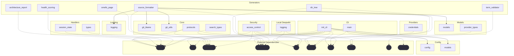

# Dependencies Overview

## External Dependencies

The following third-party libraries are required for the application to function:

| Dependency              | Version        | Purpose                                                                 |
|------------------------|----------------|-------------------------------------------------------------------------|
| `anthropic`            | >=0.40,<1.0.0  | Provides access to Anthropic's AI models, such as Claude.              |
| `flask`                | >=3.0,<4.0.0   | Web framework for building the application's API and UI.                |
| `LanceDB`              | >=0.15,<1.0.0  | Vector database for storing and querying embeddings.                    |
| `markdown`             | >=3.0,<4.0.0   | Library for parsing and rendering Markdown text.                        |
| `mcp`                  | >=1.2.0,<2.0.0 | Multi-Client Protocol for communication with LLMs and other services.   |
| `nh3`                  | >=0.2.14,<1.0.0| Sanitizes HTML content to prevent XSS attacks.                        |
| `ollama`               | >=0.4,<1.0.0   | Interface for running and interacting with local LLMs via Ollama.       |
| `openai`               | >=1.0,<2.0.0   | Official Python client for OpenAI's API.                                |
| `pandas`               | >=2.0,<3.0.0   | Data manipulation and analysis library.                                 |
| `psutil`               | >=5.0,<6.0.0   | System and process utilities for monitoring system resources.           |
| `pydantic`             | >=2.0,<3.0.0   | Data validation and settings management using Python type annotations.  |
| `pyyaml`               | >=6.0,<7.0.0   | YAML parser and emitter for configuration files.                        |
| `rapidfuzz`            | >=3.0,<4.0.0   | Fast fuzzy string matching and similarity scoring.                      |
| `rich`                 | >=13.0,<14.0.0 | Library for rich text and beautiful formatting in the terminal.         |
| `sentence-transformers`| >=3.0,<4.0.0   | Provides state-of-the-art sentence embeddings.                          |
| `tree-sitter`          | >=0.23         | Parser generator tool and API for parsing source code.                  |
| `tree-sitter-c`        | >=0.23         | Tree-sitter grammar for C language.                                     |
| `tree-sitter-c-sharp`  | >=0.23         | Tree-sitter grammar for C# language.                                    |
| `tree-sitter-cpp`      | >=0.23         | Tree-sitter grammar for C++ language.                                   |
| `tree-sitter-go`       | >=0.23         | Tree-sitter grammar for Go language.                                    |
| `tree-sitter-java`     | >=0.23         | Tree-sitter grammar for Java language.                                  |
| `tree-sitter-javascript`| >=0.23        | Tree-sitter grammar for JavaScript language.                            |
| `tree-sitter-kotlin`   | >=0.23         | Tree-sitter grammar for Kotlin language.                                |
| `tree-sitter-php`      | >=0.23         | Tree-sitter grammar for PHP language.                                   |
| `tree-sitter-python`   | >=0.23         | Tree-sitter grammar for Python language.                                |
| `tree-sitter-ruby`     | >=0.23         | Tree-sitter grammar for Ruby language.                                  |
| `tree-sitter-rust`     | >=0.23         | Tree-sitter grammar for Rust language.                                  |
| `tree-sitter-swift`    | >=0.0.1        | Tree-sitter grammar for Swift language.                                 |
| `tree-sitter-typescript`| >=0.23        | Tree-sitter grammar for TypeScript language.                            |
| `watchdog`             | >=4.0,<5.0.0   | File system event monitoring library.                                   |

## Dev Dependencies

The following dependencies are used for development and testing:

| Dependency            | Version       | Purpose                                                   |
|----------------------|---------------|-----------------------------------------------------------|
| `black`              | >=24.0        | Code formatter to enforce consistent style.               |
| `isort`              | >=5.0         | Sorts and formats import statements.                      |
| `local-deepwiki`     | [all]         | Internal package for local development.                   |
| `mypy`               | >=1.0         | Static type checker for Python.                           |
| `pip-audit`          | >=2.0         | Security audit tool for Python dependencies.              |
| `pre-commit`         | >=3.0         | Framework for managing and maintaining pre-commit hooks.  |
| `pypdf`              | >=6.6.1       | PDF parsing and manipulation library.                     |
| `pytest`             | >=8.0         | Testing framework for Python.                             |
| `pytest-asyncio`     | >=0.24,<1.0.0 | Plugin for testing async code with pytest.                |
| `types-Markdown`     | >=3.0         | Type stubs for the `markdown` library.                    |
| `types-PyYAML`       | >=6.0         | Type stubs for the `pyyaml` library.                      |
| `weasyprint`         | >=68.0,<69.0.0| HTML/CSS to PDF converter.                                |

## Internal Module Dependencies

Based on import statements, the following internal modules depend on each other:

- `src/local_deepwiki/providers/credentials.py` imports `os`
- `src/local_deepwiki/generators/wiki/term_validator.py` imports `re`
- `src/local_deepwiki/__init__.py` imports `importlib.metadata.version`
- `src/local_deepwiki/cli/main.py` imports `sys`, `rich.console.Console`, `rich.table.Table`, `importlib`
- `src/local_deepwiki/models/provider_types.py` imports `enum.StrEnum`
- `src/local_deepwiki/handlers/types.py` imports `typing.TypedDict`
- `src/local_deepwiki/cli/init_cli.py` imports various standard and third-party libraries including `argparse`, `os`, `sys`, `urllib.request`, `collections.Counter`, `dataclasses.dataclass`, `pathlib.Path`, `typing.Literal`, `yaml`, `rich.console.Console`, `rich.panel.Panel`, `rich.prompt.Prompt`, `rich.table.Table`, [`local_deepwiki.config.Config`](files/src/local_deepwiki/config/models.md), [`local_deepwiki.config.models.ParsingConfig`](files/src/local_deepwiki/config/models_wiki.md)
- `src/local_deepwiki/core/vectorstore/mixins/search_types.py` imports `dataclasses.dataclass` and [`local_deepwiki.core.vectorstore.schema.SearchProfile`](files/src/local_deepwiki/core/vectorstore/schema.md)
- `src/local_deepwiki/security/access_control.py` imports `asyncio`, `collections.abc.Callable`, `contextvars.ContextVar`, `dataclasses.dataclass`, `enum.StrEnum`, `functools.wraps`, `typing.Any`, `typing.TypeVar`, `os`
- `src/local_deepwiki/logging.py` imports `logging`, `os`, `sys`, `typing.Literal`
- `src/local_deepwiki/core/protocols.py` imports `collections.abc.Iterator`, `pathlib.Path`, `typing.Protocol`, `typing.runtime_checkable`
- `src/local_deepwiki/generators/wiki/source_formatter.py` imports `collections.abc.Callable`, `dataclasses.dataclass`, `operator.attrgetter`, `pathlib.Path`, [`local_deepwiki.core.git_blame.format_blame_date`](files/src/local_deepwiki/core/git_blame.md), [`local_deepwiki.core.git_blame.get_file_entity_blame`](files/src/local_deepwiki/core/git_blame.md), [`local_deepwiki.core.git_utils.GitRepoInfo`](files/src/local_deepwiki/core/git_utils.md), [`local_deepwiki.core.git_utils.build_source_url`](files/src/local_deepwiki/core/git_utils.md), [`local_deepwiki.logging.get_logger`](files/src/local_deepwiki/logging.md), [`local_deepwiki.models.ChunkType`](files/src/local_deepwiki/models/foundation.md), [`local_deepwiki.models.CodeChunk`](files/src/local_deepwiki/models/chunks.md)
- `src/local_deepwiki/generators/dir_tree.py` imports `dataclasses.dataclass`, `dataclasses.field`, `pathlib.Path`, `subprocess`

Additionally, several test files and helper modules import from internal modules:

- `tests/wiki_output_helpers.py` imports `hashlib`, `re`, `struct`, `collections.abc.AsyncIterator`, `pathlib.Path`, `typing.Any`, [`local_deepwiki.providers.base.EmbeddingProvider`](files/src/local_deepwiki/providers/base.md), [`local_deepwiki.providers.base.LLMProvider`](files/src/local_deepwiki/providers/base.md)
- `tests/fixtures/sample_repo/lib/external.py` imports `typing.Any`
- `src/local_deepwiki/generators/analysis/health_scoring.py` imports `typing.Any`
- `src/local_deepwiki/generators/analysis/architecture_report.py` imports `typing.Any`
- `src/local_deepwiki/handlers/session_state.py` imports `typing.Any`
- `src/local_deepwiki/generators/analysis/smells_page.py` imports `collections.defaultdict`
- `tests/fixtures/sample_repo/src/parser.py` imports `typing.Any`, `src.models.User`, `json`, `pathlib.Path`
- `tests/fixtures/sample_repo/src/sub/processor.py` imports `typing.Any`, `src.models.Order`, `src.models.User`
- `tests/fixtures/sample_repo/src/utils.py` imports `hashlib`, `re`
- `tests/fixtures/sample_repo/tests/test_parser.py` imports `pytest`, `src.models.User`, `src.parser.DataParser`

## Module Dependency Graph

The following diagram shows module dependencies. Click on a module to view its documentation. External dependencies are shown with dashed borders.

```mermaid
flowchart TD
    subgraph cli[Cli]
        M0[init_cli]
        M1[main]
    end
    subgraph config[Config]
        M2[config]
        M3[models]
    end
    subgraph core[Core]
        M4[git_blame]
        M5[git_utils]
        M6[protocols]
        M7[search_types]
    end
    subgraph generators[Generators]
        M8[architecture_report]
        M9[health_scoring]
        M10[smells_page]
        M11[dir_tree]
        M12[source_formatter]
        M13[term_validator]
    end
    subgraph handlers[Handlers]
        M14[session_state]
        M15[types]
    end
    subgraph local_deepwiki[Local Deepwiki]
        M16[logging]
    end
    subgraph logging[Logging]
        M17[logging]
    end
    subgraph models[Models]
        M18[models]
        M19[provider_types]
    end
    subgraph providers[Providers]
        M20[credentials]
    end
    subgraph security[Security]
        M21[access_control]
    end
    subgraph external[External Dependencies]
        E0([typing]):::external
        E1([rich]):::external
        E2([collections]):::external
        E3([dataclasses]):::external
        E4([os]):::external
        E5([pathlib]):::external
        E6([sys]):::external
        E7([enum]):::external
        E8([re]):::external
        E9([importlib]):::external
    end
    M0 --> M2
    M0 --> M3
    M12 --> M4
    M12 --> M5
    M12 --> M17
    M12 --> M18
    M0 -.-> E2
    M0 -.-> E3
    M0 -.-> E4
    M0 -.-> E5
    M0 -.-> E1
    M0 -.-> E6
    M0 -.-> E0
    M1 -.-> E9
    M1 -.-> E1
    M1 -.-> E6
    M6 -.-> E2
    M6 -.-> E5
    M6 -.-> E0
    M7 -.-> E3
    M8 -.-> E0
    M9 -.-> E0
    M10 -.-> E2
    M11 -.-> E3
    M11 -.-> E5
    M12 -.-> E2
    M12 -.-> E3
    M12 -.-> E5
    M13 -.-> E8
    M14 -.-> E0
    M15 -.-> E0
    M16 -.-> E4
    M16 -.-> E6
    M16 -.-> E0
    M19 -.-> E7
    M20 -.-> E4
    M21 -.-> E2
    M21 -.-> E3
    M21 -.-> E7
    M21 -.-> E4
    M21 -.-> E0
    click M0 "files/src/local_deepwiki/cli/init_cli.md"
    click M1 "files/src/local_deepwiki/cli/main.md"
    click M2 "files/src/local_deepwiki/config.md"
    click M3 "files/src/local_deepwiki/config/models.md"
    click M4 "files/src/local_deepwiki/core/git_blame.md"
    click M5 "files/src/local_deepwiki/core/git_utils.md"
    click M6 "files/src/local_deepwiki/core/protocols.md"
    click M7 "files/src/local_deepwiki/core/vectorstore/mixins/search_types.md"
    click M8 "files/src/local_deepwiki/generators/analysis/architecture_report.md"
    click M9 "files/src/local_deepwiki/generators/analysis/health_scoring.md"
    click M10 "files/src/local_deepwiki/generators/analysis/smells_page.md"
    click M11 "files/src/local_deepwiki/generators/dir_tree.md"
    click M12 "files/src/local_deepwiki/generators/wiki/source_formatter.md"
    click M13 "files/src/local_deepwiki/generators/wiki/term_validator.md"
    click M14 "files/src/local_deepwiki/handlers/session_state.md"
    click M15 "files/src/local_deepwiki/handlers/types.md"
    click M16 "files/src/local_deepwiki/local_deepwiki/logging.md"
    click M17 "files/src/local_deepwiki/logging.md"
    click M18 "files/src/local_deepwiki/models.md"
    click M19 "files/src/local_deepwiki/models/provider_types.md"
    click M20 "files/src/local_deepwiki/providers/credentials.md"
    click M21 "files/src/local_deepwiki/security/access_control.md"
    classDef external fill:#2d2d3d,stroke:#666,stroke-dasharray: 5 5
```

## Relevant Source Files

The following source files were used to generate this documentation:

- [`src/local_deepwiki/providers/credentials.py:12-80`](files/src/local_deepwiki/providers/credentials.md)
- [`src/local_deepwiki/generators/wiki/term_validator.py:43-82`](files/src/local_deepwiki/generators/wiki/term_validator.md)
- `src/local_deepwiki/__init__.py`
- [`src/local_deepwiki/generators/analysis/health_scoring.py:29-34`](files/src/local_deepwiki/generators/analysis/health_scoring.md)
- [`src/local_deepwiki/generators/analysis/architecture_report.py:15-36`](files/src/local_deepwiki/generators/analysis/architecture_report.md)
- [`src/local_deepwiki/handlers/session_state.py:20-27`](files/src/local_deepwiki/handlers/session_state.md)
- [`src/local_deepwiki/generators/analysis/smells_page.py:25-31`](files/src/local_deepwiki/generators/analysis/smells_page.md)
- [`src/local_deepwiki/cli/main.py:57-90`](files/src/local_deepwiki/cli/main.md)
- [`src/local_deepwiki/models/provider_types.py:8-13`](files/src/local_deepwiki/models/provider_types.md)
- [`src/local_deepwiki/handlers/types.py:8-18`](files/src/local_deepwiki/handlers/types.md)

*Showing 10 of 17 source files.*
