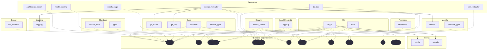

# Dependencies Overview

## External Dependencies

| Dependency | Purpose |
|------------|---------|
| `anthropic` (>=0.40,<1.0.0) | Provides access to Anthropic's AI models, likely used for natural language processing and generation tasks. |
| `flask` (>=3.0,<4.0.0) | Web framework for building the application's HTTP API and web interface. |
| `LanceDB` (>=0.15,<1.0.0) | Vector database for storing and querying embeddings, used for semantic search capabilities. |
| `markdown` (>=3.0,<4.0.0) | Library for parsing and rendering Markdown text into HTML. |
| `mcp` (>=1.2.0,<2.0.0) | Likely used for managing model configuration or communication with language models. |
| `nh3` (>=0.2.14,<1.0.0) | HTML sanitization library to clean and validate HTML content. |
| `ollama` (>=0.4,<1.0.0) | Interface to Ollama's local LLM inference engine for running models locally. |
| `openai` (>=1.0,<2.0.0) | Client library for interacting with OpenAI's API for language model access. |
| `pandas` (>=2.0,<3.0.0) | Data manipulation and analysis library, used for handling structured data. |
| `psutil` (>=5.0,<6.0.0) | System and process utilities for monitoring system resources. |
| `pydantic` (>=2.0,<3.0.0) | Data validation and settings management using Python type annotations. |
| `pyyaml` (>=6.0,<7.0.0) | YAML parser and emitter for configuration files and data serialization. |
| `rapidfuzz` (>=3.0,<4.0.0) | Fast fuzzy string matching and similarity scoring library. |
| `rich` (>=13.0,<14.0.0) | Library for rich text and beautiful formatting in the terminal. |
| `sentence-transformers` (>=3.0,<4.0.0) | Library for computing sentence embeddings for semantic similarity. |
| `tree-sitter` (>=0.23) | General-purpose parsing library for parsing source code into syntax trees. |
| `tree-sitter-c` (>=0.23) | Tree-sitter parser for C language. |
| `tree-sitter-c-sharp` (>=0.23) | Tree-sitter parser for C# language. |
| `tree-sitter-cpp` (>=0.23) | Tree-sitter parser for C++ language. |
| `tree-sitter-go` (>=0.23) | Tree-sitter parser for Go language. |
| `tree-sitter-java` (>=0.23) | Tree-sitter parser for Java language. |
| `tree-sitter-javascript` (>=0.23) | Tree-sitter parser for JavaScript language. |
| `tree-sitter-kotlin` (>=0.23) | Tree-sitter parser for Kotlin language. |
| `tree-sitter-objc` (>=3.0) | Tree-sitter parser for Objective-C language. |
| `tree-sitter-php` (>=0.23) | Tree-sitter parser for PHP language. |
| `tree-sitter-python` (>=0.23) | Tree-sitter parser for Python language. |
| `tree-sitter-ruby` (>=0.23) | Tree-sitter parser for Ruby language. |
| `tree-sitter-rust` (>=0.23) | Tree-sitter parser for Rust language. |
| `tree-sitter-swift` (>=0.0.1) | Tree-sitter parser for Swift language. |
| `tree-sitter-typescript` (>=0.23) | Tree-sitter parser for TypeScript language. |

## Dev Dependencies

| Dependency | Purpose |
|------------|---------|
| `black` (>=24.0) | Code formatter to enforce consistent Python style. |
| `isort` (>=5.0) | Tool to sort and organize import statements. |
| `local-deepwiki ([all])` | Development package for local installation of the project. |
| `mypy` (>=1.0) | Static type checker for Python. |
| `pip-audit` (>=2.0) | Security audit tool for Python dependencies. |
| `pre-commit` (>=3.0) | Framework for managing and maintaining pre-commit hooks. |
| `pypdf` (>=6.6.1) | Library for working with PDF files. |
| `pytest` (>=8.0) | Testing framework for Python. |
| `pytest-asyncio` (>=0.24,<1.0.0) | Plugin for pytest to support asynchronous tests. |
| `types-Markdown` (>=3.0) | Type stubs for the `markdown` library. |
| `types-PyYAML` (>=6.0) | Type stubs for the `pyyaml` library. |
| `weasyprint` (>=68.0,<69.0.0) | Library for converting HTML to PDF. |

## Internal Module Dependencies

- `src/local_deepwiki/providers/credentials.py` imports `os`
- `src/local_deepwiki/generators/wiki/term_validator.py` imports `re`
- `src/local_deepwiki/__init__.py` imports `importlib.metadata.version`
- `src/local_deepwiki/cli/main.py` imports `sys`, `rich.console.Console`, `rich.table.Table`, `importlib`
- `src/local_deepwiki/models/provider_types.py` imports `enum.StrEnum`
- `src/local_deepwiki/handlers/types.py` imports `typing.TypedDict`
- `src/local_deepwiki/cli/init_cli.py` imports `argparse`, `os`, `sys`, `urllib.request`, `collections.Counter`, `dataclasses.dataclass`, `pathlib.Path`, `typing.Literal`, `yaml`, `rich.console.Console`, `rich.panel.Panel`, `rich.prompt.Prompt`, `rich.table.Table`, [`local_deepwiki.config.Config`](files/src/local_deepwiki/config/models.md), [`local_deepwiki.config.models.ParsingConfig`](files/src/local_deepwiki/config/models_wiki.md)
- `src/local_deepwiki/core/vectorstore/mixins/search_types.py` imports `dataclasses.dataclass`, [`local_deepwiki.core.vectorstore.schema.SearchProfile`](files/src/local_deepwiki/core/vectorstore/schema.md)
- `src/local_deepwiki/security/access_control.py` imports `asyncio`, `collections.abc.Callable`, `contextvars.ContextVar`, `dataclasses.dataclass`, `enum.StrEnum`, `functools.wraps`, `typing.Any`, `typing.TypeVar`, `os`
- `src/local_deepwiki/logging.py` imports `logging`, `os`, `sys`, `typing.Literal`
- `src/local_deepwiki/core/protocols.py` imports `collections.abc.Iterator`, `pathlib.Path`, `typing.Protocol`, `typing.runtime_checkable`
- `src/local_deepwiki/generators/wiki/source_formatter.py` imports `collections.abc.Callable`, `dataclasses.dataclass`, `operator.attrgetter`, `pathlib.Path`, [`local_deepwiki.core.git_blame.format_blame_date`](files/src/local_deepwiki/core/git_blame.md), [`local_deepwiki.core.git_blame.get_file_entity_blame`](files/src/local_deepwiki/core/git_blame.md), [`local_deepwiki.core.git_utils.GitRepoInfo`](files/src/local_deepwiki/core/git_utils.md), [`local_deepwiki.core.git_utils.build_source_url`](files/src/local_deepwiki/core/git_utils.md), [`local_deepwiki.logging.get_logger`](files/src/local_deepwiki/logging.md), [`local_deepwiki.models.ChunkType`](files/src/local_deepwiki/models/foundation.md), [`local_deepwiki.models.CodeChunk`](files/src/local_deepwiki/models/chunks.md)
- `src/local_deepwiki/generators/dir_tree.py` imports `dataclasses.dataclass`, `dataclasses.field`, `pathlib.Path`, `subprocess`

### Cross-Module Dependencies

- [`WikiGenerator`](files/src/local_deepwiki/generators/wiki/generator.md) depends on [`VectorStore`](files/src/local_deepwiki/core/vectorstore/store.md)
- `SourceFormatter` depends on [`GitRepoInfo`](files/src/local_deepwiki/core/git_utils.md), [`build_source_url`](files/src/local_deepwiki/core/git_utils.md), [`format_blame_date`](files/src/local_deepwiki/core/git_blame.md), [`get_file_entity_blame`](files/src/local_deepwiki/core/git_blame.md)
- `AccessControl` depends on `ContextVar`, `Callable`, `StrEnum`, `TypeVar`
- `CLI` depends on [`Config`](files/src/local_deepwiki/config/models.md), [`ParsingConfig`](files/src/local_deepwiki/config/models_wiki.md), `Console`, `Panel`, `Prompt`, `Table`
- [`SearchProfile`](files/src/local_deepwiki/core/vectorstore/schema.md) is used by `SearchTypesMixin`
- `Logging` is used by `SourceFormatter`
- `Protocols` are used by modules requiring protocol-based interfaces
- `ProviderTypes` is used by modules that need to define provider types
- `Types` is used by `Handlers` and other modules for type definitions
- `Credentials` is used by modules requiring access to credentials
- `TermValidator` is used by wiki generation modules
- `InitCLI` is used by main CLI entry point
- `DirTree` is used by modules requiring directory tree generation
- `Security` is used by modules requiring access control logic

Note: Some dependencies are inferred from import statements and are not explicitly declared in the manifest. The internal module dependencies are limited to what is visible in the import statements provided.

## Module Dependency Graph

The following diagram shows module dependencies. Click on a module to view its documentation. External dependencies are shown with dashed borders.

```mermaid
flowchart TD
    subgraph cli[Cli]
        M0[init_cli]
        M1[main]
    end
    subgraph config[Config]
        M2[config]
        M3[models]
    end
    subgraph core[Core]
        M4[git_blame]
        M5[git_utils]
        M6[protocols]
        M7[search_types]
    end
    subgraph export[Export]
        M8[toc_renderer]
    end
    subgraph generators[Generators]
        M9[architecture_report]
        M10[health_scoring]
        M11[smells_page]
        M12[dir_tree]
        M13[source_formatter]
        M14[term_validator]
    end
    subgraph handlers[Handlers]
        M15[session_state]
        M16[types]
    end
    subgraph local_deepwiki[Local Deepwiki]
        M17[logging]
    end
    subgraph logging[Logging]
        M18[logging]
    end
    subgraph models[Models]
        M19[models]
        M20[provider_types]
    end
    subgraph providers[Providers]
        M21[credentials]
    end
    subgraph security[Security]
        M22[access_control]
    end
    subgraph external[External Dependencies]
        E0([typing]):::external
        E1([rich]):::external
        E2([collections]):::external
        E3([dataclasses]):::external
        E4([os]):::external
        E5([pathlib]):::external
        E6([sys]):::external
        E7([enum]):::external
        E8([re]):::external
        E9([importlib]):::external
    end
    M0 --> M2
    M0 --> M3
    M13 --> M4
    M13 --> M5
    M13 --> M18
    M13 --> M19
    M0 -.-> E2
    M0 -.-> E3
    M0 -.-> E4
    M0 -.-> E5
    M0 -.-> E1
    M0 -.-> E6
    M0 -.-> E0
    M1 -.-> E9
    M1 -.-> E1
    M1 -.-> E6
    M6 -.-> E2
    M6 -.-> E5
    M6 -.-> E0
    M7 -.-> E3
    M8 -.-> E0
    M9 -.-> E0
    M10 -.-> E0
    M11 -.-> E2
    M12 -.-> E3
    M12 -.-> E5
    M13 -.-> E2
    M13 -.-> E3
    M13 -.-> E5
    M14 -.-> E8
    M15 -.-> E0
    M16 -.-> E0
    M17 -.-> E4
    M17 -.-> E6
    M17 -.-> E0
    M20 -.-> E7
    M21 -.-> E4
    M22 -.-> E2
    M22 -.-> E3
    M22 -.-> E7
    M22 -.-> E4
    M22 -.-> E0
    click M0 "files/src/local_deepwiki/cli/init_cli.md"
    click M1 "files/src/local_deepwiki/cli/main.md"
    click M2 "files/src/local_deepwiki/config.md"
    click M3 "files/src/local_deepwiki/config/models.md"
    click M4 "files/src/local_deepwiki/core/git_blame.md"
    click M5 "files/src/local_deepwiki/core/git_utils.md"
    click M6 "files/src/local_deepwiki/core/protocols.md"
    click M7 "files/src/local_deepwiki/core/vectorstore/mixins/search_types.md"
    click M8 "files/src/local_deepwiki/export/toc_renderer.md"
    click M9 "files/src/local_deepwiki/generators/analysis/architecture_report.md"
    click M10 "files/src/local_deepwiki/generators/analysis/health_scoring.md"
    click M11 "files/src/local_deepwiki/generators/analysis/smells_page.md"
    click M12 "files/src/local_deepwiki/generators/dir_tree.md"
    click M13 "files/src/local_deepwiki/generators/wiki/source_formatter.md"
    click M14 "files/src/local_deepwiki/generators/wiki/term_validator.md"
    click M15 "files/src/local_deepwiki/handlers/session_state.md"
    click M16 "files/src/local_deepwiki/handlers/types.md"
    click M17 "files/src/local_deepwiki/local_deepwiki/logging.md"
    click M18 "files/src/local_deepwiki/logging.md"
    click M19 "files/src/local_deepwiki/models.md"
    click M20 "files/src/local_deepwiki/models/provider_types.md"
    click M21 "files/src/local_deepwiki/providers/credentials.md"
    click M22 "files/src/local_deepwiki/security/access_control.md"
    classDef external fill:#2d2d3d,stroke:#666,stroke-dasharray: 5 5
```

## Relevant Source Files

The following source files were used to generate this documentation:

- [`src/local_deepwiki/providers/credentials.py:12-80`](files/src/local_deepwiki/providers/credentials.md)
- [`src/local_deepwiki/generators/wiki/term_validator.py:43-82`](files/src/local_deepwiki/generators/wiki/term_validator.md)
- `src/local_deepwiki/__init__.py`
- [`src/local_deepwiki/generators/analysis/architecture_report.py:15-36`](files/src/local_deepwiki/generators/analysis/architecture_report.md)
- [`src/local_deepwiki/handlers/session_state.py:20-27`](files/src/local_deepwiki/handlers/session_state.md)
- [`src/local_deepwiki/generators/analysis/health_scoring.py:34-39`](files/src/local_deepwiki/generators/analysis/health_scoring.md)
- [`src/local_deepwiki/export/toc_renderer.py:8-17`](files/src/local_deepwiki/export/toc_renderer.md)
- [`src/local_deepwiki/generators/analysis/smells_page.py:25-31`](files/src/local_deepwiki/generators/analysis/smells_page.md)
- [`src/local_deepwiki/cli/main.py:57-90`](files/src/local_deepwiki/cli/main.md)
- [`src/local_deepwiki/models/provider_types.py:8-13`](files/src/local_deepwiki/models/provider_types.md)

*Showing 10 of 18 source files.*
