# Dependencies Overview

## External Dependencies

The project relies on the following third-party libraries:

### AI and Machine Learning
- **anthropic** (>=0.40) - Anthropic Claude API client for AI interactions
- **openai** (>=1.0) - OpenAI API client for language models and embeddings
- **ollama** (>=0.4) - Local LLM inference server client
- **sentence-transformers** (>=3.0) - Sentence embedding models for semantic similarity

### Data Processing and Storage
- **lancedb** (>=0.15) - Vector database for storing and querying embeddings
- **pandas** (>=2.0) - Data manipulation and analysis library
- **pydantic** (>=2.0) - Data validation and serialization

### Code Analysis
- **tree-sitter** (>=0.23) - Syntax tree parsing library
- **tree-sitter-c** (>=0.23) - C language parser
- **tree-sitter-c-sharp** (>=0.23) - C# language parser
- **tree-sitter-cpp** (>=0.23) - C++ language parser
- **tree-sitter-go** (>=0.23) - Go language parser
- **tree-sitter-java** (>=0.23) - Java language parser
- **tree-sitter-javascript** (>=0.23) - JavaScript language parser
- **tree-sitter-kotlin** (>=0.23) - Kotlin language parser
- **tree-sitter-php** (>=0.23) - PHP language parser
- **tree-sitter-python** (>=0.23) - Python language parser
- **tree-sitter-ruby** (>=0.23) - Ruby language parser
- **tree-sitter-rust** (>=0.23) - Rust language parser
- **tree-sitter-swift** (>=0.0.1) - Swift language parser
- **tree-sitter-typescript** (>=0.23) - TypeScript language parser

### Web and Export
- **flask** (>=3.0) - Web framework for HTTP API
- **weasyprint** (>=62.0) - HTML to PDF conversion

### Utilities
- **markdown** (>=3.0) - Markdown processing and conversion
- **mcp** (>=1.2.0) - Model Context Protocol implementation
- **pyyaml** (>=6.0) - YAML parsing and generation
- **rich** (>=13.0) - Rich text and beautiful formatting in terminal
- **watchdog** (>=4.0) - File system monitoring

## Dev Dependencies

Development and testing tools:

- **black** (>=24.0) - Code formatter
- **isort** (>=5.0) - Import statement organizer
- **mypy** (>=1.0) - Static type checker
- **pre-commit** (>=3.0) - Git pre-commit hooks
- **pytest** (>=8.0) - Testing framework
- **pytest-asyncio** (>=0.24) - Async testing support
- **types-Markdown** (>=3.0) - Type stubs for Markdown
- **types-PyYAML** (>=6.0) - Type stubs for PyYAML

## Internal Module Dependencies

Based on the import statements, the internal module structure shows the following relationships:

### Core Components
- **[CodeParser](files/src/local_deepwiki/core/parser.md)** is used by [CodeChunker](files/src/local_deepwiki/core/chunker.md), [APIDocExtractor](files/src/local_deepwiki/generators/api_docs.md), and various generators
- **[VectorStore](files/src/local_deepwiki/core/vectorstore.md)** depends on [EmbeddingProvider](files/src/local_deepwiki/providers/base.md) for embedding operations
- **[CodeChunker](files/src/local_deepwiki/core/chunker.md)** uses [CodeParser](files/src/local_deepwiki/core/parser.md) for syntax analysis and tree-sitter for AST parsing

### Provider Architecture
- **[EmbeddingProvider](files/src/local_deepwiki/providers/base.md)** serves as base class for [LocalEmbeddingProvider](files/src/local_deepwiki/providers/embeddings/local.md) and [OpenAIEmbeddingProvider](files/src/local_deepwiki/providers/embeddings/openai.md)
- **[LLMProvider](files/src/local_deepwiki/providers/base.md)** provides base interface for language model providers
- Provider initialization depends on configuration management

### Generator Dependencies
- **[APIDocExtractor](files/src/local_deepwiki/generators/api_docs.md)** uses [CodeParser](files/src/local_deepwiki/core/parser.md) for extracting API documentation from code
- Cross-link generators depend on [WikiPage](files/src/local_deepwiki/models.md) and [CodeChunk](files/src/local_deepwiki/models.md) models
- See-also generators use [RelationshipAnalyzer](files/src/local_deepwiki/generators/see_also.md) and [FileRelationships](files/src/local_deepwiki/generators/see_also.md)
- Diagram generators depend on [CodeChunk](files/src/local_deepwiki/models.md) and [IndexStatus](files/src/local_deepwiki/models.md) models
- Test example generators work with [UsageExample](files/src/local_deepwiki/generators/test_examples.md) extraction

### Export System
- **[HtmlExporter](files/src/local_deepwiki/export/html.md)** handles HTML export functionality
- Export system includes PDF export capabilities

### Handler Layer
- Server handlers coordinate between core components for operations like indexing, searching, and wiki generation
- Handlers depend on various generators and core services

### Models
- Core data models ([WikiPage](files/src/local_deepwiki/models.md), [CodeChunk](files/src/local_deepwiki/models.md), [Language](files/src/local_deepwiki/models.md), [ChunkType](files/src/local_deepwiki/models.md)) are used throughout the system
- Configuration models support the provider and chunking systems

## Module Dependency Graph

The following diagram shows module dependencies. Click on a module to view its documentation. External dependencies are shown with dashed borders.

```mermaid
flowchart TD
    subgraph config[Config]
        M0[config]
    end
    subgraph core[Core]
        M1[chunker]
        M2[deep_research]
        M3[git_utils]
        M4[indexer]
        M5[llm_cache]
        M6[parser]
        M7[vectorstore]
    end
    subgraph export[Export]
        M8[html]
        M9[pdf]
    end
    subgraph generators[Generators]
        M10[api_docs]
        M11[callgraph]
        M12[changelog]
        M13[coverage]
        M14[crosslinks]
        M15[diagrams]
        M16[glossary]
        M17[inheritance]
        M18[manifest]
        M19[search]
        M20[see_also]
        M21[source_refs]
        M22[test_examples]
        M23[toc]
        M24[wiki]
        M25[wiki_files]
        M26[wiki_modules]
        M27[wiki_pages]
        M28[wiki_status]
    end
    subgraph handlers[Handlers]
        M29[handlers]
    end
    subgraph logging[Logging]
        M30[logging]
    end
    subgraph models[Models]
        M31[models]
    end
    subgraph providers[Providers]
        M32[base]
        M33[embeddings]
        M34[local]
        M35[openai]
        M36[llm]
    end
    subgraph server[Server]
        M37[server]
    end
    subgraph validation[Validation]
        M38[validation]
    end
    subgraph external[External Dependencies]
        E0([pathlib]):::external
        E1([typing]):::external
        E2([dataclasses]):::external
        E3([re]):::external
        E4([json]):::external
        E5([lancedb]):::external
        E6([time]):::external
        E7([asyncio]):::external
        E8([mcp]):::external
        E9([collections]):::external
    end
    M1 --> M0
    M1 --> M6
    M1 --> M30
    M1 --> M31
    M3 --> M30
    M4 --> M0
    M4 --> M1
    M4 --> M6
    M4 --> M7
    M4 --> M30
    M4 --> M31
    M4 --> M33
    M5 --> M0
    M5 --> M30
    M5 --> M32
    M7 --> M30
    M7 --> M31
    M7 --> M32
    M8 --> M30
    M9 --> M30
    M10 --> M1
    M10 --> M6
    M10 --> M31
    M11 --> M1
    M11 --> M6
    M11 --> M31
    M12 --> M3
    M12 --> M30
    M13 --> M7
    M13 --> M31
    M14 --> M31
    M15 --> M31
    M16 --> M7
    M16 --> M31
    M17 --> M7
    M17 --> M15
    M17 --> M31
    M18 --> M30
    M19 --> M31
    M20 --> M31
    M21 --> M31
    M24 --> M0
    M24 --> M3
    M24 --> M7
    M24 --> M13
    M24 --> M14
    M24 --> M16
    M24 --> M17
    M24 --> M18
    M24 --> M19
    M24 --> M20
    M24 --> M21
    M24 --> M23
    M24 --> M25
    M24 --> M26
    M24 --> M27
    M24 --> M28
    M24 --> M30
    M24 --> M31
    M24 --> M36
    M25 --> M0
    M25 --> M3
    M25 --> M7
    M25 --> M10
    M25 --> M11
    M25 --> M14
    M25 --> M15
    M25 --> M22
    M25 --> M28
    M25 --> M30
    M25 --> M31
    M25 --> M32
    M29 --> M0
    M29 --> M2
    M29 --> M4
    M29 --> M7
    M29 --> M8
    M29 --> M9
    M29 --> M24
    M29 --> M30
    M29 --> M31
    M29 --> M33
    M29 --> M36
    M29 --> M38
    M34 --> M32
    M35 --> M32
    M37 --> M29
    M37 --> M30
    M38 --> M31
    M0 -.-> E0
    M0 -.-> E1
    M1 -.-> E0
    M1 -.-> E1
    M3 -.-> E2
    M3 -.-> E0
    M3 -.-> E3
    M4 -.-> E4
    M4 -.-> E0
    M4 -.-> E6
    M5 -.-> E5
    M5 -.-> E0
    M5 -.-> E6
    M5 -.-> E1
    M7 -.-> E4
    M7 -.-> E5
    M7 -.-> E0
    M7 -.-> E1
    M8 -.-> E4
    M8 -.-> E0
    M8 -.-> E1
    M9 -.-> E4
    M9 -.-> E0
    M9 -.-> E3
    M9 -.-> E1
    M10 -.-> E2
    M10 -.-> E0
    M10 -.-> E3
    M11 -.-> E0
    M12 -.-> E9
    M12 -.-> E2
    M12 -.-> E0
    M13 -.-> E2
    M13 -.-> E0
    M14 -.-> E9
    M14 -.-> E2
    M14 -.-> E0
    M14 -.-> E3
    M15 -.-> E2
    M15 -.-> E0
    M15 -.-> E3
    M16 -.-> E2
    M16 -.-> E0
    M17 -.-> E2
    M17 -.-> E0
    M18 -.-> E2
    M18 -.-> E4
    M18 -.-> E0
    M18 -.-> E3
    M18 -.-> E1
    M19 -.-> E4
    M19 -.-> E0
    M19 -.-> E3
    M20 -.-> E9
    M20 -.-> E2
    M20 -.-> E0
    M20 -.-> E3
    M21 -.-> E0
    M21 -.-> E3
    M23 -.-> E2
    M23 -.-> E4
    M23 -.-> E0
    M23 -.-> E1
    M24 -.-> E7
    M24 -.-> E4
    M24 -.-> E0
    M24 -.-> E6
    M25 -.-> E7
    M25 -.-> E0
    M25 -.-> E3
    M25 -.-> E6
    M25 -.-> E1
    M29 -.-> E7
    M29 -.-> E4
    M29 -.-> E8
    M29 -.-> E0
    M29 -.-> E1
    M30 -.-> E1
    M31 -.-> E4
    M31 -.-> E0
    M31 -.-> E1
    M34 -.-> E1
    M37 -.-> E7
    M37 -.-> E8
    M37 -.-> E1
    M38 -.-> E1
    click M0 "files/src/local_deepwiki/config.md"
    click M1 "files/src/local_deepwiki/core/chunker.md"
    click M2 "files/src/local_deepwiki/core/deep_research.md"
    click M3 "files/src/local_deepwiki/core/git_utils.md"
    click M4 "files/src/local_deepwiki/core/indexer.md"
    click M5 "files/src/local_deepwiki/core/llm_cache.md"
    click M6 "files/src/local_deepwiki/core/parser.md"
    click M7 "files/src/local_deepwiki/core/vectorstore.md"
    click M8 "files/src/local_deepwiki/export/html.md"
    click M9 "files/src/local_deepwiki/export/pdf.md"
    click M10 "files/src/local_deepwiki/generators/api_docs.md"
    click M11 "files/src/local_deepwiki/generators/callgraph.md"
    click M12 "files/src/local_deepwiki/generators/changelog.md"
    click M13 "files/src/local_deepwiki/generators/coverage.md"
    click M14 "files/src/local_deepwiki/generators/crosslinks.md"
    click M15 "files/src/local_deepwiki/generators/diagrams.md"
    click M16 "files/src/local_deepwiki/generators/glossary.md"
    click M17 "files/src/local_deepwiki/generators/inheritance.md"
    click M18 "files/src/local_deepwiki/generators/manifest.md"
    click M19 "files/src/local_deepwiki/generators/search.md"
    click M20 "files/src/local_deepwiki/generators/see_also.md"
    click M21 "files/src/local_deepwiki/generators/source_refs.md"
    click M22 "files/src/local_deepwiki/generators/test_examples.md"
    click M23 "files/src/local_deepwiki/generators/toc.md"
    click M24 "files/src/local_deepwiki/generators/wiki.md"
    click M25 "files/src/local_deepwiki/generators/wiki_files.md"
    click M26 "files/src/local_deepwiki/generators/wiki_modules.md"
    click M27 "files/src/local_deepwiki/generators/wiki_pages.md"
    click M28 "files/src/local_deepwiki/generators/wiki_status.md"
    click M29 "files/src/local_deepwiki/handlers.md"
    click M30 "files/src/local_deepwiki/logging.md"
    click M31 "files/src/local_deepwiki/models.md"
    click M32 "files/src/local_deepwiki/providers/base.md"
    click M33 "files/src/local_deepwiki/providers/embeddings.md"
    click M34 "files/src/local_deepwiki/providers/embeddings/local.md"
    click M35 "files/src/local_deepwiki/providers/embeddings/openai.md"
    click M36 "files/src/local_deepwiki/providers/llm.md"
    click M37 "files/src/local_deepwiki/server.md"
    click M38 "files/src/local_deepwiki/validation.md"
    classDef external fill:#2d2d3d,stroke:#666,stroke-dasharray: 5 5
```

## Relevant Source Files

The following source files were used to generate this documentation:

- [`src/local_deepwiki/generators/crosslinks.py:16-23`](files/src/local_deepwiki/generators/crosslinks.md)
- [`src/local_deepwiki/validation.py:22-42`](files/src/local_deepwiki/validation.md)
- `src/local_deepwiki/providers/__init__.py`
- [`src/local_deepwiki/generators/toc.py:10-27`](files/src/local_deepwiki/generators/toc.md)
- [`src/local_deepwiki/logging.py:18-72`](files/src/local_deepwiki/logging.md)
- [`src/local_deepwiki/generators/see_also.py:16-22`](files/src/local_deepwiki/generators/see_also.md)
- [`src/local_deepwiki/generators/diagrams.py:11-20`](files/src/local_deepwiki/generators/diagrams.md)
- [`src/local_deepwiki/generators/source_refs.py:14-53`](files/src/local_deepwiki/generators/source_refs.md)
- `src/local_deepwiki/providers/embeddings/__init__.py:7-28`
- `src/local_deepwiki/export/__init__.py:9-22`

*Showing 10 of 73 source files.*
