# Dependency Graph

This page shows the module dependencies within the codebase.

## Module Dependencies

The following diagram shows how modules depend on each other. Click on a module to view its documentation.

```mermaid
flowchart TD
    subgraph coverage_html[Coverage Html]
        M0[coverage_html_cb_dd2e7eb5]
    end
    subgraph coverage_openai_embeddings[Coverage Openai Embeddings]
        M1[coverage_html_cb_dd2e7eb5]
    end
    subgraph htmlcov[Htmlcov]
        M2[coverage_html_cb_dd2e7eb5]
    end
    subgraph local_deepwiki[Local Deepwiki]
        M3[__init__]
        M4[__init__]
        M5[config_cli]
        M6[interactive_search]
        M7[cli_progress]
        M8[config]
        M9[__init__]
        M10[audit]
        M11[chunker]
        M12[deep_research]
        M13[fuzzy_search]
        M14[git_utils]
        M15[index_manager]
        M16[indexer]
        M17[llm_cache]
        M18[parser]
        M19[rate_limiter]
        M20[secret_detector]
        M21[vectorstore]
        M22[errors]
        M23[events]
        M24[__init__]
        M25[html]
        M26[pdf]
        M27[streaming]
        M28[__init__]
        M29[api_docs]
        M30[callgraph]
        M31[changelog]
        M32[context_builder]
        M33[coverage]
        M34[crosslinks]
        M35[dependency_graph]
        M36[diagrams]
        M37[examples_plugin]
        M38[glossary]
        M39[inheritance]
        M40[manifest]
        M41[progress_tracker]
        M42[search]
        M43[see_also]
        M44[source_refs]
        M45[stale_detection]
        M46[toc]
        M47[wiki]
        M48[wiki_files]
        M49[wiki_modules]
        M50[wiki_pages]
        M51[wiki_status]
        M52[handlers]
        M53[logging]
        M54[models]
        M55[__init__]
        M56[base]
        M57[registry]
        M58[progress]
        M59[prompts]
        M60[__init__]
        M61[base]
        M62[credentials]
        M63[__init__]
        M64[cache]
        M65[local]
        M66[openai]
        M67[__init__]
        M68[anthropic]
        M69[cached]
        M70[ollama]
        M71[openai]
        M72[__init__]
        M73[access_control]
        M74[repository_access]
        M75[role_config]
        M76[server]
        M77[__init__]
        M78[validation]
        M79[watcher]
        M80[__init__]
        M81[app]
    end
    subgraph tests[Tests]
        M82[__init__]
    end
    click M0 "files/files/coverage_html/coverage_html_cb_dd2e7eb5.md"
    click M1 "files/files/coverage_openai_embeddings/coverage_html_cb_dd2e7eb5.md"
    click M2 "files/files/htmlcov/coverage_html_cb_dd2e7eb5.md"
    click M3 "files/files/src/local_deepwiki/__init__.md"
    click M4 "files/files/src/local_deepwiki/cli/__init__.md"
    click M5 "files/files/src/local_deepwiki/cli/config_cli.md"
    click M6 "files/files/src/local_deepwiki/cli/interactive_search.md"
    click M7 "files/files/src/local_deepwiki/cli_progress.md"
    click M8 "files/files/src/local_deepwiki/config.md"
    click M9 "files/files/src/local_deepwiki/core/__init__.md"
    click M10 "files/files/src/local_deepwiki/core/audit.md"
    click M11 "files/files/src/local_deepwiki/core/chunker.md"
    click M12 "files/files/src/local_deepwiki/core/deep_research.md"
    click M13 "files/files/src/local_deepwiki/core/fuzzy_search.md"
    click M14 "files/files/src/local_deepwiki/core/git_utils.md"
    click M15 "files/files/src/local_deepwiki/core/index_manager.md"
    click M16 "files/files/src/local_deepwiki/core/indexer.md"
    click M17 "files/files/src/local_deepwiki/core/llm_cache.md"
    click M18 "files/files/src/local_deepwiki/core/parser.md"
    click M19 "files/files/src/local_deepwiki/core/rate_limiter.md"
    click M20 "files/files/src/local_deepwiki/core/secret_detector.md"
    click M21 "files/files/src/local_deepwiki/core/vectorstore.md"
    click M22 "files/files/src/local_deepwiki/errors.md"
    click M23 "files/files/src/local_deepwiki/events.md"
    click M24 "files/files/src/local_deepwiki/export/__init__.md"
    click M25 "files/files/src/local_deepwiki/export/html.md"
    click M26 "files/files/src/local_deepwiki/export/pdf.md"
    click M27 "files/files/src/local_deepwiki/export/streaming.md"
    click M28 "files/files/src/local_deepwiki/generators/__init__.md"
    click M29 "files/files/src/local_deepwiki/generators/api_docs.md"
    click M30 "files/files/src/local_deepwiki/generators/callgraph.md"
    click M31 "files/files/src/local_deepwiki/generators/changelog.md"
    click M32 "files/files/src/local_deepwiki/generators/context_builder.md"
    click M33 "files/files/src/local_deepwiki/generators/coverage.md"
    click M34 "files/files/src/local_deepwiki/generators/crosslinks.md"
    click M35 "files/files/src/local_deepwiki/generators/dependency_graph.md"
    click M36 "files/files/src/local_deepwiki/generators/diagrams.md"
    click M37 "files/files/src/local_deepwiki/generators/examples_plugin.md"
    click M38 "files/files/src/local_deepwiki/generators/glossary.md"
    click M39 "files/files/src/local_deepwiki/generators/inheritance.md"
    click M40 "files/files/src/local_deepwiki/generators/manifest.md"
    click M41 "files/files/src/local_deepwiki/generators/progress_tracker.md"
    click M42 "files/files/src/local_deepwiki/generators/search.md"
    click M43 "files/files/src/local_deepwiki/generators/see_also.md"
    click M44 "files/files/src/local_deepwiki/generators/source_refs.md"
    click M45 "files/files/src/local_deepwiki/generators/stale_detection.md"
    click M46 "files/files/src/local_deepwiki/generators/toc.md"
    click M47 "files/files/src/local_deepwiki/generators/wiki.md"
    click M48 "files/files/src/local_deepwiki/generators/wiki_files.md"
    click M49 "files/files/src/local_deepwiki/generators/wiki_modules.md"
    click M50 "files/files/src/local_deepwiki/generators/wiki_pages.md"
    click M51 "files/files/src/local_deepwiki/generators/wiki_status.md"
    click M52 "files/files/src/local_deepwiki/handlers.md"
    click M53 "files/files/src/local_deepwiki/logging.md"
    click M54 "files/files/src/local_deepwiki/models.md"
    click M55 "files/files/src/local_deepwiki/plugins/__init__.md"
    click M56 "files/files/src/local_deepwiki/plugins/base.md"
    click M57 "files/files/src/local_deepwiki/plugins/registry.md"
    click M58 "files/files/src/local_deepwiki/progress.md"
    click M59 "files/files/src/local_deepwiki/prompts.md"
    click M60 "files/files/src/local_deepwiki/providers/__init__.md"
    click M61 "files/files/src/local_deepwiki/providers/base.md"
    click M62 "files/files/src/local_deepwiki/providers/credentials.md"
    click M63 "files/files/src/local_deepwiki/providers/embeddings/__init__.md"
    click M64 "files/files/src/local_deepwiki/providers/embeddings/cache.md"
    click M65 "files/files/src/local_deepwiki/providers/embeddings/local.md"
    click M66 "files/files/src/local_deepwiki/providers/embeddings/openai.md"
    click M67 "files/files/src/local_deepwiki/providers/llm/__init__.md"
    click M68 "files/files/src/local_deepwiki/providers/llm/anthropic.md"
    click M69 "files/files/src/local_deepwiki/providers/llm/cached.md"
    click M70 "files/files/src/local_deepwiki/providers/llm/ollama.md"
    click M71 "files/files/src/local_deepwiki/providers/llm/openai.md"
    click M72 "files/files/src/local_deepwiki/security/__init__.md"
    click M73 "files/files/src/local_deepwiki/security/access_control.md"
    click M74 "files/files/src/local_deepwiki/security/repository_access.md"
    click M75 "files/files/src/local_deepwiki/security/role_config.md"
    click M76 "files/files/src/local_deepwiki/server.md"
    click M77 "files/files/src/local_deepwiki/tools/__init__.md"
    click M78 "files/files/src/local_deepwiki/validation.md"
    click M79 "files/files/src/local_deepwiki/watcher.md"
    click M80 "files/files/src/local_deepwiki/web/__init__.md"
    click M81 "files/files/src/local_deepwiki/web/app.md"
    click M82 "files/files/tests/__init__.md"
    classDef external fill:#2d2d3d,stroke:#666,stroke-dasharray: 5 5
    classDef circular fill:#ff6b6b,stroke:#c92a2a
```

## Legend

- **Solid arrows**: Internal module dependencies
- **Dashed arrows**: External dependencies
- **Red dashed arrows**: Circular dependencies (should be addressed)
- **Numbers on arrows**: Number of import statements

## Best Practices

- Avoid circular dependencies as they can lead to import errors and make the codebase harder to understand
- Consider using dependency injection or interfaces to break cycles
- External dependencies are grouped separately for clarity

## Relevant Source Files

The following source files were used to generate this documentation:

- [`src/local_deepwiki/models.py:11-26`](files/src/local_deepwiki/models.md)
- `tests/test_manifest.py:19-61`
- [`src/local_deepwiki/server.py:47-558`](files/src/local_deepwiki/server.md)
- [`src/local_deepwiki/generators/diagrams.py:12-21`](files/src/local_deepwiki/generators/diagrams.md)
- [`src/local_deepwiki/handlers.py:695-715`](files/src/local_deepwiki/handlers.md)
- `coverage_html/coverage_html_cb_dd2e7eb5.js:11-19`
- `tests/test_provider_factories.py:21-99`
- `tests/test_streaming_export.py:48-71`
- `tests/test_parser.py:28-127`
- `tests/test_fuzzy_search.py:16-48`

*Showing 10 of 166 source files.*
