# File Overview

This file, `htmlcov/coverage_html_cb_dd2e7eb5.js`, is a JavaScript module that provides functionality for sorting and managing interactive elements on a coverage report page. It includes utilities for debouncing events, handling click interactions, sorting table columns, and managing keyboard shortcuts. The file is used in the context of a coverage report generated by a code coverage tool, likely `coverage.py`, and is responsible for enhancing the interactivity and usability of the HTML report.

## Integration

The functions in this file are called from other parts of the coverage HTML report generation system, specifically by `coverage_html_cb_dd2e7eb5` itself and potentially other scripts in the coverage report. The file integrates with the DOM to manage table sorting, click handlers, and keyboard shortcuts, enhancing user interaction with the coverage data.

## Functions

### `debounce`
```javascript
function debounce(callback, wait)
```
Debounces a function call by delaying its execution until after `wait` milliseconds have elapsed since the last time it was invoked.

- **Parameters**
  - `callback`: The function to debounce.
  - `wait`: The number of milliseconds to delay.
- **Returns**
  - A debounced version of the callback function.


<details>
<summary>View Source (lines 11-19) | <a href="https://github.com/UrbanDiver/local-deepwiki-mcp/blob/[main](../src/local_deepwiki/export/pdf.md)/htmlcov/coverage_html_cb_dd2e7eb5.js#L11-L19">GitHub</a></summary>

```javascript
function debounce(callback, wait) {
    let timeoutId = null;
    return function(...args) {
        clearTimeout(timeoutId);
        timeoutId = setTimeout(() => {
            callback.apply(this, args);
        }, wait);
    };
}
```

</details>

### `checkVisible`
```javascript
function checkVisible(element)
```
Checks if an element is visible within the current viewport.

- **Parameters**
  - `element`: The DOM element to check.
- **Returns**
  - `true` if the element is visible, `false` otherwise.


<details>
<summary>View Source (lines 21-26) | <a href="https://github.com/UrbanDiver/local-deepwiki-mcp/blob/[main](../src/local_deepwiki/export/pdf.md)/htmlcov/coverage_html_cb_dd2e7eb5.js#L21-L26">GitHub</a></summary>

```javascript
function checkVisible(element) {
    const rect = element.getBoundingClientRect();
    const viewBottom = Math.max(document.documentElement.clientHeight, window.innerHeight);
    const viewTop = 30;
    return !(rect.bottom < viewTop || rect.top >= viewBottom);
}
```

</details>

### `on_click`
```javascript
function on_click(sel, fn)
```
Attaches a click event listener to an element selected by `sel`.

- **Parameters**
  - `sel`: A CSS selector for the element.
  - `fn`: The function to call when the element is clicked.
- **Returns**
  - None


<details>
<summary>View Source (lines 28-33) | <a href="https://github.com/UrbanDiver/local-deepwiki-mcp/blob/[main](../src/local_deepwiki/export/pdf.md)/htmlcov/coverage_html_cb_dd2e7eb5.js#L28-L33">GitHub</a></summary>

```javascript
function on_click(sel, fn) {
    const elt = document.querySelector(sel);
    if (elt) {
        elt.addEventListener("click", fn);
    }
}
```

</details>

### `getCellValue`
```javascript
function getCellValue(row, column = 0)
```
Retrieves the value of a cell in a table row, handling special cases like anchor tags and data elements.

- **Parameters**
  - `row`: The table row element.
  - `column`: The index of the column to get the value from (default is 0).
- **Returns**
  - The text content of the cell.


<details>
<summary>View Source (lines 36-48) | <a href="https://github.com/UrbanDiver/local-deepwiki-mcp/blob/[main](../src/local_deepwiki/export/pdf.md)/htmlcov/coverage_html_cb_dd2e7eb5.js#L36-L48">GitHub</a></summary>

```javascript
function getCellValue(row, column = 0) {
    const cell = row.cells[column]  // nosemgrep: eslint.detect-object-injection
    if (cell.childElementCount == 1) {
        var child = cell.firstElementChild;
        if (child.tagName === "A") {
            child = child.firstElementChild;
        }
        if (child instanceof HTMLDataElement && child.value) {
            return child.value;
        }
    }
    return cell.innerText || cell.textContent;
}
```

</details>

### `rowComparator`
```javascript
function rowComparator(rowA, rowB, column = 0)
```
Compares two rows for sorting based on a specified column.

- **Parameters**
  - `rowA`: The first table row element.
  - `rowB`: The second table row element.
  - `column`: The index of the column to compare (default is 0).
- **Returns**
  - A number indicating the sort order.


<details>
<summary>View Source (lines 50-57) | <a href="https://github.com/UrbanDiver/local-deepwiki-mcp/blob/[main](../src/local_deepwiki/export/pdf.md)/htmlcov/coverage_html_cb_dd2e7eb5.js#L50-L57">GitHub</a></summary>

```javascript
function rowComparator(rowA, rowB, column = 0) {
    let valueA = getCellValue(rowA, column);
    let valueB = getCellValue(rowB, column);
    if (!isNaN(valueA) && !isNaN(valueB)) {
        return valueA - valueB;
    }
    return valueA.localeCompare(valueB, undefined, {numeric: true});
}
```

</details>

### `sortColumn`
```javascript
function sortColumn(th)
```
Sorts a table column based on the header element clicked.

- **Parameters**
  - `th`: The table header element.
- **Returns**
  - None


<details>
<summary>View Source (lines 59-110) | <a href="https://github.com/UrbanDiver/local-deepwiki-mcp/blob/[main](../src/local_deepwiki/export/pdf.md)/htmlcov/coverage_html_cb_dd2e7eb5.js#L59-L110">GitHub</a></summary>

```javascript
function sortColumn(th) {
    // Get the current sorting direction of the selected header,
    // clear state on other headers and then set the new sorting direction.
    const currentSortOrder = th.getAttribute("aria-sort");
    [...th.parentElement.cells].forEach(header => header.setAttribute("aria-sort", "none"));
    var direction;
    if (currentSortOrder === "none") {
        direction = th.dataset.defaultSortOrder || "ascending";
    }
    else if (currentSortOrder === "ascending") {
        direction = "descending";
    }
    else {
        direction = "ascending";
    }
    th.setAttribute("aria-sort", direction);

    const column = [...th.parentElement.cells].indexOf(th)

    // Sort all rows and afterwards append them in order to move them in the DOM.
    Array.from(th.closest("table").querySelectorAll("tbody tr"))
        .sort((rowA, rowB) => rowComparator(rowA, rowB, column) * (direction === "ascending" ? 1 : -1))
        .forEach(tr => tr.parentElement.appendChild(tr));

    // Save the sort order for next time.
    if (th.id !== "region") {
        let th_id = "file";  // Sort by file if we don't have a column id
        let current_direction = direction;
        const stored_list = localStorage.getItem(coverage.INDEX_SORT_STORAGE);
        if (stored_list) {
            ({th_id, direction} = JSON.parse(stored_list))
        }
        localStorage.setItem(coverage.INDEX_SORT_STORAGE, JSON.stringify({
            "th_id": th.id,
            "direction": current_direction
        }));
        if (th.id !== th_id || document.getElementById("region")) {
            // Sort column has changed, unset sorting by function or class.
            localStorage.setItem(coverage.SORTED_BY_REGION, JSON.stringify({
                "by_region": false,
                "region_direction": current_direction
            }));
        }
    }
    else {
        // Sort column has changed to by function or class, remember that.
        localStorage.setItem(coverage.SORTED_BY_REGION, JSON.stringify({
            "by_region": true,
            "region_direction": direction
        }));
    }
}
```

</details>

### `is_ratio`
```javascript
function is_ratio(value)
```
Checks if a value represents a ratio (typically a percentage).

- **Parameters**
  - `value`: The value to check.
- **Returns**
  - `true` if the value is a ratio, `false` otherwise.


<details>
<summary>View Source (lines 150-150) | <a href="https://github.com/UrbanDiver/local-deepwiki-mcp/blob/[main](../src/local_deepwiki/export/pdf.md)/htmlcov/coverage_html_cb_dd2e7eb5.js#L150">GitHub</a></summary>

```javascript
is_ratio => is_ratio ? {"numer": 0, "denom": 0} : 0
```

</details>

### `updateHeader`
```javascript
function updateHeader()
```
Updates the header state after sorting.

- **Parameters**
  - None
- **Returns**
  - None


<details>
<summary>View Source (lines 699-706) | <a href="https://github.com/UrbanDiver/local-deepwiki-mcp/blob/[main](../src/local_deepwiki/export/pdf.md)/htmlcov/coverage_html_cb_dd2e7eb5.js#L699-L706">GitHub</a></summary>

```javascript
function updateHeader() {
        if (window.scrollY > header_bottom) {
            header.classList.add("sticky");
        }
        else {
            header.classList.remove("sticky");
        }
    }
```

</details>

## Usage Examples

### Debounce Usage
```javascript
const debouncedFunction = debounce(() => {
    console.log('This will be called after 300ms of inactivity');
}, 300);
```

### Click Handler
```javascript
on_click('#myButton', () => {
    console.log('Button clicked');
});
```

### Sorting a Column
```javascript
const header = document.querySelector('th[data-column="0"]');
sortColumn(header);
```

### Checking Visibility
```javascript
const element = document.querySelector('#myElement');
if (checkVisible(element)) {
    console.log('Element is visible');
}
```

## API Reference

### Functions

#### `debounce`

```python
def debounce()
```


<details>
<summary>View Source (lines 11-19) | <a href="https://github.com/UrbanDiver/local-deepwiki-mcp/blob/[main](../src/local_deepwiki/export/pdf.md)/htmlcov/coverage_html_cb_dd2e7eb5.js#L11-L19">GitHub</a></summary>

```javascript
function debounce(callback, wait) {
    let timeoutId = null;
    return function(...args) {
        clearTimeout(timeoutId);
        timeoutId = setTimeout(() => {
            callback.apply(this, args);
        }, wait);
    };
}
```

</details>

#### `checkVisible`

```python
def checkVisible()
```


<details>
<summary>View Source (lines 21-26) | <a href="https://github.com/UrbanDiver/local-deepwiki-mcp/blob/[main](../src/local_deepwiki/export/pdf.md)/htmlcov/coverage_html_cb_dd2e7eb5.js#L21-L26">GitHub</a></summary>

```javascript
function checkVisible(element) {
    const rect = element.getBoundingClientRect();
    const viewBottom = Math.max(document.documentElement.clientHeight, window.innerHeight);
    const viewTop = 30;
    return !(rect.bottom < viewTop || rect.top >= viewBottom);
}
```

</details>

#### `on_click`

```python
def on_click()
```


<details>
<summary>View Source (lines 28-33) | <a href="https://github.com/UrbanDiver/local-deepwiki-mcp/blob/[main](../src/local_deepwiki/export/pdf.md)/htmlcov/coverage_html_cb_dd2e7eb5.js#L28-L33">GitHub</a></summary>

```javascript
function on_click(sel, fn) {
    const elt = document.querySelector(sel);
    if (elt) {
        elt.addEventListener("click", fn);
    }
}
```

</details>

#### `getCellValue`

```python
def getCellValue()
```


<details>
<summary>View Source (lines 36-48) | <a href="https://github.com/UrbanDiver/local-deepwiki-mcp/blob/[main](../src/local_deepwiki/export/pdf.md)/htmlcov/coverage_html_cb_dd2e7eb5.js#L36-L48">GitHub</a></summary>

```javascript
function getCellValue(row, column = 0) {
    const cell = row.cells[column]  // nosemgrep: eslint.detect-object-injection
    if (cell.childElementCount == 1) {
        var child = cell.firstElementChild;
        if (child.tagName === "A") {
            child = child.firstElementChild;
        }
        if (child instanceof HTMLDataElement && child.value) {
            return child.value;
        }
    }
    return cell.innerText || cell.textContent;
}
```

</details>

#### `rowComparator`

```python
def rowComparator()
```


<details>
<summary>View Source (lines 50-57) | <a href="https://github.com/UrbanDiver/local-deepwiki-mcp/blob/[main](../src/local_deepwiki/export/pdf.md)/htmlcov/coverage_html_cb_dd2e7eb5.js#L50-L57">GitHub</a></summary>

```javascript
function rowComparator(rowA, rowB, column = 0) {
    let valueA = getCellValue(rowA, column);
    let valueB = getCellValue(rowB, column);
    if (!isNaN(valueA) && !isNaN(valueB)) {
        return valueA - valueB;
    }
    return valueA.localeCompare(valueB, undefined, {numeric: true});
}
```

</details>

#### `sortColumn`

```python
def sortColumn()
```


<details>
<summary>View Source (lines 59-110) | <a href="https://github.com/UrbanDiver/local-deepwiki-mcp/blob/[main](../src/local_deepwiki/export/pdf.md)/htmlcov/coverage_html_cb_dd2e7eb5.js#L59-L110">GitHub</a></summary>

```javascript
function sortColumn(th) {
    // Get the current sorting direction of the selected header,
    // clear state on other headers and then set the new sorting direction.
    const currentSortOrder = th.getAttribute("aria-sort");
    [...th.parentElement.cells].forEach(header => header.setAttribute("aria-sort", "none"));
    var direction;
    if (currentSortOrder === "none") {
        direction = th.dataset.defaultSortOrder || "ascending";
    }
    else if (currentSortOrder === "ascending") {
        direction = "descending";
    }
    else {
        direction = "ascending";
    }
    th.setAttribute("aria-sort", direction);

    const column = [...th.parentElement.cells].indexOf(th)

    // Sort all rows and afterwards append them in order to move them in the DOM.
    Array.from(th.closest("table").querySelectorAll("tbody tr"))
        .sort((rowA, rowB) => rowComparator(rowA, rowB, column) * (direction === "ascending" ? 1 : -1))
        .forEach(tr => tr.parentElement.appendChild(tr));

    // Save the sort order for next time.
    if (th.id !== "region") {
        let th_id = "file";  // Sort by file if we don't have a column id
        let current_direction = direction;
        const stored_list = localStorage.getItem(coverage.INDEX_SORT_STORAGE);
        if (stored_list) {
            ({th_id, direction} = JSON.parse(stored_list))
        }
        localStorage.setItem(coverage.INDEX_SORT_STORAGE, JSON.stringify({
            "th_id": th.id,
            "direction": current_direction
        }));
        if (th.id !== th_id || document.getElementById("region")) {
            // Sort column has changed, unset sorting by function or class.
            localStorage.setItem(coverage.SORTED_BY_REGION, JSON.stringify({
                "by_region": false,
                "region_direction": current_direction
            }));
        }
    }
    else {
        // Sort column has changed to by function or class, remember that.
        localStorage.setItem(coverage.SORTED_BY_REGION, JSON.stringify({
            "by_region": true,
            "region_direction": direction
        }));
    }
}
```

</details>

#### `header`

```python
def header()
```


<details>
<summary>View Source (lines 63-63) | <a href="https://github.com/UrbanDiver/local-deepwiki-mcp/blob/[main](../src/local_deepwiki/export/pdf.md)/htmlcov/coverage_html_cb_dd2e7eb5.js#L63">GitHub</a></summary>

```javascript
header => header.setAttribute("aria-sort", "none")
```

</details>

#### `tr`

```python
def tr()
```


<details>
<summary>View Source (lines 81-81) | <a href="https://github.com/UrbanDiver/local-deepwiki-mcp/blob/[main](../src/local_deepwiki/export/pdf.md)/htmlcov/coverage_html_cb_dd2e7eb5.js#L81">GitHub</a></summary>

```javascript
tr => tr.parentElement.appendChild(tr)
```

</details>

#### `element`

```python
def element()
```


<details>
<summary>View Source (lines 666-686) | <a href="https://github.com/UrbanDiver/local-deepwiki-mcp/blob/[main](../src/local_deepwiki/export/pdf.md)/htmlcov/coverage_html_cb_dd2e7eb5.js#L666-L686">GitHub</a></summary>

```javascript
element => {
        const line_top = Math.floor(element.offsetTop * marker_scale);
        const line_number = parseInt(element.querySelector(".n a").id.substr(1));

        if (line_number === previous_line + 1) {
            // If this solid missed block just make previous mark higher.
            last_mark.style.height = `${line_top + line_height - last_top}px`;
        }
        else {
            // Add colored line in scroll_marker block.
            last_mark = document.createElement("div");
            last_mark.id = `m${line_number}`;
            last_mark.classList.add("marker");
            last_mark.style.height = `${line_height}px`;
            last_mark.style.top = `${line_top}px`;
            scroll_marker.append(last_mark);
            last_top = line_top;
        }

        previous_line = line_number;
    }
```

</details>

#### `event`

```python
def event()
```


<details>
<summary>View Source (lines 147-249) | <a href="https://github.com/UrbanDiver/local-deepwiki-mcp/blob/[main](../src/local_deepwiki/export/pdf.md)/htmlcov/coverage_html_cb_dd2e7eb5.js#L147-L249">GitHub</a></summary>

```javascript
event => {
        // Keep running total of each metric, first index contains number of shown rows
        const totals = ratio_columns.map(
            is_ratio => is_ratio ? {"numer": 0, "denom": 0} : 0
        );

        var text = document.getElementById("filter").value;
        // Store filter value
        localStorage.setItem(coverage.FILTER_STORAGE, text);
        const casefold = (text === text.toLowerCase());
        const hide100 = document.getElementById("hide100").checked;
        // Store hide value.
        localStorage.setItem(coverage.HIDE100_STORAGE, JSON.stringify(hide100));

        // Hide / show elements.
        table_body_rows.forEach(row => {
            var show = false;
            // Check the text filter.
            for (let column = 0; column < totals.length; column++) {
                cell = row.cells[column];
                if (cell.classList.contains("name")) {
                    var celltext = cell.textContent;
                    if (casefold) {
                        celltext = celltext.toLowerCase();
                    }
                    if (celltext.includes(text)) {
                        show = true;
                    }
                }
            }

            // Check the "hide covered" filter.
            if (show && hide100) {
                const [numer, denom] = row.cells[row.cells.length - 1].dataset.ratio.split(" ");
                show = (numer !== denom);
            }

            if (!show) {
                // hide
                row.classList.add("hidden");
                return;
            }

            // show
            row.classList.remove("hidden");
            totals[0]++;

            for (let column = 0; column < totals.length; column++) {
                // Accumulate dynamic totals
                cell = row.cells[column]  // nosemgrep: eslint.detect-object-injection
                if (cell.matches(".name, .spacer")) {
                    continue;
                }
                if (ratio_columns[column] && cell.dataset.ratio) {
                    // Column stores a ratio
                    const [numer, denom] = cell.dataset.ratio.split(" ");
                    totals[column]["numer"] += parseInt(numer, 10);  // nosemgrep: eslint.detect-object-injection
                    totals[column]["denom"] += parseInt(denom, 10);  // nosemgrep: eslint.detect-object-injection
                }
                else {
                    totals[column] += parseInt(cell.textContent, 10);  // nosemgrep: eslint.detect-object-injection
                }
            }
        });

        // Show placeholder if no rows will be displayed.
        if (!totals[0]) {
            // Show placeholder, hide table.
            no_rows.style.display = "block";
            table.style.display = "none";
            return;
        }

        // Hide placeholder, show table.
        no_rows.style.display = null;
        table.style.display = null;

        // Calculate new dynamic sum values based on visible rows.
        for (let column = 0; column < totals.length; column++) {
            // Get footer cell element.
            const cell = footer.cells[column];  // nosemgrep: eslint.detect-object-injection
            if (cell.matches(".name, .spacer")) {
                continue;
            }

            // Set value into dynamic footer cell element.
            if (ratio_columns[column]) {
                // Percentage column uses the numerator and denominator,
                // and adapts to the number of decimal places.
                const match = /\.([0-9]+)/.exec(cell.textContent);
                const places = match ? match[1].length : 0;
                const { numer, denom } = totals[column];  // nosemgrep: eslint.detect-object-injection
                cell.dataset.ratio = `${numer} ${denom}`;
                // Check denom to prevent NaN if filtered files contain no statements
                cell.textContent = denom
                    ? `${(numer * 100 / denom).toFixed(places)}%`
                    : `${(100).toFixed(places)}%`;
            }
            else {
                cell.textContent = totals[column];  // nosemgrep: eslint.detect-object-injection
            }
        }
    }
```

</details>

#### `cell`

```python
def cell()
```


<details>
<summary>View Source (lines 144-144) | <a href="https://github.com/UrbanDiver/local-deepwiki-mcp/blob/[main](../src/local_deepwiki/export/pdf.md)/htmlcov/coverage_html_cb_dd2e7eb5.js#L144">GitHub</a></summary>

```javascript
cell => Boolean(cell.dataset.ratio)
```

</details>

#### `event`

```python
def event()
```


<details>
<summary>View Source (lines 147-249) | <a href="https://github.com/UrbanDiver/local-deepwiki-mcp/blob/[main](../src/local_deepwiki/export/pdf.md)/htmlcov/coverage_html_cb_dd2e7eb5.js#L147-L249">GitHub</a></summary>

```javascript
event => {
        // Keep running total of each metric, first index contains number of shown rows
        const totals = ratio_columns.map(
            is_ratio => is_ratio ? {"numer": 0, "denom": 0} : 0
        );

        var text = document.getElementById("filter").value;
        // Store filter value
        localStorage.setItem(coverage.FILTER_STORAGE, text);
        const casefold = (text === text.toLowerCase());
        const hide100 = document.getElementById("hide100").checked;
        // Store hide value.
        localStorage.setItem(coverage.HIDE100_STORAGE, JSON.stringify(hide100));

        // Hide / show elements.
        table_body_rows.forEach(row => {
            var show = false;
            // Check the text filter.
            for (let column = 0; column < totals.length; column++) {
                cell = row.cells[column];
                if (cell.classList.contains("name")) {
                    var celltext = cell.textContent;
                    if (casefold) {
                        celltext = celltext.toLowerCase();
                    }
                    if (celltext.includes(text)) {
                        show = true;
                    }
                }
            }

            // Check the "hide covered" filter.
            if (show && hide100) {
                const [numer, denom] = row.cells[row.cells.length - 1].dataset.ratio.split(" ");
                show = (numer !== denom);
            }

            if (!show) {
                // hide
                row.classList.add("hidden");
                return;
            }

            // show
            row.classList.remove("hidden");
            totals[0]++;

            for (let column = 0; column < totals.length; column++) {
                // Accumulate dynamic totals
                cell = row.cells[column]  // nosemgrep: eslint.detect-object-injection
                if (cell.matches(".name, .spacer")) {
                    continue;
                }
                if (ratio_columns[column] && cell.dataset.ratio) {
                    // Column stores a ratio
                    const [numer, denom] = cell.dataset.ratio.split(" ");
                    totals[column]["numer"] += parseInt(numer, 10);  // nosemgrep: eslint.detect-object-injection
                    totals[column]["denom"] += parseInt(denom, 10);  // nosemgrep: eslint.detect-object-injection
                }
                else {
                    totals[column] += parseInt(cell.textContent, 10);  // nosemgrep: eslint.detect-object-injection
                }
            }
        });

        // Show placeholder if no rows will be displayed.
        if (!totals[0]) {
            // Show placeholder, hide table.
            no_rows.style.display = "block";
            table.style.display = "none";
            return;
        }

        // Hide placeholder, show table.
        no_rows.style.display = null;
        table.style.display = null;

        // Calculate new dynamic sum values based on visible rows.
        for (let column = 0; column < totals.length; column++) {
            // Get footer cell element.
            const cell = footer.cells[column];  // nosemgrep: eslint.detect-object-injection
            if (cell.matches(".name, .spacer")) {
                continue;
            }

            // Set value into dynamic footer cell element.
            if (ratio_columns[column]) {
                // Percentage column uses the numerator and denominator,
                // and adapts to the number of decimal places.
                const match = /\.([0-9]+)/.exec(cell.textContent);
                const places = match ? match[1].length : 0;
                const { numer, denom } = totals[column];  // nosemgrep: eslint.detect-object-injection
                cell.dataset.ratio = `${numer} ${denom}`;
                // Check denom to prevent NaN if filtered files contain no statements
                cell.textContent = denom
                    ? `${(numer * 100 / denom).toFixed(places)}%`
                    : `${(100).toFixed(places)}%`;
            }
            else {
                cell.textContent = totals[column];  // nosemgrep: eslint.detect-object-injection
            }
        }
    }
```

</details>

#### `is_ratio`

```python
def is_ratio()
```


<details>
<summary>View Source (lines 150-150) | <a href="https://github.com/UrbanDiver/local-deepwiki-mcp/blob/[main](../src/local_deepwiki/export/pdf.md)/htmlcov/coverage_html_cb_dd2e7eb5.js#L150">GitHub</a></summary>

```javascript
is_ratio => is_ratio ? {"numer": 0, "denom": 0} : 0
```

</details>

#### `row`

```python
def row()
```


<details>
<summary>View Source (lines 162-210) | <a href="https://github.com/UrbanDiver/local-deepwiki-mcp/blob/[main](../src/local_deepwiki/export/pdf.md)/htmlcov/coverage_html_cb_dd2e7eb5.js#L162-L210">GitHub</a></summary>

```javascript
row => {
            var show = false;
            // Check the text filter.
            for (let column = 0; column < totals.length; column++) {
                cell = row.cells[column];
                if (cell.classList.contains("name")) {
                    var celltext = cell.textContent;
                    if (casefold) {
                        celltext = celltext.toLowerCase();
                    }
                    if (celltext.includes(text)) {
                        show = true;
                    }
                }
            }

            // Check the "hide covered" filter.
            if (show && hide100) {
                const [numer, denom] = row.cells[row.cells.length - 1].dataset.ratio.split(" ");
                show = (numer !== denom);
            }

            if (!show) {
                // hide
                row.classList.add("hidden");
                return;
            }

            // show
            row.classList.remove("hidden");
            totals[0]++;

            for (let column = 0; column < totals.length; column++) {
                // Accumulate dynamic totals
                cell = row.cells[column]  // nosemgrep: eslint.detect-object-injection
                if (cell.matches(".name, .spacer")) {
                    continue;
                }
                if (ratio_columns[column] && cell.dataset.ratio) {
                    // Column stores a ratio
                    const [numer, denom] = cell.dataset.ratio.split(" ");
                    totals[column]["numer"] += parseInt(numer, 10);  // nosemgrep: eslint.detect-object-injection
                    totals[column]["denom"] += parseInt(denom, 10);  // nosemgrep: eslint.detect-object-injection
                }
                else {
                    totals[column] += parseInt(cell.textContent, 10);  // nosemgrep: eslint.detect-object-injection
                }
            }
        }
```

</details>

#### `th`

```python
def th()
```


<details>
<summary>View Source (lines 265-265) | <a href="https://github.com/UrbanDiver/local-deepwiki-mcp/blob/[main](../src/local_deepwiki/export/pdf.md)/htmlcov/coverage_html_cb_dd2e7eb5.js#L265">GitHub</a></summary>

```javascript
th => th.addEventListener("click", e => sortColumn(e.target))
```

</details>

#### `e`

```python
def e()
```


<details>
<summary>View Source (lines 621-621) | <a href="https://github.com/UrbanDiver/local-deepwiki-mcp/blob/[main](../src/local_deepwiki/export/pdf.md)/htmlcov/coverage_html_cb_dd2e7eb5.js#L621">GitHub</a></summary>

```javascript
e => e.classList.remove("highlight")
```

</details>

#### `cbox`

```python
def cbox()
```


<details>
<summary>View Source (lines 367-367) | <a href="https://github.com/UrbanDiver/local-deepwiki-mcp/blob/[main](../src/local_deepwiki/export/pdf.md)/htmlcov/coverage_html_cb_dd2e7eb5.js#L367">GitHub</a></summary>

```javascript
cbox => cbox.addEventListener("click", coverage.expand_contexts)
```

</details>

#### `e`

```python
def e()
```


<details>
<summary>View Source (lines 621-621) | <a href="https://github.com/UrbanDiver/local-deepwiki-mcp/blob/[main](../src/local_deepwiki/export/pdf.md)/htmlcov/coverage_html_cb_dd2e7eb5.js#L621">GitHub</a></summary>

```javascript
e => e.classList.remove("highlight")
```

</details>

#### `e`

```python
def e()
```


<details>
<summary>View Source (lines 621-621) | <a href="https://github.com/UrbanDiver/local-deepwiki-mcp/blob/[main](../src/local_deepwiki/export/pdf.md)/htmlcov/coverage_html_cb_dd2e7eb5.js#L621">GitHub</a></summary>

```javascript
e => e.classList.remove("highlight")
```

</details>

#### `e`

```python
def e()
```


<details>
<summary>View Source (lines 621-621) | <a href="https://github.com/UrbanDiver/local-deepwiki-mcp/blob/[main](../src/local_deepwiki/export/pdf.md)/htmlcov/coverage_html_cb_dd2e7eb5.js#L621">GitHub</a></summary>

```javascript
e => e.classList.remove("highlight")
```

</details>

#### `element`

```python
def element()
```


<details>
<summary>View Source (lines 666-686) | <a href="https://github.com/UrbanDiver/local-deepwiki-mcp/blob/[main](../src/local_deepwiki/export/pdf.md)/htmlcov/coverage_html_cb_dd2e7eb5.js#L666-L686">GitHub</a></summary>

```javascript
element => {
        const line_top = Math.floor(element.offsetTop * marker_scale);
        const line_number = parseInt(element.querySelector(".n a").id.substr(1));

        if (line_number === previous_line + 1) {
            // If this solid missed block just make previous mark higher.
            last_mark.style.height = `${line_top + line_height - last_top}px`;
        }
        else {
            // Add colored line in scroll_marker block.
            last_mark = document.createElement("div");
            last_mark.id = `m${line_number}`;
            last_mark.classList.add("marker");
            last_mark.style.height = `${line_height}px`;
            last_mark.style.top = `${line_top}px`;
            scroll_marker.append(last_mark);
            last_top = line_top;
        }

        previous_line = line_number;
    }
```

</details>

#### `updateHeader`

```python
def updateHeader()
```


<details>
<summary>View Source (lines 699-706) | <a href="https://github.com/UrbanDiver/local-deepwiki-mcp/blob/[main](../src/local_deepwiki/export/pdf.md)/htmlcov/coverage_html_cb_dd2e7eb5.js#L699-L706">GitHub</a></summary>

```javascript
function updateHeader() {
        if (window.scrollY > header_bottom) {
            header.classList.add("sticky");
        }
        else {
            header.classList.remove("sticky");
        }
    }
```

</details>

## Call Graph

```mermaid
flowchart TD
    N0[add]
    N1[addEventListener]
    N2[appendChild]
    N3[apply]
    N4[checkVisible]
    N5[contains]
    N6[debounce]
    N7[element]
    N8[event]
    N9[forEach]
    N10[getAttribute]
    N11[getBoundingClientRect]
    N12[getCellValue]
    N13[getElementById]
    N14[includes]
    N15[indexOf]
    N16[isNaN]
    N17[localeCompare]
    N18[matches]
    N19[on_click]
    N20[parseInt]
    N21[querySelector]
    N22[row]
    N23[rowComparator]
    N24[setAttribute]
    N25[setItem]
    N26[sortColumn]
    N27[stringify]
    N28[th]
    N29[toLowerCase]
    N6 --> N3
    N4 --> N11
    N19 --> N21
    N19 --> N1
    N23 --> N12
    N23 --> N16
    N23 --> N17
    N26 --> N10
    N26 --> N9
    N26 --> N24
    N26 --> N15
    N26 --> N23
    N26 --> N2
    N26 --> N25
    N26 --> N27
    N26 --> N13
    N7 --> N20
    N7 --> N21
    N7 --> N0
    N8 --> N13
    N8 --> N25
    N8 --> N29
    N8 --> N27
    N8 --> N9
    N8 --> N5
    N8 --> N14
    N8 --> N0
    N8 --> N18
    N8 --> N20
    N22 --> N5
    N22 --> N29
    N22 --> N14
    N22 --> N0
    N22 --> N18
    N22 --> N20
    N28 --> N1
    N28 --> N26
    classDef func fill:#e1f5fe
    class N0,N1,N2,N3,N4,N5,N6,N7,N8,N9,N10,N11,N12,N13,N14,N15,N16,N17,N18,N19,N20,N21,N22,N23,N24,N25,N26,N27,N28,N29 func
```



## Used By

Functions and methods in this file and their callers:

- **`Boolean`**: called by `cell`
- **`add`**: called by `e`, `element`, `event`, `row`, `updateHeader`
- **`addEventListener`**: called by `cbox`, `on_click`, `th`
- **`appendChild`**: called by `sortColumn`, `tr`
- **`apply`**: called by `debounce`
- **`closest`**: called by `sortColumn`
- **`contains`**: called by `event`, `row`
- **`createElement`**: called by `element`
- **`exec`**: called by `event`
- **`floor`**: called by `element`
- **`forEach`**: called by `event`, `sortColumn`
- **`from`**: called by `sortColumn`
- **`getAttribute`**: called by `sortColumn`
- **`getBoundingClientRect`**: called by `checkVisible`
- **`getCellValue`**: called by `rowComparator`
- **`getElementById`**: called by `event`, `sortColumn`
- **`getItem`**: called by `sortColumn`
- **`includes`**: called by `event`, `row`
- **`indexOf`**: called by `sortColumn`
- **`isNaN`**: called by `rowComparator`
- **`localeCompare`**: called by `rowComparator`
- **`matches`**: called by `event`, `row`
- **`parse`**: called by `sortColumn`
- **`parseInt`**: called by `element`, `event`, `row`
- **`querySelector`**: called by `element`, `on_click`
- **`querySelectorAll`**: called by `sortColumn`
- **`rowComparator`**: called by `sortColumn`
- **`setAttribute`**: called by `header`, `sortColumn`
- **`setItem`**: called by `event`, `sortColumn`
- **`sort`**: called by `sortColumn`
- **`sortColumn`**: called by `th`
- **`stringify`**: called by `event`, `sortColumn`
- **`substr`**: called by `element`
- **`toFixed`**: called by `event`
- **`toLowerCase`**: called by `event`, `row`

## Additional Source Code

Source code for functions and methods not listed in the API Reference above.

#### `anonymous`

<details>
<summary>View Source (lines 13-18) | <a href="https://github.com/UrbanDiver/local-deepwiki-mcp/blob/[main](../src/local_deepwiki/export/pdf.md)/htmlcov/coverage_html_cb_dd2e7eb5.js#L13-L18">GitHub</a></summary>

```javascript
function(...args) {
        clearTimeout(timeoutId);
        timeoutId = setTimeout(() => {
            callback.apply(this, args);
        }, wait);
    }
```

</details>


#### `anonymous`

<details>
<summary>View Source (lines 15-17) | <a href="https://github.com/UrbanDiver/local-deepwiki-mcp/blob/[main](../src/local_deepwiki/export/pdf.md)/htmlcov/coverage_html_cb_dd2e7eb5.js#L15-L17">GitHub</a></summary>

```javascript
() => {
            callback.apply(this, args);
        }
```

</details>


#### `anonymous`

<details>
<summary>View Source (lines 80-80) | <a href="https://github.com/UrbanDiver/local-deepwiki-mcp/blob/[main](../src/local_deepwiki/export/pdf.md)/htmlcov/coverage_html_cb_dd2e7eb5.js#L80">GitHub</a></summary>

```javascript
(rowA, rowB) => rowComparator(rowA, rowB, column) * (direction === "ascending" ? 1 : -1)
```

</details>


#### `anonymous`

<details>
<summary>View Source (lines 113-124) | <a href="https://github.com/UrbanDiver/local-deepwiki-mcp/blob/[main](../src/local_deepwiki/export/pdf.md)/htmlcov/coverage_html_cb_dd2e7eb5.js#L113-L124">GitHub</a></summary>

```javascript
function () {
    document.querySelectorAll("[data-shortcut]").forEach(element => {
        document.addEventListener("keypress", event => {
            if (event.target.tagName.toLowerCase() === "input") {
                return; // ignore keypress from search filter
            }
            if (event.key === element.dataset.shortcut) {
                element.click();
            }
        });
    });
}
```

</details>


#### `element`

<details>
<summary>View Source (lines 114-123) | <a href="https://github.com/UrbanDiver/local-deepwiki-mcp/blob/[main](../src/local_deepwiki/export/pdf.md)/htmlcov/coverage_html_cb_dd2e7eb5.js#L114-L123">GitHub</a></summary>

```javascript
element => {
        document.addEventListener("keypress", event => {
            if (event.target.tagName.toLowerCase() === "input") {
                return; // ignore keypress from search filter
            }
            if (event.key === element.dataset.shortcut) {
                element.click();
            }
        });
    }
```

</details>


#### `event`

<details>
<summary>View Source (lines 115-122) | <a href="https://github.com/UrbanDiver/local-deepwiki-mcp/blob/[main](../src/local_deepwiki/export/pdf.md)/htmlcov/coverage_html_cb_dd2e7eb5.js#L115-L122">GitHub</a></summary>

```javascript
event => {
            if (event.target.tagName.toLowerCase() === "input") {
                return; // ignore keypress from search filter
            }
            if (event.key === element.dataset.shortcut) {
                element.click();
            }
        }
```

</details>


#### `anonymous`

<details>
<summary>View Source (lines 127-258) | <a href="https://github.com/UrbanDiver/local-deepwiki-mcp/blob/[main](../src/local_deepwiki/export/pdf.md)/htmlcov/coverage_html_cb_dd2e7eb5.js#L127-L258">GitHub</a></summary>

```javascript
function () {
    // Populate the filter and hide100 inputs if there are saved values for them.
    const saved_filter_value = localStorage.getItem(coverage.FILTER_STORAGE);
    if (saved_filter_value) {
        document.getElementById("filter").value = saved_filter_value;
    }
    const saved_hide100_value = localStorage.getItem(coverage.HIDE100_STORAGE);
    if (saved_hide100_value) {
        document.getElementById("hide100").checked = JSON.parse(saved_hide100_value);
    }

    // Cache elements.
    const table = document.querySelector("table.index");
    const table_body_rows = table.querySelectorAll("tbody tr");
    const no_rows = document.getElementById("no_rows");

    const footer = table.tFoot.rows[0];
    const ratio_columns = Array.from(footer.cells).map(cell => Boolean(cell.dataset.ratio));

    // Observe filter keyevents.
    const filter_handler = (event => {
        // Keep running total of each metric, first index contains number of shown rows
        const totals = ratio_columns.map(
            is_ratio => is_ratio ? {"numer": 0, "denom": 0} : 0
        );

        var text = document.getElementById("filter").value;
        // Store filter value
        localStorage.setItem(coverage.FILTER_STORAGE, text);
        const casefold = (text === text.toLowerCase());
        const hide100 = document.getElementById("hide100").checked;
        // Store hide value.
        localStorage.setItem(coverage.HIDE100_STORAGE, JSON.stringify(hide100));

        // Hide / show elements.
        table_body_rows.forEach(row => {
            var show = false;
            // Check the text filter.
            for (let column = 0; column < totals.length; column++) {
                cell = row.cells[column];
                if (cell.classList.contains("name")) {
                    var celltext = cell.textContent;
                    if (casefold) {
                        celltext = celltext.toLowerCase();
                    }
                    if (celltext.includes(text)) {
                        show = true;
                    }
                }
            }

            // Check the "hide covered" filter.
            if (show && hide100) {
                const [numer, denom] = row.cells[row.cells.length - 1].dataset.ratio.split(" ");
                show = (numer !== denom);
            }

            if (!show) {
                // hide
                row.classList.add("hidden");
                return;
            }

            // show
            row.classList.remove("hidden");
            totals[0]++;

            for (let column = 0; column < totals.length; column++) {
                // Accumulate dynamic totals
                cell = row.cells[column]  // nosemgrep: eslint.detect-object-injection
                if (cell.matches(".name, .spacer")) {
                    continue;
                }
                if (ratio_columns[column] && cell.dataset.ratio) {
                    // Column stores a ratio
                    const [numer, denom] = cell.dataset.ratio.split(" ");
                    totals[column]["numer"] += parseInt(numer, 10);  // nosemgrep: eslint.detect-object-injection
                    totals[column]["denom"] += parseInt(denom, 10);  // nosemgrep: eslint.detect-object-injection
                }
                else {
                    totals[column] += parseInt(cell.textContent, 10);  // nosemgrep: eslint.detect-object-injection
                }
            }
        });

        // Show placeholder if no rows will be displayed.
        if (!totals[0]) {
            // Show placeholder, hide table.
            no_rows.style.display = "block";
            table.style.display = "none";
            return;
        }

        // Hide placeholder, show table.
        no_rows.style.display = null;
        table.style.display = null;

        // Calculate new dynamic sum values based on visible rows.
        for (let column = 0; column < totals.length; column++) {
            // Get footer cell element.
            const cell = footer.cells[column];  // nosemgrep: eslint.detect-object-injection
            if (cell.matches(".name, .spacer")) {
                continue;
            }

            // Set value into dynamic footer cell element.
            if (ratio_columns[column]) {
                // Percentage column uses the numerator and denominator,
                // and adapts to the number of decimal places.
                const match = /\.([0-9]+)/.exec(cell.textContent);
                const places = match ? match[1].length : 0;
                const { numer, denom } = totals[column];  // nosemgrep: eslint.detect-object-injection
                cell.dataset.ratio = `${numer} ${denom}`;
                // Check denom to prevent NaN if filtered files contain no statements
                cell.textContent = denom
                    ? `${(numer * 100 / denom).toFixed(places)}%`
                    : `${(100).toFixed(places)}%`;
            }
            else {
                cell.textContent = totals[column];  // nosemgrep: eslint.detect-object-injection
            }
        }
    });

    document.getElementById("filter").addEventListener("input", debounce(filter_handler));
    document.getElementById("hide100").addEventListener("input", debounce(filter_handler));

    // Trigger change event on setup, to force filter on page refresh
    // (filter value may still be present).
    document.getElementById("filter").dispatchEvent(new Event("input"));
    document.getElementById("hide100").dispatchEvent(new Event("input"));
}
```

</details>


#### `anonymous`

<details>
<summary>View Source (lines 263-298) | <a href="https://github.com/UrbanDiver/local-deepwiki-mcp/blob/[main](../src/local_deepwiki/export/pdf.md)/htmlcov/coverage_html_cb_dd2e7eb5.js#L263-L298">GitHub</a></summary>

```javascript
function () {
    document.querySelectorAll("[data-sortable] th[aria-sort]").forEach(
        th => th.addEventListener("click", e => sortColumn(e.target))
    );

    // Look for a localStorage item containing previous sort settings:
    let th_id = "file", direction = "ascending";
    const stored_list = localStorage.getItem(coverage.INDEX_SORT_STORAGE);
    if (stored_list) {
        ({th_id, direction} = JSON.parse(stored_list));
    }
    let by_region = false, region_direction = "ascending";
    const sorted_by_region = localStorage.getItem(coverage.SORTED_BY_REGION);
    if (sorted_by_region) {
        ({
            by_region,
            region_direction
        } = JSON.parse(sorted_by_region));
    }

    const region_id = "region";
    if (by_region && document.getElementById(region_id)) {
        direction = region_direction;
    }
    // If we are in a page that has a column with id of "region", sort on
    // it if the last sort was by function or class.
    let th;
    if (document.getElementById(region_id)) {
        th = document.getElementById(by_region ? region_id : th_id);
    }
    else {
        th = document.getElementById(th_id);
    }
    th.setAttribute("aria-sort", direction === "ascending" ? "descending" : "ascending");
    th.click()
}
```

</details>


#### `e`

<details>
<summary>View Source (lines 265-265) | <a href="https://github.com/UrbanDiver/local-deepwiki-mcp/blob/[main](../src/local_deepwiki/export/pdf.md)/htmlcov/coverage_html_cb_dd2e7eb5.js#L265">GitHub</a></summary>

```javascript
e => sortColumn(e.target)
```

</details>


#### `anonymous`

<details>
<summary>View Source (lines 304-313) | <a href="https://github.com/UrbanDiver/local-deepwiki-mcp/blob/[main](../src/local_deepwiki/export/pdf.md)/htmlcov/coverage_html_cb_dd2e7eb5.js#L304-L313">GitHub</a></summary>

```javascript
function () {
    coverage.assign_shortkeys();
    coverage.wire_up_filter();
    coverage.wire_up_sorting();

    on_click(".button_prev_file", coverage.to_prev_file);
    on_click(".button_next_file", coverage.to_next_file);

    on_click(".button_show_hide_help", coverage.show_hide_help);
}
```

</details>


#### `anonymous`

<details>
<summary>View Source (lines 319-372) | <a href="https://github.com/UrbanDiver/local-deepwiki-mcp/blob/[main](../src/local_deepwiki/export/pdf.md)/htmlcov/coverage_html_cb_dd2e7eb5.js#L319-L372">GitHub</a></summary>

```javascript
function () {
    // If we're directed to a particular line number, highlight the line.
    var frag = location.hash;
    if (frag.length > 2 && frag[1] === "t") {
        document.querySelector(frag).closest(".n").classList.add("highlight");
        coverage.set_sel(parseInt(frag.substr(2), 10));
    }
    else {
        coverage.set_sel(0);
    }

    on_click(".button_toggle_run", coverage.toggle_lines);
    on_click(".button_toggle_mis", coverage.toggle_lines);
    on_click(".button_toggle_exc", coverage.toggle_lines);
    on_click(".button_toggle_par", coverage.toggle_lines);

    on_click(".button_next_chunk", coverage.to_next_chunk_nicely);
    on_click(".button_prev_chunk", coverage.to_prev_chunk_nicely);
    on_click(".button_top_of_page", coverage.to_top);
    on_click(".button_first_chunk", coverage.to_first_chunk);

    on_click(".button_prev_file", coverage.to_prev_file);
    on_click(".button_next_file", coverage.to_next_file);
    on_click(".button_to_index", coverage.to_index);

    on_click(".button_show_hide_help", coverage.show_hide_help);

    coverage.filters = undefined;
    try {
        coverage.filters = localStorage.getItem(coverage.LINE_FILTERS_STORAGE);
    } catch(err) {}

    if (coverage.filters) {
        coverage.filters = JSON.parse(coverage.filters);
    }
    else {
        coverage.filters = {run: false, exc: true, mis: true, par: true};
    }

    for (cls in coverage.filters) {
        coverage.set_line_visibilty(cls, coverage.filters[cls]);  // nosemgrep: eslint.detect-object-injection
    }

    coverage.assign_shortkeys();
    coverage.init_scroll_markers();
    coverage.wire_up_sticky_header();

    document.querySelectorAll("[id^=ctxs]").forEach(
        cbox => cbox.addEventListener("click", coverage.expand_contexts)
    );

    // Rebuild scroll markers when the window height changes.
    window.addEventListener("resize", coverage.build_scroll_markers);
}
```

</details>


#### `anonymous`

<details>
<summary>View Source (lines 374-384) | <a href="https://github.com/UrbanDiver/local-deepwiki-mcp/blob/[main](../src/local_deepwiki/export/pdf.md)/htmlcov/coverage_html_cb_dd2e7eb5.js#L374-L384">GitHub</a></summary>

```javascript
function (event) {
    const btn = event.target.closest("button");
    const category = btn.value
    const show = !btn.classList.contains("show_" + category);
    coverage.set_line_visibilty(category, show);
    coverage.build_scroll_markers();
    coverage.filters[category] = show;
    try {
        localStorage.setItem(coverage.LINE_FILTERS_STORAGE, JSON.stringify(coverage.filters));
    } catch(err) {}
}
```

</details>


#### `anonymous`

<details>
<summary>View Source (lines 386-399) | <a href="https://github.com/UrbanDiver/local-deepwiki-mcp/blob/[main](../src/local_deepwiki/export/pdf.md)/htmlcov/coverage_html_cb_dd2e7eb5.js#L386-L399">GitHub</a></summary>

```javascript
function (category, should_show) {
    const cls = "show_" + category;
    const btn = document.querySelector(".button_toggle_" + category);
    if (btn) {
        if (should_show) {
            document.querySelectorAll("#source ." + category).forEach(e => e.classList.add(cls));
            btn.classList.add(cls);
        }
        else {
            document.querySelectorAll("#source ." + category).forEach(e => e.classList.remove(cls));
            btn.classList.remove(cls);
        }
    }
}
```

</details>


#### `e`

<details>
<summary>View Source (lines 391-391) | <a href="https://github.com/UrbanDiver/local-deepwiki-mcp/blob/[main](../src/local_deepwiki/export/pdf.md)/htmlcov/coverage_html_cb_dd2e7eb5.js#L391">GitHub</a></summary>

```javascript
e => e.classList.add(cls)
```

</details>


#### `e`

<details>
<summary>View Source (lines 395-395) | <a href="https://github.com/UrbanDiver/local-deepwiki-mcp/blob/[main](../src/local_deepwiki/export/pdf.md)/htmlcov/coverage_html_cb_dd2e7eb5.js#L395">GitHub</a></summary>

```javascript
e => e.classList.remove(cls)
```

</details>


#### `anonymous`

<details>
<summary>View Source (lines 402-404) | <a href="https://github.com/UrbanDiver/local-deepwiki-mcp/blob/[main](../src/local_deepwiki/export/pdf.md)/htmlcov/coverage_html_cb_dd2e7eb5.js#L402-L404">GitHub</a></summary>

```javascript
function (n) {
    return document.getElementById("t" + n)?.closest("p");
}
```

</details>


#### `anonymous`

<details>
<summary>View Source (lines 407-412) | <a href="https://github.com/UrbanDiver/local-deepwiki-mcp/blob/[main](../src/local_deepwiki/export/pdf.md)/htmlcov/coverage_html_cb_dd2e7eb5.js#L407-L412">GitHub</a></summary>

```javascript
function (b, e) {
    // The first line selected.
    coverage.sel_begin = b;
    // The next line not selected.
    coverage.sel_end = (e === undefined) ? b+1 : e;
}
```

</details>


#### `anonymous`

<details>
<summary>View Source (lines 414-417) | <a href="https://github.com/UrbanDiver/local-deepwiki-mcp/blob/[main](../src/local_deepwiki/export/pdf.md)/htmlcov/coverage_html_cb_dd2e7eb5.js#L414-L417">GitHub</a></summary>

```javascript
function () {
    coverage.set_sel(0, 1);
    coverage.scroll_window(0);
}
```

</details>


#### `anonymous`

<details>
<summary>View Source (lines 419-422) | <a href="https://github.com/UrbanDiver/local-deepwiki-mcp/blob/[main](../src/local_deepwiki/export/pdf.md)/htmlcov/coverage_html_cb_dd2e7eb5.js#L419-L422">GitHub</a></summary>

```javascript
function () {
    coverage.set_sel(0, 1);
    coverage.to_next_chunk();
}
```

</details>


#### `anonymous`

<details>
<summary>View Source (lines 424-426) | <a href="https://github.com/UrbanDiver/local-deepwiki-mcp/blob/[main](../src/local_deepwiki/export/pdf.md)/htmlcov/coverage_html_cb_dd2e7eb5.js#L424-L426">GitHub</a></summary>

```javascript
function () {
    window.location = document.getElementById("prevFileLink").href;
}
```

</details>


#### `anonymous`

<details>
<summary>View Source (lines 428-430) | <a href="https://github.com/UrbanDiver/local-deepwiki-mcp/blob/[main](../src/local_deepwiki/export/pdf.md)/htmlcov/coverage_html_cb_dd2e7eb5.js#L428-L430">GitHub</a></summary>

```javascript
function () {
    window.location = document.getElementById("nextFileLink").href;
}
```

</details>


#### `anonymous`

<details>
<summary>View Source (lines 432-434) | <a href="https://github.com/UrbanDiver/local-deepwiki-mcp/blob/[main](../src/local_deepwiki/export/pdf.md)/htmlcov/coverage_html_cb_dd2e7eb5.js#L432-L434">GitHub</a></summary>

```javascript
function () {
    location.href = document.getElementById("indexLink").href;
}
```

</details>


#### `anonymous`

<details>
<summary>View Source (lines 436-439) | <a href="https://github.com/UrbanDiver/local-deepwiki-mcp/blob/[main](../src/local_deepwiki/export/pdf.md)/htmlcov/coverage_html_cb_dd2e7eb5.js#L436-L439">GitHub</a></summary>

```javascript
function () {
    const helpCheck = document.getElementById("help_panel_state")
    helpCheck.checked = !helpCheck.checked;
}
```

</details>


#### `anonymous`

<details>
<summary>View Source (lines 443-453) | <a href="https://github.com/UrbanDiver/local-deepwiki-mcp/blob/[main](../src/local_deepwiki/export/pdf.md)/htmlcov/coverage_html_cb_dd2e7eb5.js#L443-L453">GitHub</a></summary>

```javascript
function (line_elt) {
    const classes = line_elt?.className;
    if (!classes) {
        return null;
    }
    const match = classes.match(/\bshow_\w+\b/);
    if (!match) {
        return null;
    }
    return match[0];
}
```

</details>


#### `anonymous`

<details>
<summary>View Source (lines 455-485) | <a href="https://github.com/UrbanDiver/local-deepwiki-mcp/blob/[main](../src/local_deepwiki/export/pdf.md)/htmlcov/coverage_html_cb_dd2e7eb5.js#L455-L485">GitHub</a></summary>

```javascript
function () {
    const c = coverage;

    // Find the start of the next colored chunk.
    var probe = c.sel_end;
    var chunk_indicator, probe_line;
    while (true) {
        probe_line = c.line_elt(probe);
        if (!probe_line) {
            return;
        }
        chunk_indicator = c.chunk_indicator(probe_line);
        if (chunk_indicator) {
            break;
        }
        probe++;
    }

    // There's a next chunk, `probe` points to it.
    var begin = probe;

    // Find the end of this chunk.
    var next_indicator = chunk_indicator;
    while (next_indicator === chunk_indicator) {
        probe++;
        probe_line = c.line_elt(probe);
        next_indicator = c.chunk_indicator(probe_line);
    }
    c.set_sel(begin, probe);
    c.show_selection();
}
```

</details>


#### `anonymous`

<details>
<summary>View Source (lines 487-521) | <a href="https://github.com/UrbanDiver/local-deepwiki-mcp/blob/[main](../src/local_deepwiki/export/pdf.md)/htmlcov/coverage_html_cb_dd2e7eb5.js#L487-L521">GitHub</a></summary>

```javascript
function () {
    const c = coverage;

    // Find the end of the prev colored chunk.
    var probe = c.sel_begin-1;
    var probe_line = c.line_elt(probe);
    if (!probe_line) {
        return;
    }
    var chunk_indicator = c.chunk_indicator(probe_line);
    while (probe > 1 && !chunk_indicator) {
        probe--;
        probe_line = c.line_elt(probe);
        if (!probe_line) {
            return;
        }
        chunk_indicator = c.chunk_indicator(probe_line);
    }

    // There's a prev chunk, `probe` points to its last line.
    var end = probe+1;

    // Find the beginning of this chunk.
    var prev_indicator = chunk_indicator;
    while (prev_indicator === chunk_indicator) {
        probe--;
        if (probe <= 0) {
            return;
        }
        probe_line = c.line_elt(probe);
        prev_indicator = c.chunk_indicator(probe_line);
    }
    c.set_sel(probe+1, end);
    c.show_selection();
}
```

</details>


#### `anonymous`

<details>
<summary>View Source (lines 525-537) | <a href="https://github.com/UrbanDiver/local-deepwiki-mcp/blob/[main](../src/local_deepwiki/export/pdf.md)/htmlcov/coverage_html_cb_dd2e7eb5.js#L525-L537">GitHub</a></summary>

```javascript
function () {
    if (coverage.sel_begin === 0) {
        return 0;
    }

    const begin = coverage.line_elt(coverage.sel_begin);
    const end = coverage.line_elt(coverage.sel_end-1);

    return (
        (checkVisible(begin) ? 1 : 0)
        + (checkVisible(end) ? 1 : 0)
    );
}
```

</details>


#### `anonymous`

<details>
<summary>View Source (lines 539-557) | <a href="https://github.com/UrbanDiver/local-deepwiki-mcp/blob/[main](../src/local_deepwiki/export/pdf.md)/htmlcov/coverage_html_cb_dd2e7eb5.js#L539-L557">GitHub</a></summary>

```javascript
function () {
    if (coverage.selection_ends_on_screen() === 0) {
        // The selection is entirely off the screen:
        // Set the top line on the screen as selection.

        // This will select the top-left of the viewport
        // As this is most likely the span with the line number we take the parent
        const line = document.elementFromPoint(0, 0).parentElement;
        if (line.parentElement !== document.getElementById("source")) {
            // The element is not a source line but the header or similar
            coverage.select_line_or_chunk(1);
        }
        else {
            // We extract the line number from the id
            coverage.select_line_or_chunk(parseInt(line.id.substring(1), 10));
        }
    }
    coverage.to_next_chunk();
}
```

</details>


#### `anonymous`

<details>
<summary>View Source (lines 559-577) | <a href="https://github.com/UrbanDiver/local-deepwiki-mcp/blob/[main](../src/local_deepwiki/export/pdf.md)/htmlcov/coverage_html_cb_dd2e7eb5.js#L559-L577">GitHub</a></summary>

```javascript
function () {
    if (coverage.selection_ends_on_screen() === 0) {
        // The selection is entirely off the screen:
        // Set the lowest line on the screen as selection.

        // This will select the bottom-left of the viewport
        // As this is most likely the span with the line number we take the parent
        const line = document.elementFromPoint(document.documentElement.clientHeight-1, 0).parentElement;
        if (line.parentElement !== document.getElementById("source")) {
            // The element is not a source line but the header or similar
            coverage.select_line_or_chunk(coverage.lines_len);
        }
        else {
            // We extract the line number from the id
            coverage.select_line_or_chunk(parseInt(line.id.substring(1), 10));
        }
    }
    coverage.to_prev_chunk();
}
```

</details>


#### `anonymous`

<details>
<summary>View Source (lines 581-617) | <a href="https://github.com/UrbanDiver/local-deepwiki-mcp/blob/[main](../src/local_deepwiki/export/pdf.md)/htmlcov/coverage_html_cb_dd2e7eb5.js#L581-L617">GitHub</a></summary>

```javascript
function (lineno) {
    var c = coverage;
    var probe_line = c.line_elt(lineno);
    if (!probe_line) {
        return;
    }
    var the_indicator = c.chunk_indicator(probe_line);
    if (the_indicator) {
        // The line is in a highlighted chunk.
        // Search backward for the first line.
        var probe = lineno;
        var indicator = the_indicator;
        while (probe > 0 && indicator === the_indicator) {
            probe--;
            probe_line = c.line_elt(probe);
            if (!probe_line) {
                break;
            }
            indicator = c.chunk_indicator(probe_line);
        }
        var begin = probe + 1;

        // Search forward for the last line.
        probe = lineno;
        indicator = the_indicator;
        while (indicator === the_indicator) {
            probe++;
            probe_line = c.line_elt(probe);
            indicator = c.chunk_indicator(probe_line);
        }

        coverage.set_sel(begin, probe);
    }
    else {
        coverage.set_sel(lineno);
    }
}
```

</details>


#### `anonymous`

<details>
<summary>View Source (lines 619-627) | <a href="https://github.com/UrbanDiver/local-deepwiki-mcp/blob/[main](../src/local_deepwiki/export/pdf.md)/htmlcov/coverage_html_cb_dd2e7eb5.js#L619-L627">GitHub</a></summary>

```javascript
function () {
    // Highlight the lines in the chunk
    document.querySelectorAll("#source .highlight").forEach(e => e.classList.remove("highlight"));
    for (let probe = coverage.sel_begin; probe < coverage.sel_end; probe++) {
        coverage.line_elt(probe).querySelector(".n").classList.add("highlight");
    }

    coverage.scroll_to_selection();
}
```

</details>


#### `anonymous`

<details>
<summary>View Source (lines 629-635) | <a href="https://github.com/UrbanDiver/local-deepwiki-mcp/blob/[main](../src/local_deepwiki/export/pdf.md)/htmlcov/coverage_html_cb_dd2e7eb5.js#L629-L635">GitHub</a></summary>

```javascript
function () {
    // Scroll the page if the chunk isn't fully visible.
    if (coverage.selection_ends_on_screen() < 2) {
        const element = coverage.line_elt(coverage.sel_begin);
        coverage.scroll_window(element.offsetTop - 60);
    }
}
```

</details>


#### `anonymous`

<details>
<summary>View Source (lines 637-639) | <a href="https://github.com/UrbanDiver/local-deepwiki-mcp/blob/[main](../src/local_deepwiki/export/pdf.md)/htmlcov/coverage_html_cb_dd2e7eb5.js#L637-L639">GitHub</a></summary>

```javascript
function (to_pos) {
    window.scroll({top: to_pos, behavior: "smooth"});
}
```

</details>


#### `anonymous`

<details>
<summary>View Source (lines 641-647) | <a href="https://github.com/UrbanDiver/local-deepwiki-mcp/blob/[main](../src/local_deepwiki/export/pdf.md)/htmlcov/coverage_html_cb_dd2e7eb5.js#L641-L647">GitHub</a></summary>

```javascript
function () {
    // Init some variables
    coverage.lines_len = document.querySelectorAll("#source > p").length;

    // Build html
    coverage.build_scroll_markers();
}
```

</details>


#### `anonymous`

<details>
<summary>View Source (lines 649-690) | <a href="https://github.com/UrbanDiver/local-deepwiki-mcp/blob/[main](../src/local_deepwiki/export/pdf.md)/htmlcov/coverage_html_cb_dd2e7eb5.js#L649-L690">GitHub</a></summary>

```javascript
function () {
    const temp_scroll_marker = document.getElementById("scroll_marker")
    if (temp_scroll_marker) temp_scroll_marker.remove();
    // Don't build markers if the window has no scroll bar.
    if (document.body.scrollHeight <= window.innerHeight) {
        return;
    }

    const marker_scale = window.innerHeight / document.body.scrollHeight;
    const line_height = Math.min(Math.max(3, window.innerHeight / coverage.lines_len), 10);

    let previous_line = -99, last_mark, last_top;

    const scroll_marker = document.createElement("div");
    scroll_marker.id = "scroll_marker";
    document.getElementById("source").querySelectorAll(
        "p.show_run, p.show_mis, p.show_exc, p.show_exc, p.show_par"
    ).forEach(element => {
        const line_top = Math.floor(element.offsetTop * marker_scale);
        const line_number = parseInt(element.querySelector(".n a").id.substr(1));

        if (line_number === previous_line + 1) {
            // If this solid missed block just make previous mark higher.
            last_mark.style.height = `${line_top + line_height - last_top}px`;
        }
        else {
            // Add colored line in scroll_marker block.
            last_mark = document.createElement("div");
            last_mark.id = `m${line_number}`;
            last_mark.classList.add("marker");
            last_mark.style.height = `${line_height}px`;
            last_mark.style.top = `${line_top}px`;
            scroll_marker.append(last_mark);
            last_top = line_top;
        }

        previous_line = line_number;
    });

    // Append last to prevent layout calculation
    document.body.append(scroll_marker);
}
```

</details>


#### `anonymous`

<details>
<summary>View Source (lines 692-710) | <a href="https://github.com/UrbanDiver/local-deepwiki-mcp/blob/[main](../src/local_deepwiki/export/pdf.md)/htmlcov/coverage_html_cb_dd2e7eb5.js#L692-L710">GitHub</a></summary>

```javascript
function () {
    const header = document.querySelector("header");
    const header_bottom = (
        header.querySelector(".content h2").getBoundingClientRect().top -
        header.getBoundingClientRect().top
    );

    function updateHeader() {
        if (window.scrollY > header_bottom) {
            header.classList.add("sticky");
        }
        else {
            header.classList.remove("sticky");
        }
    }

    window.addEventListener("scroll", updateHeader);
    updateHeader();
}
```

</details>


#### `anonymous`

<details>
<summary>View Source (lines 712-726) | <a href="https://github.com/UrbanDiver/local-deepwiki-mcp/blob/[main](../src/local_deepwiki/export/pdf.md)/htmlcov/coverage_html_cb_dd2e7eb5.js#L712-L726">GitHub</a></summary>

```javascript
function (e) {
    var ctxs = e.target.parentNode.querySelector(".ctxs");

    if (!ctxs.classList.contains("expanded")) {
        var ctxs_text = ctxs.textContent;
        var width = Number(ctxs_text[0]);
        ctxs.textContent = "";
        for (var i = 1; i < ctxs_text.length; i += width) {
            key = ctxs_text.substring(i, i + width).trim();
            ctxs.appendChild(document.createTextNode(contexts[key]));
            ctxs.appendChild(document.createElement("br"));
        }
        ctxs.classList.add("expanded");
    }
}
```

</details>


#### `anonymous`

<details>
<summary>View Source (lines 728-735) | <a href="https://github.com/UrbanDiver/local-deepwiki-mcp/blob/[main](../src/local_deepwiki/export/pdf.md)/htmlcov/coverage_html_cb_dd2e7eb5.js#L728-L735">GitHub</a></summary>

```javascript
() => {
    if (document.body.classList.contains("indexfile")) {
        coverage.index_ready();
    }
    else {
        coverage.pyfile_ready();
    }
}
```

</details>

## Relevant Source Files

- `htmlcov/coverage_html_cb_dd2e7eb5.js:11-19`
