# File: `src/local_deepwiki/cli/cache_cli.py`

## File Overview

This file implements a command-line interface (CLI) for managing local-deepwiki caches, specifically the embedding and LLM (Large [Language](../models/foundation.md) Model) response caches. It provides subcommands to inspect cache statistics, clear cache entries, and remove expired entries.

The CLI integrates with SQLite for embedding cache metadata and LanceDB for LLM cache storage, offering a unified interface to manage both types of caches efficiently.

## Key Concepts

### Cache Management Strategy

The module separates cache management into two distinct types:
1. **[Embedding Cache](../providers/embeddings/cache.md)**: Stored in an SQLite database (`EMBEDDING_CACHE_DB`) with metadata such as creation timestamps.
2. **[LLM Cache](../core/llm_cache.md)**: Stored in a LanceDB directory structure, where each repository maintains its own cache.

This separation allows for different operations and performance characteristics for each type of cache.

### CLI Design Pattern

The CLI uses the standard `argparse` library to define subcommands (`stats`, `clear`, `cleanup`) with specific arguments per command. Each subcommand maps to a dedicated function (`cmd_stats`, `cmd_clear`, `cmd_cleanup`) that performs the requested action.

### Graceful Degradation

When querying caches fails (e.g., due to corruption or missing files), functions like `_get_llm_stats` and `_get_embedding_stats` return default values instead of crashing, ensuring the CLI remains functional even if one cache is in an inconsistent state.

### Size Formatting

A helper function `_format_size` converts raw byte counts into human-readable strings (e.g., "1.5 MB"), improving usability when displaying cache sizes.

## Integration

This file is part of the `local_deepwiki` CLI suite and is imported and used by:

- `src/local_deepwiki/cli/main.py` — as the entry point for the `cache` command group.
- `src/local_deepwiki/cli/status_cli.py` — via `_dir_size`, `_format_size` for displaying cache sizes in status reports.
- `src/local_deepwiki/cli/check_cli.py` — indirectly through shared utility functions.
- Test modules like `test_cli_cache` — via `_resolve_llm_cache_path`, `_dir_size`, `_format_size`, and `cmd_stats` for testing cache behavior.

It depends on:
- `rich` for rich terminal output formatting.
- `LanceDB` for LLM cache interaction.
- `sqlite3` for embedding cache metadata.
- `shutil` for file/directory removal operations.
- `pathlib.Path` for path manipulation.

## Design Notes

### Cache Path Resolution

The `_resolve_llm_cache_path` function resolves the LLM cache path relative to a given repository using a constant `DEFAULT_LLM_CACHE_SUBDIR`. This allows multiple repositories to maintain separate LLM caches.

### Database Interaction

For embedding cache, the module directly queries an SQLite database (`EMBEDDING_CACHE_DB`) to fetch statistics. This design avoids abstraction layers and keeps the interaction simple and performant.

### LLM Cache Cleanup

The `_clear_llm_cache` function removes the entire LanceDB directory for a repository, which is efficient and ensures all LLM cache data is cleared. This approach avoids complex table-level deletions and leverages `shutil.rmtree`.

### Expiry Handling

The `cmd_cleanup` function implements a TTL-based cleanup for embedding entries, removing those older than 7 days (604800 seconds). This helps manage long-term cache growth without affecting valid entries.

### Error Handling

All database and filesystem operations are wrapped in try/except blocks to ensure that:
- CLI commands do not crash on cache corruption or missing files.
- Errors are reported to the user via `Console.print()` in a user-friendly way.

This robustness ensures that users can still manage caches even if one part is broken, improving overall usability.

## API Reference

### Functions

#### `cmd_stats`

```python
def cmd_stats(args: argparse.Namespace) -> int
```

Show cache statistics.


| Parameter | Type | Default | Description |
|-----------|------|---------|-------------|
| `args` | `argparse.Namespace` | - | - |

**Returns:** `int`


<details>
<summary>View Source (lines 173-206) | <a href="https://github.com/UrbanDiver/local-deepwiki-mcp/blob/main/src/local_deepwiki/cli/cache_cli.py#L173-L206">GitHub</a></summary>

```python
def cmd_stats(args: argparse.Namespace) -> int:
    """Show cache statistics."""
    console = Console()
    repo = getattr(args, "repo", ".")

    table = Table(title="Cache Statistics", show_header=True, header_style="bold cyan")
    table.add_column("Cache", style="green", width=15)
    table.add_column("Entries", width=10, justify="right")
    table.add_column("Size", width=12, justify="right")
    table.add_column("Details", width=30)

    # Embedding cache stats
    embed_stats = _get_embedding_stats()
    embed_details = (
        f"Oldest: {embed_stats['oldest_entry']}\nNewest: {embed_stats['newest_entry']}"
    )
    table.add_row(
        "Embedding",
        str(embed_stats["entry_count"]),
        _format_size(int(embed_stats["total_size_bytes"])),
        embed_details,
    )

    # LLM cache stats
    llm_stats = _get_llm_stats(repo)
    table.add_row(
        "LLM",
        str(llm_stats["entry_count"]),
        _format_size(int(llm_stats["total_size_bytes"])),
        f"Repo: {Path(repo).resolve()}",
    )

    console.print(table)
    return 0
```

</details>

#### `cmd_clear`

```python
def cmd_clear(args: argparse.Namespace) -> int
```

Clear cache entries.


| Parameter | Type | Default | Description |
|-----------|------|---------|-------------|
| `args` | `argparse.Namespace` | - | - |

**Returns:** `int`


<details>
<summary>View Source (lines 258-281) | <a href="https://github.com/UrbanDiver/local-deepwiki-mcp/blob/main/src/local_deepwiki/cli/cache_cli.py#L258-L281">GitHub</a></summary>

```python
def cmd_clear(args: argparse.Namespace) -> int:
    """Clear cache entries."""
    console = Console()
    repo = getattr(args, "repo", ".")
    clear_llm = getattr(args, "llm", False)
    clear_embedding = getattr(args, "embedding", False)

    # If neither flag specified, clear both
    if not clear_llm and not clear_embedding:
        clear_llm = True
        clear_embedding = True

    cleared = []

    if clear_embedding and _clear_embedding_cache(console):
        cleared.append("embedding")

    if clear_llm and _clear_llm_cache(repo, console):
        cleared.append("LLM")

    if cleared:
        console.print(f"[green]Cleared: {', '.join(cleared)} cache(s)[/green]")

    return 0
```

</details>

#### `cmd_cleanup`

```python
def cmd_cleanup(args: argparse.Namespace) -> int
```

Remove expired cache entries only.


| Parameter | Type | Default | Description |
|-----------|------|---------|-------------|
| `args` | `argparse.Namespace` | - | - |

**Returns:** `int`


<details>
<summary>View Source (lines 284-312) | <a href="https://github.com/UrbanDiver/local-deepwiki-mcp/blob/main/src/local_deepwiki/cli/cache_cli.py#L284-L312">GitHub</a></summary>

```python
def cmd_cleanup(args: argparse.Namespace) -> int:
    """Remove expired cache entries only."""
    console = Console()
    removed = 0

    # Clean up expired embedding entries (default TTL: 7 days = 604800 seconds)
    if EMBEDDING_CACHE_DB.exists():
        try:
            cutoff = time.time() - 604800  # 7 days
            conn = sqlite3.connect(str(EMBEDDING_CACHE_DB))
            try:
                cursor = conn.execute(
                    "DELETE FROM embeddings WHERE created_at < ?", (cutoff,)
                )
                removed += cursor.rowcount
                conn.commit()
            finally:
                conn.close()
        except sqlite3.Error as e:
            console.print(
                f"[yellow]Warning: Could not clean embedding cache: {e}[/yellow]"
            )

    if removed > 0:
        console.print(f"[green]Removed {removed} expired embedding entries[/green]")
    else:
        console.print("[dim]No expired entries found[/dim]")

    return 0
```

</details>

#### `main`

```python
def main() -> int
```

Main entry point for the cache CLI.

**Returns:** `int`


<details>
<summary>View Source (lines 315-386) | <a href="https://github.com/UrbanDiver/local-deepwiki-mcp/blob/main/src/local_deepwiki/cli/cache_cli.py#L315-L386">GitHub</a></summary>

```python
def main() -> int:
    """Main entry point for the cache CLI."""
    parser = argparse.ArgumentParser(
        prog="deepwiki cache",
        description="Manage local-deepwiki caches (embedding cache + LLM response cache)",
        epilog=(
            "examples:\n"
            "  deepwiki cache stats               Show hit/miss rates and entry counts\n"
            "  deepwiki cache stats --repo /proj   Stats for a specific repo's LLM cache\n"
            "  deepwiki cache clear                Clear all caches\n"
            "  deepwiki cache clear --llm          Clear only the LLM response cache\n"
            "  deepwiki cache clear --embedding    Clear only the embedding cache\n"
            "  deepwiki cache cleanup              Remove expired entries (keep valid ones)\n"
        ),
        formatter_class=argparse.RawDescriptionHelpFormatter,
    )

    subparsers = parser.add_subparsers(dest="command", help="Cache commands")

    # stats
    stats_parser = subparsers.add_parser(
        "stats",
        help="Show cache statistics",
        description="Display hit/miss rates, entry counts, and sizes for both caches.",
    )
    stats_parser.add_argument(
        "--repo",
        type=str,
        default=".",
        help="Repository path for LLM cache (default: .)",
    )
    stats_parser.set_defaults(func=cmd_stats)

    # clear
    clear_parser = subparsers.add_parser(
        "clear",
        help="Clear cache entries",
        description="Delete all entries from one or both caches. Use --llm or --embedding to target a specific cache.",
    )
    clear_parser.add_argument("--llm", action="store_true", help="Clear only LLM cache")
    clear_parser.add_argument(
        "--embedding", action="store_true", help="Clear only embedding cache"
    )
    clear_parser.add_argument(
        "--repo",
        type=str,
        default=".",
        help="Repository path for LLM cache (default: .)",
    )
    clear_parser.set_defaults(func=cmd_clear)

    # cleanup
    cleanup_parser = subparsers.add_parser(
        "cleanup",
        help="Remove expired entries only",
        description="Delete entries past their TTL while keeping valid cached data intact.",
    )
    cleanup_parser.add_argument(
        "--repo",
        type=str,
        default=".",
        help="Repository path for LLM cache (default: .)",
    )
    cleanup_parser.set_defaults(func=cmd_cleanup)

    args = parser.parse_args()

    if args.command is None:
        parser.print_help()
        return 0

    return args.func(args)
```

</details>

## Call Graph

```mermaid
flowchart TD
    N0[Path]
    N1[Table]
    N2[_clear_embedding_cache]
    N3[_clear_llm_cache]
    N4[_dir_size]
    N5[_format_size]
    N6[_get_embedding_stats]
    N7[_get_llm_stats]
    N8[_resolve_llm_cache_path]
    N9[add_column]
    N10[add_row]
    N11[cmd_cleanup]
    N12[cmd_clear]
    N13[cmd_stats]
    N14[commit]
    N15[connect]
    N16[count_rows]
    N17[cursor]
    N18[execute]
    N19[exists]
    N20[fetchone]
    N21[is_file]
    N22[localtime]
    N23[main]
    N24[open_table]
    N25[resolve]
    N26[rglob]
    N27[stat]
    N28[strftime]
    N29[table_names]
    N8 --> N25
    N8 --> N0
    N6 --> N19
    N6 --> N15
    N6 --> N17
    N6 --> N18
    N6 --> N20
    N6 --> N27
    N6 --> N28
    N6 --> N22
    N7 --> N8
    N7 --> N19
    N7 --> N15
    N7 --> N29
    N7 --> N4
    N7 --> N24
    N7 --> N16
    N4 --> N19
    N4 --> N26
    N4 --> N21
    N4 --> N27
    N13 --> N1
    N13 --> N9
    N13 --> N6
    N13 --> N10
    N13 --> N5
    N13 --> N7
    N13 --> N25
    N13 --> N0
    N2 --> N19
    N2 --> N15
    N2 --> N18
    N2 --> N14
    N3 --> N8
    N3 --> N19
    N12 --> N2
    N12 --> N3
    N11 --> N19
    N11 --> N15
    N11 --> N18
    N11 --> N14
    classDef func fill:#e1f5fe
    class N0,N1,N2,N3,N4,N5,N6,N7,N8,N9,N10,N11,N12,N13,N14,N15,N16,N17,N18,N19,N20,N21,N22,N23,N24,N25,N26,N27,N28,N29 func
```



## Used By

Functions and methods in this file and their callers:

- **`ArgumentParser`**: called by `main`
- **`Path`**: called by `_resolve_llm_cache_path`, `cmd_stats`
- **`Table`**: called by `cmd_stats`
- **`_clear_embedding_cache`**: called by `cmd_clear`
- **`_clear_llm_cache`**: called by `cmd_clear`
- **`_dir_size`**: called by `_get_llm_stats`
- **`_format_size`**: called by `cmd_stats`
- **`_get_embedding_stats`**: called by `cmd_stats`
- **`_get_llm_stats`**: called by `cmd_stats`
- **`_resolve_llm_cache_path`**: called by `_clear_llm_cache`, `_get_llm_stats`
- **`add_argument`**: called by `main`
- **`add_column`**: called by `cmd_stats`
- **`add_parser`**: called by `main`
- **`add_row`**: called by `cmd_stats`
- **`add_subparsers`**: called by `main`
- **`commit`**: called by `_clear_embedding_cache`, `cmd_cleanup`
- **`connect`**: called by `_clear_embedding_cache`, `_get_embedding_stats`, `_get_llm_stats`, `cmd_cleanup`
- **`count_rows`**: called by `_get_llm_stats`
- **`cursor`**: called by `_get_embedding_stats`
- **`execute`**: called by `_clear_embedding_cache`, `_get_embedding_stats`, `cmd_cleanup`
- **`exists`**: called by `_clear_embedding_cache`, `_clear_llm_cache`, `_dir_size`, `_get_embedding_stats`, `_get_llm_stats`, `cmd_cleanup`
- **`fetchone`**: called by `_get_embedding_stats`
- **`func`**: called by `main`
- **`is_file`**: called by `_dir_size`
- **`localtime`**: called by `_get_embedding_stats`
- **`open_table`**: called by `_get_llm_stats`
- **`parse_args`**: called by `main`
- **`print_help`**: called by `main`
- **`resolve`**: called by `_resolve_llm_cache_path`, `cmd_stats`
- **`rglob`**: called by `_dir_size`
- **`rmtree`**: called by `_clear_llm_cache`
- **`set_defaults`**: called by `main`
- **`stat`**: called by `_dir_size`, `_get_embedding_stats`
- **`strftime`**: called by `_get_embedding_stats`
- **`table_names`**: called by `_get_llm_stats`
- **`time`**: called by `cmd_cleanup`

## Last Modified

| Entity | Type | Author | Date | Commit |
|--------|------|--------|------|--------|
| `_clear_embedding_cache` | function | Brian Breidenbach | 1 week ago | `d94846c` refactor: split CLI long me... |
| `_clear_llm_cache` | function | Brian Breidenbach | 1 week ago | `d94846c` refactor: split CLI long me... |
| `cmd_clear` | function | Brian Breidenbach | 1 week ago | `d94846c` refactor: split CLI long me... |
| `_get_llm_stats` | function | Brian Breidenbach | Feb 23, 2026 | `c6fe2bd` refactor: split oversized m... |
| `main` | function | Brian Breidenbach | Feb 10, 2026 | `351a0a2` docs: improve CLI --help te... |
| `_resolve_llm_cache_path` | function | Brian Breidenbach | Feb 10, 2026 | `f48b95c` feat: add unified CLI, cach... |
| `_get_embedding_stats` | function | Brian Breidenbach | Feb 10, 2026 | `f48b95c` feat: add unified CLI, cach... |
| `_dir_size` | function | Brian Breidenbach | Feb 10, 2026 | `f48b95c` feat: add unified CLI, cach... |
| `_format_size` | function | Brian Breidenbach | Feb 10, 2026 | `f48b95c` feat: add unified CLI, cach... |
| `cmd_stats` | function | Brian Breidenbach | Feb 10, 2026 | `f48b95c` feat: add unified CLI, cach... |
| `cmd_cleanup` | function | Brian Breidenbach | Feb 10, 2026 | `f48b95c` feat: add unified CLI, cach... |

## Additional Source Code

Source code for functions and methods not listed in the API Reference above.

#### `_resolve_llm_cache_path`

<details>
<summary>View Source (lines 26-35) | <a href="https://github.com/UrbanDiver/local-deepwiki-mcp/blob/main/src/local_deepwiki/cli/cache_cli.py#L26-L35">GitHub</a></summary>

```python
def _resolve_llm_cache_path(repo: str) -> Path:
    """Resolve the LLM cache path for a given repo.

    Args:
        repo: Repository path (default: current directory).

    Returns:
        Path to the LLM cache LanceDB directory.
    """
    return Path(repo).resolve() / DEFAULT_LLM_CACHE_SUBDIR
```

</details>


#### `_get_embedding_stats`

<details>
<summary>View Source (lines 38-99) | <a href="https://github.com/UrbanDiver/local-deepwiki-mcp/blob/main/src/local_deepwiki/cli/cache_cli.py#L38-L99">GitHub</a></summary>

```python
def _get_embedding_stats() -> dict[str, int | str]:
    """Get embedding cache statistics by querying SQLite directly.

    Returns:
        Dictionary with entry_count, total_size_bytes, oldest_entry, newest_entry.
    """
    if not EMBEDDING_CACHE_DB.exists():
        return {
            "entry_count": 0,
            "total_size_bytes": 0,
            "oldest_entry": "N/A",
            "newest_entry": "N/A",
        }

    try:
        conn = sqlite3.connect(str(EMBEDDING_CACHE_DB))
        try:
            cursor = conn.cursor()

            # Count entries
            cursor.execute("SELECT COUNT(*) FROM embeddings")
            count = cursor.fetchone()[0]

            if count == 0:
                return {
                    "entry_count": 0,
                    "total_size_bytes": int(EMBEDDING_CACHE_DB.stat().st_size),
                    "oldest_entry": "N/A",
                    "newest_entry": "N/A",
                }

            # Get time range
            cursor.execute("SELECT MIN(created_at), MAX(created_at) FROM embeddings")
            row = cursor.fetchone()
            oldest = (
                time.strftime("%Y-%m-%d %H:%M", time.localtime(row[0]))
                if row[0]
                else "N/A"
            )
            newest = (
                time.strftime("%Y-%m-%d %H:%M", time.localtime(row[1]))
                if row[1]
                else "N/A"
            )

            file_size = int(EMBEDDING_CACHE_DB.stat().st_size)

            return {
                "entry_count": count,
                "total_size_bytes": file_size,
                "oldest_entry": oldest,
                "newest_entry": newest,
            }
        finally:
            conn.close()
    except (sqlite3.Error, OSError):
        return {
            "entry_count": 0,
            "total_size_bytes": 0,
            "oldest_entry": "N/A",
            "newest_entry": "N/A",
        }
```

</details>


#### `_get_llm_stats`

<details>
<summary>View Source (lines 102-133) | <a href="https://github.com/UrbanDiver/local-deepwiki-mcp/blob/main/src/local_deepwiki/cli/cache_cli.py#L102-L133">GitHub</a></summary>

```python
def _get_llm_stats(repo: str) -> dict[str, int | str]:
    """Get LLM cache statistics by querying LanceDB directly.

    Args:
        repo: Repository path.

    Returns:
        Dictionary with entry_count, total_size_bytes.
    """
    cache_path = _resolve_llm_cache_path(repo)

    if not cache_path.exists():
        return {"entry_count": 0, "total_size_bytes": 0}

    try:
        import lancedb

        db = lancedb.connect(str(cache_path))
        table_names = db.table_names()

        if "llm_cache" not in table_names:
            return {"entry_count": 0, "total_size_bytes": _dir_size(cache_path)}

        table = db.open_table("llm_cache")
        count = table.count_rows()

        return {
            "entry_count": count,
            "total_size_bytes": _dir_size(cache_path),
        }
    except Exception:  # noqa: BLE001 — CLI top-level handler: cache stats must degrade gracefully if DB is corrupt
        return {"entry_count": 0, "total_size_bytes": _dir_size(cache_path)}
```

</details>


#### `_dir_size`

<details>
<summary>View Source (lines 136-151) | <a href="https://github.com/UrbanDiver/local-deepwiki-mcp/blob/main/src/local_deepwiki/cli/cache_cli.py#L136-L151">GitHub</a></summary>

```python
def _dir_size(path: Path) -> int:
    """Calculate total size of a directory in bytes.

    Args:
        path: Directory path.

    Returns:
        Total size in bytes.
    """
    if not path.exists():
        return 0
    total = 0
    for f in path.rglob("*"):
        if f.is_file():
            total += f.stat().st_size
    return total
```

</details>


#### `_format_size`

<details>
<summary>View Source (lines 154-170) | <a href="https://github.com/UrbanDiver/local-deepwiki-mcp/blob/main/src/local_deepwiki/cli/cache_cli.py#L154-L170">GitHub</a></summary>

```python
def _format_size(size_bytes: int) -> str:
    """Format bytes to human-readable string.

    Args:
        size_bytes: Size in bytes.

    Returns:
        Human-readable size string (e.g., "1.5 MB").
    """
    if size_bytes < 1024:
        return f"{size_bytes} B"
    elif size_bytes < 1024 * 1024:
        return f"{size_bytes / 1024:.1f} KB"
    elif size_bytes < 1024 * 1024 * 1024:
        return f"{size_bytes / (1024 * 1024):.1f} MB"
    else:
        return f"{size_bytes / (1024 * 1024 * 1024):.1f} GB"
```

</details>


#### `_clear_embedding_cache`

<details>
<summary>View Source (lines 214-234) | <a href="https://github.com/UrbanDiver/local-deepwiki-mcp/blob/main/src/local_deepwiki/cli/cache_cli.py#L214-L234">GitHub</a></summary>

```python
def _clear_embedding_cache(console: Console) -> bool:
    """Delete all entries from the embedding SQLite cache.

    Returns True if the cache was found and cleared, False if not found.
    Prints an error message to *console* on failure.
    """
    if not EMBEDDING_CACHE_DB.exists():
        console.print("[dim]Embedding cache not found (nothing to clear)[/dim]")
        return False

    try:
        conn = sqlite3.connect(str(EMBEDDING_CACHE_DB))
        try:
            conn.execute("DELETE FROM embeddings")
            conn.commit()
        finally:
            conn.close()
        return True
    except sqlite3.Error as e:
        console.print(f"[red]Failed to clear embedding cache: {e}[/red]")
        return False
```

</details>


#### `_clear_llm_cache`

<details>
<summary>View Source (lines 237-255) | <a href="https://github.com/UrbanDiver/local-deepwiki-mcp/blob/main/src/local_deepwiki/cli/cache_cli.py#L237-L255">GitHub</a></summary>

```python
def _clear_llm_cache(repo: str, console: Console) -> bool:
    """Delete the LLM LanceDB cache directory for *repo*.

    Returns True if the cache was found and cleared, False if not found.
    Prints an error message to *console* on failure.
    """
    cache_path = _resolve_llm_cache_path(repo)
    if not cache_path.exists():
        console.print("[dim]LLM cache not found (nothing to clear)[/dim]")
        return False

    try:
        import shutil

        shutil.rmtree(cache_path)
        return True
    except OSError as e:
        console.print(f"[red]Failed to clear LLM cache: {e}[/red]")
        return False
```

</details>

## Relevant Source Files

- `src/local_deepwiki/cli/cache_cli.py:26-35`
