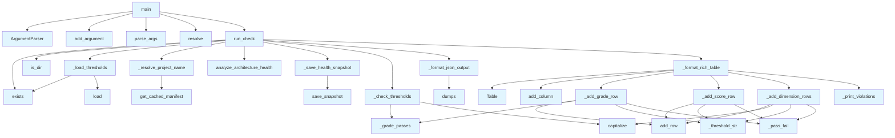

# File: `src/local_deepwiki/cli/check_cli.py`

## File Overview

This file implements the `deepwiki check` command-line interface, which enforces an architecture quality gate for a local repository. It performs health analysis of the project's architecture, compares the results against configurable thresholds defined in `pyproject.toml`, and reports pass/fail status. The command exits with different codes based on success, threshold violations, or infrastructure errors.

The design emphasizes modularity, with helper functions handling specific aspects of the check logic, and integration with core components like health analysis and manifest reading.

## Key Concepts

### Architecture Health Analysis
The core of the functionality relies on [`analyze_architecture_health`](../generators/analysis/architecture_health.md), which computes a structured health score for the project's architecture across multiple dimensions: complexity, coupling, smells, and layers. This analysis provides the raw data against which thresholds are checked.

### Threshold Configuration via TOML
Thresholds for the quality gate are defined in the `pyproject.toml` file under the `[tool.deepwiki.check]` section. This approach allows developers to define quality expectations per project without modifying the tool itself, supporting a decentralized and flexible configuration model.

### Grading and Scoring System
The system uses a letter-grade scale (A–F) for overall architecture health. The comparison logic (`_grade_passes`) maps grades to numeric values to enable easy threshold checking. This system allows for intuitive interpretation of health status.

### Rich CLI Output
When not using `--json`, the tool outputs a formatted table using the `rich` library. This provides a user-friendly way to quickly assess which checks passed or failed, including dimension-specific scores and thresholds.

## Integration

This file integrates deeply with the broader `local_deepwiki` codebase:

- **Core Health History**: The [`save_snapshot`](../core/health_history.md) function from `local_deepwiki.core.health_history` is used to persist health data for historical tracking.
- **Architecture Analysis**: The [`analyze_architecture_health`](../generators/analysis/architecture_health.md) generator is the primary data source for the health metrics.
- **Manifest Handling**: The [`get_cached_manifest`](../generators/manifest.md) function from `local_deepwiki.generators.manifest` is used to resolve project names, falling back to the directory name if needed.

It is called by:
- `main` function, which handles argument parsing and calls `run_check`
- Unit tests via `test_check_cli`, which directly invoke `_grade_passes`, `_check_thresholds`, and `run_check`

It is part of the CLI module structure and is closely related to:
- `main.py` — the main CLI entrypoint that routes to `check_cli`
- `status_cli.py` — which also deals with health and architecture status
- `config_validator.py` — for validating configuration files
- `cache_cli.py` — for managing cached data

## Design Notes

### Modularization of Check Logic
The check logic is broken into small, focused functions:
- `_check_thresholds` centralizes the logic for comparing health data against thresholds
- `_format_rich_table` and `_format_json_output` handle presentation logic separately
- This modularization improves testability and maintainability

### Graceful Error Handling
The tool gracefully handles:
- Missing `pyproject.toml` or missing `[tool.deepwiki.check]` section
- Missing or corrupted TOML files
- Analysis failures
- Missing repository paths

In all error cases, appropriate exit codes are returned (2 for infrastructure errors, 1 for violations).

### Threshold Flexibility
Thresholds are optional — if no thresholds are configured, the check passes. This allows teams to adopt the tool incrementally, starting with just running the analysis and then adding thresholds over time.

### JSON Output for Automation
Support for `--json` output allows the tool to be used in CI/CD pipelines or automated systems that need structured data rather than formatted output.

### Rich Table Formatting
The use of `rich` for table formatting ensures that CLI output is visually clear and actionable. It uses color coding (`[green]PASS[/green]`, `[red]FAIL[/red]`) to quickly communicate results.

### Fallbacks for Project Name
When resolving the project name, the code falls back to the repository directory name if the manifest fails to load. This ensures the tool remains usable even in edge cases.

### Snapshot Persistence
Health data is persisted to disk using [`save_snapshot`](../core/health_history.md). This is done silently to avoid breaking the command-line flow, allowing for historical tracking of project health over time.

## API Reference

### Functions

#### `run_check`

```python
def run_check(repo_path: Path, json_output: bool = False, console: Console | None = None) -> int
```

Run the architecture quality gate.


| Parameter | Type | Default | Description |
|-----------|------|---------|-------------|
| `repo_path` | `Path` | - | - |
| `json_output` | `bool` | `False` | - |
| `console` | `Console | None` | `None` | - |

**Returns:** `int`


<details>
<summary>View Source (lines 242-281) | <a href="https://github.com/UrbanDiver/local-deepwiki-mcp/blob/main/src/local_deepwiki/cli/check_cli.py#L242-L281">GitHub</a></summary>

```python
def run_check(
    repo_path: Path,
    *,
    json_output: bool = False,
    console: Console | None = None,
) -> int:
    """Run the architecture quality gate.

    Returns:
        0 if all thresholds pass (or none configured).
        1 if any threshold is violated.
        2 on infrastructure error (missing repo, analysis failure).
    """
    if console is None:
        console = Console()

    if not repo_path.exists() or not repo_path.is_dir():
        console.print(f"[red]Repository not found: {repo_path}[/red]")
        return 2

    thresholds = _load_thresholds(repo_path)
    project_name = _resolve_project_name(repo_path)

    try:
        health_data = analyze_architecture_health(repo_path, project_name)
    except Exception as exc:
        console.print(f"[red]Analysis failed: {exc}[/red]")
        return 2

    _save_health_snapshot(repo_path, health_data)

    violations = _check_thresholds(health_data, thresholds)
    overall = health_data.get("overall", {})

    if json_output:
        _format_json_output(overall, thresholds, violations, console)
    else:
        _format_rich_table(overall, thresholds, violations, project_name, console)

    return 1 if violations else 0
```

</details>

#### `main`

```python
def main() -> int
```

CLI entry point for ``deepwiki check``.

**Returns:** `int`


<details>
<summary>View Source (lines 284-306) | <a href="https://github.com/UrbanDiver/local-deepwiki-mcp/blob/main/src/local_deepwiki/cli/check_cli.py#L284-L306">GitHub</a></summary>

```python
def main() -> int:
    """CLI entry point for ``deepwiki check``."""
    parser = argparse.ArgumentParser(
        prog="deepwiki check",
        description="Run architecture quality gate",
    )
    parser.add_argument(
        "repo_path",
        nargs="?",
        default=".",
        help="Path to the repository (default: current directory)",
    )
    parser.add_argument(
        "--json",
        dest="json_output",
        action="store_true",
        help="Output results as JSON",
    )

    args = parser.parse_args()
    repo_path = Path(args.repo_path).resolve()

    return run_check(repo_path, json_output=args.json_output)
```

</details>

## Call Graph



## Used By

Functions and methods in this file and their callers:

- **`ArgumentParser`**: called by `main`
- **`Path`**: called by `main`
- **`Table`**: called by `_format_rich_table`
- **`_add_dimension_rows`**: called by `_format_rich_table`
- **`_add_grade_row`**: called by `_format_rich_table`
- **`_add_score_row`**: called by `_format_rich_table`
- **`_check_thresholds`**: called by `run_check`
- **`_format_json_output`**: called by `run_check`
- **`_format_rich_table`**: called by `run_check`
- **`_grade_passes`**: called by `_add_grade_row`, `_check_thresholds`
- **`_load_thresholds`**: called by `run_check`
- **`_pass_fail`**: called by `_add_dimension_rows`, `_add_grade_row`, `_add_score_row`
- **`_print_violations`**: called by `_format_rich_table`
- **`_resolve_project_name`**: called by `run_check`
- **`_save_health_snapshot`**: called by `run_check`
- **`_threshold_str`**: called by `_add_dimension_rows`, `_add_grade_row`, `_add_score_row`
- **`add_argument`**: called by `main`
- **`add_column`**: called by `_format_rich_table`
- **`add_row`**: called by `_add_dimension_rows`, `_add_grade_row`, `_add_score_row`
- **[`analyze_architecture_health`](../generators/analysis/architecture_health.md)**: called by `run_check`
- **`capitalize`**: called by `_add_dimension_rows`, `_check_thresholds`
- **`dumps`**: called by `_format_json_output`
- **`exists`**: called by `_load_thresholds`, `run_check`
- **[`get_cached_manifest`](../generators/manifest.md)**: called by `_resolve_project_name`
- **`is_dir`**: called by `run_check`
- **`load`**: called by `_load_thresholds`
- **`parse_args`**: called by `main`
- **`resolve`**: called by `main`
- **`run_check`**: called by `main`
- **[`save_snapshot`](../core/health_history.md)**: called by `_save_health_snapshot`

## Usage Examples

*Examples extracted from test files*

### All metrics above thresholds -> exit 0

From `test_check_cli.py::test_check_exit_0_all_pass`:

```python
mock_manifest.return_value.name = "test-project"
mock_analyze.return_value = _make_health_result(75.0, "B")

result = run_check(repo_with_pyproject)

assert result == 0
mock_analyze.assert_called_once()
```

### Grade D with min_grade C -> exit 1

From `test_check_cli.py::test_check_exit_1_grade_below`:

```python
mock_manifest.return_value.name = "test-project"
mock_analyze.return_value = _make_health_result(35.0, "D")

result = run_check(repo_with_pyproject)

assert result == 1
```

### Test _grade_passes with various grade combinations

From `test_check_cli.py::test_check_grade_comparison`:

```python
# Same grade passes
assert _grade_passes("A", "A") is True
assert _grade_passes("C", "C") is True
assert _grade_passes("F", "F") is True

# Higher grade passes
assert _grade_passes("A", "C") is True
assert _grade_passes("B", "D") is True
assert _grade_passes("A", "F") is True

# Lower grade fails
assert _grade_passes("D", "C") is False
assert _grade_passes("F", "A") is False
assert _grade_passes("C", "B") is False
```

### No pyproject.toml -> empty dict

From `test_check_cli.py::test_load_thresholds_missing_file`:

```python
assert _load_thresholds(tmp_path) == {}
```

### pyproject.toml without [tool.deepwiki.check] -> empty dict

From `test_check_cli.py::test_load_thresholds_no_section`:

```python
(tmp_path / "pyproject.toml").write_text(
    "[project]\nname = 'foo'\n", encoding="utf-8"
)
assert _load_thresholds(tmp_path) == {}
```


## Last Modified

| Entity | Type | Author | Date | Commit |
|--------|------|--------|------|--------|
| `_pass_fail` | function | Brian Breidenbach | 2 days ago | `3e353f8` refactor: decompose CC > 15... |
| `_threshold_str` | function | Brian Breidenbach | 2 days ago | `3e353f8` refactor: decompose CC > 15... |
| `_add_grade_row` | function | Brian Breidenbach | 2 days ago | `3e353f8` refactor: decompose CC > 15... |
| `_add_score_row` | function | Brian Breidenbach | 2 days ago | `3e353f8` refactor: decompose CC > 15... |
| `_add_dimension_rows` | function | Brian Breidenbach | 2 days ago | `3e353f8` refactor: decompose CC > 15... |
| `_print_violations` | function | Brian Breidenbach | 2 days ago | `3e353f8` refactor: decompose CC > 15... |
| `_format_rich_table` | function | Brian Breidenbach | 2 days ago | `3e353f8` refactor: decompose CC > 15... |
| `_resolve_project_name` | function | Brian Breidenbach | 2 days ago | `3e353f8` refactor: decompose CC > 15... |
| `_save_health_snapshot` | function | Brian Breidenbach | 2 days ago | `3e353f8` refactor: decompose CC > 15... |
| `run_check` | function | Brian Breidenbach | 2 days ago | `3e353f8` refactor: decompose CC > 15... |
| `_format_json_output` | function | Brian Breidenbach | 3 days ago | `8aa2fda` refactor: extract formatter... |
| `_grade_passes` | function | Brian Breidenbach | 3 days ago | `efc5785` feat: add deepwiki check CL... |
| `_load_thresholds` | function | Brian Breidenbach | 3 days ago | `efc5785` feat: add deepwiki check CL... |
| `_check_thresholds` | function | Brian Breidenbach | 3 days ago | `efc5785` feat: add deepwiki check CL... |
| `main` | function | Brian Breidenbach | 3 days ago | `efc5785` feat: add deepwiki check CL... |

## Additional Source Code

Source code for functions and methods not listed in the API Reference above.

#### `_grade_passes`

<details>
<summary>View Source (lines 36-41) | <a href="https://github.com/UrbanDiver/local-deepwiki-mcp/blob/main/src/local_deepwiki/cli/check_cli.py#L36-L41">GitHub</a></summary>

```python
def _grade_passes(actual: str, min_grade: str) -> bool:
    """Return True if *actual* grade meets or exceeds *min_grade*.

    Grade order: A=4, B=3, C=2, D=1, F=0.
    """
    return _GRADE_VALUES.get(actual, 0) >= _GRADE_VALUES.get(min_grade, 0)
```

</details>


#### `_load_thresholds`

<details>
<summary>View Source (lines 44-59) | <a href="https://github.com/UrbanDiver/local-deepwiki-mcp/blob/main/src/local_deepwiki/cli/check_cli.py#L44-L59">GitHub</a></summary>

```python
def _load_thresholds(repo_path: Path) -> dict[str, Any]:
    """Read ``[tool.deepwiki.check]`` from *repo_path*/pyproject.toml.

    Returns an empty dict when the file or section is missing.
    """
    pyproject = repo_path / "pyproject.toml"
    if not pyproject.exists():
        return {}

    try:
        with open(pyproject, "rb") as fh:
            data = tomllib.load(fh)
    except (OSError, tomllib.TOMLDecodeError):
        return {}

    return data.get("tool", {}).get("deepwiki", {}).get("check", {})
```

</details>


#### `_check_thresholds`

<details>
<summary>View Source (lines 62-123) | <a href="https://github.com/UrbanDiver/local-deepwiki-mcp/blob/main/src/local_deepwiki/cli/check_cli.py#L62-L123">GitHub</a></summary>

```python
def _check_thresholds(
    health_data: dict[str, Any],
    thresholds: dict[str, Any],
) -> list[dict[str, Any]]:
    """Compare *health_data* against *thresholds*, returning violations.

    Each violation is a dict with keys: ``field``, ``actual``, ``threshold``,
    ``message``.
    """
    violations: list[dict[str, Any]] = []
    overall = health_data.get("overall", {})

    # Overall grade check
    min_grade = thresholds.get("min_grade")
    if min_grade is not None:
        actual_grade = overall.get("grade", "F")
        if not _grade_passes(actual_grade, min_grade):
            violations.append(
                {
                    "field": "grade",
                    "actual": actual_grade,
                    "threshold": min_grade,
                    "message": (f"Grade {actual_grade} is below minimum {min_grade}"),
                }
            )

    # Overall score check
    min_score = thresholds.get("min_score")
    if min_score is not None:
        actual_score = overall.get("score", 0)
        if actual_score < min_score:
            violations.append(
                {
                    "field": "score",
                    "actual": actual_score,
                    "threshold": min_score,
                    "message": (f"Score {actual_score} is below minimum {min_score}"),
                }
            )

    # Per-dimension score checks
    dimensions = overall.get("dimensions", {})
    dimension_keys = ("complexity", "coupling", "smells", "layers")
    for dim in dimension_keys:
        threshold_key = f"min_{dim}"
        min_dim = thresholds.get(threshold_key)
        if min_dim is not None:
            actual_dim_score = dimensions.get(dim, {}).get("score", 0)
            if actual_dim_score < min_dim:
                violations.append(
                    {
                        "field": threshold_key,
                        "actual": actual_dim_score,
                        "threshold": min_dim,
                        "message": (
                            f"{dim.capitalize()} score {actual_dim_score} "
                            f"is below minimum {min_dim}"
                        ),
                    }
                )

    return violations
```

</details>


#### `_format_json_output`

<details>
<summary>View Source (lines 126-144) | <a href="https://github.com/UrbanDiver/local-deepwiki-mcp/blob/main/src/local_deepwiki/cli/check_cli.py#L126-L144">GitHub</a></summary>

```python
def _format_json_output(
    overall: dict[str, Any],
    thresholds: dict[str, Any],
    violations: list[dict[str, Any]],
    console: Console,
) -> None:
    """Format and print check results as JSON."""
    output = {
        "grade": overall.get("grade", "F"),
        "score": overall.get("score", 0),
        "dimensions": {
            name: dim_data.get("score", 0)
            for name, dim_data in overall.get("dimensions", {}).items()
        },
        "thresholds": thresholds,
        "violations": violations,
        "passed": len(violations) == 0,
    }
    console.print(json.dumps(output, indent=2))
```

</details>


#### `_pass_fail`

<details>
<summary>View Source (lines 147-149) | <a href="https://github.com/UrbanDiver/local-deepwiki-mcp/blob/main/src/local_deepwiki/cli/check_cli.py#L147-L149">GitHub</a></summary>

```python
def _pass_fail(passed: bool) -> str:
    """Return a Rich-coloured PASS or FAIL status string."""
    return "[green]PASS[/green]" if passed else "[red]FAIL[/red]"
```

</details>


#### `_threshold_str`

<details>
<summary>View Source (lines 152-154) | <a href="https://github.com/UrbanDiver/local-deepwiki-mcp/blob/main/src/local_deepwiki/cli/check_cli.py#L152-L154">GitHub</a></summary>

```python
def _threshold_str(value: Any) -> str:
    """Return the threshold value as a string, or '-' when unset."""
    return str(value) if value is not None else "-"
```

</details>


#### `_add_grade_row`

<details>
<summary>View Source (lines 157-162) | <a href="https://github.com/UrbanDiver/local-deepwiki-mcp/blob/main/src/local_deepwiki/cli/check_cli.py#L157-L162">GitHub</a></summary>

```python
def _add_grade_row(
    table: Table, grade: str, min_grade: str | None, thresholds: dict[str, Any]
) -> None:
    """Add the grade row to the health table."""
    passes = min_grade is None or _grade_passes(grade, min_grade)
    table.add_row("Grade", grade, _threshold_str(min_grade), _pass_fail(passes))
```

</details>


#### `_add_score_row`

<details>
<summary>View Source (lines 165-168) | <a href="https://github.com/UrbanDiver/local-deepwiki-mcp/blob/main/src/local_deepwiki/cli/check_cli.py#L165-L168">GitHub</a></summary>

```python
def _add_score_row(table: Table, score: float, min_score: float | None) -> None:
    """Add the overall score row to the health table."""
    passes = min_score is None or score >= min_score
    table.add_row("Score", str(score), _threshold_str(min_score), _pass_fail(passes))
```

</details>


#### `_add_dimension_rows`

<details>
<summary>View Source (lines 171-184) | <a href="https://github.com/UrbanDiver/local-deepwiki-mcp/blob/main/src/local_deepwiki/cli/check_cli.py#L171-L184">GitHub</a></summary>

```python
def _add_dimension_rows(
    table: Table, overall: dict[str, Any], thresholds: dict[str, Any]
) -> None:
    """Add one row per architecture dimension to the health table."""
    for dim in ("complexity", "coupling", "smells", "layers"):
        dim_score = overall.get("dimensions", {}).get(dim, {}).get("score", 0)
        min_dim = thresholds.get(f"min_{dim}")
        passes = min_dim is None or dim_score >= min_dim
        table.add_row(
            dim.capitalize(),
            str(dim_score),
            _threshold_str(min_dim),
            _pass_fail(passes),
        )
```

</details>


#### `_print_violations`

<details>
<summary>View Source (lines 187-194) | <a href="https://github.com/UrbanDiver/local-deepwiki-mcp/blob/main/src/local_deepwiki/cli/check_cli.py#L187-L194">GitHub</a></summary>

```python
def _print_violations(violations: list[dict[str, Any]], console: Console) -> None:
    """Print violation messages or an all-passed confirmation."""
    if violations:
        console.print(f"\n[red]{len(violations)} violation(s) found.[/red]")
        for v in violations:
            console.print(f"  [red]- {v['message']}[/red]")
    else:
        console.print("\n[green]All checks passed.[/green]")
```

</details>


#### `_format_rich_table`

<details>
<summary>View Source (lines 197-222) | <a href="https://github.com/UrbanDiver/local-deepwiki-mcp/blob/main/src/local_deepwiki/cli/check_cli.py#L197-L222">GitHub</a></summary>

```python
def _format_rich_table(
    overall: dict[str, Any],
    thresholds: dict[str, Any],
    violations: list[dict[str, Any]],
    project_name: str,
    console: Console,
) -> None:
    """Format and print check results as a Rich table."""
    table = Table(
        title=f"Architecture Health: {project_name}",
        show_header=True,
        header_style="bold cyan",
    )
    table.add_column("Metric", style="bold")
    table.add_column("Value", justify="right")
    table.add_column("Threshold", justify="right")
    table.add_column("Status", justify="center")

    _add_grade_row(
        table, overall.get("grade", "F"), thresholds.get("min_grade"), thresholds
    )
    _add_score_row(table, overall.get("score", 0), thresholds.get("min_score"))
    _add_dimension_rows(table, overall, thresholds)

    console.print(table)
    _print_violations(violations, console)
```

</details>


#### `_resolve_project_name`

<details>
<summary>View Source (lines 225-231) | <a href="https://github.com/UrbanDiver/local-deepwiki-mcp/blob/main/src/local_deepwiki/cli/check_cli.py#L225-L231">GitHub</a></summary>

```python
def _resolve_project_name(repo_path: Path) -> str:
    """Return the project name from the manifest, falling back to repo dir name."""
    try:
        manifest = get_cached_manifest(repo_path)
        return manifest.name or repo_path.name
    except Exception:
        return repo_path.name
```

</details>


#### `_save_health_snapshot`

<details>
<summary>View Source (lines 234-239) | <a href="https://github.com/UrbanDiver/local-deepwiki-mcp/blob/main/src/local_deepwiki/cli/check_cli.py#L234-L239">GitHub</a></summary>

```python
def _save_health_snapshot(repo_path: Path, health_data: dict[str, Any]) -> None:
    """Persist the health snapshot; silently ignore errors."""
    try:
        save_snapshot(repo_path / ".deepwiki", health_data)
    except Exception:
        pass
```

</details>

## Relevant Source Files

- `src/local_deepwiki/cli/check_cli.py:36-41`
