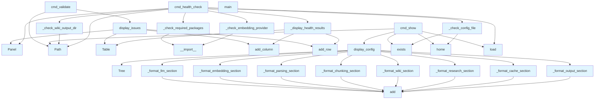

# File: `src/local_deepwiki/cli/config_cli.py`

## File Overview

This file implements the command-line interface (CLI) for managing and validating the `local-deepwiki` configuration. It provides commands to validate configuration files, display the effective configuration tree, and perform system health checks to ensure all required dependencies and providers are properly configured.

The design rationale is to centralize configuration-related CLI functionality, making it easy for users to diagnose issues, inspect their setup, and verify that the system is ready to run. The CLI integrates with other modules in the `local_deepwiki.cli` package to provide a cohesive user experience.

## Key Concepts

### Configuration Validation and Display
The module uses `rich` for rich text rendering to provide clear, structured output for configuration display and validation results. It implements a tree-based visualization of configuration sections, which helps users quickly understand the structure and values of their configuration.

### Health Checks
The health check functionality (`cmd_health_check`) systematically evaluates:
- Python version compatibility
- Required package imports
- LLM and embedding provider availability
- [Config](../config/models.md) file validity
- Wiki output directory writability

This ensures that users can quickly identify misconfigurations or missing dependencies before running the main application.

### Modular Configuration Sections
Configuration is broken down into logical sections (LLM, Embedding, Parsing, etc.) that are formatted and displayed independently. This modular approach allows for clear presentation and easier troubleshooting.

### Environment Variable Integration
The CLI checks for required API keys in environment variables (e.g., `ANTHROPIC_API_KEY`, `OPENAI_API_KEY`) and indicates their presence or absence in the configuration display, which is critical for providers that require external authentication.

## Integration

This file is part of the `local_deepwiki.cli` module and integrates with several core components:

- **[`local_deepwiki.config.Config`](../config/models.md)**: Used to load and validate configuration data.
- **[`local_deepwiki.cli.config_validator.ConfigValidator`](config_validator.md)**: Provides validation logic for configuration files.
- **`local_deepwiki.models.provider_types`**: Used to determine and validate provider types (LLM, Embedding).
- **`local_deepwiki.cli.profile_cli`**: Integrated to support profile management commands (`profile list`, `profile save`, `profile use`).
- **`local_deepwiki.cli.init_cli`**, **`local_deepwiki.cli.check_cli`**, etc.: This CLI is a core component that supports the overall workflow of initializing, checking, and configuring the application.

The module is called by the main CLI entry point and is responsible for handling the `config` subcommand, including subcommands like `validate`, `show`, `health-check`, and `profile`.

## Design Notes

### Rich Text Formatting
The use of `rich` for CLI output provides a consistent, visually appealing experience. The tree-based display for configuration sections makes complex nested structures easy to understand at a glance.

### Modular Health Check Functions
Each health check (`_check_python_version`, `_check_required_packages`, etc.) is a standalone function returning a tuple of check result and pass/fail status. This modular design allows for easy testing and extension of the health check system.

### Graceful Config Loading
The CLI gracefully handles cases where config files are missing or invalid. It falls back to default configurations and provides informative error messages, which improves user experience.

### Flexible Configuration File Discovery
The CLI searches for configuration files in standard locations, including:
- Current directory (`config.yaml`)
- Home directory (`~/.local-deepwiki.yaml`)
- Standard config path (`~/.config/local-deepwiki/config.yaml`)

This makes it easy for users to set up configuration without specifying paths explicitly.

### Type Safety and Validation
The CLI leverages the [`Config`](../config/models.md) class and [`ConfigValidator`](config_validator.md) for type-safe configuration loading and validation, ensuring that the configuration is both syntactically correct and semantically valid.

### Dependency Checking
The health check system explicitly verifies that required Python packages (like `sentence_transformers`) are installed, which prevents runtime errors due to missing dependencies.

### Extensibility
The CLI is designed to be extensible. New configuration sections or checks can be added by extending the relevant functions (`_format_*_section`, `_check_*`) without modifying core logic.

## API Reference

### Functions

#### `display_config`

```python
def display_config(config: Config, console: Console) -> None
```

Display the effective configuration using rich formatting.


| Parameter | Type | Default | Description |
|-----------|------|---------|-------------|
| `config` | `Config` | - | - |
| `console` | `Console` | - | - |

**Returns:** `None`


<details>
<summary>View Source (lines 122-135) | <a href="https://github.com/UrbanDiver/local-deepwiki-mcp/blob/main/src/local_deepwiki/cli/config_cli.py#L122-L135">GitHub</a></summary>

```python
def display_config(config: Config, console: Console) -> None:
    """Display the effective configuration using rich formatting."""
    tree = Tree("[bold blue]Configuration[/bold blue]")

    _format_llm_section(tree, config)
    _format_embedding_section(tree, config)
    _format_parsing_section(tree, config)
    _format_chunking_section(tree, config)
    _format_wiki_section(tree, config)
    _format_research_section(tree, config)
    _format_cache_section(tree, config)
    _format_output_section(tree, config)

    console.print(tree)
```

</details>

#### `display_issues`

```python
def display_issues(issues: list[ValidationIssue], console: Console) -> None
```

Display validation issues in a formatted table.


| Parameter | Type | Default | Description |
|-----------|------|---------|-------------|
| `issues` | `list[ValidationIssue]` | - | - |
| `console` | `Console` | - | - |

**Returns:** `None`


<details>
<summary>View Source (lines 138-177) | <a href="https://github.com/UrbanDiver/local-deepwiki-mcp/blob/main/src/local_deepwiki/cli/config_cli.py#L138-L177">GitHub</a></summary>

```python
def display_issues(issues: list[ValidationIssue], console: Console) -> None:
    """Display validation issues in a formatted table."""
    if not issues:
        console.print(
            Panel(
                "[green]No validation issues found[/green]", title="Validation Result"
            )
        )
        return

    table = Table(title="Validation Issues", show_header=True, header_style="bold")
    table.add_column("Level", style="bold", width=8)
    table.add_column("Category", width=18)
    table.add_column("Message", width=45)
    table.add_column("Suggestion", width=35)

    for issue in issues:
        level_style = "red" if issue.level == "error" else "yellow"
        table.add_row(
            f"[{level_style}]{issue.level.upper()}[/{level_style}]",
            issue.category,
            issue.message,
            issue.suggestion or "",
        )

    console.print(table)

    # Summary
    errors = sum(1 for i in issues if i.level == "error")
    warnings = sum(1 for i in issues if i.level == "warning")

    if errors > 0:
        console.print(f"\n[red bold]Found {errors} error(s)[/red bold]", end="")
    if warnings > 0:
        if errors > 0:
            console.print(" and ", end="")
        else:
            console.print("\n", end="")
        console.print(f"[yellow]{warnings} warning(s)[/yellow]", end="")
    console.print()
```

</details>

#### `cmd_validate`

```python
def cmd_validate(args: argparse.Namespace) -> int
```

Validate configuration command.


| Parameter | Type | Default | Description |
|-----------|------|---------|-------------|
| `args` | `argparse.Namespace` | - | - |

**Returns:** `int`


<details>
<summary>View Source (lines 180-202) | <a href="https://github.com/UrbanDiver/local-deepwiki-mcp/blob/main/src/local_deepwiki/cli/config_cli.py#L180-L202">GitHub</a></summary>

```python
def cmd_validate(args: argparse.Namespace) -> int:
    """Validate configuration command."""
    console = Console()

    config_path = Path(args.config) if args.config else None
    validator = ConfigValidator(config_path)

    console.print("\n[bold]Validating configuration...[/bold]\n")

    if validator.config_path:
        console.print(f"Config file: [cyan]{validator.config_path}[/cyan]\n")
    else:
        console.print("Config file: [dim]Using defaults (no config file found)[/dim]\n")

    is_valid = validator.validate()
    display_issues(validator.issues, console)

    if is_valid:
        console.print("\n[green bold]Configuration is valid[/green bold]\n")
        return 0
    else:
        console.print("\n[red bold]Configuration has errors[/red bold]\n")
        return 1
```

</details>

#### `cmd_show`

```python
def cmd_show(args: argparse.Namespace) -> int
```

Show effective configuration command.


| Parameter | Type | Default | Description |
|-----------|------|---------|-------------|
| `args` | `argparse.Namespace` | - | - |

**Returns:** `int`


<details>
<summary>View Source (lines 205-243) | <a href="https://github.com/UrbanDiver/local-deepwiki-mcp/blob/main/src/local_deepwiki/cli/config_cli.py#L205-L243">GitHub</a></summary>

```python
def cmd_show(args: argparse.Namespace) -> int:
    """Show effective configuration command."""
    console = Console()

    config_path = Path(args.config) if args.config else None

    try:
        config = Config.load(config_path)
    except Exception as e:  # noqa: BLE001 — CLI top-level handler: config load errors shown to user
        console.print(f"[red]Error loading config: {e}[/red]")
        return 1

    if config_path and config_path.exists():
        console.print(f"\nConfig file: [cyan]{config_path}[/cyan]\n")
    else:
        # Check which default was used
        default_paths = [
            Path.home() / ".config" / "local-deepwiki" / "config.yaml",
            Path.home() / ".local-deepwiki.yaml",
        ]
        found = None
        for path in default_paths:
            if path.exists():
                found = path
                break
        if found:
            console.print(f"\nConfig file: [cyan]{found}[/cyan]\n")
        else:
            console.print(
                "\n[dim]Using default configuration (no config file found)[/dim]\n"
            )

    display_config(config, console)

    if args.raw:
        console.print("\n[bold]Raw Configuration:[/bold]\n")
        console.print_json(data=config.model_dump())

    return 0
```

</details>

#### `cmd_health_check`

```python
def cmd_health_check(args: argparse.Namespace) -> int
```

Health check command to verify system readiness.


| Parameter | Type | Default | Description |
|-----------|------|---------|-------------|
| `args` | `argparse.Namespace` | - | - |

**Returns:** `int`


<details>
<summary>View Source (lines 541-618) | <a href="https://github.com/UrbanDiver/local-deepwiki-mcp/blob/main/src/local_deepwiki/cli/config_cli.py#L541-L618">GitHub</a></summary>

```python
def cmd_health_check(args: argparse.Namespace) -> int:
    """Health check command to verify system readiness."""
    console = Console()
    console.print("\n[bold]Running system health checks...[/bold]\n")

    checks: list[_CheckResult] = []
    all_passed = True

    # Check 1: Python version
    py_result, py_ok = _check_python_version()
    checks.append(py_result)
    if not py_ok:
        all_passed = False

    # Check 2: Required packages
    pkg_results, pkgs_ok = _check_required_packages()
    checks.extend(pkg_results)
    if not pkgs_ok:
        all_passed = False

    # Check 3: LLM provider
    config_path = Path(args.config) if args.config else None
    config: Config | None = None
    try:
        config = Config.load(config_path)
        llm_result, llm_ok = _check_llm_provider(config)
        checks.append(llm_result)
        if not llm_ok:
            all_passed = False
    except Exception as e:  # noqa: BLE001 — CLI top-level handler: config errors shown as health-check results
        checks.append(
            {
                "name": "LLM provider",
                "passed": False,
                "details": f"config error: {e}",
                "requirement": "required",
                "suggestion": "Fix configuration file or create one",
            }
        )
        all_passed = False

    # Check 4: Embedding provider
    if config is not None:
        embed_result, embed_ok = _check_embedding_provider(config)
        checks.append(embed_result)
        if not embed_ok:
            all_passed = False

    # Check 5: Config file validity
    cfg_result, cfg_ok = _check_config_file(config_path)
    checks.append(cfg_result)
    if not cfg_ok:
        all_passed = False

    # Check 6: Wiki output directory
    wiki_result, wiki_ok = _check_wiki_output_dir(config)
    checks.append(wiki_result)
    if not wiki_ok:
        all_passed = False

    _display_health_results(checks, console)

    if all_passed:
        console.print(
            Panel(
                "[green bold]System is ready to use![/green bold]",
                title="Health Check Result",
            )
        )
        return 0
    else:
        console.print(
            Panel(
                "[red bold]System is not ready. Please fix the issues above.[/red bold]",
                title="Health Check Result",
            )
        )
        return 1
```

</details>

#### `main`

```python
def main() -> int
```

Main entry point for the config CLI.

**Returns:** `int`


<details>
<summary>View Source (lines 621-693) | <a href="https://github.com/UrbanDiver/local-deepwiki-mcp/blob/main/src/local_deepwiki/cli/config_cli.py#L621-L693">GitHub</a></summary>

```python
def main() -> int:
    """Main entry point for the config CLI."""
    parser = argparse.ArgumentParser(
        prog="deepwiki-config",
        description="Validate and display local-deepwiki configuration",
        epilog=(
            "examples:\n"
            "  deepwiki config                    Validate current config\n"
            "  deepwiki config show               Show effective configuration tree\n"
            "  deepwiki config show --raw         Show config with raw JSON\n"
            "  deepwiki config validate -c my.yaml  Validate a specific config file\n"
            "  deepwiki config health-check       Check providers and system readiness\n"
            "  deepwiki config profile list       List saved config profiles\n"
            "  deepwiki config profile save dev   Save current config as 'dev' profile\n"
            "  deepwiki config profile use prod   Switch to 'prod' profile\n"
        ),
        formatter_class=argparse.RawDescriptionHelpFormatter,
    )
    parser.add_argument(
        "-c",
        "--config",
        type=str,
        help="Path to config file (default: search standard locations)",
    )

    subparsers = parser.add_subparsers(dest="command", help="Commands")

    # validate command
    validate_parser = subparsers.add_parser(
        "validate",
        help="Validate configuration",
        description="Check config file for syntax errors, invalid values, and missing providers.",
    )
    validate_parser.set_defaults(func=cmd_validate)

    # show command
    show_parser = subparsers.add_parser(
        "show",
        help="Show effective configuration",
        description="Display the merged configuration tree (defaults + config file + env vars).",
    )
    show_parser.add_argument(
        "--raw",
        action="store_true",
        help="Also show raw JSON configuration",
    )
    show_parser.set_defaults(func=cmd_show)

    # health-check command
    health_parser = subparsers.add_parser(
        "health-check",
        help="Verify system is properly configured and ready to use",
        description="Test connectivity to LLM and embedding providers, check dependencies.",
    )
    health_parser.set_defaults(func=cmd_health_check)

    # profile subcommand
    from local_deepwiki.cli.profile_cli import (
        dispatch_profile,
        register_profile_subparser,
    )

    register_profile_subparser(subparsers)

    args = parser.parse_args()

    if args.command is None:
        # Default to validate if no command specified
        args.func = cmd_validate
    elif args.command == "profile":
        return dispatch_profile(args)

    return args.func(args)
```

</details>

## Call Graph



## Used By

Functions and methods in this file and their callers:

- **`ArgumentParser`**: called by `main`
- **[`ConfigValidator`](config_validator.md)**: called by `cmd_validate`
- **`Panel`**: called by `cmd_health_check`, `display_issues`
- **`Path`**: called by `_check_wiki_output_dir`, `cmd_health_check`, `cmd_show`, `cmd_validate`
- **`Table`**: called by `_display_health_results`, `display_issues`
- **`Tree`**: called by `display_config`
- **`__import__`**: called by `_check_embedding_provider`, `_check_required_packages`
- **`_check_config_file`**: called by `cmd_health_check`
- **`_check_embedding_provider`**: called by `cmd_health_check`
- **`_check_llm_provider`**: called by `cmd_health_check`
- **`_check_python_version`**: called by `cmd_health_check`
- **`_check_required_packages`**: called by `cmd_health_check`
- **`_check_wiki_output_dir`**: called by `cmd_health_check`
- **`_display_health_results`**: called by `cmd_health_check`
- **`_format_cache_section`**: called by `display_config`
- **`_format_chunking_section`**: called by `display_config`
- **`_format_embedding_section`**: called by `display_config`
- **`_format_llm_section`**: called by `display_config`
- **`_format_output_section`**: called by `display_config`
- **`_format_parsing_section`**: called by `display_config`
- **`_format_research_section`**: called by `display_config`
- **`_format_wiki_section`**: called by `display_config`
- **`add`**: called by `_format_cache_section`, `_format_chunking_section`, `_format_embedding_section`, `_format_llm_section`, `_format_output_section`, `_format_parsing_section`, `_format_research_section`, `_format_wiki_section`
- **`add_argument`**: called by `main`
- **`add_column`**: called by `_display_health_results`, `display_issues`
- **`add_parser`**: called by `main`
- **`add_row`**: called by `_display_health_results`, `display_issues`
- **`add_subparsers`**: called by `main`
- **`cwd`**: called by `_check_config_file`
- **[`dispatch_profile`](profile_cli.md)**: called by `main`
- **`display_config`**: called by `cmd_show`
- **`display_issues`**: called by `cmd_validate`
- **`exists`**: called by `_check_config_file`, `cmd_show`
- **`func`**: called by `main`
- **`home`**: called by `_check_config_file`, `cmd_show`
- **`load`**: called by `cmd_health_check`, `cmd_show`
- **`mkdir`**: called by `_check_wiki_output_dir`
- **`model_dump`**: called by `cmd_show`
- **`parse_args`**: called by `main`
- **`print_json`**: called by `cmd_show`
- **`read`**: called by `_check_config_file`
- **[`register_profile_subparser`](profile_cli.md)**: called by `main`
- **`safe_load`**: called by `_check_config_file`
- **`set_defaults`**: called by `main`
- **`unlink`**: called by `_check_wiki_output_dir`
- **`validate`**: called by `cmd_validate`
- **`write_text`**: called by `_check_wiki_output_dir`

## Usage Examples

*Examples extracted from test files*

### Test displaying config with Ollama provider

From `test_config_cli.py::TestDisplayConfig::test_display_config_ollama`:

```python
display_config(config, mock_console)

output = mock_console.file.getvalue()
assert "LLM" in output
assert "ollama" in output
```

### Test displaying config with Anthropic provider

From `test_config_cli.py::TestDisplayConfig::test_display_config_anthropic`:

```python
monkeypatch.setenv("ANTHROPIC_API_KEY", "sk-ant-test")
config = Config().with_llm_provider("anthropic")
display_config(config, mock_console)

output = mock_console.file.getvalue()
assert "anthropic" in output
```

### Test displaying when there are no issues

From `test_config_cli.py::TestDisplayIssues::test_display_no_issues`:

```python
display_issues([], mock_console)

output = mock_console.file.getvalue()
assert "No validation issues" in output
```

### Test displaying a single error

From `test_config_cli.py::TestDisplayIssues::test_display_single_error`:

```python
display_issues(issues, mock_console)

output = mock_console.file.getvalue()
# Rich adds ANSI codes, so check for the text content
assert "error" in output.lower() or "ERROR" in output
assert "Test error" in output
```

### Test cmd_validate with valid config

From `test_config_cli.py::TestCmdValidate::test_cmd_validate_valid_config`:

```python
with patch("local_deepwiki.cli.config_cli.Console"):
    result = cmd_validate(args)

# Should succeed (return 0) or have only warnings
assert result in [0, 1]
```


## Last Modified

| Entity | Type | Author | Date | Commit |
|--------|------|--------|------|--------|
| `_format_llm_section` | function | Brian Breidenbach | 1 week ago | `d94846c` refactor: split CLI long me... |
| `_format_embedding_section` | function | Brian Breidenbach | 1 week ago | `d94846c` refactor: split CLI long me... |
| `_format_parsing_section` | function | Brian Breidenbach | 1 week ago | `d94846c` refactor: split CLI long me... |
| `_format_chunking_section` | function | Brian Breidenbach | 1 week ago | `d94846c` refactor: split CLI long me... |
| `_format_wiki_section` | function | Brian Breidenbach | 1 week ago | `d94846c` refactor: split CLI long me... |
| `_format_research_section` | function | Brian Breidenbach | 1 week ago | `d94846c` refactor: split CLI long me... |
| `_format_cache_section` | function | Brian Breidenbach | 1 week ago | `d94846c` refactor: split CLI long me... |
| `_format_output_section` | function | Brian Breidenbach | 1 week ago | `d94846c` refactor: split CLI long me... |
| `display_config` | function | Brian Breidenbach | 1 week ago | `d94846c` refactor: split CLI long me... |
| `_check_python_version` | function | Brian Breidenbach | 1 week ago | `d94846c` refactor: split CLI long me... |
| `_check_required_packages` | function | Brian Breidenbach | 1 week ago | `d94846c` refactor: split CLI long me... |
| `_check_llm_provider` | function | Brian Breidenbach | 1 week ago | `d94846c` refactor: split CLI long me... |
| `_check_embedding_provider` | function | Brian Breidenbach | 1 week ago | `d94846c` refactor: split CLI long me... |
| `_check_config_file` | function | Brian Breidenbach | 1 week ago | `d94846c` refactor: split CLI long me... |
| `_check_wiki_output_dir` | function | Brian Breidenbach | 1 week ago | `d94846c` refactor: split CLI long me... |
| `_display_health_results` | function | Brian Breidenbach | 1 week ago | `d94846c` refactor: split CLI long me... |
| `cmd_health_check` | function | Brian Breidenbach | 1 week ago | `d94846c` refactor: split CLI long me... |
| `cmd_show` | function | Brian Breidenbach | Feb 23, 2026 | `c6fe2bd` refactor: split oversized m... |
| `main` | function | Brian Breidenbach | Feb 21, 2026 | `fecde6f` refactor: split 10 large fi... |
| `display_issues` | function | Brian Breidenbach | Feb 09, 2026 | `e964856` feat: add deepwiki-config h... |
| `cmd_validate` | function | Brian Breidenbach | Jan 25, 2026 | `24904d8` Add pydantic tool argument ... |

## Additional Source Code

Source code for functions and methods not listed in the API Reference above.

#### `_format_llm_section`

<details>
<summary>View Source (lines 26-44) | <a href="https://github.com/UrbanDiver/local-deepwiki-mcp/blob/main/src/local_deepwiki/cli/config_cli.py#L26-L44">GitHub</a></summary>

```python
def _format_llm_section(tree: Tree, config: Config) -> None:
    """Add the LLM configuration branch to *tree*."""
    llm_branch = tree.add("[bold cyan]LLM[/bold cyan]")
    llm_branch.add(f"Provider: [green]{config.llm.provider}[/green]")
    if config.llm.provider == LLMProviderType.OLLAMA:
        llm_branch.add(f"Model: {config.llm.ollama.model}")
        llm_branch.add(f"Base URL: {config.llm.ollama.base_url}")
    elif config.llm.provider == LLMProviderType.ANTHROPIC:
        llm_branch.add(f"Model: {config.llm.anthropic.model}")
        key = os.environ.get("ANTHROPIC_API_KEY", "")
        llm_branch.add(
            f"API Key: {'[green]set[/green]' if key else '[red]not set[/red]'}"
        )
    elif config.llm.provider == LLMProviderType.OPENAI:
        llm_branch.add(f"Model: {config.llm.openai.model}")
        key = os.environ.get("OPENAI_API_KEY", "")
        llm_branch.add(
            f"API Key: {'[green]set[/green]' if key else '[red]not set[/red]'}"
        )
```

</details>


#### `_format_embedding_section`

<details>
<summary>View Source (lines 47-54) | <a href="https://github.com/UrbanDiver/local-deepwiki-mcp/blob/main/src/local_deepwiki/cli/config_cli.py#L47-L54">GitHub</a></summary>

```python
def _format_embedding_section(tree: Tree, config: Config) -> None:
    """Add the Embedding configuration branch to *tree*."""
    embed_branch = tree.add("[bold cyan]Embedding[/bold cyan]")
    embed_branch.add(f"Provider: [green]{config.embedding.provider}[/green]")
    if config.embedding.provider == EmbeddingProviderType.LOCAL:
        embed_branch.add(f"Model: {config.embedding.local.model}")
    else:
        embed_branch.add(f"Model: {config.embedding.openai.model}")
```

</details>


#### `_format_parsing_section`

<details>
<summary>View Source (lines 57-64) | <a href="https://github.com/UrbanDiver/local-deepwiki-mcp/blob/main/src/local_deepwiki/cli/config_cli.py#L57-L64">GitHub</a></summary>

```python
def _format_parsing_section(tree: Tree, config: Config) -> None:
    """Add the Parsing configuration branch to *tree*."""
    parse_branch = tree.add("[bold cyan]Parsing[/bold cyan]")
    parse_branch.add(f"Languages: {len(config.parsing.languages)} configured")
    parse_branch.add(
        f"Max file size: {config.parsing.max_file_size / 1024 / 1024:.1f} MB"
    )
    parse_branch.add(f"Exclude patterns: {len(config.parsing.exclude_patterns)}")
```

</details>


#### `_format_chunking_section`

<details>
<summary>View Source (lines 67-73) | <a href="https://github.com/UrbanDiver/local-deepwiki-mcp/blob/main/src/local_deepwiki/cli/config_cli.py#L67-L73">GitHub</a></summary>

```python
def _format_chunking_section(tree: Tree, config: Config) -> None:
    """Add the Chunking configuration branch to *tree*."""
    chunk_branch = tree.add("[bold cyan]Chunking[/bold cyan]")
    chunk_branch.add(f"Max tokens: {config.chunking.max_chunk_tokens}")
    chunk_branch.add(f"Overlap: {config.chunking.overlap_tokens}")
    chunk_branch.add(f"Parallel workers: {config.chunking.parallel_workers}")
    chunk_branch.add(f"Batch size: {config.chunking.batch_size}")
```

</details>


#### `_format_wiki_section`

<details>
<summary>View Source (lines 76-82) | <a href="https://github.com/UrbanDiver/local-deepwiki-mcp/blob/main/src/local_deepwiki/cli/config_cli.py#L76-L82">GitHub</a></summary>

```python
def _format_wiki_section(tree: Tree, config: Config) -> None:
    """Add the Wiki Generation configuration branch to *tree*."""
    wiki_branch = tree.add("[bold cyan]Wiki Generation[/bold cyan]")
    wiki_branch.add(f"Max file docs: {config.wiki.max_file_docs or 'unlimited'}")
    wiki_branch.add(f"Concurrent LLM calls: {config.wiki.max_concurrent_llm_calls}")
    wiki_branch.add(f"Cloud for GitHub: {config.wiki.use_cloud_for_github}")
    wiki_branch.add(f"Chat provider: {config.wiki.chat_llm_provider}")
```

</details>


#### `_format_research_section`

<details>
<summary>View Source (lines 85-92) | <a href="https://github.com/UrbanDiver/local-deepwiki-mcp/blob/main/src/local_deepwiki/cli/config_cli.py#L85-L92">GitHub</a></summary>

```python
def _format_research_section(tree: Tree, config: Config) -> None:
    """Add the Deep Research configuration branch to *tree*."""
    research_branch = tree.add("[bold cyan]Deep Research[/bold cyan]")
    research_branch.add(f"Max sub-questions: {config.deep_research.max_sub_questions}")
    research_branch.add(
        f"Chunks per question: {config.deep_research.chunks_per_subquestion}"
    )
    research_branch.add(f"Max total chunks: {config.deep_research.max_total_chunks}")
```

</details>


#### `_format_cache_section`

<details>
<summary>View Source (lines 95-112) | <a href="https://github.com/UrbanDiver/local-deepwiki-mcp/blob/main/src/local_deepwiki/cli/config_cli.py#L95-L112">GitHub</a></summary>

```python
def _format_cache_section(tree: Tree, config: Config) -> None:
    """Add the Caching configuration branch to *tree*."""
    cache_branch = tree.add("[bold cyan]Caching[/bold cyan]")
    embed_cache = config.embedding_cache
    cache_branch.add(
        f"Embedding cache: {'[green]enabled[/green]' if embed_cache.enabled else '[yellow]disabled[/yellow]'}"
    )
    if embed_cache.enabled:
        cache_branch.add(f"  TTL: {embed_cache.ttl_seconds // 3600} hours")
        cache_branch.add(f"  Max entries: {embed_cache.max_entries:,}")

    llm_cache = config.llm_cache
    cache_branch.add(
        f"LLM cache: {'[green]enabled[/green]' if llm_cache.enabled else '[yellow]disabled[/yellow]'}"
    )
    if llm_cache.enabled:
        cache_branch.add(f"  TTL: {llm_cache.ttl_seconds // 3600} hours")
        cache_branch.add(f"  Similarity threshold: {llm_cache.similarity_threshold}")
```

</details>


#### `_format_output_section`

<details>
<summary>View Source (lines 115-119) | <a href="https://github.com/UrbanDiver/local-deepwiki-mcp/blob/main/src/local_deepwiki/cli/config_cli.py#L115-L119">GitHub</a></summary>

```python
def _format_output_section(tree: Tree, config: Config) -> None:
    """Add the Output configuration branch to *tree*."""
    output_branch = tree.add("[bold cyan]Output[/bold cyan]")
    output_branch.add(f"Wiki directory: {config.output.wiki_dir}")
    output_branch.add(f"Vector DB: {config.output.vector_db_name}")
```

</details>


#### `_check_python_version`

<details>
<summary>View Source (lines 253-264) | <a href="https://github.com/UrbanDiver/local-deepwiki-mcp/blob/main/src/local_deepwiki/cli/config_cli.py#L253-L264">GitHub</a></summary>

```python
def _check_python_version() -> tuple[_CheckResult, bool]:
    """Check that Python >= 3.10 is in use."""
    py_version = sys.version_info
    passed = py_version >= (3, 10)
    result: _CheckResult = {
        "name": "Python version",
        "passed": passed,
        "details": f"{py_version.major}.{py_version.minor}.{py_version.micro}",
        "requirement": ">=3.10",
        "suggestion": "Upgrade to Python 3.10 or higher" if not passed else None,
    }
    return result, passed
```

</details>


#### `_check_required_packages`

<details>
<summary>View Source (lines 267-301) | <a href="https://github.com/UrbanDiver/local-deepwiki-mcp/blob/main/src/local_deepwiki/cli/config_cli.py#L267-L301">GitHub</a></summary>

```python
def _check_required_packages() -> tuple[list[_CheckResult], bool]:
    """Check that required packages are importable."""
    required_packages = {
        "lancedb": "lancedb",
        "tree_sitter": "tree-sitter",
        "sentence_transformers": "sentence-transformers",
    }
    results: list[_CheckResult] = []
    all_passed = True

    for module_name, package_name in required_packages.items():
        try:
            __import__(module_name)
            results.append(
                {
                    "name": f"Package: {package_name}",
                    "passed": True,
                    "details": "installed",
                    "requirement": "required",
                    "suggestion": None,
                }
            )
        except ImportError:
            results.append(
                {
                    "name": f"Package: {package_name}",
                    "passed": False,
                    "details": "not found",
                    "requirement": "required",
                    "suggestion": f"Install with: pip install {package_name}",
                }
            )
            all_passed = False

    return results, all_passed
```

</details>


#### `_check_llm_provider`

<details>
<summary>View Source (lines 304-350) | <a href="https://github.com/UrbanDiver/local-deepwiki-mcp/blob/main/src/local_deepwiki/cli/config_cli.py#L304-L350">GitHub</a></summary>

```python
def _check_llm_provider(config: Config) -> tuple[_CheckResult, bool]:
    """Check the configured LLM provider is accessible."""
    llm_provider = config.llm.provider

    if llm_provider == "anthropic":
        api_key = os.environ.get("ANTHROPIC_API_KEY")
        passed = bool(api_key)
        return (
            {
                "name": "LLM provider (Anthropic)",
                "passed": passed,
                "details": "API key configured" if passed else "API key not set",
                "requirement": "required",
                "suggestion": None
                if passed
                else "Set ANTHROPIC_API_KEY environment variable",
            },
            passed,
        )

    if llm_provider == "openai":
        api_key = os.environ.get("OPENAI_API_KEY")
        passed = bool(api_key)
        return (
            {
                "name": "LLM provider (OpenAI)",
                "passed": passed,
                "details": "API key configured" if passed else "API key not set",
                "requirement": "required",
                "suggestion": None
                if passed
                else "Set OPENAI_API_KEY environment variable",
            },
            passed,
        )

    # ollama
    return (
        {
            "name": "LLM provider (Ollama)",
            "passed": True,
            "details": f"configured at {config.llm.ollama.base_url}",
            "requirement": "required",
            "suggestion": "Ensure Ollama is running: ollama serve",
        },
        True,
    )
```

</details>


#### `_check_embedding_provider`

<details>
<summary>View Source (lines 353-396) | <a href="https://github.com/UrbanDiver/local-deepwiki-mcp/blob/main/src/local_deepwiki/cli/config_cli.py#L353-L396">GitHub</a></summary>

```python
def _check_embedding_provider(config: Config) -> tuple[_CheckResult, bool]:
    """Check the configured embedding provider is accessible."""
    embed_provider = config.embedding.provider

    if embed_provider == "openai":
        api_key = os.environ.get("OPENAI_API_KEY")
        passed = bool(api_key)
        return (
            {
                "name": "Embedding provider (OpenAI)",
                "passed": passed,
                "details": "API key configured" if passed else "API key not set",
                "requirement": "required",
                "suggestion": None
                if passed
                else "Set OPENAI_API_KEY or switch to local embeddings",
            },
            passed,
        )

    # local
    try:
        __import__("sentence_transformers")
        return (
            {
                "name": "Embedding provider (local)",
                "passed": True,
                "details": f"model: {config.embedding.local.model}",
                "requirement": "required",
                "suggestion": None,
            },
            True,
        )
    except ImportError:
        return (
            {
                "name": "Embedding provider (local)",
                "passed": False,
                "details": "sentence-transformers not installed",
                "requirement": "required",
                "suggestion": "Install with: pip install sentence-transformers",
            },
            False,
        )
```

</details>


#### `_check_config_file`

<details>
<summary>View Source (lines 399-469) | <a href="https://github.com/UrbanDiver/local-deepwiki-mcp/blob/main/src/local_deepwiki/cli/config_cli.py#L399-L469">GitHub</a></summary>

```python
def _check_config_file(config_path: Path | None) -> tuple[_CheckResult, bool]:
    """Check that the config file (if found) is valid YAML."""
    config_locations: list[Path] = []
    if config_path:
        config_locations.append(config_path)
    else:
        config_locations = [
            Path.cwd() / "config.yaml",
            Path.cwd() / ".local-deepwiki.yaml",
            Path.home() / ".config" / "local-deepwiki" / "config.yaml",
            Path.home() / ".local-deepwiki.yaml",
        ]

    found_config: Path | None = None
    for path in config_locations:
        if path.exists():
            found_config = path
            break

    if found_config is None:
        return (
            {
                "name": "Config file",
                "passed": True,
                "details": "not found (will use defaults)",
                "requirement": "optional",
                "suggestion": None,
            },
            True,
        )

    try:
        with open(found_config) as f:
            content = f.read()
            if content.strip():
                yaml.safe_load(content)
                details = f"valid at {found_config}"
            else:
                details = f"empty (using defaults) at {found_config}"
        return (
            {
                "name": "Config file",
                "passed": True,
                "details": details,
                "requirement": "optional",
                "suggestion": None,
            },
            True,
        )
    except yaml.YAMLError as e:
        return (
            {
                "name": "Config file",
                "passed": False,
                "details": f"invalid YAML: {e}",
                "requirement": "optional",
                "suggestion": "Fix YAML syntax errors in config file",
            },
            False,
        )
    except OSError as e:
        return (
            {
                "name": "Config file",
                "passed": False,
                "details": f"cannot read: {e}",
                "requirement": "optional",
                "suggestion": "Check file permissions",
            },
            False,
        )
```

</details>


#### `_check_wiki_output_dir`

<details>
<summary>View Source (lines 472-512) | <a href="https://github.com/UrbanDiver/local-deepwiki-mcp/blob/main/src/local_deepwiki/cli/config_cli.py#L472-L512">GitHub</a></summary>

```python
def _check_wiki_output_dir(config: Config | None) -> tuple[_CheckResult, bool]:
    """Check that the wiki output directory is writable."""
    if config is None:
        return (
            {
                "name": "Wiki output directory",
                "passed": False,
                "details": "cannot verify (config not loaded)",
                "requirement": "required",
                "suggestion": "Fix configuration first",
            },
            False,
        )

    wiki_dir = Path(config.output.wiki_dir)
    try:
        wiki_dir.mkdir(parents=True, exist_ok=True)
        test_file = wiki_dir / ".deepwiki_health_check"
        test_file.write_text("health check")
        test_file.unlink()
        return (
            {
                "name": "Wiki output directory",
                "passed": True,
                "details": f"writable at {wiki_dir}",
                "requirement": "required",
                "suggestion": None,
            },
            True,
        )
    except OSError as e:
        return (
            {
                "name": "Wiki output directory",
                "passed": False,
                "details": f"not writable: {e}",
                "requirement": "required",
                "suggestion": f"Check permissions on {wiki_dir}",
            },
            False,
        )
```

</details>


#### `_display_health_results`

<details>
<summary>View Source (lines 515-538) | <a href="https://github.com/UrbanDiver/local-deepwiki-mcp/blob/main/src/local_deepwiki/cli/config_cli.py#L515-L538">GitHub</a></summary>

```python
def _display_health_results(checks: list[_CheckResult], console: Console) -> None:
    """Render the health-check table and summary."""
    table = Table(title="Health Check Results", show_header=True, header_style="bold")
    table.add_column("Status", style="bold", width=8)
    table.add_column("Check", width=25)
    table.add_column("Details", width=35)
    table.add_column("Requirement", width=10)
    table.add_column("Suggestion", width=40)

    for check in checks:
        status = "[green]✓ PASS[/green]" if check["passed"] else "[red]✗ FAIL[/red]"
        table.add_row(
            status,
            check["name"],
            check["details"],
            check["requirement"],
            check["suggestion"] or "",
        )

    console.print(table)

    passed = sum(1 for c in checks if c["passed"])
    total = len(checks)
    console.print(f"\n[bold]Summary:[/bold] {passed}/{total} checks passed\n")
```

</details>

## Relevant Source Files

- `src/local_deepwiki/cli/config_cli.py:26-44`
