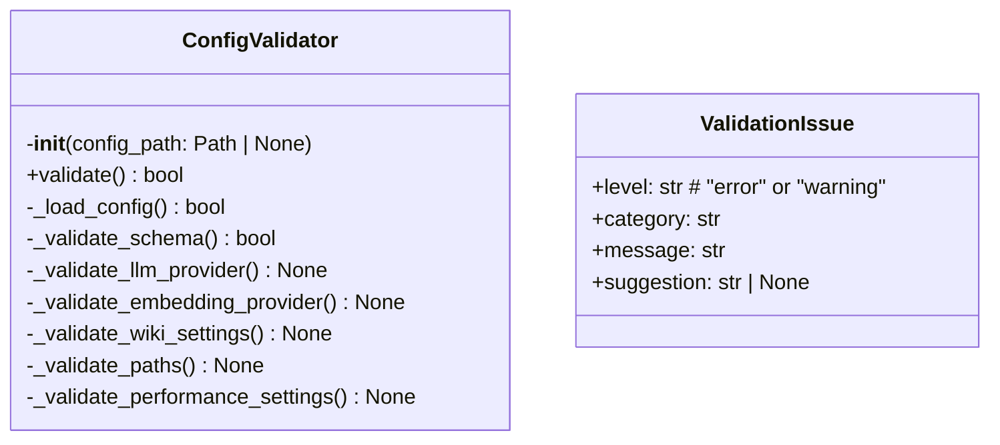

# File Overview

This file, `src/local_deepwiki/cli/config_cli.py`, provides command-line interface functionality for validating and displaying configuration files used by the `local_deepwiki` tool. It includes logic to load, validate, and display configuration settings, as well as reporting validation issues using rich formatting.

It depends on several external libraries:
- `argparse` for command-line argument parsing
- `os`, `sys` for system-level operations
- `yaml` for parsing YAML configuration files
- `pydantic` for schema validation
- `rich` for rich text output formatting
- `local_deepwiki.config` for configuration schema definitions

The file is used by the test suite via `ConfigValidator` and `cmd_validate`.

---

# Classes

## ValidationIssue

Represents a configuration validation issue.

### Attributes
- `level`: str — Either "error" or "warning"
- `category`: str — The category of the issue
- `message`: str — The issue description
- `suggestion`: str | None — Optional suggestion for fixing the issue

---

## ConfigValidator

Handles loading and validating configuration files.

### Methods

#### `__init__(self, config_path: Path | None = None)`

Initializes the validator with an optional config path.

- **Parameters**
  - `config_path`: `Path | None` — Optional path to the config file

#### `validate(self) -> bool`

Runs all validations and returns `True` if the configuration is valid (no errors).

- **Returns**
  - `bool` — `True` if valid, `False` otherwise

#### `_load_config(self) -> bool`

Loads and parses the configuration file.

- **Returns**
  - `bool` — `True` if loaded successfully, `False` otherwise

#### `_validate_schema(self) -> bool`

Validates the configuration against the Pydantic schema.

- **Returns**
  - `bool` — `True` if valid, `False` otherwise

#### `_validate_llm_provider(self) -> None`

Validates LLM provider configuration, checking for required environment variables.

#### `_validate_embedding_provider(self) -> None`

Validates embedding provider configuration, checking for required environment variables.

#### `_validate_wiki_settings(self) -> None`

Validates wiki generation settings, including cloud provider configurations.

#### `_validate_paths(self) -> None`

Validates path-related settings, such as exclude patterns.

#### `_validate_performance_settings(self) -> None`

Validates performance-related settings, such as parallel workers.

---

# Functions

## `display_config(config: Config, console: Console) -> None`

Displays the effective configuration using rich formatting.

- **Parameters**
  - `config`: [`Config`](../config.md) — The configuration object to display
  - `console`: `Console` — The rich console to output to

## `display_issues(issues: list[ValidationIssue], console: Console) -> None`

Displays validation issues in a formatted table.

- **Parameters**
  - `issues`: `list[ValidationIssue]` — List of validation issues to display
  - `console`: `Console` — The rich console to output to

---

# Integration

This file is part of the `local_deepwiki` CLI module and integrates with:

- `local_deepwiki.config` for schema definitions and validation
- `rich` for formatted console output
- `pydantic` for schema validation
- `yaml` for configuration parsing

It is called by the test suite (`test_config_cli`) through the `ConfigValidator` class and `cmd_validate` function.

---

# Usage Examples

## Validate Configuration

```python
from local_deepwiki.cli.config_cli import ConfigValidator

validator = ConfigValidator()
is_valid = validator.validate()
```

## Display Configuration

```python
from local_deepwiki.cli.config_cli import display_config
from rich.console import Console

console = Console()
display_config(config, console)
```

## Display Validation Issues

```python
from local_deepwiki.cli.config_cli import display_issues
from rich.console import Console

console = Console()
display_issues(issues, console)
```

## API Reference

### class `ValidationIssue`

Represents a configuration validation issue.


<details>
<summary>View Source (lines 21-27) | <a href="https://github.com/UrbanDiver/local-deepwiki-mcp/blob/main/src/local_deepwiki/cli/config_cli.py#L21-L27">GitHub</a></summary>

```python
class ValidationIssue:
    """Represents a configuration validation issue."""

    level: str  # "error" or "warning"
    category: str
    message: str
    suggestion: str | None = None
```

</details>

### class `ConfigValidator`

Validates local-deepwiki configuration.

**Methods:**


<details>
<summary>View Source (lines 30-387) | <a href="https://github.com/UrbanDiver/local-deepwiki-mcp/blob/main/src/local_deepwiki/cli/config_cli.py#L30-L387">GitHub</a></summary>

```python
class ConfigValidator:
    # Methods: __init__, validate, _load_config, _validate_schema, _validate_llm_provider, _validate_embedding_provider, _validate_wiki_settings, _validate_paths, _validate_performance_settings
```

</details>

#### `__init__`

```python
def __init__(config_path: Path | None = None)
```


| [Parameter](../generators/api_docs.md) | Type | Default | Description |
|-----------|------|---------|-------------|
| `config_path` | `Path | None` | `None` | - |


<details>
<summary>View Source (lines 33-37) | <a href="https://github.com/UrbanDiver/local-deepwiki-mcp/blob/main/src/local_deepwiki/cli/config_cli.py#L33-L37">GitHub</a></summary>

```python
def __init__(self, config_path: Path | None = None):
        self.config_path = config_path
        self.issues: list[ValidationIssue] = []
        self.config: Config | None = None
        self.raw_config: dict[str, Any] | None = None
```

</details>

#### `validate`

```python
def validate() -> bool
```

Run all validations and return True if config is valid (no errors).


---


<details>
<summary>View Source (lines 39-59) | <a href="https://github.com/UrbanDiver/local-deepwiki-mcp/blob/main/src/local_deepwiki/cli/config_cli.py#L39-L59">GitHub</a></summary>

```python
def validate(self) -> bool:
        """Run all validations and return True if config is valid (no errors)."""
        self.issues = []

        # Step 1: Find and parse config file
        if not self._load_config():
            return False

        # Step 2: Validate with Pydantic
        if not self._validate_schema():
            return False

        # Step 3: Semantic validations
        self._validate_llm_provider()
        self._validate_embedding_provider()
        self._validate_wiki_settings()
        self._validate_paths()
        self._validate_performance_settings()

        # Return True if no errors (warnings are OK)
        return not any(issue.level == "error" for issue in self.issues)
```

</details>

### Functions

#### `display_config`

```python
def display_config(config: Config, console: Console) -> None
```

Display the effective configuration using rich formatting.


| [Parameter](../generators/api_docs.md) | Type | Default | Description |
|-----------|------|---------|-------------|
| `config` | [`Config`](../config.md) | - | - |
| `console` | `Console` | - | - |

**Returns:** `None`


<details>
<summary>View Source (lines 390-466) | <a href="https://github.com/UrbanDiver/local-deepwiki-mcp/blob/main/src/local_deepwiki/cli/config_cli.py#L390-L466">GitHub</a></summary>

```python
def display_config(config: Config, console: Console) -> None:
    """Display the effective configuration using rich formatting."""
    tree = Tree("[bold blue]Configuration[/bold blue]")

    # LLM Settings
    llm_branch = tree.add("[bold cyan]LLM[/bold cyan]")
    llm_branch.add(f"Provider: [green]{config.llm.provider}[/green]")
    if config.llm.provider == "ollama":
        llm_branch.add(f"Model: {config.llm.ollama.model}")
        llm_branch.add(f"Base URL: {config.llm.ollama.base_url}")
    elif config.llm.provider == "anthropic":
        llm_branch.add(f"Model: {config.llm.anthropic.model}")
        key = os.environ.get("ANTHROPIC_API_KEY", "")
        llm_branch.add(f"API Key: {'[green]set[/green]' if key else '[red]not set[/red]'}")
    elif config.llm.provider == "openai":
        llm_branch.add(f"Model: {config.llm.openai.model}")
        key = os.environ.get("OPENAI_API_KEY", "")
        llm_branch.add(f"API Key: {'[green]set[/green]' if key else '[red]not set[/red]'}")

    # Embedding Settings
    embed_branch = tree.add("[bold cyan]Embedding[/bold cyan]")
    embed_branch.add(f"Provider: [green]{config.embedding.provider}[/green]")
    if config.embedding.provider == "local":
        embed_branch.add(f"Model: {config.embedding.local.model}")
    else:
        embed_branch.add(f"Model: {config.embedding.openai.model}")

    # Parsing Settings
    parse_branch = tree.add("[bold cyan]Parsing[/bold cyan]")
    parse_branch.add(f"Languages: {len(config.parsing.languages)} configured")
    parse_branch.add(f"Max file size: {config.parsing.max_file_size / 1024 / 1024:.1f} MB")
    parse_branch.add(f"Exclude patterns: {len(config.parsing.exclude_patterns)}")

    # Chunking Settings
    chunk_branch = tree.add("[bold cyan]Chunking[/bold cyan]")
    chunk_branch.add(f"Max tokens: {config.chunking.max_chunk_tokens}")
    chunk_branch.add(f"Overlap: {config.chunking.overlap_tokens}")
    chunk_branch.add(f"Parallel workers: {config.chunking.parallel_workers}")
    chunk_branch.add(f"Batch size: {config.chunking.batch_size}")

    # Wiki Settings
    wiki_branch = tree.add("[bold cyan]Wiki Generation[/bold cyan]")
    wiki_branch.add(f"Max file docs: {config.wiki.max_file_docs or 'unlimited'}")
    wiki_branch.add(f"Concurrent LLM calls: {config.wiki.max_concurrent_llm_calls}")
    wiki_branch.add(f"Cloud for GitHub: {config.wiki.use_cloud_for_github}")
    wiki_branch.add(f"Chat provider: {config.wiki.chat_llm_provider}")

    # Deep Research Settings
    research_branch = tree.add("[bold cyan]Deep Research[/bold cyan]")
    research_branch.add(f"Max sub-questions: {config.deep_research.max_sub_questions}")
    research_branch.add(f"Chunks per question: {config.deep_research.chunks_per_subquestion}")
    research_branch.add(f"Max total chunks: {config.deep_research.max_total_chunks}")

    # Cache Settings
    cache_branch = tree.add("[bold cyan]Caching[/bold cyan]")
    embed_cache = config.embedding_cache
    cache_branch.add(
        f"Embedding cache: {'[green]enabled[/green]' if embed_cache.enabled else '[yellow]disabled[/yellow]'}"
    )
    if embed_cache.enabled:
        cache_branch.add(f"  TTL: {embed_cache.ttl_seconds // 3600} hours")
        cache_branch.add(f"  Max entries: {embed_cache.max_entries:,}")

    llm_cache = config.llm_cache
    cache_branch.add(
        f"LLM cache: {'[green]enabled[/green]' if llm_cache.enabled else '[yellow]disabled[/yellow]'}"
    )
    if llm_cache.enabled:
        cache_branch.add(f"  TTL: {llm_cache.ttl_seconds // 3600} hours")
        cache_branch.add(f"  Similarity threshold: {llm_cache.similarity_threshold}")

    # Output Settings
    output_branch = tree.add("[bold cyan]Output[/bold cyan]")
    output_branch.add(f"Wiki directory: {config.output.wiki_dir}")
    output_branch.add(f"Vector DB: {config.output.vector_db_name}")

    console.print(tree)
```

</details>

#### `display_issues`

```python
def display_issues(issues: list[ValidationIssue], console: Console) -> None
```

Display validation issues in a formatted table.


| [Parameter](../generators/api_docs.md) | Type | Default | Description |
|-----------|------|---------|-------------|
| `issues` | `list[ValidationIssue]` | - | - |
| `console` | `Console` | - | - |

**Returns:** `None`


<details>
<summary>View Source (lines 469-504) | <a href="https://github.com/UrbanDiver/local-deepwiki-mcp/blob/main/src/local_deepwiki/cli/config_cli.py#L469-L504">GitHub</a></summary>

```python
def display_issues(issues: list[ValidationIssue], console: Console) -> None:
    """Display validation issues in a formatted table."""
    if not issues:
        console.print(Panel("[green]No validation issues found[/green]", title="Validation Result"))
        return

    table = Table(title="Validation Issues", show_header=True, header_style="bold")
    table.add_column("Level", style="bold", width=8)
    table.add_column("Category", width=18)
    table.add_column("Message", width=45)
    table.add_column("Suggestion", width=35)

    for issue in issues:
        level_style = "red" if issue.level == "error" else "yellow"
        table.add_row(
            f"[{level_style}]{issue.level.upper()}[/{level_style}]",
            issue.category,
            issue.message,
            issue.suggestion or "",
        )

    console.print(table)

    # Summary
    errors = sum(1 for i in issues if i.level == "error")
    warnings = sum(1 for i in issues if i.level == "warning")

    if errors > 0:
        console.print(f"\n[red bold]Found {errors} error(s)[/red bold]", end="")
    if warnings > 0:
        if errors > 0:
            console.print(" and ", end="")
        else:
            console.print("\n", end="")
        console.print(f"[yellow]{warnings} warning(s)[/yellow]", end="")
    console.print()
```

</details>

#### `cmd_validate`

```python
def cmd_validate(args: argparse.Namespace) -> int
```

Validate configuration command.


| [Parameter](../generators/api_docs.md) | Type | Default | Description |
|-----------|------|---------|-------------|
| `args` | `argparse.Namespace` | - | - |

**Returns:** `int`


<details>
<summary>View Source (lines 507-529) | <a href="https://github.com/UrbanDiver/local-deepwiki-mcp/blob/main/src/local_deepwiki/cli/config_cli.py#L507-L529">GitHub</a></summary>

```python
def cmd_validate(args: argparse.Namespace) -> int:
    """Validate configuration command."""
    console = Console()

    config_path = Path(args.config) if args.config else None
    validator = ConfigValidator(config_path)

    console.print("\n[bold]Validating configuration...[/bold]\n")

    if validator.config_path:
        console.print(f"Config file: [cyan]{validator.config_path}[/cyan]\n")
    else:
        console.print("Config file: [dim]Using defaults (no config file found)[/dim]\n")

    is_valid = validator.validate()
    display_issues(validator.issues, console)

    if is_valid:
        console.print("\n[green bold]Configuration is valid[/green bold]\n")
        return 0
    else:
        console.print("\n[red bold]Configuration has errors[/red bold]\n")
        return 1
```

</details>

#### `cmd_show`

```python
def cmd_show(args: argparse.Namespace) -> int
```

Show effective configuration command.


| [Parameter](../generators/api_docs.md) | Type | Default | Description |
|-----------|------|---------|-------------|
| `args` | `argparse.Namespace` | - | - |

**Returns:** `int`


<details>
<summary>View Source (lines 532-568) | <a href="https://github.com/UrbanDiver/local-deepwiki-mcp/blob/main/src/local_deepwiki/cli/config_cli.py#L532-L568">GitHub</a></summary>

```python
def cmd_show(args: argparse.Namespace) -> int:
    """Show effective configuration command."""
    console = Console()

    config_path = Path(args.config) if args.config else None

    try:
        config = Config.load(config_path)
    except Exception as e:
        console.print(f"[red]Error loading config: {e}[/red]")
        return 1

    if config_path and config_path.exists():
        console.print(f"\nConfig file: [cyan]{config_path}[/cyan]\n")
    else:
        # Check which default was used
        default_paths = [
            Path.home() / ".config" / "local-deepwiki" / "config.yaml",
            Path.home() / ".local-deepwiki.yaml",
        ]
        found = None
        for path in default_paths:
            if path.exists():
                found = path
                break
        if found:
            console.print(f"\nConfig file: [cyan]{found}[/cyan]\n")
        else:
            console.print("\n[dim]Using default configuration (no config file found)[/dim]\n")

    display_config(config, console)

    if args.raw:
        console.print("\n[bold]Raw Configuration:[/bold]\n")
        console.print_json(data=config.model_dump())

    return 0
```

</details>

#### `main`

```python
def main() -> int
```

Main entry point for the config CLI.

**Returns:** `int`


<details>
<summary>View Source (lines 571-605) | <a href="https://github.com/UrbanDiver/local-deepwiki-mcp/blob/main/src/local_deepwiki/cli/config_cli.py#L571-L605">GitHub</a></summary>

```python
def main() -> int:
    """Main entry point for the config CLI."""
    parser = argparse.ArgumentParser(
        prog="deepwiki-config",
        description="Validate and display local-deepwiki configuration",
    )
    parser.add_argument(
        "-c",
        "--config",
        type=str,
        help="Path to config file (default: search standard locations)",
    )

    subparsers = parser.add_subparsers(dest="command", help="Commands")

    # validate command
    validate_parser = subparsers.add_parser("validate", help="Validate configuration")
    validate_parser.set_defaults(func=cmd_validate)

    # show command
    show_parser = subparsers.add_parser("show", help="Show effective configuration")
    show_parser.add_argument(
        "--raw",
        action="store_true",
        help="Also show raw JSON configuration",
    )
    show_parser.set_defaults(func=cmd_show)

    args = parser.parse_args()

    if args.command is None:
        # Default to validate if no command specified
        args.func = cmd_validate

    return args.func(args)
```

</details>

## Class Diagram



## Call Graph

```mermaid
flowchart TD
    N0[ArgumentParser]
    N1[ConfigValidator]
    N2[ConfigValidator._load_config]
    N3[ConfigValidator._validate_p...]
    N4[ConfigValidator._validate_s...]
    N5[ConfigValidator.validate]
    N6[Panel]
    N7[Path]
    N8[Table]
    N9[Tree]
    N10[ValidationIssue]
    N11[add]
    N12[add_argument]
    N13[add_column]
    N14[add_parser]
    N15[add_row]
    N16[add_subparsers]
    N17[cmd_show]
    N18[cmd_validate]
    N19[display_config]
    N20[display_issues]
    N21[exists]
    N22[home]
    N23[load]
    N24[main]
    N25[model_dump]
    N26[parse_args]
    N27[print_json]
    N28[set_defaults]
    N29[validate]
    N19 --> N9
    N19 --> N11
    N20 --> N6
    N20 --> N8
    N20 --> N13
    N20 --> N15
    N18 --> N7
    N18 --> N1
    N18 --> N29
    N18 --> N20
    N17 --> N7
    N17 --> N23
    N17 --> N21
    N17 --> N22
    N17 --> N19
    N17 --> N27
    N17 --> N25
    N24 --> N0
    N24 --> N12
    N24 --> N16
    N24 --> N14
    N24 --> N28
    N24 --> N26
    N2 --> N22
    N2 --> N21
    N2 --> N10
    N4 --> N10
    N3 --> N10
    classDef func fill:#e1f5fe
    class N0,N1,N6,N7,N8,N9,N10,N11,N12,N13,N14,N15,N16,N17,N18,N19,N20,N21,N22,N23,N24,N25,N26,N27,N28,N29 func
    classDef method fill:#fff3e0
    class N2,N3,N4,N5 method
```



## Used By

Functions and methods in this file and their callers:

- **`ArgumentParser`**: called by `main`
- **[`Config`](../config.md)**: called by `ConfigValidator._load_config`
- **`ConfigValidator`**: called by `cmd_validate`
- **`Panel`**: called by `display_issues`
- **`Path`**: called by `cmd_show`, `cmd_validate`
- **`Table`**: called by `display_issues`
- **`Tree`**: called by `display_config`
- **`ValidationIssue`**: called by `ConfigValidator._load_config`, `ConfigValidator._validate_embedding_provider`, `ConfigValidator._validate_llm_provider`, `ConfigValidator._validate_paths`, `ConfigValidator._validate_performance_settings`, `ConfigValidator._validate_schema`, `ConfigValidator._validate_wiki_settings`
- **`_load_config`**: called by `ConfigValidator.validate`
- **`_validate_embedding_provider`**: called by `ConfigValidator.validate`
- **`_validate_llm_provider`**: called by `ConfigValidator.validate`
- **`_validate_paths`**: called by `ConfigValidator.validate`
- **`_validate_performance_settings`**: called by `ConfigValidator.validate`
- **`_validate_schema`**: called by `ConfigValidator.validate`
- **`_validate_wiki_settings`**: called by `ConfigValidator.validate`
- **`add`**: called by `display_config`
- **`add_argument`**: called by `main`
- **`add_column`**: called by `display_issues`
- **`add_parser`**: called by `main`
- **`add_row`**: called by `display_issues`
- **`add_subparsers`**: called by `main`
- **`cpu_count`**: called by `ConfigValidator._validate_performance_settings`
- **`cwd`**: called by `ConfigValidator._load_config`
- **`display_config`**: called by `cmd_show`
- **`display_issues`**: called by `cmd_validate`
- **`errors`**: called by `ConfigValidator._validate_schema`
- **`exists`**: called by `ConfigValidator._load_config`, `cmd_show`
- **`func`**: called by `main`
- **`home`**: called by `ConfigValidator._load_config`, `cmd_show`
- **`load`**: called by `cmd_show`
- **`model_dump`**: called by `cmd_show`
- **`model_validate`**: called by `ConfigValidator._validate_schema`
- **`parse_args`**: called by `main`
- **`print_json`**: called by `cmd_show`
- **`read`**: called by `ConfigValidator._load_config`
- **`safe_load`**: called by `ConfigValidator._load_config`
- **`set_defaults`**: called by `main`
- **`validate`**: called by `cmd_validate`

## Usage Examples

*Examples extracted from test files*

### Test creating an error-level issue

From `test_config_cli.py::TestValidationIssue::test_create_error_issue`:

```python
issue = ValidationIssue(
    level="error",
    category="Test",
    message="Test error message",
    suggestion="Fix it",
)
assert issue.level == "error"
assert issue.category == "Test"
```

### Test creating a warning-level issue

From `test_config_cli.py::TestValidationIssue::test_create_warning_issue`:

```python
issue = ValidationIssue(
    level="warning",
    category="Performance",
    message="Test warning",
)
assert issue.level == "warning"
assert issue.category == "Performance"
```

### Test initialization without a config path

From `test_config_cli.py::TestConfigValidatorInit::test_init_without_config_path`:

```python
validator = ConfigValidator()
assert validator.config_path is None
assert validator.issues == []
assert validator.config is None
assert validator.raw_config is None
```

### Test initialization with a config path

From `test_config_cli.py::TestConfigValidatorInit::test_init_with_config_path`:

```python
config_path = tmp_path / "config.yaml"
validator = ConfigValidator(config_path)
assert validator.config_path == config_path
```

### Test loading config from an explicit path

From `test_config_cli.py::TestConfigValidatorLoadConfig::test_load_config_explicit_path`:

```python
validator = ConfigValidator(valid_config_file)
result = validator._load_config()

assert result is True
assert validator.raw_config is not None
assert validator.config_path == valid_config_file
```


## Last Modified

| Entity | Type | Author | Date | Commit |
|--------|------|--------|------|--------|
| `ValidationIssue` | class | Brian Breidenbach | 1 week ago | `24904d8` Add Pydantic tool argument ... |
| `ConfigValidator` | class | Brian Breidenbach | 1 week ago | `24904d8` Add Pydantic tool argument ... |
| `__init__` | method | Brian Breidenbach | 1 week ago | `24904d8` Add Pydantic tool argument ... |
| `validate` | method | Brian Breidenbach | 1 week ago | `24904d8` Add Pydantic tool argument ... |
| `_load_config` | method | Brian Breidenbach | 1 week ago | `24904d8` Add Pydantic tool argument ... |
| `_validate_schema` | method | Brian Breidenbach | 1 week ago | `24904d8` Add Pydantic tool argument ... |
| `_validate_llm_provider` | method | Brian Breidenbach | 1 week ago | `24904d8` Add Pydantic tool argument ... |
| `_validate_embedding_provider` | method | Brian Breidenbach | 1 week ago | `24904d8` Add Pydantic tool argument ... |
| `_validate_wiki_settings` | method | Brian Breidenbach | 1 week ago | `24904d8` Add Pydantic tool argument ... |
| `_validate_paths` | method | Brian Breidenbach | 1 week ago | `24904d8` Add Pydantic tool argument ... |
| `_validate_performance_settings` | method | Brian Breidenbach | 1 week ago | `24904d8` Add Pydantic tool argument ... |
| `display_config` | function | Brian Breidenbach | 1 week ago | `24904d8` Add Pydantic tool argument ... |
| `display_issues` | function | Brian Breidenbach | 1 week ago | `24904d8` Add Pydantic tool argument ... |
| `cmd_validate` | function | Brian Breidenbach | 1 week ago | `24904d8` Add Pydantic tool argument ... |
| `cmd_show` | function | Brian Breidenbach | 1 week ago | `24904d8` Add Pydantic tool argument ... |
| `main` | function | Brian Breidenbach | 1 week ago | `24904d8` Add Pydantic tool argument ... |

## Additional Source Code

Source code for functions and methods not listed in the API Reference above.

#### `_load_config`

<details>
<summary>View Source (lines 61-130) | <a href="https://github.com/UrbanDiver/local-deepwiki-mcp/blob/main/src/local_deepwiki/cli/config_cli.py#L61-L130">GitHub</a></summary>

```python
def _load_config(self) -> bool:
        """Load and parse the config file."""
        config_locations = []

        if self.config_path:
            config_locations.append(self.config_path)
        else:
            # Check default locations
            config_locations = [
                Path.cwd() / "config.yaml",
                Path.cwd() / ".local-deepwiki.yaml",
                Path.home() / ".config" / "local-deepwiki" / "config.yaml",
                Path.home() / ".local-deepwiki.yaml",
            ]

        found_path = None
        for path in config_locations:
            if path.exists():
                found_path = path
                break

        if found_path is None:
            if self.config_path:
                self.issues.append(
                    ValidationIssue(
                        level="error",
                        category="File",
                        message=f"Config file not found: {self.config_path}",
                        suggestion="Check the file path or create a config file",
                    )
                )
            else:
                # No config file is OK - will use defaults
                self.config = Config()
                self.raw_config = {}
                return True
            return False

        self.config_path = found_path

        try:
            with open(found_path) as f:
                content = f.read()
                if not content.strip():
                    # Empty file - use defaults
                    self.config = Config()
                    self.raw_config = {}
                    return True
                self.raw_config = yaml.safe_load(content) or {}
        except yaml.YAMLError as e:
            self.issues.append(
                ValidationIssue(
                    level="error",
                    category="YAML Syntax",
                    message=f"Invalid YAML syntax: {e}",
                    suggestion="Check YAML formatting (indentation, colons, etc.)",
                )
            )
            return False
        except OSError as e:
            self.issues.append(
                ValidationIssue(
                    level="error",
                    category="File",
                    message=f"Cannot read config file: {e}",
                )
            )
            return False

        return True
```

</details>


#### `_validate_schema`

<details>
<summary>View Source (lines 132-148) | <a href="https://github.com/UrbanDiver/local-deepwiki-mcp/blob/main/src/local_deepwiki/cli/config_cli.py#L132-L148">GitHub</a></summary>

```python
def _validate_schema(self) -> bool:
        """Validate config against Pydantic schema."""
        try:
            self.config = Config.model_validate(self.raw_config)
            return True
        except ValidationError as e:
            for error in e.errors():
                location = " -> ".join(str(loc) for loc in error["loc"])
                self.issues.append(
                    ValidationIssue(
                        level="error",
                        category="Schema",
                        message=f"{location}: {error['msg']}",
                        suggestion=f"Expected type: {error.get('type', 'unknown')}",
                    )
                )
            return False
```

</details>


#### `_validate_llm_provider`

<details>
<summary>View Source (lines 150-210) | <a href="https://github.com/UrbanDiver/local-deepwiki-mcp/blob/main/src/local_deepwiki/cli/config_cli.py#L150-L210">GitHub</a></summary>

```python
def _validate_llm_provider(self) -> None:
        """Validate LLM provider configuration."""
        if self.config is None:
            return

        provider = self.config.llm.provider

        if provider == "anthropic":
            api_key = os.environ.get("ANTHROPIC_API_KEY")
            if not api_key:
                self.issues.append(
                    ValidationIssue(
                        level="error",
                        category="LLM Provider",
                        message="ANTHROPIC_API_KEY environment variable not set",
                        suggestion="Set ANTHROPIC_API_KEY or switch to 'ollama' provider",
                    )
                )
            elif not api_key.startswith("sk-ant-"):
                self.issues.append(
                    ValidationIssue(
                        level="warning",
                        category="LLM Provider",
                        message="ANTHROPIC_API_KEY does not match expected format (sk-ant-...)",
                        suggestion="Verify your API key is correct",
                    )
                )

        elif provider == "openai":
            api_key = os.environ.get("OPENAI_API_KEY")
            if not api_key:
                self.issues.append(
                    ValidationIssue(
                        level="error",
                        category="LLM Provider",
                        message="OPENAI_API_KEY environment variable not set",
                        suggestion="Set OPENAI_API_KEY or switch to 'ollama' provider",
                    )
                )
            elif not api_key.startswith("sk-"):
                self.issues.append(
                    ValidationIssue(
                        level="warning",
                        category="LLM Provider",
                        message="OPENAI_API_KEY does not match expected format (sk-...)",
                        suggestion="Verify your API key is correct",
                    )
                )

        elif provider == "ollama":
            base_url = self.config.llm.ollama.base_url
            # Check if Ollama is likely accessible
            if "localhost" in base_url or "127.0.0.1" in base_url:
                self.issues.append(
                    ValidationIssue(
                        level="warning",
                        category="LLM Provider",
                        message=f"Ollama configured at {base_url}",
                        suggestion="Ensure Ollama is running: `ollama serve`",
                    )
                )
```

</details>


#### `_validate_embedding_provider`

<details>
<summary>View Source (lines 212-246) | <a href="https://github.com/UrbanDiver/local-deepwiki-mcp/blob/main/src/local_deepwiki/cli/config_cli.py#L212-L246">GitHub</a></summary>

```python
def _validate_embedding_provider(self) -> None:
        """Validate embedding provider configuration."""
        if self.config is None:
            return

        provider = self.config.embedding.provider

        if provider == "openai":
            api_key = os.environ.get("OPENAI_API_KEY")
            if not api_key:
                self.issues.append(
                    ValidationIssue(
                        level="error",
                        category="Embedding Provider",
                        message="OPENAI_API_KEY environment variable not set",
                        suggestion="Set OPENAI_API_KEY or switch to 'local' embedding provider",
                    )
                )

        elif provider == "local":
            model = self.config.embedding.local.model
            # Check for common model names
            if model not in [
                "all-MiniLM-L6-v2",
                "all-mpnet-base-v2",
                "paraphrase-multilingual-MiniLM-L12-v2",
            ]:
                self.issues.append(
                    ValidationIssue(
                        level="warning",
                        category="Embedding Provider",
                        message=f"Using custom embedding model: {model}",
                        suggestion="Ensure this model is available from sentence-transformers",
                    )
                )
```

</details>


#### `_validate_wiki_settings`

<details>
<summary>View Source (lines 248-309) | <a href="https://github.com/UrbanDiver/local-deepwiki-mcp/blob/main/src/local_deepwiki/cli/config_cli.py#L248-L309">GitHub</a></summary>

```python
def _validate_wiki_settings(self) -> None:
        """Validate wiki generation settings."""
        if self.config is None:
            return

        wiki = self.config.wiki

        # Check cloud provider for GitHub
        if wiki.use_cloud_for_github:
            if wiki.github_llm_provider == "anthropic":
                if not os.environ.get("ANTHROPIC_API_KEY"):
                    self.issues.append(
                        ValidationIssue(
                            level="error",
                            category="Wiki Settings",
                            message="use_cloud_for_github enabled but ANTHROPIC_API_KEY not set",
                            suggestion="Set ANTHROPIC_API_KEY or disable use_cloud_for_github",
                        )
                    )
            elif wiki.github_llm_provider == "openai":
                if not os.environ.get("OPENAI_API_KEY"):
                    self.issues.append(
                        ValidationIssue(
                            level="error",
                            category="Wiki Settings",
                            message="use_cloud_for_github enabled but OPENAI_API_KEY not set",
                            suggestion="Set OPENAI_API_KEY or disable use_cloud_for_github",
                        )
                    )

        # Check chat provider
        chat_provider = wiki.chat_llm_provider
        if chat_provider not in ("default", self.config.llm.provider):
            if chat_provider == "anthropic" and not os.environ.get("ANTHROPIC_API_KEY"):
                self.issues.append(
                    ValidationIssue(
                        level="error",
                        category="Wiki Settings",
                        message=f"chat_llm_provider is '{chat_provider}' but API key not set",
                        suggestion="Set ANTHROPIC_API_KEY or use 'default' provider",
                    )
                )
            elif chat_provider == "openai" and not os.environ.get("OPENAI_API_KEY"):
                self.issues.append(
                    ValidationIssue(
                        level="error",
                        category="Wiki Settings",
                        message=f"chat_llm_provider is '{chat_provider}' but API key not set",
                        suggestion="Set OPENAI_API_KEY or use 'default' provider",
                    )
                )

        # Performance warnings
        if wiki.max_concurrent_llm_calls > 10:
            self.issues.append(
                ValidationIssue(
                    level="warning",
                    category="Wiki Settings",
                    message=f"max_concurrent_llm_calls is {wiki.max_concurrent_llm_calls}",
                    suggestion="High values may cause rate limiting or memory issues",
                )
            )
```

</details>


#### `_validate_paths`

<details>
<summary>View Source (lines 311-336) | <a href="https://github.com/UrbanDiver/local-deepwiki-mcp/blob/main/src/local_deepwiki/cli/config_cli.py#L311-L336">GitHub</a></summary>

```python
def _validate_paths(self) -> None:
        """Validate path-related settings."""
        if self.config is None:
            return

        # Check exclude patterns for common issues
        exclude_patterns = self.config.parsing.exclude_patterns
        if not any("node_modules" in p for p in exclude_patterns):
            self.issues.append(
                ValidationIssue(
                    level="warning",
                    category="Parsing",
                    message="node_modules not in exclude_patterns",
                    suggestion="Add 'node_modules/**' to avoid indexing dependencies",
                )
            )

        if not any(".git" in p for p in exclude_patterns):
            self.issues.append(
                ValidationIssue(
                    level="warning",
                    category="Parsing",
                    message=".git not in exclude_patterns",
                    suggestion="Add '.git/**' to avoid indexing git objects",
                )
            )
```

</details>


#### `_validate_performance_settings`

<details>
<summary>View Source (lines 338-387) | <a href="https://github.com/UrbanDiver/local-deepwiki-mcp/blob/main/src/local_deepwiki/cli/config_cli.py#L338-L387">GitHub</a></summary>

```python
def _validate_performance_settings(self) -> None:
        """Validate performance-related settings."""
        if self.config is None:
            return

        chunking = self.config.chunking

        # Check parallel workers
        cpu_count = os.cpu_count() or 4
        if chunking.parallel_workers > cpu_count * 2:
            self.issues.append(
                ValidationIssue(
                    level="warning",
                    category="Performance",
                    message=f"parallel_workers ({chunking.parallel_workers}) > 2x CPU count ({cpu_count})",
                    suggestion=f"Consider reducing to {cpu_count} for optimal performance",
                )
            )

        # Check chunk sizes
        if chunking.max_chunk_tokens > 1024:
            self.issues.append(
                ValidationIssue(
                    level="warning",
                    category="Performance",
                    message=f"max_chunk_tokens is {chunking.max_chunk_tokens}",
                    suggestion="Large chunks may reduce search quality. Consider 512-1024 tokens.",
                )
            )

        # Check cache settings
        if not self.config.embedding_cache.enabled:
            self.issues.append(
                ValidationIssue(
                    level="warning",
                    category="Performance",
                    message="Embedding cache is disabled",
                    suggestion="Enable caching for faster repeated operations",
                )
            )

        if not self.config.llm_cache.enabled:
            self.issues.append(
                ValidationIssue(
                    level="warning",
                    category="Performance",
                    message="LLM cache is disabled",
                    suggestion="Enable caching to reduce API costs and latency",
                )
            )
```

</details>

## Relevant Source Files

- `src/local_deepwiki/cli/config_cli.py:21-27`
