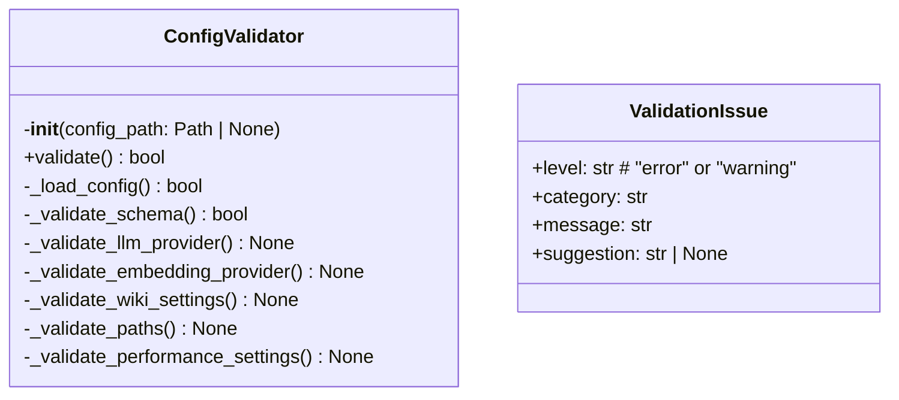

# File: `src/local_deepwiki/cli/config_validator.py`

## File Overview

This file implements a configuration validator for the `local-deepwiki` CLI tool. Its primary responsibility is to ensure that a user-provided configuration file is valid, well-formed, and consistent with the expected schema and runtime requirements. It performs both syntactic validation (via pydantic) and semantic validation (checking environment variables, provider configurations, and performance settings).

The validator is designed to be used by CLI commands such as `config_cli` and `test_config_cli`, where it helps users identify misconfigurations before running more resource-intensive operations.

## Key Concepts

### Configuration Validation Pipeline

The validation process follows a structured pipeline:
1. **File Loading**: Finds and parses the configuration file from one of several default locations.
2. **Schema Validation**: Uses pydantic to validate that the configuration conforms to the expected data model.
3. **Semantic Validation**: Performs checks that go beyond schema correctness, such as verifying environment variables are set for required providers, checking path exclusions, and validating performance-related settings.

This layered approach ensures that both structural and logical correctness are enforced.

### ValidationIssue Abstraction

A `ValidationIssue` class is used to represent validation problems. It encapsulates:
- `level`: Either `"error"` or `"warning"` to distinguish critical vs. advisory issues.
- `category`: Helps categorize the type of issue (e.g., "[LLM Provider](../providers/base.md)", "Performance").
- `message`: A human-readable description of the problem.
- `suggestion`: Optional advice on how to resolve the issue.

This abstraction allows for consistent reporting and enables CLI tools to display issues in a structured way.

### Environment Variable Checks

Several validations depend on environment variables (e.g., `ANTHROPIC_API_KEY`, `OPENAI_API_KEY`) to ensure that required credentials are present for cloud-based LLM providers. This design avoids runtime failures due to missing keys, which would otherwise occur during actual LLM usage.

## Integration

This file integrates with the broader codebase by:
- Importing [`Config`](../config/models.md) from `local_deepwiki.config`, which defines the expected structure of the configuration.
- Being used by `config_cli` and `test_config_cli` — CLI entrypoints that validate configurations before proceeding.
- Leveraging `yaml` for parsing configuration files, and `pydantic` for schema validation.
- Using `os.environ` to check for required API keys, and `pathlib.Path` for file system operations.

The `ConfigValidator` class is the core component that CLI commands instantiate and call to perform validation. The `ValidationIssue` class is used internally to [collect](../web/routes_chat.md) and report issues, and is also referenced in tests via `test_config_cli`.

## Design Notes

### Handling Missing Config Files

If no configuration file is found at any of the default locations, the validator does not fail. Instead, it defaults to an empty `Config()` instance, allowing the system to proceed with default settings. This behavior supports a "zero-config" experience for new users.

### YAML Parsing Robustness

The `_load_config` method handles several edge cases:
- Empty files are treated as valid (default config).
- YAML syntax errors are caught and reported as `ValidationIssue` with actionable suggestions.
- File read errors are also caught and reported as errors.

This ensures that the CLI does not crash due to malformed configuration files.

### Warning vs Error Levels

Warnings are used for non-fatal issues such as:
- Using non-standard embedding models.
- High concurrent LLM calls.
- Performance settings that may be suboptimal.

Errors are reserved for critical issues such as:
- Missing required API keys.
- Invalid YAML syntax.
- Schema violations.

This distinction allows users to proceed with warnings but prevents execution with actual errors.

### Performance Settings Validation

The validator includes checks for performance-related settings:
- Ensures `parallel_workers` is not set too high relative to CPU count.
- Warns about large chunk sizes that may affect search quality.
- Checks if caching is disabled, which can lead to unnecessary API calls or memory usage.

These validations help users avoid common pitfalls that can degrade performance or increase costs.

## API Reference

### class `ValidationIssue`

Represents a configuration validation issue.


<details>
<summary>View Source (lines 17-23) | <a href="https://github.com/UrbanDiver/local-deepwiki-mcp/blob/main/src/local_deepwiki/cli/config_validator.py#L17-L23">GitHub</a></summary>

```python
class ValidationIssue:
    """Represents a configuration validation issue."""

    level: str  # "error" or "warning"
    category: str
    message: str
    suggestion: str | None = None
```

</details>

### class `ConfigValidator`

Validates local-deepwiki configuration.

**Methods:**


<details>
<summary>View Source (lines 26-383) | <a href="https://github.com/UrbanDiver/local-deepwiki-mcp/blob/main/src/local_deepwiki/cli/config_validator.py#L26-L383">GitHub</a></summary>

```python
class ConfigValidator:
    # Methods: __init__, validate, _load_config, _validate_schema, _validate_llm_provider, _validate_embedding_provider, _validate_wiki_settings, _validate_paths, _validate_performance_settings
```

</details>

#### `__init__`

```python
def __init__(config_path: Path | None = None)
```


| Parameter | Type | Default | Description |
|-----------|------|---------|-------------|
| `config_path` | `Path | None` | `None` | - |


<details>
<summary>View Source (lines 29-33) | <a href="https://github.com/UrbanDiver/local-deepwiki-mcp/blob/main/src/local_deepwiki/cli/config_validator.py#L29-L33">GitHub</a></summary>

```python
def __init__(self, config_path: Path | None = None):
        self.config_path = config_path
        self.issues: list[ValidationIssue] = []
        self.config: Config | None = None
        self.raw_config: dict[str, Any] | None = None
```

</details>

#### `validate`

```python
def validate() -> bool
```

Run all validations and return True if config is valid (no errors).


<details>
<summary>View Source (lines 35-55) | <a href="https://github.com/UrbanDiver/local-deepwiki-mcp/blob/main/src/local_deepwiki/cli/config_validator.py#L35-L55">GitHub</a></summary>

```python
def validate(self) -> bool:
        """Run all validations and return True if config is valid (no errors)."""
        self.issues = []

        # Step 1: Find and parse config file
        if not self._load_config():
            return False

        # Step 2: Validate with Pydantic
        if not self._validate_schema():
            return False

        # Step 3: Semantic validations
        self._validate_llm_provider()
        self._validate_embedding_provider()
        self._validate_wiki_settings()
        self._validate_paths()
        self._validate_performance_settings()

        # Return True if no errors (warnings are OK)
        return not any(issue.level == "error" for issue in self.issues)
```

</details>

## Class Diagram



## Call Graph

```mermaid
flowchart TD
    N0[Config]
    N1[ConfigValidator._load_config]
    N2[ConfigValidator._validate_e...]
    N3[ConfigValidator._validate_l...]
    N4[ConfigValidator._validate_p...]
    N5[ConfigValidator._validate_p...]
    N6[ConfigValidator._validate_s...]
    N7[ConfigValidator._validate_w...]
    N8[ConfigValidator.validate]
    N9[ValidationIssue]
    N10[_load_config]
    N11[_validate_embedding_provider]
    N12[_validate_llm_provider]
    N13[_validate_paths]
    N14[_validate_performance_settings]
    N15[_validate_schema]
    N16[_validate_wiki_settings]
    N17[cpu_count]
    N18[cwd]
    N19[errors]
    N20[exists]
    N21[home]
    N22[model_validate]
    N23[read]
    N24[safe_load]
    N8 --> N10
    N8 --> N15
    N8 --> N12
    N8 --> N11
    N8 --> N16
    N8 --> N13
    N8 --> N14
    N1 --> N18
    N1 --> N21
    N1 --> N20
    N1 --> N9
    N1 --> N0
    N1 --> N23
    N1 --> N24
    N6 --> N22
    N6 --> N19
    N6 --> N9
    N3 --> N9
    N2 --> N9
    N7 --> N9
    N4 --> N9
    N5 --> N17
    N5 --> N9
    classDef func fill:#e1f5fe
    class N0,N9,N10,N11,N12,N13,N14,N15,N16,N17,N18,N19,N20,N21,N22,N23,N24 func
    classDef method fill:#fff3e0
    class N1,N2,N3,N4,N5,N6,N7,N8 method
```



## Used By

Functions and methods in this file and their callers:

- **[`Config`](../config/models.md)**: called by `ConfigValidator._load_config`
- **`ValidationIssue`**: called by `ConfigValidator._load_config`, `ConfigValidator._validate_embedding_provider`, `ConfigValidator._validate_llm_provider`, `ConfigValidator._validate_paths`, `ConfigValidator._validate_performance_settings`, `ConfigValidator._validate_schema`, `ConfigValidator._validate_wiki_settings`
- **`_load_config`**: called by `ConfigValidator.validate`
- **`_validate_embedding_provider`**: called by `ConfigValidator.validate`
- **`_validate_llm_provider`**: called by `ConfigValidator.validate`
- **`_validate_paths`**: called by `ConfigValidator.validate`
- **`_validate_performance_settings`**: called by `ConfigValidator.validate`
- **`_validate_schema`**: called by `ConfigValidator.validate`
- **`_validate_wiki_settings`**: called by `ConfigValidator.validate`
- **`cpu_count`**: called by `ConfigValidator._validate_performance_settings`
- **`cwd`**: called by `ConfigValidator._load_config`
- **`errors`**: called by `ConfigValidator._validate_schema`
- **`exists`**: called by `ConfigValidator._load_config`
- **`home`**: called by `ConfigValidator._load_config`
- **`model_validate`**: called by `ConfigValidator._validate_schema`
- **`read`**: called by `ConfigValidator._load_config`
- **`safe_load`**: called by `ConfigValidator._load_config`

## Last Modified

| Entity | Type | Author | Date | Commit |
|--------|------|--------|------|--------|
| `ValidationIssue` | class | Brian Breidenbach | Feb 21, 2026 | `fecde6f` refactor: split 10 large fi... |
| `ConfigValidator` | class | Brian Breidenbach | Feb 21, 2026 | `fecde6f` refactor: split 10 large fi... |
| `__init__` | method | Brian Breidenbach | Feb 21, 2026 | `fecde6f` refactor: split 10 large fi... |
| `validate` | method | Brian Breidenbach | Feb 21, 2026 | `fecde6f` refactor: split 10 large fi... |
| `_load_config` | method | Brian Breidenbach | Feb 21, 2026 | `fecde6f` refactor: split 10 large fi... |
| `_validate_schema` | method | Brian Breidenbach | Feb 21, 2026 | `fecde6f` refactor: split 10 large fi... |
| `_validate_llm_provider` | method | Brian Breidenbach | Feb 21, 2026 | `fecde6f` refactor: split 10 large fi... |
| `_validate_embedding_provider` | method | Brian Breidenbach | Feb 21, 2026 | `fecde6f` refactor: split 10 large fi... |
| `_validate_wiki_settings` | method | Brian Breidenbach | Feb 21, 2026 | `fecde6f` refactor: split 10 large fi... |
| `_validate_paths` | method | Brian Breidenbach | Feb 21, 2026 | `fecde6f` refactor: split 10 large fi... |
| `_validate_performance_settings` | method | Brian Breidenbach | Feb 21, 2026 | `fecde6f` refactor: split 10 large fi... |

## Additional Source Code

Source code for functions and methods not listed in the API Reference above.

#### `_load_config`

<details>
<summary>View Source (lines 57-126) | <a href="https://github.com/UrbanDiver/local-deepwiki-mcp/blob/main/src/local_deepwiki/cli/config_validator.py#L57-L126">GitHub</a></summary>

```python
def _load_config(self) -> bool:
        """Load and parse the config file."""
        config_locations = []

        if self.config_path:
            config_locations.append(self.config_path)
        else:
            # Check default locations
            config_locations = [
                Path.cwd() / "config.yaml",
                Path.cwd() / ".local-deepwiki.yaml",
                Path.home() / ".config" / "local-deepwiki" / "config.yaml",
                Path.home() / ".local-deepwiki.yaml",
            ]

        found_path = None
        for path in config_locations:
            if path.exists():
                found_path = path
                break

        if found_path is None:
            if self.config_path:
                self.issues.append(
                    ValidationIssue(
                        level="error",
                        category="File",
                        message=f"Config file not found: {self.config_path}",
                        suggestion="Check the file path or create a config file",
                    )
                )
            else:
                # No config file is OK - will use defaults
                self.config = Config()
                self.raw_config = {}
                return True
            return False

        self.config_path = found_path

        try:
            with open(found_path) as f:
                content = f.read()
                if not content.strip():
                    # Empty file - use defaults
                    self.config = Config()
                    self.raw_config = {}
                    return True
                self.raw_config = yaml.safe_load(content) or {}
        except yaml.YAMLError as e:
            self.issues.append(
                ValidationIssue(
                    level="error",
                    category="YAML Syntax",
                    message=f"Invalid YAML syntax: {e}",
                    suggestion="Check YAML formatting (indentation, colons, etc.)",
                )
            )
            return False
        except OSError as e:
            self.issues.append(
                ValidationIssue(
                    level="error",
                    category="File",
                    message=f"Cannot read config file: {e}",
                )
            )
            return False

        return True
```

</details>


#### `_validate_schema`

<details>
<summary>View Source (lines 128-144) | <a href="https://github.com/UrbanDiver/local-deepwiki-mcp/blob/main/src/local_deepwiki/cli/config_validator.py#L128-L144">GitHub</a></summary>

```python
def _validate_schema(self) -> bool:
        """Validate config against Pydantic schema."""
        try:
            self.config = Config.model_validate(self.raw_config)
            return True
        except ValidationError as e:
            for error in e.errors():
                location = " -> ".join(str(loc) for loc in error["loc"])
                self.issues.append(
                    ValidationIssue(
                        level="error",
                        category="Schema",
                        message=f"{location}: {error['msg']}",
                        suggestion=f"Expected type: {error.get('type', 'unknown')}",
                    )
                )
            return False
```

</details>


#### `_validate_llm_provider`

<details>
<summary>View Source (lines 146-206) | <a href="https://github.com/UrbanDiver/local-deepwiki-mcp/blob/main/src/local_deepwiki/cli/config_validator.py#L146-L206">GitHub</a></summary>

```python
def _validate_llm_provider(self) -> None:
        """Validate LLM provider configuration."""
        if self.config is None:
            return

        provider = self.config.llm.provider

        if provider == "anthropic":
            api_key = os.environ.get("ANTHROPIC_API_KEY")
            if not api_key:
                self.issues.append(
                    ValidationIssue(
                        level="error",
                        category="LLM Provider",
                        message="ANTHROPIC_API_KEY environment variable not set",
                        suggestion="Set ANTHROPIC_API_KEY or switch to 'ollama' provider",
                    )
                )
            elif not api_key.startswith("sk-ant-"):
                self.issues.append(
                    ValidationIssue(
                        level="warning",
                        category="LLM Provider",
                        message="ANTHROPIC_API_KEY does not match expected format (sk-ant-...)",
                        suggestion="Verify your API key is correct",
                    )
                )

        elif provider == "openai":
            api_key = os.environ.get("OPENAI_API_KEY")
            if not api_key:
                self.issues.append(
                    ValidationIssue(
                        level="error",
                        category="LLM Provider",
                        message="OPENAI_API_KEY environment variable not set",
                        suggestion="Set OPENAI_API_KEY or switch to 'ollama' provider",
                    )
                )
            elif not api_key.startswith("sk-"):
                self.issues.append(
                    ValidationIssue(
                        level="warning",
                        category="LLM Provider",
                        message="OPENAI_API_KEY does not match expected format (sk-...)",
                        suggestion="Verify your API key is correct",
                    )
                )

        elif provider == "ollama":
            base_url = self.config.llm.ollama.base_url
            # Check if Ollama is likely accessible
            if "localhost" in base_url or "127.0.0.1" in base_url:
                self.issues.append(
                    ValidationIssue(
                        level="warning",
                        category="LLM Provider",
                        message=f"Ollama configured at {base_url}",
                        suggestion="Ensure Ollama is running: `ollama serve`",
                    )
                )
```

</details>


#### `_validate_embedding_provider`

<details>
<summary>View Source (lines 208-242) | <a href="https://github.com/UrbanDiver/local-deepwiki-mcp/blob/main/src/local_deepwiki/cli/config_validator.py#L208-L242">GitHub</a></summary>

```python
def _validate_embedding_provider(self) -> None:
        """Validate embedding provider configuration."""
        if self.config is None:
            return

        provider = self.config.embedding.provider

        if provider == "openai":
            api_key = os.environ.get("OPENAI_API_KEY")
            if not api_key:
                self.issues.append(
                    ValidationIssue(
                        level="error",
                        category="Embedding Provider",
                        message="OPENAI_API_KEY environment variable not set",
                        suggestion="Set OPENAI_API_KEY or switch to 'local' embedding provider",
                    )
                )

        elif provider == "local":
            model = self.config.embedding.local.model
            # Check for common model names
            if model not in [
                "all-MiniLM-L6-v2",
                "all-mpnet-base-v2",
                "paraphrase-multilingual-MiniLM-L12-v2",
            ]:
                self.issues.append(
                    ValidationIssue(
                        level="warning",
                        category="Embedding Provider",
                        message=f"Using custom embedding model: {model}",
                        suggestion="Ensure this model is available from sentence-transformers",
                    )
                )
```

</details>


#### `_validate_wiki_settings`

<details>
<summary>View Source (lines 244-305) | <a href="https://github.com/UrbanDiver/local-deepwiki-mcp/blob/main/src/local_deepwiki/cli/config_validator.py#L244-L305">GitHub</a></summary>

```python
def _validate_wiki_settings(self) -> None:
        """Validate wiki generation settings."""
        if self.config is None:
            return

        wiki = self.config.wiki

        # Check cloud provider for GitHub
        if wiki.use_cloud_for_github:
            if wiki.github_llm_provider == "anthropic":
                if not os.environ.get("ANTHROPIC_API_KEY"):
                    self.issues.append(
                        ValidationIssue(
                            level="error",
                            category="Wiki Settings",
                            message="use_cloud_for_github enabled but ANTHROPIC_API_KEY not set",
                            suggestion="Set ANTHROPIC_API_KEY or disable use_cloud_for_github",
                        )
                    )
            elif wiki.github_llm_provider == "openai":
                if not os.environ.get("OPENAI_API_KEY"):
                    self.issues.append(
                        ValidationIssue(
                            level="error",
                            category="Wiki Settings",
                            message="use_cloud_for_github enabled but OPENAI_API_KEY not set",
                            suggestion="Set OPENAI_API_KEY or disable use_cloud_for_github",
                        )
                    )

        # Check chat provider
        chat_provider = wiki.chat_llm_provider
        if chat_provider not in ("default", self.config.llm.provider):
            if chat_provider == "anthropic" and not os.environ.get("ANTHROPIC_API_KEY"):
                self.issues.append(
                    ValidationIssue(
                        level="error",
                        category="Wiki Settings",
                        message=f"chat_llm_provider is '{chat_provider}' but API key not set",
                        suggestion="Set ANTHROPIC_API_KEY or use 'default' provider",
                    )
                )
            elif chat_provider == "openai" and not os.environ.get("OPENAI_API_KEY"):
                self.issues.append(
                    ValidationIssue(
                        level="error",
                        category="Wiki Settings",
                        message=f"chat_llm_provider is '{chat_provider}' but API key not set",
                        suggestion="Set OPENAI_API_KEY or use 'default' provider",
                    )
                )

        # Performance warnings
        if wiki.max_concurrent_llm_calls > 10:
            self.issues.append(
                ValidationIssue(
                    level="warning",
                    category="Wiki Settings",
                    message=f"max_concurrent_llm_calls is {wiki.max_concurrent_llm_calls}",
                    suggestion="High values may cause rate limiting or memory issues",
                )
            )
```

</details>


#### `_validate_paths`

<details>
<summary>View Source (lines 307-332) | <a href="https://github.com/UrbanDiver/local-deepwiki-mcp/blob/main/src/local_deepwiki/cli/config_validator.py#L307-L332">GitHub</a></summary>

```python
def _validate_paths(self) -> None:
        """Validate path-related settings."""
        if self.config is None:
            return

        # Check exclude patterns for common issues
        exclude_patterns = self.config.parsing.exclude_patterns
        if not any("node_modules" in p for p in exclude_patterns):
            self.issues.append(
                ValidationIssue(
                    level="warning",
                    category="Parsing",
                    message="node_modules not in exclude_patterns",
                    suggestion="Add 'node_modules/**' to avoid indexing dependencies",
                )
            )

        if not any(".git" in p for p in exclude_patterns):
            self.issues.append(
                ValidationIssue(
                    level="warning",
                    category="Parsing",
                    message=".git not in exclude_patterns",
                    suggestion="Add '.git/**' to avoid indexing git objects",
                )
            )
```

</details>


#### `_validate_performance_settings`

<details>
<summary>View Source (lines 334-383) | <a href="https://github.com/UrbanDiver/local-deepwiki-mcp/blob/main/src/local_deepwiki/cli/config_validator.py#L334-L383">GitHub</a></summary>

```python
def _validate_performance_settings(self) -> None:
        """Validate performance-related settings."""
        if self.config is None:
            return

        chunking = self.config.chunking

        # Check parallel workers
        cpu_count = os.cpu_count() or 4
        if chunking.parallel_workers > cpu_count * 2:
            self.issues.append(
                ValidationIssue(
                    level="warning",
                    category="Performance",
                    message=f"parallel_workers ({chunking.parallel_workers}) > 2x CPU count ({cpu_count})",
                    suggestion=f"Consider reducing to {cpu_count} for optimal performance",
                )
            )

        # Check chunk sizes
        if chunking.max_chunk_tokens > 1024:
            self.issues.append(
                ValidationIssue(
                    level="warning",
                    category="Performance",
                    message=f"max_chunk_tokens is {chunking.max_chunk_tokens}",
                    suggestion="Large chunks may reduce search quality. Consider 512-1024 tokens.",
                )
            )

        # Check cache settings
        if not self.config.embedding_cache.enabled:
            self.issues.append(
                ValidationIssue(
                    level="warning",
                    category="Performance",
                    message="Embedding cache is disabled",
                    suggestion="Enable caching for faster repeated operations",
                )
            )

        if not self.config.llm_cache.enabled:
            self.issues.append(
                ValidationIssue(
                    level="warning",
                    category="Performance",
                    message="LLM cache is disabled",
                    suggestion="Enable caching to reduce API costs and latency",
                )
            )
```

</details>

## Relevant Source Files

- `src/local_deepwiki/cli/config_validator.py:17-23`
