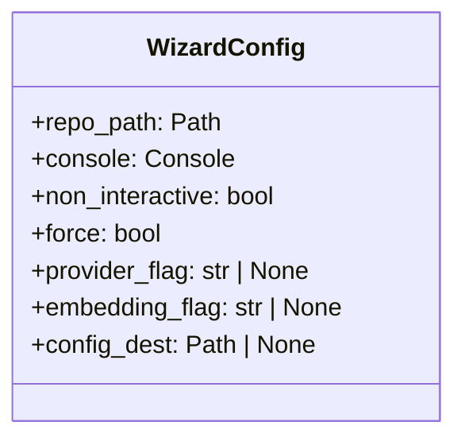
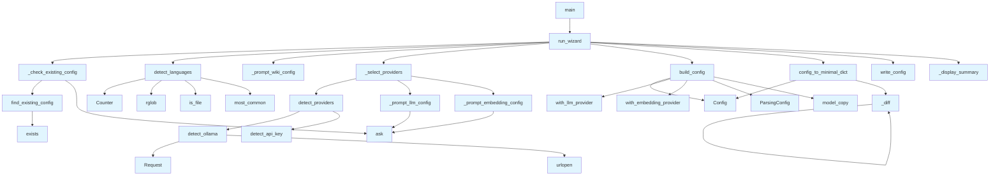

# File: `src/local_deepwiki/cli/init_cli.py`

## File Overview

This file implements an interactive configuration wizard for the `local-deepwiki` tool. It provides a guided setup process that helps users configure their project for use with local-deepwiki by detecting source languages, selecting LLM and embedding providers, and writing a configuration file.

The wizard supports both interactive and non-interactive modes, allowing users to either manually select options or automatically configure based on detected defaults and command-line flags.

## Key Concepts

### Configuration Wizard Abstraction
The `WizardConfig` dataclass bundles all parameters needed for the wizard into a single immutable object. This approach improves maintainability and clarity by reducing the number of function parameters and enforcing immutability for configuration values.

### Language Detection Algorithm
The `detect_languages` function scans a repository for source files using file extensions to infer languages. It skips common non-source directories and caps the scan at `_MAX_FILES_SCAN` for performance. The detection logic prioritizes speed over completeness by limiting the number of files processed.

### Provider Detection and Priority
The `detect_providers` function identifies available LLM providers (Ollama, Anthropic, OpenAI) by checking network connectivity or environment variables. A priority list (`_priority`) is used to suggest defaults in non-interactive mode, prioritizing cloud providers over local ones when available.

### Config Diffing for Minimal Output
The `config_to_minimal_dict` function uses a recursive `_diff` helper to compare the generated configuration against defaults. This ensures that only non-default values are written to the config file, making it more readable and maintainable.

### Non-Interactive Mode Support
The wizard supports non-interactive mode through flags (`--non-interactive`, `--force`, `--provider`, `--embedding`). This allows automation and scripting while preserving the same core logic for configuration generation.

## Integration

This file integrates with the broader `local-deepwiki` codebase by:

- Using [`Config`](../config/models.md) and [`ParsingConfig`](../config/models_wiki.md) from `local_deepwiki.config.models` to build and validate configurations
- Leveraging `rich` components (`Console`, `Panel`, `Prompt`, `Table`) for CLI output and interaction
- Reusing helper functions like `find_existing_config` and `detect_api_key` across CLI modules
- Being called by `main` which serves as the entry point for the `deepwiki init` command
- Supporting test infrastructure via functions like `run_wizard`, `find_existing_config`, and `config_to_minimal_dict`

The file is part of the CLI module structure and works in conjunction with other CLI tools such as `check_cli.py` and `main.py` to provide a complete command-line experience for configuring and running local-deepwiki.

## Design Notes

### Why Use `dataclass` for `WizardConfig`
Using a `dataclass` for `WizardConfig` centralizes configuration management, improves type safety, and reduces parameter passing complexity. It also enables easy freezing of values, preventing accidental mutation during wizard execution.

### Language Detection Performance
The language detection process is capped at `_MAX_FILES_SCAN` to prevent performance issues on large repositories. This trade-off prioritizes responsiveness over exhaustive file scanning.

### Provider Priority Logic
The priority list for LLM providers (`_priority = ("openai", "anthropic", "ollama")`) reflects common user preferences where cloud-based providers are preferred for their quality and availability, with local options as fallbacks.

### Config File Writing Strategy
The config writing strategy avoids cluttering the output with default values by using a diffing algorithm. If the configuration matches defaults exactly, a minimal comment-only file is written to ensure the path exists without unnecessary content.

### Error Handling in Network Probes
Network probes like `detect_ollama` use broad exception handling to prevent crashes in the wizard. This is intentional — the wizard should not fail due to network issues, as users may be configuring offline environments.

### Interactive vs Non-Interactive Flow
The code maintains a clear separation between interactive and non-interactive flows, ensuring that flag-based configuration works seamlessly with prompt-based interaction. The `non_interactive` flag controls whether prompts are shown, while `force` determines behavior when overwriting existing configs.

## API Reference

### class `WizardConfig`

Immutable configuration for the init wizard.  Bundles the 8 parameters previously passed individually to ``run_wizard`` into a single frozen dataclass.

---


<details>
<summary>View Source (lines 30-43) | <a href="https://github.com/UrbanDiver/local-deepwiki-mcp/blob/main/src/local_deepwiki/cli/init_cli.py#L30-L43">GitHub</a></summary>

```python
class WizardConfig:
    """Immutable configuration for the init wizard.

    Bundles the 8 parameters previously passed individually to
    ``run_wizard`` into a single frozen dataclass.
    """

    repo_path: Path
    console: Console
    non_interactive: bool = False
    force: bool = False
    provider_flag: str | None = None
    embedding_flag: str | None = None
    config_dest: Path | None = None
```

</details>

### Functions

#### `find_existing_config`

```python
def find_existing_config() -> Path | None
```

Return the first existing config file path, or None.

**Returns:** `Path | None`


<details>
<summary>View Source (lines 132-137) | <a href="https://github.com/UrbanDiver/local-deepwiki-mcp/blob/main/src/local_deepwiki/cli/init_cli.py#L132-L137">GitHub</a></summary>

```python
def find_existing_config() -> Path | None:
    """Return the first existing config file path, or None."""
    for path in _CONFIG_SEARCH_PATHS:
        if path.exists():
            return path
    return None
```

</details>

#### `detect_languages`

```python
def detect_languages(repo_path: Path) -> dict[str, int]
```

Scan *repo_path* for source files and return {language: file_count}.  Skips common non-source directories and caps the scan at ``_MAX_FILES_SCAN`` files for speed.


| Parameter | Type | Default | Description |
|-----------|------|---------|-------------|
| `repo_path` | `Path` | - | - |

**Returns:** `dict[str, int]`


<details>
<summary>View Source (lines 140-163) | <a href="https://github.com/UrbanDiver/local-deepwiki-mcp/blob/main/src/local_deepwiki/cli/init_cli.py#L140-L163">GitHub</a></summary>

```python
def detect_languages(repo_path: Path) -> dict[str, int]:
    """Scan *repo_path* for source files and return {language: file_count}.

    Skips common non-source directories and caps the scan at
    ``_MAX_FILES_SCAN`` files for speed.
    """
    counts: Counter[str] = Counter()
    scanned = 0

    for item in repo_path.rglob("*"):
        if scanned >= _MAX_FILES_SCAN:
            break
        # Skip excluded directories
        if any(part in _SKIP_DIRS for part in item.parts):
            continue
        if not item.is_file():
            continue
        scanned += 1
        lang = _EXTENSION_TO_LANGUAGE.get(item.suffix.lower())
        if lang is not None:
            counts[lang] += 1

    # Return sorted by count descending
    return dict(counts.most_common())
```

</details>

#### `detect_ollama`

```python
def detect_ollama(base_url: str = "http://localhost:11434") -> bool
```

Return True if Ollama is reachable at *base_url*.


| Parameter | Type | Default | Description |
|-----------|------|---------|-------------|
| `base_url` | `str` | `"http://localhost:11434"` | - |

**Returns:** `bool`


<details>
<summary>View Source (lines 166-173) | <a href="https://github.com/UrbanDiver/local-deepwiki-mcp/blob/main/src/local_deepwiki/cli/init_cli.py#L166-L173">GitHub</a></summary>

```python
def detect_ollama(base_url: str = "http://localhost:11434") -> bool:
    """Return True if Ollama is reachable at *base_url*."""
    try:
        req = urllib.request.Request(f"{base_url}/api/tags", method="GET")
        with urllib.request.urlopen(req, timeout=2):
            return True
    except Exception:  # noqa: BLE001 — CLI top-level handler: network probe must not crash init wizard
        return False
```

</details>

#### `detect_api_key`

```python
def detect_api_key(env_var: str) -> bool
```

Return True if *env_var* is set and non-empty.


| Parameter | Type | Default | Description |
|-----------|------|---------|-------------|
| `env_var` | `str` | - | - |

**Returns:** `bool`


<details>
<summary>View Source (lines 176-178) | <a href="https://github.com/UrbanDiver/local-deepwiki-mcp/blob/main/src/local_deepwiki/cli/init_cli.py#L176-L178">GitHub</a></summary>

```python
def detect_api_key(env_var: str) -> bool:
    """Return True if *env_var* is set and non-empty."""
    return bool(os.environ.get(env_var))
```

</details>

#### `detect_providers`

```python
def detect_providers() -> dict[str, bool]
```

Detect which LLM providers are available.

**Returns:** `dict[str, bool]`


<details>
<summary>View Source (lines 187-197) | <a href="https://github.com/UrbanDiver/local-deepwiki-mcp/blob/main/src/local_deepwiki/cli/init_cli.py#L187-L197">GitHub</a></summary>

```python
def detect_providers() -> dict[str, bool]:
    """Detect which LLM providers are available.

    Returns:
        Dict mapping provider name to availability boolean.
    """
    return {
        "ollama": detect_ollama(),
        "anthropic": detect_api_key("ANTHROPIC_API_KEY"),
        "openai": detect_api_key("OPENAI_API_KEY"),
    }
```

</details>

#### `build_config`

```python
def build_config(llm_provider: Literal["ollama", "anthropic", "openai"], embedding_provider: Literal["local", "openai"], languages: list[str]) -> Config
```

Build a [Config](../config/models.md) object from wizard selections.


| Parameter | Type | Default | Description |
|-----------|------|---------|-------------|
| `llm_provider` | `Literal["ollama", "anthropic", "openai"]` | - | - |
| `embedding_provider` | `Literal["local", "openai"]` | - | - |
| `languages` | `list[str]` | - | - |

**Returns:** [`Config`](../config/models.md)


<details>
<summary>View Source (lines 200-217) | <a href="https://github.com/UrbanDiver/local-deepwiki-mcp/blob/main/src/local_deepwiki/cli/init_cli.py#L200-L217">GitHub</a></summary>

```python
def build_config(
    llm_provider: Literal["ollama", "anthropic", "openai"],
    embedding_provider: Literal["local", "openai"],
    languages: list[str],
) -> Config:
    """Build a Config object from wizard selections."""
    from local_deepwiki.config.models import ParsingConfig

    base = Config()
    config = base.with_llm_provider(llm_provider)
    config = config.with_embedding_provider(embedding_provider)

    # Set detected languages if different from default
    if sorted(languages) != sorted(base.parsing.languages):
        new_parsing = ParsingConfig(languages=languages)
        config = config.model_copy(update={"parsing": new_parsing})

    return config
```

</details>

#### `config_to_minimal_dict`

```python
def config_to_minimal_dict(config: Config) -> dict
```

Dump only the fields that differ from defaults for a cleaner YAML.


| Parameter | Type | Default | Description |
|-----------|------|---------|-------------|
| `config` | `Config` | - | - |

**Returns:** `dict`


<details>
<summary>View Source (lines 220-250) | <a href="https://github.com/UrbanDiver/local-deepwiki-mcp/blob/main/src/local_deepwiki/cli/init_cli.py#L220-L250">GitHub</a></summary>

```python
def config_to_minimal_dict(config: Config) -> dict:
    """Dump only the fields that differ from defaults for a cleaner YAML."""
    defaults = Config()
    full = config.model_dump(
        exclude={
            "effective_embedding_batch_size",
            "effective_max_workers",
            "effective_llm_concurrency",
        }
    )
    default_full = defaults.model_dump(
        exclude={
            "effective_embedding_batch_size",
            "effective_max_workers",
            "effective_llm_concurrency",
        }
    )

    def _diff(current: dict, default: dict) -> dict:
        result: dict = {}
        for key, value in current.items():
            default_value = default.get(key)
            if isinstance(value, dict) and isinstance(default_value, dict):
                nested = _diff(value, default_value)
                if nested:
                    result[key] = nested
            elif value != default_value:
                result[key] = value
        return result

    return _diff(full, default_full)
```

</details>

#### `write_config`

```python
def write_config(config_dict: dict, dest: Path) -> None
```

Write *config_dict* as YAML to *dest*, creating parent dirs.


| Parameter | Type | Default | Description |
|-----------|------|---------|-------------|
| `config_dict` | `dict` | - | - |
| `dest` | `Path` | - | - |

**Returns:** `None`


<details>
<summary>View Source (lines 253-256) | <a href="https://github.com/UrbanDiver/local-deepwiki-mcp/blob/main/src/local_deepwiki/cli/init_cli.py#L253-L256">GitHub</a></summary>

```python
def write_config(config_dict: dict, dest: Path) -> None:
    """Write *config_dict* as YAML to *dest*, creating parent dirs."""
    dest.parent.mkdir(parents=True, exist_ok=True)
    dest.write_text(yaml.dump(config_dict, default_flow_style=False, sort_keys=False))
```

</details>

#### `run_wizard`

```python
def run_wizard(repo_path_or_config: Path | WizardConfig, console: Console | None = None, non_interactive: bool = False, force: bool = False, provider_flag: str | None = None, embedding_flag: str | None = None, config_dest: Path | None = None) -> int
```

Run the init wizard and return an exit code (0 = success).  Accepts either a :class:`WizardConfig` (preferred) or the legacy positional parameters for backward compatibility with existing callers and tests.


| Parameter | Type | Default | Description |
|-----------|------|---------|-------------|
| `repo_path_or_config` | `Path | WizardConfig` | - | - |
| `console` | `Console | None` | `None` | - |
| `non_interactive` | `bool` | `False` | - |
| `force` | `bool` | `False` | - |
| `provider_flag` | `str | None` | `None` | - |
| `embedding_flag` | `str | None` | `None` | - |
| `config_dest` | `Path | None` | `None` | - |

**Returns:** `int`


<details>
<summary>View Source (lines 426-495) | <a href="https://github.com/UrbanDiver/local-deepwiki-mcp/blob/main/src/local_deepwiki/cli/init_cli.py#L426-L495">GitHub</a></summary>

```python
def run_wizard(
    repo_path_or_config: Path | WizardConfig,
    console: Console | None = None,
    *,
    non_interactive: bool = False,
    force: bool = False,
    provider_flag: str | None = None,
    embedding_flag: str | None = None,
    config_dest: Path | None = None,
) -> int:
    """Run the init wizard and return an exit code (0 = success).

    Accepts either a :class:`WizardConfig` (preferred) or the legacy
    positional parameters for backward compatibility with existing
    callers and tests.
    """
    if isinstance(repo_path_or_config, WizardConfig):
        cfg = repo_path_or_config
    else:
        cfg = WizardConfig(
            repo_path=repo_path_or_config,
            console=console or Console(),
            non_interactive=non_interactive,
            force=force,
            provider_flag=provider_flag,
            embedding_flag=embedding_flag,
            config_dest=config_dest,
        )

    cfg.console.print("\n[bold]deepwiki init[/bold] - project configuration wizard\n")

    # ── Step 1: Check for existing config ─────────────────────────
    dest = cfg.config_dest or _DEFAULT_CONFIG_PATH
    if not _check_existing_config(dest, cfg.non_interactive, cfg.force, cfg.console):
        return 1

    # ── Step 2: Detect languages ──────────────────────────────────
    cfg.console.print(
        f"[bold]Scanning[/bold] {cfg.repo_path.resolve()} for source files..."
    )
    lang_counts = detect_languages(cfg.repo_path)
    detected_languages = _prompt_wiki_config(cfg.console, lang_counts)

    # ── Steps 3–4: Choose providers ───────────────────────────────
    llm_provider, embedding_provider = _select_providers(
        cfg.console,
        non_interactive=cfg.non_interactive,
        provider_flag=cfg.provider_flag,
        embedding_flag=cfg.embedding_flag,
    )

    # ── Step 5: Build config ──────────────────────────────────────
    config = build_config(llm_provider, embedding_provider, detected_languages)  # type: ignore[arg-type]

    # ── Step 6: Write config ──────────────────────────────────────
    minimal = config_to_minimal_dict(config)

    if not minimal:
        # All defaults — write a comment-only file so the path exists
        minimal = {"llm": {"provider": llm_provider}}

    write_config(minimal, dest)
    cfg.console.print(f"\n[green]Config written to:[/green] {dest}")

    # ── Step 7: Summary & next steps ──────────────────────────────
    _display_summary(
        cfg.console, dest, llm_provider, embedding_provider, detected_languages
    )

    return 0
```

</details>

#### `main`

```python
def main() -> int
```

Main entry point for ``deepwiki init``.

**Returns:** `int`


<details>
<summary>View Source (lines 501-567) | <a href="https://github.com/UrbanDiver/local-deepwiki-mcp/blob/main/src/local_deepwiki/cli/init_cli.py#L501-L567">GitHub</a></summary>

```python
def main() -> int:
    """Main entry point for ``deepwiki init``."""
    parser = argparse.ArgumentParser(
        prog="deepwiki init",
        description="Initialize local-deepwiki configuration with a guided wizard",
        epilog=(
            "examples:\n"
            "  deepwiki init                              Interactive wizard\n"
            "  deepwiki init /path/to/repo                Scan a specific repo\n"
            "  deepwiki init --non-interactive             Use auto-detected defaults\n"
            "  deepwiki init --provider anthropic          Pre-select LLM provider\n"
            "  deepwiki init --non-interactive --force     Overwrite existing config\n"
            "  deepwiki init --config ./my-config.yaml     Write to custom path\n"
        ),
        formatter_class=argparse.RawDescriptionHelpFormatter,
    )
    parser.add_argument(
        "repo_path",
        nargs="?",
        default=".",
        help="Repository path to scan for languages (default: current directory)",
    )
    parser.add_argument(
        "--non-interactive",
        action="store_true",
        help="Skip all prompts, use detected defaults and flags",
    )
    parser.add_argument(
        "--force",
        action="store_true",
        help="Overwrite existing config without prompting (use with --non-interactive)",
    )
    parser.add_argument(
        "--provider",
        choices=["ollama", "anthropic", "openai"],
        help="LLM provider (used with --non-interactive)",
    )
    parser.add_argument(
        "--embedding",
        choices=["local", "openai"],
        help="Embedding provider (used with --non-interactive)",
    )
    parser.add_argument(
        "--config",
        type=str,
        help="Config file destination (default: ~/.config/local-deepwiki/config.yaml)",
    )

    args = parser.parse_args()
    console = Console()

    repo = Path(args.repo_path)
    if not repo.is_dir():
        console.print(f"[red]Not a directory: {repo}[/red]")
        return 1

    config_dest = Path(args.config) if args.config else None

    return run_wizard(
        repo,
        console,
        non_interactive=args.non_interactive,
        force=args.force,
        provider_flag=args.provider,
        embedding_flag=args.embedding,
        config_dest=config_dest,
    )
```

</details>

## Class Diagram



## Call Graph



## Used By

Functions and methods in this file and their callers:

- **`ArgumentParser`**: called by `main`
- **[`Config`](../config/models.md)**: called by `build_config`, `config_to_minimal_dict`
- **`Counter`**: called by `detect_languages`
- **`Panel`**: called by `_display_summary`
- **[`ParsingConfig`](../config/models_wiki.md)**: called by `build_config`
- **`Path`**: called by `main`
- **`Request`**: called by `detect_ollama`
- **`Table`**: called by `_prompt_wiki_config`
- **`WizardConfig`**: called by `run_wizard`
- **`_check_existing_config`**: called by `run_wizard`
- **`_diff`**: called by `_diff`, `config_to_minimal_dict`
- **`_display_summary`**: called by `run_wizard`
- **`_prompt_embedding_config`**: called by `_select_providers`
- **`_prompt_llm_config`**: called by `_select_providers`
- **`_prompt_wiki_config`**: called by `run_wizard`
- **`_provider_status`**: called by `_prompt_llm_config`
- **`_select_providers`**: called by `run_wizard`
- **`add_argument`**: called by `main`
- **`add_column`**: called by `_prompt_wiki_config`
- **`add_row`**: called by `_prompt_wiki_config`
- **`ask`**: called by `_check_existing_config`, `_prompt_embedding_config`, `_prompt_llm_config`
- **`build_config`**: called by `run_wizard`
- **`config_to_minimal_dict`**: called by `run_wizard`
- **`detect_api_key`**: called by `detect_providers`
- **`detect_languages`**: called by `run_wizard`
- **`detect_ollama`**: called by `detect_providers`
- **`detect_providers`**: called by `_select_providers`
- **`dump`**: called by `write_config`
- **`exists`**: called by `find_existing_config`
- **`find_existing_config`**: called by `_check_existing_config`
- **`is_dir`**: called by `main`
- **`is_file`**: called by `detect_languages`
- **`mkdir`**: called by `write_config`
- **`model_copy`**: called by `build_config`
- **`model_dump`**: called by `config_to_minimal_dict`
- **`most_common`**: called by `detect_languages`
- **`parse_args`**: called by `main`
- **`resolve`**: called by `run_wizard`
- **`rglob`**: called by `detect_languages`
- **`run_wizard`**: called by `main`
- **`urlopen`**: called by `detect_ollama`
- **`with_embedding_provider`**: called by `build_config`
- **`with_llm_provider`**: called by `build_config`
- **`write_config`**: called by `run_wizard`
- **`write_text`**: called by `write_config`

## Last Modified

| Entity | Type | Author | Date | Commit |
|--------|------|--------|------|--------|
| `_prompt_llm_config` | function | Brian Breidenbach | today | `27e3cd1` feat: release readiness — O... |
| `WizardConfig` | class | Brian Breidenbach | yesterday | `1eef062` refactor: complete Grade A ... |
| `run_wizard` | function | Brian Breidenbach | yesterday | `1eef062` refactor: complete Grade A ... |
| `_check_existing_config` | function | Brian Breidenbach | 1 week ago | `bb87164` refactor: extract wizard se... |
| `_select_providers` | function | Brian Breidenbach | 1 week ago | `bb87164` refactor: extract wizard se... |
| `_display_summary` | function | Brian Breidenbach | 1 week ago | `bb87164` refactor: extract wizard se... |
| `_prompt_embedding_config` | function | Brian Breidenbach | 1 week ago | `d94846c` refactor: split CLI long me... |
| `_prompt_wiki_config` | function | Brian Breidenbach | 1 week ago | `d94846c` refactor: split CLI long me... |
| `detect_ollama` | function | Brian Breidenbach | Feb 23, 2026 | `c6fe2bd` refactor: split oversized m... |
| `main` | function | Brian Breidenbach | Feb 12, 2026 | `90bb340` fix: align freshness checke... |
| `find_existing_config` | function | Brian Breidenbach | Feb 12, 2026 | `df695d3` feat: add MCP Resources, ag... |
| `detect_languages` | function | Brian Breidenbach | Feb 12, 2026 | `df695d3` feat: add MCP Resources, ag... |
| `detect_api_key` | function | Brian Breidenbach | Feb 12, 2026 | `df695d3` feat: add MCP Resources, ag... |
| `_provider_status` | function | Brian Breidenbach | Feb 12, 2026 | `df695d3` feat: add MCP Resources, ag... |
| `detect_providers` | function | Brian Breidenbach | Feb 12, 2026 | `df695d3` feat: add MCP Resources, ag... |
| `build_config` | function | Brian Breidenbach | Feb 12, 2026 | `df695d3` feat: add MCP Resources, ag... |
| `config_to_minimal_dict` | function | Brian Breidenbach | Feb 12, 2026 | `df695d3` feat: add MCP Resources, ag... |
| `_diff` | function | Brian Breidenbach | Feb 12, 2026 | `df695d3` feat: add MCP Resources, ag... |
| `write_config` | function | Brian Breidenbach | Feb 12, 2026 | `df695d3` feat: add MCP Resources, ag... |

## Additional Source Code

Source code for functions and methods not listed in the API Reference above.

#### `_provider_status`

<details>
<summary>View Source (lines 181-184) | <a href="https://github.com/UrbanDiver/local-deepwiki-mcp/blob/main/src/local_deepwiki/cli/init_cli.py#L181-L184">GitHub</a></summary>

```python
def _provider_status(available: bool) -> str:
    if available:
        return "[green]detected[/green]"
    return "[dim]not detected[/dim]"
```

</details>


#### `_diff`

<details>
<summary>View Source (lines 238-248) | <a href="https://github.com/UrbanDiver/local-deepwiki-mcp/blob/main/src/local_deepwiki/cli/init_cli.py#L238-L248">GitHub</a></summary>

```python
def _diff(current: dict, default: dict) -> dict:
        result: dict = {}
        for key, value in current.items():
            default_value = default.get(key)
            if isinstance(value, dict) and isinstance(default_value, dict):
                nested = _diff(value, default_value)
                if nested:
                    result[key] = nested
            elif value != default_value:
                result[key] = value
        return result
```

</details>


#### `_check_existing_config`

<details>
<summary>View Source (lines 262-291) | <a href="https://github.com/UrbanDiver/local-deepwiki-mcp/blob/main/src/local_deepwiki/cli/init_cli.py#L262-L291">GitHub</a></summary>

```python
def _check_existing_config(
    dest: Path,
    non_interactive: bool,
    force: bool,
    console: Console,
) -> bool:
    """Check for an existing config and resolve any conflict.

    Returns True if the wizard should proceed, False if it should abort.
    *dest* is unused here but kept for a uniform signature.
    """
    existing = find_existing_config()
    if existing is None:
        return True

    console.print(f"[yellow]Existing config found:[/yellow] {existing}")
    if non_interactive and not force:
        console.print(
            "[red]Aborting (--non-interactive, will not overwrite). Use --force to overwrite.[/red]"
        )
        return False
    if non_interactive and force:
        console.print("[yellow]--force: overwriting existing config.[/yellow]")
        return True

    overwrite = Prompt.ask("Overwrite?", choices=["yes", "no"], default="no")
    if overwrite != "yes":
        console.print("[dim]Aborted.[/dim]")
        return False
    return True
```

</details>


#### `_select_providers`

<details>
<summary>View Source (lines 294-317) | <a href="https://github.com/UrbanDiver/local-deepwiki-mcp/blob/main/src/local_deepwiki/cli/init_cli.py#L294-L317">GitHub</a></summary>

```python
def _select_providers(
    console: Console,
    *,
    non_interactive: bool,
    provider_flag: str | None,
    embedding_flag: str | None,
) -> tuple[str, str]:
    """Detect providers and prompt (or auto-select) LLM + embedding.

    Returns *(llm_provider, embedding_provider)*.
    """
    providers = detect_providers()
    llm_provider = _prompt_llm_config(
        console,
        providers,
        non_interactive=non_interactive,
        provider_flag=provider_flag,
    )
    embedding_provider = _prompt_embedding_config(
        console,
        non_interactive=non_interactive,
        embedding_flag=embedding_flag,
    )
    return llm_provider, embedding_provider
```

</details>


#### `_display_summary`

<details>
<summary>View Source (lines 320-349) | <a href="https://github.com/UrbanDiver/local-deepwiki-mcp/blob/main/src/local_deepwiki/cli/init_cli.py#L320-L349">GitHub</a></summary>

```python
def _display_summary(
    console: Console,
    dest: Path,
    llm_provider: str,
    embedding_provider: str,
    languages: list[str],
) -> None:
    """Print the setup-complete panel and next-steps hints."""
    summary_lines = [
        f"[bold]Config path:[/bold]  {dest}",
        f"[bold]LLM provider:[/bold] {llm_provider}",
        f"[bold]Embedding:[/bold]    {embedding_provider}",
        f"[bold]Languages:[/bold]    {', '.join(languages[:8])}{'...' if len(languages) > 8 else ''}",
    ]
    console.print(
        Panel(
            "\n".join(summary_lines),
            title="Setup Complete",
            border_style="green",
        )
    )
    console.print("[bold]Next steps:[/bold]")
    console.print(
        "  deepwiki mcp                  Start MCP server (for IDE integration)"
    )
    console.print(
        "  deepwiki serve .deepwiki       Browse wiki at http://localhost:8080"
    )
    console.print("  deepwiki config health-check   Verify providers are working")
    console.print()
```

</details>


#### `_prompt_llm_config`

<details>
<summary>View Source (lines 352-382) | <a href="https://github.com/UrbanDiver/local-deepwiki-mcp/blob/main/src/local_deepwiki/cli/init_cli.py#L352-L382">GitHub</a></summary>

```python
def _prompt_llm_config(
    console: Console,
    providers: dict[str, bool],
    *,
    non_interactive: bool,
    provider_flag: str | None,
) -> str:
    """Prompt the user to select an LLM provider and return the selection."""
    console.print("\n[bold]LLM providers:[/bold]")
    for name, available in providers.items():
        console.print(f"  {name}: {_provider_status(available)}")

    _priority = ("openai", "anthropic", "ollama")

    if non_interactive:
        if provider_flag:
            return provider_flag
        return next(
            (p for p in _priority if providers.get(p)),
            "openai",
        )

    default_provider = next(
        (p for p in _priority if providers.get(p)),
        "openai",
    )
    return Prompt.ask(
        "\nLLM provider",
        choices=["openai", "anthropic", "ollama"],
        default=default_provider,
    )
```

</details>


#### `_prompt_embedding_config`

<details>
<summary>View Source (lines 385-402) | <a href="https://github.com/UrbanDiver/local-deepwiki-mcp/blob/main/src/local_deepwiki/cli/init_cli.py#L385-L402">GitHub</a></summary>

```python
def _prompt_embedding_config(
    console: Console,
    *,
    non_interactive: bool,
    embedding_flag: str | None,
) -> str:
    """Prompt the user to select an embedding provider and return the selection."""
    if non_interactive:
        return embedding_flag or "local"

    console.print("\n[bold]Embedding providers:[/bold]")
    console.print("  local: sentence-transformers (free, slower first run)")
    console.print("  openai: OpenAI embeddings (fast, costs money)")
    return Prompt.ask(
        "\nEmbedding provider",
        choices=["local", "openai"],
        default="local",
    )
```

</details>


#### `_prompt_wiki_config`

<details>
<summary>View Source (lines 405-420) | <a href="https://github.com/UrbanDiver/local-deepwiki-mcp/blob/main/src/local_deepwiki/cli/init_cli.py#L405-L420">GitHub</a></summary>

```python
def _prompt_wiki_config(
    console: Console,
    lang_counts: dict[str, int],
) -> list[str]:
    """Display detected languages and return the list to use in the config."""
    if lang_counts:
        table = Table(show_header=True, header_style="bold cyan")
        table.add_column("Language", style="green", width=15)
        table.add_column("Files", justify="right", width=8)
        for lang, count in lang_counts.items():
            table.add_row(lang, str(count))
        console.print(table)
    else:
        console.print("[dim]No recognised source files found.[/dim]")

    return list(lang_counts.keys()) if lang_counts else _ALL_LANGUAGES
```

</details>

## Relevant Source Files

- `src/local_deepwiki/cli/init_cli.py:30-43`

## See Also

- [main](main.md) - shares 3 dependencies
- [logging](../logging.md) - shares 3 dependencies

## See Also

- [main](main.md) - shares 3 dependencies
- [logging](../logging.md) - shares 3 dependencies

## See Also

- [main](main.md) - shares 3 dependencies
- [logging](../logging.md) - shares 3 dependencies

## See Also

- [main](main.md) - shares 3 dependencies
- [logging](../logging.md) - shares 3 dependencies
