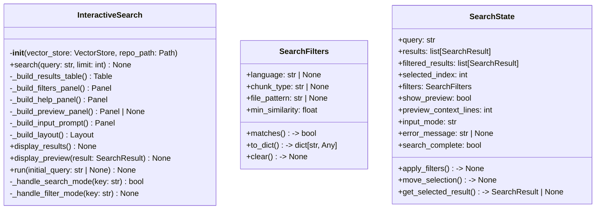

# File Overview

This file implements an interactive search interface for a local deep wiki system, allowing users to search code repositories with filtering capabilities. It leverages a vector store for search operations and provides a rich terminal-based UI using the `rich` library.

## Classes

### SearchFilters
Filters to apply to search results.

**Key Methods:**
- `matches(result: SearchResult) -> bool`: Check if a result matches all active filters.

### SearchState
Current state of the interactive search session.

**Key Methods:**
- `apply_filters() -> None`: Apply current filters to results.

### InteractiveSearch
Main class implementing the interactive search functionality.

**Key Methods:**
- `__init__(vector_store: VectorStore, repo_path: Path)`: Initialize the interactive search.
- `search(query: str, limit: int = 20) -> None`: Execute a search query.
- `_build_results_table() -> Table`: Build the results table display.
- `_build_filters_panel() -> Panel`: Build the filters display panel.
- `_build_help_panel() -> Panel`: Build the keyboard help panel.
- `_build_preview_panel() -> Panel | None`: Build the code preview panel for the selected result.
- `_build_input_prompt() -> Panel`: Build the input prompt panel.
- `_build_layout() -> Layout`: Build the complete display layout.
- `display_results() -> None`: Display the current search results (non-interactive mode).
- `display_preview(result: SearchResult) -> None`: Display a detailed preview of a search result.
- `run() -> None`: Run the interactive search loop.
- `_handle_search_mode() -> None`: Handle search mode input.
- `_handle_filter_mode() -> None`: Handle filter mode input.

## Functions

### run_search
Used by test_interactive_search.

### main
Main entry point for the CLI.

## Integration

This file integrates with:
- [`local_deepwiki.config.get_config`](../config.md)
- [`local_deepwiki.core.vectorstore.VectorStore`](../core/vectorstore.md)
- [`local_deepwiki.logging.get_logger`](../logging.md)
- [`local_deepwiki.models.ChunkType`](../models.md), [`Language`](../models.md), `SearchRes`

It is called from `run_search` function used in testing. The file is related to:
- `src/local_deepwiki/core/__init__.py`
- `src/local_deepwiki/generators/source_refs.py`
- `src/local_deepwiki/plugins/base.py`
- `tests/__init__.py`
- `tests/test_plugins.py`

## Usage Examples

```python
# Initialize InteractiveSearch
search = InteractiveSearch(vector_store, repo_path)

# Run interactive search
search.run()

# Perform a search
await search.search("function name", limit=10)

# Display results
search.display_results()

# Display preview
search.display_preview(result)
```

## API Reference

### class `SearchFilters`

Filters to apply to search results.

**Methods:**


<details>
<summary>View Source (lines 52-110) | <a href="https://github.com/UrbanDiver/local-deepwiki-mcp/blob/main/src/local_deepwiki/cli/interactive_search.py#L52-L110">GitHub</a></summary>

```python
class SearchFilters:
    """Filters to apply to search results."""

    language: str | None = None
    chunk_type: str | None = None  # function, class, method, etc.
    file_pattern: str | None = None
    min_similarity: float = 0.0

    def matches(self, result: SearchResult) -> bool:
        """Check if a result matches all active filters.

        Args:
            result: The search result to check.

        Returns:
            True if the result passes all filters.
        """
        # Check language filter
        if self.language and result.chunk.language.value != self.language:
            return False

        # Check chunk type filter
        if self.chunk_type and result.chunk.chunk_type.value != self.chunk_type:
            return False

        # Check file pattern filter
        if self.file_pattern:
            if not fnmatch.fnmatch(result.chunk.file_path, self.file_pattern):
                return False

        # Check minimum similarity
        if result.score < self.min_similarity:
            return False

        return True

    def to_dict(self) -> dict[str, Any]:
        """Convert filters to a dictionary for display.

        Returns:
            Dictionary of active filters.
        """
        active = {}
        if self.language:
            active["language"] = self.language
        if self.chunk_type:
            active["type"] = self.chunk_type
        if self.file_pattern:
            active["path"] = self.file_pattern
        if self.min_similarity > 0:
            active["min_score"] = f"{self.min_similarity:.2f}"
        return active

    def clear(self) -> None:
        """Clear all filters."""
        self.language = None
        self.chunk_type = None
        self.file_pattern = None
        self.min_similarity = 0.0
```

</details>

#### `matches`

```python
def matches(result: SearchResult) -> bool
```

Check if a result matches all active filters.


| [Parameter](../generators/api_docs.md) | Type | Default | Description |
|-----------|------|---------|-------------|
| `result` | [`SearchResult`](../models.md) | - | The search result to check. |


<details>
<summary>View Source (lines 52-110) | <a href="https://github.com/UrbanDiver/local-deepwiki-mcp/blob/main/src/local_deepwiki/cli/interactive_search.py#L52-L110">GitHub</a></summary>

```python
class SearchFilters:
    """Filters to apply to search results."""

    language: str | None = None
    chunk_type: str | None = None  # function, class, method, etc.
    file_pattern: str | None = None
    min_similarity: float = 0.0

    def matches(self, result: SearchResult) -> bool:
        """Check if a result matches all active filters.

        Args:
            result: The search result to check.

        Returns:
            True if the result passes all filters.
        """
        # Check language filter
        if self.language and result.chunk.language.value != self.language:
            return False

        # Check chunk type filter
        if self.chunk_type and result.chunk.chunk_type.value != self.chunk_type:
            return False

        # Check file pattern filter
        if self.file_pattern:
            if not fnmatch.fnmatch(result.chunk.file_path, self.file_pattern):
                return False

        # Check minimum similarity
        if result.score < self.min_similarity:
            return False

        return True

    def to_dict(self) -> dict[str, Any]:
        """Convert filters to a dictionary for display.

        Returns:
            Dictionary of active filters.
        """
        active = {}
        if self.language:
            active["language"] = self.language
        if self.chunk_type:
            active["type"] = self.chunk_type
        if self.file_pattern:
            active["path"] = self.file_pattern
        if self.min_similarity > 0:
            active["min_score"] = f"{self.min_similarity:.2f}"
        return active

    def clear(self) -> None:
        """Clear all filters."""
        self.language = None
        self.chunk_type = None
        self.file_pattern = None
        self.min_similarity = 0.0
```

</details>

#### `to_dict`

```python
def to_dict() -> dict[str, Any]
```

Convert filters to a dictionary for display.


<details>
<summary>View Source (lines 52-110) | <a href="https://github.com/UrbanDiver/local-deepwiki-mcp/blob/main/src/local_deepwiki/cli/interactive_search.py#L52-L110">GitHub</a></summary>

```python
class SearchFilters:
    """Filters to apply to search results."""

    language: str | None = None
    chunk_type: str | None = None  # function, class, method, etc.
    file_pattern: str | None = None
    min_similarity: float = 0.0

    def matches(self, result: SearchResult) -> bool:
        """Check if a result matches all active filters.

        Args:
            result: The search result to check.

        Returns:
            True if the result passes all filters.
        """
        # Check language filter
        if self.language and result.chunk.language.value != self.language:
            return False

        # Check chunk type filter
        if self.chunk_type and result.chunk.chunk_type.value != self.chunk_type:
            return False

        # Check file pattern filter
        if self.file_pattern:
            if not fnmatch.fnmatch(result.chunk.file_path, self.file_pattern):
                return False

        # Check minimum similarity
        if result.score < self.min_similarity:
            return False

        return True

    def to_dict(self) -> dict[str, Any]:
        """Convert filters to a dictionary for display.

        Returns:
            Dictionary of active filters.
        """
        active = {}
        if self.language:
            active["language"] = self.language
        if self.chunk_type:
            active["type"] = self.chunk_type
        if self.file_pattern:
            active["path"] = self.file_pattern
        if self.min_similarity > 0:
            active["min_score"] = f"{self.min_similarity:.2f}"
        return active

    def clear(self) -> None:
        """Clear all filters."""
        self.language = None
        self.chunk_type = None
        self.file_pattern = None
        self.min_similarity = 0.0
```

</details>

#### `clear`

```python
def clear() -> None
```

Clear all filters.


<details>
<summary>View Source (lines 52-110) | <a href="https://github.com/UrbanDiver/local-deepwiki-mcp/blob/main/src/local_deepwiki/cli/interactive_search.py#L52-L110">GitHub</a></summary>

```python
class SearchFilters:
    """Filters to apply to search results."""

    language: str | None = None
    chunk_type: str | None = None  # function, class, method, etc.
    file_pattern: str | None = None
    min_similarity: float = 0.0

    def matches(self, result: SearchResult) -> bool:
        """Check if a result matches all active filters.

        Args:
            result: The search result to check.

        Returns:
            True if the result passes all filters.
        """
        # Check language filter
        if self.language and result.chunk.language.value != self.language:
            return False

        # Check chunk type filter
        if self.chunk_type and result.chunk.chunk_type.value != self.chunk_type:
            return False

        # Check file pattern filter
        if self.file_pattern:
            if not fnmatch.fnmatch(result.chunk.file_path, self.file_pattern):
                return False

        # Check minimum similarity
        if result.score < self.min_similarity:
            return False

        return True

    def to_dict(self) -> dict[str, Any]:
        """Convert filters to a dictionary for display.

        Returns:
            Dictionary of active filters.
        """
        active = {}
        if self.language:
            active["language"] = self.language
        if self.chunk_type:
            active["type"] = self.chunk_type
        if self.file_pattern:
            active["path"] = self.file_pattern
        if self.min_similarity > 0:
            active["min_score"] = f"{self.min_similarity:.2f}"
        return active

    def clear(self) -> None:
        """Clear all filters."""
        self.language = None
        self.chunk_type = None
        self.file_pattern = None
        self.min_similarity = 0.0
```

</details>

### class `SearchState`

Current state of the interactive search session.

**Methods:**


<details>
<summary>View Source (lines 114-155) | <a href="https://github.com/UrbanDiver/local-deepwiki-mcp/blob/main/src/local_deepwiki/cli/interactive_search.py#L114-L155">GitHub</a></summary>

```python
class SearchState:
    """Current state of the interactive search session."""

    query: str = ""
    results: list[SearchResult] = field(default_factory=list)
    filtered_results: list[SearchResult] = field(default_factory=list)
    selected_index: int = 0
    filters: SearchFilters = field(default_factory=SearchFilters)
    show_preview: bool = False
    preview_context_lines: int = 3
    input_mode: str = "search"  # search, filter_language, filter_type, filter_path, filter_score
    error_message: str | None = None
    search_complete: bool = False

    def apply_filters(self) -> None:
        """Apply current filters to results."""
        self.filtered_results = [r for r in self.results if self.filters.matches(r)]
        # Reset selection if it's out of bounds
        if self.selected_index >= len(self.filtered_results):
            self.selected_index = max(0, len(self.filtered_results) - 1)

    def move_selection(self, delta: int) -> None:
        """Move the selection by delta positions.

        Args:
            delta: Number of positions to move (positive = down, negative = up).
        """
        if not self.filtered_results:
            return
        self.selected_index = max(
            0, min(len(self.filtered_results) - 1, self.selected_index + delta)
        )

    def get_selected_result(self) -> SearchResult | None:
        """Get the currently selected search result.

        Returns:
            The selected result, or None if no results.
        """
        if not self.filtered_results or self.selected_index >= len(self.filtered_results):
            return None
        return self.filtered_results[self.selected_index]
```

</details>

#### `apply_filters`

```python
def apply_filters() -> None
```

Apply current filters to results.


<details>
<summary>View Source (lines 114-155) | <a href="https://github.com/UrbanDiver/local-deepwiki-mcp/blob/main/src/local_deepwiki/cli/interactive_search.py#L114-L155">GitHub</a></summary>

```python
class SearchState:
    """Current state of the interactive search session."""

    query: str = ""
    results: list[SearchResult] = field(default_factory=list)
    filtered_results: list[SearchResult] = field(default_factory=list)
    selected_index: int = 0
    filters: SearchFilters = field(default_factory=SearchFilters)
    show_preview: bool = False
    preview_context_lines: int = 3
    input_mode: str = "search"  # search, filter_language, filter_type, filter_path, filter_score
    error_message: str | None = None
    search_complete: bool = False

    def apply_filters(self) -> None:
        """Apply current filters to results."""
        self.filtered_results = [r for r in self.results if self.filters.matches(r)]
        # Reset selection if it's out of bounds
        if self.selected_index >= len(self.filtered_results):
            self.selected_index = max(0, len(self.filtered_results) - 1)

    def move_selection(self, delta: int) -> None:
        """Move the selection by delta positions.

        Args:
            delta: Number of positions to move (positive = down, negative = up).
        """
        if not self.filtered_results:
            return
        self.selected_index = max(
            0, min(len(self.filtered_results) - 1, self.selected_index + delta)
        )

    def get_selected_result(self) -> SearchResult | None:
        """Get the currently selected search result.

        Returns:
            The selected result, or None if no results.
        """
        if not self.filtered_results or self.selected_index >= len(self.filtered_results):
            return None
        return self.filtered_results[self.selected_index]
```

</details>

#### `move_selection`

```python
def move_selection(delta: int) -> None
```

Move the selection by delta positions.


| [Parameter](../generators/api_docs.md) | Type | Default | Description |
|-----------|------|---------|-------------|
| `delta` | `int` | - | Number of positions to move (positive = down, negative = up). |


<details>
<summary>View Source (lines 114-155) | <a href="https://github.com/UrbanDiver/local-deepwiki-mcp/blob/main/src/local_deepwiki/cli/interactive_search.py#L114-L155">GitHub</a></summary>

```python
class SearchState:
    """Current state of the interactive search session."""

    query: str = ""
    results: list[SearchResult] = field(default_factory=list)
    filtered_results: list[SearchResult] = field(default_factory=list)
    selected_index: int = 0
    filters: SearchFilters = field(default_factory=SearchFilters)
    show_preview: bool = False
    preview_context_lines: int = 3
    input_mode: str = "search"  # search, filter_language, filter_type, filter_path, filter_score
    error_message: str | None = None
    search_complete: bool = False

    def apply_filters(self) -> None:
        """Apply current filters to results."""
        self.filtered_results = [r for r in self.results if self.filters.matches(r)]
        # Reset selection if it's out of bounds
        if self.selected_index >= len(self.filtered_results):
            self.selected_index = max(0, len(self.filtered_results) - 1)

    def move_selection(self, delta: int) -> None:
        """Move the selection by delta positions.

        Args:
            delta: Number of positions to move (positive = down, negative = up).
        """
        if not self.filtered_results:
            return
        self.selected_index = max(
            0, min(len(self.filtered_results) - 1, self.selected_index + delta)
        )

    def get_selected_result(self) -> SearchResult | None:
        """Get the currently selected search result.

        Returns:
            The selected result, or None if no results.
        """
        if not self.filtered_results or self.selected_index >= len(self.filtered_results):
            return None
        return self.filtered_results[self.selected_index]
```

</details>

#### `get_selected_result`

```python
def get_selected_result() -> SearchResult | None
```

Get the currently selected search result.


<details>
<summary>View Source (lines 114-155) | <a href="https://github.com/UrbanDiver/local-deepwiki-mcp/blob/main/src/local_deepwiki/cli/interactive_search.py#L114-L155">GitHub</a></summary>

```python
class SearchState:
    """Current state of the interactive search session."""

    query: str = ""
    results: list[SearchResult] = field(default_factory=list)
    filtered_results: list[SearchResult] = field(default_factory=list)
    selected_index: int = 0
    filters: SearchFilters = field(default_factory=SearchFilters)
    show_preview: bool = False
    preview_context_lines: int = 3
    input_mode: str = "search"  # search, filter_language, filter_type, filter_path, filter_score
    error_message: str | None = None
    search_complete: bool = False

    def apply_filters(self) -> None:
        """Apply current filters to results."""
        self.filtered_results = [r for r in self.results if self.filters.matches(r)]
        # Reset selection if it's out of bounds
        if self.selected_index >= len(self.filtered_results):
            self.selected_index = max(0, len(self.filtered_results) - 1)

    def move_selection(self, delta: int) -> None:
        """Move the selection by delta positions.

        Args:
            delta: Number of positions to move (positive = down, negative = up).
        """
        if not self.filtered_results:
            return
        self.selected_index = max(
            0, min(len(self.filtered_results) - 1, self.selected_index + delta)
        )

    def get_selected_result(self) -> SearchResult | None:
        """Get the currently selected search result.

        Returns:
            The selected result, or None if no results.
        """
        if not self.filtered_results or self.selected_index >= len(self.filtered_results):
            return None
        return self.filtered_results[self.selected_index]
```

</details>

### class `InteractiveSearch`

Interactive search interface using rich.

**Methods:**


<details>
<summary>View Source (lines 158-620) | <a href="https://github.com/UrbanDiver/local-deepwiki-mcp/blob/main/src/local_deepwiki/cli/interactive_search.py#L158-L620">GitHub</a></summary>

```python
class InteractiveSearch:
    # Methods: __init__, search, _build_results_table, _build_filters_panel, _build_help_panel, _build_preview_panel, _build_input_prompt, _build_layout, display_results, display_preview, run, _handle_search_mode, _handle_filter_mode
```

</details>

#### `__init__`

```python
def __init__(vector_store: VectorStore, repo_path: Path)
```

Initialize the interactive search.


| [Parameter](../generators/api_docs.md) | Type | Default | Description |
|-----------|------|---------|-------------|
| `vector_store` | [`VectorStore`](../core/vectorstore.md) | - | The vector store to search. |
| `repo_path` | `Path` | - | Path to the repository root for context. |


<details>
<summary>View Source (lines 161-171) | <a href="https://github.com/UrbanDiver/local-deepwiki-mcp/blob/main/src/local_deepwiki/cli/interactive_search.py#L161-L171">GitHub</a></summary>

```python
def __init__(self, vector_store: VectorStore, repo_path: Path):
        """Initialize the interactive search.

        Args:
            vector_store: The vector store to search.
            repo_path: Path to the repository root for context.
        """
        self._store = vector_store
        self._repo_path = repo_path
        self._console = Console()
        self._state = SearchState()
```

</details>

#### `search`

```python
async def search(query: str, limit: int = 20) -> None
```

Execute a search query.


| [Parameter](../generators/api_docs.md) | Type | Default | Description |
|-----------|------|---------|-------------|
| `query` | `str` | - | The search query. |
| `limit` | `int` | `20` | Maximum number of results to retrieve. |


<details>
<summary>View Source (lines 173-203) | <a href="https://github.com/UrbanDiver/local-deepwiki-mcp/blob/main/src/local_deepwiki/cli/interactive_search.py#L173-L203">GitHub</a></summary>

```python
async def search(self, query: str, limit: int = 20) -> None:
        """Execute a search query.

        Args:
            query: The search query.
            limit: Maximum number of results to retrieve.
        """
        self._state.query = query
        self._state.error_message = None
        self._state.search_complete = False

        if not query.strip():
            self._state.results = []
            self._state.filtered_results = []
            return

        try:
            # Search with optional language/type filters from VectorStore
            self._state.results = await self._store.search(
                query=query,
                limit=limit,
                language=self._state.filters.language,
                chunk_type=self._state.filters.chunk_type,
            )
            self._state.apply_filters()
            self._state.search_complete = True
        except Exception as e:
            logger.exception(f"Search error: {e}")
            self._state.error_message = f"Search error: {e}"
            self._state.results = []
            self._state.filtered_results = []
```

</details>

#### `display_results`

```python
def display_results() -> None
```

Display the current search results (non-interactive mode).


<details>
<summary>View Source (lines 448-453) | <a href="https://github.com/UrbanDiver/local-deepwiki-mcp/blob/main/src/local_deepwiki/cli/interactive_search.py#L448-L453">GitHub</a></summary>

```python
def display_results(self) -> None:
        """Display the current search results (non-interactive mode)."""
        self._console.print(self._build_results_table())

        if self._state.filters.to_dict():
            self._console.print(self._build_filters_panel())
```

</details>

#### `display_preview`

```python
def display_preview(result: SearchResult) -> None
```

Display a detailed preview of a search result.


| [Parameter](../generators/api_docs.md) | Type | Default | Description |
|-----------|------|---------|-------------|
| `result` | [`SearchResult`](../models.md) | - | The search result to preview. |


<details>
<summary>View Source (lines 455-468) | <a href="https://github.com/UrbanDiver/local-deepwiki-mcp/blob/main/src/local_deepwiki/cli/interactive_search.py#L455-L468">GitHub</a></summary>

```python
def display_preview(self, result: SearchResult) -> None:
        """Display a detailed preview of a search result.

        Args:
            result: The search result to preview.
        """
        self._state.selected_index = (
            self._state.filtered_results.index(result)
            if result in self._state.filtered_results
            else 0
        )
        preview = self._build_preview_panel()
        if preview:
            self._console.print(preview)
```

</details>

#### `run`

```python
async def run(initial_query: str | None = None) -> None
```

Run the interactive search session.


| [Parameter](../generators/api_docs.md) | Type | Default | Description |
|-----------|------|---------|-------------|
| `initial_query` | `str | None` | `None` | Optional initial search query. |


---


<details>
<summary>View Source (lines 470-512) | <a href="https://github.com/UrbanDiver/local-deepwiki-mcp/blob/main/src/local_deepwiki/cli/interactive_search.py#L470-L512">GitHub</a></summary>

```python
async def run(self, initial_query: str | None = None) -> None:
        """Run the interactive search session.

        Args:
            initial_query: Optional initial search query.
        """
        # Import here to avoid issues when stdin is not a TTY
        try:
            import readchar
        except ImportError:
            self._console.print(
                "[yellow]Interactive mode requires 'readchar' package.[/yellow]"
            )
            self._console.print("Install with: pip install readchar")
            self._console.print("Or use non-interactive mode with --query")
            return

        if initial_query:
            await self.search(initial_query)

        self._console.clear()

        running = True
        while running:
            # Display current state
            self._console.clear()
            self._console.print(self._build_layout())

            # Get user input
            try:
                key = readchar.readkey()
            except KeyboardInterrupt:
                running = False
                continue

            # Handle input based on current mode
            if self._state.input_mode == "search":
                running = await self._handle_search_mode(key)
            else:
                await self._handle_filter_mode(key)

        self._console.clear()
        self._console.print("[dim]Search session ended.[/dim]")
```

</details>

### Functions

#### `run_search`

```python
async def run_search(repo_path: Path, query: str | None = None, language: str | None = None, chunk_type: str | None = None, file_pattern: str | None = None, min_score: float = 0.0, limit: int = 20, interactive: bool = True, show_preview: bool = False) -> None
```

Run the search command.


| [Parameter](../generators/api_docs.md) | Type | Default | Description |
|-----------|------|---------|-------------|
| `repo_path` | `Path` | - | Path to the repository. |
| `query` | `str | None` | `None` | Initial search query. |
| `language` | `str | None` | `None` | Filter by language. |
| `chunk_type` | `str | None` | `None` | Filter by chunk type. |
| `file_pattern` | `str | None` | `None` | Filter by file path pattern. |
| `min_score` | `float` | `0.0` | Minimum similarity score. |
| `limit` | `int` | `20` | Maximum number of results. |
| `interactive` | `bool` | `True` | Whether to run in interactive mode. |
| `show_preview` | `bool` | `False` | Show preview of first result in non-interactive mode. |

**Returns:** `None`


<details>
<summary>View Source (lines 623-696) | <a href="https://github.com/UrbanDiver/local-deepwiki-mcp/blob/main/src/local_deepwiki/cli/interactive_search.py#L623-L696">GitHub</a></summary>

```python
async def run_search(
    repo_path: Path,
    query: str | None = None,
    language: str | None = None,
    chunk_type: str | None = None,
    file_pattern: str | None = None,
    min_score: float = 0.0,
    limit: int = 20,
    interactive: bool = True,
    show_preview: bool = False,
) -> None:
    """Run the search command.

    Args:
        repo_path: Path to the repository.
        query: Initial search query.
        language: Filter by language.
        chunk_type: Filter by chunk type.
        file_pattern: Filter by file path pattern.
        min_score: Minimum similarity score.
        limit: Maximum number of results.
        interactive: Whether to run in interactive mode.
        show_preview: Show preview of first result in non-interactive mode.
    """
    console = Console()

    # Resolve repo path
    repo_path = repo_path.resolve()
    if not repo_path.exists():
        console.print(f"[red]Repository not found: {repo_path}[/red]")
        return

    # Check for vector store
    vector_db_path = repo_path / ".deepwiki" / "vectordb"
    if not vector_db_path.exists():
        console.print(f"[red]Repository not indexed. Run: index_repository {repo_path}[/red]")
        return

    # Initialize vector store
    console.print("[dim]Loading vector store...[/dim]")
    config = get_config()
    embedding_provider = get_embedding_provider()
    vector_store = VectorStore(
        db_path=vector_db_path,
        embedding_provider=embedding_provider,
    )

    # Create search instance
    search = InteractiveSearch(vector_store, repo_path)

    # Set initial filters
    search._state.filters = SearchFilters(
        language=language,
        chunk_type=chunk_type,
        file_pattern=file_pattern,
        min_similarity=min_score,
    )

    if interactive and query:
        # Run with initial query in interactive mode
        await search.run(initial_query=query)
    elif interactive:
        # Run fully interactive
        await search.run()
    elif query:
        # Non-interactive mode
        await search.search(query, limit=limit)
        search.display_results()

        if show_preview and search._state.filtered_results:
            console.print()
            search.display_preview(search._state.filtered_results[0])
    else:
        console.print("[red]Query is required in non-interactive mode. Use --query or -q.[/red]")
```

</details>

#### `main`

```python
def main() -> int
```

Main entry point for the interactive search CLI.

**Returns:** `int`


<details>
<summary>View Source (lines 699-802) | <a href="https://github.com/UrbanDiver/local-deepwiki-mcp/blob/main/src/local_deepwiki/cli/interactive_search.py#L699-L802">GitHub</a></summary>

```python
def main() -> int:
    """Main entry point for the interactive search CLI."""
    parser = argparse.ArgumentParser(
        prog="deepwiki-search",
        description="Interactive code search for local-deepwiki indexed repositories",
    )

    parser.add_argument(
        "repo_path",
        type=Path,
        help="Path to the indexed repository",
    )

    parser.add_argument(
        "-q",
        "--query",
        type=str,
        help="Search query (required for non-interactive mode)",
    )

    parser.add_argument(
        "-l",
        "--language",
        type=str,
        help="Filter by programming language",
    )

    parser.add_argument(
        "-t",
        "--type",
        type=str,
        dest="chunk_type",
        help="Filter by chunk type (function, class, method, etc.)",
    )

    parser.add_argument(
        "-f",
        "--file-pattern",
        type=str,
        help="Filter by file path pattern (e.g., src/**/*.py)",
    )

    parser.add_argument(
        "-s",
        "--min-score",
        type=float,
        default=0.0,
        help="Minimum similarity score (0.0-1.0)",
    )

    parser.add_argument(
        "--limit",
        type=int,
        default=20,
        help="Maximum number of results (default: 20)",
    )

    parser.add_argument(
        "--no-interactive",
        action="store_true",
        help="Disable interactive mode (requires --query)",
    )

    parser.add_argument(
        "-p",
        "--preview",
        action="store_true",
        help="Show preview of first result in non-interactive mode",
    )

    args = parser.parse_args()

    # Validate min_score
    if not 0.0 <= args.min_score <= 1.0:
        print("Error: --min-score must be between 0.0 and 1.0", file=sys.stderr)
        return 1

    # Non-interactive mode requires a query
    if args.no_interactive and not args.query:
        print("Error: --query is required when using --no-interactive", file=sys.stderr)
        return 1

    try:
        asyncio.run(
            run_search(
                repo_path=args.repo_path,
                query=args.query,
                language=args.language,
                chunk_type=args.chunk_type,
                file_pattern=args.file_pattern,
                min_score=args.min_score,
                limit=args.limit,
                interactive=not args.no_interactive,
                show_preview=args.preview,
            )
        )
        return 0
    except KeyboardInterrupt:
        print("\nSearch cancelled.")
        return 130
    except Exception as e:
        print(f"Error: {e}", file=sys.stderr)
        logger.exception("Search failed")
        return 1
```

</details>

## Class Diagram



## Call Graph

```mermaid
flowchart TD
    N0[InteractiveSearch._build_fi...]
    N1[InteractiveSearch._build_he...]
    N2[InteractiveSearch._build_in...]
    N3[InteractiveSearch._build_la...]
    N4[InteractiveSearch._build_pr...]
    N5[InteractiveSearch._build_re...]
    N6[InteractiveSearch._handle_f...]
    N7[InteractiveSearch._handle_s...]
    N8[InteractiveSearch.display_r...]
    N9[InteractiveSearch.run]
    N10[InteractiveSearch.search]
    N11[Panel]
    N12[Text]
    N13[VectorStore]
    N14[_build_filters_panel]
    N15[_build_preview_panel]
    N16[_build_results_table]
    N17[apply_filters]
    N18[exception]
    N19[exists]
    N20[get_config]
    N21[get_embedding_provider]
    N22[get_selected_result]
    N23[input]
    N24[main]
    N25[resolve]
    N26[run]
    N27[run_search]
    N28[search]
    N29[to_dict]
    N27 --> N25
    N27 --> N19
    N27 --> N20
    N27 --> N21
    N27 --> N13
    N27 --> N26
    N27 --> N28
    N24 --> N26
    N24 --> N27
    N24 --> N18
    N10 --> N28
    N10 --> N17
    N10 --> N18
    N5 --> N12
    N0 --> N29
    N0 --> N12
    N0 --> N11
    N1 --> N12
    N1 --> N11
    N4 --> N22
    N4 --> N12
    N4 --> N11
    N2 --> N11
    N2 --> N12
    N3 --> N11
    N3 --> N12
    N3 --> N22
    N3 --> N16
    N3 --> N14
    N3 --> N15
    N8 --> N16
    N8 --> N29
    N8 --> N14
    N9 --> N28
    N7 --> N17
    N7 --> N23
    N7 --> N28
    N6 --> N23
    N6 --> N28
    classDef func fill:#e1f5fe
    class N11,N12,N13,N14,N15,N16,N17,N18,N19,N20,N21,N22,N23,N24,N25,N26,N27,N28,N29 func
    classDef method fill:#fff3e0
    class N0,N1,N2,N3,N4,N5,N6,N7,N8,N9,N10 method
```



## Used By

Functions and methods in this file and their callers:

- **`ArgumentParser`**: called by `main`
- **`Group`**: called by `InteractiveSearch._build_preview_panel`
- **`InteractiveSearch`**: called by `run_search`
- **`Layout`**: called by `InteractiveSearch._build_layout`
- **`Panel`**: called by `InteractiveSearch._build_filters_panel`, `InteractiveSearch._build_help_panel`, `InteractiveSearch._build_input_prompt`, `InteractiveSearch._build_layout`, `InteractiveSearch._build_preview_panel`
- **`SearchFilters`**: called by `run_search`
- **`SearchState`**: called by `InteractiveSearch.__init__`
- **`Style`**: called by `InteractiveSearch._build_results_table`
- **`Syntax`**: called by `InteractiveSearch._build_preview_panel`
- **`Table`**: called by `InteractiveSearch._build_results_table`
- **`Text`**: called by `InteractiveSearch._build_filters_panel`, `InteractiveSearch._build_help_panel`, `InteractiveSearch._build_input_prompt`, `InteractiveSearch._build_layout`, `InteractiveSearch._build_preview_panel`, `InteractiveSearch._build_results_table`
- **[`VectorStore`](../core/vectorstore.md)**: called by `run_search`
- **`_build_filters_panel`**: called by `InteractiveSearch._build_layout`, `InteractiveSearch.display_results`
- **`_build_help_panel`**: called by `InteractiveSearch._build_layout`
- **`_build_input_prompt`**: called by `InteractiveSearch._build_layout`
- **`_build_layout`**: called by `InteractiveSearch.run`
- **`_build_preview_panel`**: called by `InteractiveSearch._build_layout`, `InteractiveSearch.display_preview`
- **`_build_results_table`**: called by `InteractiveSearch._build_layout`, `InteractiveSearch.display_results`
- **`_handle_filter_mode`**: called by `InteractiveSearch.run`
- **`_handle_search_mode`**: called by `InteractiveSearch.run`
- **`add_argument`**: called by `main`
- **`add_column`**: called by `InteractiveSearch._build_results_table`
- **`add_row`**: called by `InteractiveSearch._build_results_table`
- **`apply_filters`**: called by `InteractiveSearch._handle_search_mode`, `InteractiveSearch.search`
- **`display_preview`**: called by `run_search`
- **`display_results`**: called by `run_search`
- **`exception`**: called by `InteractiveSearch.search`, `main`
- **`exists`**: called by `run_search`
- **`fnmatch`**: called by `SearchFilters.matches`
- **[`get_config`](../config.md)**: called by `run_search`
- **`get_embedding_provider`**: called by `run_search`
- **`get_selected_result`**: called by `InteractiveSearch._build_layout`, `InteractiveSearch._build_preview_panel`
- **`input`**: called by `InteractiveSearch._handle_filter_mode`, `InteractiveSearch._handle_search_mode`
- **`matches`**: called by `SearchState.apply_filters`
- **`move_selection`**: called by `InteractiveSearch._handle_search_mode`
- **`parse_args`**: called by `main`
- **`readkey`**: called by `InteractiveSearch.run`
- **`resolve`**: called by `run_search`
- **`run`**: called by `main`, `run_search`
- **`run_search`**: called by `main`
- **`search`**: called by `InteractiveSearch._handle_filter_mode`, `InteractiveSearch._handle_search_mode`, `InteractiveSearch.run`, `InteractiveSearch.search`, `run_search`
- **`split_column`**: called by `InteractiveSearch._build_layout`
- **`split_row`**: called by `InteractiveSearch._build_layout`
- **`to_dict`**: called by `InteractiveSearch._build_filters_panel`, `InteractiveSearch.display_results`

## Usage Examples

*Examples extracted from test files*

### Empty filters should match all results

From `test_interactive_search.py::TestSearchFilters::test_empty_filters_match_all`:

```python
filters = SearchFilters()
for result in sample_results:
    assert filters.matches(result) is True
```

### Language filter should only match specified language

From `test_interactive_search.py::TestSearchFilters::test_language_filter`:

```python
filters = SearchFilters(language="python")

# Python results should match
assert filters.matches(sample_results[0]) is True  # Python function
assert filters.matches(sample_results[1]) is True  # Python class
```

### Initial state should have sensible defaults

From `test_interactive_search.py::TestSearchState::test_initial_state`:

```python
state = SearchState()

assert state.query == ""
assert state.results == []
assert state.filtered_results == []
assert state.selected_index == 0
assert state.show_preview is False
assert state.input_mode == "search"
assert state.error_message is None
```

### Initial state should have sensible defaults

From `test_interactive_search.py::TestSearchState::test_initial_state`:

```python
state = SearchState()

assert state.query == ""
assert state.results == []
assert state.filtered_results == []
assert state.selected_index == 0
assert state.show_preview is False
assert state.input_mode == "search"
assert state.error_message is None
```

### apply_filters should update filtered_results

From `test_interactive_search.py::TestSearchState::test_apply_filters`:

```python
state = SearchState()
state.results = sample_results
state.filters = SearchFilters(language="python")

state.apply_filters()

# Should only have Python results
assert len(state.filtered_results) == 3
for result in state.filtered_results:
    assert result.chunk.language == Language.PYTHON
```


## Last Modified

| Entity | Type | Author | Date | Commit |
|--------|------|--------|------|--------|
| `SearchFilters` | class | Brian Breidenbach | 1 week ago | `dc57a7b` Add low-priority enhancemen... |
| `SearchState` | class | Brian Breidenbach | 1 week ago | `dc57a7b` Add low-priority enhancemen... |
| `InteractiveSearch` | class | Brian Breidenbach | 1 week ago | `dc57a7b` Add low-priority enhancemen... |
| `__init__` | method | Brian Breidenbach | 1 week ago | `dc57a7b` Add low-priority enhancemen... |
| `search` | method | Brian Breidenbach | 1 week ago | `dc57a7b` Add low-priority enhancemen... |
| `_build_results_table` | method | Brian Breidenbach | 1 week ago | `dc57a7b` Add low-priority enhancemen... |
| `_build_filters_panel` | method | Brian Breidenbach | 1 week ago | `dc57a7b` Add low-priority enhancemen... |
| `_build_help_panel` | method | Brian Breidenbach | 1 week ago | `dc57a7b` Add low-priority enhancemen... |
| `_build_preview_panel` | method | Brian Breidenbach | 1 week ago | `dc57a7b` Add low-priority enhancemen... |
| `_build_input_prompt` | method | Brian Breidenbach | 1 week ago | `dc57a7b` Add low-priority enhancemen... |
| `_build_layout` | method | Brian Breidenbach | 1 week ago | `dc57a7b` Add low-priority enhancemen... |
| `display_results` | method | Brian Breidenbach | 1 week ago | `dc57a7b` Add low-priority enhancemen... |
| `display_preview` | method | Brian Breidenbach | 1 week ago | `dc57a7b` Add low-priority enhancemen... |
| `run` | method | Brian Breidenbach | 1 week ago | `dc57a7b` Add low-priority enhancemen... |
| `_handle_search_mode` | method | Brian Breidenbach | 1 week ago | `dc57a7b` Add low-priority enhancemen... |
| `_handle_filter_mode` | method | Brian Breidenbach | 1 week ago | `dc57a7b` Add low-priority enhancemen... |
| `run_search` | function | Brian Breidenbach | 1 week ago | `dc57a7b` Add low-priority enhancemen... |
| `main` | function | Brian Breidenbach | 1 week ago | `dc57a7b` Add low-priority enhancemen... |

## Additional Source Code

Source code for functions and methods not listed in the API Reference above.

#### `_build_results_table`

<details>
<summary>View Source (lines 205-264) | <a href="https://github.com/UrbanDiver/local-deepwiki-mcp/blob/main/src/local_deepwiki/cli/interactive_search.py#L205-L264">GitHub</a></summary>

```python
def _build_results_table(self) -> Table:
        """Build the results table display.

        Returns:
            Rich Table with search results.
        """
        table = Table(
            title=f"Results for: {self._state.query}" if self._state.query else "Enter a search query",
            show_header=True,
            header_style="bold cyan",
            expand=True,
        )

        table.add_column("#", style="dim", width=4)
        table.add_column("Score", width=6)
        table.add_column("Type", width=10)
        table.add_column("Name", width=25)
        table.add_column("File", width=40)
        table.add_column("Lines", width=10)

        for i, result in enumerate(self._state.filtered_results):
            chunk = result.chunk

            # Highlight selected row
            is_selected = i == self._state.selected_index
            row_style = Style(bgcolor="blue") if is_selected else None

            # Format score with color
            score_text = f"{result.score:.3f}"
            if result.score >= 0.8:
                score_style = "green"
            elif result.score >= 0.5:
                score_style = "yellow"
            else:
                score_style = "red"

            # Format name (truncate if too long)
            name = chunk.name or "[unnamed]"
            if len(name) > 23:
                name = name[:20] + "..."

            # Format file path (show relative path)
            file_path = chunk.file_path
            if len(file_path) > 38:
                file_path = "..." + file_path[-35:]

            # Format line numbers
            lines = f"{chunk.start_line}-{chunk.end_line}"

            table.add_row(
                str(i + 1),
                Text(score_text, style=score_style),
                chunk.chunk_type.value,
                name,
                file_path,
                lines,
                style=row_style,
            )

        return table
```

</details>


#### `_build_filters_panel`

<details>
<summary>View Source (lines 266-286) | <a href="https://github.com/UrbanDiver/local-deepwiki-mcp/blob/main/src/local_deepwiki/cli/interactive_search.py#L266-L286">GitHub</a></summary>

```python
def _build_filters_panel(self) -> Panel:
        """Build the filters display panel.

        Returns:
            Rich Panel showing active filters.
        """
        filters = self._state.filters.to_dict()

        if not filters:
            content = Text("No filters active", style="dim")
        else:
            lines = []
            for key, value in filters.items():
                lines.append(f"  {key}: {value}")
            content = Text("\n".join(lines))

        return Panel(
            content,
            title="Active Filters",
            border_style="green" if filters else "dim",
        )
```

</details>


#### `_build_help_panel`

<details>
<summary>View Source (lines 288-313) | <a href="https://github.com/UrbanDiver/local-deepwiki-mcp/blob/main/src/local_deepwiki/cli/interactive_search.py#L288-L313">GitHub</a></summary>

```python
def _build_help_panel(self) -> Panel:
        """Build the keyboard help panel.

        Returns:
            Rich Panel with keyboard shortcuts.
        """
        help_text = Text()
        shortcuts = [
            ("Up/Down", "Navigate"),
            ("Enter", "Show preview"),
            ("l", "Filter language"),
            ("t", "Filter type"),
            ("f", "Filter file"),
            ("s", "Filter score"),
            ("c", "Clear filters"),
            ("/", "New search"),
            ("q", "Quit"),
        ]

        for i, (key, action) in enumerate(shortcuts):
            if i > 0:
                help_text.append("  ")
            help_text.append(key, style="bold cyan")
            help_text.append(f":{action}")

        return Panel(help_text, title="Keyboard Shortcuts", border_style="dim")
```

</details>


#### `_build_preview_panel`

<details>
<summary>View Source (lines 315-360) | <a href="https://github.com/UrbanDiver/local-deepwiki-mcp/blob/main/src/local_deepwiki/cli/interactive_search.py#L315-L360">GitHub</a></summary>

```python
def _build_preview_panel(self) -> Panel | None:
        """Build the code preview panel for the selected result.

        Returns:
            Rich Panel with syntax-highlighted code, or None if no selection.
        """
        result = self._state.get_selected_result()
        if not result:
            return None

        chunk = result.chunk

        # Get syntax highlighting lexer
        lexer = LANGUAGE_LEXERS.get(chunk.language.value, "text")

        # Build the code content with context lines
        code_lines = chunk.content.split("\n")

        # Create syntax highlighted view
        syntax = Syntax(
            chunk.content,
            lexer,
            line_numbers=True,
            start_line=chunk.start_line,
            highlight_lines=set(range(chunk.start_line, chunk.end_line + 1)),
            theme="monokai",
        )

        # Build title with file info
        title = f"{chunk.file_path}:{chunk.start_line}-{chunk.end_line}"
        if chunk.name:
            title = f"{chunk.name} - {title}"

        # Add docstring if present
        if chunk.docstring:
            doc_text = Text(f"Docstring: {chunk.docstring[:200]}...", style="italic dim")
            content = Group(doc_text, syntax)
        else:
            content = syntax

        return Panel(
            content,
            title=title,
            subtitle=f"Score: {result.score:.3f} | Type: {chunk.chunk_type.value} | Lang: {chunk.language.value}",
            border_style="green",
        )
```

</details>


#### `_build_input_prompt`

<details>
<summary>View Source (lines 362-394) | <a href="https://github.com/UrbanDiver/local-deepwiki-mcp/blob/main/src/local_deepwiki/cli/interactive_search.py#L362-L394">GitHub</a></summary>

```python
def _build_input_prompt(self) -> Panel:
        """Build the input prompt panel.

        Returns:
            Rich Panel for current input mode.
        """
        mode = self._state.input_mode

        if mode == "search":
            prompt = f"Search: {self._state.query}"
            style = "cyan"
        elif mode == "filter_language":
            languages = [lang.value for lang in Language]
            prompt = f"Enter language ({', '.join(languages[:5])}...): "
            style = "yellow"
        elif mode == "filter_type":
            types = [ct.value for ct in ChunkType]
            prompt = f"Enter type ({', '.join(types)}): "
            style = "yellow"
        elif mode == "filter_path":
            prompt = "Enter file pattern (e.g., src/**/*.py): "
            style = "yellow"
        elif mode == "filter_score":
            prompt = "Enter minimum score (0.0-1.0): "
            style = "yellow"
        else:
            prompt = "Search: "
            style = "cyan"

        return Panel(
            Text(prompt, style=style),
            border_style=style,
        )
```

</details>


#### `_build_layout`

<details>
<summary>View Source (lines 396-446) | <a href="https://github.com/UrbanDiver/local-deepwiki-mcp/blob/main/src/local_deepwiki/cli/interactive_search.py#L396-L446">GitHub</a></summary>

```python
def _build_layout(self) -> Layout:
        """Build the complete display layout.

        Returns:
            Rich Layout with all components.
        """
        layout = Layout()

        # Error message if present
        if self._state.error_message:
            error_panel = Panel(
                Text(self._state.error_message, style="bold red"),
                title="Error",
                border_style="red",
            )

        # Build main layout
        if self._state.show_preview and self._state.get_selected_result():
            # Show results on left, preview on right
            layout.split_column(
                Layout(name="top", ratio=1),
                Layout(name="input", size=3),
                Layout(name="help", size=3),
            )

            layout["top"].split_row(
                Layout(name="results", ratio=1),
                Layout(name="preview", ratio=1),
            )

            layout["results"].split_column(
                Layout(self._build_results_table(), name="table", ratio=4),
                Layout(self._build_filters_panel(), name="filters", size=6),
            )
            layout["preview"].update(self._build_preview_panel())
        else:
            # Results only view
            layout.split_column(
                Layout(name="main", ratio=1),
                Layout(name="filters", size=6),
                Layout(name="input", size=3),
                Layout(name="help", size=3),
            )

            layout["main"].update(self._build_results_table())
            layout["filters"].update(self._build_filters_panel())

        layout["input"].update(self._build_input_prompt())
        layout["help"].update(self._build_help_panel())

        return layout
```

</details>


#### `_handle_search_mode`

<details>
<summary>View Source (lines 514-554) | <a href="https://github.com/UrbanDiver/local-deepwiki-mcp/blob/main/src/local_deepwiki/cli/interactive_search.py#L514-L554">GitHub</a></summary>

```python
async def _handle_search_mode(self, key: str) -> bool:
        """Handle keyboard input in search mode.

        Args:
            key: The key pressed.

        Returns:
            False if the session should end, True otherwise.
        """
        try:
            import readchar
        except ImportError:
            return False

        if key == "q":
            return False
        elif key == readchar.key.UP:
            self._state.move_selection(-1)
        elif key == readchar.key.DOWN:
            self._state.move_selection(1)
        elif key == readchar.key.ENTER:
            self._state.show_preview = not self._state.show_preview
        elif key == "l":
            self._state.input_mode = "filter_language"
        elif key == "t":
            self._state.input_mode = "filter_type"
        elif key == "f":
            self._state.input_mode = "filter_path"
        elif key == "s":
            self._state.input_mode = "filter_score"
        elif key == "c":
            self._state.filters.clear()
            self._state.apply_filters()
        elif key == "/":
            # New search - prompt for query
            self._console.clear()
            query = self._console.input("[cyan]Search query: [/cyan]")
            if query:
                await self.search(query)

        return True
```

</details>


#### `_handle_filter_mode`

<details>
<summary>View Source (lines 556-620) | <a href="https://github.com/UrbanDiver/local-deepwiki-mcp/blob/main/src/local_deepwiki/cli/interactive_search.py#L556-L620">GitHub</a></summary>

```python
async def _handle_filter_mode(self, key: str) -> None:
        """Handle keyboard input in filter mode.

        Args:
            key: The key pressed.
        """
        try:
            import readchar
        except ImportError:
            return

        if key == readchar.key.ESCAPE:
            self._state.input_mode = "search"
            return

        if key == readchar.key.ENTER:
            # Prompt for filter value based on mode
            mode = self._state.input_mode

            if mode == "filter_language":
                self._console.clear()
                languages = [lang.value for lang in Language]
                self._console.print(f"[dim]Available: {', '.join(languages)}[/dim]")
                value = self._console.input("[yellow]Language: [/yellow]").strip().lower()
                if value:
                    if value in languages:
                        self._state.filters.language = value
                    else:
                        self._state.error_message = f"Invalid language: {value}"

            elif mode == "filter_type":
                self._console.clear()
                types = [ct.value for ct in ChunkType]
                self._console.print(f"[dim]Available: {', '.join(types)}[/dim]")
                value = self._console.input("[yellow]Type: [/yellow]").strip().lower()
                if value:
                    if value in types:
                        self._state.filters.chunk_type = value
                    else:
                        self._state.error_message = f"Invalid type: {value}"

            elif mode == "filter_path":
                self._console.clear()
                value = self._console.input("[yellow]File pattern: [/yellow]").strip()
                if value:
                    self._state.filters.file_pattern = value

            elif mode == "filter_score":
                self._console.clear()
                value = self._console.input("[yellow]Minimum score (0.0-1.0): [/yellow]").strip()
                if value:
                    try:
                        score = float(value)
                        if 0.0 <= score <= 1.0:
                            self._state.filters.min_similarity = score
                        else:
                            self._state.error_message = "Score must be between 0.0 and 1.0"
                    except ValueError:
                        self._state.error_message = f"Invalid score: {value}"

            # Re-apply filters and re-search if needed
            if self._state.query:
                await self.search(self._state.query)

            self._state.input_mode = "search"
```

</details>

## Relevant Source Files

- `src/local_deepwiki/cli/interactive_search.py:52-110`
