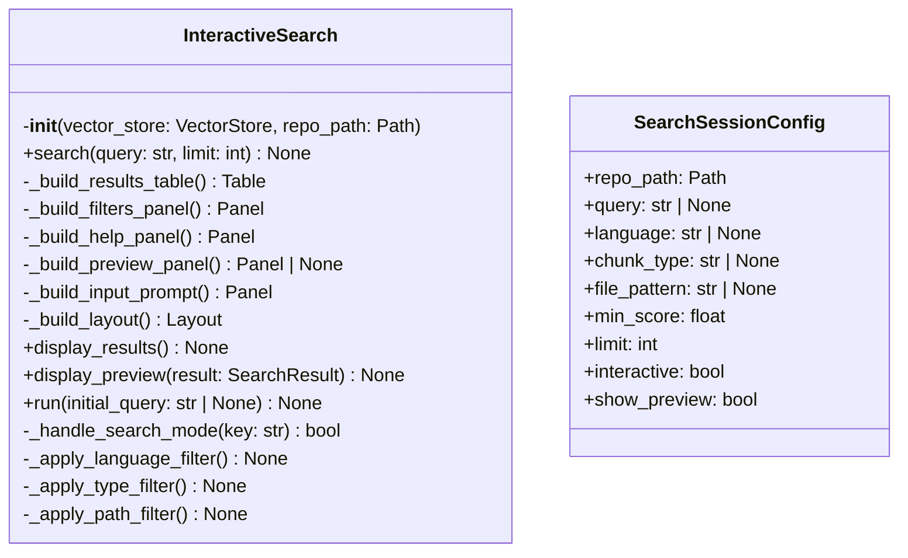

# File: `src/local_deepwiki/cli/interactive_search.py`

## File Overview

This file implements an interactive command-line interface for searching code within a local repository that has been indexed by `local-deepwiki`. It provides a rich, keyboard-driven search experience with filtering capabilities, result previews, and support for both interactive and non-interactive modes.

The primary responsibility of this file is to orchestrate the search process, manage user input, and render the search results and previews using the `rich` library for terminal display. It bridges the vector store search functionality with a user-friendly interface.

The design rationale emphasizes usability and flexibility:
- **Interactive Mode**: Enables real-time navigation, filtering, and previewing of results using keyboard inputs.
- **Non-Interactive Mode**: Supports batch-style search with optional output preview, useful for scripting or automation.
- **Rich Display**: Uses `rich` for structured, colorized output including tables, panels, and syntax highlighting.
- **Modular Components**: Separates concerns between search execution, display logic, and user interaction handling.

## Key Concepts

### Search Session Configuration
The `SearchSessionConfig` class encapsulates all parameters needed for a search session into a single immutable dataclass. This design choice simplifies function signatures and promotes consistency across different execution paths (interactive vs. non-interactive). It also makes testing easier by allowing configuration to be passed as a single object.

### Interactive Search State Management
The `InteractiveSearch` class maintains state using a [`SearchState`](search_models.md) object. This state tracks:
- Current query and results
- Selected result index
- Active filters
- Input mode (search, language filter, etc.)
- Preview visibility

This state-driven approach allows for a responsive UI where the display updates dynamically based on user actions and search results.

### Rich UI Components
The file leverages `rich` to build:
- **Tables**: For displaying structured search results with colored scores and truncated paths.
- **Panels**: For organizing UI elements like filters, help, input prompts, and code previews.
- **Syntax Highlighting**: Using `rich.syntax.Syntax` to enhance code previews with language-specific highlighting.
- **Layouts**: Using `rich.layout.Layout` to structure the terminal display dynamically based on whether preview is shown.

This approach ensures a consistent, readable, and visually appealing terminal interface.

### Keyboard Interaction Handling
The interactive mode uses the `readchar` library to capture key presses in real-time. The implementation handles:
- Navigation (up/down arrows)
- Selection (enter to toggle preview)
- Filtering (l, t, f, s keys)
- Mode switching (escape to return to search)
- Quitting (q key)

This design allows users to explore search results efficiently without requiring mouse input or complex command syntax.

### Filter Application and Validation
Filters are applied dynamically as users input them. Each filter type (language, chunk type, file pattern, score) has its own input handling and validation logic. This ensures that only valid filters are applied, and invalid inputs are reported to the user.

## Integration

This file integrates deeply with the broader `local-deepwiki` CLI ecosystem:

- **Core [Vector Store](../core/vectorstore/store.md)**: It depends on [`VectorStore`](../core/vectorstore/store.md) from `local_deepwiki.core.vectorstore` to perform the actual search operations.
- **Search Models**: Uses [`SearchFilters`](search_models.md), [`SearchState`](search_models.md), and related types from `local_deepwiki.cli.search_models` to manage search configuration and state.
- **[Embedding Provider](../providers/base.md)**: Imports `get_embedding_provider` from `local_deepwiki.providers.embeddings` to initialize the vector store with the correct embedding model.
- **CLI Entry Points**: Called by `main.py` as part of the CLI entry point, and indirectly by test files via `run_search`.

It is part of the command-line interface (`cli`) package and works alongside other CLI modules like `cache_cli.py`, `check_cli.py`, and `config_validator.py`.

## Design Notes

### Asynchronous Execution
The search and interactive modes are implemented using `asyncio`. This allows for:
- Non-blocking I/O during search operations.
- Smooth interaction in the terminal with responsive UI updates.

### Error Handling and User Feedback
The file handles various error conditions gracefully:
- **Search Failures**: Catches `RuntimeError`, `OSError`, `ValueError`, and `KeyError` during search and displays user-friendly messages.
- **Invalid Input**: Validates filter inputs and provides clear feedback.
- **Missing Dependencies**: Detects the absence of `readchar` and advises installation.

### Input Validation
- The `min_score` parameter is strictly validated to be within the 0.0–1.0 range.
- Non-interactive mode requires a query to be specified.
- [Language](../models/foundation.md) and chunk type filters validate against predefined enums.

### Terminal UI Responsiveness
The UI dynamically adjusts based on:
- Whether a preview is being shown.
- Whether filters are active.
- The current input mode (search vs. filter).

This ensures that the terminal output is always informative and appropriately sized for the current context.

### Modular Code Structure
Methods within `InteractiveSearch` are kept focused on specific responsibilities:
- `search()` handles search execution and result filtering.
- Display methods (`_build_results_table`, `_build_preview_panel`, etc.) are responsible for rendering UI components.
- Input handling methods (`_handle_search_mode`, `_handle_filter_mode`) manage user interaction flow.

This modularization improves maintainability and readability.

## API Reference

### class `SearchSessionConfig`

Immutable configuration for a search session.  Bundles the 9 parameters previously passed individually to ``run_search`` into a single frozen dataclass.


<details>
<summary>View Source (lines 34-49) | <a href="https://github.com/UrbanDiver/local-deepwiki-mcp/blob/main/src/local_deepwiki/cli/interactive_search.py#L34-L49">GitHub</a></summary>

```python
class SearchSessionConfig:
    """Immutable configuration for a search session.

    Bundles the 9 parameters previously passed individually to
    ``run_search`` into a single frozen dataclass.
    """

    repo_path: Path
    query: str | None = None
    language: str | None = None
    chunk_type: str | None = None
    file_pattern: str | None = None
    min_score: float = 0.0
    limit: int = 20
    interactive: bool = True
    show_preview: bool = False
```

</details>

### class `InteractiveSearch`

Interactive search interface using rich.

**Methods:**


<details>
<summary>View Source (lines 66-557) | <a href="https://github.com/UrbanDiver/local-deepwiki-mcp/blob/main/src/local_deepwiki/cli/interactive_search.py#L66-L557">GitHub</a></summary>

```python
class InteractiveSearch:
    # Methods: __init__, search, _build_results_table, _build_filters_panel, _build_help_panel, _build_preview_panel, _build_input_prompt, _build_layout, display_results, display_preview, run, _handle_search_mode, _apply_language_filter, _apply_type_filter, _apply_path_filter, _apply_score_filter, _handle_filter_mode
```

</details>

#### `__init__`

```python
def __init__(vector_store: VectorStore, repo_path: Path)
```

Initialize the interactive search.


| Parameter | Type | Default | Description |
|-----------|------|---------|-------------|
| `vector_store` | `VectorStore` | - | The vector store to search. |
| `repo_path` | `Path` | - | Path to the repository root for context. |


<details>
<summary>View Source (lines 69-79) | <a href="https://github.com/UrbanDiver/local-deepwiki-mcp/blob/main/src/local_deepwiki/cli/interactive_search.py#L69-L79">GitHub</a></summary>

```python
def __init__(self, vector_store: VectorStore, repo_path: Path):
        """Initialize the interactive search.

        Args:
            vector_store: The vector store to search.
            repo_path: Path to the repository root for context.
        """
        self._store = vector_store
        self._repo_path = repo_path
        self._console = Console()
        self._state = SearchState()
```

</details>

#### `search`

```python
async def search(query: str, limit: int = 20) -> None
```

Execute a search query.


| Parameter | Type | Default | Description |
|-----------|------|---------|-------------|
| `query` | `str` | - | The search query. |
| `limit` | `int` | `20` | Maximum number of results to retrieve. |


<details>
<summary>View Source (lines 81-115) | <a href="https://github.com/UrbanDiver/local-deepwiki-mcp/blob/main/src/local_deepwiki/cli/interactive_search.py#L81-L115">GitHub</a></summary>

```python
async def search(self, query: str, limit: int = 20) -> None:
        """Execute a search query.

        Args:
            query: The search query.
            limit: Maximum number of results to retrieve.
        """
        self._state.query = query
        self._state.error_message = None
        self._state.search_complete = False

        if not query.strip():
            self._state.results = []
            self._state.filtered_results = []
            return

        try:
            # Search with optional language/type filters from VectorStore
            self._state.results = await self._store.search(
                query=query,
                limit=limit,
                language=self._state.filters.language,
                chunk_type=self._state.filters.chunk_type,
            )
            self._state.apply_filters()
            self._state.search_complete = True
        except (RuntimeError, OSError, ValueError, KeyError) as e:
            # RuntimeError: Vector search/LanceDB failures
            # OSError: Network/file system issues
            # ValueError: Invalid search parameters
            # KeyError: Missing data during search
            logger.exception("Search error: %s", e)
            self._state.error_message = f"Search error: {e}"
            self._state.results = []
            self._state.filtered_results = []
```

</details>

#### `display_results`

```python
def display_results() -> None
```

Display the current search results (non-interactive mode).


<details>
<summary>View Source (lines 365-370) | <a href="https://github.com/UrbanDiver/local-deepwiki-mcp/blob/main/src/local_deepwiki/cli/interactive_search.py#L365-L370">GitHub</a></summary>

```python
def display_results(self) -> None:
        """Display the current search results (non-interactive mode)."""
        self._console.print(self._build_results_table())

        if self._state.filters.to_dict():
            self._console.print(self._build_filters_panel())
```

</details>

#### `display_preview`

```python
def display_preview(result: SearchResult) -> None
```

Display a detailed preview of a search result.


| Parameter | Type | Default | Description |
|-----------|------|---------|-------------|
| `result` | `SearchResult` | - | The search result to preview. |


<details>
<summary>View Source (lines 372-385) | <a href="https://github.com/UrbanDiver/local-deepwiki-mcp/blob/main/src/local_deepwiki/cli/interactive_search.py#L372-L385">GitHub</a></summary>

```python
def display_preview(self, result: SearchResult) -> None:
        """Display a detailed preview of a search result.

        Args:
            result: The search result to preview.
        """
        self._state.selected_index = (
            self._state.filtered_results.index(result)
            if result in self._state.filtered_results
            else 0
        )
        preview = self._build_preview_panel()
        if preview:
            self._console.print(preview)
```

</details>

#### `run`

```python
async def run(initial_query: str | None = None) -> None
```

Run the interactive search session.


| Parameter | Type | Default | Description |
|-----------|------|---------|-------------|
| `initial_query` | `str | None` | `None` | Optional initial search query. |


---


<details>
<summary>View Source (lines 387-429) | <a href="https://github.com/UrbanDiver/local-deepwiki-mcp/blob/main/src/local_deepwiki/cli/interactive_search.py#L387-L429">GitHub</a></summary>

```python
async def run(self, initial_query: str | None = None) -> None:
        """Run the interactive search session.

        Args:
            initial_query: Optional initial search query.
        """
        # Import here to avoid issues when stdin is not a TTY
        try:
            import readchar
        except ImportError:
            self._console.print(
                "[yellow]Interactive mode requires 'readchar' package.[/yellow]"
            )
            self._console.print("Install with: pip install readchar")
            self._console.print("Or use non-interactive mode with --query")
            return

        if initial_query:
            await self.search(initial_query)

        self._console.clear()

        running = True
        while running:
            # Display current state
            self._console.clear()
            self._console.print(self._build_layout())

            # Get user input
            try:
                key = readchar.readkey()
            except KeyboardInterrupt:
                running = False
                continue

            # Handle input based on current mode
            if self._state.input_mode == "search":
                running = await self._handle_search_mode(key)
            else:
                await self._handle_filter_mode(key)

        self._console.clear()
        self._console.print("[dim]Search session ended.[/dim]")
```

</details>

### Functions

#### `run_search`

```python
async def run_search(repo_path_or_config: Path | SearchSessionConfig | None = None, query: str | None = None, language: str | None = None, chunk_type: str | None = None, file_pattern: str | None = None, min_score: float = 0.0, limit: int = 20, interactive: bool = True, show_preview: bool = False, repo_path: Path | None = None) -> None
```

Run the search command.  Accepts either a :class:`SearchSessionConfig` (preferred) or the legacy positional/keyword parameters for backward compatibility.  The ``repo_path`` keyword is accepted for callers that pass it by name (e.g. ``run_search(repo_path=p, query=q)``).


| Parameter | Type | Default | Description |
|-----------|------|---------|-------------|
| `repo_path_or_config` | `Path | SearchSessionConfig | None` | `None` | - |
| `query` | `str | None` | `None` | - |
| `language` | `str | None` | `None` | - |
| `chunk_type` | `str | None` | `None` | - |
| `file_pattern` | `str | None` | `None` | - |
| `min_score` | `float` | `0.0` | - |
| `limit` | `int` | `20` | - |
| `interactive` | `bool` | `True` | - |
| `show_preview` | `bool` | `False` | - |
| `repo_path` | `Path | None` | `None` | - |

**Returns:** `None`


<details>
<summary>View Source (lines 615-654) | <a href="https://github.com/UrbanDiver/local-deepwiki-mcp/blob/main/src/local_deepwiki/cli/interactive_search.py#L615-L654">GitHub</a></summary>

```python
async def run_search(
    repo_path_or_config: Path | SearchSessionConfig | None = None,
    query: str | None = None,
    language: str | None = None,
    chunk_type: str | None = None,
    file_pattern: str | None = None,
    min_score: float = 0.0,
    limit: int = 20,
    interactive: bool = True,
    show_preview: bool = False,
    *,
    repo_path: Path | None = None,
) -> None:
    """Run the search command.

    Accepts either a :class:`SearchSessionConfig` (preferred) or the
    legacy positional/keyword parameters for backward compatibility.

    The ``repo_path`` keyword is accepted for callers that pass it by
    name (e.g. ``run_search(repo_path=p, query=q)``).
    """
    if isinstance(repo_path_or_config, SearchSessionConfig):
        cfg = repo_path_or_config
    else:
        effective_repo = repo_path_or_config or repo_path
        if effective_repo is None:
            raise TypeError("repo_path is required")
        cfg = SearchSessionConfig(
            repo_path=effective_repo,
            query=query,
            language=language,
            chunk_type=chunk_type,
            file_pattern=file_pattern,
            min_score=min_score,
            limit=limit,
            interactive=interactive,
            show_preview=show_preview,
        )

    await _execute_search(cfg)
```

</details>

#### `main`

```python
def main() -> int
```

Main entry point for the interactive search CLI.

**Returns:** `int`


<details>
<summary>View Source (lines 774-777) | <a href="https://github.com/UrbanDiver/local-deepwiki-mcp/blob/main/src/local_deepwiki/cli/interactive_search.py#L774-L777">GitHub</a></summary>

```python
def main() -> int:
    """Main entry point for the interactive search CLI."""
    args = _parse_search_args()
    return _run_search_loop(args)
```

</details>

## Class Diagram



## Call Graph

```mermaid
flowchart TD
    N0[InteractiveSearch._build_fi...]
    N1[InteractiveSearch._build_he...]
    N2[InteractiveSearch._build_in...]
    N3[InteractiveSearch._build_la...]
    N4[InteractiveSearch._build_pr...]
    N5[InteractiveSearch._build_re...]
    N6[InteractiveSearch._handle_f...]
    N7[InteractiveSearch._handle_s...]
    N8[InteractiveSearch.display_r...]
    N9[InteractiveSearch.run]
    N10[InteractiveSearch.search]
    N11[Panel]
    N12[SearchSessionConfig]
    N13[Text]
    N14[_build_filters_panel]
    N15[_build_preview_panel]
    N16[_build_results_table]
    N17[_execute_search]
    N18[_parse_search_args]
    N19[_run_search_loop]
    N20[apply_filters]
    N21[exception]
    N22[get_selected_result]
    N23[input]
    N24[main]
    N25[resolve]
    N26[run]
    N27[run_search]
    N28[search]
    N29[to_dict]
    N17 --> N25
    N17 --> N26
    N17 --> N28
    N27 --> N12
    N27 --> N17
    N19 --> N12
    N19 --> N26
    N19 --> N27
    N19 --> N21
    N24 --> N18
    N24 --> N19
    N10 --> N28
    N10 --> N20
    N10 --> N21
    N5 --> N13
    N0 --> N29
    N0 --> N13
    N0 --> N11
    N1 --> N13
    N1 --> N11
    N4 --> N22
    N4 --> N13
    N4 --> N11
    N2 --> N11
    N2 --> N13
    N3 --> N11
    N3 --> N13
    N3 --> N22
    N3 --> N16
    N3 --> N14
    N3 --> N15
    N8 --> N16
    N8 --> N29
    N8 --> N14
    N9 --> N28
    N7 --> N20
    N7 --> N23
    N7 --> N28
    N6 --> N28
    classDef func fill:#e1f5fe
    class N11,N12,N13,N14,N15,N16,N17,N18,N19,N20,N21,N22,N23,N24,N25,N26,N27,N28,N29 func
    classDef method fill:#fff3e0
    class N0,N1,N2,N3,N4,N5,N6,N7,N8,N9,N10 method
```



## Used By

Functions and methods in this file and their callers:

- **`ArgumentParser`**: called by `_parse_search_args`
- **`Group`**: called by `InteractiveSearch._build_preview_panel`
- **`InteractiveSearch`**: called by `_execute_search`
- **`Layout`**: called by `InteractiveSearch._build_layout`
- **`Panel`**: called by `InteractiveSearch._build_filters_panel`, `InteractiveSearch._build_help_panel`, `InteractiveSearch._build_input_prompt`, `InteractiveSearch._build_layout`, `InteractiveSearch._build_preview_panel`
- **[`SearchFilters`](search_models.md)**: called by `_execute_search`
- **`SearchSessionConfig`**: called by `_run_search_loop`, `run_search`
- **[`SearchState`](search_models.md)**: called by `InteractiveSearch.__init__`
- **`Style`**: called by `InteractiveSearch._build_results_table`
- **`Syntax`**: called by `InteractiveSearch._build_preview_panel`
- **`Table`**: called by `InteractiveSearch._build_results_table`
- **`Text`**: called by `InteractiveSearch._build_filters_panel`, `InteractiveSearch._build_help_panel`, `InteractiveSearch._build_input_prompt`, `InteractiveSearch._build_layout`, `InteractiveSearch._build_preview_panel`, `InteractiveSearch._build_results_table`
- **`TypeError`**: called by `run_search`
- **[`VectorStore`](../core/vectorstore/store.md)**: called by `_execute_search`
- **`_apply_language_filter`**: called by `InteractiveSearch._handle_filter_mode`
- **`_apply_path_filter`**: called by `InteractiveSearch._handle_filter_mode`
- **`_apply_score_filter`**: called by `InteractiveSearch._handle_filter_mode`
- **`_apply_type_filter`**: called by `InteractiveSearch._handle_filter_mode`
- **`_build_filters_panel`**: called by `InteractiveSearch._build_layout`, `InteractiveSearch.display_results`
- **`_build_help_panel`**: called by `InteractiveSearch._build_layout`
- **`_build_input_prompt`**: called by `InteractiveSearch._build_layout`
- **`_build_layout`**: called by `InteractiveSearch.run`
- **`_build_preview_panel`**: called by `InteractiveSearch._build_layout`, `InteractiveSearch.display_preview`
- **`_build_results_table`**: called by `InteractiveSearch._build_layout`, `InteractiveSearch.display_results`
- **`_execute_search`**: called by `run_search`
- **`_handle_filter_mode`**: called by `InteractiveSearch.run`
- **`_handle_search_mode`**: called by `InteractiveSearch.run`
- **`_parse_search_args`**: called by `main`
- **`_run_search_loop`**: called by `main`
- **`add_argument`**: called by `_parse_search_args`
- **`add_column`**: called by `InteractiveSearch._build_results_table`
- **`add_row`**: called by `InteractiveSearch._build_results_table`
- **`apply_filters`**: called by `InteractiveSearch._handle_search_mode`, `InteractiveSearch.search`
- **`display_preview`**: called by `_execute_search`
- **`display_results`**: called by `_execute_search`
- **`exception`**: called by `InteractiveSearch.search`, `_run_search_loop`
- **`exists`**: called by `_execute_search`
- **`get_embedding_provider`**: called by `_execute_search`
- **`get_selected_result`**: called by `InteractiveSearch._build_layout`, `InteractiveSearch._build_preview_panel`
- **`input`**: called by `InteractiveSearch._apply_language_filter`, `InteractiveSearch._apply_path_filter`, `InteractiveSearch._apply_score_filter`, `InteractiveSearch._apply_type_filter`, `InteractiveSearch._handle_search_mode`
- **`move_selection`**: called by `InteractiveSearch._handle_search_mode`
- **`parse_args`**: called by `_parse_search_args`
- **`readkey`**: called by `InteractiveSearch.run`
- **`resolve`**: called by `_execute_search`
- **`run`**: called by `_execute_search`, `_run_search_loop`
- **`run_search`**: called by `_run_search_loop`
- **`search`**: called by `InteractiveSearch._handle_filter_mode`, `InteractiveSearch._handle_search_mode`, `InteractiveSearch.run`, `InteractiveSearch.search`, `_execute_search`
- **`split_column`**: called by `InteractiveSearch._build_layout`
- **`split_row`**: called by `InteractiveSearch._build_layout`
- **`to_dict`**: called by `InteractiveSearch._build_filters_panel`, `InteractiveSearch.display_results`

## Usage Examples

*Examples extracted from test files*

### main should error on invalid min_score

From `test_interactive_search_cli.py::TestMainFunction::test_main_invalid_min_score`:

```python
from local_deepwiki.cli.interactive_search import main

with patch(
    "sys.argv", ["deepwiki-search", str(tmp_path), "--min-score", "1.5"]
):
    with patch("sys.stderr"):
        result = main()
        assert result == 1
```

### main should error on invalid min_score

From `test_interactive_search_cli.py::TestMainFunction::test_main_invalid_min_score`:

```python
from local_deepwiki.cli.interactive_search import main

with patch(
    "sys.argv", ["deepwiki-search", str(tmp_path), "--min-score", "1.5"]
):
    with patch("sys.stderr"):
        result = main()
        assert result == 1
```

### main should error on invalid min_score

From `test_interactive_search_cli.py::TestMainFunction::test_main_invalid_min_score`:

```python
from local_deepwiki.cli.interactive_search import main

with patch(
    "sys.argv", ["deepwiki-search", str(tmp_path), "--min-score", "1.5"]
):
    with patch("sys.stderr"):
        result = main()
        assert result == 1
```

### main should error when non-interactive mode lacks query

From `test_interactive_search_cli.py::TestMainFunction::test_main_non_interactive_requires_query`:

```python
from local_deepwiki.cli.interactive_search import main

with patch("sys.argv", ["deepwiki-search", str(tmp_path), "--no-interactive"]):
    with patch("sys.stderr"):
        result = main()
        assert result == 1
```

### main should error when non-interactive mode lacks query

From `test_interactive_search_cli.py::TestMainFunction::test_main_non_interactive_requires_query`:

```python
from local_deepwiki.cli.interactive_search import main

with patch("sys.argv", ["deepwiki-search", str(tmp_path), "--no-interactive"]):
    with patch("sys.stderr"):
        result = main()
        assert result == 1
```


## Last Modified

| Entity | Type | Author | Date | Commit |
|--------|------|--------|------|--------|
| `SearchSessionConfig` | class | Brian Breidenbach | yesterday | `c585f63` refactor: decompose long_me... |
| `_execute_search` | function | Brian Breidenbach | yesterday | `c585f63` refactor: decompose long_me... |
| `run_search` | function | Brian Breidenbach | yesterday | `c585f63` refactor: decompose long_me... |
| `_run_search_loop` | function | Brian Breidenbach | yesterday | `c585f63` refactor: decompose long_me... |
| `InteractiveSearch` | class | Brian Breidenbach | 1 week ago | `d94846c` refactor: split CLI long me... |
| `_apply_language_filter` | method | Brian Breidenbach | 1 week ago | `d94846c` refactor: split CLI long me... |
| `_apply_type_filter` | method | Brian Breidenbach | 1 week ago | `d94846c` refactor: split CLI long me... |
| `_apply_path_filter` | method | Brian Breidenbach | 1 week ago | `d94846c` refactor: split CLI long me... |
| `_apply_score_filter` | method | Brian Breidenbach | 1 week ago | `d94846c` refactor: split CLI long me... |
| `_handle_filter_mode` | method | Brian Breidenbach | 1 week ago | `d94846c` refactor: split CLI long me... |
| `_parse_search_args` | function | Brian Breidenbach | 1 week ago | `d94846c` refactor: split CLI long me... |
| `main` | function | Brian Breidenbach | 1 week ago | `d94846c` refactor: split CLI long me... |
| `_build_help_panel` | method | Brian Breidenbach | Feb 20, 2026 | `6be69f5` refactor: low-priority Pyth... |
| `search` | method | Brian Breidenbach | Feb 12, 2026 | `df695d3` feat: add MCP Resources, ag... |
| `_build_results_table` | method | Brian Breidenbach | Feb 11, 2026 | `74bebaf` fix: improve exception hand... |
| `_build_preview_panel` | method | Brian Breidenbach | Feb 11, 2026 | `74bebaf` fix: improve exception hand... |
| `__init__` | method | Brian Breidenbach | Jan 26, 2026 | `dc57a7b` Add low-priority enhancemen... |
| `_build_filters_panel` | method | Brian Breidenbach | Jan 26, 2026 | `dc57a7b` Add low-priority enhancemen... |
| `_build_input_prompt` | method | Brian Breidenbach | Jan 26, 2026 | `dc57a7b` Add low-priority enhancemen... |
| `_build_layout` | method | Brian Breidenbach | Jan 26, 2026 | `dc57a7b` Add low-priority enhancemen... |
| `display_results` | method | Brian Breidenbach | Jan 26, 2026 | `dc57a7b` Add low-priority enhancemen... |
| `display_preview` | method | Brian Breidenbach | Jan 26, 2026 | `dc57a7b` Add low-priority enhancemen... |
| `run` | method | Brian Breidenbach | Jan 26, 2026 | `dc57a7b` Add low-priority enhancemen... |
| `_handle_search_mode` | method | Brian Breidenbach | Jan 26, 2026 | `dc57a7b` Add low-priority enhancemen... |

## Additional Source Code

Source code for functions and methods not listed in the API Reference above.

#### `_build_results_table`

<details>
<summary>View Source (lines 117-178) | <a href="https://github.com/UrbanDiver/local-deepwiki-mcp/blob/main/src/local_deepwiki/cli/interactive_search.py#L117-L178">GitHub</a></summary>

```python
def _build_results_table(self) -> Table:
        """Build the results table display.

        Returns:
            Rich Table with search results.
        """
        table = Table(
            title=f"Results for: {self._state.query}"
            if self._state.query
            else "Enter a search query",
            show_header=True,
            header_style="bold cyan",
            expand=True,
        )

        table.add_column("#", style="dim", width=4)
        table.add_column("Score", width=6)
        table.add_column("Type", width=10)
        table.add_column("Name", width=25)
        table.add_column("File", width=40)
        table.add_column("Lines", width=10)

        for i, result in enumerate(self._state.filtered_results):
            chunk = result.chunk

            # Highlight selected row
            is_selected = i == self._state.selected_index
            row_style = Style(bgcolor="blue") if is_selected else None

            # Format score with color
            score_text = f"{result.score:.3f}"
            if result.score >= 0.8:
                score_style = "green"
            elif result.score >= 0.5:
                score_style = "yellow"
            else:
                score_style = "red"

            # Format name (truncate if too long)
            name = chunk.name or "[unnamed]"
            if len(name) > 23:
                name = name[:20] + "..."

            # Format file path (show relative path)
            file_path = chunk.file_path
            if len(file_path) > 38:
                file_path = "..." + file_path[-35:]

            # Format line numbers
            lines = f"{chunk.start_line}-{chunk.end_line}"

            table.add_row(
                str(i + 1),
                Text(score_text, style=score_style),
                chunk.chunk_type.value,
                name,
                file_path,
                lines,
                style=row_style,
            )

        return table
```

</details>


#### `_build_filters_panel`

<details>
<summary>View Source (lines 180-200) | <a href="https://github.com/UrbanDiver/local-deepwiki-mcp/blob/main/src/local_deepwiki/cli/interactive_search.py#L180-L200">GitHub</a></summary>

```python
def _build_filters_panel(self) -> Panel:
        """Build the filters display panel.

        Returns:
            Rich Panel showing active filters.
        """
        filters = self._state.filters.to_dict()

        if not filters:
            content = Text("No filters active", style="dim")
        else:
            lines = []
            for key, value in filters.items():
                lines.append(f"  {key}: {value}")
            content = Text("\n".join(lines))

        return Panel(
            content,
            title="Active Filters",
            border_style="green" if filters else "dim",
        )
```

</details>


#### `_build_help_panel`

<details>
<summary>View Source (lines 203-228) | <a href="https://github.com/UrbanDiver/local-deepwiki-mcp/blob/main/src/local_deepwiki/cli/interactive_search.py#L203-L228">GitHub</a></summary>

```python
def _build_help_panel() -> Panel:
        """Build the keyboard help panel.

        Returns:
            Rich Panel with keyboard shortcuts.
        """
        help_text = Text()
        shortcuts = [
            ("Up/Down", "Navigate"),
            ("Enter", "Show preview"),
            ("l", "Filter language"),
            ("t", "Filter type"),
            ("f", "Filter file"),
            ("s", "Filter score"),
            ("c", "Clear filters"),
            ("/", "New search"),
            ("q", "Quit"),
        ]

        for i, (key, action) in enumerate(shortcuts):
            if i > 0:
                help_text.append("  ")
            help_text.append(key, style="bold cyan")
            help_text.append(f":{action}")

        return Panel(help_text, title="Keyboard Shortcuts", border_style="dim")
```

</details>


#### `_build_preview_panel`

<details>
<summary>View Source (lines 230-277) | <a href="https://github.com/UrbanDiver/local-deepwiki-mcp/blob/main/src/local_deepwiki/cli/interactive_search.py#L230-L277">GitHub</a></summary>

```python
def _build_preview_panel(self) -> Panel | None:
        """Build the code preview panel for the selected result.

        Returns:
            Rich Panel with syntax-highlighted code, or None if no selection.
        """
        result = self._state.get_selected_result()
        if not result:
            return None

        chunk = result.chunk

        # Get syntax highlighting lexer
        lexer = LANGUAGE_LEXERS.get(chunk.language.value, "text")

        # Build the code content with context lines
        code_lines = chunk.content.split("\n")

        # Create syntax highlighted view
        syntax = Syntax(
            chunk.content,
            lexer,
            line_numbers=True,
            start_line=chunk.start_line,
            highlight_lines=set(range(chunk.start_line, chunk.end_line + 1)),
            theme="monokai",
        )

        # Build title with file info
        title = f"{chunk.file_path}:{chunk.start_line}-{chunk.end_line}"
        if chunk.name:
            title = f"{chunk.name} - {title}"

        # Add docstring if present
        if chunk.docstring:
            doc_text = Text(
                f"Docstring: {chunk.docstring[:200]}...", style="italic dim"
            )
            content = Group(doc_text, syntax)
        else:
            content = syntax

        return Panel(
            content,
            title=title,
            subtitle=f"Score: {result.score:.3f} | Type: {chunk.chunk_type.value} | Lang: {chunk.language.value}",
            border_style="green",
        )
```

</details>


#### `_build_input_prompt`

<details>
<summary>View Source (lines 279-311) | <a href="https://github.com/UrbanDiver/local-deepwiki-mcp/blob/main/src/local_deepwiki/cli/interactive_search.py#L279-L311">GitHub</a></summary>

```python
def _build_input_prompt(self) -> Panel:
        """Build the input prompt panel.

        Returns:
            Rich Panel for current input mode.
        """
        mode = self._state.input_mode

        if mode == "search":
            prompt = f"Search: {self._state.query}"
            style = "cyan"
        elif mode == "filter_language":
            languages = [lang.value for lang in Language]
            prompt = f"Enter language ({', '.join(languages[:5])}...): "
            style = "yellow"
        elif mode == "filter_type":
            types = [ct.value for ct in ChunkType]
            prompt = f"Enter type ({', '.join(types)}): "
            style = "yellow"
        elif mode == "filter_path":
            prompt = "Enter file pattern (e.g., src/**/*.py): "
            style = "yellow"
        elif mode == "filter_score":
            prompt = "Enter minimum score (0.0-1.0): "
            style = "yellow"
        else:
            prompt = "Search: "
            style = "cyan"

        return Panel(
            Text(prompt, style=style),
            border_style=style,
        )
```

</details>


#### `_build_layout`

<details>
<summary>View Source (lines 313-363) | <a href="https://github.com/UrbanDiver/local-deepwiki-mcp/blob/main/src/local_deepwiki/cli/interactive_search.py#L313-L363">GitHub</a></summary>

```python
def _build_layout(self) -> Layout:
        """Build the complete display layout.

        Returns:
            Rich Layout with all components.
        """
        layout = Layout()

        # Error message if present
        if self._state.error_message:
            error_panel = Panel(
                Text(self._state.error_message, style="bold red"),
                title="Error",
                border_style="red",
            )

        # Build main layout
        if self._state.show_preview and self._state.get_selected_result():
            # Show results on left, preview on right
            layout.split_column(
                Layout(name="top", ratio=1),
                Layout(name="input", size=3),
                Layout(name="help", size=3),
            )

            layout["top"].split_row(
                Layout(name="results", ratio=1),
                Layout(name="preview", ratio=1),
            )

            layout["results"].split_column(
                Layout(self._build_results_table(), name="table", ratio=4),
                Layout(self._build_filters_panel(), name="filters", size=6),
            )
            layout["preview"].update(self._build_preview_panel())
        else:
            # Results only view
            layout.split_column(
                Layout(name="main", ratio=1),
                Layout(name="filters", size=6),
                Layout(name="input", size=3),
                Layout(name="help", size=3),
            )

            layout["main"].update(self._build_results_table())
            layout["filters"].update(self._build_filters_panel())

        layout["input"].update(self._build_input_prompt())
        layout["help"].update(self._build_help_panel())

        return layout
```

</details>


#### `_handle_search_mode`

<details>
<summary>View Source (lines 431-471) | <a href="https://github.com/UrbanDiver/local-deepwiki-mcp/blob/main/src/local_deepwiki/cli/interactive_search.py#L431-L471">GitHub</a></summary>

```python
async def _handle_search_mode(self, key: str) -> bool:
        """Handle keyboard input in search mode.

        Args:
            key: The key pressed.

        Returns:
            False if the session should end, True otherwise.
        """
        try:
            import readchar
        except ImportError:
            return False

        if key == "q":
            return False
        elif key == readchar.key.UP:
            self._state.move_selection(-1)
        elif key == readchar.key.DOWN:
            self._state.move_selection(1)
        elif key == readchar.key.ENTER:
            self._state.show_preview = not self._state.show_preview
        elif key == "l":
            self._state.input_mode = "filter_language"
        elif key == "t":
            self._state.input_mode = "filter_type"
        elif key == "f":
            self._state.input_mode = "filter_path"
        elif key == "s":
            self._state.input_mode = "filter_score"
        elif key == "c":
            self._state.filters.clear()
            self._state.apply_filters()
        elif key == "/":
            # New search - prompt for query
            self._console.clear()
            query = self._console.input("[cyan]Search query: [/cyan]")
            if query:
                await self.search(query)

        return True
```

</details>


#### `_apply_language_filter`

<details>
<summary>View Source (lines 477-487) | <a href="https://github.com/UrbanDiver/local-deepwiki-mcp/blob/main/src/local_deepwiki/cli/interactive_search.py#L477-L487">GitHub</a></summary>

```python
async def _apply_language_filter(self) -> None:
        """Prompt for and apply a language filter."""
        self._console.clear()
        languages = [lang.value for lang in Language]
        self._console.print(f"[dim]Available: {', '.join(languages)}[/dim]")
        value = self._console.input("[yellow]Language: [/yellow]").strip().lower()
        if value:
            if value in languages:
                self._state.filters.language = value
            else:
                self._state.error_message = f"Invalid language: {value}"
```

</details>


#### `_apply_type_filter`

<details>
<summary>View Source (lines 489-499) | <a href="https://github.com/UrbanDiver/local-deepwiki-mcp/blob/main/src/local_deepwiki/cli/interactive_search.py#L489-L499">GitHub</a></summary>

```python
async def _apply_type_filter(self) -> None:
        """Prompt for and apply a chunk type filter."""
        self._console.clear()
        types = [ct.value for ct in ChunkType]
        self._console.print(f"[dim]Available: {', '.join(types)}[/dim]")
        value = self._console.input("[yellow]Type: [/yellow]").strip().lower()
        if value:
            if value in types:
                self._state.filters.chunk_type = value
            else:
                self._state.error_message = f"Invalid type: {value}"
```

</details>


#### `_apply_path_filter`

<details>
<summary>View Source (lines 501-506) | <a href="https://github.com/UrbanDiver/local-deepwiki-mcp/blob/main/src/local_deepwiki/cli/interactive_search.py#L501-L506">GitHub</a></summary>

```python
async def _apply_path_filter(self) -> None:
        """Prompt for and apply a file-path pattern filter."""
        self._console.clear()
        value = self._console.input("[yellow]File pattern: [/yellow]").strip()
        if value:
            self._state.filters.file_pattern = value
```

</details>


#### `_apply_score_filter`

<details>
<summary>View Source (lines 508-524) | <a href="https://github.com/UrbanDiver/local-deepwiki-mcp/blob/main/src/local_deepwiki/cli/interactive_search.py#L508-L524">GitHub</a></summary>

```python
async def _apply_score_filter(self) -> None:
        """Prompt for and apply a minimum similarity score filter."""
        self._console.clear()
        value = self._console.input(
            "[yellow]Minimum score (0.0-1.0): [/yellow]"
        ).strip()
        if value:
            try:
                score = float(value)
                if 0.0 <= score <= 1.0:
                    self._state.filters.min_similarity = score
                else:
                    self._state.error_message = "Score must be between 0.0 and 1.0"
            except (ValueError, TypeError):
                # ValueError: Invalid numeric string
                # TypeError: Invalid input type
                self._state.error_message = f"Invalid score: {value}"
```

</details>


#### `_handle_filter_mode`

<details>
<summary>View Source (lines 526-557) | <a href="https://github.com/UrbanDiver/local-deepwiki-mcp/blob/main/src/local_deepwiki/cli/interactive_search.py#L526-L557">GitHub</a></summary>

```python
async def _handle_filter_mode(self, key: str) -> None:
        """Handle keyboard input in filter mode.

        Args:
            key: The key pressed.
        """
        try:
            import readchar
        except ImportError:
            return

        if key == readchar.key.ESCAPE:
            self._state.input_mode = "search"
            return

        if key == readchar.key.ENTER:
            mode = self._state.input_mode

            if mode == "filter_language":
                await self._apply_language_filter()
            elif mode == "filter_type":
                await self._apply_type_filter()
            elif mode == "filter_path":
                await self._apply_path_filter()
            elif mode == "filter_score":
                await self._apply_score_filter()

            # Re-apply filters and re-search if needed
            if self._state.query:
                await self.search(self._state.query)

            self._state.input_mode = "search"
```

</details>


#### `_execute_search`

<details>
<summary>View Source (lines 560-612) | <a href="https://github.com/UrbanDiver/local-deepwiki-mcp/blob/main/src/local_deepwiki/cli/interactive_search.py#L560-L612">GitHub</a></summary>

```python
async def _execute_search(cfg: SearchSessionConfig) -> None:
    """Execute a search session from a resolved configuration.

    Validates the repository, initialises the vector store, applies
    filters, and dispatches to interactive or one-shot mode.
    """
    console = Console()

    # Resolve repo path
    resolved_repo = cfg.repo_path.resolve()
    if not resolved_repo.exists():
        console.print(f"[red]Repository not found: {resolved_repo}[/red]")
        return

    # Check for vector store
    vector_db_path = resolved_repo / ".deepwiki" / "vectordb"
    if not vector_db_path.exists():
        console.print(
            f"[red]Repository not indexed. Run: index_repository {resolved_repo}[/red]"
        )
        return

    # Initialize vector store
    console.print("[dim]Loading vector store...[/dim]")
    embedding_provider = get_embedding_provider()
    vector_store = VectorStore(
        db_path=vector_db_path,
        embedding_provider=embedding_provider,
    )

    # Create search instance with initial filters
    search = InteractiveSearch(vector_store, resolved_repo)
    search._state.filters = SearchFilters(
        language=cfg.language,
        chunk_type=cfg.chunk_type,
        file_pattern=cfg.file_pattern,
        min_similarity=cfg.min_score,
    )

    if cfg.interactive and cfg.query:
        await search.run(initial_query=cfg.query)
    elif cfg.interactive:
        await search.run()
    elif cfg.query:
        await search.search(cfg.query, limit=cfg.limit)
        search.display_results()
        if cfg.show_preview and search._state.filtered_results:
            console.print()
            search.display_preview(search._state.filtered_results[0])
    else:
        console.print(
            "[red]Query is required in non-interactive mode. Use --query or -q.[/red]"
        )
```

</details>


#### `_parse_search_args`

<details>
<summary>View Source (lines 662-732) | <a href="https://github.com/UrbanDiver/local-deepwiki-mcp/blob/main/src/local_deepwiki/cli/interactive_search.py#L662-L732">GitHub</a></summary>

```python
def _parse_search_args() -> argparse.Namespace:
    """Build the argument parser and parse sys.argv."""
    parser = argparse.ArgumentParser(
        prog="deepwiki-search",
        description="Interactive code search for local-deepwiki indexed repositories",
    )

    parser.add_argument(
        "repo_path",
        type=Path,
        help="Path to the indexed repository",
    )

    parser.add_argument(
        "-q",
        "--query",
        type=str,
        help="Search query (required for non-interactive mode)",
    )

    parser.add_argument(
        "-l",
        "--language",
        type=str,
        help="Filter by programming language",
    )

    parser.add_argument(
        "-t",
        "--type",
        type=str,
        dest="chunk_type",
        help="Filter by chunk type (function, class, method, etc.)",
    )

    parser.add_argument(
        "-f",
        "--file-pattern",
        type=str,
        help="Filter by file path pattern (e.g., src/**/*.py)",
    )

    parser.add_argument(
        "-s",
        "--min-score",
        type=float,
        default=0.0,
        help="Minimum similarity score (0.0-1.0)",
    )

    parser.add_argument(
        "--limit",
        type=int,
        default=20,
        help="Maximum number of results (default: 20)",
    )

    parser.add_argument(
        "--no-interactive",
        action="store_true",
        help="Disable interactive mode (requires --query)",
    )

    parser.add_argument(
        "-p",
        "--preview",
        action="store_true",
        help="Show preview of first result in non-interactive mode",
    )

    return parser.parse_args()
```

</details>


#### `_run_search_loop`

<details>
<summary>View Source (lines 735-771) | <a href="https://github.com/UrbanDiver/local-deepwiki-mcp/blob/main/src/local_deepwiki/cli/interactive_search.py#L735-L771">GitHub</a></summary>

```python
def _run_search_loop(args: argparse.Namespace) -> int:
    """Validate args and run the search loop; return exit code."""
    # Validate min_score
    if not 0.0 <= args.min_score <= 1.0:
        print("Error: --min-score must be between 0.0 and 1.0", file=sys.stderr)
        return 1

    # Non-interactive mode requires a query
    if args.no_interactive and not args.query:
        print("Error: --query is required when using --no-interactive", file=sys.stderr)
        return 1

    cfg = SearchSessionConfig(
        repo_path=args.repo_path,
        query=args.query,
        language=args.language,
        chunk_type=args.chunk_type,
        file_pattern=args.file_pattern,
        min_score=args.min_score,
        limit=args.limit,
        interactive=not args.no_interactive,
        show_preview=args.preview,
    )

    try:
        asyncio.run(run_search(cfg))
        return 0
    except KeyboardInterrupt:
        print("\nSearch cancelled.")
        return 130
    except (RuntimeError, OSError, ValueError) as e:
        # RuntimeError: Vector store or search failures
        # OSError: File system or database access errors
        # ValueError: Invalid configuration or parameters
        print(f"Error: {e}", file=sys.stderr)
        logger.exception("Search failed")
        return 1
```

</details>

## Relevant Source Files

- `src/local_deepwiki/cli/interactive_search.py:34-49`
