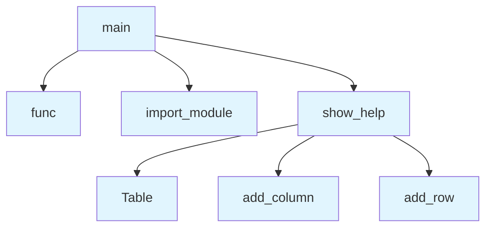

# File: `src/local_deepwiki/cli/main.py`

## File Overview

This file serves as the unified command-line interface (CLI) entry point for the `local-deepwiki` tool. It provides a consistent and extensible way to access all available subcommands through a single `deepwiki` command.

The module is designed to be the central dispatcher for user interactions with the tool, delegating execution to specific subcommand modules based on the user-provided command. It supports help display, argument parsing, and error handling for unknown commands.

## Key Concepts

### Command Dispatch Pattern
This file implements a command dispatch pattern where the `main` function parses the command line, identifies the requested subcommand, and dynamically imports and executes the appropriate module and function. This approach allows for a clean separation of concerns, where each subcommand is handled in its own dedicated module, promoting modularity and maintainability.

### Lazy Loading
The use of `importlib.import_module` and `getattr` enables lazy loading of subcommands. This means that only the requested subcommand is imported into memory, reducing startup time and resource usage, especially as the number of subcommands grows.

### Rich Text Help Output
The `show_help` function leverages the `rich` library to display a formatted table of available commands. This provides a clean, visually appealing interface for users to understand the tool's capabilities, improving usability and discoverability.

## Integration

This file integrates deeply with the rest of the `local-deepwiki` CLI ecosystem. It imports core dependencies like `Console` and `Table` from `rich` for UI rendering and uses `importlib` for dynamic module loading.

The `main` function is the entry point for the CLI and is intended to be invoked directly by the user or test frameworks (as indicated by its usage in `test_cli_main`). It relies on the `SUBCOMMANDS` dictionary (not shown in this file but referenced in `main`) to map command names to their respective modules and functions.

This module is tightly coupled with:
- `src/local_deepwiki/cli/cache_cli.py`
- `src/local_deepwiki/cli/check_cli.py`
- `src/local_deepwiki/config/models_wiki.py`
- `src/local_deepwiki/core/reranker.py`

These are likely the modules that contain the actual implementation of the subcommands that `main` dispatches to, based on the `SUBCOMMANDS` mapping.

## Design Notes

### Error Handling
The `main` function provides clear feedback when an unknown command is entered, using the `rich` console to display an error message and suggest running `--help`. This improves the user experience by guiding them towards valid usage.

### Argument Forwarding
The CLI correctly strips the subcommand from `sys.argv` before delegating to the subcommand module. This ensures that the subcommand modules receive only the arguments relevant to them, avoiding confusion or duplication.

### Return Code Handling
The `main` function handles both integer return codes and `None` (treated as success). This design choice allows subcommand modules to return `0` for success or other integers for specific error conditions, while also supporting functions that do not explicitly return a code.

### Extensibility
The design is highly extensible. Adding a new subcommand requires only updating the `SUBCOMMANDS` mapping with the module path, function name, and description. The dispatcher logic in `main` remains unchanged, demonstrating the principle of open/closed design.

## API Reference

### Functions

#### `show_help`

```python
def show_help() -> None
```

Display available subcommands using rich Table.

**Returns:** `None`


<details>
<summary>View Source (lines 57-90) | <a href="https://github.com/UrbanDiver/local-deepwiki-mcp/blob/main/src/local_deepwiki/cli/main.py#L57-L90">GitHub</a></summary>

```python
def show_help() -> None:
    """Display available subcommands using rich Table."""
    console = Console()
    console.print("\n[bold]deepwiki[/bold] - Local DeepWiki documentation tool\n")

    table = Table(show_header=True, header_style="bold cyan")
    table.add_column("Command", style="green", width=15)
    table.add_column("Description", width=45)

    for name, (_, _, description) in sorted(SUBCOMMANDS.items()):
        table.add_row(name, description)

    console.print(table)
    console.print("\nUsage: [bold]deepwiki <command> [args...][/bold]")
    console.print("\n[bold]Examples:[/bold]")
    console.print(
        "  deepwiki init                    Guided setup wizard for new users"
    )
    console.print("  deepwiki status                  Show index health and freshness")
    console.print("  deepwiki update                  Index repo and regenerate wiki")
    console.print("  deepwiki update --dry-run        Preview what would change")
    console.print(
        "  deepwiki mcp                     Start MCP server (for IDE integration)"
    )
    console.print(
        "  deepwiki serve .deepwiki          Browse wiki at http://localhost:8080"
    )
    console.print("  deepwiki config show              Show current configuration")
    console.print("  deepwiki config health-check      Verify providers are working")
    console.print("  deepwiki cache stats              Show cache hit rates and sizes")
    console.print("  deepwiki export .deepwiki -o html  Export wiki to static HTML")
    console.print("  deepwiki search                   Interactive fuzzy code search")
    console.print("  deepwiki watch /path/to/repo      Auto-reindex on file changes")
    console.print()
```

</details>

#### `main`

```python
def main() -> int
```

Main entry point for the unified deepwiki CLI.

**Returns:** `int`


<details>
<summary>View Source (lines 93-123) | <a href="https://github.com/UrbanDiver/local-deepwiki-mcp/blob/main/src/local_deepwiki/cli/main.py#L93-L123">GitHub</a></summary>

```python
def main() -> int:
    """Main entry point for the unified deepwiki CLI."""
    if len(sys.argv) < 2 or sys.argv[1] in ("-h", "--help"):
        show_help()
        return 0

    command = sys.argv[1]

    if command not in SUBCOMMANDS:
        console = Console(stderr=True)
        console.print(f"[red]Unknown command: {command}[/red]")
        console.print("Run [bold]deepwiki --help[/bold] for available commands.")
        return 1

    module_path, func_name, _ = SUBCOMMANDS[command]

    # Strip the subcommand from sys.argv so the delegated module sees correct args
    sys.argv = [f"deepwiki {command}"] + sys.argv[2:]

    # Lazy import and delegate
    import importlib

    module = importlib.import_module(module_path)
    func = getattr(module, func_name)

    result = func()

    # Handle both int returns and None (treat None as success)
    if isinstance(result, int):
        return result
    return 0
```

</details>

## Call Graph



## Used By

Functions and methods in this file and their callers:

- **`Table`**: called by `show_help`
- **`add_column`**: called by `show_help`
- **`add_row`**: called by `show_help`
- **`func`**: called by `main`
- **`import_module`**: called by `main`
- **`show_help`**: called by `main`

## Last Modified

| Entity | Type | Author | Date | Commit |
|--------|------|--------|------|--------|
| `show_help` | function | Brian Breidenbach | Feb 12, 2026 | `821c352` feat: add `deepwiki status`... |
| `main` | function | Brian Breidenbach | Feb 10, 2026 | `f48b95c` feat: add unified CLI, cach... |

## Relevant Source Files

- `src/local_deepwiki/cli/main.py:57-90`

## See Also

- [cli_progress](../cli_progress.md) - shares 2 dependencies

## See Also

- [init_cli](init_cli.md) - shares 3 dependencies

## See Also

- [init_cli](init_cli.md) - shares 3 dependencies

## See Also

- [init_cli](init_cli.md) - shares 3 dependencies

## See Also

- [init_cli](init_cli.md) - shares 3 dependencies

## See Also

- [init_cli](init_cli.md) - shares 3 dependencies

## See Also

- [init_cli](init_cli.md) - shares 3 dependencies

## See Also

- [init_cli](init_cli.md) - shares 3 dependencies
