# File: `src/local_deepwiki/cli/profile_cli.py`

## File Overview

This file implements the command-line interface (CLI) for managing configuration profiles within the `local_deepwiki` tool. It provides a set of subcommands under `deepwiki config profile` to save, activate, list, and delete named configuration profiles. These profiles allow users to maintain multiple configurations for different environments or use cases.

The module is designed to integrate seamlessly with the existing CLI structure and leverages the `argparse` library for command parsing and `rich` for rich text output formatting.

## Key Concepts

### CLI Subcommand Structure
This file uses the `argparse` module to define a hierarchical CLI structure. The `profile` subcommand is registered under the `config` command group, enabling users to perform profile-related operations through a consistent interface:
```
deepwiki config profile save <name>
deepwiki config profile use <name>
deepwiki config profile list
deepwiki config profile delete <name>
```

### Rich Text Output
The module uses `rich` for formatted console output, enhancing usability and readability of command results. For example, success messages are displayed in green, while errors are shown in red. Tables are used for listing profiles, which improves visual organization.

### Profile Management Abstractions
The functionality relies on functions from `local_deepwiki.config.loader`, which abstracts the underlying profile storage and retrieval logic:
- [`save_profile`](../config/loader.md) — persists the current configuration to a named profile
- [`activate_profile`](../config/loader.md) — switches the active configuration to a named profile
- [`list_profiles`](../config/loader.md) — retrieves all saved profile names
- [`delete_profile`](../config/loader.md) — removes a profile by name
- [`get_active_profile_name`](../config/loader.md) — identifies the currently active profile

These abstractions allow the CLI to remain decoupled from the specifics of where and how profiles are stored, promoting maintainability and testability.

## Integration

This module is part of the `local_deepwiki.cli` package and integrates with the main CLI entry point (`main.py`) via the `register_profile_subparser` function, which is called by the parent parser during CLI setup. It also depends on `local_deepwiki.config.loader` for the actual profile handling logic, ensuring that the CLI layer remains thin and focused on user interaction.

The CLI commands defined here are used in conjunction with other CLI modules such as:
- `cache_cli.py` — for managing cached data
- `check_cli.py` — for configuration validation
- `interactive_search.py` — for interactive querying

This modular design allows the CLI to be extensible and maintainable, with each module handling a specific aspect of the tool's functionality.

## Design Notes

### Error Handling
The CLI functions (`cmd_profile_save`, `cmd_profile_use`, `cmd_profile_delete`) implement targeted error handling:
- `ValueError` and `FileNotFoundError` are caught and displayed in red, providing clear feedback to the user.
- In `cmd_profile_use`, a helpful suggestion is shown if a profile is not found, directing the user to list available profiles.

### User Experience
- The `cmd_profile_list` function highlights the active profile with a special marker (`* active`) to give immediate visual feedback.
- All commands provide clear success or error messages using rich formatting, improving accessibility and usability.
- The `dispatch_profile` function ensures that if no subcommand is provided, a usage hint is shown, guiding the user.

### Minimal Coupling
The CLI layer is intentionally kept minimal and delegates all profile logic to `local_deepwiki.config.loader`. This separation ensures that:
- The CLI remains easy to test and modify.
- The core configuration logic is centralized and reusable.
- Changes to storage or profile logic don't require modifications to the CLI.

This approach aligns with the overall architecture of `local_deepwiki`, which emphasizes modular design and clean separation of concerns.

## API Reference

### Functions

#### `cmd_profile_save`

```python
def cmd_profile_save(args: argparse.Namespace) -> int
```

Save current config as a named profile.


| Parameter | Type | Default | Description |
|-----------|------|---------|-------------|
| `args` | `argparse.Namespace` | - | - |

**Returns:** `int`


<details>
<summary>View Source (lines 26-40) | <a href="https://github.com/UrbanDiver/local-deepwiki-mcp/blob/main/src/local_deepwiki/cli/profile_cli.py#L26-L40">GitHub</a></summary>

```python
def cmd_profile_save(args: argparse.Namespace) -> int:
    """Save current config as a named profile."""
    console = Console()
    name = args.name

    try:
        path = save_profile(name)
        console.print(f"[green]Profile '{name}' saved to {path}[/green]")
        return 0
    except ValueError as e:
        console.print(f"[red]{e}[/red]")
        return 1
    except FileNotFoundError as e:
        console.print(f"[red]{e}[/red]")
        return 1
```

</details>

#### `cmd_profile_use`

```python
def cmd_profile_use(args: argparse.Namespace) -> int
```

Activate a saved profile.


| Parameter | Type | Default | Description |
|-----------|------|---------|-------------|
| `args` | `argparse.Namespace` | - | - |

**Returns:** `int`


<details>
<summary>View Source (lines 43-57) | <a href="https://github.com/UrbanDiver/local-deepwiki-mcp/blob/main/src/local_deepwiki/cli/profile_cli.py#L43-L57">GitHub</a></summary>

```python
def cmd_profile_use(args: argparse.Namespace) -> int:
    """Activate a saved profile."""
    console = Console()
    name = args.name

    try:
        activate_profile(name)
        console.print(f"[green]Switched to profile '{name}'[/green]")
        return 0
    except FileNotFoundError:
        console.print(f"[red]Profile '{name}' not found[/red]")
        console.print(
            "Run [bold]deepwiki config profile list[/bold] to see available profiles."
        )
        return 1
```

</details>

#### `cmd_profile_list`

```python
def cmd_profile_list(args: argparse.Namespace) -> int
```

List all saved profiles.


| Parameter | Type | Default | Description |
|-----------|------|---------|-------------|
| `args` | `argparse.Namespace` | - | - |

**Returns:** `int`


<details>
<summary>View Source (lines 60-80) | <a href="https://github.com/UrbanDiver/local-deepwiki-mcp/blob/main/src/local_deepwiki/cli/profile_cli.py#L60-L80">GitHub</a></summary>

```python
def cmd_profile_list(args: argparse.Namespace) -> int:
    """List all saved profiles."""
    console = Console()
    profiles = list_profiles()
    active = get_active_profile_name()

    if not profiles:
        console.print("[dim]No profiles saved yet.[/dim]")
        console.print("Save one with: [bold]deepwiki config profile save <name>[/bold]")
        return 0

    table = Table(show_header=True, header_style="bold cyan")
    table.add_column("Profile", style="green", width=20)
    table.add_column("Status", width=10)

    for name in profiles:
        status = "[bold yellow]* active[/bold yellow]" if name == active else ""
        table.add_row(name, status)

    console.print(table)
    return 0
```

</details>

#### `cmd_profile_delete`

```python
def cmd_profile_delete(args: argparse.Namespace) -> int
```

Delete a saved profile.


| Parameter | Type | Default | Description |
|-----------|------|---------|-------------|
| `args` | `argparse.Namespace` | - | - |

**Returns:** `int`


<details>
<summary>View Source (lines 83-93) | <a href="https://github.com/UrbanDiver/local-deepwiki-mcp/blob/main/src/local_deepwiki/cli/profile_cli.py#L83-L93">GitHub</a></summary>

```python
def cmd_profile_delete(args: argparse.Namespace) -> int:
    """Delete a saved profile."""
    console = Console()
    name = args.name

    if delete_profile(name):
        console.print(f"[green]Profile '{name}' deleted[/green]")
        return 0
    else:
        console.print(f"[red]Profile '{name}' not found[/red]")
        return 1
```

</details>

#### `register_profile_subparser`

```python
def register_profile_subparser(subparsers: argparse._SubParsersAction) -> None
```

Register the 'profile' subcommand under the config CLI.


| Parameter | Type | Default | Description |
|-----------|------|---------|-------------|
| `subparsers` | `argparse._SubParsersAction` | - | The subparsers action from the parent parser. |

**Returns:** `None`


<details>
<summary>View Source (lines 96-126) | <a href="https://github.com/UrbanDiver/local-deepwiki-mcp/blob/main/src/local_deepwiki/cli/profile_cli.py#L96-L126">GitHub</a></summary>

```python
def register_profile_subparser(subparsers: argparse._SubParsersAction) -> None:
    """Register the 'profile' subcommand under the config CLI.

    Args:
        subparsers: The subparsers action from the parent parser.
    """
    profile_parser = subparsers.add_parser(
        "profile", help="Manage configuration profiles"
    )
    profile_subs = profile_parser.add_subparsers(dest="profile_command")

    # save
    save_parser = profile_subs.add_parser(
        "save", help="Save current config as a profile"
    )
    save_parser.add_argument("name", help="Profile name")
    save_parser.set_defaults(func=cmd_profile_save)

    # use
    use_parser = profile_subs.add_parser("use", help="Activate a saved profile")
    use_parser.add_argument("name", help="Profile name to activate")
    use_parser.set_defaults(func=cmd_profile_use)

    # list
    list_parser = profile_subs.add_parser("list", help="List all saved profiles")
    list_parser.set_defaults(func=cmd_profile_list)

    # delete
    delete_parser = profile_subs.add_parser("delete", help="Delete a saved profile")
    delete_parser.add_argument("name", help="Profile name to delete")
    delete_parser.set_defaults(func=cmd_profile_delete)
```

</details>

#### `dispatch_profile`

```python
def dispatch_profile(args: argparse.Namespace) -> int
```

Dispatch profile subcommand.


| Parameter | Type | Default | Description |
|-----------|------|---------|-------------|
| `args` | `argparse.Namespace` | - | - |

**Returns:** `int`


<details>
<summary>View Source (lines 129-135) | <a href="https://github.com/UrbanDiver/local-deepwiki-mcp/blob/main/src/local_deepwiki/cli/profile_cli.py#L129-L135">GitHub</a></summary>

```python
def dispatch_profile(args: argparse.Namespace) -> int:
    """Dispatch profile subcommand."""
    if not hasattr(args, "profile_command") or args.profile_command is None:
        console = Console()
        console.print("Usage: deepwiki config profile {save|use|list|delete}")
        return 1
    return args.func(args)
```

</details>

## Call Graph

```mermaid
flowchart TD
    N0[Table]
    N1[activate_profile]
    N2[add_argument]
    N3[add_column]
    N4[add_parser]
    N5[add_row]
    N6[add_subparsers]
    N7[cmd_profile_delete]
    N8[cmd_profile_list]
    N9[cmd_profile_save]
    N10[cmd_profile_use]
    N11[delete_profile]
    N12[dispatch_profile]
    N13[func]
    N14[get_active_profile_name]
    N15[list_profiles]
    N16[register_profile_subparser]
    N17[save_profile]
    N18[set_defaults]
    N9 --> N17
    N10 --> N1
    N8 --> N15
    N8 --> N14
    N8 --> N0
    N8 --> N3
    N8 --> N5
    N7 --> N11
    N16 --> N4
    N16 --> N6
    N16 --> N2
    N16 --> N18
    N12 --> N13
    classDef func fill:#e1f5fe
    class N0,N1,N2,N3,N4,N5,N6,N7,N8,N9,N10,N11,N12,N13,N14,N15,N16,N17,N18 func
```



## Used By

Functions and methods in this file and their callers:

- **`Table`**: called by `cmd_profile_list`
- **[`activate_profile`](../config/loader.md)**: called by `cmd_profile_use`
- **`add_argument`**: called by `register_profile_subparser`
- **`add_column`**: called by `cmd_profile_list`
- **`add_parser`**: called by `register_profile_subparser`
- **`add_row`**: called by `cmd_profile_list`
- **`add_subparsers`**: called by `register_profile_subparser`
- **[`delete_profile`](../config/loader.md)**: called by `cmd_profile_delete`
- **`func`**: called by `dispatch_profile`
- **[`get_active_profile_name`](../config/loader.md)**: called by `cmd_profile_list`
- **[`list_profiles`](../config/loader.md)**: called by `cmd_profile_list`
- **[`save_profile`](../config/loader.md)**: called by `cmd_profile_save`
- **`set_defaults`**: called by `register_profile_subparser`

## Last Modified

| Entity | Type | Author | Date | Commit |
|--------|------|--------|------|--------|
| `cmd_profile_save` | function | Brian Breidenbach | Feb 10, 2026 | `f48b95c` feat: add unified CLI, cach... |
| `cmd_profile_use` | function | Brian Breidenbach | Feb 10, 2026 | `f48b95c` feat: add unified CLI, cach... |
| `cmd_profile_list` | function | Brian Breidenbach | Feb 10, 2026 | `f48b95c` feat: add unified CLI, cach... |
| `cmd_profile_delete` | function | Brian Breidenbach | Feb 10, 2026 | `f48b95c` feat: add unified CLI, cach... |
| `register_profile_subparser` | function | Brian Breidenbach | Feb 10, 2026 | `f48b95c` feat: add unified CLI, cach... |
| `dispatch_profile` | function | Brian Breidenbach | Feb 10, 2026 | `f48b95c` feat: add unified CLI, cach... |

## Relevant Source Files

- `src/local_deepwiki/cli/profile_cli.py:26-40`
