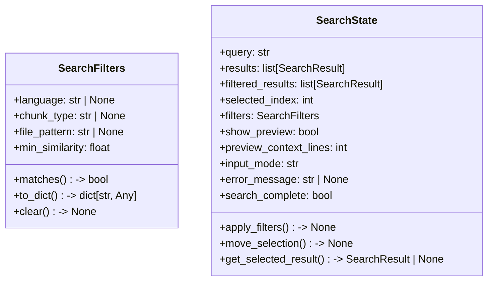
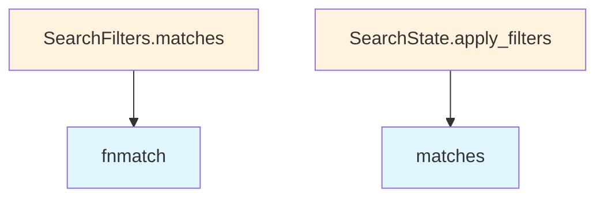

# File: `src/local_deepwiki/cli/search_models.py`

## File Overview

This file defines the core data models used in the interactive search CLI component of the `local_deepwiki` tool. It provides the structure for managing search filters and the state of an interactive search session.

The module is designed to support a terminal-based search interface where users can query codebases and refine results using various filters. The models encapsulate both the input parameters for filtering and the runtime state of the search experience.

## Key Concepts

### Search Filters
The `SearchFilters` class represents a set of criteria used to narrow down search results. It supports filtering by:
- [Language](../models/foundation.md) (e.g., Python, JavaScript)
- Chunk type (e.g., function, class, method)
- File path pattern using shell-style wildcards (`fnmatch`)
- Minimum similarity score

This abstraction allows the CLI to dynamically apply filters without hardcoding logic, making the filtering system flexible and extensible.

### Search State
The `SearchState` class holds the current state of an interactive search session, including:
- The user's query string
- Raw and filtered search results
- Selection index within filtered results
- Active filters
- UI-related flags like preview visibility and input mode

This class enables a stateful, interactive CLI experience by tracking the user's progress through the search process and managing navigation between results.

## Integration

This file is part of the command-line interface (CLI) subsystem of `local_deepwiki`, and integrates closely with:
- [`local_deepwiki.models.SearchResult`](../handlers/types.md): The `SearchFilters.matches` method operates on [`SearchResult`](../handlers/types.md) instances.
- `interactive_search` function: This module is directly used by the interactive search command.
- `test_interactive_search_models`: Unit tests for these models exist and use `SearchFilters` and `SearchState`.

It's likely used in conjunction with other CLI modules such as:
- `main.py`: Entry point for CLI commands
- `config_validator.py`: For validating CLI configurations

The design supports an interactive loop where `SearchState` is updated with new results and filters are applied in real-time.

## Design Notes

### Why Dataclasses?
The use of `dataclass` for `SearchFilters` and `SearchState` provides:
- Automatic generation of `__init__`, `__repr__`, and `__eq__` methods
- Clean, readable structure for configuration and state
- Support for default factory functions (e.g., `field(default_factory=list)`)

### Filter Matching Logic
The `matches` method in `SearchFilters` uses early returns for clarity and performance. It avoids unnecessary checks by short-circuiting when a filter fails.

### Selection Management
In `SearchState`, the `move_selection` method ensures that the selected index never goes out of bounds, and `apply_filters` resets the selection if the filtered list becomes smaller than the previous selection index. This prevents invalid selections during dynamic filtering.

### Input Mode Handling
The `input_mode` field in `SearchState` acts as a finite state machine to control how user input is interpreted (e.g., whether to update the search query or filter parameters). This design supports a single-threaded, state-driven UI interaction model.

### Preview Context Lines
The `preview_context_lines` field allows controlling how many lines of code are shown around a match in the preview, balancing detail with readability.

## API Reference

### class `SearchFilters`

Filters to apply to search results.

**Methods:**


<details>
<summary>View Source (lines 35-93) | <a href="https://github.com/UrbanDiver/local-deepwiki-mcp/blob/main/src/local_deepwiki/cli/search_models.py#L35-L93">GitHub</a></summary>

```python
class SearchFilters:
    """Filters to apply to search results."""

    language: str | None = None
    chunk_type: str | None = None  # function, class, method, etc.
    file_pattern: str | None = None
    min_similarity: float = 0.0

    def matches(self, result: SearchResult) -> bool:
        """Check if a result matches all active filters.

        Args:
            result: The search result to check.

        Returns:
            True if the result passes all filters.
        """
        # Check language filter
        if self.language and result.chunk.language.value != self.language:
            return False

        # Check chunk type filter
        if self.chunk_type and result.chunk.chunk_type.value != self.chunk_type:
            return False

        # Check file pattern filter
        if self.file_pattern:
            if not fnmatch.fnmatch(result.chunk.file_path, self.file_pattern):
                return False

        # Check minimum similarity
        if result.score < self.min_similarity:
            return False

        return True

    def to_dict(self) -> dict[str, Any]:
        """Convert filters to a dictionary for display.

        Returns:
            Dictionary of active filters.
        """
        active = {}
        if self.language:
            active["language"] = self.language
        if self.chunk_type:
            active["type"] = self.chunk_type
        if self.file_pattern:
            active["path"] = self.file_pattern
        if self.min_similarity > 0:
            active["min_score"] = f"{self.min_similarity:.2f}"
        return active

    def clear(self) -> None:
        """Clear all filters."""
        self.language = None
        self.chunk_type = None
        self.file_pattern = None
        self.min_similarity = 0.0
```

</details>

#### `matches`

```python
def matches(result: SearchResult) -> bool
```

Check if a result matches all active filters.


| Parameter | Type | Default | Description |
|-----------|------|---------|-------------|
| `result` | `SearchResult` | - | The search result to check. |


<details>
<summary>View Source (lines 35-93) | <a href="https://github.com/UrbanDiver/local-deepwiki-mcp/blob/main/src/local_deepwiki/cli/search_models.py#L35-L93">GitHub</a></summary>

```python
class SearchFilters:
    """Filters to apply to search results."""

    language: str | None = None
    chunk_type: str | None = None  # function, class, method, etc.
    file_pattern: str | None = None
    min_similarity: float = 0.0

    def matches(self, result: SearchResult) -> bool:
        """Check if a result matches all active filters.

        Args:
            result: The search result to check.

        Returns:
            True if the result passes all filters.
        """
        # Check language filter
        if self.language and result.chunk.language.value != self.language:
            return False

        # Check chunk type filter
        if self.chunk_type and result.chunk.chunk_type.value != self.chunk_type:
            return False

        # Check file pattern filter
        if self.file_pattern:
            if not fnmatch.fnmatch(result.chunk.file_path, self.file_pattern):
                return False

        # Check minimum similarity
        if result.score < self.min_similarity:
            return False

        return True

    def to_dict(self) -> dict[str, Any]:
        """Convert filters to a dictionary for display.

        Returns:
            Dictionary of active filters.
        """
        active = {}
        if self.language:
            active["language"] = self.language
        if self.chunk_type:
            active["type"] = self.chunk_type
        if self.file_pattern:
            active["path"] = self.file_pattern
        if self.min_similarity > 0:
            active["min_score"] = f"{self.min_similarity:.2f}"
        return active

    def clear(self) -> None:
        """Clear all filters."""
        self.language = None
        self.chunk_type = None
        self.file_pattern = None
        self.min_similarity = 0.0
```

</details>

#### `to_dict`

```python
def to_dict() -> dict[str, Any]
```

Convert filters to a dictionary for display.


<details>
<summary>View Source (lines 35-93) | <a href="https://github.com/UrbanDiver/local-deepwiki-mcp/blob/main/src/local_deepwiki/cli/search_models.py#L35-L93">GitHub</a></summary>

```python
class SearchFilters:
    """Filters to apply to search results."""

    language: str | None = None
    chunk_type: str | None = None  # function, class, method, etc.
    file_pattern: str | None = None
    min_similarity: float = 0.0

    def matches(self, result: SearchResult) -> bool:
        """Check if a result matches all active filters.

        Args:
            result: The search result to check.

        Returns:
            True if the result passes all filters.
        """
        # Check language filter
        if self.language and result.chunk.language.value != self.language:
            return False

        # Check chunk type filter
        if self.chunk_type and result.chunk.chunk_type.value != self.chunk_type:
            return False

        # Check file pattern filter
        if self.file_pattern:
            if not fnmatch.fnmatch(result.chunk.file_path, self.file_pattern):
                return False

        # Check minimum similarity
        if result.score < self.min_similarity:
            return False

        return True

    def to_dict(self) -> dict[str, Any]:
        """Convert filters to a dictionary for display.

        Returns:
            Dictionary of active filters.
        """
        active = {}
        if self.language:
            active["language"] = self.language
        if self.chunk_type:
            active["type"] = self.chunk_type
        if self.file_pattern:
            active["path"] = self.file_pattern
        if self.min_similarity > 0:
            active["min_score"] = f"{self.min_similarity:.2f}"
        return active

    def clear(self) -> None:
        """Clear all filters."""
        self.language = None
        self.chunk_type = None
        self.file_pattern = None
        self.min_similarity = 0.0
```

</details>

#### `clear`

```python
def clear() -> None
```

Clear all filters.


<details>
<summary>View Source (lines 35-93) | <a href="https://github.com/UrbanDiver/local-deepwiki-mcp/blob/main/src/local_deepwiki/cli/search_models.py#L35-L93">GitHub</a></summary>

```python
class SearchFilters:
    """Filters to apply to search results."""

    language: str | None = None
    chunk_type: str | None = None  # function, class, method, etc.
    file_pattern: str | None = None
    min_similarity: float = 0.0

    def matches(self, result: SearchResult) -> bool:
        """Check if a result matches all active filters.

        Args:
            result: The search result to check.

        Returns:
            True if the result passes all filters.
        """
        # Check language filter
        if self.language and result.chunk.language.value != self.language:
            return False

        # Check chunk type filter
        if self.chunk_type and result.chunk.chunk_type.value != self.chunk_type:
            return False

        # Check file pattern filter
        if self.file_pattern:
            if not fnmatch.fnmatch(result.chunk.file_path, self.file_pattern):
                return False

        # Check minimum similarity
        if result.score < self.min_similarity:
            return False

        return True

    def to_dict(self) -> dict[str, Any]:
        """Convert filters to a dictionary for display.

        Returns:
            Dictionary of active filters.
        """
        active = {}
        if self.language:
            active["language"] = self.language
        if self.chunk_type:
            active["type"] = self.chunk_type
        if self.file_pattern:
            active["path"] = self.file_pattern
        if self.min_similarity > 0:
            active["min_score"] = f"{self.min_similarity:.2f}"
        return active

    def clear(self) -> None:
        """Clear all filters."""
        self.language = None
        self.chunk_type = None
        self.file_pattern = None
        self.min_similarity = 0.0
```

</details>

### class `SearchState`

Current state of the interactive search session.

**Methods:**


<details>
<summary>View Source (lines 97-142) | <a href="https://github.com/UrbanDiver/local-deepwiki-mcp/blob/main/src/local_deepwiki/cli/search_models.py#L97-L142">GitHub</a></summary>

```python
class SearchState:
    """Current state of the interactive search session."""

    query: str = ""
    results: list[SearchResult] = field(default_factory=list)
    filtered_results: list[SearchResult] = field(default_factory=list)
    selected_index: int = 0
    filters: SearchFilters = field(default_factory=SearchFilters)
    show_preview: bool = False
    preview_context_lines: int = 3
    input_mode: str = (
        "search"  # search, filter_language, filter_type, filter_path, filter_score
    )
    error_message: str | None = None
    search_complete: bool = False

    def apply_filters(self) -> None:
        """Apply current filters to results."""
        self.filtered_results = [r for r in self.results if self.filters.matches(r)]
        # Reset selection if it's out of bounds
        if self.selected_index >= len(self.filtered_results):
            self.selected_index = max(0, len(self.filtered_results) - 1)

    def move_selection(self, delta: int) -> None:
        """Move the selection by delta positions.

        Args:
            delta: Number of positions to move (positive = down, negative = up).
        """
        if not self.filtered_results:
            return
        self.selected_index = max(
            0, min(len(self.filtered_results) - 1, self.selected_index + delta)
        )

    def get_selected_result(self) -> SearchResult | None:
        """Get the currently selected search result.

        Returns:
            The selected result, or None if no results.
        """
        if not self.filtered_results or self.selected_index >= len(
            self.filtered_results
        ):
            return None
        return self.filtered_results[self.selected_index]
```

</details>

#### `apply_filters`

```python
def apply_filters() -> None
```

Apply current filters to results.


<details>
<summary>View Source (lines 97-142) | <a href="https://github.com/UrbanDiver/local-deepwiki-mcp/blob/main/src/local_deepwiki/cli/search_models.py#L97-L142">GitHub</a></summary>

```python
class SearchState:
    """Current state of the interactive search session."""

    query: str = ""
    results: list[SearchResult] = field(default_factory=list)
    filtered_results: list[SearchResult] = field(default_factory=list)
    selected_index: int = 0
    filters: SearchFilters = field(default_factory=SearchFilters)
    show_preview: bool = False
    preview_context_lines: int = 3
    input_mode: str = (
        "search"  # search, filter_language, filter_type, filter_path, filter_score
    )
    error_message: str | None = None
    search_complete: bool = False

    def apply_filters(self) -> None:
        """Apply current filters to results."""
        self.filtered_results = [r for r in self.results if self.filters.matches(r)]
        # Reset selection if it's out of bounds
        if self.selected_index >= len(self.filtered_results):
            self.selected_index = max(0, len(self.filtered_results) - 1)

    def move_selection(self, delta: int) -> None:
        """Move the selection by delta positions.

        Args:
            delta: Number of positions to move (positive = down, negative = up).
        """
        if not self.filtered_results:
            return
        self.selected_index = max(
            0, min(len(self.filtered_results) - 1, self.selected_index + delta)
        )

    def get_selected_result(self) -> SearchResult | None:
        """Get the currently selected search result.

        Returns:
            The selected result, or None if no results.
        """
        if not self.filtered_results or self.selected_index >= len(
            self.filtered_results
        ):
            return None
        return self.filtered_results[self.selected_index]
```

</details>

#### `move_selection`

```python
def move_selection(delta: int) -> None
```

Move the selection by delta positions.


| Parameter | Type | Default | Description |
|-----------|------|---------|-------------|
| `delta` | `int` | - | Number of positions to move (positive = down, negative = up). |


<details>
<summary>View Source (lines 97-142) | <a href="https://github.com/UrbanDiver/local-deepwiki-mcp/blob/main/src/local_deepwiki/cli/search_models.py#L97-L142">GitHub</a></summary>

```python
class SearchState:
    """Current state of the interactive search session."""

    query: str = ""
    results: list[SearchResult] = field(default_factory=list)
    filtered_results: list[SearchResult] = field(default_factory=list)
    selected_index: int = 0
    filters: SearchFilters = field(default_factory=SearchFilters)
    show_preview: bool = False
    preview_context_lines: int = 3
    input_mode: str = (
        "search"  # search, filter_language, filter_type, filter_path, filter_score
    )
    error_message: str | None = None
    search_complete: bool = False

    def apply_filters(self) -> None:
        """Apply current filters to results."""
        self.filtered_results = [r for r in self.results if self.filters.matches(r)]
        # Reset selection if it's out of bounds
        if self.selected_index >= len(self.filtered_results):
            self.selected_index = max(0, len(self.filtered_results) - 1)

    def move_selection(self, delta: int) -> None:
        """Move the selection by delta positions.

        Args:
            delta: Number of positions to move (positive = down, negative = up).
        """
        if not self.filtered_results:
            return
        self.selected_index = max(
            0, min(len(self.filtered_results) - 1, self.selected_index + delta)
        )

    def get_selected_result(self) -> SearchResult | None:
        """Get the currently selected search result.

        Returns:
            The selected result, or None if no results.
        """
        if not self.filtered_results or self.selected_index >= len(
            self.filtered_results
        ):
            return None
        return self.filtered_results[self.selected_index]
```

</details>

#### `get_selected_result`

```python
def get_selected_result() -> SearchResult | None
```

Get the currently selected search result.


<details>
<summary>View Source (lines 97-142) | <a href="https://github.com/UrbanDiver/local-deepwiki-mcp/blob/main/src/local_deepwiki/cli/search_models.py#L97-L142">GitHub</a></summary>

```python
class SearchState:
    """Current state of the interactive search session."""

    query: str = ""
    results: list[SearchResult] = field(default_factory=list)
    filtered_results: list[SearchResult] = field(default_factory=list)
    selected_index: int = 0
    filters: SearchFilters = field(default_factory=SearchFilters)
    show_preview: bool = False
    preview_context_lines: int = 3
    input_mode: str = (
        "search"  # search, filter_language, filter_type, filter_path, filter_score
    )
    error_message: str | None = None
    search_complete: bool = False

    def apply_filters(self) -> None:
        """Apply current filters to results."""
        self.filtered_results = [r for r in self.results if self.filters.matches(r)]
        # Reset selection if it's out of bounds
        if self.selected_index >= len(self.filtered_results):
            self.selected_index = max(0, len(self.filtered_results) - 1)

    def move_selection(self, delta: int) -> None:
        """Move the selection by delta positions.

        Args:
            delta: Number of positions to move (positive = down, negative = up).
        """
        if not self.filtered_results:
            return
        self.selected_index = max(
            0, min(len(self.filtered_results) - 1, self.selected_index + delta)
        )

    def get_selected_result(self) -> SearchResult | None:
        """Get the currently selected search result.

        Returns:
            The selected result, or None if no results.
        """
        if not self.filtered_results or self.selected_index >= len(
            self.filtered_results
        ):
            return None
        return self.filtered_results[self.selected_index]
```

</details>

## Class Diagram



## Call Graph



## Used By

Functions and methods in this file and their callers:

- **`fnmatch`**: called by `SearchFilters.matches`
- **`matches`**: called by `SearchState.apply_filters`

## Last Modified

| Entity | Type | Author | Date | Commit |
|--------|------|--------|------|--------|
| `SearchFilters` | class | Brian Breidenbach | Feb 21, 2026 | `aad50cb` refactor: split 9 files (80... |
| `SearchState` | class | Brian Breidenbach | Feb 21, 2026 | `aad50cb` refactor: split 9 files (80... |

## Relevant Source Files

- `src/local_deepwiki/cli/search_models.py:35-93`
