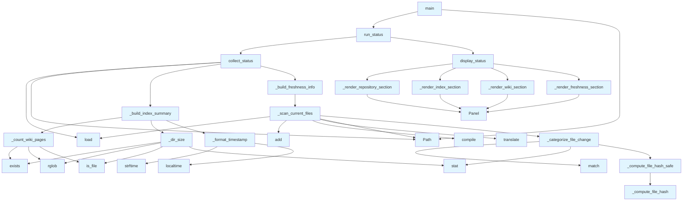

# File: `src/local_deepwiki/cli/status_cli.py`

## File Overview

This file implements the `deepwiki status` command, which provides a comprehensive dashboard of a local-deepwiki project's indexing health, freshness, and wiki coverage. It reads index metadata and compares it with the current repository state to determine if the index is up-to-date and how much of the repository is covered by the wiki.

The file is responsible for collecting, processing, and displaying status information in a user-friendly format using Rich for terminal rendering, or as structured JSON when requested.

## Key Concepts

### Status Collection and Freshness Logic

The core logic of this module revolves around determining whether the current index is "fresh" — meaning it accurately reflects the state of the repository. This is done by:

1. **Scanning the repository** for source files using the same exclusion rules as the indexer (`_scan_current_files`).
2. **Comparing file hashes** between the index and the current repository to detect changes (`get_files_needing_reindex`).
3. **Categorizing changes** into new, modified, or deleted files (`_categorize_file_change`).

This approach ensures that the freshness check is consistent with how the indexer operates, avoiding false positives or negatives due to differing inclusion/exclusion logic.

### Rich Terminal Rendering

The module uses the `rich` library to render status information in a visually appealing way. It organizes data into distinct panels and tables:

- **Repository Panel**: Shows path, last indexed timestamp, and schema version.
- **Index Panel**: Displays total file and chunk counts, and a language breakdown.
- **Wiki Panel**: Indicates number of pages and disk usage.
- **Freshness Panel**: Communicates whether the index is fresh or stale, and optionally lists affected files.

This structured output makes it easy for users to quickly assess the state of their deepwiki project.

### Configuration and Index Management

The module relies on [`IndexStatusManager`](../core/index_manager.md) and [`Config`](../config/models.md) to load index metadata and parsing configuration. This tight integration ensures that status checks respect the same rules and settings used during indexing, maintaining consistency.

## Integration

### Within the CLI Ecosystem

This module is part of the `local_deepwiki.cli` package and is intended to be invoked as a command-line tool. It is called by:

- `main.py` — the main CLI entry point that routes commands.
- It is also used by other CLI modules like `cache_cli.py`, `test_cli_cache.py`, and `test_cli_status.py` for utility functions such as `_dir_size`, `_format_size`, and `_format_timestamp`.

### External Dependencies

- **[`local_deepwiki.config.Config`](../config/models.md)**: Used to load configuration for parsing settings like `exclude_patterns`, `max_file_size`, and `languages`.
- **[`local_deepwiki.core.index_manager.IndexStatusManager`](../core/index_manager.md)**: Used to load and query index metadata.
- **`local_deepwiki.core.parser`**: Provides `_compute_file_hash` and `EXTENSION_MAP` for file hashing and language detection.
- **`rich`**: For rendering structured, styled terminal output.

### Usage Context

This file is typically used when a user runs:
```bash
deepwiki status
```
or
```bash
deepwiki status /path/to/.deepwiki
```

It is also used in automated testing to verify index health and freshness.

## Design Notes

### Consistency with Indexer Logic

The `_scan_current_files` function mirrors the logic of `Indexer._find_source_files` to ensure that the freshness check only considers files that the indexer would actually process. This prevents misleading "stale" status messages caused by files that are ignored due to exclusion patterns.

### Robustness Against File System Errors

Functions like `_compute_file_hash_safe` and `_scan_current_files` gracefully handle `OSError` exceptions when accessing file metadata. This ensures that the status command does not crash due to transient file system issues or permission errors.

### JSON Output for Automation

The `--json` flag allows for machine-readable output, which is useful in automated scripts or CI/CD pipelines where structured data is preferred over terminal rendering.

### Verbose Mode for Debugging

When `--verbose` is used, the freshness section includes per-file change details. This aids in debugging or understanding why an index might be considered stale.

### File Size Formatting

The `_format_size` function provides human-readable file size strings (B, KB, MB, GB) to improve readability in terminal output. It's used in both repository and wiki panels.

### Timestamp Formatting

The `_format_timestamp` function converts Unix timestamps into human-readable date-time strings for better user experience.

## API Reference

### Functions

#### `collect_status`

```python
def collect_status(wiki_path: Path, verbose: bool = False) -> dict
```

Collect all status information and return as a dict.


| Parameter | Type | Default | Description |
|-----------|------|---------|-------------|
| `wiki_path` | `Path` | - | Path to the wiki directory. |
| `verbose` | `bool` | `False` | If True, include per-file change details. |

**Returns:** `dict`


<details>
<summary>View Source (lines 268-303) | <a href="https://github.com/UrbanDiver/local-deepwiki-mcp/blob/main/src/local_deepwiki/cli/status_cli.py#L268-L303">GitHub</a></summary>

```python
def collect_status(
    wiki_path: Path,
    *,
    verbose: bool = False,
) -> dict:
    """Collect all status information and return as a dict.

    Args:
        wiki_path: Path to the wiki directory.
        verbose: If True, include per-file change details.

    Returns:
        Dictionary with all status information.
    """
    from local_deepwiki.core.index_manager import IndexStatusManager

    manager = IndexStatusManager()
    status = manager.load(wiki_path)

    if status is None:
        return {"indexed": False}

    repo_path = Path(status.repo_path)

    result: dict = {"indexed": True}
    result.update(_build_index_summary(status, wiki_path))

    result["freshness"] = _build_freshness_info(
        repo_path, status, manager, verbose=verbose
    )

    page_count = result["wiki"]["page_count"]
    if page_count == 0 and status.total_files > 0:
        result["note"] = "Indexed but wiki not generated"

    return result
```

</details>

#### `display_status`

```python
def display_status(data: dict, console: Console) -> None
```

Render status data as Rich panels and tables.


| Parameter | Type | Default | Description |
|-----------|------|---------|-------------|
| `data` | `dict` | - | - |
| `console` | `Console` | - | - |

**Returns:** `None`


<details>
<summary>View Source (lines 391-406) | <a href="https://github.com/UrbanDiver/local-deepwiki-mcp/blob/main/src/local_deepwiki/cli/status_cli.py#L391-L406">GitHub</a></summary>

```python
def display_status(data: dict, console: Console) -> None:
    """Render status data as Rich panels and tables."""
    if not data.get("indexed"):
        console.print(
            "[yellow]Not indexed yet.[/yellow] Run: [bold]deepwiki update[/bold]"
        )
        return

    _render_repository_section(data, console)
    _render_index_section(data, console)
    _render_wiki_section(data, console)
    _render_freshness_section(data, console)

    # Note
    if "note" in data:
        console.print(f"\n[yellow]{data['note']}[/yellow]")
```

</details>

#### `run_status`

```python
def run_status(wiki_path: Path, as_json: bool = False, verbose: bool = False, console: Console | None = None) -> int
```

Run the status command and return exit code.


| Parameter | Type | Default | Description |
|-----------|------|---------|-------------|
| `wiki_path` | `Path` | - | - |
| `as_json` | `bool` | `False` | - |
| `verbose` | `bool` | `False` | - |
| `console` | `Console | None` | `None` | - |

**Returns:** `int`


<details>
<summary>View Source (lines 409-425) | <a href="https://github.com/UrbanDiver/local-deepwiki-mcp/blob/main/src/local_deepwiki/cli/status_cli.py#L409-L425">GitHub</a></summary>

```python
def run_status(
    wiki_path: Path,
    *,
    as_json: bool = False,
    verbose: bool = False,
    console: Console | None = None,
) -> int:
    """Run the status command and return exit code."""
    console = console or Console()
    data = collect_status(wiki_path, verbose=verbose)

    if as_json:
        print(json.dumps(data, indent=2))
    else:
        display_status(data, console)

    return 0
```

</details>

#### `main`

```python
def main() -> int
```

Main entry point for ``deepwiki status``.

**Returns:** `int`


<details>
<summary>View Source (lines 428-467) | <a href="https://github.com/UrbanDiver/local-deepwiki-mcp/blob/main/src/local_deepwiki/cli/status_cli.py#L428-L467">GitHub</a></summary>

```python
def main() -> int:
    """Main entry point for ``deepwiki status``."""
    parser = argparse.ArgumentParser(
        prog="deepwiki status",
        description="Show index health, wiki coverage, and freshness for a deepwiki project",
        epilog=(
            "examples:\n"
            "  deepwiki status                   Show status for .deepwiki\n"
            "  deepwiki status /path/to/.deepwiki Show status for a specific wiki\n"
            "  deepwiki status --json             Machine-readable JSON output\n"
            "  deepwiki status --verbose          Show per-file change details\n"
        ),
        formatter_class=argparse.RawDescriptionHelpFormatter,
    )
    parser.add_argument(
        "wiki_path",
        nargs="?",
        default=".deepwiki",
        help="Path to the wiki directory (default: .deepwiki)",
    )
    parser.add_argument(
        "--json",
        action="store_true",
        dest="as_json",
        help="Output as JSON for scripting",
    )
    parser.add_argument(
        "--verbose",
        "-v",
        action="store_true",
        help="Show per-file change details",
    )

    args = parser.parse_args()

    return run_status(
        Path(args.wiki_path),
        as_json=args.as_json,
        verbose=args.verbose,
    )
```

</details>

## Call Graph



## Used By

Functions and methods in this file and their callers:

- **`ArgumentParser`**: called by `main`
- **[`IndexStatusManager`](../core/index_manager.md)**: called by `collect_status`
- **`Panel`**: called by `_render_freshness_section`, `_render_index_section`, `_render_repository_section`, `_render_wiki_section`
- **`Path`**: called by `_scan_current_files`, `collect_status`, `main`
- **`Table`**: called by `_render_index_section`
- **`_build_freshness_info`**: called by `collect_status`
- **`_build_index_summary`**: called by `collect_status`
- **`_categorize_file_change`**: called by `_scan_current_files`
- **`_compute_file_hash`**: called by `_compute_file_hash_safe`
- **`_compute_file_hash_safe`**: called by `_categorize_file_change`
- **`_count_wiki_pages`**: called by `_build_index_summary`
- **`_dir_size`**: called by `_build_index_summary`
- **`_format_size`**: called by `_build_index_summary`
- **`_format_timestamp`**: called by `_build_index_summary`
- **`_render_freshness_section`**: called by `display_status`
- **`_render_index_section`**: called by `display_status`
- **`_render_repository_section`**: called by `display_status`
- **`_render_wiki_section`**: called by `display_status`
- **`_scan_current_files`**: called by `_build_freshness_info`
- **`add`**: called by `_scan_current_files`
- **`add_argument`**: called by `main`
- **`add_column`**: called by `_render_index_section`
- **`add_row`**: called by `_render_index_section`
- **`collect_status`**: called by `run_status`
- **`compile`**: called by `_scan_current_files`
- **`display_status`**: called by `run_status`
- **`dumps`**: called by `run_status`
- **`exists`**: called by `_count_wiki_pages`, `_dir_size`
- **`get_files_needing_reindex`**: called by `_build_freshness_info`
- **`is_dir`**: called by `_build_freshness_info`
- **`is_file`**: called by `_count_wiki_pages`, `_dir_size`
- **`load`**: called by `_scan_current_files`, `collect_status`
- **`localtime`**: called by `_format_timestamp`
- **`match`**: called by `_categorize_file_change`
- **`parse_args`**: called by `main`
- **`relative_to`**: called by `_scan_current_files`
- **`rglob`**: called by `_count_wiki_pages`, `_dir_size`
- **`run_status`**: called by `main`
- **`stat`**: called by `_categorize_file_change`, `_dir_size`
- **`strftime`**: called by `_format_timestamp`
- **`translate`**: called by `_scan_current_files`
- **`walk`**: called by `_scan_current_files`

## Last Modified

| Entity | Type | Author | Date | Commit |
|--------|------|--------|------|--------|
| `_compute_file_hash_safe` | function | Brian Breidenbach | 1 week ago | `d94846c` refactor: split CLI long me... |
| `_categorize_file_change` | function | Brian Breidenbach | 1 week ago | `d94846c` refactor: split CLI long me... |
| `_scan_current_files` | function | Brian Breidenbach | 1 week ago | `d94846c` refactor: split CLI long me... |
| `_build_index_summary` | function | Brian Breidenbach | 1 week ago | `d94846c` refactor: split CLI long me... |
| `_build_freshness_info` | function | Brian Breidenbach | 1 week ago | `d94846c` refactor: split CLI long me... |
| `collect_status` | function | Brian Breidenbach | 1 week ago | `d94846c` refactor: split CLI long me... |
| `_render_repository_section` | function | Brian Breidenbach | 1 week ago | `d94846c` refactor: split CLI long me... |
| `_render_index_section` | function | Brian Breidenbach | 1 week ago | `d94846c` refactor: split CLI long me... |
| `_render_wiki_section` | function | Brian Breidenbach | 1 week ago | `d94846c` refactor: split CLI long me... |
| `_render_freshness_section` | function | Brian Breidenbach | 1 week ago | `d94846c` refactor: split CLI long me... |
| `display_status` | function | Brian Breidenbach | 1 week ago | `d94846c` refactor: split CLI long me... |
| `_dir_size` | function | Brian Breidenbach | Feb 12, 2026 | `821c352` feat: add `deepwiki status`... |
| `_format_size` | function | Brian Breidenbach | Feb 12, 2026 | `821c352` feat: add `deepwiki status`... |
| `_format_timestamp` | function | Brian Breidenbach | Feb 12, 2026 | `821c352` feat: add `deepwiki status`... |
| `_count_wiki_pages` | function | Brian Breidenbach | Feb 12, 2026 | `821c352` feat: add `deepwiki status`... |
| `run_status` | function | Brian Breidenbach | Feb 12, 2026 | `821c352` feat: add `deepwiki status`... |
| `main` | function | Brian Breidenbach | Feb 12, 2026 | `821c352` feat: add `deepwiki status`... |

## Additional Source Code

Source code for functions and methods not listed in the API Reference above.

#### `_dir_size`

<details>
<summary>View Source (lines 22-33) | <a href="https://github.com/UrbanDiver/local-deepwiki-mcp/blob/main/src/local_deepwiki/cli/status_cli.py#L22-L33">GitHub</a></summary>

```python
def _dir_size(path: Path) -> int:
    """Calculate total size of a directory in bytes."""
    if not path.exists():
        return 0
    total = 0
    for f in path.rglob("*"):
        if f.is_file():
            try:
                total += f.stat().st_size
            except OSError:
                pass
    return total
```

</details>


#### `_format_size`

<details>
<summary>View Source (lines 36-45) | <a href="https://github.com/UrbanDiver/local-deepwiki-mcp/blob/main/src/local_deepwiki/cli/status_cli.py#L36-L45">GitHub</a></summary>

```python
def _format_size(size_bytes: int) -> str:
    """Format bytes to human-readable string."""
    if size_bytes < 1024:
        return f"{size_bytes} B"
    elif size_bytes < 1024 * 1024:
        return f"{size_bytes / 1024:.1f} KB"
    elif size_bytes < 1024 * 1024 * 1024:
        return f"{size_bytes / (1024 * 1024):.1f} MB"
    else:
        return f"{size_bytes / (1024 * 1024 * 1024):.1f} GB"
```

</details>


#### `_format_timestamp`

<details>
<summary>View Source (lines 48-50) | <a href="https://github.com/UrbanDiver/local-deepwiki-mcp/blob/main/src/local_deepwiki/cli/status_cli.py#L48-L50">GitHub</a></summary>

```python
def _format_timestamp(ts: float) -> str:
    """Format a Unix timestamp to a human-readable string."""
    return time.strftime("%Y-%m-%d %H:%M:%S", time.localtime(ts))
```

</details>


#### `_count_wiki_pages`

<details>
<summary>View Source (lines 53-57) | <a href="https://github.com/UrbanDiver/local-deepwiki-mcp/blob/main/src/local_deepwiki/cli/status_cli.py#L53-L57">GitHub</a></summary>

```python
def _count_wiki_pages(wiki_path: Path) -> int:
    """Count .md files in the wiki directory."""
    if not wiki_path.exists():
        return 0
    return sum(1 for f in wiki_path.rglob("*.md") if f.is_file())
```

</details>


#### `_compute_file_hash_safe`

<details>
<summary>View Source (lines 65-72) | <a href="https://github.com/UrbanDiver/local-deepwiki-mcp/blob/main/src/local_deepwiki/cli/status_cli.py#L65-L72">GitHub</a></summary>

```python
def _compute_file_hash_safe(file_path: Path) -> str | None:
    """Return the SHA-256 hash of *file_path*, or None on OSError."""
    from local_deepwiki.core.parser import _compute_file_hash

    try:
        return _compute_file_hash(file_path)
    except OSError:
        return None
```

</details>


#### `_categorize_file_change`

<details>
<summary>View Source (lines 75-106) | <a href="https://github.com/UrbanDiver/local-deepwiki-mcp/blob/main/src/local_deepwiki/cli/status_cli.py#L75-L106">GitHub</a></summary>

```python
def _categorize_file_change(
    file_path: Path,
    rel_path: str,
    compiled_patterns: list,
    max_size: int,
    ext_to_lang: dict[str, str],
    configured_languages: set[str],
) -> str | None:
    """Return the hash for *file_path* if it should be included, else None.

    Applies the same exclusion rules as the indexer's ``_find_source_files``:
    compiled file-pattern matching, size limit, extension recognition, and
    configured-language membership.
    """
    if any(p.match(rel_path) for p in compiled_patterns):
        return None

    try:
        if file_path.stat().st_size > max_size:
            return None
    except OSError:
        return None

    ext = file_path.suffix.lower()
    lang_name = ext_to_lang.get(ext)
    if lang_name is None:
        return None

    if lang_name not in configured_languages:
        return None

    return _compute_file_hash_safe(file_path)
```

</details>


#### `_scan_current_files`

<details>
<summary>View Source (lines 109-187) | <a href="https://github.com/UrbanDiver/local-deepwiki-mcp/blob/main/src/local_deepwiki/cli/status_cli.py#L109-L187">GitHub</a></summary>

```python
def _scan_current_files(repo_path: Path) -> dict[str, str]:
    """Scan a repository for source files and compute their hashes.

    Uses the same exclusion logic as the indexer's ``_find_source_files``
    so that the freshness check only considers files the indexer would
    actually process.  This means:

    * Hidden directories (starting with ``"."``) are skipped.
    * Directories matching ``exclude_patterns`` ending with ``/**`` are skipped.
    * Individual files matching other ``exclude_patterns`` are skipped.
    * Only files whose extension is in the parser's ``EXTENSION_MAP`` and
      whose language is in the configured ``parsing.languages`` are included.

    Returns:
        Dict mapping relative file paths to their SHA-256 hashes.
    """
    import fnmatch
    import os
    import re

    from local_deepwiki.config import Config
    from local_deepwiki.core.parser import EXTENSION_MAP

    config = Config.load()

    # Build skip_dirs and compiled file patterns from config, mirroring
    # Indexer._compile_exclude_patterns().
    skip_dirs: set[str] = set()
    compiled_patterns: list[re.Pattern[str]] = []
    for pattern in config.parsing.exclude_patterns:
        if pattern.endswith("/**"):
            skip_dirs.add(pattern[:-3])
        else:
            compiled_patterns.append(re.compile(fnmatch.translate(pattern)))

    # Also always skip .deepwiki itself
    skip_dirs.add(".deepwiki")

    configured_languages = set(config.parsing.languages)
    max_size = config.parsing.max_file_size

    # Map extensions to their language names so we can filter by config
    ext_to_lang: dict[str, str] = {}
    for ext, lang in EXTENSION_MAP.items():
        # EXTENSION_MAP values are Language enum members; use .value for the
        # string name that appears in config.parsing.languages.
        ext_to_lang[ext] = lang.value if hasattr(lang, "value") else str(lang)

    current_files: dict[str, str] = {}

    for root, dirs, filenames in os.walk(repo_path):
        root_path = Path(root)
        rel_root = root_path.relative_to(repo_path)

        # Early directory filtering — mirrors Indexer._find_source_files()
        dirs[:] = [
            d
            for d in dirs
            if d not in skip_dirs
            and str(rel_root / d) not in skip_dirs
            and not d.startswith(".")  # Skip hidden directories
        ]

        for filename in filenames:
            file_path = root_path / filename
            rel_path = str(file_path.relative_to(repo_path))

            file_hash = _categorize_file_change(
                file_path,
                rel_path,
                compiled_patterns,
                max_size,
                ext_to_lang,
                configured_languages,
            )
            if file_hash is not None:
                current_files[rel_path] = file_hash

    return current_files
```

</details>


#### `_build_index_summary`

<details>
<summary>View Source (lines 195-221) | <a href="https://github.com/UrbanDiver/local-deepwiki-mcp/blob/main/src/local_deepwiki/cli/status_cli.py#L195-L221">GitHub</a></summary>

```python
def _build_index_summary(status: object, wiki_path: Path) -> dict:
    """Build the repository/index/wiki sub-dicts from *status*.

    Returns a partial result dict containing ``repository``, ``index``,
    and ``wiki`` keys.
    """
    page_count = _count_wiki_pages(wiki_path)
    disk_usage = _dir_size(wiki_path)

    return {
        "repository": {
            "path": status.repo_path,
            "indexed_at": status.indexed_at,
            "indexed_at_human": _format_timestamp(status.indexed_at),
            "schema_version": status.schema_version,
        },
        "index": {
            "total_files": status.total_files,
            "total_chunks": status.total_chunks,
            "languages": status.languages,
        },
        "wiki": {
            "page_count": page_count,
            "disk_usage_bytes": disk_usage,
            "disk_usage_human": _format_size(disk_usage),
        },
    }
```

</details>


#### `_build_freshness_info`

<details>
<summary>View Source (lines 224-265) | <a href="https://github.com/UrbanDiver/local-deepwiki-mcp/blob/main/src/local_deepwiki/cli/status_cli.py#L224-L265">GitHub</a></summary>

```python
def _build_freshness_info(
    repo_path: Path,
    status: object,
    manager: object,
    *,
    verbose: bool,
) -> dict:
    """Build the freshness sub-dict by scanning the current repository files.

    Returns a ``freshness`` dict suitable for inclusion in the status result.
    """
    if not repo_path.is_dir():
        return {
            "status": "Repository not found",
            "new_count": 0,
            "modified_count": 0,
            "deleted_count": 0,
        }

    current_files = _scan_current_files(repo_path)
    new_files, modified_files, deleted_files = manager.get_files_needing_reindex(
        status, current_files
    )
    total_changed = len(new_files) + len(modified_files) + len(deleted_files)

    freshness_label = (
        "Fresh" if total_changed == 0 else f"Stale ({total_changed} files changed)"
    )

    freshness: dict = {
        "status": freshness_label,
        "new_count": len(new_files),
        "modified_count": len(modified_files),
        "deleted_count": len(deleted_files),
    }

    if verbose:
        freshness["new_files"] = sorted(new_files)
        freshness["modified_files"] = sorted(modified_files)
        freshness["deleted_files"] = sorted(deleted_files)

    return freshness
```

</details>


#### `_render_repository_section`

<details>
<summary>View Source (lines 311-319) | <a href="https://github.com/UrbanDiver/local-deepwiki-mcp/blob/main/src/local_deepwiki/cli/status_cli.py#L311-L319">GitHub</a></summary>

```python
def _render_repository_section(data: dict, console: Console) -> None:
    """Render the Repository panel."""
    repo = data["repository"]
    repo_lines = [
        f"[bold]Path:[/bold]           {repo['path']}",
        f"[bold]Last indexed:[/bold]   {repo['indexed_at_human']}",
        f"[bold]Schema version:[/bold] {repo['schema_version']}",
    ]
    console.print(Panel("\n".join(repo_lines), title="Repository", border_style="blue"))
```

</details>


#### `_render_index_section`

<details>
<summary>View Source (lines 322-338) | <a href="https://github.com/UrbanDiver/local-deepwiki-mcp/blob/main/src/local_deepwiki/cli/status_cli.py#L322-L338">GitHub</a></summary>

```python
def _render_index_section(data: dict, console: Console) -> None:
    """Render the Index panel and language table."""
    idx = data["index"]
    console.print(
        Panel(
            f"[bold]Files:[/bold]  {idx['total_files']}   [bold]Chunks:[/bold] {idx['total_chunks']}",
            title="Index",
            border_style="blue",
        )
    )
    if idx["languages"]:
        lang_table = Table(show_header=True, header_style="bold cyan", padding=(0, 1))
        lang_table.add_column("Language", style="green")
        lang_table.add_column("Files", justify="right")
        for lang, count in sorted(idx["languages"].items(), key=lambda x: -x[1]):
            lang_table.add_row(lang, str(count))
        console.print(lang_table)
```

</details>


#### `_render_wiki_section`

<details>
<summary>View Source (lines 341-350) | <a href="https://github.com/UrbanDiver/local-deepwiki-mcp/blob/main/src/local_deepwiki/cli/status_cli.py#L341-L350">GitHub</a></summary>

```python
def _render_wiki_section(data: dict, console: Console) -> None:
    """Render the Wiki panel."""
    wiki = data["wiki"]
    console.print(
        Panel(
            f"[bold]Pages:[/bold] {wiki['page_count']}   [bold]Disk:[/bold] {wiki['disk_usage_human']}",
            title="Wiki",
            border_style="blue",
        )
    )
```

</details>


#### `_render_freshness_section`

<details>
<summary>View Source (lines 353-388) | <a href="https://github.com/UrbanDiver/local-deepwiki-mcp/blob/main/src/local_deepwiki/cli/status_cli.py#L353-L388">GitHub</a></summary>

```python
def _render_freshness_section(data: dict, console: Console) -> None:
    """Render the Freshness panel."""
    freshness = data.get("freshness", {})
    status_label = freshness.get("status", "Unknown")
    if status_label == "Fresh":
        style = "green"
    elif "Stale" in status_label:
        style = "yellow"
    else:
        style = "red"

    freshness_lines = [f"[bold]Status:[/bold] [{style}]{status_label}[/{style}]"]
    if (
        freshness.get("new_count", 0)
        or freshness.get("modified_count", 0)
        or freshness.get("deleted_count", 0)
    ):
        freshness_lines.append(
            f"  New: {freshness['new_count']}  Modified: {freshness['modified_count']}  Deleted: {freshness['deleted_count']}"
        )

    # Verbose per-file details
    for label, key in [
        ("New", "new_files"),
        ("Modified", "modified_files"),
        ("Deleted", "deleted_files"),
    ]:
        files = freshness.get(key, [])
        if files:
            freshness_lines.append(f"\n  [bold]{label}:[/bold]")
            for f in files:
                freshness_lines.append(f"    {f}")

    console.print(
        Panel("\n".join(freshness_lines), title="Freshness", border_style="blue")
    )
```

</details>

## Relevant Source Files

- `src/local_deepwiki/cli/status_cli.py:22-33`
