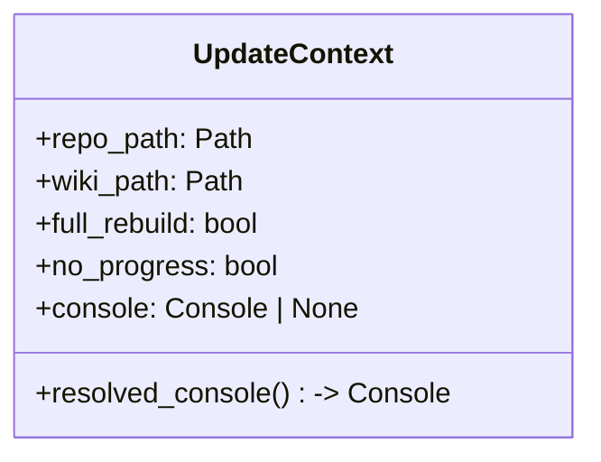
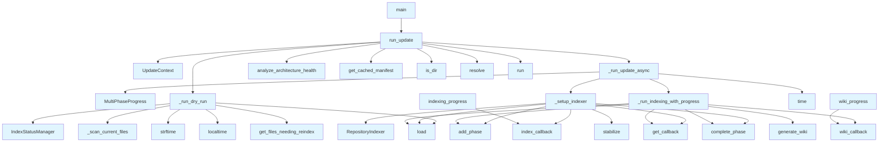

# File: `src/local_deepwiki/cli/update_cli.py`

## File Overview

This file implements the `deepwiki update` command, which performs a one-shot incremental update of a local repository's documentation index and wiki. It orchestrates indexing the repository files and regenerating the wiki documentation using the index. The command supports dry-run mode, full rebuilds, progress reporting, and custom wiki output paths.

The design emphasizes modularity and clear separation of concerns by splitting the update process into indexing and wiki generation phases, each with dedicated async functions and progress tracking.

## Key Concepts

### Update Pipeline

The core of the update command is a two-phase asynchronous pipeline:

1. **Indexing Phase**: The [`RepositoryIndexer`](../core/indexer.md) scans the repository, builds a vector index of file contents, and tracks file changes using an [`IndexStatusManager`](../core/index_manager.md).
2. **Wiki Generation Phase**: The [`generate_wiki`](../generators/wiki/generator.md) function uses the index to produce structured wiki documentation.

This separation allows for independent progress tracking, clean error boundaries, and extensibility (e.g., adding new analysis or generation steps).

### Context Bundling

The `UpdateContext` class bundles common parameters (`repo_path`, `wiki_path`, `full_rebuild`, etc.) into a single immutable object. This reduces function signatures, improves readability, and makes the pipeline easier to test or modify.

### Dry Run Mode

The `_run_dry_run` function simulates the update process without performing any writes. It compares the current repository state against an existing index and reports which files would be added, modified, or deleted. This provides a safe way for users to preview changes.

### Progress Reporting

Progress is handled via the [`MultiPhaseProgress`](../cli_progress.md) class, which provides live updates for both indexing and wiki generation phases. It supports disabling progress bars for CI environments and integrates with the Rich console for rich terminal output.

### Health Snapshot

After a successful update, a health snapshot is saved using [`save_snapshot`](../core/health_history.md). This is a non-critical feature for tracking project health trends over time, and it's wrapped in a try-except block to prevent failures from breaking the update process.

## Integration

This file integrates with several other modules in the codebase:

- **CLI Layer**: Called from `main.py` as the entry point for the `deepwiki update` command.
- **Core Indexing**: Uses [`RepositoryIndexer`](../core/indexer.md) and [`IndexStatusManager`](../core/index_manager.md) from `local_deepwiki.core.indexer` and `local_deepwiki.core.index_manager`.
- **Wiki Generation**: Depends on [`generate_wiki`](../generators/wiki/generator.md) from `local_deepwiki.generators.wiki`.
- **Progress Tracking**: Uses [`MultiPhaseProgress`](../cli_progress.md) from `local_deepwiki.cli_progress`.
- **Status CLI**: Reuses `_scan_current_files` from `local_deepwiki.cli.status_cli` for dry-run file scanning.
- **Configuration**: Loads configuration using `Config.load()` from `local_deepwiki.config`.

The file is closely related to other CLI commands like `cache_cli.py`, `check_cli.py`, and `main.py`, which form the command-line interface layer of the application.

## Design Notes

### Asynchronous Execution

The update process is fully asynchronous to allow for efficient I/O during indexing and wiki generation. This is particularly important for large repositories where file I/O and vector operations can be time-consuming.

### Error Handling

The `run_update` function wraps the async pipeline in a try-except block to catch `KeyboardInterrupt` and return a consistent exit code (130). This provides a graceful way to handle user interruption.

### Console Abstraction

The `UpdateContext` class uses a `resolved_console` property to allow functions to use either a provided console or a default one, improving testability and flexibility in how output is handled.

### Non-Critical Health Snapshot

The health snapshot saving logic is wrapped in a `try-except` block. This ensures that failures in health analysis or snapshot saving don't interrupt the core update process, which is critical for usability.

### Reusable Progress Callbacks

The `indexing_progress` and `wiki_progress` functions are defined inline within their respective async functions to provide context-specific callbacks for progress reporting. This keeps the progress handling logic localized and avoids global state.

### CLI Argument Parsing

The `main` function uses `argparse` to parse CLI arguments and map them to the `run_update` function. The argument parser includes help text with usage examples, making the CLI user-friendly.

### Immutable Context

`UpdateContext` is defined as a dataclass to provide a clean, immutable way to pass configuration and state through the pipeline. This is a design choice that aligns with functional programming principles, reducing side effects and improving testability.

### Dry Run Efficiency

In dry-run mode, `_run_dry_run` avoids actually indexing the repository. It only scans files and compares against the index to determine changes, making it fast and safe for previewing updates.

## API Reference

### class `UpdateContext`

Immutable context for the update pipeline.  Bundles the common parameters shared by ``_setup_indexer``, ``_run_indexing_with_progress``, and ``run_update`` so each function accepts a single context object instead of 5-9 positional and keyword arguments.

**Methods:**


<details>
<summary>View Source (lines 23-41) | <a href="https://github.com/UrbanDiver/local-deepwiki-mcp/blob/main/src/local_deepwiki/cli/update_cli.py#L23-L41">GitHub</a></summary>

```python
class UpdateContext:
    """Immutable context for the update pipeline.

    Bundles the common parameters shared by ``_setup_indexer``,
    ``_run_indexing_with_progress``, and ``run_update`` so each
    function accepts a single context object instead of 5-9 positional
    and keyword arguments.
    """

    repo_path: Path
    wiki_path: Path
    full_rebuild: bool = False
    no_progress: bool = False
    console: Console | None = None

    @property
    def resolved_console(self) -> Console:
        """Return the console, creating a default if none was provided."""
        return self.console or Console()
```

</details>

#### `resolved_console`

```python
def resolved_console() -> Console
```

Return the console, creating a default if none was provided.


---


<details>
<summary>View Source (lines 23-41) | <a href="https://github.com/UrbanDiver/local-deepwiki-mcp/blob/main/src/local_deepwiki/cli/update_cli.py#L23-L41">GitHub</a></summary>

```python
class UpdateContext:
    """Immutable context for the update pipeline.

    Bundles the common parameters shared by ``_setup_indexer``,
    ``_run_indexing_with_progress``, and ``run_update`` so each
    function accepts a single context object instead of 5-9 positional
    and keyword arguments.
    """

    repo_path: Path
    wiki_path: Path
    full_rebuild: bool = False
    no_progress: bool = False
    console: Console | None = None

    @property
    def resolved_console(self) -> Console:
        """Return the console, creating a default if none was provided."""
        return self.console or Console()
```

</details>

### Functions

#### `indexing_progress`

```python
def indexing_progress(msg: str, current: int, total: int) -> None
```


| Parameter | Type | Default | Description |
|-----------|------|---------|-------------|
| `msg` | `str` | - | - |
| `current` | `int` | - | - |
| `total` | `int` | - | - |

**Returns:** `None`


<details>
<summary>View Source (lines 152-159) | <a href="https://github.com/UrbanDiver/local-deepwiki-mcp/blob/main/src/local_deepwiki/cli/update_cli.py#L152-L159">GitHub</a></summary>

```python
def indexing_progress(msg: str, current: int, total: int) -> None:
        if index_callback:
            index_callback(msg, current, total)
        elif not ctx.no_progress:
            if total > 0:
                console.print(f"  [{current}/{total}] {msg}")
            else:
                console.print(f"  {msg}")
```

</details>

#### `wiki_progress`

```python
def wiki_progress(msg: str, current: int, total: int) -> None
```


| Parameter | Type | Default | Description |
|-----------|------|---------|-------------|
| `msg` | `str` | - | - |
| `current` | `int` | - | - |
| `total` | `int` | - | - |

**Returns:** `None`


<details>
<summary>View Source (lines 205-212) | <a href="https://github.com/UrbanDiver/local-deepwiki-mcp/blob/main/src/local_deepwiki/cli/update_cli.py#L205-L212">GitHub</a></summary>

```python
def wiki_progress(msg: str, current: int, total: int) -> None:
        if wiki_callback:
            wiki_callback(msg, current, total)
        elif not ctx.no_progress:
            if total > 0:
                console.print(f"  [{current}/{total}] {msg}")
            else:
                console.print(f"  {msg}")
```

</details>

#### `run_update`

```python
def run_update(repo_path: Path, full_rebuild: bool = False, dry_run: bool = False, no_progress: bool = False, wiki_path: Path | None = None, console: Console | None = None) -> int
```

Run the update command and return exit code.  The public signature is kept for backward compatibility with existing callers and the CLI entry point.  Internally, the loose parameters are bundled into an :class:`UpdateContext` before being forwarded to the async pipeline.


| Parameter | Type | Default | Description |
|-----------|------|---------|-------------|
| `repo_path` | `Path` | - | - |
| `full_rebuild` | `bool` | `False` | - |
| `dry_run` | `bool` | `False` | - |
| `no_progress` | `bool` | `False` | - |
| `wiki_path` | `Path | None` | `None` | - |
| `console` | `Console | None` | `None` | - |

**Returns:** `int`


<details>
<summary>View Source (lines 257-314) | <a href="https://github.com/UrbanDiver/local-deepwiki-mcp/blob/main/src/local_deepwiki/cli/update_cli.py#L257-L314">GitHub</a></summary>

```python
def run_update(
    repo_path: Path,
    *,
    full_rebuild: bool = False,
    dry_run: bool = False,
    no_progress: bool = False,
    wiki_path: Path | None = None,
    console: Console | None = None,
) -> int:
    """Run the update command and return exit code.

    The public signature is kept for backward compatibility with
    existing callers and the CLI entry point.  Internally, the loose
    parameters are bundled into an :class:`UpdateContext` before being
    forwarded to the async pipeline.
    """
    resolved_console = console or Console()
    resolved_repo = repo_path.resolve()
    effective_wiki_path = wiki_path or (resolved_repo / ".deepwiki")

    if not resolved_repo.is_dir():
        resolved_console.print(f"[red]Not a directory: {resolved_repo}[/red]")
        return 1

    if dry_run:
        return _run_dry_run(resolved_repo, effective_wiki_path, resolved_console)

    ctx = UpdateContext(
        repo_path=resolved_repo,
        wiki_path=effective_wiki_path,
        full_rebuild=full_rebuild,
        no_progress=no_progress,
        console=resolved_console,
    )

    try:
        exit_code = asyncio.run(_run_update_async(ctx))
        if exit_code == 0:
            # Save health snapshot for trend tracking (non-critical)
            try:
                from local_deepwiki.core.health_history import save_snapshot
                from local_deepwiki.generators.analysis.architecture_health import (
                    analyze_architecture_health,
                )
                from local_deepwiki.generators.manifest import get_cached_manifest

                manifest = get_cached_manifest(resolved_repo)
                project_name = manifest.name or resolved_repo.name
                health = analyze_architecture_health(resolved_repo, project_name)
                save_snapshot(effective_wiki_path, health)
            except Exception:
                pass
        return exit_code
    except KeyboardInterrupt:
        resolved_console.print(
            "\n[yellow]Update interrupted.[/yellow] Partial progress may have been saved."
        )
        return 130
```

</details>

#### `main`

```python
def main() -> int
```

Main entry point for ``deepwiki update``.

**Returns:** `int`


<details>
<summary>View Source (lines 317-369) | <a href="https://github.com/UrbanDiver/local-deepwiki-mcp/blob/main/src/local_deepwiki/cli/update_cli.py#L317-L369">GitHub</a></summary>

```python
def main() -> int:
    """Main entry point for ``deepwiki update``."""
    parser = argparse.ArgumentParser(
        prog="deepwiki update",
        description="Index repository and regenerate wiki documentation",
        epilog=(
            "examples:\n"
            "  deepwiki update                     Incremental update for current directory\n"
            "  deepwiki update /path/to/repo        Update a specific repository\n"
            "  deepwiki update --full-rebuild        Force complete re-index\n"
            "  deepwiki update --dry-run             Show what would change\n"
            "  deepwiki update --no-progress         Disable progress bars (for CI)\n"
            "  deepwiki update --wiki-path ./docs    Output wiki to custom directory\n"
        ),
        formatter_class=argparse.RawDescriptionHelpFormatter,
    )
    parser.add_argument(
        "repo_path",
        nargs="?",
        default=".",
        help="Repository path to index (default: current directory)",
    )
    parser.add_argument(
        "--full-rebuild",
        action="store_true",
        help="Force complete re-index (ignore incremental state)",
    )
    parser.add_argument(
        "--dry-run",
        action="store_true",
        help="Show what would change without indexing",
    )
    parser.add_argument(
        "--no-progress",
        action="store_true",
        help="Disable Rich progress bars (for CI environments)",
    )
    parser.add_argument(
        "--wiki-path",
        type=str,
        default=None,
        help="Wiki output directory (default: REPO_PATH/.deepwiki)",
    )

    args = parser.parse_args()

    return run_update(
        Path(args.repo_path),
        full_rebuild=args.full_rebuild,
        dry_run=args.dry_run,
        no_progress=args.no_progress,
        wiki_path=Path(args.wiki_path) if args.wiki_path else None,
    )
```

</details>

## Class Diagram



## Call Graph



## Used By

Functions and methods in this file and their callers:

- **`ArgumentParser`**: called by `main`
- **[`IndexStatusManager`](../core/index_manager.md)**: called by `_run_dry_run`
- **[`MultiPhaseProgress`](../cli_progress.md)**: called by `_run_update_async`
- **`Path`**: called by `main`
- **[`RepositoryIndexer`](../core/indexer.md)**: called by `_setup_indexer`
- **`UpdateContext`**: called by `run_update`
- **`_run_dry_run`**: called by `run_update`
- **`_run_indexing_with_progress`**: called by `_run_update_async`
- **`_run_update_async`**: called by `run_update`
- **`_scan_current_files`**: called by `_run_dry_run`
- **`_setup_indexer`**: called by `_run_update_async`
- **`add_argument`**: called by `main`
- **`add_phase`**: called by `_run_indexing_with_progress`, `_setup_indexer`
- **[`analyze_architecture_health`](../generators/analysis/architecture_health.md)**: called by `run_update`
- **`complete_phase`**: called by `_run_indexing_with_progress`, `_setup_indexer`
- **[`generate_wiki`](../generators/wiki/generator.md)**: called by `_run_indexing_with_progress`
- **[`get_cached_manifest`](../generators/manifest.md)**: called by `run_update`
- **`get_callback`**: called by `_run_indexing_with_progress`, `_setup_indexer`
- **`get_files_needing_reindex`**: called by `_run_dry_run`
- **`index_callback`**: called by `_setup_indexer`, `indexing_progress`
- **`is_dir`**: called by `run_update`
- **`load`**: called by `_run_dry_run`, `_run_indexing_with_progress`, `_setup_indexer`
- **`localtime`**: called by `_run_dry_run`
- **`parse_args`**: called by `main`
- **`resolve`**: called by `run_update`
- **`run`**: called by `run_update`
- **`run_update`**: called by `main`
- **[`save_snapshot`](../core/health_history.md)**: called by `run_update`
- **`stabilize`**: called by `_setup_indexer`
- **`strftime`**: called by `_run_dry_run`
- **`time`**: called by `_run_update_async`
- **`wiki_callback`**: called by `_run_indexing_with_progress`, `wiki_progress`

## Last Modified

| Entity | Type | Author | Date | Commit |
|--------|------|--------|------|--------|
| `UpdateContext` | class | Brian Breidenbach | yesterday | `1eef062` refactor: complete Grade A ... |
| `_setup_indexer` | function | Brian Breidenbach | yesterday | `1eef062` refactor: complete Grade A ... |
| `indexing_progress` | function | Brian Breidenbach | yesterday | `1eef062` refactor: complete Grade A ... |
| `_run_indexing_with_progress` | function | Brian Breidenbach | yesterday | `1eef062` refactor: complete Grade A ... |
| `wiki_progress` | function | Brian Breidenbach | yesterday | `1eef062` refactor: complete Grade A ... |
| `_run_update_async` | function | Brian Breidenbach | yesterday | `1eef062` refactor: complete Grade A ... |
| `run_update` | function | Brian Breidenbach | yesterday | `1eef062` refactor: complete Grade A ... |
| `_run_dry_run` | function | Brian Breidenbach | Feb 12, 2026 | `821c352` feat: add `deepwiki status`... |
| `main` | function | Brian Breidenbach | Feb 12, 2026 | `821c352` feat: add `deepwiki status`... |

## Additional Source Code

Source code for functions and methods not listed in the API Reference above.

#### `_run_dry_run`

<details>
<summary>View Source (lines 44-116) | <a href="https://github.com/UrbanDiver/local-deepwiki-mcp/blob/main/src/local_deepwiki/cli/update_cli.py#L44-L116">GitHub</a></summary>

```python
def _run_dry_run(
    repo_path: Path,
    wiki_path: Path,
    console: Console,
) -> int:
    """Show what would change without doing any actual work.

    Args:
        repo_path: Path to the repository.
        wiki_path: Path to the wiki directory.
        console: Rich console for output.

    Returns:
        Exit code (0 = success).
    """
    from local_deepwiki.core.index_manager import IndexStatusManager

    manager = IndexStatusManager()
    status = manager.load(wiki_path)

    if status is None:
        console.print(
            "[yellow]No existing index.[/yellow] First run will index all files."
        )
        # Still scan to show file count
        current_files = _scan_current_files(repo_path)
        console.print(f"  Source files found: [bold]{len(current_files)}[/bold]")
        return 0

    console.print(
        f"[bold]Dry run[/bold] — comparing against index from {time.strftime('%Y-%m-%d %H:%M', time.localtime(status.indexed_at))}"
    )

    current_files = _scan_current_files(repo_path)
    new_files, modified_files, deleted_files = manager.get_files_needing_reindex(
        status, current_files
    )

    total_changed = len(new_files) + len(modified_files) + len(deleted_files)

    if total_changed == 0:
        console.print("[green]Everything is up to date.[/green] No changes detected.")
        return 0

    console.print(
        f"\n  [green]+{len(new_files)} new[/green]  [yellow]~{len(modified_files)} modified[/yellow]  [red]-{len(deleted_files)} deleted[/red]"
    )

    if new_files:
        console.print("\n  [bold]New files:[/bold]")
        for f in sorted(new_files)[:20]:
            console.print(f"    [green]+[/green] {f}")
        if len(new_files) > 20:
            console.print(f"    ... and {len(new_files) - 20} more")

    if modified_files:
        console.print("\n  [bold]Modified files:[/bold]")
        for f in sorted(modified_files)[:20]:
            console.print(f"    [yellow]~[/yellow] {f}")
        if len(modified_files) > 20:
            console.print(f"    ... and {len(modified_files) - 20} more")

    if deleted_files:
        console.print("\n  [bold]Deleted files:[/bold]")
        for f in sorted(deleted_files)[:20]:
            console.print(f"    [red]-[/red] {f}")
        if len(deleted_files) > 20:
            console.print(f"    ... and {len(deleted_files) - 20} more")

    console.print(
        f"\nRun [bold]deepwiki update {repo_path}[/bold] to apply these changes."
    )
    return 0
```

</details>


#### `_setup_indexer`

<details>
<summary>View Source (lines 124-177) | <a href="https://github.com/UrbanDiver/local-deepwiki-mcp/blob/main/src/local_deepwiki/cli/update_cli.py#L124-L177">GitHub</a></summary>

```python
async def _setup_indexer(
    ctx: UpdateContext,
    progress: object,
) -> tuple[object, object]:
    """Initialise the indexer and run the indexing phase.

    Args:
        ctx: Immutable update context with repo/wiki paths and flags.
        progress: ``MultiPhaseProgress`` instance for live progress bars.

    Returns a tuple of ``(index_status, indexer)`` after the indexing phase
    completes.  The indexer's vector store is stabilised before returning.
    """
    from local_deepwiki.cli_progress import MultiPhaseProgress  # noqa: F401 — type hint only
    from local_deepwiki.config import Config
    from local_deepwiki.core.indexer import RepositoryIndexer

    console = ctx.resolved_console
    config = Config.load()
    indexer = RepositoryIndexer(repo_path=ctx.repo_path, config=config)

    # Override wiki_path if user specified one
    if ctx.wiki_path != ctx.repo_path / ".deepwiki":
        indexer.wiki_path = ctx.wiki_path

    progress.add_phase("indexing", "Indexing repository", total=0)
    index_callback = progress.get_callback("indexing")

    def indexing_progress(msg: str, current: int, total: int) -> None:
        if index_callback:
            index_callback(msg, current, total)
        elif not ctx.no_progress:
            if total > 0:
                console.print(f"  [{current}/{total}] {msg}")
            else:
                console.print(f"  {msg}")

    index_status = await indexer.index(
        full_rebuild=ctx.full_rebuild,
        progress_callback=indexing_progress,
    )

    progress.complete_phase("indexing")
    console.print(
        f"[green]Indexed {index_status.total_files} files, "
        f"{index_status.total_chunks} chunks[/green]"
    )

    # LanceDB 0.26: compact all dataset versions into a single stable
    # snapshot so concurrent wiki-generation reads don't collide with
    # deferred fragment compaction.
    indexer.vector_store.stabilize()

    return index_status, indexer
```

</details>


#### `_run_indexing_with_progress`

<details>
<summary>View Source (lines 180-225) | <a href="https://github.com/UrbanDiver/local-deepwiki-mcp/blob/main/src/local_deepwiki/cli/update_cli.py#L180-L225">GitHub</a></summary>

```python
async def _run_indexing_with_progress(
    ctx: UpdateContext,
    indexer: object,
    index_status: object,
    progress: object,
) -> object:
    """Run the wiki generation phase with progress tracking.

    Args:
        ctx: Immutable update context with repo/wiki paths and flags.
        indexer: The ``RepositoryIndexer`` instance (already indexed).
        index_status: The ``IndexStatus`` returned by the indexing phase.
        progress: ``MultiPhaseProgress`` instance for live progress bars.

    Returns the wiki structure produced by ``generate_wiki``.
    """
    from local_deepwiki.config import Config
    from local_deepwiki.generators.wiki import generate_wiki

    console = ctx.resolved_console
    config = Config.load()

    progress.add_phase("wiki", "Generating wiki", total=0)
    wiki_callback = progress.get_callback("wiki")

    def wiki_progress(msg: str, current: int, total: int) -> None:
        if wiki_callback:
            wiki_callback(msg, current, total)
        elif not ctx.no_progress:
            if total > 0:
                console.print(f"  [{current}/{total}] {msg}")
            else:
                console.print(f"  {msg}")

    wiki_structure = await generate_wiki(
        repo_path=ctx.repo_path,
        wiki_path=indexer.wiki_path,
        vector_store=indexer.vector_store,
        index_status=index_status,
        config=config,
        progress_callback=wiki_progress,
        full_rebuild=ctx.full_rebuild,
    )

    progress.complete_phase("wiki")
    return wiki_structure
```

</details>


#### `_run_update_async`

<details>
<summary>View Source (lines 228-254) | <a href="https://github.com/UrbanDiver/local-deepwiki-mcp/blob/main/src/local_deepwiki/cli/update_cli.py#L228-L254">GitHub</a></summary>

```python
async def _run_update_async(ctx: UpdateContext) -> int:
    """Run the actual indexing and wiki generation.

    Args:
        ctx: Immutable update context with repo/wiki paths and flags.

    Returns:
        Exit code (0 = success).
    """
    from local_deepwiki.cli_progress import MultiPhaseProgress

    console = ctx.resolved_console
    start_time = time.time()

    with MultiPhaseProgress(disable=ctx.no_progress) as progress:
        # Phase 1: Indexing
        index_status, indexer = await _setup_indexer(ctx, progress)

        # Phase 2: Wiki generation
        wiki_structure = await _run_indexing_with_progress(
            ctx, indexer, index_status, progress
        )

    elapsed = time.time() - start_time
    console.print(f"[green]Generated {len(wiki_structure.pages)} wiki pages[/green]")
    console.print(f"[bold green]Update complete in {elapsed:.1f}s[/bold green]")
    return 0
```

</details>

## Relevant Source Files

- `src/local_deepwiki/cli/update_cli.py:23-41`
