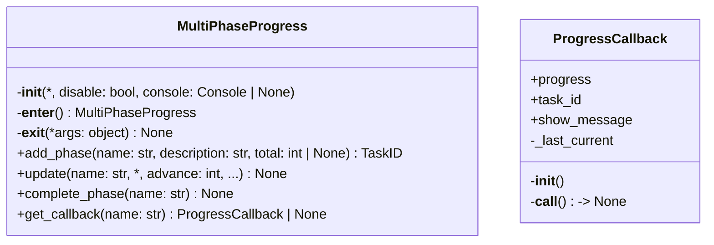
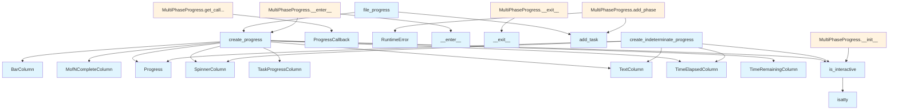

# File Overview

This file, `src/local_deepwiki/cli_progress.py`, provides utilities for displaying progress information in command-line interfaces using the `rich` library. It includes functionality for creating progress bars, managing multi-phase progress tracking, and adapting progress updates to the `ProgressCallback` protocol used elsewhere in the codebase.

The module is designed to work in interactive terminals and automatically disables progress display in non-interactive environments such as CI or when `NO_COLOR` is set.

## Classes

### ProgressCallback

Adapter to use rich progress bars with `ProgressCallback` protocol.

This class bridges the existing `ProgressCallback` protocol used throughout the codebase with rich progress bars for CLI display.

#### Constructor

```python
def __init__(
    self,
    progress: Progress,
    task_id: TaskID,
    *,
    show_message: bool = True,
)
```

Initialize the callback adapter.

**Parameters:**
- `progress`: Rich Progress instance.
- `task_id`: Task ID for the progress bar.
- `show_message`: Whether to update description with messages.

### MultiPhaseProgress

Manages progress tracking across multiple distinct phases, each with its own progress bar.

#### Constructor

```python
def __init__(
    self,
    *,
    disable: bool = False,
    console: Console | None = None,
)
```

Initialize multi-phase progress tracker.

**Parameters:**
- `disable`: If True, disable progress display.
- `console`: Optional console instance.

#### Methods

##### `__enter__`

```python
def __enter__(self) -> MultiPhaseProgress
```

Start progress tracking.

##### `__exit__`

```python
def __exit__(self, *args: object) -> None
```

Stop progress tracking.

##### `add_phase`

```python
def add_phase(
    self,
    name: str,
    description: str,
    total: int | None = None,
) -> TaskID
```

Add a new phase to track.

**Parameters:**
- `name`: Unique name for this phase.
- `description`: Description to display.
- `total`: Total items in this phase (None for indeterminate).

**Returns:**
- Task ID for the phase.

##### `update`

```python
def update(
    self,
    name: str,
    *,
    advance: int = 0,
    completed: int | None = None,
    description: str | None = None,
    total: int | None = None,
) -> None
```

Update a phase's progress.

**Parameters:**
- `name`: Name of the phase to update.
- `advance`: Amount to advance progress.
- `completed`: Set absolute completion count.
- `description`: Update description text.
- `total`: Update total count.

##### `complete_phase`

```python
def complete_phase(self, name: str) -> None
```

Mark a phase as complete.

**Parameters:**
- `name`: Name of the phase to complete.

##### `get_callback`

```python
def get_callback(self, name: str) -> ProgressCallback | None
```

Get a `ProgressCallback` adapter for a phase.

**Parameters:**
- `name`: Name of the phase.

**Returns:**
- `ProgressCallback` adapter or None if phase doesn't exist.

## Functions

### is_interactive

```python
def is_interactive() -> bool
```

Check if the terminal is interactive.

**Returns:**
- True if running in an interactive terminal, False otherwise.

### create_progress

```python
def create_progress(
    *,
    disable: bool = False,
    console: Console | None = None,
) -> Progress
```

Create a configured rich Progress instance.

**Parameters:**
- `disable`: If True, disable progress display entirely.
- `console`: Optional console instance to use.

**Returns:**
- Configured Progress instance.

### create_indeterminate_progress

```python
def create_indeterminate_progress(
    *,
    disable: bool = False,
    console: Console | None = None,
) -> Progress
```

Create a progress bar for operations without known total.

**Parameters:**
- `disable`: If True, disable progress display entirely.
- `console`: Optional console instance to use.

**Returns:**
- Configured Progress instance for indeterminate operations.

### file_progress

```python
def file_progress(
    files: Iterable[Path],
    description: str = "Processing",
    *,
    disable: bool = False,
    console: Console | None = None,
) -> Iterator[tuple[Progress, TaskID, list[Path]]]
```

Context manager for tracking progress over a list of files.

**Parameters:**
- `files`: Iterable of file paths to process.
- `description`: Description to show in progress bar.
- `disable`: If True, disable progress display.
- `console`: Optional console instance.

**Yields:**
- Tuple of (progress instance, task ID, list of files).

## Integration

This file is imported by other modules within the `local_deepwiki` package and provides core functionality for progress tracking in CLI applications. It depends on the `rich` library for rendering progress bars and integrates with the `ProgressCallback` protocol used elsewhere in the codebase.

The `create_indeterminate_progress` function is specifically called by `test_cli_progress`.

## Usage Examples

### Using `MultiPhaseProgress`

```python
from cli_progress import MultiPhaseProgress

with MultiPhaseProgress() as progress:
    task1 = progress.add_phase("download", "Downloading files", total=100)
    task2 = progress.add_phase("process", "Processing files", total=50)

    progress.update("download", advance=10)
    progress.update("process", completed=25)

    progress.complete_phase("download")
```

### Using `file_progress`

```python
from cli_progress import file_progress
from pathlib import Path

files = [Path("file1.txt"), Path("file2.txt")]

for progress, task_id, file_batch in file_progress(files, description="Processing files"):
    # Process file_batch
    pass
```

## API Reference

### class `ProgressCallback`

Adapter to use rich progress bars with ProgressCallback protocol.  This class bridges the existing ProgressCallback protocol used throughout the codebase with rich progress bars for CLI display.

**Methods:**


<details>
<summary>View Source (lines 146-198) | <a href="https://github.com/UrbanDiver/local-deepwiki-mcp/blob/[main](export/pdf.md)/src/local_deepwiki/cli_progress.py#L146-L198">GitHub</a></summary>

```python
class ProgressCallback:
    """Adapter to use rich progress bars with ProgressCallback protocol.

    This class bridges the existing ProgressCallback protocol used throughout
    the codebase with rich progress bars for CLI display.
    """

    def __init__(
        self,
        progress: Progress,
        task_id: TaskID,
        *,
        show_message: bool = True,
    ):
        """Initialize the callback adapter.

        Args:
            progress: Rich Progress instance.
            task_id: Task ID for the progress bar.
            show_message: Whether to update description with messages.
        """
        self.progress = progress
        self.task_id = task_id
        self.show_message = show_message
        self._last_current = 0

    def __call__(self, msg: str, current: int, total: int) -> None:
        """Handle progress callback.

        Args:
            msg: Description of current operation.
            current: Current step number.
            total: Total number of steps.
        """
        # Update total if it changed
        if total > 0:
            self.progress.update(self.task_id, total=total)

        # Calculate advance from last position
        advance = current - self._last_current
        if advance > 0:
            self.progress.update(self.task_id, advance=advance)
        elif current < self._last_current:
            # Reset happened (new phase), reset to current position
            self.progress.update(self.task_id, completed=current)

        self._last_current = current

        # Update description if requested
        if self.show_message and msg:
            # Truncate long messages
            display_msg = msg[:50] + "..." if len(msg) > 50 else msg
            self.progress.update(self.task_id, description=display_msg)
```

</details>

#### `__init__`

```python
def __init__(progress: Progress, task_id: TaskID, show_message: bool = True)
```

Initialize the callback adapter.


| [Parameter](generators/api_docs.md) | Type | Default | Description |
|-----------|------|---------|-------------|
| `progress` | `Progress` | - | Rich Progress instance. |
| `task_id` | `TaskID` | - | Task ID for the progress bar. |
| `show_message` | `bool` | `True` | Whether to update description with messages. |


<details>
<summary>View Source (lines 146-198) | <a href="https://github.com/UrbanDiver/local-deepwiki-mcp/blob/[main](export/pdf.md)/src/local_deepwiki/cli_progress.py#L146-L198">GitHub</a></summary>

```python
class ProgressCallback:
    """Adapter to use rich progress bars with ProgressCallback protocol.

    This class bridges the existing ProgressCallback protocol used throughout
    the codebase with rich progress bars for CLI display.
    """

    def __init__(
        self,
        progress: Progress,
        task_id: TaskID,
        *,
        show_message: bool = True,
    ):
        """Initialize the callback adapter.

        Args:
            progress: Rich Progress instance.
            task_id: Task ID for the progress bar.
            show_message: Whether to update description with messages.
        """
        self.progress = progress
        self.task_id = task_id
        self.show_message = show_message
        self._last_current = 0

    def __call__(self, msg: str, current: int, total: int) -> None:
        """Handle progress callback.

        Args:
            msg: Description of current operation.
            current: Current step number.
            total: Total number of steps.
        """
        # Update total if it changed
        if total > 0:
            self.progress.update(self.task_id, total=total)

        # Calculate advance from last position
        advance = current - self._last_current
        if advance > 0:
            self.progress.update(self.task_id, advance=advance)
        elif current < self._last_current:
            # Reset happened (new phase), reset to current position
            self.progress.update(self.task_id, completed=current)

        self._last_current = current

        # Update description if requested
        if self.show_message and msg:
            # Truncate long messages
            display_msg = msg[:50] + "..." if len(msg) > 50 else msg
            self.progress.update(self.task_id, description=display_msg)
```

</details>

#### `__call__`

```python
def __call__(msg: str, current: int, total: int) -> None
```

Handle progress callback.


| [Parameter](generators/api_docs.md) | Type | Default | Description |
|-----------|------|---------|-------------|
| `msg` | `str` | - | Description of current operation. |
| `current` | `int` | - | Current step number. |
| `total` | `int` | - | Total number of steps. |


<details>
<summary>View Source (lines 146-198) | <a href="https://github.com/UrbanDiver/local-deepwiki-mcp/blob/[main](export/pdf.md)/src/local_deepwiki/cli_progress.py#L146-L198">GitHub</a></summary>

```python
class ProgressCallback:
    """Adapter to use rich progress bars with ProgressCallback protocol.

    This class bridges the existing ProgressCallback protocol used throughout
    the codebase with rich progress bars for CLI display.
    """

    def __init__(
        self,
        progress: Progress,
        task_id: TaskID,
        *,
        show_message: bool = True,
    ):
        """Initialize the callback adapter.

        Args:
            progress: Rich Progress instance.
            task_id: Task ID for the progress bar.
            show_message: Whether to update description with messages.
        """
        self.progress = progress
        self.task_id = task_id
        self.show_message = show_message
        self._last_current = 0

    def __call__(self, msg: str, current: int, total: int) -> None:
        """Handle progress callback.

        Args:
            msg: Description of current operation.
            current: Current step number.
            total: Total number of steps.
        """
        # Update total if it changed
        if total > 0:
            self.progress.update(self.task_id, total=total)

        # Calculate advance from last position
        advance = current - self._last_current
        if advance > 0:
            self.progress.update(self.task_id, advance=advance)
        elif current < self._last_current:
            # Reset happened (new phase), reset to current position
            self.progress.update(self.task_id, completed=current)

        self._last_current = current

        # Update description if requested
        if self.show_message and msg:
            # Truncate long messages
            display_msg = msg[:50] + "..." if len(msg) > 50 else msg
            self.progress.update(self.task_id, description=display_msg)
```

</details>

### class `MultiPhaseProgress`

Progress tracker for multi-phase operations.  Provides a clean interface for tracking progress across multiple phases of a long-running operation (e.g., indexing -> parsing -> generating).

**Methods:**


<details>
<summary>View Source (lines 201-341) | <a href="https://github.com/UrbanDiver/local-deepwiki-mcp/blob/[main](export/pdf.md)/src/local_deepwiki/cli_progress.py#L201-L341">GitHub</a></summary>

```python
class MultiPhaseProgress:
    # Methods: __init__, __enter__, __exit__, add_phase, update, complete_phase, get_callback
```

</details>

#### `__init__`

```python
def __init__(disable: bool = False, console: Console | None = None)
```

Initialize multi-phase progress tracker.


| [Parameter](generators/api_docs.md) | Type | Default | Description |
|-----------|------|---------|-------------|
| `disable` | `bool` | `False` | If True, disable progress display. |
| `console` | `Console | None` | `None` | Optional console instance. |


<details>
<summary>View Source (lines 208-224) | <a href="https://github.com/UrbanDiver/local-deepwiki-mcp/blob/[main](export/pdf.md)/src/local_deepwiki/cli_progress.py#L208-L224">GitHub</a></summary>

```python
def __init__(
        self,
        *,
        disable: bool = False,
        console: Console | None = None,
    ):
        """Initialize multi-phase progress tracker.

        Args:
            disable: If True, disable progress display.
            console: Optional console instance.
        """
        self._disable = disable or not is_interactive()
        self._console = console or Console()
        self._progress: Progress | None = None
        self._tasks: dict[str, TaskID] = {}
        self._active = False
```

</details>

#### `__enter__`

```python
def __enter__() -> MultiPhaseProgress
```

Start progress tracking.


<details>
<summary>View Source (lines 226-234) | <a href="https://github.com/UrbanDiver/local-deepwiki-mcp/blob/[main](export/pdf.md)/src/local_deepwiki/cli_progress.py#L226-L234">GitHub</a></summary>

```python
def __enter__(self) -> MultiPhaseProgress:
        """Start progress tracking."""
        self._progress = create_progress(
            disable=self._disable,
            console=self._console,
        )
        self._progress.__enter__()
        self._active = True
        return self
```

</details>

#### `__exit__`

```python
def __exit__() -> None
```

Stop progress tracking.


<details>
<summary>View Source (lines 236-240) | <a href="https://github.com/UrbanDiver/local-deepwiki-mcp/blob/[main](export/pdf.md)/src/local_deepwiki/cli_progress.py#L236-L240">GitHub</a></summary>

```python
def __exit__(self, *args: object) -> None:
        """Stop progress tracking."""
        if self._progress:
            self._progress.__exit__(*args)
        self._active = False
```

</details>

#### `add_phase`

```python
def add_phase(name: str, description: str, total: int | None = None) -> TaskID
```

Add a new phase to track.


| [Parameter](generators/api_docs.md) | Type | Default | Description |
|-----------|------|---------|-------------|
| `name` | `str` | - | Unique name for this phase. |
| `description` | `str` | - | Description to display. |
| `total` | `int | None` | `None` | Total items in this phase (None for indeterminate). |


<details>
<summary>View Source (lines 242-267) | <a href="https://github.com/UrbanDiver/local-deepwiki-mcp/blob/[main](export/pdf.md)/src/local_deepwiki/cli_progress.py#L242-L267">GitHub</a></summary>

```python
def add_phase(
        self,
        name: str,
        description: str,
        total: int | None = None,
    ) -> TaskID:
        """Add a new phase to track.

        Args:
            name: Unique name for this phase.
            description: Description to display.
            total: Total items in this phase (None for indeterminate).

        Returns:
            Task ID for the phase.
        """
        if not self._progress or not self._active:
            raise RuntimeError("Progress tracker not started. Use 'with' statement.")

        task_id = self._progress.add_task(
            description,
            total=total if total is not None else 0,
            start=total is not None,
        )
        self._tasks[name] = task_id
        return task_id
```

</details>

#### `update`

```python
def update(name: str, advance: int = 0, completed: int | None = None, description: str | None = None, total: int | None = None) -> None
```

Update a phase's progress.


| [Parameter](generators/api_docs.md) | Type | Default | Description |
|-----------|------|---------|-------------|
| `name` | `str` | - | Name of the phase to update. |
| `advance` | `int` | `0` | Amount to advance progress. |
| `completed` | `int | None` | `None` | Set absolute completion count. |
| `description` | `str | None` | `None` | Update description text. |
| `total` | `int | None` | `None` | Update total count. |


<details>
<summary>View Source (lines 269-305) | <a href="https://github.com/UrbanDiver/local-deepwiki-mcp/blob/[main](export/pdf.md)/src/local_deepwiki/cli_progress.py#L269-L305">GitHub</a></summary>

```python
def update(
        self,
        name: str,
        *,
        advance: int = 0,
        completed: int | None = None,
        description: str | None = None,
        total: int | None = None,
    ) -> None:
        """Update a phase's progress.

        Args:
            name: Name of the phase to update.
            advance: Amount to advance progress.
            completed: Set absolute completion count.
            description: Update description text.
            total: Update total count.
        """
        if not self._progress or not self._active:
            return

        task_id = self._tasks.get(name)
        if task_id is None:
            return

        kwargs: dict[str, object] = {}
        if advance:
            kwargs["advance"] = advance
        if completed is not None:
            kwargs["completed"] = completed
        if description is not None:
            kwargs["description"] = description
        if total is not None:
            kwargs["total"] = total

        if kwargs:
            self._progress.update(task_id, **kwargs)
```

</details>

#### `complete_phase`

```python
def complete_phase(name: str) -> None
```

Mark a phase as complete.


| [Parameter](generators/api_docs.md) | Type | Default | Description |
|-----------|------|---------|-------------|
| `name` | `str` | - | Name of the phase to complete. |


<details>
<summary>View Source (lines 307-323) | <a href="https://github.com/UrbanDiver/local-deepwiki-mcp/blob/[main](export/pdf.md)/src/local_deepwiki/cli_progress.py#L307-L323">GitHub</a></summary>

```python
def complete_phase(self, name: str) -> None:
        """Mark a phase as complete.

        Args:
            name: Name of the phase to complete.
        """
        if not self._progress or not self._active:
            return

        task_id = self._tasks.get(name)
        if task_id is None:
            return

        # Get current total and mark as fully complete
        task = self._progress._tasks.get(task_id)
        if task:
            self._progress.update(task_id, completed=task.total or 0)
```

</details>

#### `get_callback`

```python
def get_callback(name: str) -> ProgressCallback | None
```

Get a ProgressCallback adapter for a phase.


| [Parameter](generators/api_docs.md) | Type | Default | Description |
|-----------|------|---------|-------------|
| `name` | `str` | - | Name of the phase. |


---


<details>
<summary>View Source (lines 325-341) | <a href="https://github.com/UrbanDiver/local-deepwiki-mcp/blob/[main](export/pdf.md)/src/local_deepwiki/cli_progress.py#L325-L341">GitHub</a></summary>

```python
def get_callback(self, name: str) -> ProgressCallback | None:
        """Get a ProgressCallback adapter for a phase.

        Args:
            name: Name of the phase.

        Returns:
            ProgressCallback adapter or None if phase doesn't exist.
        """
        if not self._progress or not self._active:
            return None

        task_id = self._tasks.get(name)
        if task_id is None:
            return None

        return ProgressCallback(self._progress, task_id)
```

</details>

### Functions

#### `is_interactive`

```python
def is_interactive() -> bool
```

Check if the terminal is interactive.

**Returns:** `bool`


<details>
<summary>View Source (lines 33-51) | <a href="https://github.com/UrbanDiver/local-deepwiki-mcp/blob/[main](export/pdf.md)/src/local_deepwiki/cli_progress.py#L33-L51">GitHub</a></summary>

```python
def is_interactive() -> bool:
    """Check if the terminal is interactive.

    Returns:
        True if running in an interactive terminal, False otherwise.
    """
    # Check if stdout is a TTY
    if not hasattr(sys.stdout, "isatty") or not sys.stdout.isatty():
        return False

    # Check common environment variables that indicate non-interactive mode
    if os.environ.get("CI"):
        return False
    if os.environ.get("NO_COLOR"):
        return False
    if os.environ.get("TERM") == "dumb":
        return False

    return True
```

</details>

#### `create_progress`

```python
def create_progress(disable: bool = False, console: Console | None = None) -> Progress
```

Create a configured rich Progress instance.


| [Parameter](generators/api_docs.md) | Type | Default | Description |
|-----------|------|---------|-------------|
| `disable` | `bool` | `False` | If True, disable progress display entirely. |
| `console` | `Console | None` | `None` | Optional console instance to use. |

**Returns:** `Progress`


<details>
<summary>View Source (lines 54-83) | <a href="https://github.com/UrbanDiver/local-deepwiki-mcp/blob/[main](export/pdf.md)/src/local_deepwiki/cli_progress.py#L54-L83">GitHub</a></summary>

```python
def create_progress(
    *,
    disable: bool = False,
    console: Console | None = None,
) -> Progress:
    """Create a configured rich Progress instance.

    Args:
        disable: If True, disable progress display entirely.
        console: Optional console instance to use.

    Returns:
        Configured Progress instance.
    """
    # Auto-disable if not interactive
    if not is_interactive():
        disable = True

    return Progress(
        SpinnerColumn(),
        TextColumn("[bold blue]{task.description}"),
        BarColumn(bar_width=40),
        TaskProgressColumn(),
        MofNCompleteColumn(),
        TimeElapsedColumn(),
        TimeRemainingColumn(),
        console=console or Console(),
        disable=disable,
        transient=False,
    )
```

</details>

#### `create_indeterminate_progress`

```python
def create_indeterminate_progress(disable: bool = False, console: Console | None = None) -> Progress
```

Create a progress bar for operations without known total.


| [Parameter](generators/api_docs.md) | Type | Default | Description |
|-----------|------|---------|-------------|
| `disable` | `bool` | `False` | If True, disable progress display entirely. |
| `console` | `Console | None` | `None` | Optional console instance to use. |

**Returns:** `Progress`


<details>
<summary>View Source (lines 86-110) | <a href="https://github.com/UrbanDiver/local-deepwiki-mcp/blob/[main](export/pdf.md)/src/local_deepwiki/cli_progress.py#L86-L110">GitHub</a></summary>

```python
def create_indeterminate_progress(
    *,
    disable: bool = False,
    console: Console | None = None,
) -> Progress:
    """Create a progress bar for operations without known total.

    Args:
        disable: If True, disable progress display entirely.
        console: Optional console instance to use.

    Returns:
        Configured Progress instance for indeterminate operations.
    """
    if not is_interactive():
        disable = True

    return Progress(
        SpinnerColumn(),
        TextColumn("[bold blue]{task.description}"),
        TimeElapsedColumn(),
        console=console or Console(),
        disable=disable,
        transient=False,
    )
```

</details>

#### `file_progress`

`@contextmanager`

```python
def file_progress(files: Iterable[Path], description: str = "Processing", disable: bool = False, console: Console | None = None) -> Iterator[tuple[Progress, TaskID, list[Path]]]
```

Context manager for tracking progress over a list of files.


| [Parameter](generators/api_docs.md) | Type | Default | Description |
|-----------|------|---------|-------------|
| `files` | `Iterable[Path]` | - | Iterable of file paths to process. |
| `description` | `str` | `"Processing"` | Description to show in progress bar. |
| `disable` | `bool` | `False` | If True, disable progress display. |
| `console` | `Console | None` | `None` | Optional console instance. |

**Returns:** `Iterator[tuple[Progress, TaskID, list[Path]]]`


<details>
<summary>View Source (lines 114-143) | <a href="https://github.com/UrbanDiver/local-deepwiki-mcp/blob/[main](export/pdf.md)/src/local_deepwiki/cli_progress.py#L114-L143">GitHub</a></summary>

```python
def file_progress(
    files: Iterable[Path],
    description: str = "Processing",
    *,
    disable: bool = False,
    console: Console | None = None,
) -> Iterator[tuple[Progress, TaskID, list[Path]]]:
    """Context manager for tracking progress over a list of files.

    Args:
        files: Iterable of file paths to process.
        description: Description to show in progress bar.
        disable: If True, disable progress display.
        console: Optional console instance.

    Yields:
        Tuple of (progress instance, task ID, list of files).

    Example:
        >>> with file_progress(md_files, "Exporting") as (progress, task, files):
        ...     for f in files:
        ...         process_file(f)
        ...         progress.update(task, advance=1)
    """
    file_list = list(files)
    total = len(file_list)

    with create_progress(disable=disable, console=console) as progress:
        task = progress.add_task(description, total=total)
        yield progress, task, file_list
```

</details>

## Class Diagram



## Call Graph



## Used By

Functions and methods in this file and their callers:

- **`BarColumn`**: called by `create_progress`
- **`MofNCompleteColumn`**: called by `create_progress`
- **`Progress`**: called by `create_indeterminate_progress`, `create_progress`
- **`ProgressCallback`**: called by `MultiPhaseProgress.get_callback`
- **`RuntimeError`**: called by `MultiPhaseProgress.add_phase`
- **`SpinnerColumn`**: called by `create_indeterminate_progress`, `create_progress`
- **`TaskProgressColumn`**: called by `create_progress`
- **`TextColumn`**: called by `create_indeterminate_progress`, `create_progress`
- **`TimeElapsedColumn`**: called by `create_indeterminate_progress`, `create_progress`
- **`TimeRemainingColumn`**: called by `create_progress`
- **`__enter__`**: called by `MultiPhaseProgress.__enter__`
- **`__exit__`**: called by `MultiPhaseProgress.__exit__`
- **`add_task`**: called by `MultiPhaseProgress.add_phase`, `file_progress`
- **`create_progress`**: called by `MultiPhaseProgress.__enter__`, `file_progress`
- **`is_interactive`**: called by `MultiPhaseProgress.__init__`, `create_indeterminate_progress`, `create_progress`
- **`isatty`**: called by `is_interactive`

## Usage Examples

*Examples extracted from test files*

### Test that create_progress returns a Progress instance

From `test_cli_progress.py::TestCreateProgress::test_creates_progress_instance`:

```python
progress = create_progress(disable=True)
assert progress is not None
```

### Test that disable flag is respected

From `test_cli_progress.py::TestCreateProgress::test_respects_disable_flag`:

```python
progress = create_progress(disable=True)
assert progress.disable is True
```

### Test that progress is auto-disabled in non-interactive mode

From `test_cli_progress.py::TestCreateProgress::test_auto_disables_in_non_interactive`:

```python
with patch("local_deepwiki.cli_progress.is_interactive", return_value=False):
    progress = create_progress()
    assert progress.disable is True
```

### Test that progress is auto-disabled in non-interactive mode

From `test_cli_progress.py::TestCreateProgress::test_auto_disables_in_non_interactive`:

```python
with patch("local_deepwiki.cli_progress.is_interactive", return_value=False):
    progress = create_progress()
    assert progress.disable is True
```

### Test that create_indeterminate_progress returns a Progress instance

From `test_cli_progress.py::TestCreateIndeterminateProgress::test_creates_progress_instance`:

```python
progress = create_indeterminate_progress(disable=True)
assert progress is not None
```


## Last Modified

| Entity | Type | Author | Date | Commit |
|--------|------|--------|------|--------|
| `ProgressCallback` | class | Brian Breidenbach | 1 week ago | `fa2feb8` Add CLI progress bars and f... |
| `MultiPhaseProgress` | class | Brian Breidenbach | 1 week ago | `fa2feb8` Add CLI progress bars and f... |
| `__init__` | method | Brian Breidenbach | 1 week ago | `fa2feb8` Add CLI progress bars and f... |
| `__enter__` | method | Brian Breidenbach | 1 week ago | `fa2feb8` Add CLI progress bars and f... |
| `__exit__` | method | Brian Breidenbach | 1 week ago | `fa2feb8` Add CLI progress bars and f... |
| `add_phase` | method | Brian Breidenbach | 1 week ago | `fa2feb8` Add CLI progress bars and f... |
| `update` | method | Brian Breidenbach | 1 week ago | `fa2feb8` Add CLI progress bars and f... |
| `complete_phase` | method | Brian Breidenbach | 1 week ago | `fa2feb8` Add CLI progress bars and f... |
| `get_callback` | method | Brian Breidenbach | 1 week ago | `fa2feb8` Add CLI progress bars and f... |
| `is_interactive` | function | Brian Breidenbach | 1 week ago | `fa2feb8` Add CLI progress bars and f... |
| `create_progress` | function | Brian Breidenbach | 1 week ago | `fa2feb8` Add CLI progress bars and f... |
| `create_indeterminate_progress` | function | Brian Breidenbach | 1 week ago | `fa2feb8` Add CLI progress bars and f... |
| `file_progress` | function | Brian Breidenbach | 1 week ago | `fa2feb8` Add CLI progress bars and f... |

## Relevant Source Files

- `src/local_deepwiki/cli_progress.py:146-198`
