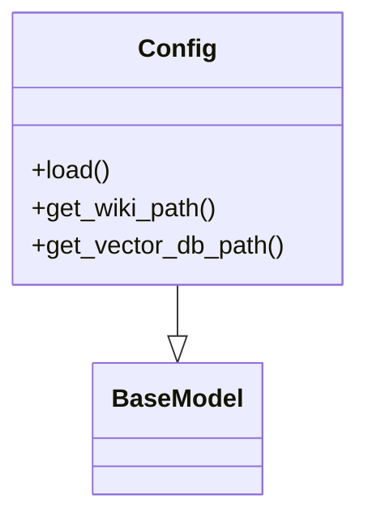
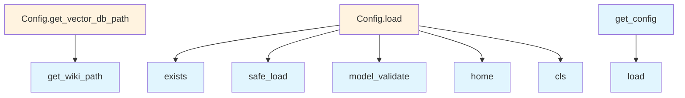

# Configuration Module Documentation

## File Overview

This file defines the configuration system for the local_deepwiki application. It provides a structured way to manage various configuration settings for embedding models, language models, parsing, chunking, and output options. The configuration system uses Pydantic for validation and YAML for configuration file parsing.

The module serves as the central configuration hub that other components like EmbeddingEngine, LLMInterface, and [WikiGenerator](generators/wiki.md) rely on to determine their behavior and settings.

## Classes

### LocalEmbeddingConfig

Configuration class for local embedding models. This class defines settings specific to locally hosted embedding models including model path, device selection, and embedding dimensions.

```python
class LocalEmbeddingConfig(BaseModel):
    model_path: str = Field(..., description="Path to the local embedding model")
    device: str = Field("cpu", description="Device to run the model on (cpu, cuda, etc.)")
    dimensions: int = Field(384, description="Embedding dimensions")
```

### OpenAIEmbeddingConfig

Configuration class for OpenAI embedding models. Defines settings for OpenAI's embedding API including API key, model name, and timeout settings.

```python
class OpenAIEmbeddingConfig(BaseModel):
    api_key: str = Field(..., description="OpenAI API key")
    model: str = Field("text-embedding-3-small", description="OpenAI embedding model name")
    timeout: int = Field(30, description="Request timeout in seconds")
```

### EmbeddingConfig

Union configuration class that combines different embedding model configurations. This class allows switching between local and OpenAI embedding models through a discriminated union.

```python
class EmbeddingConfig(BaseModel):
    local: LocalEmbeddingConfig | None = Field(None, description="Local embedding configuration")
    openai: OpenAIEmbeddingConfig | None = Field(None, description="OpenAI embedding configuration")
```

### OllamaConfig

Configuration class for Ollama models. Defines settings for running models through the Ollama API including base URL, model name, and generation parameters.

```python
class OllamaConfig(BaseModel):
    base_url: str = Field("http://localhost:11434", description="Ollama API base URL")
    model: str = Field("llama3", description="Ollama model name")
    temperature: float = Field(0.7, description="Generation temperature")
    max_tokens: int = Field(2048, description="Maximum tokens to generate")
```

### AnthropicConfig

Configuration class for Anthropic models. Defines settings for Claude models including API key, model name, and system prompt settings.

```python
class AnthropicConfig(BaseModel):
    api_key: str = Field(..., description="Anthropic API key")
    model: str = Field("claude-3-haiku-20240307", description="Anthropic model name")
    system_prompt: str = Field("", description="System prompt for the model")
```

### OpenAILLMConfig

Configuration class for OpenAI language models. Defines settings for OpenAI's chat completion API including API key, model name, and response format.

```python
class OpenAILLMConfig(BaseModel):
    api_key: str = Field(..., description="OpenAI API key")
    model: str = Field("gpt-4-turbo", description="OpenAI language model name")
    response_format: Literal["text", "json_object"] = Field("text", description="Response format")
    temperature: float = Field(0.7, description="Generation temperature")
```

### LLMConfig

Union configuration class that combines different language model configurations. This allows switching between Ollama, Anthropic, and OpenAI language models.

```python
class LLMConfig(BaseModel):
    ollama: OllamaConfig | None = Field(None, description="Ollama configuration")
    anthropic: AnthropicConfig | None = Field(None, description="Anthropic configuration")
    openai: OpenAILLMConfig | None = Field(None, description="OpenAI configuration")
```

### ParsingConfig

Configuration class for document parsing settings. Defines how documents should be parsed including document type, encoding, and parsing options.

```python
class ParsingConfig(BaseModel):
    document_type: str = Field("markdown", description="Type of document to parse")
    encoding: str = Field("utf-8", description="File encoding")
    include_metadata: bool = Field(True, description="Include document metadata")
```

### ChunkingConfig

Configuration class for text chunking settings. Defines how text should be split into chunks including chunk size, overlap, and chunking strategy.

```python
class ChunkingConfig(BaseModel):
    chunk_size: int = Field(1000, description="Maximum chunk size in characters")
    chunk_overlap: int = Field(100, description="Overlap between chunks")
    strategy: Literal["recursive", "token"] = Field("recursive", description="Chunking strategy")
```

### OutputConfig

Configuration class for output settings. Defines how results should be formatted and saved including file format and output directory.

```python
class OutputConfig(BaseModel):
    format: Literal["json", "yaml", "markdown"] = Field("json", description="Output format")
    output_dir: str = Field("./output", description="Directory to save outputs")
    include_sources: bool = Field(True, description="Include source references in output")
```

### Config

Main configuration class that combines all other configuration classes. This is the primary interface for accessing all application settings.

```python
class Config(BaseModel):
    embedding: EmbeddingConfig = Field(default_factory=EmbeddingConfig)
    llm: LLMConfig = Field(default_factory=LLMConfig)
    parsing: ParsingConfig = Field(default_factory=ParsingConfig)
    chunking: ChunkingConfig = Field(default_factory=ChunkingConfig)
    output: OutputConfig = Field(default_factory=OutputConfig)
```

## Functions

### get_config

Retrieves the current configuration instance. This function loads configuration from a YAML file if available, otherwise returns a default configuration.

```python
def get_config() -> Config:
    """
    Get the current configuration instance.
    
    Returns:
        Config: The current configuration instance
    """
```

### set_config

Sets the current configuration instance. This function allows updating the global configuration with a new Config object.

```python
def set_config(config: Config) -> None:
    """
    Set the current configuration instance.
    
    Args:
        config (Config): The configuration instance to set
    """
```

## Usage Examples

### Basic Configuration Loading

```python
from local_deepwiki.config import get_config

# Load configuration
config = get_config()
print(config.embedding.local.model_path)
```

### Creating Custom Configuration

```python
from local_deepwiki.config import Config, LocalEmbeddingConfig, OllamaConfig

# Create custom configuration
custom_config = Config(
    embedding=LocalEmbeddingConfig(
        model_path="./models/my_embedding_model",
        device="cuda"
    ),
    llm=OllamaConfig(
        model="mistral",
        temperature=0.5
    )
)

# Set the configuration
set_config(custom_config)
```

### YAML Configuration File

```yaml
# config.yaml
embedding:
  local:
    model_path: "./models/bge-small-en"
    device: "cuda"
  openai:
    api_key: "sk-..."
    model: "text-embedding-3-small"
llm:
  ollama:
    base_url: "http://localhost:11434"
    model: "llama3"
    temperature: 0.7
parsing:
  document_type: "markdown"
  encoding: "utf-8"
chunking:
  chunk_size: 1000
  chunk_overlap: 100
output:
  format: "json"
  output_dir: "./results"
```

## Related Components

This configuration module works with EmbeddingEngine to determine which embedding model to use, with LLMInterface to configure language model parameters, and with [WikiGenerator](generators/wiki.md) to control document parsing and chunking behavior. The configuration system is used throughout the application to maintain consistent settings across different components and to enable easy switching between different model providers and configurations.

## API Reference

### class `LocalEmbeddingConfig`

**Inherits from:** `BaseModel`

Configuration for local embedding model.

### class `OpenAIEmbeddingConfig`

**Inherits from:** `BaseModel`

Configuration for OpenAI embedding model.

### class `EmbeddingConfig`

**Inherits from:** `BaseModel`

Embedding provider configuration.

### class `OllamaConfig`

**Inherits from:** `BaseModel`

Configuration for Ollama LLM.

### class `AnthropicConfig`

**Inherits from:** `BaseModel`

Configuration for Anthropic LLM.

### class `OpenAILLMConfig`

**Inherits from:** `BaseModel`

Configuration for OpenAI LLM.

### class `LLMConfig`

**Inherits from:** `BaseModel`

LLM provider configuration.

### class `ParsingConfig`

**Inherits from:** `BaseModel`

Code parsing configuration.

### class `ChunkingConfig`

**Inherits from:** `BaseModel`

Chunking configuration.

### class `OutputConfig`

**Inherits from:** `BaseModel`

Output configuration.

### class `Config`

**Inherits from:** `BaseModel`

Main configuration.

**Methods:**

#### `load`

```python
def load(config_path: Path | None = None) -> "Config"
```

Load configuration from file or defaults.


| [Parameter](generators/api_docs.md) | Type | Default | Description |
|-----------|------|---------|-------------|
| `config_path` | `Path | None` | `None` | - |

#### `get_wiki_path`

```python
def get_wiki_path(repo_path: Path) -> Path
```

Get the wiki output path for a repository.


| [Parameter](generators/api_docs.md) | Type | Default | Description |
|-----------|------|---------|-------------|
| `repo_path` | `Path` | - | - |

#### `get_vector_db_path`

```python
def get_vector_db_path(repo_path: Path) -> Path
```

Get the vector database path for a repository.


| [Parameter](generators/api_docs.md) | Type | Default | Description |
|-----------|------|---------|-------------|
| `repo_path` | `Path` | - | - |


---

### Functions

#### `get_config`

```python
def get_config() -> Config
```

Get the global configuration instance.

**Returns:** `Config`


#### `set_config`

```python
def set_config(config: Config) -> None
```

Set the global configuration instance.


| [Parameter](generators/api_docs.md) | Type | Default | Description |
|-----------|------|---------|-------------|
| `config` | `Config` | - | - |

**Returns:** `None`


## Class Diagram



## Call Graph



## See Also

- [chunker](core/chunker.md) - uses this
- [server](server.md) - uses this
- [wiki](generators/wiki.md) - uses this
- [models](models.md) - shares 3 dependencies
- [vectorstore](core/vectorstore.md) - shares 2 dependencies
