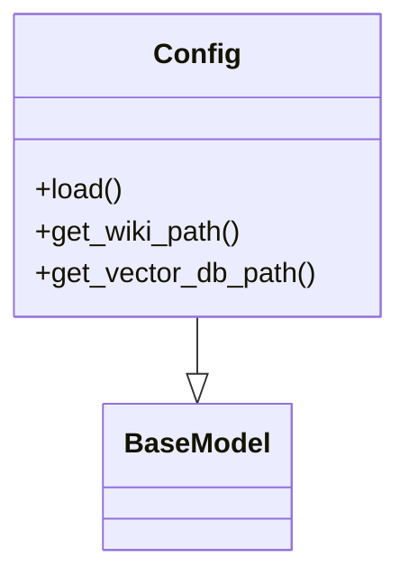
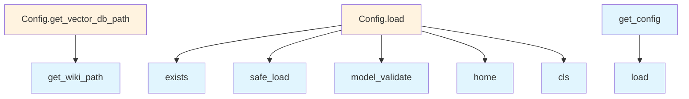

# File Overview

This file defines configuration classes and utility functions for managing application settings in the local_deepwiki project. It uses Pydantic for configuration validation and YAML for configuration file handling.

# Classes

## LocalEmbeddingConfig

Configuration class for local embedding models. This class inherits from BaseModel and is used to define settings for local embedding models.

## OpenAIEmbeddingConfig

Configuration class for OpenAI embedding models. This class inherits from BaseModel and is used to define settings for OpenAI embedding models.

## EmbeddingConfig

Base configuration class for embedding settings. This class inherits from BaseModel and serves as a base for other embedding configuration classes.

## OllamaConfig

Configuration class for Ollama settings. This class inherits from BaseModel and is used to define settings for Ollama.

## AnthropicConfig

Configuration class for Anthropic settings. This class inherits from BaseModel and is used to define settings for Anthropic.

## OpenAILLMConfig

Configuration class for OpenAI LLM settings. This class inherits from BaseModel and is used to define settings for OpenAI language models.

## LLMConfig

Base configuration class for LLM settings. This class inherits from BaseModel and serves as a base for other LLM configuration classes.

## ParsingConfig

Configuration class for parsing settings. This class inherits from BaseModel and is used to define settings for parsing documents.

## ChunkingConfig

Configuration class for chunking settings. This class inherits from BaseModel and is used to define settings for chunking documents.

## OutputConfig

Configuration class for output settings. This class inherits from BaseModel and is used to define settings for output handling.

## Config

Main configuration class that aggregates all other configuration classes. This class inherits from BaseModel and contains fields for all other configuration types.

# Functions

## get_config

Retrieves the application configuration. This function does not take any parameters and returns a Config object.

## set_config

Sets the application configuration. This function takes a Config object as a parameter and returns None.

# Usage Examples

## Loading Configuration

```python
from src.local_deepwiki.config import get_config

config = get_config()
```

## Setting Configuration

```python
from src.local_deepwiki.config import set_config, Config

# Create a new config instance
new_config = Config(...)
set_config(new_config)
```

# Related Components

This file imports and uses:
- `os` for operating system interactions
- `pathlib.Path` for path manipulations
- `typing.Any` and `typing.Literal` for type hints
- `yaml` for YAML parsing
- `pydantic.BaseModel` and `pydantic.Field` for configuration validation

The configuration classes are designed to work with Pydantic's validation system and can be used with YAML configuration files through the `yaml` module.

## API Reference

### class `LocalEmbeddingConfig`

**Inherits from:** `BaseModel`

Configuration for local embedding model.

### class `OpenAIEmbeddingConfig`

**Inherits from:** `BaseModel`

Configuration for OpenAI embedding model.

### class `EmbeddingConfig`

**Inherits from:** `BaseModel`

Embedding provider configuration.

### class `OllamaConfig`

**Inherits from:** `BaseModel`

Configuration for Ollama LLM.

### class `AnthropicConfig`

**Inherits from:** `BaseModel`

Configuration for Anthropic LLM.

### class `OpenAILLMConfig`

**Inherits from:** `BaseModel`

Configuration for OpenAI LLM.

### class `LLMConfig`

**Inherits from:** `BaseModel`

LLM provider configuration.

### class `ParsingConfig`

**Inherits from:** `BaseModel`

Code parsing configuration.

### class `ChunkingConfig`

**Inherits from:** `BaseModel`

Chunking configuration.

### class `OutputConfig`

**Inherits from:** `BaseModel`

Output configuration.

### class `Config`

**Inherits from:** `BaseModel`

Main configuration.

**Methods:**

#### `load`

```python
def load(config_path: Path | None = None) -> "Config"
```

Load configuration from file or defaults.


| [Parameter](generators/api_docs.md) | Type | Default | Description |
|-----------|------|---------|-------------|
| `config_path` | `Path | None` | `None` | - |

#### `get_wiki_path`

```python
def get_wiki_path(repo_path: Path) -> Path
```

Get the wiki output path for a repository.


| [Parameter](generators/api_docs.md) | Type | Default | Description |
|-----------|------|---------|-------------|
| `repo_path` | `Path` | - | - |

#### `get_vector_db_path`

```python
def get_vector_db_path(repo_path: Path) -> Path
```

Get the vector database path for a repository.


| [Parameter](generators/api_docs.md) | Type | Default | Description |
|-----------|------|---------|-------------|
| `repo_path` | `Path` | - | - |


---

### Functions

#### `get_config`

```python
def get_config() -> Config
```

Get the global configuration instance.

**Returns:** `Config`


#### `set_config`

```python
def set_config(config: Config) -> None
```

Set the global configuration instance.


| [Parameter](generators/api_docs.md) | Type | Default | Description |
|-----------|------|---------|-------------|
| `config` | `Config` | - | - |

**Returns:** `None`


## Class Diagram



## Call Graph



## Relevant Source Files

- `src/local_deepwiki/config.py`

## See Also

- [wiki](generators/wiki.md) - uses this
- [chunker](core/chunker.md) - uses this
- [server](server.md) - uses this
- [models](models.md) - shares 3 dependencies
