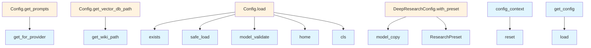

# Configuration Module

## File Overview

The `config.py` module provides configuration management for the local_deepwiki application. It implements a thread-safe singleton pattern with support for context-local configuration overrides, allowing different configurations to be used in different execution contexts (useful for testing or per-request scenarios).

## Configuration Classes

### Config

The [main](export/pdf.md) configuration class that aggregates all configuration sections.

**Fields:**
- `embedding`: EmbeddingConfig - Embedding provider configuration
- `llm`: LLMConfig - [Language](models.md) model provider configuration  
- `llm_cache`: LLMCacheConfig - LLM caching configuration
- `parsing`: ParsingConfig - Document parsing configuration
- `chunking`: ChunkingConfig - Text chunking configuration
- `wiki`: WikiConfig - Wiki generation configuration
- `deep_research`: DeepResearchConfig - Deep research functionality configuration
- `output`: OutputConfig - Output formatting configuration
- `prompts`: PromptsConfig - System prompts configuration

### LLM Provider Configurations

#### LLMConfig

Main LLM provider configuration that supports multiple providers.

**Fields:**
- `provider`: Literal["ollama", "anthropic", "openai"] - Selected LLM provider (default: "ollama")
- `ollama`: OllamaConfig - Ollama-specific configuration
- `anthropic`: AnthropicConfig - Anthropic-specific configuration  
- `openai`: OpenAILLMConfig - OpenAI-specific configuration

#### OllamaConfig

Configuration for Ollama LLM provider.

**Fields:**
- `model`: str - Ollama model name (default: "qwen3-coder:30b")
- `base_url`: str - Ollama API URL (default: "http://localhost:11434")

#### AnthropicConfig

Configuration for Anthropic LLM provider.

**Fields:**
- `model`: str - Anthropic model name (default: "claude-sonnet-4-20250514")

#### OpenAILLMConfig

Configuration for OpenAI LLM provider.

**Fields:**
- `model`: str - OpenAI model name (default: "gpt-4o")

### Prompts Configuration

#### ProviderPromptsConfig

Prompts configuration for a specific LLM provider.

**Fields:**
- `wiki_system`: str - System prompt for wiki documentation generation
- `research_decomposition`: str - System prompt for question decomposition
- `research_gap_analysis`: str - System prompt for gap analysis
- `research_synthesis`: str - System prompt for answer synthesis

## Functions

### get_config()

Retrieves the active configuration instance with context-local override support.

**Returns:**
- `Config` - The active configuration instance

**Behavior:**
- Returns context-local config if set via config_context
- Falls back to global singleton configuration
- Thread-safe for concurrent access
- Automatically loads configuration if not initialized

### set_config(config: Config)

Sets the global configuration instance.

**Parameters:**
- `config`: Config - The configuration to set globally

**Notes:**
- Thread-safe operation
- Sets global config, not context-local
- Use config_context() for temporary overrides

### reset_config()

Resets the global configuration to uninitialized state.

**Purpose:**
- Useful for testing to ensure fresh config loading
- Clears any context-local override
- Thread-safe operation

### config_context(config: Config)

Context manager for temporary configuration overrides.

**Parameters:**
- `config`: Config - The configuration to use within the context

**Yields:**
- `Config` - The provided configuration

**Usage:**
Sets a context-local configuration that takes precedence over the global config within the context scope.

## Usage Examples

### Basic Configuration Access

```python
# Get the current configuration
config = get_config()

# Access LLM settings
llm_provider = config.llm.provider
ollama_model = config.llm.ollama.model
```

### Setting Global Configuration

```python
# Create and set a custom configuration
custom_config = Config()
custom_config.llm.provider = "openai"
custom_config.llm.openai.model = "gpt-4"

set_config(custom_config)
```

### Temporary Configuration Override

```python
# Use a different configuration temporarily
test_config = Config()
test_config.llm.provider = "anthropic"

with config_context(test_config):
    # get_config() returns test_config here
    current_config = get_config()
    assert current_config.llm.provider == "anthropic"

# get_config() returns global config again
```

### Testing with Fresh Configuration

```python
# Reset for clean testing
reset_config()

# Configuration will be reloaded on next get_config() call
config = get_config()
```

## Related Components

The configuration system integrates with:
- **Pydantic BaseModel**: All configuration classes inherit from BaseModel for validation
- **YAML**: Configuration loading from YAML files (imported)
- **Threading**: Thread-safe access using locks and context variables
- **Context Variables**: Support for context-local configuration overrides

## API Reference

### class `ResearchPreset`

**Inherits from:** `str`, `Enum`

Research mode presets for deep research pipeline.

### class `LocalEmbeddingConfig`

**Inherits from:** `BaseModel`

Configuration for local embedding model.

### class `OpenAIEmbeddingConfig`

**Inherits from:** `BaseModel`

Configuration for OpenAI embedding model.

### class `EmbeddingConfig`

**Inherits from:** `BaseModel`

Embedding provider configuration.

### class `OllamaConfig`

**Inherits from:** `BaseModel`

Configuration for Ollama LLM.

### class `AnthropicConfig`

**Inherits from:** `BaseModel`

Configuration for Anthropic LLM.

### class `OpenAILLMConfig`

**Inherits from:** `BaseModel`

Configuration for OpenAI LLM.

### class `LLMConfig`

**Inherits from:** `BaseModel`

LLM provider configuration.

### class `ParsingConfig`

**Inherits from:** `BaseModel`

Code parsing configuration.

### class `ChunkingConfig`

**Inherits from:** `BaseModel`

Chunking configuration.

### class `WikiConfig`

**Inherits from:** `BaseModel`

Wiki generation configuration.

### class `DeepResearchConfig`

**Inherits from:** `BaseModel`

Deep research pipeline configuration.

**Methods:**

#### `with_preset`

```python
def with_preset(preset: ResearchPreset | str | None) -> "DeepResearchConfig"
```

Return a new config with preset values applied.  The preset values override the current config values. If preset is None or "default", returns a copy of the current config unchanged.


| [Parameter](generators/api_docs.md) | Type | Default | Description |
|-----------|------|---------|-------------|
| `preset` | `ResearchPreset | str | None` | - | The research preset to apply ("quick", "default", "thorough"). |


### class `OutputConfig`

**Inherits from:** `BaseModel`

Output configuration.

### class `LLMCacheConfig`

**Inherits from:** `BaseModel`

LLM response caching configuration.

### class `ProviderPromptsConfig`

**Inherits from:** `BaseModel`

Prompts configuration for a specific provider.

### class `PromptsConfig`

**Inherits from:** `BaseModel`

Provider-specific prompts configuration.

**Methods:**

#### `get_for_provider`

```python
def get_for_provider(provider: str) -> ProviderPromptsConfig
```

Get prompts for a specific provider.


| [Parameter](generators/api_docs.md) | Type | Default | Description |
|-----------|------|---------|-------------|
| `provider` | `str` | - | Provider name ("ollama", "anthropic", "openai"). |


### class `Config`

**Inherits from:** `BaseModel`

Main configuration.

**Methods:**

#### `get_prompts`

```python
def get_prompts() -> ProviderPromptsConfig
```

Get prompts for the currently configured LLM provider.

#### `load`

```python
def load(config_path: Path | None = None) -> "Config"
```

Load configuration from file or defaults.


| [Parameter](generators/api_docs.md) | Type | Default | Description |
|-----------|------|---------|-------------|
| `config_path` | `Path | None` | `None` | - |

#### `get_wiki_path`

```python
def get_wiki_path(repo_path: Path) -> Path
```

Get the wiki output path for a repository.


| [Parameter](generators/api_docs.md) | Type | Default | Description |
|-----------|------|---------|-------------|
| `repo_path` | `Path` | - | - |

#### `get_vector_db_path`

```python
def get_vector_db_path(repo_path: Path) -> Path
```

Get the vector database path for a repository.


| [Parameter](generators/api_docs.md) | Type | Default | Description |
|-----------|------|---------|-------------|
| `repo_path` | `Path` | - | - |


---

### Functions

#### `get_config`

```python
def get_config() -> Config
```

Get the configuration instance.  Returns the context-local config if set, otherwise the global config. Thread-safe for concurrent access.

**Returns:** `Config`


#### `set_config`

```python
def set_config(config: Config) -> None
```

Set the global configuration instance.  Thread-safe. Note: This sets the global config, not a context-local one. Use config_context() for temporary context-local overrides.


| [Parameter](generators/api_docs.md) | Type | Default | Description |
|-----------|------|---------|-------------|
| `config` | `Config` | - | The configuration to set globally. |

**Returns:** `None`


#### `reset_config`

```python
def reset_config() -> None
```

Reset the global configuration to uninitialized state.  Useful for testing to ensure a fresh config is loaded. Also clears any context-local override.

**Returns:** `None`


#### `config_context`

`@contextmanager`

```python
def config_context(config: Config) -> Generator[Config, None, None]
```

Context manager for temporary config override.  Sets a context-local configuration that takes precedence over the global config within the context. Useful for testing or per-request config.


| [Parameter](generators/api_docs.md) | Type | Default | Description |
|-----------|------|---------|-------------|
| `config` | `Config` | - | The configuration to use within the context. |

**Returns:** `Generator[Config, None, None]`


## Class Diagram

```mermaid
classDiagram
    class AnthropicConfig {
        <<dataclass>>
        +model: str
    }
    class ChunkingConfig {
        <<dataclass>>
        +max_chunk_tokens: int
        +overlap_tokens: int
        +batch_size: int
        +class_split_threshold: int
    }
    class Config {
        <<dataclass>>
        +embedding: EmbeddingConfig
        +llm: LLMConfig
        +llm_cache: LLMCacheConfig
        +parsing: ParsingConfig
        +chunking: ChunkingConfig
        +wiki: WikiConfig
        +deep_research: DeepResearchConfig
        +output: OutputConfig
        +prompts: PromptsConfig
        +get_prompts() -> ProviderPromptsConfig
        +load() -> "Config"
        +get_wiki_path() -> Path
        +get_vector_db_path() -> Path
    }
    class DeepResearchConfig {
        <<dataclass>>
        +max_sub_questions: int
        +chunks_per_subquestion: int
        +max_total_chunks: int
        +max_follow_up_queries: int
        +synthesis_temperature: float
        +synthesis_max_tokens: int
        +with_preset() -> "DeepResearchConfig"
    }
    class EmbeddingConfig {
        <<dataclass>>
        +provider: Literal["local", "openai"]
        +local: LocalEmbeddingConfig
        +openai: OpenAIEmbeddingConfig
    }
    class LLMCacheConfig {
        <<dataclass>>
        +enabled: bool
        +ttl_seconds: int
        +max_entries: int
        +similarity_threshold: float
        +max_cacheable_temperature: float
    }
    class LLMConfig {
        <<dataclass>>
        +provider: Literal["ollama", "anthropic", "openai"]
        +ollama: OllamaConfig
        +anthropic: AnthropicConfig
        +openai: OpenAILLMConfig
    }
    class LocalEmbeddingConfig {
        <<dataclass>>
        +model: str
    }
    class OllamaConfig {
        <<dataclass>>
        +model: str
        +base_url: str
    }
    class OpenAIEmbeddingConfig {
        <<dataclass>>
        +model: str
    }
    class OpenAILLMConfig {
        <<dataclass>>
        +model: str
    }
    class OutputConfig {
        <<dataclass>>
        +wiki_dir: str
        +vector_db_name: str
    }
    class ParsingConfig {
        <<dataclass>>
        +languages: list[str]
        +max_file_size: int
        +exclude_patterns: list[str]
    }
    class PromptsConfig {
        <<dataclass>>
        +ollama: ProviderPromptsConfig
        +anthropic: ProviderPromptsConfig
        +openai: ProviderPromptsConfig
        +get_for_provider() -> ProviderPromptsConfig
    }
    class ProviderPromptsConfig {
        <<dataclass>>
        +wiki_system: str
        +research_decomposition: str
        +research_gap_analysis: str
        +research_synthesis: str
    }
    class WikiConfig {
        <<dataclass>>
        +max_file_docs: int
        +max_concurrent_llm_calls: int
        +use_cloud_for_github: bool
        +github_llm_provider: Literal["anthropic", "openai"]
        +chat_llm_provider: Literal["default", "anthropic", "openai", "ollama"]
        +import_search_limit: int
        +context_search_limit: int
        +fallback_search_limit: int
    }
    AnthropicConfig --|> BaseModel
    ChunkingConfig --|> BaseModel
    Config --|> BaseModel
    DeepResearchConfig --|> BaseModel
    EmbeddingConfig --|> BaseModel
    LLMCacheConfig --|> BaseModel
    LLMConfig --|> BaseModel
    LocalEmbeddingConfig --|> BaseModel
    OllamaConfig --|> BaseModel
    OpenAIEmbeddingConfig --|> BaseModel
    OpenAILLMConfig --|> BaseModel
    OutputConfig --|> BaseModel
    ParsingConfig --|> BaseModel
    PromptsConfig --|> BaseModel
    ProviderPromptsConfig --|> BaseModel
    WikiConfig --|> BaseModel
```



## Call Graph



## Usage Examples

*Examples extracted from test files*

### Test default configuration values

From `test_config.py::test_default_config`:

```python
config = Config()

assert config.embedding.provider == "local"
```

### Test default configuration values

From `test_config.py::test_default_config`:

```python
config = Config()

assert config.embedding.provider == "local"
```

### Test embedding configuration

From `test_config.py::test_embedding_config`:

```python
config = Config()

assert config.embedding.local.model == "all-MiniLM-L6-v2"
```

### Test embedding configuration

From `test_config.py::test_embedding_config`:

```python
config = Config()

assert config.embedding.local.model == "all-MiniLM-L6-v2"
```

### Test global config singleton

From `test_config.py::test_global_config`:

```python
config1 = get_config()
config2 = get_config()

# Should return the same instance
assert config1 is config2
```

## Relevant Source Files

- `src/local_deepwiki/config.py:14-19`

## See Also

- [llm_cache](core/llm_cache.md) - uses this
- [chunker](core/chunker.md) - uses this
