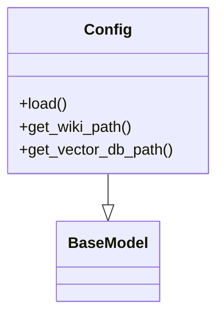
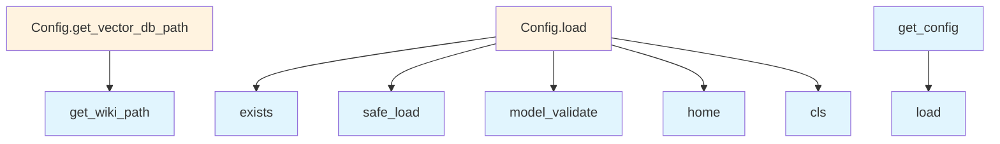

# File Overview

This file defines configuration classes and functions for the local_deepwiki application. It provides structured configuration management using Pydantic models for embedding, LLM, parsing, and output settings. The configuration system supports loading from YAML files and provides utilities for accessing and setting configuration values.

# Classes

## LocalEmbeddingConfig

Configuration class for local embedding models. This class defines settings for embedding models that run locally.

## OpenAIEmbeddingConfig

Configuration class for OpenAI embedding models. This class defines settings for OpenAI embedding models.

## EmbeddingConfig

Base configuration class for embedding settings. This class serves as a parent class for different embedding model configurations.

## OllamaConfig

Configuration class for Ollama settings. This class defines settings for the Ollama inference engine.

## AnthropicConfig

Configuration class for Anthropic settings. This class defines settings for Anthropic models.

## OpenAILLMConfig

Configuration class for OpenAI LLM settings. This class defines settings for OpenAI large language models.

## LLMConfig

Base configuration class for LLM settings. This class serves as a parent class for different LLM configurations.

## ParsingConfig

Configuration class for parsing settings. This class defines settings for document parsing.

## ChunkingConfig

Configuration class for chunking settings. This class defines settings for text chunking operations.

## OutputConfig

Configuration class for output settings. This class defines settings for output formatting and storage.

## Config

Main configuration class that aggregates all other configuration components. This class combines all configuration settings into a single structured object.

# Functions

## get_config

```python
def get_config() -> Config:
```

Retrieves the current configuration instance.

**Returns:**
- Config: The current configuration instance

## set_config

```python
def set_config(config: Config) -> None:
```

Sets the global configuration instance.

**Parameters:**
- config (Config): The configuration instance to set as global

**Returns:**
- None

# Usage Examples

## Loading Configuration from YAML

```python
# Load configuration from a YAML file
config_path = "config.yaml"
with open(config_path, 'r') as f:
    config_dict = yaml.safe_load(f)
    
# Create a Config instance
config = Config(**config_dict)

# Set the global configuration
set_config(config)

# Retrieve the global configuration
current_config = get_config()
```

## Creating Configuration Instances

```python
# Create individual configuration components
embedding_config = EmbeddingConfig(
    # ... embedding settings
)

llm_config = LLMConfig(
    # ... LLM settings
)

# Combine into main configuration
config = Config(
    embedding=embedding_config,
    llm=llm_config
    # ... other components
)
```

# Related Components

This file imports and depends on:
- `yaml` for YAML parsing
- `pydantic` for configuration validation
- `pathlib.Path` for path handling
- `typing` for type hints

The configuration system is designed to work with Pydantic models for validation and structured data handling. The classes are intended to be used together as part of a larger configuration management system, with `Config` serving as the [main](export/html.md) entry point that aggregates all other configuration components.

## API Reference

### class `LocalEmbeddingConfig`

**Inherits from:** `BaseModel`

Configuration for local embedding model.

### class `OpenAIEmbeddingConfig`

**Inherits from:** `BaseModel`

Configuration for OpenAI embedding model.

### class `EmbeddingConfig`

**Inherits from:** `BaseModel`

Embedding provider configuration.

### class `OllamaConfig`

**Inherits from:** `BaseModel`

Configuration for Ollama LLM.

### class `AnthropicConfig`

**Inherits from:** `BaseModel`

Configuration for Anthropic LLM.

### class `OpenAILLMConfig`

**Inherits from:** `BaseModel`

Configuration for OpenAI LLM.

### class `LLMConfig`

**Inherits from:** `BaseModel`

LLM provider configuration.

### class `ParsingConfig`

**Inherits from:** `BaseModel`

Code parsing configuration.

### class `ChunkingConfig`

**Inherits from:** `BaseModel`

Chunking configuration.

### class `OutputConfig`

**Inherits from:** `BaseModel`

Output configuration.

### class `Config`

**Inherits from:** `BaseModel`

Main configuration.

**Methods:**

#### `load`

```python
def load(config_path: Path | None = None) -> "Config"
```

Load configuration from file or defaults.


| [Parameter](generators/api_docs.md) | Type | Default | Description |
|-----------|------|---------|-------------|
| `config_path` | `Path | None` | `None` | - |

#### `get_wiki_path`

```python
def get_wiki_path(repo_path: Path) -> Path
```

Get the wiki output path for a repository.


| [Parameter](generators/api_docs.md) | Type | Default | Description |
|-----------|------|---------|-------------|
| `repo_path` | `Path` | - | - |

#### `get_vector_db_path`

```python
def get_vector_db_path(repo_path: Path) -> Path
```

Get the vector database path for a repository.


| [Parameter](generators/api_docs.md) | Type | Default | Description |
|-----------|------|---------|-------------|
| `repo_path` | `Path` | - | - |


---

### Functions

#### `get_config`

```python
def get_config() -> Config
```

Get the global configuration instance.

**Returns:** `Config`


#### `set_config`

```python
def set_config(config: Config) -> None
```

Set the global configuration instance.


| [Parameter](generators/api_docs.md) | Type | Default | Description |
|-----------|------|---------|-------------|
| `config` | `Config` | - | - |

**Returns:** `None`


## Class Diagram



## Call Graph



## Relevant Source Files

- `src/local_deepwiki/config.py:11-14`

## See Also

- [wiki](generators/wiki.md) - uses this
- [chunker](core/chunker.md) - uses this
- [server](server.md) - uses this
- [diagrams](generators/diagrams.md) - shares 2 dependencies
