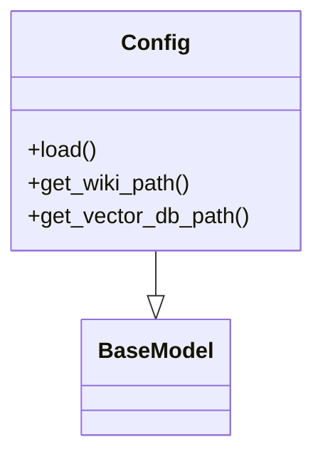
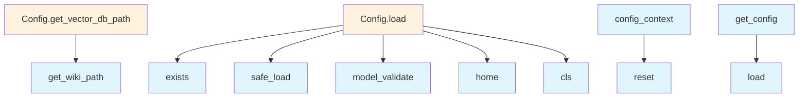

# File Overview

This file defines configuration classes and utilities for the local_deepwiki application. It provides a structured way to manage various configuration settings related to embeddings, language models, parsing, chunking, and output handling. The configuration system supports both static and contextual configuration management using Python's contextvars and threading capabilities.

# Classes

## LocalEmbeddingConfig

Configuration class for local embedding models. This class inherits from BaseModel and is used to define settings specific to local embedding models.

## OpenAIEmbeddingConfig

Configuration class for OpenAI embedding models. This class inherits from BaseModel and is used to define settings specific to OpenAI embedding models.

## EmbeddingConfig

Base configuration class for embedding settings. This class inherits from BaseModel and serves as a parent class for different embedding model configurations.

## OllamaConfig

Configuration class for Ollama models. This class inherits from BaseModel and is used to define settings specific to Ollama models.

## AnthropicConfig

Configuration class for Anthropic models. This class inherits from BaseModel and is used to define settings specific to Anthropic models.

## OpenAILLMConfig

Configuration class for OpenAI language models. This class inherits from BaseModel and is used to define settings specific to OpenAI language models.

## LLMConfig

Base configuration class for language model settings. This class inherits from BaseModel and serves as a parent class for different language model configurations.

## ParsingConfig

Configuration class for parsing settings. This class inherits from BaseModel and is used to define settings related to document parsing.

## ChunkingConfig

Configuration class for chunking settings. This class inherits from BaseModel and is used to define settings related to document chunking.

## WikiConfig

Configuration class for wiki-related settings. This class inherits from BaseModel and is used to define settings related to wiki generation.

## OutputConfig

Configuration class for output settings. This class inherits from BaseModel and is used to define settings related to output handling.

## Config

Main configuration class that aggregates all other configuration settings. This class inherits from BaseModel and combines all the other configuration classes into a single configuration object.

# Functions

## get_config

Retrieves the current configuration. This function returns the current configuration object stored in a context variable.

**Parameters**: None

**Returns**: The current configuration object

## set_config

Sets the current configuration. This function stores a new configuration object in a context variable.

**Parameters**:
- config (Config): The configuration object to set

**Returns**: None

## reset_config

Resets the configuration to its default state. This function clears the current configuration from the context variable.

**Parameters**: None

**Returns**: None

## config_context

Context manager for managing configuration within a specific scope. This function provides a way to temporarily change the configuration within a code block.

**Parameters**:
- config (Config): The configuration object to use within the context

**Returns**: A generator that yields the context

# Usage Examples

## Getting the current configuration

```python
from local_deepwiki.config import get_config

config = get_config()
print(config)
```

## Setting a new configuration

```python
from local_deepwiki.config import set_config
from local_deepwiki.config import Config

# Create a new configuration
new_config = Config(...)
set_config(new_config)
```

## Using config_context

```python
from local_deepwiki.config import config_context, get_config
from local_deepwiki.config import Config

# Create a temporary configuration
temp_config = Config(...)

with config_context(temp_config):
    # Use the temporary configuration
    config = get_config()
    # Do something with config
```

## Resetting configuration

```python
from local_deepwiki.config import reset_config

reset_config()
```

# Related Components

This file works with the following components:

- **pydantic**: Used for data validation and settings management through BaseModel
- **yaml**: Used for configuration file parsing
- **threading**: Used for thread-safe configuration management
- **contextvars**: Used for context-aware configuration management
- **pathlib**: Used for path handling in configuration files
- **contextlib**: Used for context manager implementation

The configuration classes are designed to work together as part of a larger system for managing local deep wiki generation settings. They provide a structured way to define and manage various aspects of the wiki generation process including embedding models, language models, parsing, chunking, and output settings.

## API Reference

### class `LocalEmbeddingConfig`

**Inherits from:** `BaseModel`

Configuration for local embedding model.

### class `OpenAIEmbeddingConfig`

**Inherits from:** `BaseModel`

Configuration for OpenAI embedding model.

### class `EmbeddingConfig`

**Inherits from:** `BaseModel`

Embedding provider configuration.

### class `OllamaConfig`

**Inherits from:** `BaseModel`

Configuration for Ollama LLM.

### class `AnthropicConfig`

**Inherits from:** `BaseModel`

Configuration for Anthropic LLM.

### class `OpenAILLMConfig`

**Inherits from:** `BaseModel`

Configuration for OpenAI LLM.

### class `LLMConfig`

**Inherits from:** `BaseModel`

LLM provider configuration.

### class `ParsingConfig`

**Inherits from:** `BaseModel`

Code parsing configuration.

### class `ChunkingConfig`

**Inherits from:** `BaseModel`

Chunking configuration.

### class `WikiConfig`

**Inherits from:** `BaseModel`

Wiki generation configuration.

### class `OutputConfig`

**Inherits from:** `BaseModel`

Output configuration.

### class `Config`

**Inherits from:** `BaseModel`

Main configuration.

**Methods:**

#### `load`

```python
def load(config_path: Path | None = None) -> "Config"
```

Load configuration from file or defaults.


| [Parameter](generators/api_docs.md) | Type | Default | Description |
|-----------|------|---------|-------------|
| `config_path` | `Path | None` | `None` | - |

#### `get_wiki_path`

```python
def get_wiki_path(repo_path: Path) -> Path
```

Get the wiki output path for a repository.


| [Parameter](generators/api_docs.md) | Type | Default | Description |
|-----------|------|---------|-------------|
| `repo_path` | `Path` | - | - |

#### `get_vector_db_path`

```python
def get_vector_db_path(repo_path: Path) -> Path
```

Get the vector database path for a repository.


| [Parameter](generators/api_docs.md) | Type | Default | Description |
|-----------|------|---------|-------------|
| `repo_path` | `Path` | - | - |


---

### Functions

#### `get_config`

```python
def get_config() -> Config
```

Get the configuration instance.  Returns the context-local config if set, otherwise the global config. Thread-safe for concurrent access.

**Returns:** `Config`


#### `set_config`

```python
def set_config(config: Config) -> None
```

Set the global configuration instance.  Thread-safe. Note: This sets the global config, not a context-local one. Use config_context() for temporary context-local overrides.


| [Parameter](generators/api_docs.md) | Type | Default | Description |
|-----------|------|---------|-------------|
| `config` | `Config` | - | The configuration to set globally. |

**Returns:** `None`


#### `reset_config`

```python
def reset_config() -> None
```

Reset the global configuration to uninitialized state.  Useful for testing to ensure a fresh config is loaded. Also clears any context-local override.

**Returns:** `None`


#### `config_context`

`@contextmanager`

```python
def config_context(config: Config) -> Generator[Config, None, None]
```

Context manager for temporary config override.  Sets a context-local configuration that takes precedence over the global config within the context. Useful for testing or per-request config.


| [Parameter](generators/api_docs.md) | Type | Default | Description |
|-----------|------|---------|-------------|
| `config` | `Config` | - | The configuration to use within the context. |

**Returns:** `Generator[Config, None, None]`


## Class Diagram



## Call Graph



## Relevant Source Files

- `src/local_deepwiki/config.py:13-18`

## See Also

- [test_indexer](../../tests/test_indexer.md) - uses this
- [server](server.md) - uses this
- [diagrams](generators/diagrams.md) - shares 2 dependencies
