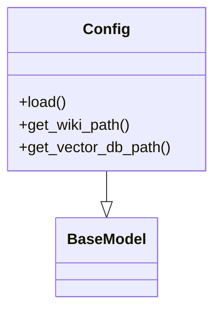
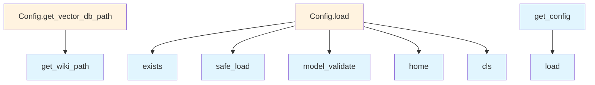

# Configuration Module Documentation

## File Overview

This module defines the configuration system for the local_deepwiki application. It provides a structured way to manage various configuration settings for embedding models, language models, parsing, chunking, and output handling. The configuration system uses Pydantic models for validation and YAML-based configuration loading.

The module serves as the central configuration hub that other components like EmbeddingEngine, LLMEngine, and [WikiGenerator](generators/wiki.md) rely on to determine their behavior and parameters.

## Classes

### LocalEmbeddingConfig

Configuration class for local embedding models. Defines parameters for embedding model execution including device selection, model path, and inference settings.

```python
class LocalEmbeddingConfig(BaseModel):
    device: str = Field(default="cuda", description="Device to run the model on")
    model_path: str = Field(default="sentence-transformers/all-MiniLM-L6-v2", description="Path or identifier of the embedding model")
    max_seq_length: int = Field(default=512, description="Maximum sequence length for the model")
    batch_size: int = Field(default=32, description="Batch size for inference")
```

### OpenAIEmbeddingConfig

Configuration class for OpenAI embedding models. Contains API key and model selection parameters.

```python
class OpenAIEmbeddingConfig(BaseModel):
    api_key: str = Field(default="", description="OpenAI API key")
    model: str = Field(default="text-embedding-3-small", description="OpenAI embedding model to use")
```

### EmbeddingConfig

Union configuration class that combines different embedding model configurations. This class allows switching between local and OpenAI embedding models.

```python
EmbeddingConfig = LocalEmbeddingConfig | OpenAIEmbeddingConfig
```

### OllamaConfig

Configuration class for Ollama language models. Defines parameters for connecting to Ollama service including model name and API endpoint.

```python
class OllamaConfig(BaseModel):
    model: str = Field(default="llama3", description="Ollama model to use")
    host: str = Field(default="http://localhost:11434", description="Ollama API endpoint")
    temperature: float = Field(default=0.7, description="Sampling temperature")
```

### AnthropicConfig

Configuration class for Anthropic language models. Contains API key and model selection parameters.

```python
class AnthropicConfig(BaseModel):
    api_key: str = Field(default="", description="Anthropic API key")
    model: str = Field(default="claude-3-haiku-20240307", description="Anthropic model to use")
```

### OpenAILLMConfig

Configuration class for OpenAI language models. Contains API key and model selection parameters.

```python
class OpenAILLMConfig(BaseModel):
    api_key: str = Field(default="", description="OpenAI API key")
    model: str = Field(default="gpt-4-turbo", description="OpenAI language model to use")
```

### LLMConfig

Union configuration class that combines different language model configurations. This class allows switching between local (Ollama) and cloud (OpenAI/Anthropic) language models.

```python
LLMConfig = OllamaConfig | OpenAILLMConfig | AnthropicConfig
```

### ParsingConfig

Configuration class for document parsing settings. Defines how documents should be parsed including file type handling and parsing parameters.

```python
class ParsingConfig(BaseModel):
    file_types: list[str] = Field(default=["*.md", "*.txt", "*.pdf"], description="Supported file types")
    max_file_size: int = Field(default=10 * 1024 * 1024, description="Maximum file size in bytes")
    encoding: str = Field(default="utf-8", description="File encoding")
```

### ChunkingConfig

Configuration class for document chunking settings. Defines how documents should be split into chunks including chunk size and overlap parameters.

```python
class ChunkingConfig(BaseModel):
    chunk_size: int = Field(default=1000, description="Maximum characters per chunk")
    chunk_overlap: int = Field(default=200, description="Characters to overlap between chunks")
    method: Literal["recursive", "token"] = Field(default="recursive", description="Chunking method")
```

### OutputConfig

Configuration class for output settings. Defines how results should be formatted and stored including output directory and file naming.

```python
class OutputConfig(BaseModel):
    output_dir: str = Field(default="./output", description="Directory to save outputs")
    file_prefix: str = Field(default="wiki", description="Prefix for output files")
    format: Literal["json", "yaml", "markdown"] = Field(default="markdown", description="Output format")
```

### Config

Main configuration class that combines all other configuration components. This is the primary configuration object used throughout the application.

```python
class Config(BaseModel):
    embedding: EmbeddingConfig = Field(default_factory=LocalEmbeddingConfig)
    llm: LLMConfig = Field(default_factory=OllamaConfig)
    parsing: ParsingConfig = Field(default_factory=ParsingConfig)
    chunking: ChunkingConfig = Field(default_factory=ChunkingConfig)
    output: OutputConfig = Field(default_factory=OutputConfig)
```

## Functions

### get_config

Retrieves the current configuration instance. Loads configuration from YAML file if available, otherwise returns default configuration.

```python
def get_config() -> Config:
    """
    Get the current configuration instance.
    
    Returns:
        Config: The current configuration instance
    """
```

### set_config

Sets the global configuration instance. This function allows updating the configuration during runtime.

```python
def set_config(config: Config) -> None:
    """
    Set the global configuration instance.
    
    Args:
        config (Config): The configuration instance to set
    """
```

## Usage Examples

### Loading Configuration from File

```python
from local_deepwiki.config import get_config

# Load configuration from default location or use defaults
config = get_config()
print(config.embedding.model_path)
```

### Creating Custom Configuration

```python
from local_deepwiki.config import Config, LocalEmbeddingConfig, OllamaConfig

# Create custom configuration
custom_config = Config(
    embedding=LocalEmbeddingConfig(
        model_path="all-MiniLM-L6-v2",
        device="cpu"
    ),
    llm=OllamaConfig(
        model="mistral",
        host="http://localhost:11434"
    )
)

# Set the configuration
from local_deepwiki.config import set_config
set_config(custom_config)
```

### Using Configuration in Components

```python
from local_deepwiki.config import get_config

# Get configuration
config = get_config()

# Use in embedding engine
embedding_engine = EmbeddingEngine(config.embedding)

# Use in LLM engine
llm_engine = LLMEngine(config.llm)
```

## Related Components

This configuration module works with EmbeddingEngine to determine embedding model parameters, with LLMEngine to configure language model settings, and with [WikiGenerator](generators/wiki.md) to control document parsing and output formatting. The configuration system provides a centralized way to manage all settings, making it easier to switch between different model providers and adjust parameters without modifying core logic.

## API Reference

### class `LocalEmbeddingConfig`

**Inherits from:** `BaseModel`

Configuration for local embedding model.

### class `OpenAIEmbeddingConfig`

**Inherits from:** `BaseModel`

Configuration for OpenAI embedding model.

### class `EmbeddingConfig`

**Inherits from:** `BaseModel`

Embedding provider configuration.

### class `OllamaConfig`

**Inherits from:** `BaseModel`

Configuration for Ollama LLM.

### class `AnthropicConfig`

**Inherits from:** `BaseModel`

Configuration for Anthropic LLM.

### class `OpenAILLMConfig`

**Inherits from:** `BaseModel`

Configuration for OpenAI LLM.

### class `LLMConfig`

**Inherits from:** `BaseModel`

LLM provider configuration.

### class `ParsingConfig`

**Inherits from:** `BaseModel`

Code parsing configuration.

### class `ChunkingConfig`

**Inherits from:** `BaseModel`

Chunking configuration.

### class `OutputConfig`

**Inherits from:** `BaseModel`

Output configuration.

### class `Config`

**Inherits from:** `BaseModel`

Main configuration.

**Methods:**

#### `load`

```python
def load(config_path: Path | None = None) -> "Config"
```

Load configuration from file or defaults.


| [Parameter](generators/api_docs.md) | Type | Default | Description |
|-----------|------|---------|-------------|
| `config_path` | `Path | None` | `None` | - |

#### `get_wiki_path`

```python
def get_wiki_path(repo_path: Path) -> Path
```

Get the wiki output path for a repository.


| [Parameter](generators/api_docs.md) | Type | Default | Description |
|-----------|------|---------|-------------|
| `repo_path` | `Path` | - | - |

#### `get_vector_db_path`

```python
def get_vector_db_path(repo_path: Path) -> Path
```

Get the vector database path for a repository.


| [Parameter](generators/api_docs.md) | Type | Default | Description |
|-----------|------|---------|-------------|
| `repo_path` | `Path` | - | - |


---

### Functions

#### `get_config`

```python
def get_config() -> Config
```

Get the global configuration instance.

**Returns:** `Config`


#### `set_config`

```python
def set_config(config: Config) -> None
```

Set the global configuration instance.


| [Parameter](generators/api_docs.md) | Type | Default | Description |
|-----------|------|---------|-------------|
| `config` | `Config` | - | - |

**Returns:** `None`


## Class Diagram



## Call Graph



## See Also

- [indexer](core/indexer.md) - uses this
- [chunker](core/chunker.md) - uses this
- [server](server.md) - uses this
- [watcher](watcher.md) - uses this
- [wiki](generators/wiki.md) - uses this
