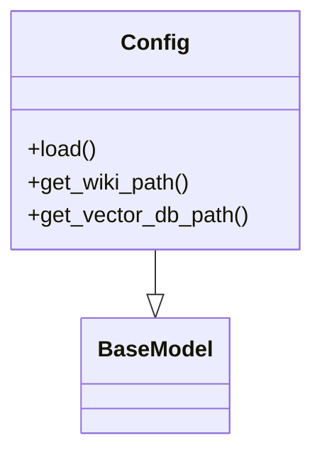

# Configuration Module Documentation

## File Overview

This module defines configuration classes and utilities for the local_deepwiki application. It provides structured configuration management for embedding models, language models, parsing, chunking, and output settings using Pydantic for validation and YAML for configuration loading.

## Classes

### `LocalEmbeddingConfig`

Configuration for local embedding models.

```python
class LocalEmbeddingConfig(BaseModel):
    """Local embedding configuration."""

    model_name: str = Field(default="sentence-transformers/all-MiniLM-L6-v2", description="Local embedding model name")
    model_path: str = Field(default=None, description="Local embedding model path")
    use_gpu: bool = Field(default=True, description="Whether to use GPU for embeddings")
```

### `OpenAIEmbeddingConfig`

Configuration for OpenAI embedding models.

```python
class OpenAIEmbeddingConfig(BaseModel):
    """OpenAI embedding configuration."""

    api_key: str = Field(default=None, description="OpenAI API key")
    model_name: str = Field(default="text-embedding-3-small", description="OpenAI embedding model name")
    organization: str = Field(default=None, description="OpenAI organization ID")
```

### `EmbeddingConfig`

Unified configuration for embedding models, supporting both local and OpenAI models.

```python
class EmbeddingConfig(BaseModel):
    """Embedding configuration."""

    type: Literal["local", "openai"] = Field(default="local", description="Embedding model type")
    local: LocalEmbeddingConfig = Field(default_factory=LocalEmbeddingConfig)
    openai: OpenAIEmbeddingConfig = Field(default_factory=OpenAIEmbeddingConfig)
```

### `OllamaConfig`

Configuration for Ollama language models.

```python
class OllamaConfig(BaseModel):
    """Ollama configuration."""

    base_url: str = Field(default="http://localhost:11434", description="Ollama base URL")
    model_name: str = Field(default="llama3", description="Ollama model name")
```

### `AnthropicConfig`

Configuration for Anthropic language models.

```python
class AnthropicConfig(BaseModel):
    """Anthropic configuration."""

    api_key: str = Field(default=None, description="Anthropic API key")
    model_name: str = Field(default="claude-3-haiku-20240307", description="Anthropic model name")
    temperature: float = Field(default=0.7, description="Sampling temperature")
```

### `OpenAILLMConfig`

Configuration for OpenAI language models.

```python
class OpenAILLMConfig(BaseModel):
    """OpenAI language model configuration."""

    api_key: str = Field(default=None, description="OpenAI API key")
    model_name: str = Field(default="gpt-4-turbo", description="OpenAI model name")
    organization: str = Field(default=None, description="OpenAI organization ID")
    temperature: float = Field(default=0.7, description="Sampling temperature")
```

### `LLMConfig`

Unified configuration for language models, supporting local (Ollama), Anthropic, and OpenAI models.

```python
class LLMConfig(BaseModel):
    """Language model configuration."""

    type: Literal["ollama", "anthropic", "openai"] = Field(default="ollama", description="Language model type")
    ollama: OllamaConfig = Field(default_factory=OllamaConfig)
    anthropic: AnthropicConfig = Field(default_factory=AnthropicConfig)
    openai: OpenAILLMConfig = Field(default_factory=OpenAILLMConfig)
```

### `ParsingConfig`

Configuration for document parsing settings.

```python
class ParsingConfig(BaseModel):
    """Document parsing configuration."""

    max_workers: int = Field(default=4, description="Number of worker threads for parsing")
    chunk_size: int = Field(default=1000, description="Maximum chunk size in characters")
    chunk_overlap: int = Field(default=200, description="Overlap between chunks in characters")
```

### `ChunkingConfig`

Configuration for chunking strategies.

```python
class ChunkingConfig(BaseModel):
    """Chunking configuration."""

    method: Literal["recursive", "token"] = Field(default="recursive", description="Chunking method")
    chunk_size: int = Field(default=1000, description="Chunk size in tokens or characters")
    chunk_overlap: int = Field(default=200, description="Overlap between chunks")
```

### `OutputConfig`

Configuration for output settings.

```python
class OutputConfig(BaseModel):
    """Output configuration."""

    wiki_dir: str = Field(default=".deepwiki", description="Wiki output directory name")
    vector_db_name: str = Field(default="vectors.lance", description="Vector DB filename")
```

### `Config`

Main configuration class that aggregates all configuration components.

```python
class Config(BaseModel):
    """Main configuration class."""

    embedding: EmbeddingConfig = Field(default_factory=EmbeddingConfig)
    llm: LLMConfig = Field(default_factory=LLMConfig)
    parsing: ParsingConfig = Field(default_factory=ParsingConfig)
    chunking: ChunkingConfig = Field(default_factory=ChunkingConfig)
    output: OutputConfig = Field(default_factory=OutputConfig)
```

## Functions

### `get_config`

Loads configuration from a YAML file or returns default configuration.

```python
def get_config(config_path: str | None = None) -> Config:
    """
    Load configuration from YAML file or return default config.
    
    Args:
        config_path: Path to YAML configuration file. If None, uses default config.
        
    Returns:
        Config: Loaded or default configuration object.
    """
```

### `set_config`

Sets the global configuration instance.

```python
def set_config(config: Config) -> None:
    """
    Set the global configuration instance.
    
    Args:
        config: Configuration object to set as global.
    """
```

## Usage Examples

### Loading Configuration from File

```python
from local_deepwiki.config import get_config

# Load configuration from a YAML file
config = get_config("config.yaml")
print(config.embedding.type)  # "local"
print(config.llm.type)        # "ollama"
```

### Using Default Configuration

```python
from local_deepwiki.config import get_config

# Use default configuration
config = get_config()
print(config.embedding.local.model_name)  # "sentence-transformers/all-MiniLM-L6-v2"
print(config.output.wiki_dir)             # ".deepwiki"
```

### Creating Custom Configuration

```python
from local_deepwiki.config import Config, EmbeddingConfig, LocalEmbeddingConfig, OutputConfig

# Create custom configuration
custom_config = Config(
    embedding=EmbeddingConfig(
        type="local",
        local=LocalEmbeddingConfig(
            model_name="all-MiniLM-L6-v2",
            use_gpu=False
        )
    ),
    output=OutputConfig(
        wiki_dir="my_wiki",
        vector_db_name="my_vectors.lance"
    )
)
```

### Setting Global Configuration

```python
from local_deepwiki.config import set_config, get_config

# Set custom configuration as global
custom_config = get_config()  # or create custom config
set_config(custom_config)

# Later, retrieve the global config
config = get_config()
```

## Dependencies

This module depends on:
- `os` - Standard library for operating system interfaces
- `pathlib.Path` - Standard library for path manipulation
- `typing.Any` - Standard library for type annotations
- `typing.Literal` - Standard library for literal type hints
- `yaml` - PyYAML library for YAML parsing
- `pydantic.BaseModel` - Pydantic for data validation and settings management
- `pydantic.Field` - Pydantic field configuration

The module provides a comprehensive configuration system that supports different embedding and language model types while maintaining type safety through Pydantic validation.

## Class Diagram



## See Also

- [indexer](core/indexer.md) - uses this
- [server](server.md) - uses this
- [chunker](core/chunker.md) - uses this
- [test_config](../../tests/test_config.md) - uses this
- [wiki](generators/wiki.md) - uses this
