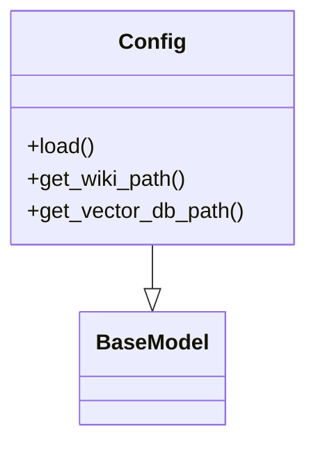
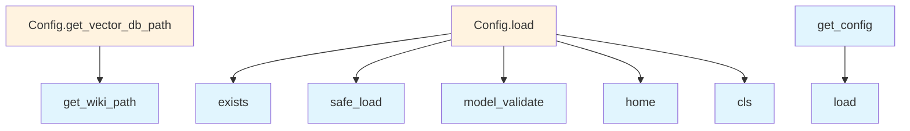

# File Overview

This file defines configuration classes and functions for the local_deepwiki project. It provides structured configuration management using Pydantic models for embedding, LLM, parsing, and output settings. The configuration system supports loading from YAML files and provides utilities for managing global configuration state.

# Classes

## LocalEmbeddingConfig

Configuration class for local embedding models. This class defines settings for embedding models that run locally.

## OpenAIEmbeddingConfig

Configuration class for OpenAI embedding models. This class defines settings for using OpenAI's embedding API.

## EmbeddingConfig

Base configuration class for embedding settings. This class serves as a parent class for different embedding model configurations.

## OllamaConfig

Configuration class for Ollama models. This class defines settings for models served through the Ollama API.

## AnthropicConfig

Configuration class for Anthropic models. This class defines settings for using Anthropic's language models.

## OpenAILLMConfig

Configuration class for OpenAI language models. This class defines settings for using OpenAI's language models.

## LLMConfig

Base configuration class for language model settings. This class serves as a parent class for different LLM configurations.

## ParsingConfig

Configuration class for parsing settings. This class defines how documents should be parsed.

## ChunkingConfig

Configuration class for chunking settings. This class defines how documents should be chunked for processing.

## OutputConfig

Configuration class for output settings. This class defines how results should be formatted and stored.

## Config

Main configuration class that aggregates all other configuration classes. This class serves as the root configuration object for the application.

# Functions

## get_config

Returns the global configuration instance.

**Parameters:** None

**Return Value:** Config - The global configuration instance

## set_config

Sets the global configuration instance.

**Parameters:**
- config (Config) - The configuration instance to set as global

**Return Value:** None

# Usage Examples

## Loading Configuration from YAML

```python
# Load configuration from a YAML file
config = Config.from_yaml("config.yaml")
```

## Getting and Setting Global Configuration

```python
# Get the current global configuration
current_config = get_config()

# Set a new global configuration
new_config = Config(...)
set_config(new_config)
```

## Using Configuration Classes

```python
# Create a local embedding configuration
local_config = LocalEmbeddingConfig(
    model_name="all-MiniLM-L6-v2"
)

# Create an OpenAI embedding configuration
openai_config = OpenAIEmbeddingConfig(
    api_key="your-api-key",
    model_name="text-embedding-3-small"
)
```

# Related Components

This file works with the following components based on imports:

- **yaml**: Used for loading configuration from YAML files
- **pydantic.BaseModel**: Used as the base class for all configuration models
- **pathlib.Path**: Used for file path operations
- **typing**: Used for type hints including Literal type
- **os**: Used for environment variable access and system operations

The configuration classes are designed to work together as part of a larger configuration management system, with the Config class serving as the central hub that aggregates all other configuration components.

## API Reference

### class `LocalEmbeddingConfig`

**Inherits from:** `BaseModel`

Configuration for local embedding model.

### class `OpenAIEmbeddingConfig`

**Inherits from:** `BaseModel`

Configuration for OpenAI embedding model.

### class `EmbeddingConfig`

**Inherits from:** `BaseModel`

Embedding provider configuration.

### class `OllamaConfig`

**Inherits from:** `BaseModel`

Configuration for Ollama LLM.

### class `AnthropicConfig`

**Inherits from:** `BaseModel`

Configuration for Anthropic LLM.

### class `OpenAILLMConfig`

**Inherits from:** `BaseModel`

Configuration for OpenAI LLM.

### class `LLMConfig`

**Inherits from:** `BaseModel`

LLM provider configuration.

### class `ParsingConfig`

**Inherits from:** `BaseModel`

Code parsing configuration.

### class `ChunkingConfig`

**Inherits from:** `BaseModel`

Chunking configuration.

### class `OutputConfig`

**Inherits from:** `BaseModel`

Output configuration.

### class `Config`

**Inherits from:** `BaseModel`

Main configuration.

**Methods:**

#### `load`

```python
def load(config_path: Path | None = None) -> "Config"
```

Load configuration from file or defaults.


| [Parameter](generators/api_docs.md) | Type | Default | Description |
|-----------|------|---------|-------------|
| `config_path` | `Path | None` | `None` | - |

#### `get_wiki_path`

```python
def get_wiki_path(repo_path: Path) -> Path
```

Get the wiki output path for a repository.


| [Parameter](generators/api_docs.md) | Type | Default | Description |
|-----------|------|---------|-------------|
| `repo_path` | `Path` | - | - |

#### `get_vector_db_path`

```python
def get_vector_db_path(repo_path: Path) -> Path
```

Get the vector database path for a repository.


| [Parameter](generators/api_docs.md) | Type | Default | Description |
|-----------|------|---------|-------------|
| `repo_path` | `Path` | - | - |


---

### Functions

#### `get_config`

```python
def get_config() -> Config
```

Get the global configuration instance.

**Returns:** `Config`


#### `set_config`

```python
def set_config(config: Config) -> None
```

Set the global configuration instance.


| [Parameter](generators/api_docs.md) | Type | Default | Description |
|-----------|------|---------|-------------|
| `config` | `Config` | - | - |

**Returns:** `None`


## Class Diagram



## Call Graph



## Relevant Source Files

- `src/local_deepwiki/config.py:11-14`

## See Also

- [wiki](generators/wiki.md) - uses this
- [chunker](core/chunker.md) - uses this
- [server](server.md) - uses this
- [diagrams](generators/diagrams.md) - shares 2 dependencies
