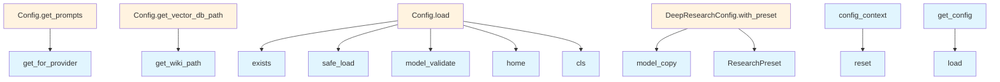

# Config Module Documentation

## File Overview

The config module provides a centralized configuration management system for the local_deepwiki application. It defines configuration models using Pydantic for validation and type safety, implements a thread-safe singleton pattern for global configuration access, and supports context-local configuration overrides for testing and per-request customization.

## Classes

### Config

The [main](export/pdf.md) configuration class that aggregates all configuration sections for the application.

**Fields:**
- `embedding`: EmbeddingConfig instance for embedding provider settings
- `llm`: LLMConfig instance for language model provider settings  
- `llm_cache`: LLMCacheConfig instance for LLM caching configuration
- `parsing`: ParsingConfig instance for document parsing settings
- `chunking`: ChunkingConfig instance for text chunking parameters
- `wiki`: WikiConfig instance for wiki generation settings
- `deep_research`: DeepResearchConfig instance for research functionality
- `output`: OutputConfig instance for output formatting options
- `prompts`: Configuration for system prompts

### LLMConfig

Configuration for language model providers and their settings.

**Fields:**
- `provider`: The LLM provider to use ("ollama", "anthropic", or "openai")
- `ollama`: OllamaConfig instance for Ollama-specific settings
- `anthropic`: AnthropicConfig instance for Anthropic-specific settings  
- `openai`: OpenAILLMConfig instance for OpenAI-specific settings

### OllamaConfig

Configuration specific to the Ollama LLM provider.

**Fields:**
- `model`: The Ollama model name (default: "qwen3-coder:30b")
- `base_url`: The Ollama API URL (default: "http://localhost:11434")

### AnthropicConfig

Configuration specific to the Anthropic LLM provider.

**Fields:**
- `model`: The Anthropic model name (default: "claude-sonnet-4-20250514")

### OpenAILLMConfig

Configuration specific to the OpenAI LLM provider.

**Fields:**
- `model`: The OpenAI model name (default: "gpt-4o")

### ProviderPromptsConfig

Configuration for system prompts used by a specific provider.

**Fields:**
- `wiki_system`: System prompt for wiki documentation generation
- `research_decomposition`: System prompt for question decomposition
- `research_gap_analysis`: System prompt for gap analysis
- `research_synthesis`: System prompt for answer synthesis

## Functions

### get_config

Returns the active configuration instance in a thread-safe manner.

**Returns:** The Config instance (context-local if set, otherwise global)

Checks for context-local configuration overrides first, then falls back to the global singleton configuration. Automatically loads the configuration if not already initialized.

### set_config

Sets the global configuration instance in a thread-safe manner.

**Parameters:**
- `config`: The Config instance to set globally

Note: This sets the global configuration, not a context-local override. Use config_context for temporary overrides.

### reset_config

Resets the global configuration to an uninitialized state.

Clears both the global configuration singleton and any context-local overrides. Useful for testing to ensure fresh configuration loading.

### config_context

Context manager for temporary configuration overrides.

**Parameters:**
- `config`: The Config instance to use within the context

**Yields:** The provided Config instance

Sets a context-local configuration that takes precedence over the global configuration within the context scope. Automatically restores the previous configuration when exiting the context.

## Usage Examples

### Basic Configuration Access

```python
# Get the current configuration
config = get_config()

# Access specific configuration sections
llm_provider = config.llm.provider
ollama_model = config.llm.ollama.model
```

### Setting Global Configuration

```python
# Create and set a new configuration
new_config = Config()
set_config(new_config)
```

### Temporary Configuration Override

```python
# Use a custom configuration temporarily
custom_config = Config()
with config_context(custom_config):
    # get_config() returns custom_config here
    current_config = get_config()
    # Use the custom configuration...
# get_config() returns the original global config again
```

### Testing Configuration Reset

```python
# Reset configuration for clean test state
reset_config()
# Next call to get_config() will load fresh configuration
```

## Related Components

The config module works with several other components:

- Uses `yaml` for configuration file loading
- Integrates with `pydantic` for model validation and type safety
- Utilizes `threading` and `contextvars` for thread-safe and context-aware configuration management
- References various configuration classes like EmbeddingConfig, ChunkingConfig, WikiConfig, and others that define specific configuration sections

## API Reference

### class `ResearchPreset`

**Inherits from:** `str`, `Enum`

Research mode presets for deep research pipeline.


<details>
<summary>View Source (lines 14-19) | <a href="https://github.com/UrbanDiver/local-deepwiki-mcp/blob/[main](export/pdf.md)/src/local_deepwiki/config.py#L14-L19">GitHub</a></summary>

```python
class ResearchPreset(str, Enum):
    """Research mode presets for deep research pipeline."""

    QUICK = "quick"
    DEFAULT = "default"
    THOROUGH = "thorough"
```

</details>

### class `LocalEmbeddingConfig`

**Inherits from:** `BaseModel`

Configuration for local embedding model.


<details>
<summary>View Source (lines 51-56) | <a href="https://github.com/UrbanDiver/local-deepwiki-mcp/blob/[main](export/pdf.md)/src/local_deepwiki/config.py#L51-L56">GitHub</a></summary>

```python
class LocalEmbeddingConfig(BaseModel):
    """Configuration for local embedding model."""

    model: str = Field(
        default="all-MiniLM-L6-v2", description="Model name for sentence-transformers"
    )
```

</details>

### class `OpenAIEmbeddingConfig`

**Inherits from:** `BaseModel`

Configuration for OpenAI embedding model.


<details>
<summary>View Source (lines 59-62) | <a href="https://github.com/UrbanDiver/local-deepwiki-mcp/blob/[main](export/pdf.md)/src/local_deepwiki/config.py#L59-L62">GitHub</a></summary>

```python
class OpenAIEmbeddingConfig(BaseModel):
    """Configuration for OpenAI embedding model."""

    model: str = Field(default="text-embedding-3-small", description="OpenAI embedding model")
```

</details>

### class `EmbeddingConfig`

**Inherits from:** `BaseModel`

Embedding provider configuration.


<details>
<summary>View Source (lines 65-70) | <a href="https://github.com/UrbanDiver/local-deepwiki-mcp/blob/[main](export/pdf.md)/src/local_deepwiki/config.py#L65-L70">GitHub</a></summary>

```python
class EmbeddingConfig(BaseModel):
    """Embedding provider configuration."""

    provider: Literal["local", "openai"] = Field(default="local", description="Embedding provider")
    local: LocalEmbeddingConfig = Field(default_factory=LocalEmbeddingConfig)
    openai: OpenAIEmbeddingConfig = Field(default_factory=OpenAIEmbeddingConfig)
```

</details>

### class `OllamaConfig`

**Inherits from:** `BaseModel`

Configuration for Ollama LLM.


<details>
<summary>View Source (lines 73-77) | <a href="https://github.com/UrbanDiver/local-deepwiki-mcp/blob/[main](export/pdf.md)/src/local_deepwiki/config.py#L73-L77">GitHub</a></summary>

```python
class OllamaConfig(BaseModel):
    """Configuration for Ollama LLM."""

    model: str = Field(default="qwen3-coder:30b", description="Ollama model name")
    base_url: str = Field(default="http://localhost:11434", description="Ollama API URL")
```

</details>

### class `AnthropicConfig`

**Inherits from:** `BaseModel`

Configuration for Anthropic LLM.


<details>
<summary>View Source (lines 80-83) | <a href="https://github.com/UrbanDiver/local-deepwiki-mcp/blob/[main](export/pdf.md)/src/local_deepwiki/config.py#L80-L83">GitHub</a></summary>

```python
class AnthropicConfig(BaseModel):
    """Configuration for Anthropic LLM."""

    model: str = Field(default="claude-sonnet-4-20250514", description="Anthropic model name")
```

</details>

### class `OpenAILLMConfig`

**Inherits from:** `BaseModel`

Configuration for OpenAI LLM.


<details>
<summary>View Source (lines 86-89) | <a href="https://github.com/UrbanDiver/local-deepwiki-mcp/blob/[main](export/pdf.md)/src/local_deepwiki/config.py#L86-L89">GitHub</a></summary>

```python
class OpenAILLMConfig(BaseModel):
    """Configuration for OpenAI LLM."""

    model: str = Field(default="gpt-4o", description="OpenAI model name")
```

</details>

### class `LLMConfig`

**Inherits from:** `BaseModel`

LLM provider configuration.


<details>
<summary>View Source (lines 92-100) | <a href="https://github.com/UrbanDiver/local-deepwiki-mcp/blob/[main](export/pdf.md)/src/local_deepwiki/config.py#L92-L100">GitHub</a></summary>

```python
class LLMConfig(BaseModel):
    """LLM provider configuration."""

    provider: Literal["ollama", "anthropic", "openai"] = Field(
        default="ollama", description="LLM provider"
    )
    ollama: OllamaConfig = Field(default_factory=OllamaConfig)
    anthropic: AnthropicConfig = Field(default_factory=AnthropicConfig)
    openai: OpenAILLMConfig = Field(default_factory=OpenAILLMConfig)
```

</details>

### class `ParsingConfig`

**Inherits from:** `BaseModel`

Code parsing configuration.


<details>
<summary>View Source (lines 103-141) | <a href="https://github.com/UrbanDiver/local-deepwiki-mcp/blob/[main](export/pdf.md)/src/local_deepwiki/config.py#L103-L141">GitHub</a></summary>

```python
class ParsingConfig(BaseModel):
    """Code parsing configuration."""

    languages: list[str] = Field(
        default=[
            "python",
            "typescript",
            "javascript",
            "go",
            "rust",
            "java",
            "c",
            "cpp",
            "swift",
            "ruby",
            "php",
            "kotlin",
            "csharp",
        ],
        description="Languages to parse",
    )
    max_file_size: int = Field(default=1048576, description="Max file size in bytes (1MB)")
    exclude_patterns: list[str] = Field(
        default=[
            "node_modules/**",
            "venv/**",
            ".venv/**",
            "__pycache__/**",
            ".git/**",
            "*.min.js",
            "*.min.css",
            "dist/**",
            "build/**",
            ".next/**",
            "target/**",
            "vendor/**",
        ],
        description="Glob patterns to exclude",
    )
```

</details>

### class `ChunkingConfig`

**Inherits from:** `BaseModel`

Chunking configuration.


<details>
<summary>View Source (lines 144-155) | <a href="https://github.com/UrbanDiver/local-deepwiki-mcp/blob/[main](export/pdf.md)/src/local_deepwiki/config.py#L144-L155">GitHub</a></summary>

```python
class ChunkingConfig(BaseModel):
    """Chunking configuration."""

    max_chunk_tokens: int = Field(default=512, description="Max tokens per chunk")
    overlap_tokens: int = Field(default=50, description="Overlap between chunks")
    batch_size: int = Field(
        default=500, description="Number of chunks to process in each batch for memory efficiency"
    )
    class_split_threshold: int = Field(
        default=100,
        description="Line count threshold above which classes are split into summary + method chunks",
    )
```

</details>

### class `WikiConfig`

**Inherits from:** `BaseModel`

Wiki generation configuration.


<details>
<summary>View Source (lines 158-193) | <a href="https://github.com/UrbanDiver/local-deepwiki-mcp/blob/[main](export/pdf.md)/src/local_deepwiki/config.py#L158-L193">GitHub</a></summary>

```python
class WikiConfig(BaseModel):
    """Wiki generation configuration."""

    max_file_docs: int = Field(
        default=75, description="Maximum number of file-level documentation pages to generate"
    )
    max_concurrent_llm_calls: int = Field(
        default=3,
        ge=1,
        le=10,
        description="Maximum concurrent LLM calls for file documentation generation. "
        "Higher values speed up generation but increase memory/API usage.",
    )
    use_cloud_for_github: bool = Field(
        default=False,
        description="Use cloud LLM provider (Anthropic Claude) for GitHub repos. "
        "Provides faster, higher-quality documentation but requires API key.",
    )
    github_llm_provider: Literal["anthropic", "openai"] = Field(
        default="anthropic",
        description="Cloud LLM provider to use for GitHub repos when use_cloud_for_github is enabled.",
    )
    chat_llm_provider: Literal["default", "anthropic", "openai", "ollama"] = Field(
        default="default",
        description="LLM provider for chat Q&A. 'default' uses the main llm.provider setting. "
        "Set to 'anthropic' or 'openai' for higher-quality chat responses.",
    )
    import_search_limit: int = Field(
        default=200, description="Maximum chunks to search for import/relationship analysis"
    )
    context_search_limit: int = Field(
        default=50, description="Maximum chunks to search for context when generating documentation"
    )
    fallback_search_limit: int = Field(
        default=30, description="Maximum chunks to search in fallback queries"
    )
```

</details>

### class `DeepResearchConfig`

**Inherits from:** `BaseModel`

Deep research pipeline configuration.

**Methods:**


<details>
<summary>View Source (lines 196-264) | <a href="https://github.com/UrbanDiver/local-deepwiki-mcp/blob/[main](export/pdf.md)/src/local_deepwiki/config.py#L196-L264">GitHub</a></summary>

```python
class DeepResearchConfig(BaseModel):
    """Deep research pipeline configuration."""

    max_sub_questions: int = Field(
        default=4,
        ge=1,
        le=10,
        description="Maximum sub-questions generated from query decomposition",
    )
    chunks_per_subquestion: int = Field(
        default=5,
        ge=1,
        le=20,
        description="Code chunks retrieved per sub-question",
    )
    max_total_chunks: int = Field(
        default=30,
        ge=10,
        le=100,
        description="Maximum total chunks used in synthesis",
    )
    max_follow_up_queries: int = Field(
        default=3,
        ge=0,
        le=10,
        description="Maximum follow-up queries from gap analysis",
    )
    synthesis_temperature: float = Field(
        default=0.5,
        ge=0.0,
        le=2.0,
        description="LLM temperature for synthesis (higher = more creative)",
    )
    synthesis_max_tokens: int = Field(
        default=4096,
        ge=512,
        le=16000,
        description="Maximum tokens in synthesis response",
    )

    def with_preset(self, preset: ResearchPreset | str | None) -> "DeepResearchConfig":
        """Return a new config with preset values applied.

        The preset values override the current config values. If preset is None
        or "default", returns a copy of the current config unchanged.

        Args:
            preset: The research preset to apply ("quick", "default", "thorough").

        Returns:
            A new DeepResearchConfig with preset values applied.
        """
        if preset is None:
            return self.model_copy()

        # Convert string to enum if needed
        if isinstance(preset, str):
            try:
                preset = ResearchPreset(preset.lower())
            except ValueError:
                # Invalid preset name, return unchanged
                return self.model_copy()

        if preset == ResearchPreset.DEFAULT:
            return self.model_copy()

        # Get preset values and merge with current config
        preset_values = RESEARCH_PRESETS.get(preset, {})
        return self.model_copy(update=preset_values)
```

</details>

#### `with_preset`

```python
def with_preset(preset: ResearchPreset | str | None) -> "DeepResearchConfig"
```

Return a new config with preset values applied.  The preset values override the current config values. If preset is None or "default", returns a copy of the current config unchanged.


| [Parameter](generators/api_docs.md) | Type | Default | Description |
|-----------|------|---------|-------------|
| `preset` | `ResearchPreset | str | None` | - | The research preset to apply ("quick", "default", "thorough"). |


<details>
<summary>View Source (lines 196-264) | <a href="https://github.com/UrbanDiver/local-deepwiki-mcp/blob/[main](export/pdf.md)/src/local_deepwiki/config.py#L196-L264">GitHub</a></summary>

```python
class DeepResearchConfig(BaseModel):
    """Deep research pipeline configuration."""

    max_sub_questions: int = Field(
        default=4,
        ge=1,
        le=10,
        description="Maximum sub-questions generated from query decomposition",
    )
    chunks_per_subquestion: int = Field(
        default=5,
        ge=1,
        le=20,
        description="Code chunks retrieved per sub-question",
    )
    max_total_chunks: int = Field(
        default=30,
        ge=10,
        le=100,
        description="Maximum total chunks used in synthesis",
    )
    max_follow_up_queries: int = Field(
        default=3,
        ge=0,
        le=10,
        description="Maximum follow-up queries from gap analysis",
    )
    synthesis_temperature: float = Field(
        default=0.5,
        ge=0.0,
        le=2.0,
        description="LLM temperature for synthesis (higher = more creative)",
    )
    synthesis_max_tokens: int = Field(
        default=4096,
        ge=512,
        le=16000,
        description="Maximum tokens in synthesis response",
    )

    def with_preset(self, preset: ResearchPreset | str | None) -> "DeepResearchConfig":
        """Return a new config with preset values applied.

        The preset values override the current config values. If preset is None
        or "default", returns a copy of the current config unchanged.

        Args:
            preset: The research preset to apply ("quick", "default", "thorough").

        Returns:
            A new DeepResearchConfig with preset values applied.
        """
        if preset is None:
            return self.model_copy()

        # Convert string to enum if needed
        if isinstance(preset, str):
            try:
                preset = ResearchPreset(preset.lower())
            except ValueError:
                # Invalid preset name, return unchanged
                return self.model_copy()

        if preset == ResearchPreset.DEFAULT:
            return self.model_copy()

        # Get preset values and merge with current config
        preset_values = RESEARCH_PRESETS.get(preset, {})
        return self.model_copy(update=preset_values)
```

</details>

### class `OutputConfig`

**Inherits from:** `BaseModel`

Output configuration.


<details>
<summary>View Source (lines 267-271) | <a href="https://github.com/UrbanDiver/local-deepwiki-mcp/blob/[main](export/pdf.md)/src/local_deepwiki/config.py#L267-L271">GitHub</a></summary>

```python
class OutputConfig(BaseModel):
    """Output configuration."""

    wiki_dir: str = Field(default=".deepwiki", description="Wiki output directory name")
    vector_db_name: str = Field(default="vectors.lance", description="Vector DB filename")
```

</details>

### class `LLMCacheConfig`

**Inherits from:** `BaseModel`

LLM response caching configuration.


<details>
<summary>View Source (lines 274-301) | <a href="https://github.com/UrbanDiver/local-deepwiki-mcp/blob/[main](export/pdf.md)/src/local_deepwiki/config.py#L274-L301">GitHub</a></summary>

```python
class LLMCacheConfig(BaseModel):
    """LLM response caching configuration."""

    enabled: bool = Field(default=True, description="Enable LLM response caching")
    ttl_seconds: int = Field(
        default=604800,  # 7 days
        ge=60,
        le=2592000,  # 30 days max
        description="Cache TTL in seconds (default: 7 days)",
    )
    max_entries: int = Field(
        default=10000,
        ge=100,
        le=100000,
        description="Maximum cache entries before eviction",
    )
    similarity_threshold: float = Field(
        default=0.95,
        ge=0.0,
        le=1.0,
        description="Minimum similarity score for cache hit (0.0-1.0)",
    )
    max_cacheable_temperature: float = Field(
        default=0.3,
        ge=0.0,
        le=2.0,
        description="Maximum temperature to cache (higher = non-deterministic)",
    )
```

</details>

### class `ProviderPromptsConfig`

**Inherits from:** `BaseModel`

Prompts configuration for a specific provider.


<details>
<summary>View Source (lines 391-397) | <a href="https://github.com/UrbanDiver/local-deepwiki-mcp/blob/[main](export/pdf.md)/src/local_deepwiki/config.py#L391-L397">GitHub</a></summary>

```python
class ProviderPromptsConfig(BaseModel):
    """Prompts configuration for a specific provider."""

    wiki_system: str = Field(description="System prompt for wiki documentation generation")
    research_decomposition: str = Field(description="System prompt for question decomposition")
    research_gap_analysis: str = Field(description="System prompt for gap analysis")
    research_synthesis: str = Field(description="System prompt for answer synthesis")
```

</details>

### class `PromptsConfig`

**Inherits from:** `BaseModel`

Provider-specific prompts configuration.

**Methods:**


<details>
<summary>View Source (lines 400-444) | <a href="https://github.com/UrbanDiver/local-deepwiki-mcp/blob/[main](export/pdf.md)/src/local_deepwiki/config.py#L400-L444">GitHub</a></summary>

```python
class PromptsConfig(BaseModel):
    """Provider-specific prompts configuration."""

    ollama: ProviderPromptsConfig = Field(
        default_factory=lambda: ProviderPromptsConfig(
            wiki_system=WIKI_SYSTEM_PROMPTS["ollama"],
            research_decomposition=RESEARCH_DECOMPOSITION_PROMPTS["ollama"],
            research_gap_analysis=RESEARCH_GAP_ANALYSIS_PROMPTS["ollama"],
            research_synthesis=RESEARCH_SYNTHESIS_PROMPTS["ollama"],
        )
    )
    anthropic: ProviderPromptsConfig = Field(
        default_factory=lambda: ProviderPromptsConfig(
            wiki_system=WIKI_SYSTEM_PROMPTS["anthropic"],
            research_decomposition=RESEARCH_DECOMPOSITION_PROMPTS["anthropic"],
            research_gap_analysis=RESEARCH_GAP_ANALYSIS_PROMPTS["anthropic"],
            research_synthesis=RESEARCH_SYNTHESIS_PROMPTS["anthropic"],
        )
    )
    openai: ProviderPromptsConfig = Field(
        default_factory=lambda: ProviderPromptsConfig(
            wiki_system=WIKI_SYSTEM_PROMPTS["openai"],
            research_decomposition=RESEARCH_DECOMPOSITION_PROMPTS["openai"],
            research_gap_analysis=RESEARCH_GAP_ANALYSIS_PROMPTS["openai"],
            research_synthesis=RESEARCH_SYNTHESIS_PROMPTS["openai"],
        )
    )

    def get_for_provider(self, provider: str) -> ProviderPromptsConfig:
        """Get prompts for a specific provider.

        Args:
            provider: Provider name ("ollama", "anthropic", "openai").

        Returns:
            ProviderPromptsConfig for the specified provider.
            Falls back to anthropic prompts for unknown providers.
        """
        if provider == "ollama":
            return self.ollama
        elif provider == "openai":
            return self.openai
        else:
            # Default to anthropic (most detailed prompts)
            return self.anthropic
```

</details>

#### `get_for_provider`

```python
def get_for_provider(provider: str) -> ProviderPromptsConfig
```

Get prompts for a specific provider.


| [Parameter](generators/api_docs.md) | Type | Default | Description |
|-----------|------|---------|-------------|
| `provider` | `str` | - | Provider name ("ollama", "anthropic", "openai"). |


<details>
<summary>View Source (lines 400-444) | <a href="https://github.com/UrbanDiver/local-deepwiki-mcp/blob/[main](export/pdf.md)/src/local_deepwiki/config.py#L400-L444">GitHub</a></summary>

```python
class PromptsConfig(BaseModel):
    """Provider-specific prompts configuration."""

    ollama: ProviderPromptsConfig = Field(
        default_factory=lambda: ProviderPromptsConfig(
            wiki_system=WIKI_SYSTEM_PROMPTS["ollama"],
            research_decomposition=RESEARCH_DECOMPOSITION_PROMPTS["ollama"],
            research_gap_analysis=RESEARCH_GAP_ANALYSIS_PROMPTS["ollama"],
            research_synthesis=RESEARCH_SYNTHESIS_PROMPTS["ollama"],
        )
    )
    anthropic: ProviderPromptsConfig = Field(
        default_factory=lambda: ProviderPromptsConfig(
            wiki_system=WIKI_SYSTEM_PROMPTS["anthropic"],
            research_decomposition=RESEARCH_DECOMPOSITION_PROMPTS["anthropic"],
            research_gap_analysis=RESEARCH_GAP_ANALYSIS_PROMPTS["anthropic"],
            research_synthesis=RESEARCH_SYNTHESIS_PROMPTS["anthropic"],
        )
    )
    openai: ProviderPromptsConfig = Field(
        default_factory=lambda: ProviderPromptsConfig(
            wiki_system=WIKI_SYSTEM_PROMPTS["openai"],
            research_decomposition=RESEARCH_DECOMPOSITION_PROMPTS["openai"],
            research_gap_analysis=RESEARCH_GAP_ANALYSIS_PROMPTS["openai"],
            research_synthesis=RESEARCH_SYNTHESIS_PROMPTS["openai"],
        )
    )

    def get_for_provider(self, provider: str) -> ProviderPromptsConfig:
        """Get prompts for a specific provider.

        Args:
            provider: Provider name ("ollama", "anthropic", "openai").

        Returns:
            ProviderPromptsConfig for the specified provider.
            Falls back to anthropic prompts for unknown providers.
        """
        if provider == "ollama":
            return self.ollama
        elif provider == "openai":
            return self.openai
        else:
            # Default to anthropic (most detailed prompts)
            return self.anthropic
```

</details>

### class `Config`

**Inherits from:** `BaseModel`

Main configuration.

**Methods:**


<details>
<summary>View Source (lines 447-495) | <a href="https://github.com/UrbanDiver/local-deepwiki-mcp/blob/[main](export/pdf.md)/src/local_deepwiki/config.py#L447-L495">GitHub</a></summary>

```python
class Config(BaseModel):
    """Main configuration."""

    embedding: EmbeddingConfig = Field(default_factory=EmbeddingConfig)
    llm: LLMConfig = Field(default_factory=LLMConfig)
    llm_cache: LLMCacheConfig = Field(default_factory=LLMCacheConfig)
    parsing: ParsingConfig = Field(default_factory=ParsingConfig)
    chunking: ChunkingConfig = Field(default_factory=ChunkingConfig)
    wiki: WikiConfig = Field(default_factory=WikiConfig)
    deep_research: DeepResearchConfig = Field(default_factory=DeepResearchConfig)
    output: OutputConfig = Field(default_factory=OutputConfig)
    prompts: PromptsConfig = Field(default_factory=PromptsConfig)

    def get_prompts(self) -> ProviderPromptsConfig:
        """Get prompts for the currently configured LLM provider.

        Returns:
            ProviderPromptsConfig for the current LLM provider.
        """
        return self.prompts.get_for_provider(self.llm.provider)

    @classmethod
    def load(cls, config_path: Path | None = None) -> "Config":
        """Load configuration from file or defaults."""
        if config_path and config_path.exists():
            with open(config_path) as f:
                data = yaml.safe_load(f)
            return cls.model_validate(data)

        # Check default locations
        default_paths = [
            Path.home() / ".config" / "local-deepwiki" / "config.yaml",
            Path.home() / ".local-deepwiki.yaml",
        ]
        for path in default_paths:
            if path.exists():
                with open(path) as f:
                    data = yaml.safe_load(f)
                return cls.model_validate(data)

        return cls()

    def get_wiki_path(self, repo_path: Path) -> Path:
        """Get the wiki output path for a repository."""
        return repo_path / self.output.wiki_dir

    def get_vector_db_path(self, repo_path: Path) -> Path:
        """Get the vector database path for a repository."""
        return self.get_wiki_path(repo_path) / self.output.vector_db_name
```

</details>

#### `get_prompts`

```python
def get_prompts() -> ProviderPromptsConfig
```

Get prompts for the currently configured LLM provider.


<details>
<summary>View Source (lines 447-495) | <a href="https://github.com/UrbanDiver/local-deepwiki-mcp/blob/[main](export/pdf.md)/src/local_deepwiki/config.py#L447-L495">GitHub</a></summary>

```python
class Config(BaseModel):
    """Main configuration."""

    embedding: EmbeddingConfig = Field(default_factory=EmbeddingConfig)
    llm: LLMConfig = Field(default_factory=LLMConfig)
    llm_cache: LLMCacheConfig = Field(default_factory=LLMCacheConfig)
    parsing: ParsingConfig = Field(default_factory=ParsingConfig)
    chunking: ChunkingConfig = Field(default_factory=ChunkingConfig)
    wiki: WikiConfig = Field(default_factory=WikiConfig)
    deep_research: DeepResearchConfig = Field(default_factory=DeepResearchConfig)
    output: OutputConfig = Field(default_factory=OutputConfig)
    prompts: PromptsConfig = Field(default_factory=PromptsConfig)

    def get_prompts(self) -> ProviderPromptsConfig:
        """Get prompts for the currently configured LLM provider.

        Returns:
            ProviderPromptsConfig for the current LLM provider.
        """
        return self.prompts.get_for_provider(self.llm.provider)

    @classmethod
    def load(cls, config_path: Path | None = None) -> "Config":
        """Load configuration from file or defaults."""
        if config_path and config_path.exists():
            with open(config_path) as f:
                data = yaml.safe_load(f)
            return cls.model_validate(data)

        # Check default locations
        default_paths = [
            Path.home() / ".config" / "local-deepwiki" / "config.yaml",
            Path.home() / ".local-deepwiki.yaml",
        ]
        for path in default_paths:
            if path.exists():
                with open(path) as f:
                    data = yaml.safe_load(f)
                return cls.model_validate(data)

        return cls()

    def get_wiki_path(self, repo_path: Path) -> Path:
        """Get the wiki output path for a repository."""
        return repo_path / self.output.wiki_dir

    def get_vector_db_path(self, repo_path: Path) -> Path:
        """Get the vector database path for a repository."""
        return self.get_wiki_path(repo_path) / self.output.vector_db_name
```

</details>

#### `load`

```python
def load(config_path: Path | None = None) -> "Config"
```

Load configuration from file or defaults.


| [Parameter](generators/api_docs.md) | Type | Default | Description |
|-----------|------|---------|-------------|
| `config_path` | `Path | None` | `None` | - |


<details>
<summary>View Source (lines 447-495) | <a href="https://github.com/UrbanDiver/local-deepwiki-mcp/blob/[main](export/pdf.md)/src/local_deepwiki/config.py#L447-L495">GitHub</a></summary>

```python
class Config(BaseModel):
    """Main configuration."""

    embedding: EmbeddingConfig = Field(default_factory=EmbeddingConfig)
    llm: LLMConfig = Field(default_factory=LLMConfig)
    llm_cache: LLMCacheConfig = Field(default_factory=LLMCacheConfig)
    parsing: ParsingConfig = Field(default_factory=ParsingConfig)
    chunking: ChunkingConfig = Field(default_factory=ChunkingConfig)
    wiki: WikiConfig = Field(default_factory=WikiConfig)
    deep_research: DeepResearchConfig = Field(default_factory=DeepResearchConfig)
    output: OutputConfig = Field(default_factory=OutputConfig)
    prompts: PromptsConfig = Field(default_factory=PromptsConfig)

    def get_prompts(self) -> ProviderPromptsConfig:
        """Get prompts for the currently configured LLM provider.

        Returns:
            ProviderPromptsConfig for the current LLM provider.
        """
        return self.prompts.get_for_provider(self.llm.provider)

    @classmethod
    def load(cls, config_path: Path | None = None) -> "Config":
        """Load configuration from file or defaults."""
        if config_path and config_path.exists():
            with open(config_path) as f:
                data = yaml.safe_load(f)
            return cls.model_validate(data)

        # Check default locations
        default_paths = [
            Path.home() / ".config" / "local-deepwiki" / "config.yaml",
            Path.home() / ".local-deepwiki.yaml",
        ]
        for path in default_paths:
            if path.exists():
                with open(path) as f:
                    data = yaml.safe_load(f)
                return cls.model_validate(data)

        return cls()

    def get_wiki_path(self, repo_path: Path) -> Path:
        """Get the wiki output path for a repository."""
        return repo_path / self.output.wiki_dir

    def get_vector_db_path(self, repo_path: Path) -> Path:
        """Get the vector database path for a repository."""
        return self.get_wiki_path(repo_path) / self.output.vector_db_name
```

</details>

#### `get_wiki_path`

```python
def get_wiki_path(repo_path: Path) -> Path
```

Get the wiki output path for a repository.


| [Parameter](generators/api_docs.md) | Type | Default | Description |
|-----------|------|---------|-------------|
| `repo_path` | `Path` | - | - |


<details>
<summary>View Source (lines 447-495) | <a href="https://github.com/UrbanDiver/local-deepwiki-mcp/blob/[main](export/pdf.md)/src/local_deepwiki/config.py#L447-L495">GitHub</a></summary>

```python
class Config(BaseModel):
    """Main configuration."""

    embedding: EmbeddingConfig = Field(default_factory=EmbeddingConfig)
    llm: LLMConfig = Field(default_factory=LLMConfig)
    llm_cache: LLMCacheConfig = Field(default_factory=LLMCacheConfig)
    parsing: ParsingConfig = Field(default_factory=ParsingConfig)
    chunking: ChunkingConfig = Field(default_factory=ChunkingConfig)
    wiki: WikiConfig = Field(default_factory=WikiConfig)
    deep_research: DeepResearchConfig = Field(default_factory=DeepResearchConfig)
    output: OutputConfig = Field(default_factory=OutputConfig)
    prompts: PromptsConfig = Field(default_factory=PromptsConfig)

    def get_prompts(self) -> ProviderPromptsConfig:
        """Get prompts for the currently configured LLM provider.

        Returns:
            ProviderPromptsConfig for the current LLM provider.
        """
        return self.prompts.get_for_provider(self.llm.provider)

    @classmethod
    def load(cls, config_path: Path | None = None) -> "Config":
        """Load configuration from file or defaults."""
        if config_path and config_path.exists():
            with open(config_path) as f:
                data = yaml.safe_load(f)
            return cls.model_validate(data)

        # Check default locations
        default_paths = [
            Path.home() / ".config" / "local-deepwiki" / "config.yaml",
            Path.home() / ".local-deepwiki.yaml",
        ]
        for path in default_paths:
            if path.exists():
                with open(path) as f:
                    data = yaml.safe_load(f)
                return cls.model_validate(data)

        return cls()

    def get_wiki_path(self, repo_path: Path) -> Path:
        """Get the wiki output path for a repository."""
        return repo_path / self.output.wiki_dir

    def get_vector_db_path(self, repo_path: Path) -> Path:
        """Get the vector database path for a repository."""
        return self.get_wiki_path(repo_path) / self.output.vector_db_name
```

</details>

#### `get_vector_db_path`

```python
def get_vector_db_path(repo_path: Path) -> Path
```

Get the vector database path for a repository.


| [Parameter](generators/api_docs.md) | Type | Default | Description |
|-----------|------|---------|-------------|
| `repo_path` | `Path` | - | - |


---


<details>
<summary>View Source (lines 447-495) | <a href="https://github.com/UrbanDiver/local-deepwiki-mcp/blob/[main](export/pdf.md)/src/local_deepwiki/config.py#L447-L495">GitHub</a></summary>

```python
class Config(BaseModel):
    """Main configuration."""

    embedding: EmbeddingConfig = Field(default_factory=EmbeddingConfig)
    llm: LLMConfig = Field(default_factory=LLMConfig)
    llm_cache: LLMCacheConfig = Field(default_factory=LLMCacheConfig)
    parsing: ParsingConfig = Field(default_factory=ParsingConfig)
    chunking: ChunkingConfig = Field(default_factory=ChunkingConfig)
    wiki: WikiConfig = Field(default_factory=WikiConfig)
    deep_research: DeepResearchConfig = Field(default_factory=DeepResearchConfig)
    output: OutputConfig = Field(default_factory=OutputConfig)
    prompts: PromptsConfig = Field(default_factory=PromptsConfig)

    def get_prompts(self) -> ProviderPromptsConfig:
        """Get prompts for the currently configured LLM provider.

        Returns:
            ProviderPromptsConfig for the current LLM provider.
        """
        return self.prompts.get_for_provider(self.llm.provider)

    @classmethod
    def load(cls, config_path: Path | None = None) -> "Config":
        """Load configuration from file or defaults."""
        if config_path and config_path.exists():
            with open(config_path) as f:
                data = yaml.safe_load(f)
            return cls.model_validate(data)

        # Check default locations
        default_paths = [
            Path.home() / ".config" / "local-deepwiki" / "config.yaml",
            Path.home() / ".local-deepwiki.yaml",
        ]
        for path in default_paths:
            if path.exists():
                with open(path) as f:
                    data = yaml.safe_load(f)
                return cls.model_validate(data)

        return cls()

    def get_wiki_path(self, repo_path: Path) -> Path:
        """Get the wiki output path for a repository."""
        return repo_path / self.output.wiki_dir

    def get_vector_db_path(self, repo_path: Path) -> Path:
        """Get the vector database path for a repository."""
        return self.get_wiki_path(repo_path) / self.output.vector_db_name
```

</details>

### Functions

#### `get_config`

```python
def get_config() -> Config
```

Get the configuration instance.  Returns the context-local config if set, otherwise the global config. Thread-safe for concurrent access.

**Returns:** `Config`


<details>
<summary>View Source (lines 506-525) | <a href="https://github.com/UrbanDiver/local-deepwiki-mcp/blob/[main](export/pdf.md)/src/local_deepwiki/config.py#L506-L525">GitHub</a></summary>

```python
def get_config() -> Config:
    """Get the configuration instance.

    Returns the context-local config if set, otherwise the global config.
    Thread-safe for concurrent access.

    Returns:
        The active configuration instance.
    """
    # Check for context-local override first (async-safe)
    context_cfg = _context_config.get()
    if context_cfg is not None:
        return context_cfg

    # Fall back to global singleton (thread-safe)
    global _config
    with _config_lock:
        if _config is None:
            _config = Config.load()
        return _config
```

</details>

#### `set_config`

```python
def set_config(config: Config) -> None
```

Set the global configuration instance.  Thread-safe. Note: This sets the global config, not a context-local one. Use config_context() for temporary context-local overrides.


| [Parameter](generators/api_docs.md) | Type | Default | Description |
|-----------|------|---------|-------------|
| `config` | `Config` | - | The configuration to set globally. |

**Returns:** `None`


<details>
<summary>View Source (lines 528-539) | <a href="https://github.com/UrbanDiver/local-deepwiki-mcp/blob/[main](export/pdf.md)/src/local_deepwiki/config.py#L528-L539">GitHub</a></summary>

```python
def set_config(config: Config) -> None:
    """Set the global configuration instance.

    Thread-safe. Note: This sets the global config, not a context-local one.
    Use config_context() for temporary context-local overrides.

    Args:
        config: The configuration to set globally.
    """
    global _config
    with _config_lock:
        _config = config
```

</details>

#### `reset_config`

```python
def reset_config() -> None
```

Reset the global configuration to uninitialized state.  Useful for testing to ensure a fresh config is loaded. Also clears any context-local override.

**Returns:** `None`


<details>
<summary>View Source (lines 542-551) | <a href="https://github.com/UrbanDiver/local-deepwiki-mcp/blob/[main](export/pdf.md)/src/local_deepwiki/config.py#L542-L551">GitHub</a></summary>

```python
def reset_config() -> None:
    """Reset the global configuration to uninitialized state.

    Useful for testing to ensure a fresh config is loaded.
    Also clears any context-local override.
    """
    global _config
    with _config_lock:
        _config = None
    _context_config.set(None)
```

</details>

#### `config_context`

`@contextmanager`

```python
def config_context(config: Config) -> Generator[Config, None, None]
```

Context manager for temporary config override.  Sets a context-local configuration that takes precedence over the global config within the context. Useful for testing or per-request config.


| [Parameter](generators/api_docs.md) | Type | Default | Description |
|-----------|------|---------|-------------|
| `config` | `Config` | - | The configuration to use within the context. |

**Returns:** `Generator[Config, None, None]`


<details>
<summary>View Source (lines 555-577) | <a href="https://github.com/UrbanDiver/local-deepwiki-mcp/blob/[main](export/pdf.md)/src/local_deepwiki/config.py#L555-L577">GitHub</a></summary>

```python
def config_context(config: Config) -> Generator[Config, None, None]:
    """Context manager for temporary config override.

    Sets a context-local configuration that takes precedence over the global
    config within the context. Useful for testing or per-request config.

    Args:
        config: The configuration to use within the context.

    Yields:
        The provided configuration.

    Example:
        with config_context(custom_config):
            # get_config() returns custom_config here
            do_something()
        # get_config() returns global config again
    """
    token = _context_config.set(config)
    try:
        yield config
    finally:
        _context_config.reset(token)
```

</details>

## Class Diagram


## Call Graph



## Used By

Functions and methods in this file and their callers:

- **`ResearchPreset`**: called by `DeepResearchConfig.with_preset`
- **`cls`**: called by `Config.load`
- **`exists`**: called by `Config.load`
- **`get_for_provider`**: called by `Config.get_prompts`
- **`get_wiki_path`**: called by `Config.get_vector_db_path`
- **`home`**: called by `Config.load`
- **`load`**: called by `get_config`
- **`model_copy`**: called by `DeepResearchConfig.with_preset`
- **`model_validate`**: called by `Config.load`
- **`reset`**: called by `config_context`
- **`safe_load`**: called by `Config.load`

## Usage Examples

*Examples extracted from test files*

### Test default configuration values

From `test_config.py::TestConfig::test_default_config`:

```python
config = Config()

assert config.embedding.provider == "local"
assert config.llm.provider == "ollama"
assert "python" in config.parsing.languages
assert config.chunking.max_chunk_tokens == 512
```

### Test default configuration values

From `test_config.py::TestConfig::test_default_config`:

```python
config = Config()

assert config.embedding.provider == "local"
assert config.llm.provider == "ollama"
assert "python" in config.parsing.languages
assert config.chunking.max_chunk_tokens == 512
```

### Test embedding configuration

From `test_config.py::TestConfig::test_embedding_config`:

```python
config = Config()

assert config.embedding.local.model == "all-MiniLM-L6-v2"
assert config.embedding.openai.model == "text-embedding-3-small"
```

### Test embedding configuration

From `test_config.py::TestConfig::test_embedding_config`:

```python
config = Config()

assert config.embedding.local.model == "all-MiniLM-L6-v2"
assert config.embedding.openai.model == "text-embedding-3-small"
```

### Test global config singleton

From `test_config.py::TestConfig::test_global_config`:

```python
config1 = get_config()
config2 = get_config()

# Should return the same instance
assert config1 is config2
```


## Last Modified

| Entity | Type | Author | Date | Commit |
|--------|------|--------|------|--------|
| `WikiConfig` | class | Brian Breidenbach | yesterday | `8945a3d` Add chat_llm_provider confi... |
| `ProviderPromptsConfig` | class | Brian Breidenbach | 2 days ago | `d387d4f` Add provider-specific promp... |
| `PromptsConfig` | class | Brian Breidenbach | 2 days ago | `d387d4f` Add provider-specific promp... |
| `Config` | class | Brian Breidenbach | 2 days ago | `d387d4f` Add provider-specific promp... |
| `ResearchPreset` | class | Brian Breidenbach | 2 days ago | `400c6b8` Add quick/thorough research... |
| `DeepResearchConfig` | class | Brian Breidenbach | 2 days ago | `400c6b8` Add quick/thorough research... |
| `LLMCacheConfig` | class | Brian Breidenbach | 2 days ago | `ac906d4` Add LLM response caching wi... |
| `LocalEmbeddingConfig` | class | Brian Breidenbach | 3 days ago | `c568951` Add input validation, type ... |
| `ParsingConfig` | class | Brian Breidenbach | 3 days ago | `c568951` Add input validation, type ... |
| `ChunkingConfig` | class | Brian Breidenbach | 3 days ago | `c568951` Add input validation, type ... |
| `get_config` | function | Brian Breidenbach | 3 days ago | `c568951` Add input validation, type ... |
| `set_config` | function | Brian Breidenbach | 3 days ago | `c568951` Add input validation, type ... |
| `reset_config` | function | Brian Breidenbach | 3 days ago | `c568951` Add input validation, type ... |
| `config_context` | function | Brian Breidenbach | 3 days ago | `c568951` Add input validation, type ... |
| `OllamaConfig` | class | Brian Breidenbach | 5 days ago | `a775afe` Switch to qwen3-coder:30b a... |
| `OpenAIEmbeddingConfig` | class | Brian Breidenbach | 5 days ago | `cdae76f` Initial commit: Local DeepW... |
| `EmbeddingConfig` | class | Brian Breidenbach | 5 days ago | `cdae76f` Initial commit: Local DeepW... |
| `AnthropicConfig` | class | Brian Breidenbach | 5 days ago | `cdae76f` Initial commit: Local DeepW... |
| `OpenAILLMConfig` | class | Brian Breidenbach | 5 days ago | `cdae76f` Initial commit: Local DeepW... |
| `LLMConfig` | class | Brian Breidenbach | 5 days ago | `cdae76f` Initial commit: Local DeepW... |
| `OutputConfig` | class | Brian Breidenbach | 5 days ago | `cdae76f` Initial commit: Local DeepW... |

## Relevant Source Files

- `src/local_deepwiki/config.py:14-19`

## See Also

- [chunker](core/chunker.md) - uses this
