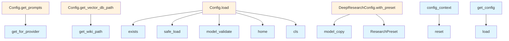

# config.py

## File Overview

The config.py module provides configuration management for the local_deepwiki application. It implements a thread-safe singleton pattern with context-local override support, allowing for global configuration with temporary per-context overrides. The module uses Pydantic models for configuration validation and YAML loading capabilities.

## Classes

### Config

The [main](web/app.md) configuration class that aggregates all application settings.

**Fields:**
- `embedding`: EmbeddingConfig instance for embedding provider settings
- `llm`: LLMConfig instance for language model provider settings  
- `llm_cache`: LLMCacheConfig instance for LLM caching configuration
- `parsing`: ParsingConfig instance for document parsing settings
- `chunking`: ChunkingConfig instance for text chunking configuration
- `wiki`: WikiConfig instance for wiki generation settings
- `deep_research`: DeepResearchConfig instance for research functionality
- `output`: OutputConfig instance for output formatting settings
- `prompts`: PromptsConfig instance for prompt templates

### LLMConfig

Configuration for language model providers.

**Fields:**
- `provider`: Literal type accepting "ollama", "anthropic", or "openai" (default: "ollama")
- `ollama`: OllamaConfig instance for Ollama-specific settings
- `anthropic`: AnthropicConfig instance for Anthropic-specific settings  
- `openai`: OpenAILLMConfig instance for OpenAI-specific settings

### OllamaConfig

Configuration specific to the Ollama LLM provider.

**Fields:**
- `model`: Model name string (default: "qwen3-coder:30b")
- `base_url`: API endpoint URL (default: "http://localhost:11434")

### AnthropicConfig

Configuration specific to the Anthropic LLM provider.

**Fields:**
- `model`: Model name string (default: "claude-sonnet-4-20250514")

### OpenAILLMConfig

Configuration specific to the OpenAI LLM provider.

**Fields:**
- `model`: Model name string (default: "gpt-4o")

### ProviderPromptsConfig

Prompt templates configuration for a specific provider.

**Fields:**
- `wiki_system`: System prompt for wiki documentation generation
- `research_decomposition`: System prompt for question decomposition
- `research_gap_analysis`: System prompt for gap analysis
- `research_synthesis`: System prompt for answer synthesis

## Functions

### get_config

```python
def get_config() -> Config
```

Retrieves the active configuration instance in a thread-safe manner.

**Returns:** The active Config instance (context-local if set, otherwise global)

**Behavior:**
- Checks for context-local configuration override first
- Falls back to global singleton configuration
- Automatically loads configuration if not yet initialized

### set_config

```python
def set_config(config: Config) -> None
```

Sets the global configuration instance in a thread-safe manner.

**Parameters:**
- `config`: The Config instance to set globally

**Note:** This sets the global config, not a context-local override. Use config_context for temporary overrides.

### reset_config

```python
def reset_config() -> None
```

Resets the global configuration to an uninitialized state and clears any context-local overrides.

**Use Cases:**
- Testing scenarios requiring fresh configuration
- Clearing cached configuration state

### config_context

```python
def config_context(config: Config) -> Generator[Config, None, None]
```

Context manager for temporary configuration overrides.

**Parameters:**
- `config`: The Config instance to use within the context

**Yields:** The provided configuration

**Usage:**
```python
with config_context(custom_config):
    # get_config() returns custom_config here
    result = some_operation()
# get_config() returns global config again
```

## Usage Examples

### Basic Configuration Access

```python
from local_deepwiki.config import get_config

# Get current configuration
config = get_config()
print(f"LLM provider: {config.llm.provider}")
print(f"Ollama model: {config.llm.ollama.model}")
```

### Setting Global Configuration

```python
from local_deepwiki.config import Config, set_config

# Create and set new configuration
new_config = Config()
new_config.llm.provider = "openai"
new_config.llm.openai.model = "gpt-4"
set_config(new_config)
```

### Temporary Configuration Override

```python
from local_deepwiki.config import config_context, Config

custom_config = Config()
custom_config.llm.provider = "anthropic"

with config_context(custom_config):
    # Operations here use custom_config
    process_documents()
# Back to global config
```

### Testing Configuration Reset

```python
from local_deepwiki.config import reset_config

# Reset for clean test state
reset_config()
# Next get_config() call will load fresh configuration
```

## Related Components

The configuration system integrates with several other components referenced in the imports and field types:

- **Pydantic BaseModel**: Provides validation and serialization capabilities
- **YAML loading**: Supports configuration file parsing
- **Threading utilities**: Ensures thread-safe configuration access
- **Context variables**: Enables context-local configuration overrides
- **Pathlib**: Used for file system path handling in configuration loading

## API Reference

### class `ResearchPreset`

**Inherits from:** `str`, `Enum`

Research mode presets for deep research pipeline.

### class `LocalEmbeddingConfig`

**Inherits from:** `BaseModel`

Configuration for local embedding model.

### class `OpenAIEmbeddingConfig`

**Inherits from:** `BaseModel`

Configuration for OpenAI embedding model.

### class `EmbeddingConfig`

**Inherits from:** `BaseModel`

Embedding provider configuration.

### class `OllamaConfig`

**Inherits from:** `BaseModel`

Configuration for Ollama LLM.

### class `AnthropicConfig`

**Inherits from:** `BaseModel`

Configuration for Anthropic LLM.

### class `OpenAILLMConfig`

**Inherits from:** `BaseModel`

Configuration for OpenAI LLM.

### class `LLMConfig`

**Inherits from:** `BaseModel`

LLM provider configuration.

### class `ParsingConfig`

**Inherits from:** `BaseModel`

Code parsing configuration.

### class `ChunkingConfig`

**Inherits from:** `BaseModel`

Chunking configuration.

### class `WikiConfig`

**Inherits from:** `BaseModel`

Wiki generation configuration.

### class `DeepResearchConfig`

**Inherits from:** `BaseModel`

Deep research pipeline configuration.

**Methods:**

#### `with_preset`

```python
def with_preset(preset: ResearchPreset | str | None) -> "DeepResearchConfig"
```

Return a new config with preset values applied.  The preset values override the current config values. If preset is None or "default", returns a copy of the current config unchanged.


| Parameter | Type | Default | Description |
|-----------|------|---------|-------------|
| `preset` | `ResearchPreset | str | None` | - | The research preset to apply ("quick", "default", "thorough"). |


### class `OutputConfig`

**Inherits from:** `BaseModel`

Output configuration.

### class `LLMCacheConfig`

**Inherits from:** `BaseModel`

LLM response caching configuration.

### class `ProviderPromptsConfig`

**Inherits from:** `BaseModel`

Prompts configuration for a specific provider.

### class `PromptsConfig`

**Inherits from:** `BaseModel`

Provider-specific prompts configuration.

**Methods:**

#### `get_for_provider`

```python
def get_for_provider(provider: str) -> ProviderPromptsConfig
```

Get prompts for a specific provider.


| Parameter | Type | Default | Description |
|-----------|------|---------|-------------|
| `provider` | `str` | - | Provider name ("ollama", "anthropic", "openai"). |


### class `Config`

**Inherits from:** `BaseModel`

Main configuration.

**Methods:**

#### `get_prompts`

```python
def get_prompts() -> ProviderPromptsConfig
```

Get prompts for the currently configured LLM provider.

#### `load`

```python
def load(config_path: Path | None = None) -> "Config"
```

Load configuration from file or defaults.


| Parameter | Type | Default | Description |
|-----------|------|---------|-------------|
| `config_path` | `Path | None` | `None` | - |

#### `get_wiki_path`

```python
def get_wiki_path(repo_path: Path) -> Path
```

Get the wiki output path for a repository.


| Parameter | Type | Default | Description |
|-----------|------|---------|-------------|
| `repo_path` | `Path` | - | - |

#### `get_vector_db_path`

```python
def get_vector_db_path(repo_path: Path) -> Path
```

Get the vector database path for a repository.


| Parameter | Type | Default | Description |
|-----------|------|---------|-------------|
| `repo_path` | `Path` | - | - |


---

### Functions

#### `get_config`

```python
def get_config() -> Config
```

Get the configuration instance.  Returns the context-local config if set, otherwise the global config. Thread-safe for concurrent access.

**Returns:** `Config`


#### `set_config`

```python
def set_config(config: Config) -> None
```

Set the global configuration instance.  Thread-safe. Note: This sets the global config, not a context-local one. Use config_context() for temporary context-local overrides.


| Parameter | Type | Default | Description |
|-----------|------|---------|-------------|
| `config` | `Config` | - | The configuration to set globally. |

**Returns:** `None`


#### `reset_config`

```python
def reset_config() -> None
```

Reset the global configuration to uninitialized state.  Useful for testing to ensure a fresh config is loaded. Also clears any context-local override.

**Returns:** `None`


#### `config_context`

`@contextmanager`

```python
def config_context(config: Config) -> Generator[Config, None, None]
```

Context manager for temporary config override.  Sets a context-local configuration that takes precedence over the global config within the context. Useful for testing or per-request config.


| Parameter | Type | Default | Description |
|-----------|------|---------|-------------|
| `config` | `Config` | - | The configuration to use within the context. |

**Returns:** `Generator[Config, None, None]`


## Class Diagram

```mermaid
classDiagram
    class AnthropicConfig {
        <<dataclass>>
        +model: str
    }
    class ChunkingConfig {
        <<dataclass>>
        +max_chunk_tokens: int
        +overlap_tokens: int
        +batch_size: int
        +class_split_threshold: int
    }
    class Config {
        <<dataclass>>
        +embedding: EmbeddingConfig
        +llm: LLMConfig
        +llm_cache: LLMCacheConfig
        +parsing: ParsingConfig
        +chunking: ChunkingConfig
        +wiki: WikiConfig
        +deep_research: DeepResearchConfig
        +output: OutputConfig
        +prompts: PromptsConfig
        +get_prompts() -> ProviderPromptsConfig
        +load() -> "Config"
        +get_wiki_path() -> Path
        +get_vector_db_path() -> Path
    }
    class DeepResearchConfig {
        <<dataclass>>
        +max_sub_questions: int
        +chunks_per_subquestion: int
        +max_total_chunks: int
        +max_follow_up_queries: int
        +synthesis_temperature: float
        +synthesis_max_tokens: int
        +with_preset() -> "DeepResearchConfig"
    }
    class EmbeddingConfig {
        <<dataclass>>
        +provider: Literal["local", "openai"]
        +local: LocalEmbeddingConfig
        +openai: OpenAIEmbeddingConfig
    }
    class LLMCacheConfig {
        <<dataclass>>
        +enabled: bool
        +ttl_seconds: int
        +max_entries: int
        +similarity_threshold: float
        +max_cacheable_temperature: float
    }
    class LLMConfig {
        <<dataclass>>
        +provider: Literal["ollama", "anthropic", "openai"]
        +ollama: OllamaConfig
        +anthropic: AnthropicConfig
        +openai: OpenAILLMConfig
    }
    class LocalEmbeddingConfig {
        <<dataclass>>
        +model: str
    }
    class OllamaConfig {
        <<dataclass>>
        +model: str
        +base_url: str
    }
    class OpenAIEmbeddingConfig {
        <<dataclass>>
        +model: str
    }
    class OpenAILLMConfig {
        <<dataclass>>
        +model: str
    }
    class OutputConfig {
        <<dataclass>>
        +wiki_dir: str
        +vector_db_name: str
    }
    class ParsingConfig {
        <<dataclass>>
        +languages: list[str]
        +max_file_size: int
        +exclude_patterns: list[str]
    }
    class PromptsConfig {
        <<dataclass>>
        +ollama: ProviderPromptsConfig
        +anthropic: ProviderPromptsConfig
        +openai: ProviderPromptsConfig
        +get_for_provider() -> ProviderPromptsConfig
    }
    class ProviderPromptsConfig {
        <<dataclass>>
        +wiki_system: str
        +research_decomposition: str
        +research_gap_analysis: str
        +research_synthesis: str
    }
    class WikiConfig {
        <<dataclass>>
        +max_file_docs: int
        +max_concurrent_llm_calls: int
        +use_cloud_for_github: bool
        +github_llm_provider: Literal["anthropic", "openai"]
        +import_search_limit: int
        +context_search_limit: int
        +fallback_search_limit: int
    }
    AnthropicConfig --|> BaseModel
    ChunkingConfig --|> BaseModel
    Config --|> BaseModel
    DeepResearchConfig --|> BaseModel
    EmbeddingConfig --|> BaseModel
    LLMCacheConfig --|> BaseModel
    LLMConfig --|> BaseModel
    LocalEmbeddingConfig --|> BaseModel
    OllamaConfig --|> BaseModel
    OpenAIEmbeddingConfig --|> BaseModel
    OpenAILLMConfig --|> BaseModel
    OutputConfig --|> BaseModel
    ParsingConfig --|> BaseModel
    PromptsConfig --|> BaseModel
    ProviderPromptsConfig --|> BaseModel
    WikiConfig --|> BaseModel
```



## Call Graph



## Relevant Source Files

- `src/local_deepwiki/config.py:14-19`

## See Also

- [test_config](../../tests/test_config.md) - uses this
- [wiki](generators/wiki.md) - uses this
- [test_indexer](../../tests/test_indexer.md) - uses this
- [models](models.md) - shares 4 dependencies
- [diagrams](generators/diagrams.md) - shares 2 dependencies
