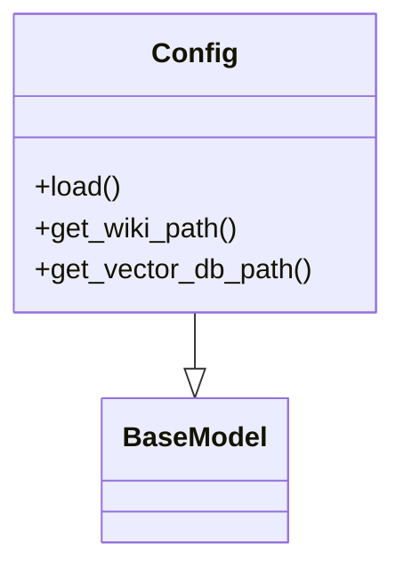
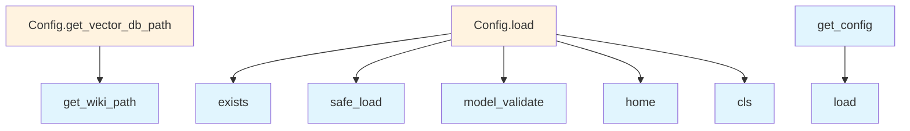

# File Overview

This file defines configuration classes and functions for the local_deepwiki application. It provides a structured way to manage various configuration settings related to embedding models, language models, parsing, chunking, and output settings. The configuration system uses Pydantic for validation and YAML for configuration file handling.

# Classes

## LocalEmbeddingConfig

Configuration class for local embedding models. This class inherits from BaseModel and defines settings specific to local embedding models.

## OpenAIEmbeddingConfig

Configuration class for OpenAI embedding models. This class inherits from BaseModel and defines settings specific to OpenAI embedding models.

## EmbeddingConfig

Base configuration class for embedding models. This class inherits from BaseModel and serves as a base for other embedding configuration classes.

## OllamaConfig

Configuration class for Ollama models. This class inherits from BaseModel and defines settings specific to Ollama models.

## AnthropicConfig

Configuration class for Anthropic models. This class inherits from BaseModel and defines settings specific to Anthropic models.

## OpenAILLMConfig

Configuration class for OpenAI language models. This class inherits from BaseModel and defines settings specific to OpenAI language models.

## LLMConfig

Base configuration class for language models. This class inherits from BaseModel and serves as a base for other language model configuration classes.

## ParsingConfig

Configuration class for parsing settings. This class inherits from BaseModel and defines settings for parsing documents.

## ChunkingConfig

Configuration class for chunking settings. This class inherits from BaseModel and defines settings for chunking documents.

## OutputConfig

Configuration class for output settings. This class inherits from BaseModel and defines settings for output formatting.

## Config

Main configuration class that aggregates all other configuration classes. This class inherits from BaseModel and contains fields for embedding, LLM, parsing, chunking, and output configurations.

# Functions

## get_config

Retrieves the application configuration. This function does not take any parameters and returns a Config instance.

## set_config

Sets the application configuration. This function takes a Config instance as a parameter and does not return a value.

# Usage Examples

## Loading Configuration

```python
from local_deepwiki.config import get_config

# Get the current configuration
config = get_config()
```

## Setting Configuration

```python
from local_deepwiki.config import set_config, Config, EmbeddingConfig

# Create a new configuration
new_config = Config(
    embedding=EmbeddingConfig(
        model="text-embedding-3-small"
    )
)

# Set the configuration
set_config(new_config)
```

# Related Components

This file works with the following components based on imports and references:

- **pydantic**: Used for data validation and settings management
- **yaml**: Used for parsing configuration files
- **pathlib.Path**: Used for handling file paths
- **os**: Used for environment variable access and OS-related operations

The configuration system is designed to be used with Pydantic's BaseModel for validation and YAML for configuration file parsing. The classes are structured to allow for easy extension and composition of different configuration settings.

## API Reference

### class `LocalEmbeddingConfig`

**Inherits from:** `BaseModel`

Configuration for local embedding model.

### class `OpenAIEmbeddingConfig`

**Inherits from:** `BaseModel`

Configuration for OpenAI embedding model.

### class `EmbeddingConfig`

**Inherits from:** `BaseModel`

Embedding provider configuration.

### class `OllamaConfig`

**Inherits from:** `BaseModel`

Configuration for Ollama LLM.

### class `AnthropicConfig`

**Inherits from:** `BaseModel`

Configuration for Anthropic LLM.

### class `OpenAILLMConfig`

**Inherits from:** `BaseModel`

Configuration for OpenAI LLM.

### class `LLMConfig`

**Inherits from:** `BaseModel`

LLM provider configuration.

### class `ParsingConfig`

**Inherits from:** `BaseModel`

Code parsing configuration.

### class `ChunkingConfig`

**Inherits from:** `BaseModel`

Chunking configuration.

### class `OutputConfig`

**Inherits from:** `BaseModel`

Output configuration.

### class `Config`

**Inherits from:** `BaseModel`

Main configuration.

**Methods:**

#### `load`

```python
def load(config_path: Path | None = None) -> "Config"
```

Load configuration from file or defaults.


| [Parameter](generators/api_docs.md) | Type | Default | Description |
|-----------|------|---------|-------------|
| `config_path` | `Path | None` | `None` | - |

#### `get_wiki_path`

```python
def get_wiki_path(repo_path: Path) -> Path
```

Get the wiki output path for a repository.


| [Parameter](generators/api_docs.md) | Type | Default | Description |
|-----------|------|---------|-------------|
| `repo_path` | `Path` | - | - |

#### `get_vector_db_path`

```python
def get_vector_db_path(repo_path: Path) -> Path
```

Get the vector database path for a repository.


| [Parameter](generators/api_docs.md) | Type | Default | Description |
|-----------|------|---------|-------------|
| `repo_path` | `Path` | - | - |


---

### Functions

#### `get_config`

```python
def get_config() -> Config
```

Get the global configuration instance.

**Returns:** `Config`


#### `set_config`

```python
def set_config(config: Config) -> None
```

Set the global configuration instance.


| [Parameter](generators/api_docs.md) | Type | Default | Description |
|-----------|------|---------|-------------|
| `config` | `Config` | - | - |

**Returns:** `None`


## Class Diagram



## Call Graph



## Relevant Source Files

- `src/local_deepwiki/config.py:11-14`

## See Also

- [wiki](generators/wiki.md) - uses this
- [chunker](core/chunker.md) - uses this
- [server](server.md) - uses this
- [diagrams](generators/diagrams.md) - shares 2 dependencies
