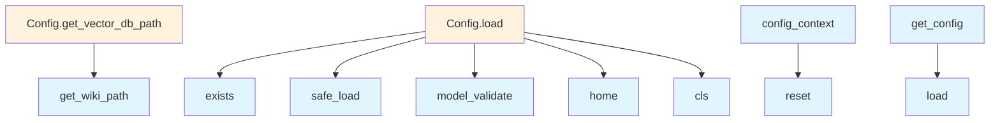

# config.py

## File Overview

This module provides configuration management for the local_deepwiki application using Pydantic models and context variables. It handles various configuration aspects including embedding providers, language models, parsing settings, chunking parameters, and output configurations. The module implements thread-safe configuration management with context-aware configuration switching.

## Classes

### LocalEmbeddingConfig
A Pydantic model for configuring local embedding settings. This class handles configuration for locally-hosted embedding models.

### OpenAIEmbeddingConfig  
A Pydantic model for configuring OpenAI embedding API settings. This class manages OpenAI-specific embedding parameters and authentication.

### EmbeddingConfig
A unified configuration model that handles different embedding provider configurations. This class serves as a wrapper for various embedding backends.

### OllamaConfig
A Pydantic model for configuring Ollama language model settings. This class manages connection and model parameters for Ollama instances.

### AnthropicConfig
A Pydantic model for configuring Anthropic language model settings. This class handles Anthropic API configuration and model parameters.

### OpenAILLMConfig
A Pydantic model for configuring OpenAI language model settings. This class manages OpenAI LLM API parameters and authentication.

### LLMConfig
A unified configuration model that handles different language model provider configurations. This class serves as a wrapper for various LLM backends.

### ParsingConfig
A Pydantic model for configuring document parsing settings. This class manages parameters related to how documents are processed and parsed.

### ChunkingConfig
A Pydantic model for configuring text chunking parameters. This class handles settings for how text is split into chunks for processing.

### WikiConfig
A Pydantic model for configuring wiki-specific settings. This class manages parameters related to wiki generation and formatting.

### OutputConfig
A Pydantic model for configuring output settings. This class handles parameters for how results are formatted and saved.

### Config
The [main](watcher.md) configuration class that combines all configuration sections. This class serves as the root configuration model containing all other configuration components.

## Functions

### get_config()
Retrieves the current configuration from the context variable.

**Returns:** The current Config instance

### set_config(config)
Sets the configuration in the current context.

**Parameters:**
- `config`: The Config instance to set as current

### reset_config()
Resets the configuration context variable to its default state.

### config_context(config)
A context manager that temporarily sets a configuration for the duration of the context.

**Parameters:**
- `config`: The Config instance to use within the context

**Returns:** A context manager that handles configuration switching

## Usage Examples

### Basic Configuration Access
```python
from local_deepwiki.config import get_config, set_config

# Get current configuration
current_config = get_config()

# Set a new configuration
new_config = Config(...)
set_config(new_config)
```

### Using Configuration Context
```python
from local_deepwiki.config import config_context, Config

# Temporarily use a different configuration
with config_context(temp_config):
    # Operations here use temp_config
    current = get_config()  # Returns temp_config
    
# Outside context, original config is restored
```

### Configuration Reset
```python
from local_deepwiki.config import reset_config

# Reset to default configuration
reset_config()
```

## Related Components

This module integrates with several external libraries:
- **pydantic**: Used for configuration model validation and serialization through BaseModel and Field
- **yaml**: Handles YAML configuration file parsing
- **pathlib**: Manages file system paths through the Path class
- **threading**: Provides thread-safe configuration management
- **contextlib**: Enables context manager functionality for configuration switching
- **contextvars**: Implements context-aware configuration storage

The configuration models support various provider integrations including OpenAI, Anthropic, and Ollama services, making this module central to the application's provider abstraction layer.

## API Reference

### class `LocalEmbeddingConfig`

**Inherits from:** `BaseModel`

Configuration for local embedding model.

### class `OpenAIEmbeddingConfig`

**Inherits from:** `BaseModel`

Configuration for OpenAI embedding model.

### class `EmbeddingConfig`

**Inherits from:** `BaseModel`

Embedding provider configuration.

### class `OllamaConfig`

**Inherits from:** `BaseModel`

Configuration for Ollama LLM.

### class `AnthropicConfig`

**Inherits from:** `BaseModel`

Configuration for Anthropic LLM.

### class `OpenAILLMConfig`

**Inherits from:** `BaseModel`

Configuration for OpenAI LLM.

### class `LLMConfig`

**Inherits from:** `BaseModel`

LLM provider configuration.

### class `ParsingConfig`

**Inherits from:** `BaseModel`

Code parsing configuration.

### class `ChunkingConfig`

**Inherits from:** `BaseModel`

Chunking configuration.

### class `WikiConfig`

**Inherits from:** `BaseModel`

Wiki generation configuration.

### class `OutputConfig`

**Inherits from:** `BaseModel`

Output configuration.

### class `Config`

**Inherits from:** `BaseModel`

Main configuration.

**Methods:**

#### `load`

```python
def load(config_path: Path | None = None) -> "Config"
```

Load configuration from file or defaults.


| [Parameter](generators/api_docs.md) | Type | Default | Description |
|-----------|------|---------|-------------|
| `config_path` | `Path | None` | `None` | - |

#### `get_wiki_path`

```python
def get_wiki_path(repo_path: Path) -> Path
```

Get the wiki output path for a repository.


| [Parameter](generators/api_docs.md) | Type | Default | Description |
|-----------|------|---------|-------------|
| `repo_path` | `Path` | - | - |

#### `get_vector_db_path`

```python
def get_vector_db_path(repo_path: Path) -> Path
```

Get the vector database path for a repository.


| [Parameter](generators/api_docs.md) | Type | Default | Description |
|-----------|------|---------|-------------|
| `repo_path` | `Path` | - | - |


---

### Functions

#### `get_config`

```python
def get_config() -> Config
```

Get the configuration instance.  Returns the context-local config if set, otherwise the global config. Thread-safe for concurrent access.

**Returns:** `Config`


#### `set_config`

```python
def set_config(config: Config) -> None
```

Set the global configuration instance.  Thread-safe. Note: This sets the global config, not a context-local one. Use config_context() for temporary context-local overrides.


| [Parameter](generators/api_docs.md) | Type | Default | Description |
|-----------|------|---------|-------------|
| `config` | `Config` | - | The configuration to set globally. |

**Returns:** `None`


#### `reset_config`

```python
def reset_config() -> None
```

Reset the global configuration to uninitialized state.  Useful for testing to ensure a fresh config is loaded. Also clears any context-local override.

**Returns:** `None`


#### `config_context`

`@contextmanager`

```python
def config_context(config: Config) -> Generator[Config, None, None]
```

Context manager for temporary config override.  Sets a context-local configuration that takes precedence over the global config within the context. Useful for testing or per-request config.


| [Parameter](generators/api_docs.md) | Type | Default | Description |
|-----------|------|---------|-------------|
| `config` | `Config` | - | The configuration to use within the context. |

**Returns:** `Generator[Config, None, None]`


## Class Diagram

```mermaid
classDiagram
    class AnthropicConfig {
        <<dataclass>>
        +model: str
    }
    class ChunkingConfig {
        <<dataclass>>
        +max_chunk_tokens: int
        +overlap_tokens: int
        +batch_size: int
        +class_split_threshold: int
    }
    class Config {
        <<dataclass>>
        +embedding: EmbeddingConfig
        +llm: LLMConfig
        +parsing: ParsingConfig
        +chunking: ChunkingConfig
        +wiki: WikiConfig
        +output: OutputConfig
        +load() -> "Config"
        +get_wiki_path() -> Path
        +get_vector_db_path() -> Path
    }
    class EmbeddingConfig {
        <<dataclass>>
        +provider: Literal["local", "openai"]
        +local: LocalEmbeddingConfig
        +openai: OpenAIEmbeddingConfig
    }
    class LLMConfig {
        <<dataclass>>
        +provider: Literal["ollama", "anthropic", "openai"]
        +ollama: OllamaConfig
        +anthropic: AnthropicConfig
        +openai: OpenAILLMConfig
    }
    class LocalEmbeddingConfig {
        <<dataclass>>
        +model: str
    }
    class OllamaConfig {
        <<dataclass>>
        +model: str
        +base_url: str
    }
    class OpenAIEmbeddingConfig {
        <<dataclass>>
        +model: str
    }
    class OpenAILLMConfig {
        <<dataclass>>
        +model: str
    }
    class OutputConfig {
        <<dataclass>>
        +wiki_dir: str
        +vector_db_name: str
    }
    class ParsingConfig {
        <<dataclass>>
        +languages: list[str]
        +max_file_size: int
        +exclude_patterns: list[str]
    }
    class WikiConfig {
        <<dataclass>>
        +max_file_docs: int
        +import_search_limit: int
        +context_search_limit: int
        +fallback_search_limit: int
    }
    AnthropicConfig --|> BaseModel
    ChunkingConfig --|> BaseModel
    Config --|> BaseModel
    EmbeddingConfig --|> BaseModel
    LLMConfig --|> BaseModel
    LocalEmbeddingConfig --|> BaseModel
    OllamaConfig --|> BaseModel
    OpenAIEmbeddingConfig --|> BaseModel
    OpenAILLMConfig --|> BaseModel
    OutputConfig --|> BaseModel
    ParsingConfig --|> BaseModel
    WikiConfig --|> BaseModel
```



## Call Graph



## Relevant Source Files

- `src/local_deepwiki/config.py:13-18`

## See Also

- [server](server.md) - uses this
- [test_indexer](../../tests/test_indexer.md) - uses this
- [diagrams](generators/diagrams.md) - shares 2 dependencies
