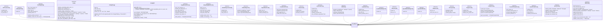
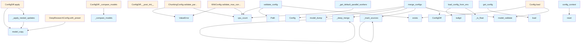

# File Overview

This file defines configuration classes for the `local_deepwiki` project, used to manage settings for embedding models, language model providers, parsing, chunking, and wiki generation. It uses Pydantic for validation and dataclasses for additional structures.

## Key Features
- Configuration for local and cloud-based embedding models (e.g., sentence-transformers, OpenAI)
- Configuration for various LLM providers (Ollama, Anthropic, OpenAI)
- Settings for code parsing, chunking, and wiki generation
- Support for caching configurations
- Context-aware configuration management using `ContextVar`

## Dependencies
This file imports:
- `os`, `threading`, `contextlib`, `contextvars`, `dataclasses`, `enum`, `pathlib`, `typing`
- `yaml` for configuration file parsing
- `pydantic` for model validation and configuration

## Integration
This file is used by:
- `ChunkingConfig`: used by chunker
- `EmbeddingCacheConfig`: used by cache
- `LLMCacheConfig`: used by test_llm_cache
- `SearchCacheConfig`: used by vectorstore, test_vectorstore
- `FuzzySearchConfig`: used by test_vectorstore
- `reset_config`: used by test_config
- `validate_config`: used by test_config

# Classes

## ResearchPreset
An enumeration representing research mode presets for the deep research pipeline.

**Values**:
- `QUICK`: Fast research mode
- `DEFAULT`: Standard research mode
- `THOROUGH`: Detailed research mode

## LocalEmbeddingConfig
Configuration for local embedding models using sentence-transformers.

**Fields**:
- `model` (str): Model name for sentence-transformers. Default: `"all-MiniLM-L6-v2"`

## OpenAIEmbeddingConfig
Configuration for OpenAI embedding models.

**Fields**:
- `model` (str): OpenAI embedding model. Default: `"text-embedding-3-small"`

## EmbeddingConfig
Configuration for embedding providers, supporting local and OpenAI.

**Fields**:
- `provider` (Literal["local", "openai"]): Embedding provider. Default: `"local"`
- `local` (LocalEmbeddingConfig): Configuration for local embedding. Default: `LocalEmbeddingConfig()`
- `openai` (OpenAIEmbeddingConfig): Configuration for OpenAI embedding. Default: `OpenAIEmbeddingConfig()`

## OllamaConfig
Configuration for Ollama LLM providers.

**Fields**:
- `model` (str): Ollama model name. Default: `"qwen3-coder:30b"`
- `base_url` (str): Ollama API URL. Default: `"http://localhost:11434"`

## AnthropicConfig
Configuration for Anthropic LLM providers.

**Fields**:
- `model` (str): Anthropic model name. Default: `"claude-sonnet-4-20250514"`

## OpenAILLMConfig
Configuration for OpenAI LLM providers.

**Fields**:
- `model` (str): OpenAI model name. Default: `"gpt-4o"`

## LLMConfig
Configuration for LLM providers, supporting Ollama, Anthropic, and OpenAI.

**Fields**:
- `provider` (Literal["ollama", "anthropic", "openai"]): LLM provider. Default: `"ollama"`
- `ollama` (OllamaConfig): Configuration for Ollama. Default: `OllamaConfig()`
- `anthropic` (AnthropicConfig): Configuration for Anthropic. Default: `AnthropicConfig()`
- `openai` (OpenAILLMConfig): Configuration for OpenAI. Default: `OpenAILLMConfig()`

## ParsingConfig
Configuration for code parsing, including supported languages and file size limits.

**Fields**:
- `languages` (list[str]): Languages to parse. Default: Python, TypeScript, JavaScript, Go, Rust, Java, C, C++, Swift, Ruby, PHP, Kotlin, C#
- `max_file_size` (int): Max file size in bytes (1MB). Default: `1048576`
- `exclude_patterns` (list[str]): File patterns to exclude from parsing. Default: `[".git/", "__pycache__/", ".pytest_cache/", ".venv/", "node_modules/", "build/", "dist/"]`

## EmbeddingBatchConfig
Configuration for batch processing of embeddings.

**Fields**:
- `batch_size` (int): Number of texts to embed per batch. Range: 1-500. Default: `100`
- `concurrency` (int): Number of batches to process in parallel. Range: 1-16. Default: `4`

## ASTCacheConfig
Configuration for AST caching in tree-sitter parser.

**Fields**:
- `enabled` (bool): Enable AST caching for incremental indexing. Default: `True`
- `max_entries` (int): Maximum number of cached ASTs before LRU eviction. Range: 100-10000. Default: `1000`
- `ttl_seconds` (int): Time-to-live for cached entries in seconds. Range: 60-86400 (24 hours). Default: `3600`

## ChunkingConfig
Configuration for text chunking.

**Fields**:
- `max_chunk_tokens` (int): Max tokens per chunk. Default: `512`
- `overlap_tokens` (int): Overlap between chunks. Default: `50`
- `batch_size` (int): Number of chunks to process in each batch for memory efficiency. Default: `500`
- `class_split_threshold` (int): Line count threshold above which classes are split into summary + method chunks. Default: `100`
- `parallel_workers` (int): Number of parallel workers for chunking. Default: `4`

## WikiConfig
Configuration for wiki generation.

**Fields**:
- `max_file_docs` (int): Maximum number of file-level documentation pages to generate. Set to 0 for unlimited. Default: `500`
- `max_concurrent_llm_calls` (int): Maximum concurrent LLM calls for file documentation generation. Range: 1-20. Default: `8`
- `use_cloud_for_github` (bool): Use cloud for GitHub repo processing. Default: `True`
- `max_concurrent_github_calls` (int): Max concurrent GitHub API calls. Range: 1-20. Default: `5`
- `max_concurrent_wiki_calls` (int): Max concurrent wiki generation calls. Range: 1-20. Default: `4`
- `github_token` (str): GitHub token for API access. Default: `""`
- `preset` (ResearchPreset): Research mode preset. Default: `ResearchPreset.DEFAULT`
- `chunking` (ChunkingConfig): Chunking configuration. Default: `ChunkingConfig()`
- `embedding_batch` (EmbeddingBatchConfig): Embedding batch configuration. Default: `EmbeddingBatchConfig()`

## Config
Main configuration class that holds all configuration components.

**Fields**:
- `embedding` (EmbeddingConfig): Embedding configuration. Default: `EmbeddingConfig()`
- `llm` (LLMConfig): LLM configuration. Default: `LLMConfig()`
- `parsing` (ParsingConfig): Parsing configuration. Default: `ParsingConfig()`
- `embedding_batch` (EmbeddingBatchConfig): Embedding batch configuration. Default: `EmbeddingBatchConfig()`
- `ast_cache` (ASTCacheConfig): AST cache configuration. Default: `ASTCacheConfig()`
- `chunking` (ChunkingConfig): Chunking configuration. Default: `ChunkingConfig()`
- `wiki` (WikiConfig): Wiki generation configuration. Default: `WikiConfig()`

# Functions

## reset_config
Resets the global configuration to default values.

## validate_config
Validates the current configuration for correctness.

## get_config
Retrieves the current configuration in a thread-safe manner.

## set_config
Sets the global configuration in a thread-safe manner.

# Usage Examples

## Basic Configuration Usage

```python
from local_deepwiki.config import Config, EmbeddingConfig, LLMConfig

# Create a custom configuration
config = Config(
    embedding=EmbeddingConfig(provider="openai", openai=OpenAIEmbeddingConfig(model="text-embedding-3-large")),
    llm=LLMConfig(provider="ollama", ollama=OllamaConfig(model="llama3.2:1b"))
)

# Set the global configuration
set_config(config)
```

## Reading Configuration

```python
from local_deepwiki.config import get_config

# Get current configuration
config = get_config()
print(config.embedding.provider)
```

## Validation

```python
from local_deepwiki.config import validate_config

# Validate current configuration
validate_config()
```

## API Reference

### class `ResearchPreset`

**Inherits from:** `str`, `Enum`

Research mode presets for deep research pipeline.


<details>
<summary>View Source (lines 16-21) | <a href="https://github.com/UrbanDiver/local-deepwiki-mcp/blob/[main](export/pdf.md)/src/local_deepwiki/config.py#L16-L21">GitHub</a></summary>

```python
class ResearchPreset(str, Enum):
    """Research mode presets for deep research pipeline."""

    QUICK = "quick"
    DEFAULT = "default"
    THOROUGH = "thorough"
```

</details>

### class `LocalEmbeddingConfig`

**Inherits from:** `BaseModel`

Configuration for local embedding model.


<details>
<summary>View Source (lines 53-60) | <a href="https://github.com/UrbanDiver/local-deepwiki-mcp/blob/[main](export/pdf.md)/src/local_deepwiki/config.py#L53-L60">GitHub</a></summary>

```python
class LocalEmbeddingConfig(BaseModel):
    """Configuration for local embedding model."""

    model_config = {"frozen": True}

    model: str = Field(
        default="all-MiniLM-L6-v2", description="Model name for sentence-transformers"
    )
```

</details>

### class `OpenAIEmbeddingConfig`

**Inherits from:** `BaseModel`

Configuration for OpenAI embedding model.


<details>
<summary>View Source (lines 63-68) | <a href="https://github.com/UrbanDiver/local-deepwiki-mcp/blob/[main](export/pdf.md)/src/local_deepwiki/config.py#L63-L68">GitHub</a></summary>

```python
class OpenAIEmbeddingConfig(BaseModel):
    """Configuration for OpenAI embedding model."""

    model_config = {"frozen": True}

    model: str = Field(default="text-embedding-3-small", description="OpenAI embedding model")
```

</details>

### class `EmbeddingConfig`

**Inherits from:** `BaseModel`

Embedding provider configuration.


<details>
<summary>View Source (lines 71-78) | <a href="https://github.com/UrbanDiver/local-deepwiki-mcp/blob/[main](export/pdf.md)/src/local_deepwiki/config.py#L71-L78">GitHub</a></summary>

```python
class EmbeddingConfig(BaseModel):
    """Embedding provider configuration."""

    model_config = {"frozen": True}

    provider: Literal["local", "openai"] = Field(default="local", description="Embedding provider")
    local: LocalEmbeddingConfig = Field(default_factory=LocalEmbeddingConfig)
    openai: OpenAIEmbeddingConfig = Field(default_factory=OpenAIEmbeddingConfig)
```

</details>

### class `OllamaConfig`

**Inherits from:** `BaseModel`

Configuration for Ollama LLM.


<details>
<summary>View Source (lines 81-87) | <a href="https://github.com/UrbanDiver/local-deepwiki-mcp/blob/[main](export/pdf.md)/src/local_deepwiki/config.py#L81-L87">GitHub</a></summary>

```python
class OllamaConfig(BaseModel):
    """Configuration for Ollama LLM."""

    model_config = {"frozen": True}

    model: str = Field(default="qwen3-coder:30b", description="Ollama model name")
    base_url: str = Field(default="http://localhost:11434", description="Ollama API URL")
```

</details>

### class `AnthropicConfig`

**Inherits from:** `BaseModel`

Configuration for Anthropic LLM.


<details>
<summary>View Source (lines 90-95) | <a href="https://github.com/UrbanDiver/local-deepwiki-mcp/blob/[main](export/pdf.md)/src/local_deepwiki/config.py#L90-L95">GitHub</a></summary>

```python
class AnthropicConfig(BaseModel):
    """Configuration for Anthropic LLM."""

    model_config = {"frozen": True}

    model: str = Field(default="claude-sonnet-4-20250514", description="Anthropic model name")
```

</details>

### class `OpenAILLMConfig`

**Inherits from:** `BaseModel`

Configuration for OpenAI LLM.


<details>
<summary>View Source (lines 98-103) | <a href="https://github.com/UrbanDiver/local-deepwiki-mcp/blob/[main](export/pdf.md)/src/local_deepwiki/config.py#L98-L103">GitHub</a></summary>

```python
class OpenAILLMConfig(BaseModel):
    """Configuration for OpenAI LLM."""

    model_config = {"frozen": True}

    model: str = Field(default="gpt-4o", description="OpenAI model name")
```

</details>

### class `LLMConfig`

**Inherits from:** `BaseModel`

LLM provider configuration.


<details>
<summary>View Source (lines 106-116) | <a href="https://github.com/UrbanDiver/local-deepwiki-mcp/blob/[main](export/pdf.md)/src/local_deepwiki/config.py#L106-L116">GitHub</a></summary>

```python
class LLMConfig(BaseModel):
    """LLM provider configuration."""

    model_config = {"frozen": True}

    provider: Literal["ollama", "anthropic", "openai"] = Field(
        default="ollama", description="LLM provider"
    )
    ollama: OllamaConfig = Field(default_factory=OllamaConfig)
    anthropic: AnthropicConfig = Field(default_factory=AnthropicConfig)
    openai: OpenAILLMConfig = Field(default_factory=OpenAILLMConfig)
```

</details>

### class `ParsingConfig`

**Inherits from:** `BaseModel`

Code parsing configuration.


<details>
<summary>View Source (lines 119-159) | <a href="https://github.com/UrbanDiver/local-deepwiki-mcp/blob/[main](export/pdf.md)/src/local_deepwiki/config.py#L119-L159">GitHub</a></summary>

```python
class ParsingConfig(BaseModel):
    """Code parsing configuration."""

    model_config = {"frozen": True}

    languages: list[str] = Field(
        default=[
            "python",
            "typescript",
            "javascript",
            "go",
            "rust",
            "java",
            "c",
            "cpp",
            "swift",
            "ruby",
            "php",
            "kotlin",
            "csharp",
        ],
        description="Languages to parse",
    )
    max_file_size: int = Field(default=1048576, description="Max file size in bytes (1MB)")
    exclude_patterns: list[str] = Field(
        default=[
            "node_modules/**",
            "venv/**",
            ".venv/**",
            "__pycache__/**",
            ".git/**",
            "*.min.js",
            "*.min.css",
            "dist/**",
            "build/**",
            ".next/**",
            "target/**",
            "vendor/**",
        ],
        description="Glob patterns to exclude",
    )
```

</details>

### class `EmbeddingBatchConfig`

**Inherits from:** `BaseModel`

Embedding batch processing configuration.

**Methods:**


<details>
<summary>View Source (lines 180-232) | <a href="https://github.com/UrbanDiver/local-deepwiki-mcp/blob/[main](export/pdf.md)/src/local_deepwiki/config.py#L180-L232">GitHub</a></summary>

```python
class EmbeddingBatchConfig(BaseModel):
    """Embedding batch processing configuration."""

    model_config = {"frozen": True}

    batch_size: int = Field(
        default=100,
        ge=1,
        le=500,
        description="Number of texts to embed per batch. "
        "Local models can handle larger batches (100-200), API providers should use smaller (20-50).",
    )
    concurrency: int = Field(
        default=4,
        ge=1,
        le=16,
        description="Number of batches to process in parallel. "
        "Higher values speed up embedding but increase memory/API usage.",
    )
    rate_limit_rpm: int | None = Field(
        default=None,
        description="Requests per minute limit for API providers. "
        "If set, embedding will be throttled to respect this limit. "
        "Set to None for local providers or when using default API limits.",
    )
    retry_max_attempts: int = Field(
        default=3,
        ge=1,
        le=10,
        description="Maximum retry attempts for failed batches.",
    )
    retry_base_delay: float = Field(
        default=1.0,
        ge=0.1,
        le=10.0,
        description="Base delay in seconds between retry attempts (exponential backoff).",
    )

    @field_validator("batch_size")
    @classmethod
    def validate_batch_size(cls, v: int) -> int:
        """Validate batch_size is reasonable."""
        if v < 1:
            raise ValueError("batch_size must be >= 1")
        return v

    @field_validator("concurrency")
    @classmethod
    def validate_concurrency(cls, v: int) -> int:
        """Validate concurrency doesn't exceed reasonable limits."""
        cpu_count = os.cpu_count() or 4
        max_concurrency = min(16, cpu_count * 2)
        return min(v, max_concurrency)
```

</details>

#### `validate_batch_size`

```python
def validate_batch_size(v: int) -> int
```

Validate batch_size is reasonable.


| [Parameter](generators/api_docs.md) | Type | Default | Description |
|-----------|------|---------|-------------|
| `v` | `int` | - | - |


<details>
<summary>View Source (lines 180-232) | <a href="https://github.com/UrbanDiver/local-deepwiki-mcp/blob/[main](export/pdf.md)/src/local_deepwiki/config.py#L180-L232">GitHub</a></summary>

```python
class EmbeddingBatchConfig(BaseModel):
    """Embedding batch processing configuration."""

    model_config = {"frozen": True}

    batch_size: int = Field(
        default=100,
        ge=1,
        le=500,
        description="Number of texts to embed per batch. "
        "Local models can handle larger batches (100-200), API providers should use smaller (20-50).",
    )
    concurrency: int = Field(
        default=4,
        ge=1,
        le=16,
        description="Number of batches to process in parallel. "
        "Higher values speed up embedding but increase memory/API usage.",
    )
    rate_limit_rpm: int | None = Field(
        default=None,
        description="Requests per minute limit for API providers. "
        "If set, embedding will be throttled to respect this limit. "
        "Set to None for local providers or when using default API limits.",
    )
    retry_max_attempts: int = Field(
        default=3,
        ge=1,
        le=10,
        description="Maximum retry attempts for failed batches.",
    )
    retry_base_delay: float = Field(
        default=1.0,
        ge=0.1,
        le=10.0,
        description="Base delay in seconds between retry attempts (exponential backoff).",
    )

    @field_validator("batch_size")
    @classmethod
    def validate_batch_size(cls, v: int) -> int:
        """Validate batch_size is reasonable."""
        if v < 1:
            raise ValueError("batch_size must be >= 1")
        return v

    @field_validator("concurrency")
    @classmethod
    def validate_concurrency(cls, v: int) -> int:
        """Validate concurrency doesn't exceed reasonable limits."""
        cpu_count = os.cpu_count() or 4
        max_concurrency = min(16, cpu_count * 2)
        return min(v, max_concurrency)
```

</details>

#### `validate_concurrency`

```python
def validate_concurrency(v: int) -> int
```

Validate concurrency doesn't exceed reasonable limits.


| [Parameter](generators/api_docs.md) | Type | Default | Description |
|-----------|------|---------|-------------|
| `v` | `int` | - | - |


<details>
<summary>View Source (lines 180-232) | <a href="https://github.com/UrbanDiver/local-deepwiki-mcp/blob/[main](export/pdf.md)/src/local_deepwiki/config.py#L180-L232">GitHub</a></summary>

```python
class EmbeddingBatchConfig(BaseModel):
    """Embedding batch processing configuration."""

    model_config = {"frozen": True}

    batch_size: int = Field(
        default=100,
        ge=1,
        le=500,
        description="Number of texts to embed per batch. "
        "Local models can handle larger batches (100-200), API providers should use smaller (20-50).",
    )
    concurrency: int = Field(
        default=4,
        ge=1,
        le=16,
        description="Number of batches to process in parallel. "
        "Higher values speed up embedding but increase memory/API usage.",
    )
    rate_limit_rpm: int | None = Field(
        default=None,
        description="Requests per minute limit for API providers. "
        "If set, embedding will be throttled to respect this limit. "
        "Set to None for local providers or when using default API limits.",
    )
    retry_max_attempts: int = Field(
        default=3,
        ge=1,
        le=10,
        description="Maximum retry attempts for failed batches.",
    )
    retry_base_delay: float = Field(
        default=1.0,
        ge=0.1,
        le=10.0,
        description="Base delay in seconds between retry attempts (exponential backoff).",
    )

    @field_validator("batch_size")
    @classmethod
    def validate_batch_size(cls, v: int) -> int:
        """Validate batch_size is reasonable."""
        if v < 1:
            raise ValueError("batch_size must be >= 1")
        return v

    @field_validator("concurrency")
    @classmethod
    def validate_concurrency(cls, v: int) -> int:
        """Validate concurrency doesn't exceed reasonable limits."""
        cpu_count = os.cpu_count() or 4
        max_concurrency = min(16, cpu_count * 2)
        return min(v, max_concurrency)
```

</details>

### class `ASTCacheConfig`

**Inherits from:** `BaseModel`

AST cache configuration for tree-sitter parser.  Caches parsed ASTs to speed up incremental indexing by avoiding re-parsing of unchanged files.


<details>
<summary>View Source (lines 235-256) | <a href="https://github.com/UrbanDiver/local-deepwiki-mcp/blob/[main](export/pdf.md)/src/local_deepwiki/config.py#L235-L256">GitHub</a></summary>

```python
class ASTCacheConfig(BaseModel):
    """AST cache configuration for tree-sitter parser.

    Caches parsed ASTs to speed up incremental indexing by avoiding
    re-parsing of unchanged files.
    """

    model_config = {"frozen": True}

    enabled: bool = Field(default=True, description="Enable AST caching for incremental indexing")
    max_entries: int = Field(
        default=1000,
        ge=100,
        le=10000,
        description="Maximum number of cached ASTs before LRU eviction",
    )
    ttl_seconds: int = Field(
        default=3600,
        ge=60,
        le=86400,  # 24 hours max
        description="Cache TTL in seconds (default: 1 hour)",
    )
```

</details>

### class `ChunkingConfig`

**Inherits from:** `BaseModel`

Chunking configuration.

**Methods:**


<details>
<summary>View Source (lines 259-298) | <a href="https://github.com/UrbanDiver/local-deepwiki-mcp/blob/[main](export/pdf.md)/src/local_deepwiki/config.py#L259-L298">GitHub</a></summary>

```python
class ChunkingConfig(BaseModel):
    """Chunking configuration."""

    model_config = {"frozen": True}

    max_chunk_tokens: int = Field(default=512, description="Max tokens per chunk")
    overlap_tokens: int = Field(default=50, description="Overlap between chunks")
    batch_size: int = Field(
        default=500, description="Number of chunks to process in each batch for memory efficiency"
    )
    class_split_threshold: int = Field(
        default=100,
        description="Line count threshold above which classes are split into summary + method chunks",
    )
    parallel_workers: int = Field(
        default_factory=_get_default_parallel_workers,
        ge=1,
        le=32,
        description="Number of parallel workers for file parsing. "
        "Defaults to min(CPU count, 8). Higher values speed up indexing on multi-core systems.",
    )

    @field_validator("parallel_workers")
    @classmethod
    def validate_parallel_workers(cls, v: int) -> int:
        """Validate parallel_workers doesn't exceed CPU count."""
        if v < 1:
            raise ValueError("parallel_workers must be >= 1")
        cpu_count = os.cpu_count() or 4
        return min(v, cpu_count)

    @model_validator(mode="after")
    def validate_overlap_less_than_max(self) -> "ChunkingConfig":
        """Validate overlap_tokens is less than max_chunk_tokens."""
        if self.overlap_tokens >= self.max_chunk_tokens:
            raise ValueError(
                f"overlap_tokens ({self.overlap_tokens}) must be less than "
                f"max_chunk_tokens ({self.max_chunk_tokens})"
            )
        return self
```

</details>

#### `validate_parallel_workers`

```python
def validate_parallel_workers(v: int) -> int
```

Validate parallel_workers doesn't exceed CPU count.


| [Parameter](generators/api_docs.md) | Type | Default | Description |
|-----------|------|---------|-------------|
| `v` | `int` | - | - |


<details>
<summary>View Source (lines 259-298) | <a href="https://github.com/UrbanDiver/local-deepwiki-mcp/blob/[main](export/pdf.md)/src/local_deepwiki/config.py#L259-L298">GitHub</a></summary>

```python
class ChunkingConfig(BaseModel):
    """Chunking configuration."""

    model_config = {"frozen": True}

    max_chunk_tokens: int = Field(default=512, description="Max tokens per chunk")
    overlap_tokens: int = Field(default=50, description="Overlap between chunks")
    batch_size: int = Field(
        default=500, description="Number of chunks to process in each batch for memory efficiency"
    )
    class_split_threshold: int = Field(
        default=100,
        description="Line count threshold above which classes are split into summary + method chunks",
    )
    parallel_workers: int = Field(
        default_factory=_get_default_parallel_workers,
        ge=1,
        le=32,
        description="Number of parallel workers for file parsing. "
        "Defaults to min(CPU count, 8). Higher values speed up indexing on multi-core systems.",
    )

    @field_validator("parallel_workers")
    @classmethod
    def validate_parallel_workers(cls, v: int) -> int:
        """Validate parallel_workers doesn't exceed CPU count."""
        if v < 1:
            raise ValueError("parallel_workers must be >= 1")
        cpu_count = os.cpu_count() or 4
        return min(v, cpu_count)

    @model_validator(mode="after")
    def validate_overlap_less_than_max(self) -> "ChunkingConfig":
        """Validate overlap_tokens is less than max_chunk_tokens."""
        if self.overlap_tokens >= self.max_chunk_tokens:
            raise ValueError(
                f"overlap_tokens ({self.overlap_tokens}) must be less than "
                f"max_chunk_tokens ({self.max_chunk_tokens})"
            )
        return self
```

</details>

#### `validate_overlap_less_than_max`

```python
def validate_overlap_less_than_max() -> "ChunkingConfig"
```

Validate overlap_tokens is less than max_chunk_tokens.


<details>
<summary>View Source (lines 259-298) | <a href="https://github.com/UrbanDiver/local-deepwiki-mcp/blob/[main](export/pdf.md)/src/local_deepwiki/config.py#L259-L298">GitHub</a></summary>

```python
class ChunkingConfig(BaseModel):
    """Chunking configuration."""

    model_config = {"frozen": True}

    max_chunk_tokens: int = Field(default=512, description="Max tokens per chunk")
    overlap_tokens: int = Field(default=50, description="Overlap between chunks")
    batch_size: int = Field(
        default=500, description="Number of chunks to process in each batch for memory efficiency"
    )
    class_split_threshold: int = Field(
        default=100,
        description="Line count threshold above which classes are split into summary + method chunks",
    )
    parallel_workers: int = Field(
        default_factory=_get_default_parallel_workers,
        ge=1,
        le=32,
        description="Number of parallel workers for file parsing. "
        "Defaults to min(CPU count, 8). Higher values speed up indexing on multi-core systems.",
    )

    @field_validator("parallel_workers")
    @classmethod
    def validate_parallel_workers(cls, v: int) -> int:
        """Validate parallel_workers doesn't exceed CPU count."""
        if v < 1:
            raise ValueError("parallel_workers must be >= 1")
        cpu_count = os.cpu_count() or 4
        return min(v, cpu_count)

    @model_validator(mode="after")
    def validate_overlap_less_than_max(self) -> "ChunkingConfig":
        """Validate overlap_tokens is less than max_chunk_tokens."""
        if self.overlap_tokens >= self.max_chunk_tokens:
            raise ValueError(
                f"overlap_tokens ({self.overlap_tokens}) must be less than "
                f"max_chunk_tokens ({self.max_chunk_tokens})"
            )
        return self
```

</details>

### class `WikiConfig`

**Inherits from:** `BaseModel`

Wiki generation configuration.

**Methods:**


<details>
<summary>View Source (lines 301-359) | <a href="https://github.com/UrbanDiver/local-deepwiki-mcp/blob/[main](export/pdf.md)/src/local_deepwiki/config.py#L301-L359">GitHub</a></summary>

```python
class WikiConfig(BaseModel):
    """Wiki generation configuration."""

    model_config = {"frozen": True}

    max_file_docs: int = Field(
        default=500,
        description="Maximum number of file-level documentation pages to generate. "
        "Set to 0 for unlimited.",
    )
    max_concurrent_llm_calls: int = Field(
        default=8,
        ge=1,
        le=20,
        description="Maximum concurrent LLM calls for file documentation generation. "
        "Higher values speed up generation but increase memory/API usage.",
    )
    use_cloud_for_github: bool = Field(
        default=False,
        description="Use cloud LLM provider (Anthropic Claude) for GitHub repos. "
        "Provides faster, higher-quality documentation but requires API key.",
    )
    github_llm_provider: Literal["anthropic", "openai"] = Field(
        default="anthropic",
        description="Cloud LLM provider to use for GitHub repos when use_cloud_for_github is enabled.",
    )
    chat_llm_provider: Literal["default", "anthropic", "openai", "ollama"] = Field(
        default="default",
        description="LLM provider for chat Q&A. 'default' uses the main llm.provider setting. "
        "Set to 'anthropic' or 'openai' for higher-quality chat responses.",
    )
    import_search_limit: int = Field(
        default=200, description="Maximum chunks to search for import/relationship analysis"
    )
    context_search_limit: int = Field(
        default=50, description="Maximum chunks to search for context when generating documentation"
    )
    fallback_search_limit: int = Field(
        default=30, description="Maximum chunks to search in fallback queries"
    )

    @field_validator("max_concurrent_llm_calls")
    @classmethod
    def validate_max_concurrent_llm_calls(cls, v: int) -> int:
        """Validate max_concurrent_llm_calls is reasonable."""
        if v < 1:
            raise ValueError("max_concurrent_llm_calls must be >= 1")
        cpu_count = os.cpu_count() or 4
        return min(v, cpu_count * 2)

    @model_validator(mode="after")
    def validate_search_limits(self) -> "WikiConfig":
        """Validate search limits are consistent."""
        if self.fallback_search_limit > self.context_search_limit:
            raise ValueError(
                f"fallback_search_limit ({self.fallback_search_limit}) should not exceed "
                f"context_search_limit ({self.context_search_limit})"
            )
        return self
```

</details>

#### `validate_max_concurrent_llm_calls`

```python
def validate_max_concurrent_llm_calls(v: int) -> int
```

Validate max_concurrent_llm_calls is reasonable.


| [Parameter](generators/api_docs.md) | Type | Default | Description |
|-----------|------|---------|-------------|
| `v` | `int` | - | - |


<details>
<summary>View Source (lines 301-359) | <a href="https://github.com/UrbanDiver/local-deepwiki-mcp/blob/[main](export/pdf.md)/src/local_deepwiki/config.py#L301-L359">GitHub</a></summary>

```python
class WikiConfig(BaseModel):
    """Wiki generation configuration."""

    model_config = {"frozen": True}

    max_file_docs: int = Field(
        default=500,
        description="Maximum number of file-level documentation pages to generate. "
        "Set to 0 for unlimited.",
    )
    max_concurrent_llm_calls: int = Field(
        default=8,
        ge=1,
        le=20,
        description="Maximum concurrent LLM calls for file documentation generation. "
        "Higher values speed up generation but increase memory/API usage.",
    )
    use_cloud_for_github: bool = Field(
        default=False,
        description="Use cloud LLM provider (Anthropic Claude) for GitHub repos. "
        "Provides faster, higher-quality documentation but requires API key.",
    )
    github_llm_provider: Literal["anthropic", "openai"] = Field(
        default="anthropic",
        description="Cloud LLM provider to use for GitHub repos when use_cloud_for_github is enabled.",
    )
    chat_llm_provider: Literal["default", "anthropic", "openai", "ollama"] = Field(
        default="default",
        description="LLM provider for chat Q&A. 'default' uses the main llm.provider setting. "
        "Set to 'anthropic' or 'openai' for higher-quality chat responses.",
    )
    import_search_limit: int = Field(
        default=200, description="Maximum chunks to search for import/relationship analysis"
    )
    context_search_limit: int = Field(
        default=50, description="Maximum chunks to search for context when generating documentation"
    )
    fallback_search_limit: int = Field(
        default=30, description="Maximum chunks to search in fallback queries"
    )

    @field_validator("max_concurrent_llm_calls")
    @classmethod
    def validate_max_concurrent_llm_calls(cls, v: int) -> int:
        """Validate max_concurrent_llm_calls is reasonable."""
        if v < 1:
            raise ValueError("max_concurrent_llm_calls must be >= 1")
        cpu_count = os.cpu_count() or 4
        return min(v, cpu_count * 2)

    @model_validator(mode="after")
    def validate_search_limits(self) -> "WikiConfig":
        """Validate search limits are consistent."""
        if self.fallback_search_limit > self.context_search_limit:
            raise ValueError(
                f"fallback_search_limit ({self.fallback_search_limit}) should not exceed "
                f"context_search_limit ({self.context_search_limit})"
            )
        return self
```

</details>

#### `validate_search_limits`

```python
def validate_search_limits() -> "WikiConfig"
```

Validate search limits are consistent.


<details>
<summary>View Source (lines 301-359) | <a href="https://github.com/UrbanDiver/local-deepwiki-mcp/blob/[main](export/pdf.md)/src/local_deepwiki/config.py#L301-L359">GitHub</a></summary>

```python
class WikiConfig(BaseModel):
    """Wiki generation configuration."""

    model_config = {"frozen": True}

    max_file_docs: int = Field(
        default=500,
        description="Maximum number of file-level documentation pages to generate. "
        "Set to 0 for unlimited.",
    )
    max_concurrent_llm_calls: int = Field(
        default=8,
        ge=1,
        le=20,
        description="Maximum concurrent LLM calls for file documentation generation. "
        "Higher values speed up generation but increase memory/API usage.",
    )
    use_cloud_for_github: bool = Field(
        default=False,
        description="Use cloud LLM provider (Anthropic Claude) for GitHub repos. "
        "Provides faster, higher-quality documentation but requires API key.",
    )
    github_llm_provider: Literal["anthropic", "openai"] = Field(
        default="anthropic",
        description="Cloud LLM provider to use for GitHub repos when use_cloud_for_github is enabled.",
    )
    chat_llm_provider: Literal["default", "anthropic", "openai", "ollama"] = Field(
        default="default",
        description="LLM provider for chat Q&A. 'default' uses the main llm.provider setting. "
        "Set to 'anthropic' or 'openai' for higher-quality chat responses.",
    )
    import_search_limit: int = Field(
        default=200, description="Maximum chunks to search for import/relationship analysis"
    )
    context_search_limit: int = Field(
        default=50, description="Maximum chunks to search for context when generating documentation"
    )
    fallback_search_limit: int = Field(
        default=30, description="Maximum chunks to search in fallback queries"
    )

    @field_validator("max_concurrent_llm_calls")
    @classmethod
    def validate_max_concurrent_llm_calls(cls, v: int) -> int:
        """Validate max_concurrent_llm_calls is reasonable."""
        if v < 1:
            raise ValueError("max_concurrent_llm_calls must be >= 1")
        cpu_count = os.cpu_count() or 4
        return min(v, cpu_count * 2)

    @model_validator(mode="after")
    def validate_search_limits(self) -> "WikiConfig":
        """Validate search limits are consistent."""
        if self.fallback_search_limit > self.context_search_limit:
            raise ValueError(
                f"fallback_search_limit ({self.fallback_search_limit}) should not exceed "
                f"context_search_limit ({self.context_search_limit})"
            )
        return self
```

</details>

### class `DeepResearchConfig`

**Inherits from:** `BaseModel`

Deep research pipeline configuration.

**Methods:**


<details>
<summary>View Source (lines 362-432) | <a href="https://github.com/UrbanDiver/local-deepwiki-mcp/blob/[main](export/pdf.md)/src/local_deepwiki/config.py#L362-L432">GitHub</a></summary>

```python
class DeepResearchConfig(BaseModel):
    """Deep research pipeline configuration."""

    model_config = {"frozen": True}

    max_sub_questions: int = Field(
        default=4,
        ge=1,
        le=10,
        description="Maximum sub-questions generated from query decomposition",
    )
    chunks_per_subquestion: int = Field(
        default=5,
        ge=1,
        le=20,
        description="Code chunks retrieved per sub-question",
    )
    max_total_chunks: int = Field(
        default=30,
        ge=10,
        le=100,
        description="Maximum total chunks used in synthesis",
    )
    max_follow_up_queries: int = Field(
        default=3,
        ge=0,
        le=10,
        description="Maximum follow-up queries from gap analysis",
    )
    synthesis_temperature: float = Field(
        default=0.5,
        ge=0.0,
        le=2.0,
        description="LLM temperature for synthesis (higher = more creative)",
    )
    synthesis_max_tokens: int = Field(
        default=4096,
        ge=512,
        le=16000,
        description="Maximum tokens in synthesis response",
    )

    def with_preset(self, preset: ResearchPreset | str | None) -> "DeepResearchConfig":
        """Return a new config with preset values applied.

        The preset values override the current config values. If preset is None
        or "default", returns a copy of the current config unchanged.

        Args:
            preset: The research preset to apply ("quick", "default", "thorough").

        Returns:
            A new DeepResearchConfig with preset values applied.
        """
        if preset is None:
            return self.model_copy()

        # Convert string to enum if needed
        if isinstance(preset, str):
            try:
                preset = ResearchPreset(preset.lower())
            except ValueError:
                # Invalid preset name, return unchanged
                return self.model_copy()

        if preset == ResearchPreset.DEFAULT:
            return self.model_copy()

        # Get preset values and merge with current config
        preset_values = RESEARCH_PRESETS.get(preset, {})
        return self.model_copy(update=preset_values)
```

</details>

#### `with_preset`

```python
def with_preset(preset: ResearchPreset | str | None) -> "DeepResearchConfig"
```

Return a new config with preset values applied.  The preset values override the current config values. If preset is None or "default", returns a copy of the current config unchanged.


| [Parameter](generators/api_docs.md) | Type | Default | Description |
|-----------|------|---------|-------------|
| `preset` | `ResearchPreset | str | None` | - | The research preset to apply ("quick", "default", "thorough"). |


<details>
<summary>View Source (lines 362-432) | <a href="https://github.com/UrbanDiver/local-deepwiki-mcp/blob/[main](export/pdf.md)/src/local_deepwiki/config.py#L362-L432">GitHub</a></summary>

```python
class DeepResearchConfig(BaseModel):
    """Deep research pipeline configuration."""

    model_config = {"frozen": True}

    max_sub_questions: int = Field(
        default=4,
        ge=1,
        le=10,
        description="Maximum sub-questions generated from query decomposition",
    )
    chunks_per_subquestion: int = Field(
        default=5,
        ge=1,
        le=20,
        description="Code chunks retrieved per sub-question",
    )
    max_total_chunks: int = Field(
        default=30,
        ge=10,
        le=100,
        description="Maximum total chunks used in synthesis",
    )
    max_follow_up_queries: int = Field(
        default=3,
        ge=0,
        le=10,
        description="Maximum follow-up queries from gap analysis",
    )
    synthesis_temperature: float = Field(
        default=0.5,
        ge=0.0,
        le=2.0,
        description="LLM temperature for synthesis (higher = more creative)",
    )
    synthesis_max_tokens: int = Field(
        default=4096,
        ge=512,
        le=16000,
        description="Maximum tokens in synthesis response",
    )

    def with_preset(self, preset: ResearchPreset | str | None) -> "DeepResearchConfig":
        """Return a new config with preset values applied.

        The preset values override the current config values. If preset is None
        or "default", returns a copy of the current config unchanged.

        Args:
            preset: The research preset to apply ("quick", "default", "thorough").

        Returns:
            A new DeepResearchConfig with preset values applied.
        """
        if preset is None:
            return self.model_copy()

        # Convert string to enum if needed
        if isinstance(preset, str):
            try:
                preset = ResearchPreset(preset.lower())
            except ValueError:
                # Invalid preset name, return unchanged
                return self.model_copy()

        if preset == ResearchPreset.DEFAULT:
            return self.model_copy()

        # Get preset values and merge with current config
        preset_values = RESEARCH_PRESETS.get(preset, {})
        return self.model_copy(update=preset_values)
```

</details>

### class `PluginsConfig`

**Inherits from:** `BaseModel`

[Plugin](plugins/base.md) system configuration.


<details>
<summary>View Source (lines 435-449) | <a href="https://github.com/UrbanDiver/local-deepwiki-mcp/blob/[main](export/pdf.md)/src/local_deepwiki/config.py#L435-L449">GitHub</a></summary>

```python
class PluginsConfig(BaseModel):
    """Plugin system configuration."""

    model_config = {"frozen": True}

    enabled: bool = Field(default=True, description="Enable plugin system")
    custom_dir: str | None = Field(
        default=None,
        description="Custom plugins directory path. Plugins in this directory "
        "are loaded in addition to repo and user plugins.",
    )
    disable_entry_points: bool = Field(
        default=False,
        description="Disable loading plugins from setuptools entry points",
    )
```

</details>

### class `HooksConfig`

**Inherits from:** `BaseModel`

[Event](events.md) hooks configuration.


<details>
<summary>View Source (lines 452-468) | <a href="https://github.com/UrbanDiver/local-deepwiki-mcp/blob/[main](export/pdf.md)/src/local_deepwiki/config.py#L452-L468">GitHub</a></summary>

```python
class HooksConfig(BaseModel):
    """Event hooks configuration."""

    model_config = {"frozen": True}

    enabled: bool = Field(default=True, description="Enable event hooks system")
    scripts_dir: str | None = Field(
        default=None,
        description="Directory containing hook scripts. Scripts are named by event type "
        "(e.g., index.complete.sh, wiki.page.complete.py).",
    )
    timeout_seconds: int = Field(
        default=30,
        ge=1,
        le=300,
        description="Maximum execution time for hook scripts in seconds",
    )
```

</details>

### class `ExportBatchConfig`

**Inherits from:** `BaseModel`

Export configuration for HTML and PDF generation.


<details>
<summary>View Source (lines 471-493) | <a href="https://github.com/UrbanDiver/local-deepwiki-mcp/blob/[main](export/pdf.md)/src/local_deepwiki/config.py#L471-L493">GitHub</a></summary>

```python
class ExportBatchConfig(BaseModel):
    """Export configuration for HTML and PDF generation."""

    model_config = {"frozen": True}

    batch_size: int = Field(
        default=50,
        ge=1,
        le=500,
        description="Pages per batch for PDF generation in streaming mode",
    )
    memory_limit_mb: int = Field(
        default=500,
        ge=100,
        le=4096,
        description="Memory threshold to trigger streaming mode (MB). "
        "Wikis larger than this will use streaming export.",
    )
    enable_streaming: bool = Field(
        default=True,
        description="Enable streaming mode for large wikis. "
        "When enabled, pages are processed one at a time to avoid OOM.",
    )
```

</details>

### class `OutputConfig`

**Inherits from:** `BaseModel`

Output configuration.


<details>
<summary>View Source (lines 496-502) | <a href="https://github.com/UrbanDiver/local-deepwiki-mcp/blob/[main](export/pdf.md)/src/local_deepwiki/config.py#L496-L502">GitHub</a></summary>

```python
class OutputConfig(BaseModel):
    """Output configuration."""

    model_config = {"frozen": True}

    wiki_dir: str = Field(default=".deepwiki", description="Wiki output directory name")
    vector_db_name: str = Field(default="vectors.lance", description="Vector DB filename")
```

</details>

### class `EmbeddingCacheConfig`

**Inherits from:** `BaseModel`

Embedding cache configuration.


<details>
<summary>View Source (lines 505-522) | <a href="https://github.com/UrbanDiver/local-deepwiki-mcp/blob/[main](export/pdf.md)/src/local_deepwiki/config.py#L505-L522">GitHub</a></summary>

```python
class EmbeddingCacheConfig(BaseModel):
    """Embedding cache configuration."""

    model_config = {"frozen": True}

    enabled: bool = Field(default=True, description="Enable embedding caching")
    ttl_seconds: int = Field(
        default=604800,  # 7 days
        ge=60,
        le=2592000,  # 30 days max
        description="Cache TTL in seconds (default: 7 days)",
    )
    max_entries: int = Field(
        default=100000,
        ge=1000,
        le=1000000,
        description="Maximum cache entries before cleanup (default: 100k)",
    )
```

</details>

### class `LLMCacheConfig`

**Inherits from:** `BaseModel`

LLM response caching configuration.


<details>
<summary>View Source (lines 525-554) | <a href="https://github.com/UrbanDiver/local-deepwiki-mcp/blob/[main](export/pdf.md)/src/local_deepwiki/config.py#L525-L554">GitHub</a></summary>

```python
class LLMCacheConfig(BaseModel):
    """LLM response caching configuration."""

    model_config = {"frozen": True}

    enabled: bool = Field(default=True, description="Enable LLM response caching")
    ttl_seconds: int = Field(
        default=604800,  # 7 days
        ge=60,
        le=2592000,  # 30 days max
        description="Cache TTL in seconds (default: 7 days)",
    )
    max_entries: int = Field(
        default=10000,
        ge=100,
        le=100000,
        description="Maximum cache entries before eviction",
    )
    similarity_threshold: float = Field(
        default=0.95,
        ge=0.0,
        le=1.0,
        description="Minimum similarity score for cache hit (0.0-1.0)",
    )
    max_cacheable_temperature: float = Field(
        default=0.3,
        ge=0.0,
        le=2.0,
        description="Maximum temperature to cache (higher = non-deterministic)",
    )
```

</details>

### class `SearchCacheConfig`

**Inherits from:** `BaseModel`

Search result caching configuration for vector store.


<details>
<summary>View Source (lines 557-580) | <a href="https://github.com/UrbanDiver/local-deepwiki-mcp/blob/[main](export/pdf.md)/src/local_deepwiki/config.py#L557-L580">GitHub</a></summary>

```python
class SearchCacheConfig(BaseModel):
    """Search result caching configuration for vector store."""

    model_config = {"frozen": True}

    enabled: bool = Field(default=True, description="Enable search result caching")
    ttl_seconds: int = Field(
        default=3600,  # 1 hour
        ge=60,
        le=86400,  # 24 hours max
        description="Cache TTL in seconds (default: 1 hour)",
    )
    max_entries: int = Field(
        default=1000,
        ge=100,
        le=10000,
        description="Maximum cache entries before eviction",
    )
    similarity_threshold: float = Field(
        default=0.95,
        ge=0.0,
        le=1.0,
        description="Minimum similarity score for semantic cache hit (0.0-1.0)",
    )
```

</details>

### class `SearchConfig`

**Inherits from:** `BaseModel`

Search behavior configuration for precision/recall trade-offs.  Controls search profiles and adaptive search depth estimation.


<details>
<summary>View Source (lines 583-620) | <a href="https://github.com/UrbanDiver/local-deepwiki-mcp/blob/[main](export/pdf.md)/src/local_deepwiki/config.py#L583-L620">GitHub</a></summary>

```python
class SearchConfig(BaseModel):
    """Search behavior configuration for precision/recall trade-offs.

    Controls search profiles and adaptive search depth estimation.
    """

    model_config = {"frozen": True}

    default_profile: Literal["fast", "balanced", "thorough"] = Field(
        default="balanced",
        description="Default search profile for precision/recall trade-off. "
        "'fast' = fewer candidates, faster response; "
        "'balanced' = default behavior, good balance; "
        "'thorough' = exhaustive search, best recall but slower.",
    )
    adaptive_search_enabled: bool = Field(
        default=True,
        description="Enable adaptive search depth estimation. "
        "When enabled, search depth adjusts based on query complexity and history.",
    )
    fast_min_similarity: float = Field(
        default=0.3,
        ge=0.0,
        le=1.0,
        description="Minimum similarity threshold for 'fast' profile (0.0-1.0).",
    )
    balanced_min_similarity: float = Field(
        default=0.2,
        ge=0.0,
        le=1.0,
        description="Minimum similarity threshold for 'balanced' profile (0.0-1.0).",
    )
    thorough_min_similarity: float = Field(
        default=0.1,
        ge=0.0,
        le=1.0,
        description="Minimum similarity threshold for 'thorough' profile (0.0-1.0).",
    )
```

</details>

### class `LazyIndexConfig`

**Inherits from:** `BaseModel`

Lazy vector index configuration for deferred index creation.  When enabled, vector indexes are not created immediately when the table reaches the minimum row threshold. Instead, index creation is scheduled as a background task after initial indexing completes, or triggered on-demand when search latency exceeds the threshold.


<details>
<summary>View Source (lines 623-658) | <a href="https://github.com/UrbanDiver/local-deepwiki-mcp/blob/[main](export/pdf.md)/src/local_deepwiki/config.py#L623-L658">GitHub</a></summary>

```python
class LazyIndexConfig(BaseModel):
    """Lazy vector index configuration for deferred index creation.

    When enabled, vector indexes are not created immediately when the table
    reaches the minimum row threshold. Instead, index creation is scheduled
    as a background task after initial indexing completes, or triggered
    on-demand when search latency exceeds the threshold.
    """

    model_config = {"frozen": True}

    enabled: bool = Field(
        default=True,
        description="Enable lazy/deferred vector index creation. "
        "When enabled, indexes are created in the background after initial indexing.",
    )
    latency_threshold_ms: int = Field(
        default=500,
        ge=50,
        le=5000,
        description="Search latency threshold in milliseconds. "
        "If average latency exceeds this, index creation is triggered automatically.",
    )
    min_rows: int = Field(
        default=1000,
        ge=100,
        le=100000,
        description="Minimum number of rows before considering index creation. "
        "Tables smaller than this threshold use brute-force search.",
    )
    latency_window_size: int = Field(
        default=10,
        ge=3,
        le=100,
        description="Number of recent searches to consider for latency calculation.",
    )
```

</details>

### class `FuzzySearchConfig`

**Inherits from:** `BaseModel`

Fuzzy search configuration for typo-tolerant code search.  When semantic search results have low similarity scores, fuzzy matching can be automatically enabled to provide "Did you mean?" suggestions based on function/class names in the codebase.


<details>
<summary>View Source (lines 661-695) | <a href="https://github.com/UrbanDiver/local-deepwiki-mcp/blob/[main](export/pdf.md)/src/local_deepwiki/config.py#L661-L695">GitHub</a></summary>

```python
class FuzzySearchConfig(BaseModel):
    """Fuzzy search configuration for typo-tolerant code search.

    When semantic search results have low similarity scores, fuzzy matching
    can be automatically enabled to provide "Did you mean?" suggestions
    based on function/class names in the codebase.
    """

    model_config = {"frozen": True}

    auto_fuzzy_threshold: float = Field(
        default=0.5,
        ge=0.0,
        le=1.0,
        description="Similarity score threshold below which fuzzy matching is auto-enabled. "
        "When the best result has a score below this threshold, fuzzy suggestions are generated.",
    )
    suggestion_threshold: float = Field(
        default=0.6,
        ge=0.0,
        le=1.0,
        description="Minimum fuzzy similarity score (0.0-1.0) for a name to be included "
        "in 'Did you mean?' suggestions.",
    )
    max_suggestions: int = Field(
        default=3,
        ge=1,
        le=10,
        description="Maximum number of 'Did you mean?' suggestions to return.",
    )
    enable_auto_fuzzy: bool = Field(
        default=True,
        description="Enable automatic fuzzy fallback when semantic results are poor. "
        "When disabled, fuzzy matching is only used if explicitly requested.",
    )
```

</details>

### class `ProviderPromptsConfig`

**Inherits from:** `BaseModel`

Prompts configuration for a specific provider.


<details>
<summary>View Source (lines 785-793) | <a href="https://github.com/UrbanDiver/local-deepwiki-mcp/blob/[main](export/pdf.md)/src/local_deepwiki/config.py#L785-L793">GitHub</a></summary>

```python
class ProviderPromptsConfig(BaseModel):
    """Prompts configuration for a specific provider."""

    model_config = {"frozen": True}

    wiki_system: str = Field(description="System prompt for wiki documentation generation")
    research_decomposition: str = Field(description="System prompt for question decomposition")
    research_gap_analysis: str = Field(description="System prompt for gap analysis")
    research_synthesis: str = Field(description="System prompt for answer synthesis")
```

</details>

### class `PromptsConfig`

**Inherits from:** `BaseModel`

Provider-specific prompts configuration.

**Methods:**


<details>
<summary>View Source (lines 796-849) | <a href="https://github.com/UrbanDiver/local-deepwiki-mcp/blob/[main](export/pdf.md)/src/local_deepwiki/config.py#L796-L849">GitHub</a></summary>

```python
class PromptsConfig(BaseModel):
    """Provider-specific prompts configuration."""

    model_config = {"frozen": True}

    custom_dir: str | None = Field(
        default=None,
        description="Custom prompts directory path. Prompts in this directory "
        "override built-in defaults. Supports files like wiki_system.md, "
        "wiki_system.anthropic.md (provider-specific), etc.",
    )

    ollama: ProviderPromptsConfig = Field(
        default_factory=lambda: ProviderPromptsConfig(
            wiki_system=WIKI_SYSTEM_PROMPTS["ollama"],
            research_decomposition=RESEARCH_DECOMPOSITION_PROMPTS["ollama"],
            research_gap_analysis=RESEARCH_GAP_ANALYSIS_PROMPTS["ollama"],
            research_synthesis=RESEARCH_SYNTHESIS_PROMPTS["ollama"],
        )
    )
    anthropic: ProviderPromptsConfig = Field(
        default_factory=lambda: ProviderPromptsConfig(
            wiki_system=WIKI_SYSTEM_PROMPTS["anthropic"],
            research_decomposition=RESEARCH_DECOMPOSITION_PROMPTS["anthropic"],
            research_gap_analysis=RESEARCH_GAP_ANALYSIS_PROMPTS["anthropic"],
            research_synthesis=RESEARCH_SYNTHESIS_PROMPTS["anthropic"],
        )
    )
    openai: ProviderPromptsConfig = Field(
        default_factory=lambda: ProviderPromptsConfig(
            wiki_system=WIKI_SYSTEM_PROMPTS["openai"],
            research_decomposition=RESEARCH_DECOMPOSITION_PROMPTS["openai"],
            research_gap_analysis=RESEARCH_GAP_ANALYSIS_PROMPTS["openai"],
            research_synthesis=RESEARCH_SYNTHESIS_PROMPTS["openai"],
        )
    )

    def get_for_provider(self, provider: str) -> ProviderPromptsConfig:
        """Get prompts for a specific provider.

        Args:
            provider: Provider name ("ollama", "anthropic", "openai").

        Returns:
            ProviderPromptsConfig for the specified provider.
            Falls back to anthropic prompts for unknown providers.
        """
        if provider == "ollama":
            return self.ollama
        elif provider == "openai":
            return self.openai
        else:
            # Default to anthropic (most detailed prompts)
            return self.anthropic
```

</details>

#### `get_for_provider`

```python
def get_for_provider(provider: str) -> ProviderPromptsConfig
```

Get prompts for a specific provider.


| [Parameter](generators/api_docs.md) | Type | Default | Description |
|-----------|------|---------|-------------|
| `provider` | `str` | - | Provider name ("ollama", "anthropic", "openai"). |


<details>
<summary>View Source (lines 796-849) | <a href="https://github.com/UrbanDiver/local-deepwiki-mcp/blob/[main](export/pdf.md)/src/local_deepwiki/config.py#L796-L849">GitHub</a></summary>

```python
class PromptsConfig(BaseModel):
    """Provider-specific prompts configuration."""

    model_config = {"frozen": True}

    custom_dir: str | None = Field(
        default=None,
        description="Custom prompts directory path. Prompts in this directory "
        "override built-in defaults. Supports files like wiki_system.md, "
        "wiki_system.anthropic.md (provider-specific), etc.",
    )

    ollama: ProviderPromptsConfig = Field(
        default_factory=lambda: ProviderPromptsConfig(
            wiki_system=WIKI_SYSTEM_PROMPTS["ollama"],
            research_decomposition=RESEARCH_DECOMPOSITION_PROMPTS["ollama"],
            research_gap_analysis=RESEARCH_GAP_ANALYSIS_PROMPTS["ollama"],
            research_synthesis=RESEARCH_SYNTHESIS_PROMPTS["ollama"],
        )
    )
    anthropic: ProviderPromptsConfig = Field(
        default_factory=lambda: ProviderPromptsConfig(
            wiki_system=WIKI_SYSTEM_PROMPTS["anthropic"],
            research_decomposition=RESEARCH_DECOMPOSITION_PROMPTS["anthropic"],
            research_gap_analysis=RESEARCH_GAP_ANALYSIS_PROMPTS["anthropic"],
            research_synthesis=RESEARCH_SYNTHESIS_PROMPTS["anthropic"],
        )
    )
    openai: ProviderPromptsConfig = Field(
        default_factory=lambda: ProviderPromptsConfig(
            wiki_system=WIKI_SYSTEM_PROMPTS["openai"],
            research_decomposition=RESEARCH_DECOMPOSITION_PROMPTS["openai"],
            research_gap_analysis=RESEARCH_GAP_ANALYSIS_PROMPTS["openai"],
            research_synthesis=RESEARCH_SYNTHESIS_PROMPTS["openai"],
        )
    )

    def get_for_provider(self, provider: str) -> ProviderPromptsConfig:
        """Get prompts for a specific provider.

        Args:
            provider: Provider name ("ollama", "anthropic", "openai").

        Returns:
            ProviderPromptsConfig for the specified provider.
            Falls back to anthropic prompts for unknown providers.
        """
        if provider == "ollama":
            return self.ollama
        elif provider == "openai":
            return self.openai
        else:
            # Default to anthropic (most detailed prompts)
            return self.anthropic
```

</details>

### class `Config`

**Inherits from:** `BaseModel`

Main configuration.  This class and all nested config classes are frozen (immutable) to prevent accidental mutation of shared configuration state. Use model_copy(update={...}) or the with_*() helper methods to create modified copies.

**Methods:**


<details>
<summary>View Source (lines 852-1029) | <a href="https://github.com/UrbanDiver/local-deepwiki-mcp/blob/[main](export/pdf.md)/src/local_deepwiki/config.py#L852-L1029">GitHub</a></summary>

```python
class Config(BaseModel):
    # Methods: effective_embedding_batch_size, effective_max_workers, effective_llm_concurrency, validate_config_consistency, with_embedding_provider, with_llm_provider, get_prompts, load, get_wiki_path, get_vector_db_path
```

</details>

#### `effective_embedding_batch_size`

```python
def effective_embedding_batch_size() -> int
```

Compute optimal batch size based on provider and memory.  Local providers can handle larger batches, while API providers should use smaller batches to avoid rate limits and timeouts.


<details>
<summary>View Source (lines 884-901) | <a href="https://github.com/UrbanDiver/local-deepwiki-mcp/blob/[main](export/pdf.md)/src/local_deepwiki/config.py#L884-L901">GitHub</a></summary>

```python
def effective_embedding_batch_size(self) -> int:
        """Compute optimal batch size based on provider and memory.

        Local providers can handle larger batches, while API providers
        should use smaller batches to avoid rate limits and timeouts.

        Returns:
            Optimal batch size for the current embedding provider.
        """
        base_batch_size = self.embedding_batch.batch_size

        # Local providers can handle larger batches
        if self.embedding.provider == "local":
            # Local models benefit from larger batches for throughput
            return min(base_batch_size, 200)
        else:
            # API providers need smaller batches to avoid rate limits
            return min(base_batch_size, 50)
```

</details>

#### `effective_max_workers`

```python
def effective_max_workers() -> int
```

Compute worker count based on CPU cores.  Ensures we do not exceed available CPU cores while respecting user configuration.


<details>
<summary>View Source (lines 905-918) | <a href="https://github.com/UrbanDiver/local-deepwiki-mcp/blob/[main](export/pdf.md)/src/local_deepwiki/config.py#L905-L918">GitHub</a></summary>

```python
def effective_max_workers(self) -> int:
        """Compute worker count based on CPU cores.

        Ensures we do not exceed available CPU cores while respecting
        user configuration.

        Returns:
            Optimal worker count for parallel processing.
        """
        cpu_count = os.cpu_count() or 4
        configured_workers = self.chunking.parallel_workers

        # Do not exceed CPU count, but also consider configured maximum
        return min(configured_workers, cpu_count)
```

</details>

#### `effective_llm_concurrency`

```python
def effective_llm_concurrency() -> int
```

Compute effective LLM concurrency based on provider.  Cloud providers may have rate limits, so we adjust concurrency accordingly.


<details>
<summary>View Source (lines 922-938) | <a href="https://github.com/UrbanDiver/local-deepwiki-mcp/blob/[main](export/pdf.md)/src/local_deepwiki/config.py#L922-L938">GitHub</a></summary>

```python
def effective_llm_concurrency(self) -> int:
        """Compute effective LLM concurrency based on provider.

        Cloud providers may have rate limits, so we adjust concurrency
        accordingly.

        Returns:
            Optimal LLM concurrency for the current provider.
        """
        base_concurrency = self.wiki.max_concurrent_llm_calls

        # Local models can handle more concurrent requests
        if self.llm.provider == "ollama":
            return base_concurrency

        # Cloud providers may have rate limits
        return min(base_concurrency, 5)
```

</details>

#### `validate_config_consistency`

```python
def validate_config_consistency() -> "Config"
```

Validate cross-field consistency.  Ensures configuration values are consistent across different sections of the config.


<details>
<summary>View Source (lines 941-966) | <a href="https://github.com/UrbanDiver/local-deepwiki-mcp/blob/[main](export/pdf.md)/src/local_deepwiki/config.py#L941-L966">GitHub</a></summary>

```python
def validate_config_consistency(self) -> "Config":
        """Validate cross-field consistency.

        Ensures configuration values are consistent across different
        sections of the config.

        Returns:
            The validated config instance.

        Raises:
            ValueError: If configuration is inconsistent.
        """
        # Validate embedding batch rate limit makes sense for API providers
        if (
            self.embedding.provider == "openai"
            and self.embedding_batch.rate_limit_rpm is None
        ):
            # This is just a warning condition, not an error
            pass

        # Validate chunking and deep research are compatible
        if self.deep_research.max_total_chunks > 100:
            # Large chunk counts may cause memory issues
            pass

        return self
```

</details>

#### `with_embedding_provider`

```python
def with_embedding_provider(provider: Literal["local", "openai"]) -> "Config"
```

Return a new Config with the embedding provider changed.


| [Parameter](generators/api_docs.md) | Type | Default | Description |
|-----------|------|---------|-------------|
| `provider` | `Literal["local", "openai"]` | - | The embedding provider to use. |


<details>
<summary>View Source (lines 968-978) | <a href="https://github.com/UrbanDiver/local-deepwiki-mcp/blob/[main](export/pdf.md)/src/local_deepwiki/config.py#L968-L978">GitHub</a></summary>

```python
def with_embedding_provider(self, provider: Literal["local", "openai"]) -> "Config":
        """Return a new Config with the embedding provider changed.

        Args:
            provider: The embedding provider to use.

        Returns:
            A new Config instance with the updated embedding provider.
        """
        new_embedding = self.embedding.model_copy(update={"provider": provider})
        return self.model_copy(update={"embedding": new_embedding})
```

</details>

#### `with_llm_provider`

```python
def with_llm_provider(provider: Literal["ollama", "anthropic", "openai"]) -> "Config"
```

Return a new Config with the LLM provider changed.


| [Parameter](generators/api_docs.md) | Type | Default | Description |
|-----------|------|---------|-------------|
| `provider` | `Literal["ollama", "anthropic", "openai"]` | - | The LLM provider to use. |


<details>
<summary>View Source (lines 980-992) | <a href="https://github.com/UrbanDiver/local-deepwiki-mcp/blob/[main](export/pdf.md)/src/local_deepwiki/config.py#L980-L992">GitHub</a></summary>

```python
def with_llm_provider(
        self, provider: Literal["ollama", "anthropic", "openai"]
    ) -> "Config":
        """Return a new Config with the LLM provider changed.

        Args:
            provider: The LLM provider to use.

        Returns:
            A new Config instance with the updated LLM provider.
        """
        new_llm = self.llm.model_copy(update={"provider": provider})
        return self.model_copy(update={"llm": new_llm})
```

</details>

#### `get_prompts`

```python
def get_prompts() -> ProviderPromptsConfig
```

Get prompts for the currently configured LLM provider.


<details>
<summary>View Source (lines 994-1000) | <a href="https://github.com/UrbanDiver/local-deepwiki-mcp/blob/[main](export/pdf.md)/src/local_deepwiki/config.py#L994-L1000">GitHub</a></summary>

```python
def get_prompts(self) -> ProviderPromptsConfig:
        """Get prompts for the currently configured LLM provider.

        Returns:
            ProviderPromptsConfig for the current LLM provider.
        """
        return self.prompts.get_for_provider(self.llm.provider)
```

</details>

#### `load`

```python
def load(config_path: Path | None = None) -> "Config"
```

Load configuration from file or defaults.


| [Parameter](generators/api_docs.md) | Type | Default | Description |
|-----------|------|---------|-------------|
| `config_path` | `Path | None` | `None` | - |


<details>
<summary>View Source (lines 1003-1021) | <a href="https://github.com/UrbanDiver/local-deepwiki-mcp/blob/[main](export/pdf.md)/src/local_deepwiki/config.py#L1003-L1021">GitHub</a></summary>

```python
def load(cls, config_path: Path | None = None) -> "Config":
        """Load configuration from file or defaults."""
        if config_path and config_path.exists():
            with open(config_path) as f:
                data = yaml.safe_load(f)
            return cls.model_validate(data)

        # Check default locations
        default_paths = [
            Path.home() / ".config" / "local-deepwiki" / "config.yaml",
            Path.home() / ".local-deepwiki.yaml",
        ]
        for path in default_paths:
            if path.exists():
                with open(path) as f:
                    data = yaml.safe_load(f)
                return cls.model_validate(data)

        return cls()
```

</details>

#### `get_wiki_path`

```python
def get_wiki_path(repo_path: Path) -> Path
```

Get the wiki output path for a repository.


| [Parameter](generators/api_docs.md) | Type | Default | Description |
|-----------|------|---------|-------------|
| `repo_path` | `Path` | - | - |


<details>
<summary>View Source (lines 1023-1025) | <a href="https://github.com/UrbanDiver/local-deepwiki-mcp/blob/[main](export/pdf.md)/src/local_deepwiki/config.py#L1023-L1025">GitHub</a></summary>

```python
def get_wiki_path(self, repo_path: Path) -> Path:
        """Get the wiki output path for a repository."""
        return repo_path / self.output.wiki_dir
```

</details>

#### `get_vector_db_path`

```python
def get_vector_db_path(repo_path: Path) -> Path
```

Get the vector database path for a repository.


| [Parameter](generators/api_docs.md) | Type | Default | Description |
|-----------|------|---------|-------------|
| `repo_path` | `Path` | - | - |


<details>
<summary>View Source (lines 1027-1029) | <a href="https://github.com/UrbanDiver/local-deepwiki-mcp/blob/[main](export/pdf.md)/src/local_deepwiki/config.py#L1027-L1029">GitHub</a></summary>

```python
def get_vector_db_path(self, repo_path: Path) -> Path:
        """Get the vector database path for a repository."""
        return self.get_wiki_path(repo_path) / self.output.vector_db_name
```

</details>

### class `ConfigChange`

Represents a single configuration change.  Attributes: field: The dot-separated path to the changed field (e.g., "llm.provider"). old_value: The previous value of the field. new_value: The new value of the field. source: The source of the change ("cli", "env", "file", "default").


<details>
<summary>View Source (lines 1120-1137) | <a href="https://github.com/UrbanDiver/local-deepwiki-mcp/blob/[main](export/pdf.md)/src/local_deepwiki/config.py#L1120-L1137">GitHub</a></summary>

```python
class ConfigChange:
    """Represents a single configuration change.

    Attributes:
        field: The dot-separated path to the changed field (e.g., "llm.provider").
        old_value: The previous value of the field.
        new_value: The new value of the field.
        source: The source of the change ("cli", "env", "file", "default").
    """

    field: str
    old_value: Any
    new_value: Any
    source: str  # "cli", "env", "file", "default"

    def __str__(self) -> str:
        """Return a human-readable string representation."""
        return f"{self.field}: {self.old_value!r} -> {self.new_value!r} (from {self.source})"
```

</details>

### class `ConfigDiff`

Tracks differences between two configurations.  Useful for understanding what changed between config versions, debugging configuration issues, and auditing config changes.

**Methods:**


<details>
<summary>View Source (lines 1141-1273) | <a href="https://github.com/UrbanDiver/local-deepwiki-mcp/blob/[main](export/pdf.md)/src/local_deepwiki/config.py#L1141-L1273">GitHub</a></summary>

```python
class ConfigDiff:
    # Methods: __post_init__, _compute_changes, _compare_models, get_changes, get_changes_by_source, has_changes, summary, apply
```

</details>

#### `get_changes`

```python
def get_changes() -> list[ConfigChange]
```

Return list of changed fields.


<details>
<summary>View Source (lines 1211-1217) | <a href="https://github.com/UrbanDiver/local-deepwiki-mcp/blob/[main](export/pdf.md)/src/local_deepwiki/config.py#L1211-L1217">GitHub</a></summary>

```python
def get_changes(self) -> list[ConfigChange]:
        """Return list of changed fields.

        Returns:
            List of ConfigChange objects representing all differences.
        """
        return self.changes.copy()
```

</details>

#### `get_changes_by_source`

```python
def get_changes_by_source(source: str) -> list[ConfigChange]
```

Return changes from a specific source.


| [Parameter](generators/api_docs.md) | Type | Default | Description |
|-----------|------|---------|-------------|
| `source` | `str` | - | The source to filter by ("cli", "env", "file", "default"). |


<details>
<summary>View Source (lines 1219-1228) | <a href="https://github.com/UrbanDiver/local-deepwiki-mcp/blob/[main](export/pdf.md)/src/local_deepwiki/config.py#L1219-L1228">GitHub</a></summary>

```python
def get_changes_by_source(self, source: str) -> list[ConfigChange]:
        """Return changes from a specific source.

        Args:
            source: The source to filter by ("cli", "env", "file", "default").

        Returns:
            List of ConfigChange objects from the specified source.
        """
        return [c for c in self.changes if c.source == source]
```

</details>

#### `has_changes`

```python
def has_changes() -> bool
```

Check if there are any changes.


<details>
<summary>View Source (lines 1230-1236) | <a href="https://github.com/UrbanDiver/local-deepwiki-mcp/blob/[main](export/pdf.md)/src/local_deepwiki/config.py#L1230-L1236">GitHub</a></summary>

```python
def has_changes(self) -> bool:
        """Check if there are any changes.

        Returns:
            True if there are any differences between base and override.
        """
        return len(self.changes) > 0
```

</details>

#### `summary`

```python
def summary() -> str
```

Return a human-readable summary of changes.


<details>
<summary>View Source (lines 1238-1250) | <a href="https://github.com/UrbanDiver/local-deepwiki-mcp/blob/[main](export/pdf.md)/src/local_deepwiki/config.py#L1238-L1250">GitHub</a></summary>

```python
def summary(self) -> str:
        """Return a human-readable summary of changes.

        Returns:
            A multi-line string summarizing all changes.
        """
        if not self.changes:
            return "No configuration changes"

        lines = [f"Configuration changes ({len(self.changes)} total):"]
        for change in self.changes:
            lines.append(f"  - {change}")
        return "\n".join(lines)
```

</details>

#### `apply`

```python
def apply(config: "Config") -> "Config"
```

Apply changes to a config.  Creates a new config with the changes applied. This is useful for applying a diff to a different base config.


| [Parameter](generators/api_docs.md) | Type | Default | Description |
|-----------|------|---------|-------------|
| `config` | `"Config"` | - | The config to apply changes to. |


---


<details>
<summary>View Source (lines 1252-1273) | <a href="https://github.com/UrbanDiver/local-deepwiki-mcp/blob/[main](export/pdf.md)/src/local_deepwiki/config.py#L1252-L1273">GitHub</a></summary>

```python
def apply(self, config: "Config") -> "Config":
        """Apply changes to a config.

        Creates a new config with the changes applied. This is useful
        for applying a diff to a different base config.

        Args:
            config: The config to apply changes to.

        Returns:
            A new Config instance with changes applied.
        """
        if not self.changes:
            return config.model_copy()

        # Build update dict from changes
        updates: dict[str, Any] = {}
        for change in self.changes:
            parts = change.field.split(".")
            _set_nested_value(updates, parts, change.new_value)

        return _apply_nested_updates(config, updates)
```

</details>

### Functions

#### `get_config`

```python
def get_config() -> Config
```

Get the configuration instance.  Returns the context-local config if set, otherwise the global config. Thread-safe for concurrent access.

**Returns:** `Config`


<details>
<summary>View Source (lines 1040-1059) | <a href="https://github.com/UrbanDiver/local-deepwiki-mcp/blob/[main](export/pdf.md)/src/local_deepwiki/config.py#L1040-L1059">GitHub</a></summary>

```python
def get_config() -> Config:
    """Get the configuration instance.

    Returns the context-local config if set, otherwise the global config.
    Thread-safe for concurrent access.

    Returns:
        The active configuration instance.
    """
    # Check for context-local override first (async-safe)
    context_cfg = _context_config.get()
    if context_cfg is not None:
        return context_cfg

    # Fall back to global singleton (thread-safe)
    global _config
    with _config_lock:
        if _config is None:
            _config = Config.load()
        return _config
```

</details>

#### `set_config`

```python
def set_config(config: Config) -> None
```

Set the global configuration instance.  Thread-safe. Note: This sets the global config, not a context-local one. Use config_context() for temporary context-local overrides.


| [Parameter](generators/api_docs.md) | Type | Default | Description |
|-----------|------|---------|-------------|
| `config` | `Config` | - | The configuration to set globally. |

**Returns:** `None`


<details>
<summary>View Source (lines 1062-1073) | <a href="https://github.com/UrbanDiver/local-deepwiki-mcp/blob/[main](export/pdf.md)/src/local_deepwiki/config.py#L1062-L1073">GitHub</a></summary>

```python
def set_config(config: Config) -> None:
    """Set the global configuration instance.

    Thread-safe. Note: This sets the global config, not a context-local one.
    Use config_context() for temporary context-local overrides.

    Args:
        config: The configuration to set globally.
    """
    global _config
    with _config_lock:
        _config = config
```

</details>

#### `reset_config`

```python
def reset_config() -> None
```

Reset the global configuration to uninitialized state.  Useful for testing to ensure a fresh config is loaded. Also clears any context-local override.

**Returns:** `None`


<details>
<summary>View Source (lines 1076-1085) | <a href="https://github.com/UrbanDiver/local-deepwiki-mcp/blob/[main](export/pdf.md)/src/local_deepwiki/config.py#L1076-L1085">GitHub</a></summary>

```python
def reset_config() -> None:
    """Reset the global configuration to uninitialized state.

    Useful for testing to ensure a fresh config is loaded.
    Also clears any context-local override.
    """
    global _config
    with _config_lock:
        _config = None
    _context_config.set(None)
```

</details>

#### `config_context`

`@contextmanager`

```python
def config_context(config: Config) -> Generator[Config, None, None]
```

Context manager for temporary config override.  Sets a context-local configuration that takes precedence over the global config within the context. Useful for testing or per-request config.


| [Parameter](generators/api_docs.md) | Type | Default | Description |
|-----------|------|---------|-------------|
| `config` | `Config` | - | The configuration to use within the context. |

**Returns:** `Generator[Config, None, None]`


<details>
<summary>View Source (lines 1089-1111) | <a href="https://github.com/UrbanDiver/local-deepwiki-mcp/blob/[main](export/pdf.md)/src/local_deepwiki/config.py#L1089-L1111">GitHub</a></summary>

```python
def config_context(config: Config) -> Generator[Config, None, None]:
    """Context manager for temporary config override.

    Sets a context-local configuration that takes precedence over the global
    config within the context. Useful for testing or per-request config.

    Args:
        config: The configuration to use within the context.

    Yields:
        The provided configuration.

    Example:
        with config_context(custom_config):
            # get_config() returns custom_config here
            do_something()
        # get_config() returns global config again
    """
    token = _context_config.set(config)
    try:
        yield config
    finally:
        _context_config.reset(token)
```

</details>

#### `merge_configs`

```python
def merge_configs(cli_config: dict[str, Any] | None = None, env_config: dict[str, Any] | None = None, file_config: dict[str, Any] | None = None, defaults: Config | None = None) -> tuple[Config, ConfigDiff]
```

Merge configs with CLI > env > file > defaults priority.  Creates a merged configuration by layering config sources in priority order, where CLI arguments have the highest priority and defaults have the lowest.


| [Parameter](generators/api_docs.md) | Type | Default | Description |
|-----------|------|---------|-------------|
| `cli_config` | `dict[str, Any] | None` | `None` | Configuration from command-line arguments. |
| `env_config` | `dict[str, Any] | None` | `None` | Configuration from environment variables. |
| `file_config` | `dict[str, Any] | None` | `None` | Configuration from config file. |
| `defaults` | `Config | None` | `None` | Default configuration (if None, uses Config()). |

**Returns:** `tuple[Config, ConfigDiff]`


<details>
<summary>View Source (lines 1337-1402) | <a href="https://github.com/UrbanDiver/local-deepwiki-mcp/blob/[main](export/pdf.md)/src/local_deepwiki/config.py#L1337-L1402">GitHub</a></summary>

```python
def merge_configs(
    cli_config: dict[str, Any] | None = None,
    env_config: dict[str, Any] | None = None,
    file_config: dict[str, Any] | None = None,
    defaults: Config | None = None,
) -> tuple[Config, ConfigDiff]:
    """Merge configs with CLI > env > file > defaults priority.

    Creates a merged configuration by layering config sources in priority
    order, where CLI arguments have the highest priority and defaults
    have the lowest.

    Args:
        cli_config: Configuration from command-line arguments.
        env_config: Configuration from environment variables.
        file_config: Configuration from config file.
        defaults: Default configuration (if None, uses Config()).

    Returns:
        A tuple of (merged_config, diff) where diff shows all changes
        from defaults.

    Example:
        cli = {"llm": {"provider": "anthropic"}}
        env = {"embedding": {"provider": "openai"}}
        file = {"chunking": {"max_chunk_tokens": 1024}}

        config, diff = merge_configs(cli, env, file)
        print(diff.summary())
    """
    if defaults is None:
        defaults = Config()

    # Start with defaults
    merged_data: dict[str, Any] = defaults.model_dump()

    # Track sources for diff
    change_sources: dict[str, str] = {}

    # Apply file config (lowest priority of overrides)
    if file_config:
        _deep_merge(merged_data, file_config)
        _track_sources(file_config, "", change_sources, "file")

    # Apply env config (medium priority)
    if env_config:
        _deep_merge(merged_data, env_config)
        _track_sources(env_config, "", change_sources, "env")

    # Apply CLI config (highest priority)
    if cli_config:
        _deep_merge(merged_data, cli_config)
        _track_sources(cli_config, "", change_sources, "cli")

    # Create the merged config
    merged = Config.model_validate(merged_data)

    # Compute diff with source tracking
    diff = ConfigDiff(defaults, merged)

    # Update change sources in the diff
    for change in diff.changes:
        if change.field in change_sources:
            change.source = change_sources[change.field]

    return merged, diff
```

</details>

#### `validate_config`

```python
def validate_config(config: Config) -> list[str]
```

Return list of validation warnings/errors.  Performs comprehensive validation of a configuration and returns a list of any warnings or potential issues found.


| [Parameter](generators/api_docs.md) | Type | Default | Description |
|-----------|------|---------|-------------|
| `config` | `Config` | - | The configuration to validate. |

**Returns:** `list[str]`


<details>
<summary>View Source (lines 1446-1542) | <a href="https://github.com/UrbanDiver/local-deepwiki-mcp/blob/[main](export/pdf.md)/src/local_deepwiki/config.py#L1446-L1542">GitHub</a></summary>

```python
def validate_config(config: Config) -> list[str]:
    """Return list of validation warnings/errors.

    Performs comprehensive validation of a configuration and returns
    a list of any warnings or potential issues found.

    Args:
        config: The configuration to validate.

    Returns:
        List of warning/error messages. Empty list means config is valid.

    Example:
        config = Config()
        warnings = validate_config(config)
        if warnings:
            for warning in warnings:
                print(f"Warning: {warning}")
    """
    warnings: list[str] = []

    # Check embedding configuration
    if config.embedding.provider == "openai":
        if not os.environ.get("OPENAI_API_KEY"):
            warnings.append(
                "OpenAI embedding provider selected but OPENAI_API_KEY not set"
            )

    # Check LLM configuration
    if config.llm.provider == "anthropic":
        if not os.environ.get("ANTHROPIC_API_KEY"):
            warnings.append(
                "Anthropic LLM provider selected but ANTHROPIC_API_KEY not set"
            )
    elif config.llm.provider == "openai":
        if not os.environ.get("OPENAI_API_KEY"):
            warnings.append("OpenAI LLM provider selected but OPENAI_API_KEY not set")

    # Check for potential performance issues
    if config.chunking.parallel_workers > (os.cpu_count() or 4):
        warnings.append(
            f"parallel_workers ({config.chunking.parallel_workers}) exceeds "
            f"CPU count ({os.cpu_count() or 4}), may cause contention"
        )

    if (
        config.embedding_batch.batch_size > 100
        and config.embedding.provider != "local"
    ):
        warnings.append(
            f"Large embedding batch_size ({config.embedding_batch.batch_size}) "
            "with API provider may cause rate limiting"
        )

    # Check for memory concerns
    if config.deep_research.max_total_chunks > 50:
        warnings.append(
            f"Large max_total_chunks ({config.deep_research.max_total_chunks}) "
            "may cause high memory usage during research"
        )

    # Check cache configurations
    if (
        config.embedding_cache.enabled
        and config.embedding_cache.max_entries > 500000
    ):
        warnings.append(
            f"Very large embedding cache max_entries "
            f"({config.embedding_cache.max_entries}) may cause high memory usage"
        )

    # Check wiki configuration consistency
    if config.wiki.use_cloud_for_github:
        provider = config.wiki.github_llm_provider
        if provider == "anthropic" and not os.environ.get("ANTHROPIC_API_KEY"):
            warnings.append(
                "use_cloud_for_github enabled with anthropic but "
                "ANTHROPIC_API_KEY not set"
            )
        elif provider == "openai" and not os.environ.get("OPENAI_API_KEY"):
            warnings.append(
                "use_cloud_for_github enabled with openai but OPENAI_API_KEY not set"
            )

    # Check plugin configuration
    if config.plugins.enabled and config.plugins.custom_dir:
        custom_path = Path(config.plugins.custom_dir)
        if not custom_path.exists():
            warnings.append(f"Custom plugins directory does not exist: {custom_path}")

    # Check hooks configuration
    if config.hooks.enabled and config.hooks.scripts_dir:
        scripts_path = Path(config.hooks.scripts_dir)
        if not scripts_path.exists():
            warnings.append(f"Hook scripts directory does not exist: {scripts_path}")

    return warnings
```

</details>

#### `load_config_from_env`

```python
def load_config_from_env() -> dict[str, Any]
```

Load configuration overrides from environment variables.  Environment variables follow the pattern: DEEPWIKI_<SECTION>_<FIELD>=value  For example: DEEPWIKI_LLM_PROVIDER=anthropic DEEPWIKI_EMBEDDING_PROVIDER=openai DEEPWIKI_CHUNKING_MAX_CHUNK_TOKENS=1024

**Returns:** `dict[str, Any]`


<details>
<summary>View Source (lines 1545-1589) | <a href="https://github.com/UrbanDiver/local-deepwiki-mcp/blob/[main](export/pdf.md)/src/local_deepwiki/config.py#L1545-L1589">GitHub</a></summary>

```python
def load_config_from_env() -> dict[str, Any]:
    """Load configuration overrides from environment variables.

    Environment variables follow the pattern:
        DEEPWIKI_<SECTION>_<FIELD>=value

    For example:
        DEEPWIKI_LLM_PROVIDER=anthropic
        DEEPWIKI_EMBEDDING_PROVIDER=openai
        DEEPWIKI_CHUNKING_MAX_CHUNK_TOKENS=1024

    Returns:
        Dictionary of configuration overrides from environment.
    """
    env_config: dict[str, Any] = {}
    prefix = "DEEPWIKI_"

    for key, value in os.environ.items():
        if not key.startswith(prefix):
            continue

        # Parse the key: DEEPWIKI_SECTION_FIELD -> section.field
        parts = key[len(prefix) :].lower().split("_", 1)
        if len(parts) != 2:
            continue

        section, field = parts

        # Convert value to appropriate type
        parsed_value: Any
        if value.lower() in ("true", "false"):
            parsed_value = value.lower() == "true"
        elif value.isdigit():
            parsed_value = int(value)
        elif _is_float(value):
            parsed_value = float(value)
        else:
            parsed_value = value

        # Build nested dict
        if section not in env_config:
            env_config[section] = {}
        env_config[section][field] = parsed_value

    return env_config
```

</details>

## Class Diagram


```mermaid
classDiagram
    class ASTCacheConfig {
        <<dataclass>>
        +enabled: bool
        +max_entries: int
        +ttl_seconds: int
    }
    class AnthropicConfig {
        <<dataclass>>
        +model: str
    }
    class ChunkingConfig {
        <<dataclass>>
        +max_chunk_tokens: int
        +overlap_tokens: int
        +batch_size: int
        +class_split_threshold: int
        +parallel_workers: int
        +validate_parallel_workers() -> int
        +validate_overlap_less_than_max() -> "ChunkingConfig"
    }
    class Config {
        <<dataclass>>
        +effective_embedding_batch_size() int
        +effective_max_workers() int
        +effective_llm_concurrency() int
        +validate_config_consistency() "Config"
        +with_embedding_provider(provider: Literal["local", "openai"]) "Config"
        +with_llm_provider(provider: Literal["ollama", "anthropic", "openai"]) "Config"
        +get_prompts() ProviderPromptsConfig
        +load(config_path: Path | None) "Config"
        +get_wiki_path(repo_path: Path) Path
        +get_vector_db_path(repo_path: Path) Path
    }
    class ConfigChange {
        +Attributes: field: The dot-separated path to the changed field (e.g., "llm.provider").
        +field: str
        +old_value: Any
        +new_value: Any
        +source: str  # "cli", "env", "file", "default"
        -__str__() -> str
    }
    class ConfigDiff {
        -__post_init__() None
        -_compute_changes(source: str) None
        -_compare_models(base: BaseModel, override: BaseModel, prefix: str, source: str) None
        +get_changes() list[ConfigChange]
        +get_changes_by_source(source: str) list[ConfigChange]
        +has_changes() bool
        +summary() str
        +apply(config: "Config") "Config"
    }
    class DeepResearchConfig {
        <<dataclass>>
        +max_sub_questions: int
        +chunks_per_subquestion: int
        +max_total_chunks: int
        +max_follow_up_queries: int
        +synthesis_temperature: float
        +synthesis_max_tokens: int
        +with_preset() -> "DeepResearchConfig"
    }
    class EmbeddingBatchConfig {
        <<dataclass>>
        +batch_size: int
        +concurrency: int
        +rate_limit_rpm: int | None
        +retry_max_attempts: int
        +retry_base_delay: float
        +validate_batch_size() -> int
        +validate_concurrency() -> int
    }
    class EmbeddingCacheConfig {
        <<dataclass>>
        +enabled: bool
        +ttl_seconds: int
        +max_entries: int
    }
    class EmbeddingConfig {
        <<dataclass>>
        +provider: Literal["local", "openai"]
        +local: LocalEmbeddingConfig
        +openai: OpenAIEmbeddingConfig
    }
    class ExportBatchConfig {
        <<dataclass>>
        +batch_size: int
        +memory_limit_mb: int
        +enable_streaming: bool
    }
    class FuzzySearchConfig {
        <<dataclass>>
        +auto_fuzzy_threshold: float
        +suggestion_threshold: float
        +max_suggestions: int
        +enable_auto_fuzzy: bool
    }
    class HooksConfig {
        <<dataclass>>
        +enabled: bool
        +scripts_dir: str | None
        +timeout_seconds: int
    }
    class LLMCacheConfig {
        <<dataclass>>
        +enabled: bool
        +ttl_seconds: int
        +max_entries: int
        +similarity_threshold: float
        +max_cacheable_temperature: float
    }
    class LLMConfig {
        <<dataclass>>
        +provider: Literal["ollama", "anthropic", "openai"]
        +ollama: OllamaConfig
        +anthropic: AnthropicConfig
        +openai: OpenAILLMConfig
    }
    class LazyIndexConfig {
        <<dataclass>>
        +enabled: bool
        +latency_threshold_ms: int
        +min_rows: int
        +latency_window_size: int
    }
    class LocalEmbeddingConfig {
        <<dataclass>>
        +model: str
    }
    class OllamaConfig {
        <<dataclass>>
        +model: str
        +base_url: str
    }
    class OpenAIEmbeddingConfig {
        <<dataclass>>
        +model: str
    }
    class OpenAILLMConfig {
        <<dataclass>>
        +model: str
    }
    class OutputConfig {
        <<dataclass>>
        +wiki_dir: str
        +vector_db_name: str
    }
    class ParsingConfig {
        <<dataclass>>
        +languages: list[str]
        +max_file_size: int
        +exclude_patterns: list[str]
    }
    class PluginsConfig {
        <<dataclass>>
        +enabled: bool
        +custom_dir: str | None
        +disable_entry_points: bool
    }
    class PromptsConfig {
        <<dataclass>>
        +custom_dir: str | None
        +ollama: ProviderPromptsConfig
        +anthropic: ProviderPromptsConfig
        +openai: ProviderPromptsConfig
        +get_for_provider() -> ProviderPromptsConfig
    }
    class ProviderPromptsConfig {
        <<dataclass>>
        +wiki_system: str
        +research_decomposition: str
        +research_gap_analysis: str
        +research_synthesis: str
    }
    class SearchCacheConfig {
        <<dataclass>>
        +enabled: bool
        +ttl_seconds: int
        +max_entries: int
        +similarity_threshold: float
    }
    class SearchConfig {
        <<dataclass>>
        +default_profile: Literal["fast", "balanced", "thorough"]
        +adaptive_search_enabled: bool
        +fast_min_similarity: float
        +balanced_min_similarity: float
        +thorough_min_similarity: float
    }
    class WikiConfig {
        <<dataclass>>
        +max_file_docs: int
        +max_concurrent_llm_calls: int
        +use_cloud_for_github: bool
        +github_llm_provider: Literal["anthropic", "openai"]
        +chat_llm_provider: Literal["default", "anthropic", "openai", "ollama"]
        +import_search_limit: int
        +context_search_limit: int
        +fallback_search_limit: int
        +validate_max_concurrent_llm_calls() -> int
        +validate_search_limits() -> "WikiConfig"
    }
    ASTCacheConfig --|> BaseModel
    AnthropicConfig --|> BaseModel
    ChunkingConfig --|> BaseModel
    Config --|> BaseModel
    DeepResearchConfig --|> BaseModel
    EmbeddingBatchConfig --|> BaseModel
    EmbeddingCacheConfig --|> BaseModel
    EmbeddingConfig --|> BaseModel
    ExportBatchConfig --|> BaseModel
    FuzzySearchConfig --|> BaseModel
    HooksConfig --|> BaseModel
    LLMCacheConfig --|> BaseModel
    LLMConfig --|> BaseModel
    LazyIndexConfig --|> BaseModel
    LocalEmbeddingConfig --|> BaseModel
    OllamaConfig --|> BaseModel
    OpenAIEmbeddingConfig --|> BaseModel
    OpenAILLMConfig --|> BaseModel
    OutputConfig --|> BaseModel
    ParsingConfig --|> BaseModel
    PluginsConfig --|> BaseModel
    PromptsConfig --|> BaseModel
    ProviderPromptsConfig --|> BaseModel
    SearchCacheConfig --|> BaseModel
    SearchConfig --|> BaseModel
    WikiConfig --|> BaseModel
```

## Call Graph


```mermaid
flowchart TD
    N0[ChunkingConfig.validate_par...]
    N1[Config]
    N2[Config.load]
    N3[ConfigDiff]
    N4[ConfigDiff.__post_init__]
    N5[ConfigDiff._compare_models]
    N6[ConfigDiff.apply]
    N7[DeepResearchConfig.with_preset]
    N8[Path]
    N9[ValueError]
    N10[WikiConfig.validate_max_con...]
    N11[_apply_nested_updates]
    N12[_compare_models]
    N13[_deep_merge]
    N14[_get_default_parallel_workers]
    N15[_is_float]
    N16[_track_sources]
    N17[config_context]
    N18[cpu_count]
    N19[exists]
    N20[get_config]
    N21[isdigit]
    N22[load]
    N23[load_config_from_env]
    N24[merge_configs]
    N25[model_copy]
    N26[model_dump]
    N27[model_validate]
    N28[reset]
    N29[validate_config]
    N14 --> N18
    N20 --> N22
    N17 --> N28
    N11 --> N25
    N24 --> N1
    N24 --> N26
    N24 --> N13
    N24 --> N16
    N24 --> N27
    N24 --> N3
    N13 --> N13
    N16 --> N16
    N29 --> N18
    N29 --> N8
    N29 --> N19
    N23 --> N21
    N23 --> N15
    N0 --> N9
    N0 --> N18
    N10 --> N9
    N10 --> N18
    N7 --> N25
    N2 --> N19
    N2 --> N27
    N5 --> N12
    N6 --> N25
    N6 --> N11
    classDef func fill:#e1f5fe
    class N1,N3,N8,N9,N11,N12,N13,N14,N15,N16,N17,N18,N19,N20,N21,N22,N23,N24,N25,N26,N27,N28,N29 func
    classDef method fill:#fff3e0
    class N0,N2,N4,N5,N6,N7,N10 method
```

## Used By

Functions and methods in this file and their callers:

- **`Config`**: called by `merge_configs`
- **`ConfigChange`**: called by `ConfigDiff._compare_models`
- **`ConfigDiff`**: called by `merge_configs`
- **`Path`**: called by `validate_config`
- **`ResearchPreset`**: called by `DeepResearchConfig.with_preset`
- **`ValueError`**: called by `ChunkingConfig.validate_overlap_less_than_max`, `ChunkingConfig.validate_parallel_workers`, `EmbeddingBatchConfig.validate_batch_size`, `WikiConfig.validate_max_concurrent_llm_calls`, `WikiConfig.validate_search_limits`
- **`__setattr__`**: called by `ConfigDiff.__post_init__`
- **`_apply_nested_updates`**: called by `ConfigDiff.apply`
- **`_compare_models`**: called by `ConfigDiff._compare_models`, `ConfigDiff._compute_changes`
- **`_compute_changes`**: called by `ConfigDiff.__post_init__`
- **`_deep_merge`**: called by `_deep_merge`, `merge_configs`
- **`_is_float`**: called by `load_config_from_env`
- **`_set_nested_value`**: called by `ConfigDiff.apply`
- **`_track_sources`**: called by `_track_sources`, `merge_configs`
- **`cls`**: called by `Config.load`
- **`copy`**: called by `ConfigDiff.get_changes`
- **`cpu_count`**: called by `ChunkingConfig.validate_parallel_workers`, `Config.effective_max_workers`, `EmbeddingBatchConfig.validate_concurrency`, `WikiConfig.validate_max_concurrent_llm_calls`, `_get_default_parallel_workers`, `validate_config`
- **`exists`**: called by `Config.load`, `validate_config`
- **`get_for_provider`**: called by `Config.get_prompts`
- **`get_wiki_path`**: called by `Config.get_vector_db_path`
- **`home`**: called by `Config.load`
- **`isdigit`**: called by `load_config_from_env`
- **`load`**: called by `get_config`
- **`model_copy`**: called by `Config.with_embedding_provider`, `Config.with_llm_provider`, `ConfigDiff.apply`, `DeepResearchConfig.with_preset`, `_apply_nested_updates`
- **`model_dump`**: called by `merge_configs`
- **`model_validate`**: called by `Config.load`, `merge_configs`
- **`reset`**: called by `config_context`
- **`safe_load`**: called by `Config.load`

## Usage Examples

*Examples extracted from test files*

### Test default configuration values

From `test_config.py::TestConfig::test_default_config`:

```python
config = Config()

assert config.embedding.provider == "local"
assert config.llm.provider == "ollama"
assert "python" in config.parsing.languages
assert config.chunking.max_chunk_tokens == 512
```

### Test default configuration values

From `test_config.py::TestConfig::test_default_config`:

```python
config = Config()

assert config.embedding.provider == "local"
assert config.llm.provider == "ollama"
assert "python" in config.parsing.languages
assert config.chunking.max_chunk_tokens == 512
```

### Test embedding configuration

From `test_config.py::TestConfig::test_embedding_config`:

```python
config = Config()

assert config.embedding.local.model == "all-MiniLM-L6-v2"
assert config.embedding.openai.model == "text-embedding-3-small"
```

### Test embedding configuration

From `test_config.py::TestConfig::test_embedding_config`:

```python
config = Config()

assert config.embedding.local.model == "all-MiniLM-L6-v2"
assert config.embedding.openai.model == "text-embedding-3-small"
```

### Test wiki path generation

From `test_config.py::TestConfig::test_get_wiki_path`:

```python
config = Config()
wiki_path = config.get_wiki_path(tmp_path)

assert wiki_path == tmp_path / ".deepwiki"
```


## Last Modified

| Entity | Type | Author | Date | Commit |
|--------|------|--------|------|--------|
| `EmbeddingBatchConfig` | class | Brian Breidenbach | 1 week ago | `dc57a7b` Add low-priority enhancemen... |
| `ChunkingConfig` | class | Brian Breidenbach | 1 week ago | `dc57a7b` Add low-priority enhancemen... |
| `WikiConfig` | class | Brian Breidenbach | 1 week ago | `dc57a7b` Add low-priority enhancemen... |
| `SearchConfig` | class | Brian Breidenbach | 1 week ago | `dc57a7b` Add low-priority enhancemen... |
| `FuzzySearchConfig` | class | Brian Breidenbach | 1 week ago | `dc57a7b` Add low-priority enhancemen... |
| `Config` | class | Brian Breidenbach | 1 week ago | `dc57a7b` Add low-priority enhancemen... |
| `effective_embedding_batch_size` | method | Brian Breidenbach | 1 week ago | `dc57a7b` Add low-priority enhancemen... |
| `effective_max_workers` | method | Brian Breidenbach | 1 week ago | `dc57a7b` Add low-priority enhancemen... |
| `effective_llm_concurrency` | method | Brian Breidenbach | 1 week ago | `dc57a7b` Add low-priority enhancemen... |
| `validate_config_consistency` | method | Brian Breidenbach | 1 week ago | `dc57a7b` Add low-priority enhancemen... |
| `ConfigChange` | class | Brian Breidenbach | 1 week ago | `dc57a7b` Add low-priority enhancemen... |
| `ConfigDiff` | class | Brian Breidenbach | 1 week ago | `dc57a7b` Add low-priority enhancemen... |
| `__post_init__` | method | Brian Breidenbach | 1 week ago | `dc57a7b` Add low-priority enhancemen... |
| `_compute_changes` | method | Brian Breidenbach | 1 week ago | `dc57a7b` Add low-priority enhancemen... |
| `_compare_models` | method | Brian Breidenbach | 1 week ago | `dc57a7b` Add low-priority enhancemen... |
| `get_changes` | method | Brian Breidenbach | 1 week ago | `dc57a7b` Add low-priority enhancemen... |
| `get_changes_by_source` | method | Brian Breidenbach | 1 week ago | `dc57a7b` Add low-priority enhancemen... |
| `has_changes` | method | Brian Breidenbach | 1 week ago | `dc57a7b` Add low-priority enhancemen... |
| `summary` | method | Brian Breidenbach | 1 week ago | `dc57a7b` Add low-priority enhancemen... |
| `apply` | method | Brian Breidenbach | 1 week ago | `dc57a7b` Add low-priority enhancemen... |
| `_set_nested_value` | function | Brian Breidenbach | 1 week ago | `dc57a7b` Add low-priority enhancemen... |
| `_apply_nested_updates` | function | Brian Breidenbach | 1 week ago | `dc57a7b` Add low-priority enhancemen... |
| `merge_configs` | function | Brian Breidenbach | 1 week ago | `dc57a7b` Add low-priority enhancemen... |
| `_deep_merge` | function | Brian Breidenbach | 1 week ago | `dc57a7b` Add low-priority enhancemen... |
| `_track_sources` | function | Brian Breidenbach | 1 week ago | `dc57a7b` Add low-priority enhancemen... |
| `validate_config` | function | Brian Breidenbach | 1 week ago | `dc57a7b` Add low-priority enhancemen... |
| `load_config_from_env` | function | Brian Breidenbach | 1 week ago | `dc57a7b` Add low-priority enhancemen... |
| `_is_float` | function | Brian Breidenbach | 1 week ago | `dc57a7b` Add low-priority enhancemen... |
| `ExportBatchConfig` | class | Brian Breidenbach | 1 week ago | `a64166a` Add seven medium-priority e... |
| `LazyIndexConfig` | class | Brian Breidenbach | 1 week ago | `a64166a` Add seven medium-priority e... |
| `ASTCacheConfig` | class | Brian Breidenbach | 1 week ago | `e899c6c` Add three high-value enhanc... |
| `SearchCacheConfig` | class | Brian Breidenbach | 1 week ago | `d7c79d3` Add three quick-win enhance... |
| `HooksConfig` | class | Brian Breidenbach | 1 week ago | `ff98964` Add [event](../../coverage_openai_embeddings/coverage_html_cb_dd2e7eb5.md)/hooks system for ... |
| `PluginsConfig` | class | Brian Breidenbach | 1 week ago | `f2db999` Add plugin system for exten... |
| `PromptsConfig` | class | Brian Breidenbach | 1 week ago | `a142542` Add custom prompt template ... |
| `_get_default_parallel_workers` | function | Brian Breidenbach | 1 week ago | `a51a32f` Add high-impact performance... |
| `EmbeddingCacheConfig` | class | Brian Breidenbach | 2 weeks ago | `d3cbf90` Fix medium priority issues:... |
| `LocalEmbeddingConfig` | class | Brian Breidenbach | 2 weeks ago | `2f85bf8` Fix critical issues: config... |
| `OpenAIEmbeddingConfig` | class | Brian Breidenbach | 2 weeks ago | `2f85bf8` Fix critical issues: config... |
| `EmbeddingConfig` | class | Brian Breidenbach | 2 weeks ago | `2f85bf8` Fix critical issues: config... |
| `OllamaConfig` | class | Brian Breidenbach | 2 weeks ago | `2f85bf8` Fix critical issues: config... |
| `AnthropicConfig` | class | Brian Breidenbach | 2 weeks ago | `2f85bf8` Fix critical issues: config... |
| `OpenAILLMConfig` | class | Brian Breidenbach | 2 weeks ago | `2f85bf8` Fix critical issues: config... |
| `LLMConfig` | class | Brian Breidenbach | 2 weeks ago | `2f85bf8` Fix critical issues: config... |
| `ParsingConfig` | class | Brian Breidenbach | 2 weeks ago | `2f85bf8` Fix critical issues: config... |
| `DeepResearchConfig` | class | Brian Breidenbach | 2 weeks ago | `2f85bf8` Fix critical issues: config... |
| `OutputConfig` | class | Brian Breidenbach | 2 weeks ago | `2f85bf8` Fix critical issues: config... |
| `LLMCacheConfig` | class | Brian Breidenbach | 2 weeks ago | `2f85bf8` Fix critical issues: config... |
| `ProviderPromptsConfig` | class | Brian Breidenbach | 2 weeks ago | `2f85bf8` Fix critical issues: config... |
| `with_embedding_provider` | method | Brian Breidenbach | 2 weeks ago | `2f85bf8` Fix critical issues: config... |
| `with_llm_provider` | method | Brian Breidenbach | 2 weeks ago | `2f85bf8` Fix critical issues: config... |
| `get_prompts` | method | Brian Breidenbach | 3 weeks ago | `d387d4f` Add provider-specific promp... |
| `ResearchPreset` | class | Brian Breidenbach | 3 weeks ago | `400c6b8` Add quick/thorough research... |
| `get_config` | function | Brian Breidenbach | 3 weeks ago | `c568951` Add input validation, type ... |
| `set_config` | function | Brian Breidenbach | 3 weeks ago | `c568951` Add input validation, type ... |
| `reset_config` | function | Brian Breidenbach | 3 weeks ago | `c568951` Add input validation, type ... |
| `config_context` | function | Brian Breidenbach | 3 weeks ago | `c568951` Add input validation, type ... |
| `load` | method | Brian Breidenbach | 3 weeks ago | `cdae76f` Initial commit: Local DeepW... |
| `get_wiki_path` | method | Brian Breidenbach | 3 weeks ago | `cdae76f` Initial commit: Local DeepW... |
| `get_vector_db_path` | method | Brian Breidenbach | 3 weeks ago | `cdae76f` Initial commit: Local DeepW... |

## Additional Source Code

Source code for functions and methods not listed in the API Reference above.

#### `_get_default_parallel_workers`

<details>
<summary>View Source (lines 162-177) | <a href="https://github.com/UrbanDiver/local-deepwiki-mcp/blob/[main](export/pdf.md)/src/local_deepwiki/config.py#L162-L177">GitHub</a></summary>

```python
def _get_default_parallel_workers() -> int:
    """Get the default number of parallel workers based on CPU count.

    Returns a reasonable default: min(CPU count, 8) to avoid excessive overhead.
    Falls back to 4 if CPU count cannot be determined.
    """
    import os

    try:
        cpu_count = os.cpu_count()
        if cpu_count is None:
            return 4
        # Cap at 8 to avoid excessive thread overhead
        return min(cpu_count, 8)
    except Exception:
        return 4
```

</details>


#### `__post_init__`

<details>
<summary>View Source (lines 1160-1164) | <a href="https://github.com/UrbanDiver/local-deepwiki-mcp/blob/[main](export/pdf.md)/src/local_deepwiki/config.py#L1160-L1164">GitHub</a></summary>

```python
def __post_init__(self) -> None:
        """Compute changes after initialization."""
        if not self._computed:
            self._compute_changes()
            object.__setattr__(self, "_computed", True)
```

</details>


#### `_compute_changes`

<details>
<summary>View Source (lines 1166-1172) | <a href="https://github.com/UrbanDiver/local-deepwiki-mcp/blob/[main](export/pdf.md)/src/local_deepwiki/config.py#L1166-L1172">GitHub</a></summary>

```python
def _compute_changes(self, source: str = "override") -> None:
        """Compute the differences between base and override configs.

        Args:
            source: The source label for changes (default: "override").
        """
        self._compare_models(self.base, self.override, "", source)
```

</details>


#### `_compare_models`

<details>
<summary>View Source (lines 1174-1209) | <a href="https://github.com/UrbanDiver/local-deepwiki-mcp/blob/[main](export/pdf.md)/src/local_deepwiki/config.py#L1174-L1209">GitHub</a></summary>

```python
def _compare_models(
        self,
        base: BaseModel,
        override: BaseModel,
        prefix: str,
        source: str,
    ) -> None:
        """Recursively compare two Pydantic models.

        Args:
            base: The base model to compare from.
            override: The override model to compare to.
            prefix: The current field path prefix.
            source: The source label for changes.
        """
        # Get field names from the class (excluding computed fields)
        for field_name in type(base).model_fields:
            base_value = getattr(base, field_name)
            override_value = getattr(override, field_name)

            field_path = f"{prefix}.{field_name}" if prefix else field_name

            if isinstance(base_value, BaseModel) and isinstance(
                override_value, BaseModel
            ):
                # Recursively compare nested models
                self._compare_models(base_value, override_value, field_path, source)
            elif base_value != override_value:
                self.changes.append(
                    ConfigChange(
                        field=field_path,
                        old_value=base_value,
                        new_value=override_value,
                        source=source,
                    )
                )
```

</details>


#### `_set_nested_value`

<details>
<summary>View Source (lines 1276-1288) | <a href="https://github.com/UrbanDiver/local-deepwiki-mcp/blob/[main](export/pdf.md)/src/local_deepwiki/config.py#L1276-L1288">GitHub</a></summary>

```python
def _set_nested_value(d: dict[str, Any], path: list[str], value: Any) -> None:
    """Set a nested value in a dictionary using a path.

    Args:
        d: The dictionary to update.
        path: List of keys representing the path.
        value: The value to set.
    """
    for key in path[:-1]:
        if key not in d:
            d[key] = {}
        d = d[key]
    d[path[-1]] = value
```

</details>


#### `_apply_nested_updates`

<details>
<summary>View Source (lines 1291-1329) | <a href="https://github.com/UrbanDiver/local-deepwiki-mcp/blob/[main](export/pdf.md)/src/local_deepwiki/config.py#L1291-L1329">GitHub</a></summary>

```python
def _apply_nested_updates(config: "Config", updates: dict[str, Any]) -> "Config":
    """Apply nested updates to a config.

    Args:
        config: The config to update.
        updates: Dictionary of updates to apply.

    Returns:
        A new Config with updates applied.
    """
    model_updates: dict[str, Any] = {}

    for key, value in updates.items():
        if isinstance(value, dict):
            # Nested update
            current = getattr(config, key, None)
            if current is not None and isinstance(current, BaseModel):
                # Recursively apply to nested model
                nested_updates = {}
                for nested_key, nested_value in value.items():
                    if isinstance(nested_value, dict):
                        nested_current = getattr(current, nested_key, None)
                        if nested_current is not None and isinstance(
                            nested_current, BaseModel
                        ):
                            nested_updates[nested_key] = nested_current.model_copy(
                                update=nested_value
                            )
                        else:
                            nested_updates[nested_key] = nested_value
                    else:
                        nested_updates[nested_key] = nested_value
                model_updates[key] = current.model_copy(update=nested_updates)
            else:
                model_updates[key] = value
        else:
            model_updates[key] = value

    return config.model_copy(update=model_updates)
```

</details>


#### `_deep_merge`

<details>
<summary>View Source (lines 1405-1416) | <a href="https://github.com/UrbanDiver/local-deepwiki-mcp/blob/[main](export/pdf.md)/src/local_deepwiki/config.py#L1405-L1416">GitHub</a></summary>

```python
def _deep_merge(base: dict[str, Any], override: dict[str, Any]) -> None:
    """Deep merge override into base dictionary.

    Args:
        base: The base dictionary to merge into (modified in-place).
        override: The dictionary to merge from.
    """
    for key, value in override.items():
        if key in base and isinstance(base[key], dict) and isinstance(value, dict):
            _deep_merge(base[key], value)
        else:
            base[key] = value
```

</details>


#### `_track_sources`

<details>
<summary>View Source (lines 1419-1438) | <a href="https://github.com/UrbanDiver/local-deepwiki-mcp/blob/[main](export/pdf.md)/src/local_deepwiki/config.py#L1419-L1438">GitHub</a></summary>

```python
def _track_sources(
    config: dict[str, Any],
    prefix: str,
    sources: dict[str, str],
    source: str,
) -> None:
    """Track the source of each config field.

    Args:
        config: The config dictionary.
        prefix: Current field path prefix.
        sources: Dictionary mapping field paths to sources.
        source: The source label for this config.
    """
    for key, value in config.items():
        field_path = f"{prefix}.{key}" if prefix else key
        if isinstance(value, dict):
            _track_sources(value, field_path, sources, source)
        else:
            sources[field_path] = source
```

</details>


#### `_is_float`

<details>
<summary>View Source (lines 1592-1605) | <a href="https://github.com/UrbanDiver/local-deepwiki-mcp/blob/[main](export/pdf.md)/src/local_deepwiki/config.py#L1592-L1605">GitHub</a></summary>

```python
def _is_float(s: str) -> bool:
    """Check if string can be converted to float.

    Args:
        s: The string to check.

    Returns:
        True if the string represents a float.
    """
    try:
        float(s)
        return "." in s  # Only consider it float if it has a decimal point
    except ValueError:
        return False
```

</details>

## Relevant Source Files

- `src/local_deepwiki/config.py:16-21`
