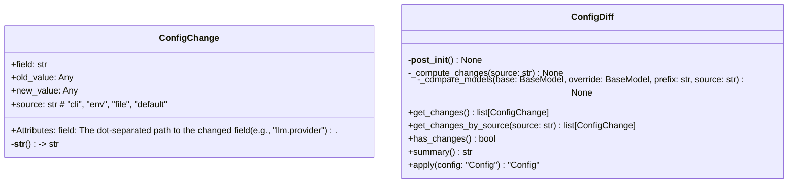
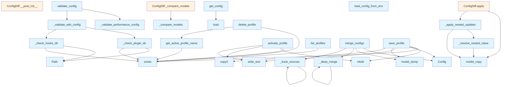

# File: `src/local_deepwiki/config/loader.py`

## File Overview

This file provides core functionality for managing application configuration in the `local_deepwiki` project. It handles loading, merging, validation, and persistence of configuration data, supporting multiple sources (CLI, environment, file, defaults) with a clear priority order. It also provides utilities for managing configuration profiles and context-based configuration overrides.

The module is designed to support a flexible, layered configuration system where settings can be overridden in a predictable order, and configuration changes can be tracked and applied programmatically.

## Key Concepts

### Configuration Merging and Priority

The configuration system uses a layered approach with explicit priority:

1. **Defaults**: The base configuration provided by the [`Config`](models.md) pydantic model.
2. **File**: Configuration loaded from a YAML file.
3. **Environment**: Configuration derived from environment variables.
4. **CLI**: Configuration passed as command-line arguments.

The `merge_configs` function orchestrates this process, using `_deep_merge` to recursively merge nested dictionaries and `_track_sources` to associate each field with its source for diff tracking.

### Context Management

Configuration is managed using `contextvars.ContextVar`, allowing for thread-safe, context-local configuration. This is useful for testing or per-request configuration overrides. The `config_context` context manager provides a clean way to temporarily override the global configuration.

### Configuration Validation

The module includes several validation functions that check for:

- Missing API keys for selected providers.
- Performance-sensitive settings that may cause issues (e.g., too many parallel workers).
- Validity of plugin and hook directory paths.
- Cloud-for-GitHub provider configuration.

These validations are combined in the `validate_config` function to provide a comprehensive check of the configuration's health.

### Profile Management

The system supports saving, activating, and deleting named configuration profiles. This allows users to maintain multiple configurations and switch between them easily. Profiles are stored as YAML files in a dedicated directory.

### Diff Tracking

The `ConfigDiff` class tracks changes between two configurations and provides utilities to inspect, summarize, and apply those changes. This is particularly useful for debugging and understanding how configuration sources interact.

## Integration

This file integrates deeply with the rest of the `local_deepwiki` configuration system:

- It imports and uses [`Config`](models.md) from `.models`, which defines the structure of the configuration.
- It depends on [`EmbeddingProviderType`](../models/provider_types.md) and [`LLMProviderType`](../models/provider_types.md) from `local_deepwiki.models.provider_types` to validate provider settings.
- It is used by several CLI components, including `config_validator.py`, `init_cli.py`, and `main.py`, for loading and validating configuration.
- Functions like `get_config`, `set_config`, and `config_context` are used throughout the application to access and override configuration in a context-aware manner.
- The file is part of the `local_deepwiki.config` package, indicating it's central to the configuration subsystem.

The functions `_set_nested_value`, `_apply_nested_updates`, and `merge_configs` are used by test utilities (`test_config_loader`, `test_config`) to simulate and verify configuration behavior.

## Design Notes

### Layered Configuration Priority

The design prioritizes CLI arguments over environment variables, which in turn override file settings, and finally fall back to defaults. This follows a common pattern where command-line arguments are meant to override everything, and environment variables are useful for deployment or containerization scenarios.

### Deep Merging

The `_deep_merge` function is a recursive utility that merges dictionaries, preserving nested structures. This is essential for handling complex configurations where fields like `llm` or `embedding` are nested pydantic models.

### ContextVar Usage

Using `ContextVar` for configuration enables safe concurrent access in multi-threaded environments. It allows for temporary overrides without affecting global state, which is crucial for testing and per-request configuration in web contexts.

### Validation as a Separate Layer

Validation is separated from configuration loading and merging. This modular approach allows validation to be reused in different contexts (e.g., on startup, on profile activation) and makes it easier to add new validation rules without modifying core logic.

### Profile Management

Profiles are stored as YAML files, making them human-readable and editable. The system supports both saving current configs and activating saved profiles, providing a practical way to manage different environments or use cases.

### Diff Tracking for Debugging

The `ConfigDiff` class allows developers and users to understand how their configuration changes are applied. This is particularly useful in debugging or when users want to see what settings have changed from defaults.

### Environment Variable Parsing

The `load_config_from_env` function supports parsing environment variables into a structured configuration. It intelligently converts string values to appropriate types (bool, int, float) based on their content, making it easier to use environment variables for configuration.

## API Reference

### class `ConfigChange`

Represents a single configuration change.  Attributes: field: The dot-separated path to the changed field (e.g., "llm.provider"). old_value: The previous value of the field. new_value: The new value of the field. source: The source of the change ("cli", "env", "file", "default").


<details>
<summary>View Source (lines 87-104) | <a href="https://github.com/UrbanDiver/local-deepwiki-mcp/blob/main/src/local_deepwiki/config/loader.py#L87-L104">GitHub</a></summary>

```python
class ConfigChange:
    """Represents a single configuration change.

    Attributes:
        field: The dot-separated path to the changed field (e.g., "llm.provider").
        old_value: The previous value of the field.
        new_value: The new value of the field.
        source: The source of the change ("cli", "env", "file", "default").
    """

    field: str
    old_value: Any
    new_value: Any
    source: str  # "cli", "env", "file", "default"

    def __str__(self) -> str:
        """Return a human-readable string representation."""
        return f"{self.field}: {self.old_value!r} -> {self.new_value!r} (from {self.source})"
```

</details>

### class `ConfigDiff`

Tracks differences between two configurations.  Useful for understanding what changed between config versions, debugging configuration issues, and auditing config changes.

**Methods:**


<details>
<summary>View Source (lines 108-240) | <a href="https://github.com/UrbanDiver/local-deepwiki-mcp/blob/main/src/local_deepwiki/config/loader.py#L108-L240">GitHub</a></summary>

```python
class ConfigDiff:
    # Methods: __post_init__, _compute_changes, _compare_models, get_changes, get_changes_by_source, has_changes, summary, apply
```

</details>

#### `get_changes`

```python
def get_changes() -> list[ConfigChange]
```

Return list of changed fields.


<details>
<summary>View Source (lines 178-184) | <a href="https://github.com/UrbanDiver/local-deepwiki-mcp/blob/main/src/local_deepwiki/config/loader.py#L178-L184">GitHub</a></summary>

```python
def get_changes(self) -> list[ConfigChange]:
        """Return list of changed fields.

        Returns:
            List of ConfigChange objects representing all differences.
        """
        return self.changes.copy()
```

</details>

#### `get_changes_by_source`

```python
def get_changes_by_source(source: str) -> list[ConfigChange]
```

Return changes from a specific source.


| Parameter | Type | Default | Description |
|-----------|------|---------|-------------|
| `source` | `str` | - | The source to filter by ("cli", "env", "file", "default"). |


<details>
<summary>View Source (lines 186-195) | <a href="https://github.com/UrbanDiver/local-deepwiki-mcp/blob/main/src/local_deepwiki/config/loader.py#L186-L195">GitHub</a></summary>

```python
def get_changes_by_source(self, source: str) -> list[ConfigChange]:
        """Return changes from a specific source.

        Args:
            source: The source to filter by ("cli", "env", "file", "default").

        Returns:
            List of ConfigChange objects from the specified source.
        """
        return [c for c in self.changes if c.source == source]
```

</details>

#### `has_changes`

```python
def has_changes() -> bool
```

Check if there are any changes.


<details>
<summary>View Source (lines 197-203) | <a href="https://github.com/UrbanDiver/local-deepwiki-mcp/blob/main/src/local_deepwiki/config/loader.py#L197-L203">GitHub</a></summary>

```python
def has_changes(self) -> bool:
        """Check if there are any changes.

        Returns:
            True if there are any differences between base and override.
        """
        return len(self.changes) > 0
```

</details>

#### `summary`

```python
def summary() -> str
```

Return a human-readable summary of changes.


<details>
<summary>View Source (lines 205-217) | <a href="https://github.com/UrbanDiver/local-deepwiki-mcp/blob/main/src/local_deepwiki/config/loader.py#L205-L217">GitHub</a></summary>

```python
def summary(self) -> str:
        """Return a human-readable summary of changes.

        Returns:
            A multi-line string summarizing all changes.
        """
        if not self.changes:
            return "No configuration changes"

        lines = [f"Configuration changes ({len(self.changes)} total):"]
        for change in self.changes:
            lines.append(f"  - {change}")
        return "\n".join(lines)
```

</details>

#### `apply`

```python
def apply(config: "Config") -> "Config"
```

Apply changes to a config.  Creates a new config with the changes applied. This is useful for applying a diff to a different base config.


| Parameter | Type | Default | Description |
|-----------|------|---------|-------------|
| `config` | `"Config"` | - | The config to apply changes to. |


---


<details>
<summary>View Source (lines 219-240) | <a href="https://github.com/UrbanDiver/local-deepwiki-mcp/blob/main/src/local_deepwiki/config/loader.py#L219-L240">GitHub</a></summary>

```python
def apply(self, config: "Config") -> "Config":
        """Apply changes to a config.

        Creates a new config with the changes applied. This is useful
        for applying a diff to a different base config.

        Args:
            config: The config to apply changes to.

        Returns:
            A new Config instance with changes applied.
        """
        if not self.changes:
            return config.model_copy()

        # Build update dict from changes
        updates: dict[str, Any] = {}
        for change in self.changes:
            parts = change.field.split(".")
            _set_nested_value(updates, parts, change.new_value)

        return _apply_nested_updates(config, updates)
```

</details>

### Functions

#### `get_config`

```python
def get_config() -> Config
```

Get the configuration instance.  Returns the context-local config, lazily loading from disk on first access.

**Returns:** [`Config`](models.md)


<details>
<summary>View Source (lines 23-35) | <a href="https://github.com/UrbanDiver/local-deepwiki-mcp/blob/main/src/local_deepwiki/config/loader.py#L23-L35">GitHub</a></summary>

```python
def get_config() -> Config:
    """Get the configuration instance.

    Returns the context-local config, lazily loading from disk on first access.

    Returns:
        The active configuration instance.
    """
    cfg = _config_var.get()
    if cfg is None:
        cfg = Config.load()
        _config_var.set(cfg)
    return cfg
```

</details>

#### `set_config`

```python
def set_config(config: Config) -> None
```

Set the configuration instance.


| Parameter | Type | Default | Description |
|-----------|------|---------|-------------|
| `config` | `Config` | - | The configuration to set. |

**Returns:** `None`


<details>
<summary>View Source (lines 38-44) | <a href="https://github.com/UrbanDiver/local-deepwiki-mcp/blob/main/src/local_deepwiki/config/loader.py#L38-L44">GitHub</a></summary>

```python
def set_config(config: Config) -> None:
    """Set the configuration instance.

    Args:
        config: The configuration to set.
    """
    _config_var.set(config)
```

</details>

#### `reset_config`

```python
def reset_config() -> None
```

Reset the configuration to uninitialized state.  Useful for testing to ensure a fresh config is loaded.

**Returns:** `None`


<details>
<summary>View Source (lines 47-52) | <a href="https://github.com/UrbanDiver/local-deepwiki-mcp/blob/main/src/local_deepwiki/config/loader.py#L47-L52">GitHub</a></summary>

```python
def reset_config() -> None:
    """Reset the configuration to uninitialized state.

    Useful for testing to ensure a fresh config is loaded.
    """
    _config_var.set(None)
```

</details>

#### `config_context`

`@contextmanager`

```python
def config_context(config: Config) -> Generator[Config, None, None]
```

Context manager for temporary config override.  Sets a temporary configuration that is restored when the context exits. Useful for testing or per-request config.


| Parameter | Type | Default | Description |
|-----------|------|---------|-------------|
| `config` | `Config` | - | The configuration to use within the context. |

**Returns:** `Generator[Config, None, None]`


<details>
<summary>View Source (lines 56-78) | <a href="https://github.com/UrbanDiver/local-deepwiki-mcp/blob/main/src/local_deepwiki/config/loader.py#L56-L78">GitHub</a></summary>

```python
def config_context(config: Config) -> Generator[Config, None, None]:
    """Context manager for temporary config override.

    Sets a temporary configuration that is restored when the context exits.
    Useful for testing or per-request config.

    Args:
        config: The configuration to use within the context.

    Yields:
        The provided configuration.

    Example:
        with config_context(custom_config):
            # get_config() returns custom_config here
            do_something()
        # get_config() returns previous config again
    """
    token = _config_var.set(config)
    try:
        yield config
    finally:
        _config_var.reset(token)
```

</details>

#### `merge_configs`

```python
def merge_configs(cli_config: dict[str, Any] | None = None, env_config: dict[str, Any] | None = None, file_config: dict[str, Any] | None = None, defaults: Config | None = None) -> tuple[Config, ConfigDiff]
```

Merge configs with CLI > env > file > defaults priority.  Creates a merged configuration by layering config sources in priority order, where CLI arguments have the highest priority and defaults have the lowest.


| Parameter | Type | Default | Description |
|-----------|------|---------|-------------|
| `cli_config` | `dict[str, Any] | None` | `None` | Configuration from command-line arguments. |
| `env_config` | `dict[str, Any] | None` | `None` | Configuration from environment variables. |
| `file_config` | `dict[str, Any] | None` | `None` | Configuration from config file. |
| `defaults` | `Config | None` | `None` | Default configuration (if None, uses Config()). |

**Returns:** `tuple[Config, ConfigDiff]`


<details>
<summary>View Source (lines 306-371) | <a href="https://github.com/UrbanDiver/local-deepwiki-mcp/blob/main/src/local_deepwiki/config/loader.py#L306-L371">GitHub</a></summary>

```python
def merge_configs(
    cli_config: dict[str, Any] | None = None,
    env_config: dict[str, Any] | None = None,
    file_config: dict[str, Any] | None = None,
    defaults: Config | None = None,
) -> tuple[Config, ConfigDiff]:
    """Merge configs with CLI > env > file > defaults priority.

    Creates a merged configuration by layering config sources in priority
    order, where CLI arguments have the highest priority and defaults
    have the lowest.

    Args:
        cli_config: Configuration from command-line arguments.
        env_config: Configuration from environment variables.
        file_config: Configuration from config file.
        defaults: Default configuration (if None, uses Config()).

    Returns:
        A tuple of (merged_config, diff) where diff shows all changes
        from defaults.

    Example:
        cli = {"llm": {"provider": "anthropic"}}
        env = {"embedding": {"provider": "openai"}}
        file = {"chunking": {"max_chunk_tokens": 1024}}

        config, diff = merge_configs(cli, env, file)
        print(diff.summary())
    """
    if defaults is None:
        defaults = Config()

    # Start with defaults
    merged_data: dict[str, Any] = defaults.model_dump()

    # Track sources for diff
    change_sources: dict[str, str] = {}

    # Apply file config (lowest priority of overrides)
    if file_config:
        _deep_merge(merged_data, file_config)
        _track_sources(file_config, "", change_sources, "file")

    # Apply env config (medium priority)
    if env_config:
        _deep_merge(merged_data, env_config)
        _track_sources(env_config, "", change_sources, "env")

    # Apply CLI config (highest priority)
    if cli_config:
        _deep_merge(merged_data, cli_config)
        _track_sources(cli_config, "", change_sources, "cli")

    # Create the merged config
    merged = Config.model_validate(merged_data)

    # Compute diff with source tracking
    diff = ConfigDiff(defaults, merged)

    # Update change sources in the diff
    for change in diff.changes:
        if change.field in change_sources:
            change.source = change_sources[change.field]

    return merged, diff
```

</details>

#### `validate_config`

```python
def validate_config(config: Config) -> list[str]
```

Return list of validation warnings/errors.  Performs comprehensive validation of a configuration and returns a list of any warnings or potential issues found.


| Parameter | Type | Default | Description |
|-----------|------|---------|-------------|
| `config` | `Config` | - | The configuration to validate. |

**Returns:** `list[str]`


<details>
<summary>View Source (lines 547-571) | <a href="https://github.com/UrbanDiver/local-deepwiki-mcp/blob/main/src/local_deepwiki/config/loader.py#L547-L571">GitHub</a></summary>

```python
def validate_config(config: Config) -> list[str]:
    """Return list of validation warnings/errors.

    Performs comprehensive validation of a configuration and returns
    a list of any warnings or potential issues found.

    Args:
        config: The configuration to validate.

    Returns:
        List of warning/error messages. Empty list means config is valid.

    Example:
        config = Config()
        warnings = validate_config(config)
        if warnings:
            for warning in warnings:
                print(f"Warning: {warning}")
    """
    return [
        *_validate_embedding_config(config),
        *_validate_llm_config(config),
        *_validate_performance_config(config),
        *_validate_wiki_config(config),
    ]
```

</details>

#### `load_config_from_env`

```python
def load_config_from_env() -> dict[str, Any]
```

Load configuration overrides from environment variables.  Environment variables follow the pattern: DEEPWIKI_<SECTION>_<FIELD>=value  For example: DEEPWIKI_LLM_PROVIDER=anthropic DEEPWIKI_EMBEDDING_PROVIDER=openai DEEPWIKI_CHUNKING_MAX_CHUNK_TOKENS=1024

**Returns:** `dict[str, Any]`


<details>
<summary>View Source (lines 574-618) | <a href="https://github.com/UrbanDiver/local-deepwiki-mcp/blob/main/src/local_deepwiki/config/loader.py#L574-L618">GitHub</a></summary>

```python
def load_config_from_env() -> dict[str, Any]:
    """Load configuration overrides from environment variables.

    Environment variables follow the pattern:
        DEEPWIKI_<SECTION>_<FIELD>=value

    For example:
        DEEPWIKI_LLM_PROVIDER=anthropic
        DEEPWIKI_EMBEDDING_PROVIDER=openai
        DEEPWIKI_CHUNKING_MAX_CHUNK_TOKENS=1024

    Returns:
        Dictionary of configuration overrides from environment.
    """
    env_config: dict[str, Any] = {}
    prefix = "DEEPWIKI_"

    for key, value in os.environ.items():
        if not key.startswith(prefix):
            continue

        # Parse the key: DEEPWIKI_SECTION_FIELD -> section.field
        parts = key[len(prefix) :].lower().split("_", 1)
        if len(parts) != 2:
            continue

        section, field = parts

        # Convert value to appropriate type
        parsed_value: Any
        if value.lower() in ("true", "false"):
            parsed_value = value.lower() == "true"
        elif value.isdigit():
            parsed_value = int(value)
        elif _is_float(value):
            parsed_value = float(value)
        else:
            parsed_value = value

        # Build nested dict
        if section not in env_config:
            env_config[section] = {}
        env_config[section][field] = parsed_value

    return env_config
```

</details>

#### `list_profiles`

```python
def list_profiles() -> list[str]
```

List all saved configuration profile names.

**Returns:** `list[str]`


<details>
<summary>View Source (lines 646-654) | <a href="https://github.com/UrbanDiver/local-deepwiki-mcp/blob/main/src/local_deepwiki/config/loader.py#L646-L654">GitHub</a></summary>

```python
def list_profiles() -> list[str]:
    """List all saved configuration profile names.

    Returns:
        Sorted list of profile names (without .yaml extension).
    """
    if not PROFILES_DIR.exists():
        return []
    return sorted(p.stem for p in PROFILES_DIR.glob("*.yaml"))
```

</details>

#### `get_active_profile_name`

```python
def get_active_profile_name() -> str | None
```

Get the name of the currently active profile.

**Returns:** `str | None`


<details>
<summary>View Source (lines 657-672) | <a href="https://github.com/UrbanDiver/local-deepwiki-mcp/blob/main/src/local_deepwiki/config/loader.py#L657-L672">GitHub</a></summary>

```python
def get_active_profile_name() -> str | None:
    """Get the name of the currently active profile.

    Returns:
        The active profile name, or None if no profile is active.
    """
    if not ACTIVE_PROFILE_FILE.exists():
        return None
    name = ACTIVE_PROFILE_FILE.read_text().strip()
    if not name:
        return None
    # Verify the profile still exists
    profile_path = PROFILES_DIR / f"{name}.yaml"
    if not profile_path.exists():
        return None
    return name
```

</details>

#### `save_profile`

```python
def save_profile(name: str, config_path: Path | None = None) -> Path
```

Save current configuration as a named profile.


| Parameter | Type | Default | Description |
|-----------|------|---------|-------------|
| `name` | `str` | - | Profile name (alphanumeric, hyphens, underscores). |
| `config_path` | `Path | None` | `None` | Path to config file to snapshot. If None, uses default location. |

**Returns:** `Path`


<details>
<summary>View Source (lines 675-720) | <a href="https://github.com/UrbanDiver/local-deepwiki-mcp/blob/main/src/local_deepwiki/config/loader.py#L675-L720">GitHub</a></summary>

```python
def save_profile(name: str, config_path: Path | None = None) -> Path:
    """Save current configuration as a named profile.

    Args:
        name: Profile name (alphanumeric, hyphens, underscores).
        config_path: Path to config file to snapshot. If None, uses default location.

    Returns:
        Path to the saved profile file.

    Raises:
        ValueError: If name contains invalid characters.
        FileNotFoundError: If no config file is found to snapshot.
    """
    import re
    import shutil

    if not re.match(r"^[a-zA-Z0-9_-]+$", name):
        raise ValueError(
            f"Invalid profile name '{name}': use only letters, numbers, hyphens, underscores"
        )

    # Find config file to snapshot
    if config_path is None:
        search_paths = [
            Path.cwd() / "config.yaml",
            Path.cwd() / ".local-deepwiki.yaml",
            CONFIG_DIR / "config.yaml",
            Path.home() / ".local-deepwiki.yaml",
        ]
        config_path = next((p for p in search_paths if p.exists()), None)

    if config_path is None or not config_path.exists():
        # No config file found - save defaults
        PROFILES_DIR.mkdir(parents=True, exist_ok=True)
        profile_path = PROFILES_DIR / f"{name}.yaml"
        default_config = Config()
        profile_path.write_text(
            yaml.dump(default_config.model_dump(), default_flow_style=False)
        )
        return profile_path

    PROFILES_DIR.mkdir(parents=True, exist_ok=True)
    profile_path = PROFILES_DIR / f"{name}.yaml"
    shutil.copy2(config_path, profile_path)
    return profile_path
```

</details>

#### `activate_profile`

```python
def activate_profile(name: str) -> None
```

Activate a saved configuration profile.  Copies the profile's YAML to the main config location and records the active profile name.


| Parameter | Type | Default | Description |
|-----------|------|---------|-------------|
| `name` | `str` | - | Profile name to activate. |

**Returns:** `None`


<details>
<summary>View Source (lines 723-747) | <a href="https://github.com/UrbanDiver/local-deepwiki-mcp/blob/main/src/local_deepwiki/config/loader.py#L723-L747">GitHub</a></summary>

```python
def activate_profile(name: str) -> None:
    """Activate a saved configuration profile.

    Copies the profile's YAML to the main config location and records
    the active profile name.

    Args:
        name: Profile name to activate.

    Raises:
        FileNotFoundError: If the profile does not exist.
    """
    import shutil

    profile_path = PROFILES_DIR / f"{name}.yaml"
    if not profile_path.exists():
        raise FileNotFoundError(f"Profile '{name}' not found")

    config_dest = CONFIG_DIR / "config.yaml"
    CONFIG_DIR.mkdir(parents=True, exist_ok=True)
    shutil.copy2(profile_path, config_dest)
    ACTIVE_PROFILE_FILE.write_text(name)

    # Reset cached config so next get_config() loads the new profile
    reset_config()
```

</details>

#### `delete_profile`

```python
def delete_profile(name: str) -> bool
```

Delete a saved configuration profile.


| Parameter | Type | Default | Description |
|-----------|------|---------|-------------|
| `name` | `str` | - | Profile name to delete. |

**Returns:** `bool`


<details>
<summary>View Source (lines 750-773) | <a href="https://github.com/UrbanDiver/local-deepwiki-mcp/blob/main/src/local_deepwiki/config/loader.py#L750-L773">GitHub</a></summary>

```python
def delete_profile(name: str) -> bool:
    """Delete a saved configuration profile.

    Args:
        name: Profile name to delete.

    Returns:
        True if the profile was deleted, False if it didn't exist.
    """
    profile_path = PROFILES_DIR / f"{name}.yaml"
    if not profile_path.exists():
        return False

    # Check if this is the active profile BEFORE deleting
    active_name = get_active_profile_name()

    profile_path.unlink()

    # Clear active profile marker if this was the active one
    if active_name == name:
        if ACTIVE_PROFILE_FILE.exists():
            ACTIVE_PROFILE_FILE.unlink()

    return True
```

</details>

## Class Diagram



## Call Graph



## Used By

Functions and methods in this file and their callers:

- **[`Config`](models.md)**: called by `merge_configs`, `save_profile`
- **`ConfigChange`**: called by `ConfigDiff._compare_models`
- **`ConfigDiff`**: called by `merge_configs`
- **`FileNotFoundError`**: called by `activate_profile`
- **`Path`**: called by `_check_hooks_dir`, `_check_plugin_dir`
- **`ValueError`**: called by `save_profile`
- **`__setattr__`**: called by `ConfigDiff.__post_init__`
- **`_apply_nested_updates`**: called by `ConfigDiff.apply`
- **`_check_cloud_github_provider`**: called by `_validate_wiki_config`
- **`_check_hooks_dir`**: called by `_validate_wiki_config`
- **`_check_plugin_dir`**: called by `_validate_wiki_config`
- **`_compare_models`**: called by `ConfigDiff._compare_models`, `ConfigDiff._compute_changes`
- **`_compute_changes`**: called by `ConfigDiff.__post_init__`
- **`_deep_merge`**: called by `_deep_merge`, `merge_configs`
- **`_is_float`**: called by `load_config_from_env`
- **`_resolve_nested_value`**: called by `_apply_nested_updates`
- **`_set_nested_value`**: called by `ConfigDiff.apply`
- **`_track_sources`**: called by `_track_sources`, `merge_configs`
- **`_validate_embedding_config`**: called by `validate_config`
- **`_validate_llm_config`**: called by `validate_config`
- **`_validate_performance_config`**: called by `validate_config`
- **`_validate_wiki_config`**: called by `validate_config`
- **`copy`**: called by `ConfigDiff.get_changes`
- **`copy2`**: called by `activate_profile`, `save_profile`
- **`cpu_count`**: called by `_validate_performance_config`
- **`cwd`**: called by `save_profile`
- **`dump`**: called by `save_profile`
- **`exists`**: called by `_check_hooks_dir`, `_check_plugin_dir`, `activate_profile`, `delete_profile`, `get_active_profile_name`, `list_profiles`, `save_profile`
- **`get_active_profile_name`**: called by `delete_profile`
- **`glob`**: called by `list_profiles`
- **`home`**: called by `save_profile`
- **`isdigit`**: called by `load_config_from_env`
- **`load`**: called by `get_config`
- **`match`**: called by `save_profile`
- **`mkdir`**: called by `activate_profile`, `save_profile`
- **`model_copy`**: called by `ConfigDiff.apply`, `_apply_nested_updates`, `_resolve_nested_value`
- **`model_dump`**: called by `merge_configs`, `save_profile`
- **`model_validate`**: called by `merge_configs`
- **`read_text`**: called by `get_active_profile_name`
- **`reset`**: called by `config_context`
- **`reset_config`**: called by `activate_profile`
- **`unlink`**: called by `delete_profile`
- **`write_text`**: called by `activate_profile`, `save_profile`

## Last Modified

| Entity | Type | Author | Date | Commit |
|--------|------|--------|------|--------|
| `_resolve_nested_value` | function | Brian Breidenbach | yesterday | `ca3ccca` refactor: flatten deep nest... |
| `_apply_nested_updates` | function | Brian Breidenbach | yesterday | `ca3ccca` refactor: flatten deep nest... |
| `_check_cloud_github_provider` | function | Brian Breidenbach | 2 days ago | `3e353f8` refactor: decompose CC > 15... |
| `_check_plugin_dir` | function | Brian Breidenbach | 2 days ago | `3e353f8` refactor: decompose CC > 15... |
| `_check_hooks_dir` | function | Brian Breidenbach | 2 days ago | `3e353f8` refactor: decompose CC > 15... |
| `_validate_wiki_config` | function | Brian Breidenbach | 2 days ago | `3e353f8` refactor: decompose CC > 15... |
| `_validate_embedding_config` | function | Brian Breidenbach | 1 week ago | `ed42442` refactor: split 10+ long me... |
| `_validate_llm_config` | function | Brian Breidenbach | 1 week ago | `ed42442` refactor: split 10+ long me... |
| `_validate_performance_config` | function | Brian Breidenbach | 1 week ago | `ed42442` refactor: split 10+ long me... |
| `validate_config` | function | Brian Breidenbach | 1 week ago | `ed42442` refactor: split 10+ long me... |
| `get_config` | function | Brian Breidenbach | Feb 22, 2026 | `78abcdc` refactor: replace global si... |
| `set_config` | function | Brian Breidenbach | Feb 22, 2026 | `78abcdc` refactor: replace global si... |
| `reset_config` | function | Brian Breidenbach | Feb 22, 2026 | `78abcdc` refactor: replace global si... |
| `config_context` | function | Brian Breidenbach | Feb 22, 2026 | `78abcdc` refactor: replace global si... |
| `list_profiles` | function | Brian Breidenbach | Feb 10, 2026 | `f48b95c` feat: add unified CLI, cach... |
| `get_active_profile_name` | function | Brian Breidenbach | Feb 10, 2026 | `f48b95c` feat: add unified CLI, cach... |
| `save_profile` | function | Brian Breidenbach | Feb 10, 2026 | `f48b95c` feat: add unified CLI, cach... |
| `activate_profile` | function | Brian Breidenbach | Feb 10, 2026 | `f48b95c` feat: add unified CLI, cach... |
| `delete_profile` | function | Brian Breidenbach | Feb 10, 2026 | `f48b95c` feat: add unified CLI, cach... |
| `ConfigChange` | class | Brian Breidenbach | Feb 09, 2026 | `89de2db` refactor: split vectorstore... |
| `ConfigDiff` | class | Brian Breidenbach | Feb 09, 2026 | `89de2db` refactor: split vectorstore... |
| `__post_init__` | method | Brian Breidenbach | Feb 09, 2026 | `89de2db` refactor: split vectorstore... |
| `_compute_changes` | method | Brian Breidenbach | Feb 09, 2026 | `89de2db` refactor: split vectorstore... |
| `_compare_models` | method | Brian Breidenbach | Feb 09, 2026 | `89de2db` refactor: split vectorstore... |
| `get_changes` | method | Brian Breidenbach | Feb 09, 2026 | `89de2db` refactor: split vectorstore... |
| `get_changes_by_source` | method | Brian Breidenbach | Feb 09, 2026 | `89de2db` refactor: split vectorstore... |
| `has_changes` | method | Brian Breidenbach | Feb 09, 2026 | `89de2db` refactor: split vectorstore... |
| `summary` | method | Brian Breidenbach | Feb 09, 2026 | `89de2db` refactor: split vectorstore... |
| `apply` | method | Brian Breidenbach | Feb 09, 2026 | `89de2db` refactor: split vectorstore... |
| `_set_nested_value` | function | Brian Breidenbach | Feb 09, 2026 | `89de2db` refactor: split vectorstore... |
| `merge_configs` | function | Brian Breidenbach | Feb 09, 2026 | `89de2db` refactor: split vectorstore... |
| `_deep_merge` | function | Brian Breidenbach | Feb 09, 2026 | `89de2db` refactor: split vectorstore... |
| `_track_sources` | function | Brian Breidenbach | Feb 09, 2026 | `89de2db` refactor: split vectorstore... |
| `load_config_from_env` | function | Brian Breidenbach | Feb 09, 2026 | `89de2db` refactor: split vectorstore... |
| `_is_float` | function | Brian Breidenbach | Feb 09, 2026 | `89de2db` refactor: split vectorstore... |

## Additional Source Code

Source code for functions and methods not listed in the API Reference above.

#### `__post_init__`

<details>
<summary>View Source (lines 127-131) | <a href="https://github.com/UrbanDiver/local-deepwiki-mcp/blob/main/src/local_deepwiki/config/loader.py#L127-L131">GitHub</a></summary>

```python
def __post_init__(self) -> None:
        """Compute changes after initialization."""
        if not self._computed:
            self._compute_changes()
            object.__setattr__(self, "_computed", True)
```

</details>


#### `_compute_changes`

<details>
<summary>View Source (lines 133-139) | <a href="https://github.com/UrbanDiver/local-deepwiki-mcp/blob/main/src/local_deepwiki/config/loader.py#L133-L139">GitHub</a></summary>

```python
def _compute_changes(self, source: str = "override") -> None:
        """Compute the differences between base and override configs.

        Args:
            source: The source label for changes (default: "override").
        """
        self._compare_models(self.base, self.override, "", source)
```

</details>


#### `_compare_models`

<details>
<summary>View Source (lines 141-176) | <a href="https://github.com/UrbanDiver/local-deepwiki-mcp/blob/main/src/local_deepwiki/config/loader.py#L141-L176">GitHub</a></summary>

```python
def _compare_models(
        self,
        base: BaseModel,
        override: BaseModel,
        prefix: str,
        source: str,
    ) -> None:
        """Recursively compare two Pydantic models.

        Args:
            base: The base model to compare from.
            override: The override model to compare to.
            prefix: The current field path prefix.
            source: The source label for changes.
        """
        # Get field names from the class (excluding computed fields)
        for field_name in type(base).model_fields:
            base_value = getattr(base, field_name)
            override_value = getattr(override, field_name)

            field_path = f"{prefix}.{field_name}" if prefix else field_name

            if isinstance(base_value, BaseModel) and isinstance(
                override_value, BaseModel
            ):
                # Recursively compare nested models
                self._compare_models(base_value, override_value, field_path, source)
            elif base_value != override_value:
                self.changes.append(
                    ConfigChange(
                        field=field_path,
                        old_value=base_value,
                        new_value=override_value,
                        source=source,
                    )
                )
```

</details>


#### `_set_nested_value`

<details>
<summary>View Source (lines 243-255) | <a href="https://github.com/UrbanDiver/local-deepwiki-mcp/blob/main/src/local_deepwiki/config/loader.py#L243-L255">GitHub</a></summary>

```python
def _set_nested_value(d: dict[str, Any], path: list[str], value: Any) -> None:
    """Set a nested value in a dictionary using a path.

    Args:
        d: The dictionary to update.
        path: List of keys representing the path.
        value: The value to set.
    """
    for key in path[:-1]:
        if key not in d:
            d[key] = {}
        d = d[key]
    d[path[-1]] = value
```

</details>


#### `_resolve_nested_value`

<details>
<summary>View Source (lines 258-267) | <a href="https://github.com/UrbanDiver/local-deepwiki-mcp/blob/main/src/local_deepwiki/config/loader.py#L258-L267">GitHub</a></summary>

```python
def _resolve_nested_value(
    current_model: BaseModel, nested_key: str, nested_value: Any
) -> Any:
    """Resolve a single nested update against an existing BaseModel field."""
    if not isinstance(nested_value, dict):
        return nested_value
    nested_current = getattr(current_model, nested_key, None)
    if nested_current is not None and isinstance(nested_current, BaseModel):
        return nested_current.model_copy(update=nested_value)
    return nested_value
```

</details>


#### `_apply_nested_updates`

<details>
<summary>View Source (lines 270-298) | <a href="https://github.com/UrbanDiver/local-deepwiki-mcp/blob/main/src/local_deepwiki/config/loader.py#L270-L298">GitHub</a></summary>

```python
def _apply_nested_updates(config: "Config", updates: dict[str, Any]) -> "Config":
    """Apply nested updates to a config.

    Args:
        config: The config to update.
        updates: Dictionary of updates to apply.

    Returns:
        A new Config with updates applied.
    """
    model_updates: dict[str, Any] = {}

    for key, value in updates.items():
        if not isinstance(value, dict):
            model_updates[key] = value
            continue

        current = getattr(config, key, None)
        if current is None or not isinstance(current, BaseModel):
            model_updates[key] = value
            continue

        # Recursively apply to nested model
        nested_updates = {
            nk: _resolve_nested_value(current, nk, nv) for nk, nv in value.items()
        }
        model_updates[key] = current.model_copy(update=nested_updates)

    return config.model_copy(update=model_updates)
```

</details>


#### `_deep_merge`

<details>
<summary>View Source (lines 374-385) | <a href="https://github.com/UrbanDiver/local-deepwiki-mcp/blob/main/src/local_deepwiki/config/loader.py#L374-L385">GitHub</a></summary>

```python
def _deep_merge(base: dict[str, Any], override: dict[str, Any]) -> None:
    """Deep merge override into base dictionary.

    Args:
        base: The base dictionary to merge into (modified in-place).
        override: The dictionary to merge from.
    """
    for key, value in override.items():
        if key in base and isinstance(base[key], dict) and isinstance(value, dict):
            _deep_merge(base[key], value)
        else:
            base[key] = value
```

</details>


#### `_track_sources`

<details>
<summary>View Source (lines 388-407) | <a href="https://github.com/UrbanDiver/local-deepwiki-mcp/blob/main/src/local_deepwiki/config/loader.py#L388-L407">GitHub</a></summary>

```python
def _track_sources(
    config: dict[str, Any],
    prefix: str,
    sources: dict[str, str],
    source: str,
) -> None:
    """Track the source of each config field.

    Args:
        config: The config dictionary.
        prefix: Current field path prefix.
        sources: Dictionary mapping field paths to sources.
        source: The source label for this config.
    """
    for key, value in config.items():
        field_path = f"{prefix}.{key}" if prefix else key
        if isinstance(value, dict):
            _track_sources(value, field_path, sources, source)
        else:
            sources[field_path] = source
```

</details>


#### `_validate_embedding_config`

<details>
<summary>View Source (lines 415-430) | <a href="https://github.com/UrbanDiver/local-deepwiki-mcp/blob/main/src/local_deepwiki/config/loader.py#L415-L430">GitHub</a></summary>

```python
def _validate_embedding_config(config: Config) -> list[str]:
    """Return warnings for embedding provider configuration.

    Args:
        config: The configuration to validate.

    Returns:
        List of warning messages (may be empty).
    """
    warnings: list[str] = []
    if config.embedding.provider == EmbeddingProviderType.OPENAI:
        if not os.environ.get("OPENAI_API_KEY"):
            warnings.append(
                "OpenAI embedding provider selected but OPENAI_API_KEY not set"
            )
    return warnings
```

</details>


#### `_validate_llm_config`

<details>
<summary>View Source (lines 433-451) | <a href="https://github.com/UrbanDiver/local-deepwiki-mcp/blob/main/src/local_deepwiki/config/loader.py#L433-L451">GitHub</a></summary>

```python
def _validate_llm_config(config: Config) -> list[str]:
    """Return warnings for LLM provider configuration.

    Args:
        config: The configuration to validate.

    Returns:
        List of warning messages (may be empty).
    """
    warnings: list[str] = []
    if config.llm.provider == LLMProviderType.ANTHROPIC:
        if not os.environ.get("ANTHROPIC_API_KEY"):
            warnings.append(
                "Anthropic LLM provider selected but ANTHROPIC_API_KEY not set"
            )
    elif config.llm.provider == LLMProviderType.OPENAI:
        if not os.environ.get("OPENAI_API_KEY"):
            warnings.append("OpenAI LLM provider selected but OPENAI_API_KEY not set")
    return warnings
```

</details>


#### `_validate_performance_config`

<details>
<summary>View Source (lines 454-484) | <a href="https://github.com/UrbanDiver/local-deepwiki-mcp/blob/main/src/local_deepwiki/config/loader.py#L454-L484">GitHub</a></summary>

```python
def _validate_performance_config(config: Config) -> list[str]:
    """Return warnings for performance-sensitive configuration values.

    Args:
        config: The configuration to validate.

    Returns:
        List of warning messages (may be empty).
    """
    warnings: list[str] = []
    if config.chunking.parallel_workers > (os.cpu_count() or 4):
        warnings.append(
            f"parallel_workers ({config.chunking.parallel_workers}) exceeds "
            f"CPU count ({os.cpu_count() or 4}), may cause contention"
        )
    if config.embedding_batch.batch_size > 100 and config.embedding.provider != "local":
        warnings.append(
            f"Large embedding batch_size ({config.embedding_batch.batch_size}) "
            "with API provider may cause rate limiting"
        )
    if config.deep_research.max_total_chunks > 50:
        warnings.append(
            f"Large max_total_chunks ({config.deep_research.max_total_chunks}) "
            "may cause high memory usage during research"
        )
    if config.embedding_cache.enabled and config.embedding_cache.max_entries > 500000:
        warnings.append(
            f"Very large embedding cache max_entries "
            f"({config.embedding_cache.max_entries}) may cause high memory usage"
        )
    return warnings
```

</details>


#### `_check_cloud_github_provider`

<details>
<summary>View Source (lines 487-504) | <a href="https://github.com/UrbanDiver/local-deepwiki-mcp/blob/main/src/local_deepwiki/config/loader.py#L487-L504">GitHub</a></summary>

```python
def _check_cloud_github_provider(config: Config) -> list[str]:
    """Return warnings for cloud-for-github provider key configuration."""
    warnings: list[str] = []
    if not config.wiki.use_cloud_for_github:
        return warnings
    provider = config.wiki.github_llm_provider
    if provider == "anthropic":
        if not os.environ.get("ANTHROPIC_API_KEY"):
            warnings.append(
                "use_cloud_for_github enabled with anthropic but "
                "ANTHROPIC_API_KEY not set"
            )
    elif provider == "openai":
        if not os.environ.get("OPENAI_API_KEY"):
            warnings.append(
                "use_cloud_for_github enabled with openai but OPENAI_API_KEY not set"
            )
    return warnings
```

</details>


#### `_check_plugin_dir`

<details>
<summary>View Source (lines 507-516) | <a href="https://github.com/UrbanDiver/local-deepwiki-mcp/blob/main/src/local_deepwiki/config/loader.py#L507-L516">GitHub</a></summary>

```python
def _check_plugin_dir(config: Config) -> list[str]:
    """Return warnings for missing custom plugin directory."""
    if not config.plugins.enabled:
        return []
    if not config.plugins.custom_dir:
        return []
    custom_path = Path(config.plugins.custom_dir)
    if not custom_path.exists():
        return [f"Custom plugins directory does not exist: {custom_path}"]
    return []
```

</details>


#### `_check_hooks_dir`

<details>
<summary>View Source (lines 519-528) | <a href="https://github.com/UrbanDiver/local-deepwiki-mcp/blob/main/src/local_deepwiki/config/loader.py#L519-L528">GitHub</a></summary>

```python
def _check_hooks_dir(config: Config) -> list[str]:
    """Return warnings for missing hook scripts directory."""
    if not config.hooks.enabled:
        return []
    if not config.hooks.scripts_dir:
        return []
    scripts_path = Path(config.hooks.scripts_dir)
    if not scripts_path.exists():
        return [f"Hook scripts directory does not exist: {scripts_path}"]
    return []
```

</details>


#### `_validate_wiki_config`

<details>
<summary>View Source (lines 531-544) | <a href="https://github.com/UrbanDiver/local-deepwiki-mcp/blob/main/src/local_deepwiki/config/loader.py#L531-L544">GitHub</a></summary>

```python
def _validate_wiki_config(config: Config) -> list[str]:
    """Return warnings for wiki and plugin/hook configuration.

    Args:
        config: The configuration to validate.

    Returns:
        List of warning messages (may be empty).
    """
    return [
        *_check_cloud_github_provider(config),
        *_check_plugin_dir(config),
        *_check_hooks_dir(config),
    ]
```

</details>


#### `_is_float`

<details>
<summary>View Source (lines 621-634) | <a href="https://github.com/UrbanDiver/local-deepwiki-mcp/blob/main/src/local_deepwiki/config/loader.py#L621-L634">GitHub</a></summary>

```python
def _is_float(s: str) -> bool:
    """Check if string can be converted to float.

    Args:
        s: The string to check.

    Returns:
        True if the string represents a float.
    """
    try:
        float(s)
        return "." in s  # Only consider it float if it has a decimal point
    except ValueError:
        return False
```

</details>

## Relevant Source Files

- `src/local_deepwiki/config/loader.py:87-104`
