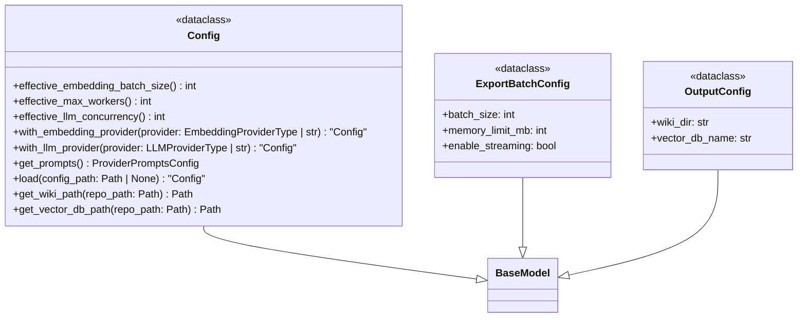
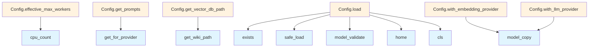

# File: `src/local_deepwiki/config/models.py`

## File Overview

This file defines the core configuration models for the `local_deepwiki` project using pydantic. It serves as the central configuration schema that governs how the application behaves, including embedding and LLM provider settings, search configurations, output paths, and batch processing parameters.

The module is designed to be a single point of truth for configuration, aggregating various domain-specific configurations from submodules (`models_embedding`, `models_llm`, `models_search`, `models_wiki`) into a unified `Config` class. This structure supports modular development and ensures type safety and validation through pydantic's model system.

## Key Concepts

### Configuration Composition
The `Config` class aggregates several specialized configuration models:
- [`EmbeddingConfig`](provider_models.md), [`LLMConfig`](provider_models.md), and related cache configurations from `models_embedding` and `models_llm`
- [`SearchConfig`](models_search.md), [`GraphRAGConfig`](models_search.md), and other search-related models from `models_search`
- [`WikiConfig`](models_wiki.md), [`ParsingConfig`](models_wiki.md), and other wiki generation settings from `models_wiki`
- Prompt configurations from `prompts` and provider-specific models from `provider_models`

This composition allows for fine-grained control over each subsystem while maintaining a consistent interface for the application.

### Dynamic Configuration Resolution
The `Config` class includes several computed fields and methods that dynamically adjust behavior based on configuration values:
- `effective_embedding_batch_size`: Adjusts batch size depending on whether the embedding provider is local or API-based.
- `effective_max_workers`: Limits worker count to available CPU cores.
- `effective_llm_concurrency`: Adjusts concurrency limits based on the LLM provider type.

These methods ensure optimal performance and resource usage across different hardware and provider environments.

### Configuration Loading and Defaults
The `load` method provides flexible configuration loading:
- Loads from a specified path if provided and exists.
- Falls back to default paths in the user's home directory.
- Uses default values if no configuration is found.

This design allows for easy setup and customization without requiring explicit configuration files in all cases.

## Integration

This file is a core module in the `local_deepwiki.config` package and is used extensively throughout the application:
- **Called by**: The `Config` class is used by CLI tools (`config_cli`, `init_cli`, `main.py`), configuration loader (`loader.py`), and various components that require access to configuration values (`models_wiki`, `models_search`, etc.).
- **Imports**: It imports from submodules like `models_embedding`, `models_llm`, `models_search`, `models_wiki`, `processing_models`, `prompts`, and `provider_models`. These imports bring in the various domain-specific configurations and provider types.
- **Related Files**: The `Config` class and its associated models are used by:
  - `src/local_deepwiki/cli/config_validator.py` for validating configuration.
  - `src/local_deepwiki/cli/init_cli.py` for initializing configurations.
  - `src/local_deepwiki/config/loader.py` for loading configurations.
  - `src/local_deepwiki/models/wiki.py` and other modules that require configuration for wiki generation.

This tight integration ensures that configuration is consistently enforced and available across the application.

## Design Notes

### Why pydantic?
pydantic is chosen for its robust data validation, type hinting, and automatic serialization/deserialization capabilities. It enables:
- Validation of configuration values at runtime.
- Clear documentation of expected types and defaults.
- Seamless integration with CLI tools and configuration files.

### Why Computed Fields and Methods?
Computed fields and methods like `effective_embedding_batch_size` and `effective_max_workers` are used to encapsulate logic that adjusts behavior based on configuration. This avoids hardcoding values and ensures that the application adapts to different environments and provider types without requiring manual updates.

### Why Default Paths for Configuration Loading?
The fallback to default paths (e.g., `~/.config/local-deepwiki/config.yaml`, `~/.local-deepwiki.yaml`) ensures that users can run the tool out-of-the-box without needing to create a configuration file, while still allowing for customization.

### Why Frozen Models?
The `model_config = {"frozen": True}` in `ExportBatchConfig` and `OutputConfig` ensures immutability of these configuration values. This prevents accidental modification after initialization, which is important for consistent behavior across the application lifecycle.

### Why `with_*` Methods?
Methods like `with_embedding_provider` and `with_llm_provider` return new instances of `Config` with updated values. This functional approach ensures immutability and is useful for creating specialized configurations without side effects.

## API Reference

### class `ExportBatchConfig`

**Inherits from:** `BaseModel`

Export configuration for HTML and PDF generation.


<details>
<summary>View Source (lines 70-92) | <a href="https://github.com/UrbanDiver/local-deepwiki-mcp/blob/main/src/local_deepwiki/config/models.py#L70-L92">GitHub</a></summary>

```python
class ExportBatchConfig(BaseModel):
    """Export configuration for HTML and PDF generation."""

    model_config = {"frozen": True}

    batch_size: int = Field(
        default=50,
        ge=1,
        le=500,
        description="Pages per batch for PDF generation in streaming mode",
    )
    memory_limit_mb: int = Field(
        default=500,
        ge=100,
        le=4096,
        description="Memory threshold to trigger streaming mode (MB). "
        "Wikis larger than this will use streaming export.",
    )
    enable_streaming: bool = Field(
        default=True,
        description="Enable streaming mode for large wikis. "
        "When enabled, pages are processed one at a time to avoid OOM.",
    )
```

</details>

### class `OutputConfig`

**Inherits from:** `BaseModel`

Output configuration.


<details>
<summary>View Source (lines 95-103) | <a href="https://github.com/UrbanDiver/local-deepwiki-mcp/blob/main/src/local_deepwiki/config/models.py#L95-L103">GitHub</a></summary>

```python
class OutputConfig(BaseModel):
    """Output configuration."""

    model_config = {"frozen": True}

    wiki_dir: str = Field(default=".deepwiki", description="Wiki output directory name")
    vector_db_name: str = Field(
        default="vectors.lance", description="Vector DB filename"
    )
```

</details>

### class `Config`

**Inherits from:** `BaseModel`

Main configuration.  This class and all nested config classes are frozen (immutable) to prevent accidental mutation of shared configuration state. Use model_copy(update={...}) or the with_*() helper methods to create modified copies.

**Methods:**


<details>
<summary>View Source (lines 106-257) | <a href="https://github.com/UrbanDiver/local-deepwiki-mcp/blob/main/src/local_deepwiki/config/models.py#L106-L257">GitHub</a></summary>

```python
class Config(BaseModel):
    # Methods: effective_embedding_batch_size, effective_max_workers, effective_llm_concurrency, with_embedding_provider, with_llm_provider, get_prompts, load, get_wiki_path, get_vector_db_path
```

</details>

#### `effective_embedding_batch_size`

```python
def effective_embedding_batch_size() -> int
```

Compute optimal batch size based on provider and memory.  Local providers can handle larger batches, while API providers should use smaller batches to avoid rate limits and timeouts.


<details>
<summary>View Source (lines 139-156) | <a href="https://github.com/UrbanDiver/local-deepwiki-mcp/blob/main/src/local_deepwiki/config/models.py#L139-L156">GitHub</a></summary>

```python
def effective_embedding_batch_size(self) -> int:
        """Compute optimal batch size based on provider and memory.

        Local providers can handle larger batches, while API providers
        should use smaller batches to avoid rate limits and timeouts.

        Returns:
            Optimal batch size for the current embedding provider.
        """
        base_batch_size = self.embedding_batch.batch_size

        # Local providers can handle larger batches
        if self.embedding.provider == EmbeddingProviderType.LOCAL:
            # Local models benefit from larger batches for throughput
            return min(base_batch_size, 200)
        else:
            # API providers need smaller batches to avoid rate limits
            return min(base_batch_size, 50)
```

</details>

#### `effective_max_workers`

```python
def effective_max_workers() -> int
```

Compute worker count based on CPU cores.  Ensures we do not exceed available CPU cores while respecting user configuration.


<details>
<summary>View Source (lines 160-173) | <a href="https://github.com/UrbanDiver/local-deepwiki-mcp/blob/main/src/local_deepwiki/config/models.py#L160-L173">GitHub</a></summary>

```python
def effective_max_workers(self) -> int:
        """Compute worker count based on CPU cores.

        Ensures we do not exceed available CPU cores while respecting
        user configuration.

        Returns:
            Optimal worker count for parallel processing.
        """
        cpu_count = os.cpu_count() or 4
        configured_workers = self.chunking.parallel_workers

        # Do not exceed CPU count, but also consider configured maximum
        return min(configured_workers, cpu_count)
```

</details>

#### `effective_llm_concurrency`

```python
def effective_llm_concurrency() -> int
```

Compute effective LLM concurrency based on provider.  Local models (Ollama) run on a single GPU and benefit from limited parallelism (2-3 concurrent requests). Cloud providers handle higher concurrency but may have rate limits.


<details>
<summary>View Source (lines 177-194) | <a href="https://github.com/UrbanDiver/local-deepwiki-mcp/blob/main/src/local_deepwiki/config/models.py#L177-L194">GitHub</a></summary>

```python
def effective_llm_concurrency(self) -> int:
        """Compute effective LLM concurrency based on provider.

        Local models (Ollama) run on a single GPU and benefit from limited
        parallelism (2-3 concurrent requests). Cloud providers handle higher
        concurrency but may have rate limits.

        Returns:
            Optimal LLM concurrency for the current provider.
        """
        base_concurrency = self.wiki.max_concurrent_llm_calls

        # Local models: single GPU, limit concurrency to avoid OOM/thrashing
        if self.llm.provider == LLMProviderType.OLLAMA:
            return min(base_concurrency, self.wiki.ollama_max_concurrent)

        # Cloud providers: allow higher concurrency, cap at configured limit
        return base_concurrency
```

</details>

#### `with_embedding_provider`

```python
def with_embedding_provider(provider: EmbeddingProviderType | str) -> "Config"
```

Return a new Config with the embedding provider changed.


| Parameter | Type | Default | Description |
|-----------|------|---------|-------------|
| `provider` | `EmbeddingProviderType | str` | - | The embedding provider to use. |


<details>
<summary>View Source (lines 196-208) | <a href="https://github.com/UrbanDiver/local-deepwiki-mcp/blob/main/src/local_deepwiki/config/models.py#L196-L208">GitHub</a></summary>

```python
def with_embedding_provider(
        self, provider: EmbeddingProviderType | str
    ) -> "Config":
        """Return a new Config with the embedding provider changed.

        Args:
            provider: The embedding provider to use.

        Returns:
            A new Config instance with the updated embedding provider.
        """
        new_embedding = self.embedding.model_copy(update={"provider": provider})
        return self.model_copy(update={"embedding": new_embedding})
```

</details>

#### `with_llm_provider`

```python
def with_llm_provider(provider: LLMProviderType | str) -> "Config"
```

Return a new Config with the LLM provider changed.


| Parameter | Type | Default | Description |
|-----------|------|---------|-------------|
| `provider` | `LLMProviderType | str` | - | The LLM provider to use. |


<details>
<summary>View Source (lines 210-220) | <a href="https://github.com/UrbanDiver/local-deepwiki-mcp/blob/main/src/local_deepwiki/config/models.py#L210-L220">GitHub</a></summary>

```python
def with_llm_provider(self, provider: LLMProviderType | str) -> "Config":
        """Return a new Config with the LLM provider changed.

        Args:
            provider: The LLM provider to use.

        Returns:
            A new Config instance with the updated LLM provider.
        """
        new_llm = self.llm.model_copy(update={"provider": provider})
        return self.model_copy(update={"llm": new_llm})
```

</details>

#### `get_prompts`

```python
def get_prompts() -> ProviderPromptsConfig
```

Get prompts for the currently configured LLM provider.


<details>
<summary>View Source (lines 222-228) | <a href="https://github.com/UrbanDiver/local-deepwiki-mcp/blob/main/src/local_deepwiki/config/models.py#L222-L228">GitHub</a></summary>

```python
def get_prompts(self) -> ProviderPromptsConfig:
        """Get prompts for the currently configured LLM provider.

        Returns:
            ProviderPromptsConfig for the current LLM provider.
        """
        return self.prompts.get_for_provider(self.llm.provider)
```

</details>

#### `load`

```python
def load(config_path: Path | None = None) -> "Config"
```

Load configuration from file or defaults.


| Parameter | Type | Default | Description |
|-----------|------|---------|-------------|
| `config_path` | `Path | None` | `None` | - |


<details>
<summary>View Source (lines 231-249) | <a href="https://github.com/UrbanDiver/local-deepwiki-mcp/blob/main/src/local_deepwiki/config/models.py#L231-L249">GitHub</a></summary>

```python
def load(cls, config_path: Path | None = None) -> "Config":
        """Load configuration from file or defaults."""
        if config_path and config_path.exists():
            with open(config_path) as f:
                data = yaml.safe_load(f)
            return cls.model_validate(data)

        # Check default locations
        default_paths = [
            Path.home() / ".config" / "local-deepwiki" / "config.yaml",
            Path.home() / ".local-deepwiki.yaml",
        ]
        for path in default_paths:
            if path.exists():
                with open(path) as f:
                    data = yaml.safe_load(f)
                return cls.model_validate(data)

        return cls()
```

</details>

#### `get_wiki_path`

```python
def get_wiki_path(repo_path: Path) -> Path
```

Get the wiki output path for a repository.


| Parameter | Type | Default | Description |
|-----------|------|---------|-------------|
| `repo_path` | `Path` | - | - |


<details>
<summary>View Source (lines 251-253) | <a href="https://github.com/UrbanDiver/local-deepwiki-mcp/blob/main/src/local_deepwiki/config/models.py#L251-L253">GitHub</a></summary>

```python
def get_wiki_path(self, repo_path: Path) -> Path:
        """Get the wiki output path for a repository."""
        return repo_path / self.output.wiki_dir
```

</details>

#### `get_vector_db_path`

```python
def get_vector_db_path(repo_path: Path) -> Path
```

Get the vector database path for a repository.


| Parameter | Type | Default | Description |
|-----------|------|---------|-------------|
| `repo_path` | `Path` | - | - |


<details>
<summary>View Source (lines 255-257) | <a href="https://github.com/UrbanDiver/local-deepwiki-mcp/blob/main/src/local_deepwiki/config/models.py#L255-L257">GitHub</a></summary>

```python
def get_vector_db_path(self, repo_path: Path) -> Path:
        """Get the vector database path for a repository."""
        return self.get_wiki_path(repo_path) / self.output.vector_db_name
```

</details>

## Class Diagram



## Call Graph



## Used By

Functions and methods in this file and their callers:

- **`cls`**: called by `Config.load`
- **`cpu_count`**: called by `Config.effective_max_workers`
- **`exists`**: called by `Config.load`
- **`get_for_provider`**: called by `Config.get_prompts`
- **[`get_wiki_path`](../web/utils.md)**: called by `Config.get_vector_db_path`
- **`home`**: called by `Config.load`
- **`model_copy`**: called by `Config.with_embedding_provider`, `Config.with_llm_provider`
- **`model_validate`**: called by `Config.load`
- **`safe_load`**: called by `Config.load`

## Usage Examples

*Examples extracted from test files*

### Test conversion with optional fields populated

From `test_models.py::TestCodeChunkToVectorRecord::test_with_optional_fields`:

```python
chunk = CodeChunk(
    id="test_id",
    file_path="src/main.py",
    language=Language.PYTHON,
    chunk_type=ChunkType.METHOD,
    name="my_method",
    content="def my_method(self): pass",
    start_line=10,
    end_line=20,
    docstring="This is a docstring",
    parent_name="MyClass",
    metadata={"key": "value", "count": 42},
)

record = chunk.to_vector_record()

assert record["name"] == "my_method"
assert record["docstring"] == "This is a docstring"
assert record["parent_name"] == "MyClass"
# Metadata should be JSON-serialized
assert json.loads(record["metadata"]) == {"key": "value", "count": 42}
```


## Last Modified

| Entity | Type | Author | Date | Commit |
|--------|------|--------|------|--------|
| `Config` | class | Brian Breidenbach | 2 weeks ago | `f2fc00b` perf: parallelize wiki gene... |
| `effective_llm_concurrency` | method | Brian Breidenbach | 2 weeks ago | `f2fc00b` perf: parallelize wiki gene... |
| `effective_embedding_batch_size` | method | Brian Breidenbach | Feb 22, 2026 | `be4d6be` refactor: use enum values f... |
| `with_embedding_provider` | method | Brian Breidenbach | Feb 22, 2026 | `be4d6be` refactor: use enum values f... |
| `with_llm_provider` | method | Brian Breidenbach | Feb 22, 2026 | `be4d6be` refactor: use enum values f... |
| `OutputConfig` | class | Brian Breidenbach | Feb 07, 2026 | `272f3e4` feat: Add P1 usability fixe... |
| `effective_max_workers` | method | Brian Breidenbach | Jan 26, 2026 | `dc57a7b` Add low-priority enhancemen... |
| `ExportBatchConfig` | class | Brian Breidenbach | Jan 26, 2026 | `a64166a` Add seven medium-priority e... |
| `get_prompts` | method | Brian Breidenbach | Jan 14, 2026 | `d387d4f` Add provider-specific promp... |
| `load` | method | Brian Breidenbach | Jan 10, 2026 | `cdae76f` Initial commit: Local DeepW... |
| `get_wiki_path` | method | Brian Breidenbach | Jan 10, 2026 | `cdae76f` Initial commit: Local DeepW... |
| `get_vector_db_path` | method | Brian Breidenbach | Jan 10, 2026 | `cdae76f` Initial commit: Local DeepW... |

## Relevant Source Files

- `src/local_deepwiki/config/models.py:70-92`

## See Also

- [init_cli](../cli/init_cli.md) - uses this

## See Also

- [init_cli](../cli/init_cli.md) - uses this

## See Also

- [init_cli](../cli/init_cli.md) - uses this

## See Also

- [init_cli](../cli/init_cli.md) - uses this

## See Also

- [init_cli](../cli/init_cli.md) - uses this
