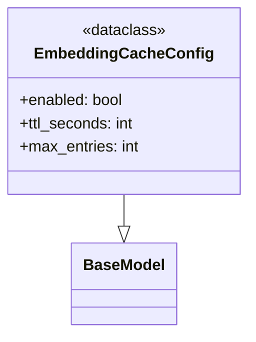

# File: src/local_deepwiki/config/models_embedding.py

## File Overview

This file defines configuration models related to embedding caching within the local_deepwiki project. It provides a structured way to configure how embeddings are cached, including enabling/disabling the cache, setting time-to-live (TTL) values, and controlling the maximum number of entries before cleanup.

The purpose of this file is to centralize embedding cache configuration in a type-safe and validated manner using pydantic. This ensures that any usage of embedding caching adheres to predefined constraints and defaults, improving reliability and maintainability.

## Key Concepts

The core abstraction in this file is the `EmbeddingCacheConfig` class, which encapsulates all relevant parameters for managing an embedding cache. The use of pydantic's `BaseModel` provides automatic validation and serialization capabilities, ensuring that configuration values are always within expected ranges.

The choice to use pydantic was made to leverage its built-in validation features, such as `ge` (greater than or equal) and `le` (less than or equal) constraints, which enforce that TTL and max entry limits are within sensible bounds. This prevents misconfigurations that could lead to performance issues or resource exhaustion.

The configuration values are designed with practical defaults:
- Default TTL of 7 days (604800 seconds) balances cache freshness with efficiency.
- Max entries set to 100,000 provides a reasonable upper bound for most use cases while avoiding excessive memory consumption.

## Integration

This file is imported by components that need to access or validate embedding cache settings. Specifically, the `EmbeddingCacheConfig` class is used by:
- `cache` module: to determine how to manage cached embeddings
- `test_embedding_cache`: for testing purposes, to ensure proper behavior under various cache configurations

It also integrates with other configuration models in the project, such as those found in `models_llm.py` and `prompts.py`, forming part of a larger configuration ecosystem that governs how different aspects of the system behave.

## Design Notes

- The `model_config = {"frozen": True}` setting makes the configuration immutable after instantiation, preventing accidental changes during runtime. This is particularly important for configuration objects that may be shared across modules.
- The TTL range is constrained between 60 seconds and 30 days (2,592,000 seconds), ensuring that cache entries do not expire too quickly or remain cached indefinitely.
- The maximum entries constraint is limited to between 1,000 and 1,000,000 to avoid trivial or overly aggressive cache sizes that might cause memory or performance issues.
- Default values are chosen to be practical for typical usage scenarios, minimizing the need for manual tuning while still allowing flexibility for edge cases.

## API Reference

### class `EmbeddingCacheConfig`

**Inherits from:** `BaseModel`

Embedding cache configuration.


<details>
<summary>View Source (lines 8-25) | <a href="https://github.com/UrbanDiver/local-deepwiki-mcp/blob/main/src/local_deepwiki/config/models_embedding.py#L8-L25">GitHub</a></summary>

```python
class EmbeddingCacheConfig(BaseModel):
    """Embedding cache configuration."""

    model_config = {"frozen": True}

    enabled: bool = Field(default=True, description="Enable embedding caching")
    ttl_seconds: int = Field(
        default=604800,  # 7 days
        ge=60,
        le=2592000,  # 30 days max
        description="Cache TTL in seconds (default: 7 days)",
    )
    max_entries: int = Field(
        default=100000,
        ge=1000,
        le=1000000,
        description="Maximum cache entries before cleanup (default: 100k)",
    )
```

</details>

## Class Diagram



## Last Modified

| Entity | Type | Author | Date | Commit |
|--------|------|--------|------|--------|
| `EmbeddingCacheConfig` | class | Brian Breidenbach | 2 weeks ago | `8d69a57` refactor: split config/mode... |

## Relevant Source Files

- `src/local_deepwiki/config/models_embedding.py:8-25`
