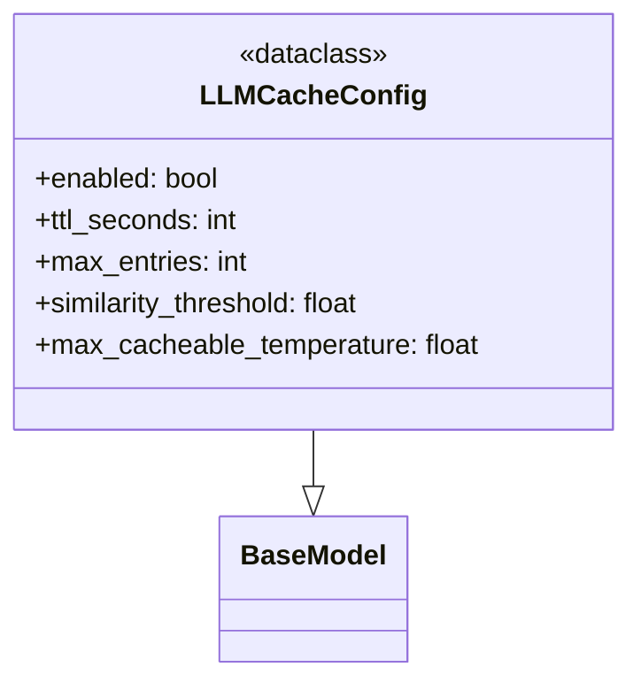

# File Overview

This file defines configuration models for LLM-related settings, specifically focusing on caching behavior. It uses pydantic's `BaseModel` to enforce type safety and validation for configuration values, ensuring that cache settings are well-defined and within acceptable ranges.

The purpose of this file is to provide a structured and validated way to configure how LLM responses are cached, including parameters such as TTL (time-to-live), maximum entries, and similarity thresholds. This configuration is used throughout the application to control caching behavior for LLM interactions.

# Key Concepts

## Configuration Validation with pydantic

The `LLMCacheConfig` class leverages pydantic's built-in validation features to ensure that all configuration values are valid. This includes:

- **Type enforcement**: Each field has a defined type (`bool`, `int`, `float`)
- **Range constraints**: Fields like `ttl_seconds`, `max_entries`, and `similarity_threshold` are constrained using `ge` (greater than or equal) and `le` (less than or equal) validators
- **Default values**: All fields have sensible defaults to ensure the configuration is immediately usable
- **Frozen model**: The `model_config = {"frozen": True}` setting ensures that once a configuration is created, it cannot be modified, which prevents accidental runtime changes

This design choice was made to reduce bugs related to invalid or inconsistent configuration values and to make the caching behavior predictable and auditable.

## Cache Behavior Parameters

The configuration model encapsulates several key parameters that define how caching is applied:

- `enabled`: Controls whether caching is active
- `ttl_seconds`: Defines how long cached responses remain valid
- `max_entries`: Limits the number of cached entries to prevent unbounded growth
- `similarity_threshold`: Determines how similar a new query must be to an existing one to qualify for a cache hit
- `max_cacheable_temperature`: Ensures that non-deterministic outputs (high temperature) are not cached

These parameters reflect a balance between performance gains from caching and the need to maintain accuracy and freshness of responses.

# Integration

This file is imported and used by multiple components in the codebase, primarily in modules that handle LLM interactions. The `LLMCacheConfig` class is used by:

- `llm_cache`: Likely responsible for managing the actual caching logic
- `__init__`: Possibly initializes caching based on the configuration
- `provider_factory`: May use the configuration to set up caching for different LLM providers

The configuration is likely passed into these components to control how caching is applied during LLM requests. This modular approach allows for consistent caching behavior across different parts of the system without duplicating configuration logic.

# Design Notes

## Trade-offs and Considerations

1. **Cache Size vs. Performance**: The `max_entries` is set to 10,000 by default, which balances between performance gains and memory usage. A higher value would improve cache hit rates but could lead to memory bloat.

2. **TTL Duration**: The default TTL is 7 days (`604800` seconds), which is a long time. This suggests that the system assumes LLM responses are relatively stable over time, or that the cache is primarily used for frequently asked questions.

3. **Temperature Limitation**: The `max_cacheable_temperature` is set to 0.3, meaning only deterministic outputs are cached. This prevents caching of highly variable outputs that may not be reproducible, which could lead to incorrect behavior if cached results are reused.

4. **Similarity Threshold**: The default similarity threshold of 0.95 is relatively strict. This ensures that only very similar queries are considered for a cache hit, reducing the risk of serving incorrect responses due to cache collisions.

5. **Immutability**: The frozen model ensures that once configured, the cache behavior is fixed. This prevents runtime modifications that could break assumptions made by the caching system.

6. **Validation Constraints**: The use of `ge` and `le` validators ensures that values are within reasonable bounds. For example, TTL cannot be less than 60 seconds or more than 30 days, which prevents misconfigurations that could lead to either excessive caching or no caching at all.

## API Reference

### class `LLMCacheConfig`

**Inherits from:** `BaseModel`

LLM response caching configuration.


<details>
<summary>View Source (lines 8-37) | <a href="https://github.com/UrbanDiver/local-deepwiki-mcp/blob/main/src/local_deepwiki/config/models_llm.py#L8-L37">GitHub</a></summary>

```python
class LLMCacheConfig(BaseModel):
    """LLM response caching configuration."""

    model_config = {"frozen": True}

    enabled: bool = Field(default=True, description="Enable LLM response caching")
    ttl_seconds: int = Field(
        default=604800,  # 7 days
        ge=60,
        le=2592000,  # 30 days max
        description="Cache TTL in seconds (default: 7 days)",
    )
    max_entries: int = Field(
        default=10000,
        ge=100,
        le=100000,
        description="Maximum cache entries before eviction",
    )
    similarity_threshold: float = Field(
        default=0.95,
        ge=0.0,
        le=1.0,
        description="Minimum similarity score for cache hit (0.0-1.0)",
    )
    max_cacheable_temperature: float = Field(
        default=0.3,
        ge=0.0,
        le=2.0,
        description="Maximum temperature to cache (higher = non-deterministic)",
    )
```

</details>

## Class Diagram



## Last Modified

| Entity | Type | Author | Date | Commit |
|--------|------|--------|------|--------|
| `LLMCacheConfig` | class | Brian Breidenbach | 2 weeks ago | `8d69a57` refactor: split config/mode... |

## Relevant Source Files

- `src/local_deepwiki/config/models_llm.py:8-37`
