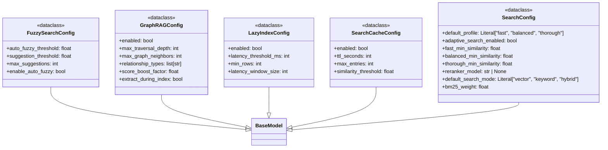

# File: `src/local_deepwiki/config/models_search.py`

## File Overview

This file defines pydantic models that encapsulate configuration settings for various search-related features within the local_deepwiki system. These models are used to validate and manage parameters that control search behavior, caching, indexing strategies, fuzzy matching, and graph-augmented retrieval.

The configuration models ensure consistent and type-safe handling of search-related parameters across different modules and components of the system. They provide a centralized way to define, document, and enforce valid values for search behavior, enabling flexible and robust search operations.

## Key Concepts

### Configuration Validation and Type Safety
Each configuration class uses pydantic's `BaseModel` to enforce strict typing and validation. This ensures that invalid configurations are caught early, preventing runtime errors due to malformed settings. Fields are annotated with constraints (e.g., `ge`, `le`) to define valid ranges, and descriptions are provided to clarify each setting's purpose.

### Search Profiles and Trade-offs
The `SearchConfig` class introduces the concept of configurable search profiles (`fast`, `balanced`, `thorough`) to control the precision/recall trade-off. This allows the system to adapt its search behavior based on performance requirements or quality expectations, supporting both speed and accuracy as needed.

### Adaptive and Lazy Indexing
The `SearchConfig` and `LazyIndexConfig` models together support adaptive search depth estimation and lazy vector index creation. This enables dynamic optimization of search performance by adjusting search parameters and deferring expensive index creation tasks until necessary.

### Fuzzy Matching for Typo-Tolerance
The `FuzzySearchConfig` class introduces fuzzy matching to improve search robustness by suggesting alternatives when semantic search results are poor. This enhances usability by providing helpful suggestions when users make typos or use slightly different terminology.

### Graph-Augmented Retrieval
The `GraphRAGConfig` class enables integration with knowledge graphs, allowing search results to be expanded with structurally related entities. This enhances semantic understanding by incorporating relationships between code elements, improving the relevance of retrieved results.

## Integration

This file is a core part of the configuration system, providing models that are used throughout the codebase:

- `SearchCacheConfig` is used by the cache and test_vectorstore_cache modules to configure search result caching behavior.
- `SearchConfig` is consumed by `search_config_resolver`, which likely selects appropriate search parameters based on context.
- `LazyIndexConfig` is used by maintenance and test_vectorstore_submodules to control deferred index creation.
- `FuzzySearchConfig` is used by `search_postprocess`, `store`, and test_vectorstore_cache to enable typo-tolerant search.
- `GraphRAGConfig` is used by `retriever`, `test_graph_rag_indexer_integration`, `test_graph_rag_models`, and others to enable graph-augmented search capabilities.

These configurations are likely consumed by components that handle search logic, indexing, caching, and result processing, allowing them to be configured dynamically without hardcoding behavior.

## Design Notes

### Trade-offs and Implementation Choices

- **Frozen Models**: All models are configured with `model_config = {"frozen": True}`, ensuring that configuration objects are immutable after creation. This prevents accidental modification during runtime, which could lead to inconsistent behavior.
  
- **TTL and Cache Limits**: The `SearchCacheConfig` uses a TTL of 1 hour (3600 seconds) with a maximum of 24 hours, balancing cache freshness with performance. The maximum entries are limited to prevent unbounded memory usage.

- **[Search Profile](../core/vectorstore/schema.md) Thresholds**: The `SearchConfig` defines distinct similarity thresholds for different profiles. This design choice allows fine-grained control over search sensitivity, enabling a spectrum from fast but less accurate (`fast`) to thorough but slower (`thorough`) searches.

- **Lazy Indexing Thresholds**: The `LazyIndexConfig` uses a latency threshold of 500ms, a reasonable default for detecting performance bottlenecks. The window size of 10 recent searches provides enough context to make informed decisions without excessive overhead.

- **Fuzzy Matching Parameters**: The `FuzzySearchConfig` sets a default auto-fuzzy threshold of 0.5, which balances between enabling fuzzy matching and avoiding noisy suggestions. The maximum suggestions are capped at 3 to keep results concise.

- **GraphRAG Configuration**: The `GraphRAGConfig` allows enabling/disabling of graph features and sets reasonable defaults for traversal depth and neighbor limits. The score boost factor is set to 0.7 to ensure vector results still dominate unless graph expansion provides significantly better matches.

These design decisions reflect a balance between performance, usability, and extensibility, allowing the system to be tuned for different environments and use cases.

## API Reference

### class `SearchCacheConfig`

**Inherits from:** `BaseModel`

Search result caching configuration for vector store.


<details>
<summary>View Source (lines 10-33) | <a href="https://github.com/UrbanDiver/local-deepwiki-mcp/blob/main/src/local_deepwiki/config/models_search.py#L10-L33">GitHub</a></summary>

```python
class SearchCacheConfig(BaseModel):
    """Search result caching configuration for vector store."""

    model_config = {"frozen": True}

    enabled: bool = Field(default=True, description="Enable search result caching")
    ttl_seconds: int = Field(
        default=3600,  # 1 hour
        ge=60,
        le=86400,  # 24 hours max
        description="Cache TTL in seconds (default: 1 hour)",
    )
    max_entries: int = Field(
        default=1000,
        ge=100,
        le=10000,
        description="Maximum cache entries before eviction",
    )
    similarity_threshold: float = Field(
        default=0.95,
        ge=0.0,
        le=1.0,
        description="Minimum similarity score for semantic cache hit (0.0-1.0)",
    )
```

</details>

### class `SearchConfig`

**Inherits from:** `BaseModel`

Search behavior configuration for precision/recall trade-offs.  Controls search profiles and adaptive search depth estimation.


<details>
<summary>View Source (lines 36-93) | <a href="https://github.com/UrbanDiver/local-deepwiki-mcp/blob/main/src/local_deepwiki/config/models_search.py#L36-L93">GitHub</a></summary>

```python
class SearchConfig(BaseModel):
    """Search behavior configuration for precision/recall trade-offs.

    Controls search profiles and adaptive search depth estimation.
    """

    model_config = {"frozen": True}

    default_profile: Literal["fast", "balanced", "thorough"] = Field(
        default="balanced",
        description="Default search profile for precision/recall trade-off. "
        "'fast' = fewer candidates, faster response; "
        "'balanced' = default behavior, good balance; "
        "'thorough' = exhaustive search, best recall but slower.",
    )
    adaptive_search_enabled: bool = Field(
        default=True,
        description="Enable adaptive search depth estimation. "
        "When enabled, search depth adjusts based on query complexity and history.",
    )
    fast_min_similarity: float = Field(
        default=0.3,
        ge=0.0,
        le=1.0,
        description="Minimum similarity threshold for 'fast' profile (0.0-1.0).",
    )
    balanced_min_similarity: float = Field(
        default=0.2,
        ge=0.0,
        le=1.0,
        description="Minimum similarity threshold for 'balanced' profile (0.0-1.0).",
    )
    thorough_min_similarity: float = Field(
        default=0.1,
        ge=0.0,
        le=1.0,
        description="Minimum similarity threshold for 'thorough' profile (0.0-1.0).",
    )
    reranker_model: str | None = Field(
        default=None,
        description="Cross-encoder model for reranking search results "
        "(e.g. 'cross-encoder/ms-marco-MiniLM-L-6-v2'). "
        "When None, reranking is disabled.",
    )
    default_search_mode: Literal["vector", "keyword", "hybrid"] = Field(
        default="vector",
        description="Default search mode for code search. "
        "'vector' = semantic embedding search (default); "
        "'keyword' = BM25 full-text search; "
        "'hybrid' = combined vector + BM25 with Reciprocal Rank Fusion.",
    )
    bm25_weight: float = Field(
        default=0.3,
        ge=0.0,
        le=1.0,
        description="Weight of BM25 results in hybrid search RRF (0.0-1.0). "
        "Vector weight is always 1.0. Higher values favor keyword matches.",
    )
```

</details>

### class `LazyIndexConfig`

**Inherits from:** `BaseModel`

Lazy vector index configuration for deferred index creation.  When enabled, vector indexes are not created immediately when the table reaches the minimum row threshold. Instead, index creation is scheduled as a background task after initial indexing completes, or triggered on-demand when search latency exceeds the threshold.


<details>
<summary>View Source (lines 96-131) | <a href="https://github.com/UrbanDiver/local-deepwiki-mcp/blob/main/src/local_deepwiki/config/models_search.py#L96-L131">GitHub</a></summary>

```python
class LazyIndexConfig(BaseModel):
    """Lazy vector index configuration for deferred index creation.

    When enabled, vector indexes are not created immediately when the table
    reaches the minimum row threshold. Instead, index creation is scheduled
    as a background task after initial indexing completes, or triggered
    on-demand when search latency exceeds the threshold.
    """

    model_config = {"frozen": True}

    enabled: bool = Field(
        default=True,
        description="Enable lazy/deferred vector index creation. "
        "When enabled, indexes are created in the background after initial indexing.",
    )
    latency_threshold_ms: int = Field(
        default=500,
        ge=50,
        le=5000,
        description="Search latency threshold in milliseconds. "
        "If average latency exceeds this, index creation is triggered automatically.",
    )
    min_rows: int = Field(
        default=1000,
        ge=100,
        le=100000,
        description="Minimum number of rows before considering index creation. "
        "Tables smaller than this threshold use brute-force search.",
    )
    latency_window_size: int = Field(
        default=10,
        ge=3,
        le=100,
        description="Number of recent searches to consider for latency calculation.",
    )
```

</details>

### class `FuzzySearchConfig`

**Inherits from:** `BaseModel`

Fuzzy search configuration for typo-tolerant code search.  When semantic search results have low similarity scores, fuzzy matching can be automatically enabled to provide "Did you mean?" suggestions based on function/class names in the codebase.


<details>
<summary>View Source (lines 134-168) | <a href="https://github.com/UrbanDiver/local-deepwiki-mcp/blob/main/src/local_deepwiki/config/models_search.py#L134-L168">GitHub</a></summary>

```python
class FuzzySearchConfig(BaseModel):
    """Fuzzy search configuration for typo-tolerant code search.

    When semantic search results have low similarity scores, fuzzy matching
    can be automatically enabled to provide "Did you mean?" suggestions
    based on function/class names in the codebase.
    """

    model_config = {"frozen": True}

    auto_fuzzy_threshold: float = Field(
        default=0.5,
        ge=0.0,
        le=1.0,
        description="Similarity score threshold below which fuzzy matching is auto-enabled. "
        "When the best result has a score below this threshold, fuzzy suggestions are generated.",
    )
    suggestion_threshold: float = Field(
        default=0.6,
        ge=0.0,
        le=1.0,
        description="Minimum fuzzy similarity score (0.0-1.0) for a name to be included "
        "in 'Did you mean?' suggestions.",
    )
    max_suggestions: int = Field(
        default=3,
        ge=1,
        le=10,
        description="Maximum number of 'Did you mean?' suggestions to return.",
    )
    enable_auto_fuzzy: bool = Field(
        default=True,
        description="Enable automatic fuzzy fallback when semantic results are poor. "
        "When disabled, fuzzy matching is only used if explicitly requested.",
    )
```

</details>

### class `GraphRAGConfig`

**Inherits from:** `BaseModel`

Knowledge graph-augmented retrieval configuration.  When enabled, entities and relationships are extracted during indexing and stored in LanceDB tables. During queries, graph traversal expands vector search results with structurally related code.


<details>
<summary>View Source (lines 171-215) | <a href="https://github.com/UrbanDiver/local-deepwiki-mcp/blob/main/src/local_deepwiki/config/models_search.py#L171-L215">GitHub</a></summary>

```python
class GraphRAGConfig(BaseModel):
    """Knowledge graph-augmented retrieval configuration.

    When enabled, entities and relationships are extracted during indexing
    and stored in LanceDB tables. During queries, graph traversal expands
    vector search results with structurally related code.
    """

    model_config = {"frozen": True}

    enabled: bool = Field(
        default=False,
        description="Enable GraphRAG knowledge graph extraction and retrieval. "
        "When disabled (default), no graph tables are created and queries "
        "use pure vector search.",
    )
    max_traversal_depth: int = Field(
        default=2,
        ge=1,
        le=4,
        description="Maximum BFS depth when expanding search results via the graph.",
    )
    max_graph_neighbors: int = Field(
        default=15,
        ge=1,
        le=50,
        description="Maximum neighbor entities to add from graph expansion.",
    )
    relationship_types: list[str] = Field(
        default=["calls", "imports", "inherits_from", "contains", "references"],
        description="Relationship types to traverse during graph expansion.",
    )
    score_boost_factor: float = Field(
        default=0.7,
        ge=0.0,
        le=1.0,
        description="Score multiplier for graph-discovered chunks relative to "
        "the minimum vector search score. Lower values rank graph results below "
        "vector results.",
    )
    extract_during_index: bool = Field(
        default=True,
        description="Extract entities and relationships during indexing. "
        "If False, graph must be built separately.",
    )
```

</details>

## Class Diagram



## Last Modified

| Entity | Type | Author | Date | Commit |
|--------|------|--------|------|--------|
| `SearchCacheConfig` | class | Brian Breidenbach | 2 weeks ago | `8d69a57` refactor: split config/mode... |
| `SearchConfig` | class | Brian Breidenbach | 2 weeks ago | `8d69a57` refactor: split config/mode... |
| `LazyIndexConfig` | class | Brian Breidenbach | 2 weeks ago | `8d69a57` refactor: split config/mode... |
| `FuzzySearchConfig` | class | Brian Breidenbach | 2 weeks ago | `8d69a57` refactor: split config/mode... |
| `GraphRAGConfig` | class | Brian Breidenbach | 2 weeks ago | `8d69a57` refactor: split config/mode... |

## Relevant Source Files

- `src/local_deepwiki/config/models_search.py:10-33`
