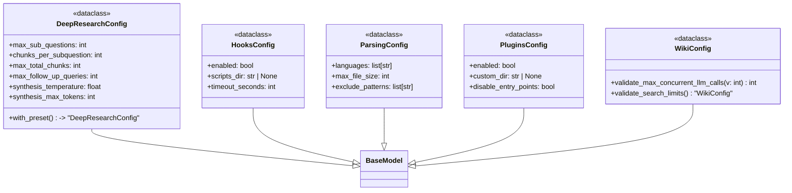
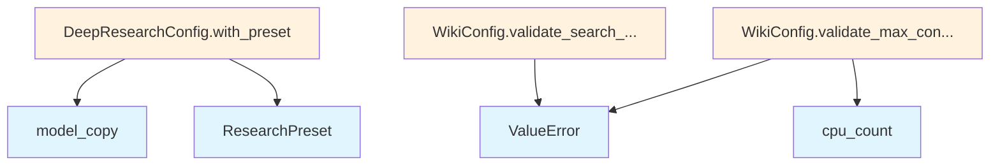

# File: `src/local_deepwiki/config/models_wiki.py`

## File Overview

This file defines pydantic models that encapsulate configuration for wiki generation and related infrastructure within the `local_deepwiki` project. These models are used to structure and validate settings for parsing code, managing wiki generation strategies, controlling deep research workflows, and configuring plugins and hooks.

The purpose of this file is to centralize and standardize configuration logic, ensuring that all components that rely on these settings can trust their inputs are valid and well-defined. It serves as a foundational configuration layer for the wiki generation and research pipeline systems.

## Key Concepts

### Configuration Validation with pydantic
pydantic models are used throughout this file to enforce type safety and validation. This includes:
- **Field-level validation** using `Field` with constraints like `ge`, `le`, and default values.
- **Model-level validation** using `model_validator` to ensure logical consistency (e.g., `validate_search_limits`).
- **Custom validation** using `field_validator` for specific constraints (e.g., `validate_max_concurrent_llm_calls`).

This design choice ensures robustness and prevents misconfiguration that could lead to runtime errors or unexpected behavior.

### Preset-Based Configuration
The `DeepResearchConfig` class supports applying predefined "presets" (`ResearchPreset`) to tune research behavior:
- `QUICK`: Optimized for speed.
- `DEFAULT`: Balanced behavior.
- `THOROUGH`: Comprehensive, detailed research.

This abstraction allows users to switch between different behavior modes without manually adjusting each parameter, simplifying configuration and improving usability.

### Resource and Limit Management
Several models define limits and constraints for resource usage:
- `max_file_size` in `ParsingConfig` ensures large files are not parsed.
- `max_concurrent_llm_calls` in `WikiConfig` prevents overloading the system.
- Search limits (`context_search_limit`, `fallback_search_limit`) ensure consistent retrieval behavior.

These constraints are important for performance and stability in resource-constrained environments.

## Integration

This file is a core part of the configuration system and integrates with:
- **Test modules**: The models are used in `test_config`, `test_integration_analysis`, `test_integration_pipeline`, and `test_wiki_codemaps`.
- **Core components**: Classes like `WikiConfig` and `DeepResearchConfig` are used by components in `src/local_deepwiki/core/graph_rag/models.py`, `src/local_deepwiki/generators/analysis/api_docs.py`, and `src/local_deepwiki/handlers/types.py`.

The models defined here are foundational for how the wiki generation pipeline, code parsing, and deep research workflows are configured. For example, `ParsingConfig` is used by parsing logic to determine which files to include or exclude, and `DeepResearchConfig` is used by the deep research pipeline to control sub-question generation and chunk retrieval.

## Design Notes

### Why pydantic?
pydantic was chosen for its ability to provide:
- Automatic validation and serialization.
- Clear, readable configuration definitions.
- Integration with type hints, making code easier to understand and maintain.

### Why StrEnum?
The `StrEnum` is used for `ResearchPreset` and `GenerationMode` to:
- Ensure only predefined string values are accepted.
- Provide a consistent interface for string-based configuration.
- Allow easy comparison and use in conditionals.

### Why Frozen Models?
Several models are configured with `model_config = {"frozen": True}`:
- This ensures that once a configuration object is created, it cannot be modified.
- This prevents accidental mutation of configuration during runtime, which could lead to inconsistent behavior.
- It aligns with the principle of immutable configuration, improving reliability.

### Why Validation in `WikiConfig`?
The validation methods `validate_max_concurrent_llm_calls` and `validate_search_limits` ensure:
- `max_concurrent_llm_calls` is bounded by the number of CPU cores, preventing resource exhaustion.
- Search limits are logically consistent, avoiding invalid configurations.

These validations are critical for robustness in a system that heavily relies on external resources like LLMs and search APIs.

## API Reference

### class `ResearchPreset`

**Inherits from:** `StrEnum`

Research mode presets for deep research pipeline.


<details>
<summary>View Source (lines 12-17) | <a href="https://github.com/UrbanDiver/local-deepwiki-mcp/blob/main/src/local_deepwiki/config/models_wiki.py#L12-L17">GitHub</a></summary>

```python
class ResearchPreset(StrEnum):
    """Research mode presets for deep research pipeline."""

    QUICK = "quick"
    DEFAULT = "default"
    THOROUGH = "thorough"
```

</details>

### class `GenerationMode`

**Inherits from:** `StrEnum`

Wiki page generation strategy.


<details>
<summary>View Source (lines 20-25) | <a href="https://github.com/UrbanDiver/local-deepwiki-mcp/blob/main/src/local_deepwiki/config/models_wiki.py#L20-L25">GitHub</a></summary>

```python
class GenerationMode(StrEnum):
    """Wiki page generation strategy."""

    EAGER = "eager"
    LAZY = "lazy"
    HYBRID = "hybrid"
```

</details>

### class `ParsingConfig`

**Inherits from:** `BaseModel`

Code parsing configuration.


<details>
<summary>View Source (lines 57-115) | <a href="https://github.com/UrbanDiver/local-deepwiki-mcp/blob/main/src/local_deepwiki/config/models_wiki.py#L57-L115">GitHub</a></summary>

```python
class ParsingConfig(BaseModel):
    """Code parsing configuration."""

    model_config = {"frozen": True}

    languages: list[str] = Field(
        default=[
            "python",
            "typescript",
            "javascript",
            "go",
            "rust",
            "java",
            "c",
            "cpp",
            "swift",
            "ruby",
            "php",
            "kotlin",
            "csharp",
        ],
        description="Languages to parse",
    )
    max_file_size: int = Field(
        default=1048576, description="Max file size in bytes (1MB)"
    )
    exclude_patterns: list[str] = Field(
        default=[
            "node_modules/**",
            "venv/**",
            ".venv/**",
            "__pycache__/**",
            ".git/**",
            "*.min.js",
            "*.min.css",
            "dist/**",
            "build/**",
            ".next/**",
            "target/**",
            "vendor/**",
            "htmlcov/**",
            ".pytest_cache/**",
            ".mypy_cache/**",
            ".ruff_cache/**",
            ".tox/**",
            ".nox/**",
            "coverage/**",
            ".coverage",
            "coverage_html/**",
            "coverage_openai_embeddings/**",
            ".claude/**",
            ".windsurf/**",
            ".cursor/**",
            ".aider/**",
            "agents/**",
            "AGENTS.md",
        ],
        description="Glob patterns to exclude",
    )
```

</details>

### class `WikiConfig`

**Inherits from:** `BaseModel`

Wiki generation configuration.

**Methods:**


<details>
<summary>View Source (lines 118-263) | <a href="https://github.com/UrbanDiver/local-deepwiki-mcp/blob/main/src/local_deepwiki/config/models_wiki.py#L118-L263">GitHub</a></summary>

```python
class WikiConfig(BaseModel):
    # Methods: validate_max_concurrent_llm_calls, validate_search_limits
```

</details>

#### `validate_max_concurrent_llm_calls`

```python
def validate_max_concurrent_llm_calls(v: int) -> int
```

Validate max_concurrent_llm_calls is reasonable.


| Parameter | Type | Default | Description |
|-----------|------|---------|-------------|
| `v` | `int` | - | - |


<details>
<summary>View Source (lines 248-253) | <a href="https://github.com/UrbanDiver/local-deepwiki-mcp/blob/main/src/local_deepwiki/config/models_wiki.py#L248-L253">GitHub</a></summary>

```python
def validate_max_concurrent_llm_calls(cls, v: int) -> int:
        """Validate max_concurrent_llm_calls is reasonable."""
        if v < 1:
            raise ValueError("max_concurrent_llm_calls must be >= 1")
        cpu_count = os.cpu_count() or 4
        return min(v, cpu_count * 2)
```

</details>

#### `validate_search_limits`

```python
def validate_search_limits() -> "WikiConfig"
```

Validate search limits are consistent.


<details>
<summary>View Source (lines 256-263) | <a href="https://github.com/UrbanDiver/local-deepwiki-mcp/blob/main/src/local_deepwiki/config/models_wiki.py#L256-L263">GitHub</a></summary>

```python
def validate_search_limits(self) -> "WikiConfig":
        """Validate search limits are consistent."""
        if self.fallback_search_limit > self.context_search_limit:
            raise ValueError(
                f"fallback_search_limit ({self.fallback_search_limit}) should not exceed "
                f"context_search_limit ({self.context_search_limit})"
            )
        return self
```

</details>

### class `DeepResearchConfig`

**Inherits from:** `BaseModel`

Deep research pipeline configuration.

**Methods:**


<details>
<summary>View Source (lines 266-336) | <a href="https://github.com/UrbanDiver/local-deepwiki-mcp/blob/main/src/local_deepwiki/config/models_wiki.py#L266-L336">GitHub</a></summary>

```python
class DeepResearchConfig(BaseModel):
    """Deep research pipeline configuration."""

    model_config = {"frozen": True}

    max_sub_questions: int = Field(
        default=4,
        ge=1,
        le=10,
        description="Maximum sub-questions generated from query decomposition",
    )
    chunks_per_subquestion: int = Field(
        default=5,
        ge=1,
        le=20,
        description="Code chunks retrieved per sub-question",
    )
    max_total_chunks: int = Field(
        default=30,
        ge=10,
        le=100,
        description="Maximum total chunks used in synthesis",
    )
    max_follow_up_queries: int = Field(
        default=3,
        ge=0,
        le=10,
        description="Maximum follow-up queries from gap analysis",
    )
    synthesis_temperature: float = Field(
        default=0.5,
        ge=0.0,
        le=2.0,
        description="LLM temperature for synthesis (higher = more creative)",
    )
    synthesis_max_tokens: int = Field(
        default=4096,
        ge=512,
        le=16000,
        description="Maximum tokens in synthesis response",
    )

    def with_preset(self, preset: ResearchPreset | str | None) -> "DeepResearchConfig":
        """Return a new config with preset values applied.

        The preset values override the current config values. If preset is None
        or "default", returns a copy of the current config unchanged.

        Args:
            preset: The research preset to apply ("quick", "default", "thorough").

        Returns:
            A new DeepResearchConfig with preset values applied.
        """
        if preset is None:
            return self.model_copy()

        # Convert string to enum if needed
        if isinstance(preset, str):
            try:
                preset = ResearchPreset(preset.lower())
            except ValueError:
                # Invalid preset name, return unchanged
                return self.model_copy()

        if preset == ResearchPreset.DEFAULT:
            return self.model_copy()

        # Get preset values and merge with current config
        preset_values = RESEARCH_PRESETS.get(preset, {})
        return self.model_copy(update=preset_values)
```

</details>

#### `with_preset`

```python
def with_preset(preset: ResearchPreset | str | None) -> "DeepResearchConfig"
```

Return a new config with preset values applied.  The preset values override the current config values. If preset is None or "default", returns a copy of the current config unchanged.


| Parameter | Type | Default | Description |
|-----------|------|---------|-------------|
| `preset` | `ResearchPreset | str | None` | - | The research preset to apply ("quick", "default", "thorough"). |


<details>
<summary>View Source (lines 266-336) | <a href="https://github.com/UrbanDiver/local-deepwiki-mcp/blob/main/src/local_deepwiki/config/models_wiki.py#L266-L336">GitHub</a></summary>

```python
class DeepResearchConfig(BaseModel):
    """Deep research pipeline configuration."""

    model_config = {"frozen": True}

    max_sub_questions: int = Field(
        default=4,
        ge=1,
        le=10,
        description="Maximum sub-questions generated from query decomposition",
    )
    chunks_per_subquestion: int = Field(
        default=5,
        ge=1,
        le=20,
        description="Code chunks retrieved per sub-question",
    )
    max_total_chunks: int = Field(
        default=30,
        ge=10,
        le=100,
        description="Maximum total chunks used in synthesis",
    )
    max_follow_up_queries: int = Field(
        default=3,
        ge=0,
        le=10,
        description="Maximum follow-up queries from gap analysis",
    )
    synthesis_temperature: float = Field(
        default=0.5,
        ge=0.0,
        le=2.0,
        description="LLM temperature for synthesis (higher = more creative)",
    )
    synthesis_max_tokens: int = Field(
        default=4096,
        ge=512,
        le=16000,
        description="Maximum tokens in synthesis response",
    )

    def with_preset(self, preset: ResearchPreset | str | None) -> "DeepResearchConfig":
        """Return a new config with preset values applied.

        The preset values override the current config values. If preset is None
        or "default", returns a copy of the current config unchanged.

        Args:
            preset: The research preset to apply ("quick", "default", "thorough").

        Returns:
            A new DeepResearchConfig with preset values applied.
        """
        if preset is None:
            return self.model_copy()

        # Convert string to enum if needed
        if isinstance(preset, str):
            try:
                preset = ResearchPreset(preset.lower())
            except ValueError:
                # Invalid preset name, return unchanged
                return self.model_copy()

        if preset == ResearchPreset.DEFAULT:
            return self.model_copy()

        # Get preset values and merge with current config
        preset_values = RESEARCH_PRESETS.get(preset, {})
        return self.model_copy(update=preset_values)
```

</details>

### class `PluginsConfig`

**Inherits from:** `BaseModel`

[Plugin](../plugins/base.md) system configuration.


<details>
<summary>View Source (lines 339-353) | <a href="https://github.com/UrbanDiver/local-deepwiki-mcp/blob/main/src/local_deepwiki/config/models_wiki.py#L339-L353">GitHub</a></summary>

```python
class PluginsConfig(BaseModel):
    """Plugin system configuration."""

    model_config = {"frozen": True}

    enabled: bool = Field(default=True, description="Enable plugin system")
    custom_dir: str | None = Field(
        default=None,
        description="Custom plugins directory path. Plugins in this directory "
        "are loaded in addition to repo and user plugins.",
    )
    disable_entry_points: bool = Field(
        default=False,
        description="Disable loading plugins from setuptools entry points",
    )
```

</details>

### class `HooksConfig`

**Inherits from:** `BaseModel`

[Event](../events.md) hooks configuration.


<details>
<summary>View Source (lines 356-372) | <a href="https://github.com/UrbanDiver/local-deepwiki-mcp/blob/main/src/local_deepwiki/config/models_wiki.py#L356-L372">GitHub</a></summary>

```python
class HooksConfig(BaseModel):
    """Event hooks configuration."""

    model_config = {"frozen": True}

    enabled: bool = Field(default=True, description="Enable event hooks system")
    scripts_dir: str | None = Field(
        default=None,
        description="Directory containing hook scripts. Scripts are named by event type "
        "(e.g., index.complete.sh, wiki.page.complete.py).",
    )
    timeout_seconds: int = Field(
        default=30,
        ge=1,
        le=300,
        description="Maximum execution time for hook scripts in seconds",
    )
```

</details>

## Class Diagram



## Call Graph



## Used By

Functions and methods in this file and their callers:

- **`ResearchPreset`**: called by `DeepResearchConfig.with_preset`
- **`ValueError`**: called by `WikiConfig.validate_max_concurrent_llm_calls`, `WikiConfig.validate_search_limits`
- **`cpu_count`**: called by `WikiConfig.validate_max_concurrent_llm_calls`
- **`model_copy`**: called by `DeepResearchConfig.with_preset`

## Last Modified

| Entity | Type | Author | Date | Commit |
|--------|------|--------|------|--------|
| `WikiConfig` | class | Brian Breidenbach | today | `d8d0cfa` fix: codemap wiki pages mat... |
| `ResearchPreset` | class | Brian Breidenbach | 2 weeks ago | `8d69a57` refactor: split config/mode... |
| `GenerationMode` | class | Brian Breidenbach | 2 weeks ago | `8d69a57` refactor: split config/mode... |
| `ParsingConfig` | class | Brian Breidenbach | 2 weeks ago | `8d69a57` refactor: split config/mode... |
| `validate_max_concurrent_llm_calls` | method | Brian Breidenbach | 2 weeks ago | `8d69a57` refactor: split config/mode... |
| `validate_search_limits` | method | Brian Breidenbach | 2 weeks ago | `8d69a57` refactor: split config/mode... |
| `DeepResearchConfig` | class | Brian Breidenbach | 2 weeks ago | `8d69a57` refactor: split config/mode... |
| `PluginsConfig` | class | Brian Breidenbach | 2 weeks ago | `8d69a57` refactor: split config/mode... |
| `HooksConfig` | class | Brian Breidenbach | 2 weeks ago | `8d69a57` refactor: split config/mode... |

## Relevant Source Files

- `src/local_deepwiki/config/models_wiki.py:12-17`
