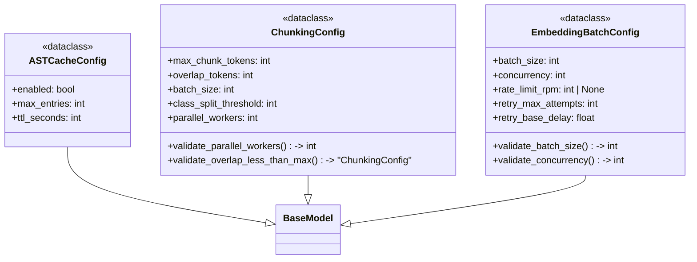
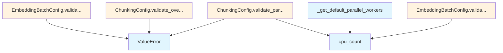

# File: `src/local_deepwiki/config/processing_models.py`

## File Overview

This file defines pydantic models that configure various processing components used in the local_deepwiki system, specifically for embedding batch processing, AST caching, and chunking operations. These configurations are critical for tuning performance, resource usage, and behavior of core processing pipelines.

The models are designed to be immutable (`frozen=True`) and include validation logic to ensure that values fall within acceptable ranges. This helps prevent runtime errors and ensures predictable behavior across different environments.

## Key Concepts

### Immutable Configuration with Validation
Each configuration class uses pydantic's `BaseModel` with `model_config = {"frozen": True}` to enforce immutability. This prevents accidental modification after instantiation, which is important for consistent system behavior.

Validation is implemented using both `field_validator` and `model_validator`:
- `field_validator` ensures individual fields meet constraints (e.g., `batch_size` must be between 1 and 500).
- `model_validator` performs cross-field checks (e.g., `overlap_tokens` must be less than `max_chunk_tokens`).

### Resource-Aware Defaults
The configuration models are designed with resource awareness in mind:
- For `EmbeddingBatchConfig`, concurrency is capped based on CPU count to avoid overloading the system.
- For `ChunkingConfig`, `parallel_workers` defaults to a value that scales with CPU count but caps at 8 to avoid thread overhead.

These defaults aim to provide sensible out-of-the-box behavior while allowing tuning for specific hardware or use cases.

### Caching for Performance
The `ASTCacheConfig` model enables caching of parsed abstract syntax trees (ASTs), which is particularly useful during incremental indexing. This avoids re-parsing unchanged files, significantly improving performance for repeated indexing tasks.

## Integration

This file is part of the configuration layer and integrates closely with other modules in the system:

- **Used by**: The `EmbeddingBatchConfig` is referenced by components involved in embedding (e.g., `embedding`, `search_params`, `test_search_params`) and potentially other modules requiring batched embedding logic.
- **Used by**: The `ChunkingConfig` is used by `chunker`, `test_integration_agentic`, and `test_integration_analysis`, indicating its role in processing code files for indexing or analysis.

The models are imported and used by:
- `src/local_deepwiki/config/models_llm.py` (likely for embedding-related settings)
- `src/local_deepwiki/core/graph_rag/models.py` (possibly for indexing or retrieval settings)
- `src/local_deepwiki/handlers/web_server.py` (for configuring processing parameters in web-based tools)

This file forms a foundational configuration layer that supports downstream components like LLM interaction, code parsing, and indexing workflows.

## Design Notes

### Parallelism and Resource Limits
- The `validate_concurrency` and `validate_parallel_workers` validators dynamically cap concurrency based on CPU count to prevent resource exhaustion.
- This approach balances performance gains with system stability, especially in multi-user or containerized environments.

### API vs Local Model Handling
- `EmbeddingBatchConfig` distinguishes between local models and API providers via `rate_limit_rpm`:
  - When set, it enforces throttling to respect API limits.
  - When `None`, it assumes local processing with no rate limiting.
- This design allows the same configuration logic to be reused across different embedding backends.

### AST Cache TTL and Eviction
- The `ASTCacheConfig` uses an LRU (Least Recently Used) eviction policy implicitly through its `max_entries` and `ttl_seconds` fields.
- A 1-hour default TTL (`ttl_seconds=3600`) is chosen to balance freshness and performance, with a maximum of 24 hours.

### Fallback Behavior
- The `_get_default_parallel_workers` function gracefully handles cases where `os.cpu_count()` is not available or raises exceptions, defaulting to a safe value of 4.
- This ensures the system remains functional even in edge cases or restricted environments.

These design choices reflect a balance between usability, performance, and robustness, tailored for a system that may be deployed in diverse environments ranging from local development to cloud-based infrastructures.

## API Reference

### class `EmbeddingBatchConfig`

**Inherits from:** `BaseModel`

Embedding batch processing configuration.

**Methods:**


<details>
<summary>View Source (lines 28-80) | <a href="https://github.com/UrbanDiver/local-deepwiki-mcp/blob/main/src/local_deepwiki/config/processing_models.py#L28-L80">GitHub</a></summary>

```python
class EmbeddingBatchConfig(BaseModel):
    """Embedding batch processing configuration."""

    model_config = {"frozen": True}

    batch_size: int = Field(
        default=100,
        ge=1,
        le=500,
        description="Number of texts to embed per batch. "
        "Local models can handle larger batches (100-200), API providers should use smaller (20-50).",
    )
    concurrency: int = Field(
        default=4,
        ge=1,
        le=16,
        description="Number of batches to process in parallel. "
        "Higher values speed up embedding but increase memory/API usage.",
    )
    rate_limit_rpm: int | None = Field(
        default=None,
        description="Requests per minute limit for API providers. "
        "If set, embedding will be throttled to respect this limit. "
        "Set to None for local providers or when using default API limits.",
    )
    retry_max_attempts: int = Field(
        default=3,
        ge=1,
        le=10,
        description="Maximum retry attempts for failed batches.",
    )
    retry_base_delay: float = Field(
        default=1.0,
        ge=0.1,
        le=10.0,
        description="Base delay in seconds between retry attempts (exponential backoff).",
    )

    @field_validator("batch_size")
    @classmethod
    def validate_batch_size(cls, v: int) -> int:
        """Validate batch_size is reasonable."""
        if v < 1:
            raise ValueError("batch_size must be >= 1")
        return v

    @field_validator("concurrency")
    @classmethod
    def validate_concurrency(cls, v: int) -> int:
        """Validate concurrency doesn't exceed reasonable limits."""
        cpu_count = os.cpu_count() or 4
        max_concurrency = min(16, cpu_count * 2)
        return min(v, max_concurrency)
```

</details>

#### `validate_batch_size`

```python
def validate_batch_size(v: int) -> int
```

Validate batch_size is reasonable.


| Parameter | Type | Default | Description |
|-----------|------|---------|-------------|
| `v` | `int` | - | - |


<details>
<summary>View Source (lines 28-80) | <a href="https://github.com/UrbanDiver/local-deepwiki-mcp/blob/main/src/local_deepwiki/config/processing_models.py#L28-L80">GitHub</a></summary>

```python
class EmbeddingBatchConfig(BaseModel):
    """Embedding batch processing configuration."""

    model_config = {"frozen": True}

    batch_size: int = Field(
        default=100,
        ge=1,
        le=500,
        description="Number of texts to embed per batch. "
        "Local models can handle larger batches (100-200), API providers should use smaller (20-50).",
    )
    concurrency: int = Field(
        default=4,
        ge=1,
        le=16,
        description="Number of batches to process in parallel. "
        "Higher values speed up embedding but increase memory/API usage.",
    )
    rate_limit_rpm: int | None = Field(
        default=None,
        description="Requests per minute limit for API providers. "
        "If set, embedding will be throttled to respect this limit. "
        "Set to None for local providers or when using default API limits.",
    )
    retry_max_attempts: int = Field(
        default=3,
        ge=1,
        le=10,
        description="Maximum retry attempts for failed batches.",
    )
    retry_base_delay: float = Field(
        default=1.0,
        ge=0.1,
        le=10.0,
        description="Base delay in seconds between retry attempts (exponential backoff).",
    )

    @field_validator("batch_size")
    @classmethod
    def validate_batch_size(cls, v: int) -> int:
        """Validate batch_size is reasonable."""
        if v < 1:
            raise ValueError("batch_size must be >= 1")
        return v

    @field_validator("concurrency")
    @classmethod
    def validate_concurrency(cls, v: int) -> int:
        """Validate concurrency doesn't exceed reasonable limits."""
        cpu_count = os.cpu_count() or 4
        max_concurrency = min(16, cpu_count * 2)
        return min(v, max_concurrency)
```

</details>

#### `validate_concurrency`

```python
def validate_concurrency(v: int) -> int
```

Validate concurrency doesn't exceed reasonable limits.


| Parameter | Type | Default | Description |
|-----------|------|---------|-------------|
| `v` | `int` | - | - |


<details>
<summary>View Source (lines 28-80) | <a href="https://github.com/UrbanDiver/local-deepwiki-mcp/blob/main/src/local_deepwiki/config/processing_models.py#L28-L80">GitHub</a></summary>

```python
class EmbeddingBatchConfig(BaseModel):
    """Embedding batch processing configuration."""

    model_config = {"frozen": True}

    batch_size: int = Field(
        default=100,
        ge=1,
        le=500,
        description="Number of texts to embed per batch. "
        "Local models can handle larger batches (100-200), API providers should use smaller (20-50).",
    )
    concurrency: int = Field(
        default=4,
        ge=1,
        le=16,
        description="Number of batches to process in parallel. "
        "Higher values speed up embedding but increase memory/API usage.",
    )
    rate_limit_rpm: int | None = Field(
        default=None,
        description="Requests per minute limit for API providers. "
        "If set, embedding will be throttled to respect this limit. "
        "Set to None for local providers or when using default API limits.",
    )
    retry_max_attempts: int = Field(
        default=3,
        ge=1,
        le=10,
        description="Maximum retry attempts for failed batches.",
    )
    retry_base_delay: float = Field(
        default=1.0,
        ge=0.1,
        le=10.0,
        description="Base delay in seconds between retry attempts (exponential backoff).",
    )

    @field_validator("batch_size")
    @classmethod
    def validate_batch_size(cls, v: int) -> int:
        """Validate batch_size is reasonable."""
        if v < 1:
            raise ValueError("batch_size must be >= 1")
        return v

    @field_validator("concurrency")
    @classmethod
    def validate_concurrency(cls, v: int) -> int:
        """Validate concurrency doesn't exceed reasonable limits."""
        cpu_count = os.cpu_count() or 4
        max_concurrency = min(16, cpu_count * 2)
        return min(v, max_concurrency)
```

</details>

### class `ASTCacheConfig`

**Inherits from:** `BaseModel`

AST cache configuration for tree-sitter parser.  Caches parsed ASTs to speed up incremental indexing by avoiding re-parsing of unchanged files.


<details>
<summary>View Source (lines 83-106) | <a href="https://github.com/UrbanDiver/local-deepwiki-mcp/blob/main/src/local_deepwiki/config/processing_models.py#L83-L106">GitHub</a></summary>

```python
class ASTCacheConfig(BaseModel):
    """AST cache configuration for tree-sitter parser.

    Caches parsed ASTs to speed up incremental indexing by avoiding
    re-parsing of unchanged files.
    """

    model_config = {"frozen": True}

    enabled: bool = Field(
        default=True, description="Enable AST caching for incremental indexing"
    )
    max_entries: int = Field(
        default=1000,
        ge=100,
        le=10000,
        description="Maximum number of cached ASTs before LRU eviction",
    )
    ttl_seconds: int = Field(
        default=3600,
        ge=60,
        le=86400,  # 24 hours max
        description="Cache TTL in seconds (default: 1 hour)",
    )
```

</details>

### class `ChunkingConfig`

**Inherits from:** `BaseModel`

Chunking configuration.

**Methods:**


<details>
<summary>View Source (lines 109-149) | <a href="https://github.com/UrbanDiver/local-deepwiki-mcp/blob/main/src/local_deepwiki/config/processing_models.py#L109-L149">GitHub</a></summary>

```python
class ChunkingConfig(BaseModel):
    """Chunking configuration."""

    model_config = {"frozen": True}

    max_chunk_tokens: int = Field(default=512, description="Max tokens per chunk")
    overlap_tokens: int = Field(default=50, description="Overlap between chunks")
    batch_size: int = Field(
        default=500,
        description="Number of chunks to process in each batch for memory efficiency",
    )
    class_split_threshold: int = Field(
        default=100,
        description="Line count threshold above which classes are split into summary + method chunks",
    )
    parallel_workers: int = Field(
        default_factory=_get_default_parallel_workers,
        ge=1,
        le=32,
        description="Number of parallel workers for file parsing. "
        "Defaults to min(CPU count, 8). Higher values speed up indexing on multi-core systems.",
    )

    @field_validator("parallel_workers")
    @classmethod
    def validate_parallel_workers(cls, v: int) -> int:
        """Validate parallel_workers doesn't exceed CPU count."""
        if v < 1:
            raise ValueError("parallel_workers must be >= 1")
        cpu_count = os.cpu_count() or 4
        return min(v, cpu_count)

    @model_validator(mode="after")
    def validate_overlap_less_than_max(self) -> "ChunkingConfig":
        """Validate overlap_tokens is less than max_chunk_tokens."""
        if self.overlap_tokens >= self.max_chunk_tokens:
            raise ValueError(
                f"overlap_tokens ({self.overlap_tokens}) must be less than "
                f"max_chunk_tokens ({self.max_chunk_tokens})"
            )
        return self
```

</details>

#### `validate_parallel_workers`

```python
def validate_parallel_workers(v: int) -> int
```

Validate parallel_workers doesn't exceed CPU count.


| Parameter | Type | Default | Description |
|-----------|------|---------|-------------|
| `v` | `int` | - | - |


<details>
<summary>View Source (lines 109-149) | <a href="https://github.com/UrbanDiver/local-deepwiki-mcp/blob/main/src/local_deepwiki/config/processing_models.py#L109-L149">GitHub</a></summary>

```python
class ChunkingConfig(BaseModel):
    """Chunking configuration."""

    model_config = {"frozen": True}

    max_chunk_tokens: int = Field(default=512, description="Max tokens per chunk")
    overlap_tokens: int = Field(default=50, description="Overlap between chunks")
    batch_size: int = Field(
        default=500,
        description="Number of chunks to process in each batch for memory efficiency",
    )
    class_split_threshold: int = Field(
        default=100,
        description="Line count threshold above which classes are split into summary + method chunks",
    )
    parallel_workers: int = Field(
        default_factory=_get_default_parallel_workers,
        ge=1,
        le=32,
        description="Number of parallel workers for file parsing. "
        "Defaults to min(CPU count, 8). Higher values speed up indexing on multi-core systems.",
    )

    @field_validator("parallel_workers")
    @classmethod
    def validate_parallel_workers(cls, v: int) -> int:
        """Validate parallel_workers doesn't exceed CPU count."""
        if v < 1:
            raise ValueError("parallel_workers must be >= 1")
        cpu_count = os.cpu_count() or 4
        return min(v, cpu_count)

    @model_validator(mode="after")
    def validate_overlap_less_than_max(self) -> "ChunkingConfig":
        """Validate overlap_tokens is less than max_chunk_tokens."""
        if self.overlap_tokens >= self.max_chunk_tokens:
            raise ValueError(
                f"overlap_tokens ({self.overlap_tokens}) must be less than "
                f"max_chunk_tokens ({self.max_chunk_tokens})"
            )
        return self
```

</details>

#### `validate_overlap_less_than_max`

```python
def validate_overlap_less_than_max() -> "ChunkingConfig"
```

Validate overlap_tokens is less than max_chunk_tokens.


<details>
<summary>View Source (lines 109-149) | <a href="https://github.com/UrbanDiver/local-deepwiki-mcp/blob/main/src/local_deepwiki/config/processing_models.py#L109-L149">GitHub</a></summary>

```python
class ChunkingConfig(BaseModel):
    """Chunking configuration."""

    model_config = {"frozen": True}

    max_chunk_tokens: int = Field(default=512, description="Max tokens per chunk")
    overlap_tokens: int = Field(default=50, description="Overlap between chunks")
    batch_size: int = Field(
        default=500,
        description="Number of chunks to process in each batch for memory efficiency",
    )
    class_split_threshold: int = Field(
        default=100,
        description="Line count threshold above which classes are split into summary + method chunks",
    )
    parallel_workers: int = Field(
        default_factory=_get_default_parallel_workers,
        ge=1,
        le=32,
        description="Number of parallel workers for file parsing. "
        "Defaults to min(CPU count, 8). Higher values speed up indexing on multi-core systems.",
    )

    @field_validator("parallel_workers")
    @classmethod
    def validate_parallel_workers(cls, v: int) -> int:
        """Validate parallel_workers doesn't exceed CPU count."""
        if v < 1:
            raise ValueError("parallel_workers must be >= 1")
        cpu_count = os.cpu_count() or 4
        return min(v, cpu_count)

    @model_validator(mode="after")
    def validate_overlap_less_than_max(self) -> "ChunkingConfig":
        """Validate overlap_tokens is less than max_chunk_tokens."""
        if self.overlap_tokens >= self.max_chunk_tokens:
            raise ValueError(
                f"overlap_tokens ({self.overlap_tokens}) must be less than "
                f"max_chunk_tokens ({self.max_chunk_tokens})"
            )
        return self
```

</details>

## Class Diagram



## Call Graph



## Used By

Functions and methods in this file and their callers:

- **`ValueError`**: called by `ChunkingConfig.validate_overlap_less_than_max`, `ChunkingConfig.validate_parallel_workers`, `EmbeddingBatchConfig.validate_batch_size`
- **`cpu_count`**: called by `ChunkingConfig.validate_parallel_workers`, `EmbeddingBatchConfig.validate_concurrency`, `_get_default_parallel_workers`

## Last Modified

| Entity | Type | Author | Date | Commit |
|--------|------|--------|------|--------|
| `EmbeddingBatchConfig` | class | Brian Breidenbach | Feb 21, 2026 | `fecde6f` refactor: split 10 large fi... |
| `ASTCacheConfig` | class | Brian Breidenbach | Feb 21, 2026 | `fecde6f` refactor: split 10 large fi... |
| `ChunkingConfig` | class | Brian Breidenbach | Feb 21, 2026 | `fecde6f` refactor: split 10 large fi... |
| `_get_default_parallel_workers` | function | Brian Breidenbach | Feb 21, 2026 | `fecde6f` refactor: split 10 large fi... |

## Additional Source Code

Source code for functions and methods not listed in the API Reference above.

#### `_get_default_parallel_workers`

<details>
<summary>View Source (lines 10-25) | <a href="https://github.com/UrbanDiver/local-deepwiki-mcp/blob/main/src/local_deepwiki/config/processing_models.py#L10-L25">GitHub</a></summary>

```python
def _get_default_parallel_workers() -> int:
    """Get the default number of parallel workers based on CPU count.

    Returns a reasonable default: min(CPU count, 8) to avoid excessive overhead.
    Falls back to 4 if CPU count cannot be determined.
    """
    import os

    try:
        cpu_count = os.cpu_count()
        if cpu_count is None:
            return 4
        # Cap at 8 to avoid excessive thread overhead
        return min(cpu_count, 8)
    except (NotImplementedError, OSError):
        return 4
```

</details>

## Relevant Source Files

- `src/local_deepwiki/config/processing_models.py:28-80`
