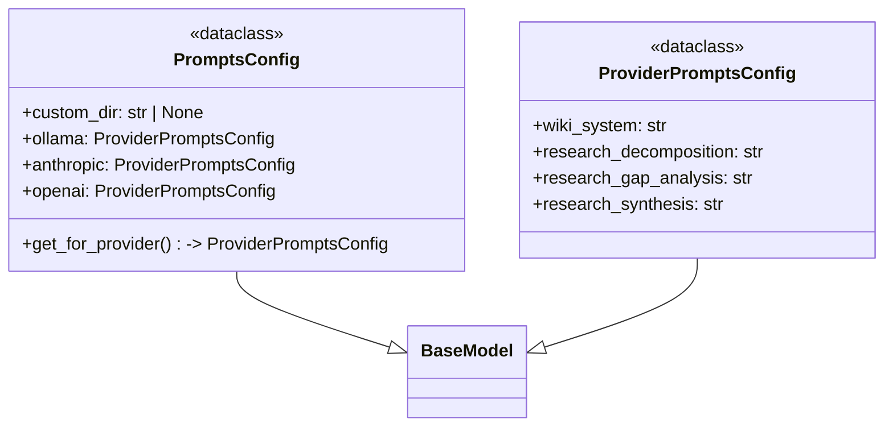

# File: `src/local_deepwiki/config/prompts.py`

## File Overview

This file defines the configuration structure for prompt templates used across different LLM providers within the `local_deepwiki` project. It centralizes the definition of system prompts for various tasks such as wiki documentation generation, question decomposition, gap analysis, and answer synthesis. The configuration is provider-specific, allowing for customization based on the LLM being used.

The design rationale behind this structure is to support multiple LLM providers (e.g., Ollama, Anthropic, OpenAI) while maintaining a consistent interface and enabling easy overrides through custom directories.

## Key Concepts

### Prompt Configuration Abstraction

The module introduces two core pydantic models:
- `ProviderPromptsConfig`: Encapsulates a set of prompts for a single LLM provider.
- `PromptsConfig`: Manages configurations for multiple providers and provides a method to retrieve the appropriate configuration for a given provider.

This abstraction allows for:
- Type-safe configuration handling using pydantic.
- Clear separation of concerns between different prompt types and providers.
- Extensibility by defining default prompts per provider and enabling override mechanisms via `custom_dir`.

### Provider-Specific Prompt Handling

Each LLM provider has its own set of prompts defined in dictionaries (`WIKI_SYSTEM_PROMPTS`, `RESEARCH_DECOMPOSITION_PROMPTS`, etc.), which are referenced during instantiation of `ProviderPromptsConfig`. This approach ensures that different providers can have tailored prompts optimized for their strengths and quirks.

### Default Fallback Strategy

In `PromptsConfig.get_for_provider`, unknown or unsupported provider names default to `anthropic` prompts. This choice reflects a pragmatic decision to maintain robustness by using a well-tested, detailed prompt set when an explicit override is not provided.

## Integration

This file integrates with:
- `src/local_deepwiki/config/models_llm.py`: Likely used to define or load prompt dictionaries (`WIKI_SYSTEM_PROMPTS`, etc.) that are referenced in this module.
- Tests such as `tests/test_ask_about_diff.py`, `tests/test_complexity_metrics.py`, and `tests/test_streaming_export.py`: These tests may utilize the prompt configurations to validate behavior or simulate LLM interactions.

The `PromptsConfig` class is designed to be instantiated once and reused throughout the application, providing consistent access to prompts for different LLM providers. It acts as a configuration hub that can be injected into components requiring prompt templates.

## Design Notes

### Use of pydantic Models

pydantic models are used to enforce type safety and provide built-in validation for configuration values. The `frozen=True` model configuration ensures immutability of the prompt configurations after initialization, preventing accidental modifications during runtime.

### Custom Prompt Directory Support

The `custom_dir` field in `PromptsConfig` allows users to override default prompts by placing provider-specific prompt files in a custom directory. This design supports flexibility and customization without modifying the core codebase.

### Default Provider Fallback

When a provider is not explicitly supported (e.g., `"google"`), the system defaults to `anthropic` prompts. This fallback ensures that the application remains functional even with new or untested providers, at the cost of potentially suboptimal prompt quality for those providers.

### Hardcoded Prompt References

Prompt templates are referenced via hardcoded dictionary lookups (e.g., `WIKI_SYSTEM_PROMPTS["ollama"]`). These dictionaries are expected to be defined elsewhere in the codebase, likely in a dedicated module or configuration file, and are accessed here to populate the prompt configurations. This separation keeps prompt definitions out of the configuration logic, promoting modularity.

## API Reference

### class `ProviderPromptsConfig`

**Inherits from:** `BaseModel`

Prompts configuration for a specific provider.


<details>
<summary>View Source (lines 234-246) | <a href="https://github.com/UrbanDiver/local-deepwiki-mcp/blob/main/src/local_deepwiki/config/prompts.py#L234-L246">GitHub</a></summary>

```python
class ProviderPromptsConfig(BaseModel):
    """Prompts configuration for a specific provider."""

    model_config = {"frozen": True}

    wiki_system: str = Field(
        description="System prompt for wiki documentation generation"
    )
    research_decomposition: str = Field(
        description="System prompt for question decomposition"
    )
    research_gap_analysis: str = Field(description="System prompt for gap analysis")
    research_synthesis: str = Field(description="System prompt for answer synthesis")
```

</details>

### class `PromptsConfig`

**Inherits from:** `BaseModel`

Provider-specific prompts configuration.

**Methods:**


<details>
<summary>View Source (lines 249-302) | <a href="https://github.com/UrbanDiver/local-deepwiki-mcp/blob/main/src/local_deepwiki/config/prompts.py#L249-L302">GitHub</a></summary>

```python
class PromptsConfig(BaseModel):
    """Provider-specific prompts configuration."""

    model_config = {"frozen": True}

    custom_dir: str | None = Field(
        default=None,
        description="Custom prompts directory path. Prompts in this directory "
        "override built-in defaults. Supports files like wiki_system.md, "
        "wiki_system.anthropic.md (provider-specific), etc.",
    )

    ollama: ProviderPromptsConfig = Field(
        default_factory=lambda: ProviderPromptsConfig(
            wiki_system=WIKI_SYSTEM_PROMPTS["ollama"],
            research_decomposition=RESEARCH_DECOMPOSITION_PROMPTS["ollama"],
            research_gap_analysis=RESEARCH_GAP_ANALYSIS_PROMPTS["ollama"],
            research_synthesis=RESEARCH_SYNTHESIS_PROMPTS["ollama"],
        )
    )
    anthropic: ProviderPromptsConfig = Field(
        default_factory=lambda: ProviderPromptsConfig(
            wiki_system=WIKI_SYSTEM_PROMPTS["anthropic"],
            research_decomposition=RESEARCH_DECOMPOSITION_PROMPTS["anthropic"],
            research_gap_analysis=RESEARCH_GAP_ANALYSIS_PROMPTS["anthropic"],
            research_synthesis=RESEARCH_SYNTHESIS_PROMPTS["anthropic"],
        )
    )
    openai: ProviderPromptsConfig = Field(
        default_factory=lambda: ProviderPromptsConfig(
            wiki_system=WIKI_SYSTEM_PROMPTS["openai"],
            research_decomposition=RESEARCH_DECOMPOSITION_PROMPTS["openai"],
            research_gap_analysis=RESEARCH_GAP_ANALYSIS_PROMPTS["openai"],
            research_synthesis=RESEARCH_SYNTHESIS_PROMPTS["openai"],
        )
    )

    def get_for_provider(self, provider: str) -> ProviderPromptsConfig:
        """Get prompts for a specific provider.

        Args:
            provider: Provider name ("ollama", "anthropic", "openai").

        Returns:
            ProviderPromptsConfig for the specified provider.
            Falls back to anthropic prompts for unknown providers.
        """
        if provider == "ollama":
            return self.ollama
        elif provider == "openai":
            return self.openai
        else:
            # Default to anthropic (most detailed prompts)
            return self.anthropic
```

</details>

#### `get_for_provider`

```python
def get_for_provider(provider: str) -> ProviderPromptsConfig
```

Get prompts for a specific provider.


| Parameter | Type | Default | Description |
|-----------|------|---------|-------------|
| `provider` | `str` | - | Provider name ("ollama", "anthropic", "openai"). |


<details>
<summary>View Source (lines 249-302) | <a href="https://github.com/UrbanDiver/local-deepwiki-mcp/blob/main/src/local_deepwiki/config/prompts.py#L249-L302">GitHub</a></summary>

```python
class PromptsConfig(BaseModel):
    """Provider-specific prompts configuration."""

    model_config = {"frozen": True}

    custom_dir: str | None = Field(
        default=None,
        description="Custom prompts directory path. Prompts in this directory "
        "override built-in defaults. Supports files like wiki_system.md, "
        "wiki_system.anthropic.md (provider-specific), etc.",
    )

    ollama: ProviderPromptsConfig = Field(
        default_factory=lambda: ProviderPromptsConfig(
            wiki_system=WIKI_SYSTEM_PROMPTS["ollama"],
            research_decomposition=RESEARCH_DECOMPOSITION_PROMPTS["ollama"],
            research_gap_analysis=RESEARCH_GAP_ANALYSIS_PROMPTS["ollama"],
            research_synthesis=RESEARCH_SYNTHESIS_PROMPTS["ollama"],
        )
    )
    anthropic: ProviderPromptsConfig = Field(
        default_factory=lambda: ProviderPromptsConfig(
            wiki_system=WIKI_SYSTEM_PROMPTS["anthropic"],
            research_decomposition=RESEARCH_DECOMPOSITION_PROMPTS["anthropic"],
            research_gap_analysis=RESEARCH_GAP_ANALYSIS_PROMPTS["anthropic"],
            research_synthesis=RESEARCH_SYNTHESIS_PROMPTS["anthropic"],
        )
    )
    openai: ProviderPromptsConfig = Field(
        default_factory=lambda: ProviderPromptsConfig(
            wiki_system=WIKI_SYSTEM_PROMPTS["openai"],
            research_decomposition=RESEARCH_DECOMPOSITION_PROMPTS["openai"],
            research_gap_analysis=RESEARCH_GAP_ANALYSIS_PROMPTS["openai"],
            research_synthesis=RESEARCH_SYNTHESIS_PROMPTS["openai"],
        )
    )

    def get_for_provider(self, provider: str) -> ProviderPromptsConfig:
        """Get prompts for a specific provider.

        Args:
            provider: Provider name ("ollama", "anthropic", "openai").

        Returns:
            ProviderPromptsConfig for the specified provider.
            Falls back to anthropic prompts for unknown providers.
        """
        if provider == "ollama":
            return self.ollama
        elif provider == "openai":
            return self.openai
        else:
            # Default to anthropic (most detailed prompts)
            return self.anthropic
```

</details>

## Class Diagram



## Usage Examples

*Examples extracted from test files*

### Test that custom_dir is included in search paths

From `test_prompts.py::TestPromptLoader::test_custom_dir_in_search_paths`:

```python
custom_dir = tmp_path / "prompts"
custom_dir.mkdir()

loader = PromptLoader(custom_dir=custom_dir)
paths = loader._get_search_paths()

assert custom_dir in paths
assert paths[0] == custom_dir  # Should be first (highest priority)
```


## Last Modified

| Entity | Type | Author | Date | Commit |
|--------|------|--------|------|--------|
| `ProviderPromptsConfig` | class | Brian Breidenbach | Feb 21, 2026 | `fecde6f` refactor: split 10 large fi... |
| `PromptsConfig` | class | Brian Breidenbach | Feb 21, 2026 | `fecde6f` refactor: split 10 large fi... |

## Relevant Source Files

- `src/local_deepwiki/config/prompts.py:234-246`
