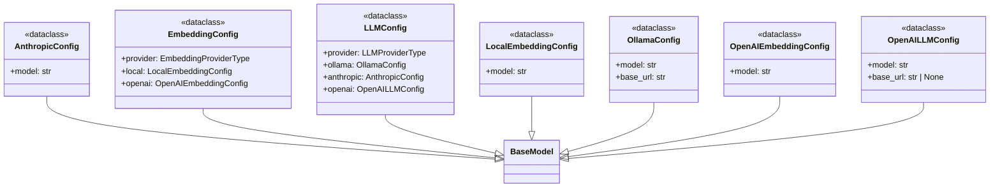

# File Overview

This file defines pydantic models for configuring embedding and LLM (Large [Language](../models/foundation.md) Model) providers used within the `local_deepwiki` project. It centralizes the structure and validation of provider-specific configurations, enabling flexible and type-safe handling of different model providers such as local models, OpenAI, Ollama, and Anthropic.

The models are designed to be used in conjunction with provider factories and configuration management logic to dynamically select and initialize the appropriate embedding or LLM provider based on user-defined settings.

# Key Concepts

The design of this file is centered around the following key concepts:

- **Provider Abstraction**: The `EmbeddingConfig` and `LLMConfig` classes abstract over different provider types by including fields for each supported provider. This allows for a unified configuration interface while supporting multiple backends.
  
- **Configuration Immutability**: All configuration classes use `model_config = {"frozen": True}` to ensure that once a configuration is initialized, it cannot be modified. This prevents accidental runtime changes that could lead to inconsistent behavior.

- **Default Values and Documentation**: Each configuration field includes sensible defaults and descriptive `Field` documentation, making it easier for users to understand and customize the configuration without deep knowledge of the underlying systems.

- **Type Safety with pydantic**: pydantic models enforce type checking and validation at runtime, ensuring that configuration values are valid before they are used to initialize providers. This reduces errors due to misconfiguration.

# Integration

This file is part of the configuration subsystem of `local_deepwiki` and is used by:

- `EmbeddingConfig` and `LLMConfig` are consumed by `__init__` and `provider_factory` functions in the project, indicating that these models are used to instantiate the appropriate embedding or LLM providers based on the configuration.

- It imports [`EmbeddingProviderType`](../models/provider_types.md) and [`LLMProviderType`](../models/provider_types.md) from `local_deepwiki.models.provider_types`, which likely defines enums for supported providers. This integration ensures type safety when selecting providers.

- The models are closely related to other configuration files in the project, such as `models_embedding.py`, `models_llm.py`, and `processing_models.py`, which probably define the actual provider implementations and how they are used.

# Design Notes

- **Flexibility Through Composition**: The configuration classes are structured to compose different provider-specific configurations (`LocalEmbeddingConfig`, `OpenAIEmbeddingConfig`, `OllamaConfig`, etc.) under a single umbrella (`EmbeddingConfig`, `LLMConfig`). This design allows for easy expansion if new providers are added in the future.

- **Default Provider Selection**: The default provider for embeddings is `LOCAL` and for LLMs is `OPENAI`. This choice reflects a balance between ease of use (local models are self-contained, while OpenAI offers strong performance) and project-specific defaults.

- **Use of `default_factory`**: Fields like `local`, `openai`, `ollama`, and `anthropic` in `EmbeddingConfig` and `LLMConfig` use `default_factory=...`, which ensures that a new instance of the configuration class is created for each `EmbeddingConfig` or `LLMConfig` instance, avoiding shared mutable state.

- **Frozen Models for Safety**: By freezing the models, the configuration system ensures that configuration values remain immutable once loaded. This is important for preventing runtime modifications that could lead to inconsistent or unexpected behavior.

- **Enum Integration**: The use of [`EmbeddingProviderType`](../models/provider_types.md) and [`LLMProviderType`](../models/provider_types.md) enforces a strict set of valid provider choices, reducing the chance of misconfiguration and supporting clear, maintainable code.

- **OpenAI-Compatible Proxies**: The `OpenAILLMConfig` includes an optional `base_url` field, allowing it to work with OpenAI-compatible proxies or custom endpoints, enhancing flexibility for users with non-standard deployments.

## API Reference

### class `LocalEmbeddingConfig`

**Inherits from:** `BaseModel`

Configuration for local embedding model.


<details>
<summary>View Source (lines 10-20) | <a href="https://github.com/UrbanDiver/local-deepwiki-mcp/blob/main/src/local_deepwiki/config/provider_models.py#L10-L20">GitHub</a></summary>

```python
class LocalEmbeddingConfig(BaseModel):
    """Configuration for local embedding model."""

    model_config = {"frozen": True}

    model: str = Field(
        default="multi-qa-MiniLM-L6-cos-v1",
        description="Model name for sentence-transformers. "
        "Default is multi-qa-MiniLM-L6-cos-v1 (512 tokens, Q&A-optimized) which "
        "provides better semantic coverage than all-MiniLM-L6-v2 (256 tokens).",
    )
```

</details>

### class `OpenAIEmbeddingConfig`

**Inherits from:** `BaseModel`

Configuration for OpenAI embedding model.


<details>
<summary>View Source (lines 23-30) | <a href="https://github.com/UrbanDiver/local-deepwiki-mcp/blob/main/src/local_deepwiki/config/provider_models.py#L23-L30">GitHub</a></summary>

```python
class OpenAIEmbeddingConfig(BaseModel):
    """Configuration for OpenAI embedding model."""

    model_config = {"frozen": True}

    model: str = Field(
        default="text-embedding-3-small", description="OpenAI embedding model"
    )
```

</details>

### class `EmbeddingConfig`

**Inherits from:** `BaseModel`

Embedding provider configuration.


<details>
<summary>View Source (lines 33-42) | <a href="https://github.com/UrbanDiver/local-deepwiki-mcp/blob/main/src/local_deepwiki/config/provider_models.py#L33-L42">GitHub</a></summary>

```python
class EmbeddingConfig(BaseModel):
    """Embedding provider configuration."""

    model_config = {"frozen": True, "use_enum_values": True}

    provider: EmbeddingProviderType = Field(
        default=EmbeddingProviderType.LOCAL, description="Embedding provider"
    )
    local: LocalEmbeddingConfig = Field(default_factory=LocalEmbeddingConfig)
    openai: OpenAIEmbeddingConfig = Field(default_factory=OpenAIEmbeddingConfig)
```

</details>

### class `OllamaConfig`

**Inherits from:** `BaseModel`

Configuration for Ollama LLM.


<details>
<summary>View Source (lines 45-53) | <a href="https://github.com/UrbanDiver/local-deepwiki-mcp/blob/main/src/local_deepwiki/config/provider_models.py#L45-L53">GitHub</a></summary>

```python
class OllamaConfig(BaseModel):
    """Configuration for Ollama LLM."""

    model_config = {"frozen": True}

    model: str = Field(default="qwen3-coder:30b", description="Ollama model name")
    base_url: str = Field(
        default="http://localhost:11434", description="Ollama API URL"
    )
```

</details>

### class `AnthropicConfig`

**Inherits from:** `BaseModel`

Configuration for Anthropic LLM.


<details>
<summary>View Source (lines 56-63) | <a href="https://github.com/UrbanDiver/local-deepwiki-mcp/blob/main/src/local_deepwiki/config/provider_models.py#L56-L63">GitHub</a></summary>

```python
class AnthropicConfig(BaseModel):
    """Configuration for Anthropic LLM."""

    model_config = {"frozen": True}

    model: str = Field(
        default="claude-sonnet-4-20250514", description="Anthropic model name"
    )
```

</details>

### class `OpenAILLMConfig`

**Inherits from:** `BaseModel`

Configuration for OpenAI LLM.


<details>
<summary>View Source (lines 66-75) | <a href="https://github.com/UrbanDiver/local-deepwiki-mcp/blob/main/src/local_deepwiki/config/provider_models.py#L66-L75">GitHub</a></summary>

```python
class OpenAILLMConfig(BaseModel):
    """Configuration for OpenAI LLM."""

    model_config = {"frozen": True}

    model: str = Field(default="gpt-4o", description="OpenAI model name")
    base_url: str | None = Field(
        default=None,
        description="Custom API base URL for OpenAI-compatible proxies",
    )
```

</details>

### class `LLMConfig`

**Inherits from:** `BaseModel`

LLM provider configuration.


<details>
<summary>View Source (lines 78-88) | <a href="https://github.com/UrbanDiver/local-deepwiki-mcp/blob/main/src/local_deepwiki/config/provider_models.py#L78-L88">GitHub</a></summary>

```python
class LLMConfig(BaseModel):
    """LLM provider configuration."""

    model_config = {"frozen": True, "use_enum_values": True}

    provider: LLMProviderType = Field(
        default=LLMProviderType.OPENAI, description="LLM provider"
    )
    ollama: OllamaConfig = Field(default_factory=OllamaConfig)
    anthropic: AnthropicConfig = Field(default_factory=AnthropicConfig)
    openai: OpenAILLMConfig = Field(default_factory=OpenAILLMConfig)
```

</details>

## Class Diagram



## Last Modified

| Entity | Type | Author | Date | Commit |
|--------|------|--------|------|--------|
| `OpenAILLMConfig` | class | Brian Breidenbach | today | `27e3cd1` feat: release readiness — O... |
| `LLMConfig` | class | Brian Breidenbach | today | `27e3cd1` feat: release readiness — O... |
| `EmbeddingConfig` | class | Brian Breidenbach | Feb 22, 2026 | `78abcdc` refactor: replace global si... |
| `LocalEmbeddingConfig` | class | Brian Breidenbach | Feb 21, 2026 | `fecde6f` refactor: split 10 large fi... |
| `OpenAIEmbeddingConfig` | class | Brian Breidenbach | Feb 21, 2026 | `fecde6f` refactor: split 10 large fi... |
| `OllamaConfig` | class | Brian Breidenbach | Feb 21, 2026 | `fecde6f` refactor: split 10 large fi... |
| `AnthropicConfig` | class | Brian Breidenbach | Feb 21, 2026 | `fecde6f` refactor: split 10 large fi... |

## Relevant Source Files

- `src/local_deepwiki/config/provider_models.py:10-20`
