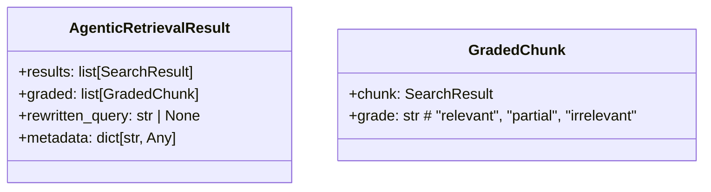
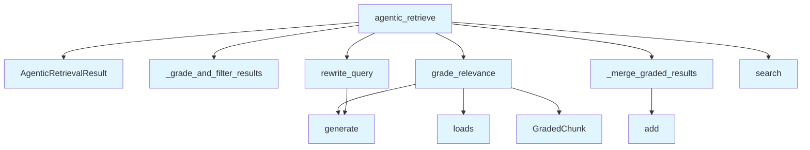

# File: `src/local_deepwiki/core/agentic_rag.py`

## File Overview

This file implements an **agentic retrieval-augmented generation (RAG)** mechanism designed to improve the relevance and quality of search results in code documentation systems. It introduces a two-stage retrieval process: first, it retrieves candidate chunks from a vector store; then, it grades their relevance using an LLM. If the initial results are not sufficiently relevant, it rewrites the query and performs a second retrieval to refine the results.

The module is intended to be used as an optional enhancement to the standard retrieval flow, activated by setting `agentic_rag=True` in the `ask_question` function.

## Key Concepts

### Relevance Grading with LLM

The `grade_relevance` function performs a single LLM call to assess the relevance of all retrieved chunks at once. This approach balances cost and performance by minimizing LLM calls while ensuring a comprehensive evaluation. It uses a structured prompt that returns a JSON array of relevance labels (`"relevant"`, `"partial"`, `"irrelevant"`), which are parsed and validated for correctness.

### Query Rewriting

If the fraction of relevant chunks falls below a configurable threshold (default 50%), the system invokes `rewrite_query` to generate a more targeted query. This step helps the system recover from overly broad initial searches and improves result quality. The rewriting logic is informed by a summary of what was found and what’s missing.

### Result Merging and Deduplication

The `_merge_graded_results` function combines results from both retrieval rounds, ensuring no duplicate chunks (based on file and line) are returned. Relevant chunks are prioritized, and irrelevant chunks from the first round are appended as fallbacks. This ensures that the final result set is both diverse and high-quality.

### Agentic Loop Design

The `agentic_retrieve` function orchestrates the full agentic loop:
1. Initial search.
2. Grading of relevance.
3. Conditional query rewriting and re-search.
4. Final result compilation.

This design allows for intelligent refinement without increasing the default retrieval cost unless necessary.

## Integration

This module integrates with the broader `local_deepwiki` system as part of the core RAG pipeline. It depends on:
- [`VectorStore`](vectorstore/store.md) for performing vector-based search.
- [`LLMProvider`](../providers/base.md) for generating relevance grades and rewriting queries.
- [`SearchResult`](../handlers/types.md) and `GradedChunk` for representing and manipulating search data.

The module is likely consumed by the main CLI or API entry points such as `src/local_deepwiki/cli/main.py` or similar modules that handle user questions and dispatch retrieval logic. The `AgenticRetrievalResult` is returned as part of the structured output, which may be further processed or rendered in the CLI or web UI.

## Design Notes

### Cost Optimization

- The system performs a single LLM call for grading relevance, minimizing cost.
- A second LLM call (for query rewriting) is only made if needed, based on a relevance threshold.
- This ensures that the enhancement is opt-in and does not increase default processing costs.

### Fallback Behavior

In case of LLM failures or parsing errors:
- If the JSON response cannot be parsed, or the number of grades doesn't match the number of results, the system falls back to treating all chunks as relevant.
- If query rewriting fails, the original question is used.

### Deduplication Strategy

The merging logic avoids returning duplicate chunks by using a key based on `file_path` and `start_line`. This prevents redundant or overlapping results, especially when a chunk appears in both rounds of retrieval.

### Threshold for Rewriting

The `relevance_threshold` is configurable and defaults to 0.5. This value was chosen to balance between avoiding unnecessary rewrites (which would add cost) and ensuring sufficient relevance in the initial results. A higher threshold would make the system less likely to rewrite, while a lower one would trigger more rewrites.

## API Reference

### class `GradedChunk`

A search result with its relevance grade.


<details>
<summary>View Source (lines 30-34) | <a href="https://github.com/UrbanDiver/local-deepwiki-mcp/blob/main/src/local_deepwiki/core/agentic_rag.py#L30-L34">GitHub</a></summary>

```python
class GradedChunk:
    """A search result with its relevance grade."""

    chunk: SearchResult
    grade: str  # "relevant", "partial", "irrelevant"
```

</details>

### class `AgenticRetrievalResult`

Result of the agentic retrieval process.

---


<details>
<summary>View Source (lines 38-44) | <a href="https://github.com/UrbanDiver/local-deepwiki-mcp/blob/main/src/local_deepwiki/core/agentic_rag.py#L38-L44">GitHub</a></summary>

```python
class AgenticRetrievalResult:
    """Result of the agentic retrieval process."""

    results: list[SearchResult]
    graded: list[GradedChunk]
    rewritten_query: str | None
    metadata: dict[str, Any]
```

</details>

### Functions

#### `grade_relevance`

```python
async def grade_relevance(results: list[SearchResult], question: str, llm: LLMProvider) -> list[GradedChunk]
```

Grade the relevance of search results to the question.  Makes a single LLM call to grade all chunks at once.


| Parameter | Type | Default | Description |
|-----------|------|---------|-------------|
| `results` | `list[SearchResult]` | - | Search results from vector store. |
| `question` | `str` | - | The original user question. |
| `llm` | `LLMProvider` | - | LLM provider instance. |

**Returns:** `list[GradedChunk]`


<details>
<summary>View Source (lines 47-118) | <a href="https://github.com/UrbanDiver/local-deepwiki-mcp/blob/main/src/local_deepwiki/core/agentic_rag.py#L47-L118">GitHub</a></summary>

```python
async def grade_relevance(
    results: list[SearchResult],
    question: str,
    llm: LLMProvider,
) -> list[GradedChunk]:
    """Grade the relevance of search results to the question.

    Makes a single LLM call to grade all chunks at once.

    Args:
        results: Search results from vector store.
        question: The original user question.
        llm: LLM provider instance.

    Returns:
        List of GradedChunk with relevance grades.
    """
    if not results:
        return []

    # Build a compact prompt for grading
    chunk_summaries = []
    for i, r in enumerate(results):
        chunk = r.chunk
        preview = chunk.content[:200].replace("\n", " ")
        chunk_summaries.append(
            f"[{i}] {chunk.file_path}:{chunk.start_line} — {preview}"
        )

    prompt = f"""Grade the relevance of each code chunk to this question: "{question}"

Chunks:
{chr(10).join(chunk_summaries)}

Respond with a JSON array of grades, one per chunk. Each grade must be exactly one of: "relevant", "partial", "irrelevant".
Example: ["relevant", "irrelevant", "partial"]

JSON array:"""

    system_prompt = (
        "You are a relevance grading assistant. "
        "Output only a JSON array of grade strings, nothing else."
    )

    try:
        response = await llm.generate(prompt, system_prompt=system_prompt)
        # Parse the JSON response
        grades = json.loads(response.strip())
        if not isinstance(grades, list) or len(grades) != len(results):
            logger.warning(
                "Grade response length mismatch: got %d, expected %d",
                len(grades) if isinstance(grades, list) else 0,
                len(results),
            )
            # Fall back: treat all as relevant
            return [GradedChunk(chunk=r, grade="relevant") for r in results]

        valid_grades = {"relevant", "partial", "irrelevant"}
        return [
            GradedChunk(
                chunk=r,
                grade=g if g in valid_grades else "relevant",
            )
            for r, g in zip(results, grades)
        ]
    except (json.JSONDecodeError, TypeError, ValueError) as e:
        logger.warning("Failed to parse relevance grades: %s", e)
        # Fall back: treat all as relevant
        return [GradedChunk(chunk=r, grade="relevant") for r in results]
    except Exception as e:  # noqa: BLE001
        logger.warning("LLM grading failed: %s", e)
        return [GradedChunk(chunk=r, grade="relevant") for r in results]
```

</details>

#### `rewrite_query`

```python
async def rewrite_query(question: str, context_summary: str, gaps: str, llm: LLMProvider) -> str
```

Rewrite a query to better target missing information.


| Parameter | Type | Default | Description |
|-----------|------|---------|-------------|
| `question` | `str` | - | Original question. |
| `context_summary` | `str` | - | Summary of what was already found. |
| `gaps` | `str` | - | Description of what's missing. |
| `llm` | `LLMProvider` | - | LLM provider instance. |

**Returns:** `str`


<details>
<summary>View Source (lines 121-157) | <a href="https://github.com/UrbanDiver/local-deepwiki-mcp/blob/main/src/local_deepwiki/core/agentic_rag.py#L121-L157">GitHub</a></summary>

```python
async def rewrite_query(
    question: str,
    context_summary: str,
    gaps: str,
    llm: LLMProvider,
) -> str:
    """Rewrite a query to better target missing information.

    Args:
        question: Original question.
        context_summary: Summary of what was already found.
        gaps: Description of what's missing.
        llm: LLM provider instance.

    Returns:
        Rewritten query string.
    """
    prompt = f"""The user asked: "{question}"

What was found so far: {context_summary}
What's missing: {gaps}

Rewrite the question to better find the missing information. Output only the rewritten question, nothing else."""

    system_prompt = (
        "You are a query rewriting assistant. Output only the rewritten question."
    )

    try:
        rewritten = await llm.generate(prompt, system_prompt=system_prompt)
        rewritten = rewritten.strip().strip('"')
        if rewritten:
            return rewritten
    except Exception as e:  # noqa: BLE001
        logger.warning("Query rewrite failed: %s", e)

    return question  # Fall back to original
```

</details>

#### `agentic_retrieve`

```python
async def agentic_retrieve(question: str, vector_store: VectorStore, llm: LLMProvider, max_context: int = 15, relevance_threshold: float = 0.5) -> AgenticRetrievalResult
```

Perform agentic retrieval: retrieve, grade, optionally rewrite and re-retrieve.


| Parameter | Type | Default | Description |
|-----------|------|---------|-------------|
| `question` | `str` | - | User question. |
| `vector_store` | `VectorStore` | - | Vector store for search. |
| `llm` | `LLMProvider` | - | LLM provider for grading and rewriting. |
| `max_context` | `int` | `15` | Maximum chunks to retrieve. |
| `relevance_threshold` | `float` | `0.5` | Fraction of chunks that must be relevant to skip rewrite. |

**Returns:** `AgenticRetrievalResult`


<details>
<summary>View Source (lines 225-284) | <a href="https://github.com/UrbanDiver/local-deepwiki-mcp/blob/main/src/local_deepwiki/core/agentic_rag.py#L225-L284">GitHub</a></summary>

```python
async def agentic_retrieve(
    question: str,
    vector_store: VectorStore,
    llm: LLMProvider,
    *,
    max_context: int = 15,
    relevance_threshold: float = 0.5,
) -> AgenticRetrievalResult:
    """Perform agentic retrieval: retrieve, grade, optionally rewrite and re-retrieve.

    Args:
        question: User question.
        vector_store: Vector store for search.
        llm: LLM provider for grading and rewriting.
        max_context: Maximum chunks to retrieve.
        relevance_threshold: Fraction of chunks that must be relevant to skip rewrite.

    Returns:
        AgenticRetrievalResult with graded results and metadata.
    """
    initial_results = await vector_store.search(question, limit=max_context)

    if not initial_results:
        return AgenticRetrievalResult(
            results=[],
            graded=[],
            rewritten_query=None,
            metadata={"rounds": 1, "initial_count": 0, "rewritten": False},
        )

    graded = await grade_relevance(initial_results, question, llm)

    relevant_count = sum(1 for g in graded if g.grade == "relevant")
    relevant_fraction = relevant_count / len(graded) if graded else 0

    rewritten_query = None

    if relevant_fraction < relevance_threshold and len(graded) > 0:
        context_summary, gaps = _grade_and_filter_results(graded, relevant_count)
        rewritten_query = await rewrite_query(question, context_summary, gaps, llm)

        if rewritten_query != question:
            new_results = await vector_store.search(rewritten_query, limit=max_context)
            new_graded = await grade_relevance(new_results, question, llm)
            graded = _merge_graded_results(graded, new_graded, max_context)

    final_results = [g.chunk for g in graded]

    return AgenticRetrievalResult(
        results=final_results,
        graded=graded,
        rewritten_query=rewritten_query,
        metadata={
            "rounds": 2 if rewritten_query else 1,
            "initial_count": len(initial_results),
            "relevant_count": relevant_count,
            "relevant_fraction": round(relevant_fraction, 3),
            "rewritten": rewritten_query is not None,
        },
    )
```

</details>

## Class Diagram



## Call Graph



## Used By

Functions and methods in this file and their callers:

- **`AgenticRetrievalResult`**: called by `agentic_retrieve`
- **`GradedChunk`**: called by `grade_relevance`
- **`_grade_and_filter_results`**: called by `agentic_retrieve`
- **`_merge_graded_results`**: called by `agentic_retrieve`
- **`add`**: called by `_merge_graded_results`
- **`generate`**: called by `grade_relevance`, `rewrite_query`
- **`grade_relevance`**: called by `agentic_retrieve`
- **`loads`**: called by `grade_relevance`
- **`rewrite_query`**: called by `agentic_retrieve`
- **`search`**: called by `agentic_retrieve`

## Usage Examples

*Examples extracted from test files*

### Example: `grade_relevance`

From `test_agentic_rag.py::TestGradeRelevance::test_empty_results`:

```python
llm = AsyncMock()
        graded = await grade_relevance([], "question", llm)
        assert graded == []
        llm.generate.assert_not_called()
```

### Example: `grade_relevance`

From `test_agentic_rag.py::TestGradeRelevance::test_all_relevant`:

```python
llm = AsyncMock()
        llm.generate.return_value = '["relevant", "relevant"]'

        results = [_make_search_result("a.py"), _make_search_result("b.py")]
        graded = await grade_relevance(results, "How does auth work?", llm)

        assert len(graded) == 2
        assert all(g.grade == "relevant" for g in graded)
        llm.generate.assert_called_once()
```

### Example: `rewrite_query`

From `test_agentic_rag.py::TestRewriteQuery::test_successful_rewrite`:

```python
rewritten = await rewrite_query(
    "How does auth work?",
    "Found some auth-related files",
    "Missing JWT validation logic",
    llm,
)

assert (
    rewritten == "How does the authentication middleware validate JWT tokens?"
)
```

### Example: `rewrite_query`

From `test_agentic_rag.py::TestRewriteQuery::test_strips_quotes`:

```python
llm = AsyncMock()
        llm.generate.return_value = '"What is the auth flow?"'

        rewritten = await rewrite_query("auth?", "context", "gaps", llm)
        assert rewritten == "What is the auth flow?"
```

### When most results are relevant, no rewrite should happen

From `test_agentic_rag.py::TestAgenticRetrieve::test_high_quality_no_rewrite`:

```python
vector_store = AsyncMock()
llm = AsyncMock()

search_results = [_make_search_result(f"{i}.py") for i in range(5)]
vector_store.search.return_value = search_results

# All relevant
llm.generate.return_value = json.dumps(["relevant"] * 5)

result = await agentic_retrieve("question", vector_store, llm, max_context=5)

assert isinstance(result, AgenticRetrievalResult)
assert len(result.results) == 5
assert result.rewritten_query is None
assert result.metadata["rewritten"] is False
assert result.metadata["rounds"] == 1
```


## Last Modified

| Entity | Type | Author | Date | Commit |
|--------|------|--------|------|--------|
| `_grade_and_filter_results` | function | Brian Breidenbach | 1 week ago | `af244a5` refactor: split core hotspo... |
| `_merge_graded_results` | function | Brian Breidenbach | 1 week ago | `af244a5` refactor: split core hotspo... |
| `agentic_retrieve` | function | Brian Breidenbach | 1 week ago | `af244a5` refactor: split core hotspo... |
| `grade_relevance` | function | Brian Breidenbach | Feb 20, 2026 | `8182b15` refactor: Pythonic API impr... |
| `rewrite_query` | function | Brian Breidenbach | Feb 20, 2026 | `8182b15` refactor: Pythonic API impr... |
| `GradedChunk` | class | Brian Breidenbach | Feb 12, 2026 | `df695d3` feat: add MCP Resources, ag... |
| `AgenticRetrievalResult` | class | Brian Breidenbach | Feb 12, 2026 | `df695d3` feat: add MCP Resources, ag... |

## Additional Source Code

Source code for functions and methods not listed in the API Reference above.

#### `_grade_and_filter_results`

<details>
<summary>View Source (lines 160-186) | <a href="https://github.com/UrbanDiver/local-deepwiki-mcp/blob/main/src/local_deepwiki/core/agentic_rag.py#L160-L186">GitHub</a></summary>

```python
def _grade_and_filter_results(
    graded: list[GradedChunk],
    relevant_count: int,
) -> tuple[str, str]:
    """Summarise what was found and describe the gaps for query rewriting.

    Args:
        graded: Graded chunks from the first retrieval round.
        relevant_count: Number of chunks graded as "relevant".

    Returns:
        Tuple of (context_summary, gaps) strings for use in query rewriting.
    """
    relevant_files = [g.chunk.chunk.file_path for g in graded if g.grade == "relevant"]
    irrelevant_files = [
        g.chunk.chunk.file_path for g in graded if g.grade == "irrelevant"
    ]
    context_summary = (
        f"Found {relevant_count} relevant chunks in: {', '.join(relevant_files[:5])}"
        if relevant_files
        else "No clearly relevant code found"
    )
    gaps = (
        f"Most results were irrelevant (from: {', '.join(irrelevant_files[:5])}). "
        "Need more targeted results."
    )
    return context_summary, gaps
```

</details>


#### `_merge_graded_results`

<details>
<summary>View Source (lines 189-222) | <a href="https://github.com/UrbanDiver/local-deepwiki-mcp/blob/main/src/local_deepwiki/core/agentic_rag.py#L189-L222">GitHub</a></summary>

```python
def _merge_graded_results(
    first_graded: list[GradedChunk],
    new_graded: list[GradedChunk],
    max_context: int,
) -> list[GradedChunk]:
    """Merge two rounds of graded results, deduplicating by file+line.

    Relevant chunks from both rounds come first; irrelevant chunks from
    the first round are appended as a fallback.

    Args:
        first_graded: Graded results from the initial retrieval.
        new_graded: Graded results from the rewritten-query retrieval.
        max_context: Maximum number of chunks to return.

    Returns:
        Merged, deduplicated list capped at *max_context*.
    """
    seen: set[str] = set()
    merged: list[GradedChunk] = []

    for g in first_graded + new_graded:
        key = f"{g.chunk.chunk.file_path}:{g.chunk.chunk.start_line}"
        if key not in seen and g.grade != "irrelevant":
            seen.add(key)
            merged.append(g)

    for g in first_graded:
        key = f"{g.chunk.chunk.file_path}:{g.chunk.chunk.start_line}"
        if key not in seen:
            seen.add(key)
            merged.append(g)

    return merged[:max_context]
```

</details>

## Relevant Source Files

- `src/local_deepwiki/core/agentic_rag.py:30-34`
