# File: `src/local_deepwiki/core/audit.py`

## File Overview

This module implements a comprehensive audit logging system for the `local-deepwiki` application. It is designed to support compliance with security standards such as SOC2, GDPR, and HIPAA, while also enabling security incident investigation and operational monitoring.

The audit system logs critical events related to access control, repository indexing, query execution, and export operations. It centralizes these logs into a structured JSON format that can be ingested by log analysis tools and security information and event management (SIEM) systems.

The module provides a singleton `AuditLogger` class to ensure consistent logging across the application, with a global accessor function `get_audit_logger()` and a reset function `reset_audit_logger()` for testing purposes.

## Key Concepts

### Audit Event Types and Severity

The audit system is built around two key enumerations:
- `AuditEventType`: Categorizes events by operation type, enabling filtering and analysis.
- `AuditSeverity`: Classifies events by urgency, supporting alerting and log rotation policies.

These are defined using `StrEnum` to ensure that event types and severity levels are serialized as strings in logs, making them easy to parse and query.

### Structured Logging with `AuditEvent`

The `AuditEvent` class serves as a standardized data structure for all audit events. It includes:
- A timestamp in ISO8601 format
- [Event](../events.md) type, severity, and result
- [Subject](../security/access_control.md) (user/service) and resource details
- Action and outcome
- Optional reason and additional context

This structure ensures that all audit logs contain consistent, rich metadata, which is crucial for compliance reporting and forensic analysis.

### Context-Aware Logging

The system supports structured parameter objects (e.g., `QueryAuditParams`, `IndexAuditParams`) that are used to build `AuditEvent` instances. This approach promotes type safety and ensures that all relevant information is captured consistently.

### Rotating File Handler

The `AuditLogger` uses a `TimedRotatingFileHandler` with daily rotation and a 30-day retention policy. This balances log storage efficiency with the need to retain sufficient historical data for investigation.

### Critical Event Visibility

Critical audit events (e.g., authentication failures, access denials) are automatically logged to the application logger in addition to the audit file. This ensures that such events are immediately visible in standard application logs, enabling rapid response.

## Integration

This module is integrated into the `local-deepwiki` core by:
- Providing a global `AuditLogger` instance via `get_audit_logger()`, which is used throughout the application.
- Supporting CLI modules such as `check_cli.py`, `config_validator.py`, `main.py`, and `status_cli.py` by offering a consistent audit logging interface for operations like index, query, and export.

It depends on:
- [`local_deepwiki.logging.get_logger`](../logging.md) for application-level logging integration.
- `contextvars.ContextVar` for managing the singleton `AuditLogger` instance in a thread-safe way.

The `AuditLogger` class is used by:
- Test modules via `get_audit_logger` and `reset_audit_logger` for isolated testing.
- Core components that perform access control, query execution, indexing, and export operations.

## Design Notes

### Singleton Pattern with ContextVar

The `AuditLogger` is implemented as a singleton using `ContextVar` to allow for thread-safe access and testing. This design choice avoids global state pollution and allows for easy mocking in tests.

### JSON Serialization

All audit events are serialized to JSON for storage. This choice supports interoperability with log analysis tools and ensures that event data can be efficiently indexed and queried.

### Privacy and Log Length Limitation

Query strings are truncated to 100 characters when logged to prevent sensitive information from appearing in logs. This is a balance between audit completeness and privacy protection.

### Critical Event Propagation

Critical events are logged to both the audit file and the application logger. This ensures visibility without relying on log aggregation systems and supports immediate alerting.

### Backward Compatibility

The module avoids breaking changes to its API, using default values and optional fields to maintain compatibility with future enhancements.

### Log Rotation Strategy

The use of `TimedRotatingFileHandler` with a 30-day backup count ensures that logs are rotated daily while maintaining a reasonable history. This is a pragmatic trade-off between storage and audit requirements.

### Type Safety and Data Validation

The use of `dataclasses` for audit parameters (`AccessDecisionParams`, `QueryAuditParams`, etc.) and `AuditEvent` ensures type safety and makes it easier to validate and document the expected fields for each type of audit event.

## API Reference

### class `AuditEventType`

**Inherits from:** `StrEnum`

Types of audit events.  Categorized by operation type for easier filtering and analysis.


<details>
<summary>View Source (lines 31-62) | <a href="https://github.com/UrbanDiver/local-deepwiki-mcp/blob/main/src/local_deepwiki/core/audit.py#L31-L62">GitHub</a></summary>

```python
class AuditEventType(StrEnum):
    """Types of audit events.

    Categorized by operation type for easier filtering and analysis.
    """

    # Access control events
    ACCESS_GRANTED = "access_granted"
    ACCESS_DENIED = "access_denied"

    # Repository indexing events
    INDEX_STARTED = "index_started"
    INDEX_COMPLETED = "index_completed"
    INDEX_FAILED = "index_failed"

    # Query operation events
    QUERY_EXECUTED = "query_executed"
    QUERY_FAILED = "query_failed"

    # Export operation events
    EXPORT_STARTED = "export_started"
    EXPORT_COMPLETED = "export_completed"

    # Configuration events
    CONFIG_READ = "config_read"
    CONFIG_MODIFIED = "config_modified"

    # Security events
    AUTHENTICATION_SUCCESS = "authentication_success"
    AUTHENTICATION_FAILED = "authentication_failed"
    AUTHORIZATION_FAILED = "authorization_failed"
    SENSITIVE_RESOURCE_ACCESSED = "sensitive_resource_accessed"
```

</details>

### class `AuditSeverity`

**Inherits from:** `StrEnum`

Severity levels for audit events.  Used to categorize events for alerting and log rotation policies.


<details>
<summary>View Source (lines 65-73) | <a href="https://github.com/UrbanDiver/local-deepwiki-mcp/blob/main/src/local_deepwiki/core/audit.py#L65-L73">GitHub</a></summary>

```python
class AuditSeverity(StrEnum):
    """Severity levels for audit events.

    Used to categorize events for alerting and log rotation policies.
    """

    INFO = "info"
    WARNING = "warning"
    CRITICAL = "critical"
```

</details>

### class `AuditEvent`

Represents an audit event for logging.  All fields are designed to support compliance reporting and security incident investigation.  Attributes: timestamp: ISO8601 formatted timestamp with timezone. event_type: Type of audit event. severity: Severity level of the event. subject_id: Identifier of the user/service performing the action. subject_role: Role of the subject (ADMIN, EDITOR, VIEWER, GUEST). resource_type: Type of resource being accessed (repository, config, query, etc.). resource_path: Path or identifier of the specific resource. action: Description of the action being performed. result: Outcome of the action (success/failure). reason: Explanation for failures or denials. details: Additional context as key-value pairs.


<details>
<summary>View Source (lines 77-107) | <a href="https://github.com/UrbanDiver/local-deepwiki-mcp/blob/main/src/local_deepwiki/core/audit.py#L77-L107">GitHub</a></summary>

```python
class AuditEvent:
    """Represents an audit event for logging.

    All fields are designed to support compliance reporting and
    security incident investigation.

    Attributes:
        timestamp: ISO8601 formatted timestamp with timezone.
        event_type: Type of audit event.
        severity: Severity level of the event.
        subject_id: Identifier of the user/service performing the action.
        subject_role: Role of the subject (ADMIN, EDITOR, VIEWER, GUEST).
        resource_type: Type of resource being accessed (repository, config, query, etc.).
        resource_path: Path or identifier of the specific resource.
        action: Description of the action being performed.
        result: Outcome of the action (success/failure).
        reason: Explanation for failures or denials.
        details: Additional context as key-value pairs.
    """

    timestamp: str
    event_type: AuditEventType
    severity: AuditSeverity
    subject_id: str | None
    subject_role: str | None
    resource_type: str
    resource_path: str
    action: str
    result: str
    reason: str | None = None
    details: dict[str, Any] = field(default_factory=dict)
```

</details>

### class `AccessDecisionParams`

Parameters for logging an access control decision.  Attributes: subject_id: Identifier of the subject requesting access. subject_role: Role of the subject. resource_type: Type of resource (operation, file, etc.). resource_path: Path or identifier of the resource. permission_requested: The permission being requested. granted: Whether access was granted. reason: Explanation for the decision (especially for denials).


<details>
<summary>View Source (lines 111-130) | <a href="https://github.com/UrbanDiver/local-deepwiki-mcp/blob/main/src/local_deepwiki/core/audit.py#L111-L130">GitHub</a></summary>

```python
class AccessDecisionParams:
    """Parameters for logging an access control decision.

    Attributes:
        subject_id: Identifier of the subject requesting access.
        subject_role: Role of the subject.
        resource_type: Type of resource (operation, file, etc.).
        resource_path: Path or identifier of the resource.
        permission_requested: The permission being requested.
        granted: Whether access was granted.
        reason: Explanation for the decision (especially for denials).
    """

    subject_id: str | None
    subject_role: str | None
    resource_type: str
    resource_path: str
    permission_requested: str
    granted: bool
    reason: str | None = None
```

</details>

### class `QueryAuditParams`

Parameters for logging a query execution.  Attributes: subject_id: Identifier of the subject executing the query. repo_path: Path to the repository being queried. query: The query string (truncated for privacy in logs). success: Whether the query succeeded. query_type: Type of query (search, deep_research). error_message: Error message if query failed. chunks_returned: Number of result chunks returned. duration_ms: Query duration in milliseconds.


<details>
<summary>View Source (lines 134-155) | <a href="https://github.com/UrbanDiver/local-deepwiki-mcp/blob/main/src/local_deepwiki/core/audit.py#L134-L155">GitHub</a></summary>

```python
class QueryAuditParams:
    """Parameters for logging a query execution.

    Attributes:
        subject_id: Identifier of the subject executing the query.
        repo_path: Path to the repository being queried.
        query: The query string (truncated for privacy in logs).
        success: Whether the query succeeded.
        query_type: Type of query (search, deep_research).
        error_message: Error message if query failed.
        chunks_returned: Number of result chunks returned.
        duration_ms: Query duration in milliseconds.
    """

    subject_id: str | None
    repo_path: str
    query: str
    success: bool
    query_type: str = "search"
    error_message: str | None = None
    chunks_returned: int | None = None
    duration_ms: int | None = None
```

</details>

### class `IndexAuditParams`

Parameters for logging an indexing operation.  Attributes: subject_id: Identifier of the subject performing the operation. repo_path: Path to the repository being indexed. operation: Operation type (started, completed, failed). success: Whether the operation succeeded. files_processed: Number of files processed. chunks_created: Number of chunks created. duration_ms: Operation duration in milliseconds. error_message: Error message if operation failed.


<details>
<summary>View Source (lines 159-180) | <a href="https://github.com/UrbanDiver/local-deepwiki-mcp/blob/main/src/local_deepwiki/core/audit.py#L159-L180">GitHub</a></summary>

```python
class IndexAuditParams:
    """Parameters for logging an indexing operation.

    Attributes:
        subject_id: Identifier of the subject performing the operation.
        repo_path: Path to the repository being indexed.
        operation: Operation type (started, completed, failed).
        success: Whether the operation succeeded.
        files_processed: Number of files processed.
        chunks_created: Number of chunks created.
        duration_ms: Operation duration in milliseconds.
        error_message: Error message if operation failed.
    """

    subject_id: str | None
    repo_path: str
    operation: str
    success: bool
    files_processed: int | None = None
    chunks_created: int | None = None
    duration_ms: int | None = None
    error_message: str | None = None
```

</details>

### class `ExportAuditParams`

Parameters for logging an export operation.  Attributes: subject_id: Identifier of the subject performing the export. wiki_path: Path to the wiki being exported. output_path: Destination path for the export. export_type: Type of export (html, pdf). operation: Operation type (started, completed). success: Whether the operation succeeded. pages_exported: Number of pages exported. duration_ms: Operation duration in milliseconds. error_message: Error message if operation failed.


<details>
<summary>View Source (lines 184-207) | <a href="https://github.com/UrbanDiver/local-deepwiki-mcp/blob/main/src/local_deepwiki/core/audit.py#L184-L207">GitHub</a></summary>

```python
class ExportAuditParams:
    """Parameters for logging an export operation.

    Attributes:
        subject_id: Identifier of the subject performing the export.
        wiki_path: Path to the wiki being exported.
        output_path: Destination path for the export.
        export_type: Type of export (html, pdf).
        operation: Operation type (started, completed).
        success: Whether the operation succeeded.
        pages_exported: Number of pages exported.
        duration_ms: Operation duration in milliseconds.
        error_message: Error message if operation failed.
    """

    subject_id: str | None
    wiki_path: str
    output_path: str
    export_type: str
    operation: str
    success: bool
    pages_exported: int | None = None
    duration_ms: int | None = None
    error_message: str | None = None
```

</details>

### class `AuditLogger`

Manages audit logging for security events.  Provides structured logging of security-relevant events to file, with automatic daily rotation and 30-day retention.  The audit logger uses a separate logging hierarchy from the application logger to ensure audit events are never accidentally filtered or lost.

**Methods:**


<details>
<summary>View Source (lines 210-473) | <a href="https://github.com/UrbanDiver/local-deepwiki-mcp/blob/main/src/local_deepwiki/core/audit.py#L210-L473">GitHub</a></summary>

```python
class AuditLogger:
    # Methods: __init__, _setup_logger, log_event, log_access_decision, log_query, log_index, log_export
```

</details>

#### `__init__`

```python
def __init__(log_dir: Path | None = None) -> None
```

Initialize the audit logger.


| Parameter | Type | Default | Description |
|-----------|------|---------|-------------|
| `log_dir` | `Path | None` | `None` | Directory to store audit logs. Defaults to ~/.config/local-deepwiki/audit |


<details>
<summary>View Source (lines 220-229) | <a href="https://github.com/UrbanDiver/local-deepwiki-mcp/blob/main/src/local_deepwiki/core/audit.py#L220-L229">GitHub</a></summary>

```python
def __init__(self, log_dir: Path | None = None) -> None:
        """Initialize the audit logger.

        Args:
            log_dir: Directory to store audit logs. Defaults to
                     ~/.config/local-deepwiki/audit
        """
        self.log_dir = log_dir or Path.home() / ".config" / "local-deepwiki" / "audit"
        self.log_dir.mkdir(parents=True, exist_ok=True)
        self._logger = self._setup_logger()
```

</details>

#### `log_event`

```python
def log_event(event: AuditEvent) -> None
```

Log an audit event.  The event is serialized to JSON and written to the audit log file. Critical events are also logged to the application logger for immediate visibility.


| Parameter | Type | Default | Description |
|-----------|------|---------|-------------|
| `event` | `AuditEvent` | - | The audit event to log. |


<details>
<summary>View Source (lines 286-318) | <a href="https://github.com/UrbanDiver/local-deepwiki-mcp/blob/main/src/local_deepwiki/core/audit.py#L286-L318">GitHub</a></summary>

```python
def log_event(self, event: AuditEvent) -> None:
        """Log an audit event.

        The event is serialized to JSON and written to the audit log file.
        Critical events are also logged to the application logger for
        immediate visibility.

        Args:
            event: The audit event to log.
        """
        # Convert event to dictionary
        event_dict = asdict(event)

        # Convert enum values to strings for JSON serialization
        event_dict["event_type"] = event.event_type.value
        event_dict["severity"] = event.severity.value

        # Use provided timestamp or generate current UTC time in ISO8601 format
        if not event_dict.get("timestamp"):
            event_dict["timestamp"] = datetime.now(timezone.utc).isoformat()

        # Log to audit file as JSON
        self._logger.info(json.dumps(event_dict, default=str))

        # Log critical events to application logger for visibility
        if event.severity == AuditSeverity.CRITICAL:
            logger.warning(
                "AUDIT[CRITICAL]: %s on %s by %s - %s",
                event.action,
                event.resource_type,
                event.subject_id or "anonymous",
                event.result,
            )
```

</details>

#### `log_access_decision`

```python
def log_access_decision(params: AccessDecisionParams) -> None
```

Log an access control decision.


| Parameter | Type | Default | Description |
|-----------|------|---------|-------------|
| `params` | `AccessDecisionParams` | - | Frozen dataclass containing all access decision fields. |


<details>
<summary>View Source (lines 320-343) | <a href="https://github.com/UrbanDiver/local-deepwiki-mcp/blob/main/src/local_deepwiki/core/audit.py#L320-L343">GitHub</a></summary>

```python
def log_access_decision(self, params: AccessDecisionParams) -> None:
        """Log an access control decision.

        Args:
            params: Frozen dataclass containing all access decision fields.
        """
        event = AuditEvent(
            timestamp=datetime.now(timezone.utc).isoformat(),
            event_type=AuditEventType.ACCESS_GRANTED
            if params.granted
            else AuditEventType.ACCESS_DENIED,
            severity=AuditSeverity.INFO if params.granted else AuditSeverity.WARNING,
            subject_id=params.subject_id,
            subject_role=params.subject_role,
            resource_type=params.resource_type,
            resource_path=params.resource_path,
            action=f"Request permission: {params.permission_requested}",
            result="granted" if params.granted else "denied",
            reason=params.reason,
            details={
                "permission": params.permission_requested,
            },
        )
        self.log_event(event)
```

</details>

#### `log_query`

```python
def log_query(params: QueryAuditParams) -> None
```

Log a query execution.


| Parameter | Type | Default | Description |
|-----------|------|---------|-------------|
| `params` | `QueryAuditParams` | - | Frozen dataclass containing all query audit fields. |


<details>
<summary>View Source (lines 345-382) | <a href="https://github.com/UrbanDiver/local-deepwiki-mcp/blob/main/src/local_deepwiki/core/audit.py#L345-L382">GitHub</a></summary>

```python
def log_query(self, params: QueryAuditParams) -> None:
        """Log a query execution.

        Args:
            params: Frozen dataclass containing all query audit fields.
        """
        # Truncate query for logging (privacy)
        query_preview = (
            params.query[:100] + "..." if len(params.query) > 100 else params.query
        )

        details: dict[str, Any] = {
            "query_length": len(params.query),
            "query_type": params.query_type,
            "repo_path": params.repo_path,
        }

        if params.chunks_returned is not None:
            details["chunks_returned"] = params.chunks_returned
        if params.duration_ms is not None:
            details["duration_ms"] = params.duration_ms

        event = AuditEvent(
            timestamp=datetime.now(timezone.utc).isoformat(),
            event_type=AuditEventType.QUERY_EXECUTED
            if params.success
            else AuditEventType.QUERY_FAILED,
            severity=AuditSeverity.INFO if params.success else AuditSeverity.WARNING,
            subject_id=params.subject_id,
            subject_role=None,  # Populated from context if available
            resource_type="query",
            resource_path=params.repo_path,
            action=f"Execute {params.query_type}: {query_preview}",
            result="success" if params.success else "failure",
            reason=params.error_message,
            details=details,
        )
        self.log_event(event)
```

</details>

#### `log_index`

```python
def log_index(params: IndexAuditParams) -> None
```

Log an indexing operation.


| Parameter | Type | Default | Description |
|-----------|------|---------|-------------|
| `params` | `IndexAuditParams` | - | Frozen dataclass containing all index audit fields. |


<details>
<summary>View Source (lines 384-429) | <a href="https://github.com/UrbanDiver/local-deepwiki-mcp/blob/main/src/local_deepwiki/core/audit.py#L384-L429">GitHub</a></summary>

```python
def log_index(self, params: IndexAuditParams) -> None:
        """Log an indexing operation.

        Args:
            params: Frozen dataclass containing all index audit fields.
        """
        # Determine event type based on operation
        if params.operation == "started":
            event_type = AuditEventType.INDEX_STARTED
            severity = AuditSeverity.INFO
            result = "in_progress"
        elif params.operation == "completed" and params.success:
            event_type = AuditEventType.INDEX_COMPLETED
            severity = AuditSeverity.INFO
            result = "success"
        else:
            event_type = AuditEventType.INDEX_FAILED
            severity = AuditSeverity.WARNING
            result = "failure"

        details: dict[str, Any] = {
            "operation": params.operation,
            "repo_path": params.repo_path,
        }

        if params.files_processed is not None:
            details["files_processed"] = params.files_processed
        if params.chunks_created is not None:
            details["chunks_created"] = params.chunks_created
        if params.duration_ms is not None:
            details["duration_ms"] = params.duration_ms

        event = AuditEvent(
            timestamp=datetime.now(timezone.utc).isoformat(),
            event_type=event_type,
            severity=severity,
            subject_id=params.subject_id,
            subject_role=None,
            resource_type="repository",
            resource_path=params.repo_path,
            action=f"Index repository: {params.operation}",
            result=result,
            reason=params.error_message,
            details=details,
        )
        self.log_event(event)
```

</details>

#### `log_export`

```python
def log_export(params: ExportAuditParams) -> None
```

Log an export operation.


| Parameter | Type | Default | Description |
|-----------|------|---------|-------------|
| `params` | `ExportAuditParams` | - | Frozen dataclass containing all export audit fields. |


---


<details>
<summary>View Source (lines 431-473) | <a href="https://github.com/UrbanDiver/local-deepwiki-mcp/blob/main/src/local_deepwiki/core/audit.py#L431-L473">GitHub</a></summary>

```python
def log_export(self, params: ExportAuditParams) -> None:
        """Log an export operation.

        Args:
            params: Frozen dataclass containing all export audit fields.
        """
        event_type = (
            AuditEventType.EXPORT_STARTED
            if params.operation == "started"
            else AuditEventType.EXPORT_COMPLETED
        )
        severity = AuditSeverity.INFO if params.success else AuditSeverity.WARNING
        result = (
            "in_progress"
            if params.operation == "started"
            else ("success" if params.success else "failure")
        )

        details: dict[str, Any] = {
            "export_type": params.export_type,
            "wiki_path": params.wiki_path,
            "output_path": params.output_path,
        }

        if params.pages_exported is not None:
            details["pages_exported"] = params.pages_exported
        if params.duration_ms is not None:
            details["duration_ms"] = params.duration_ms

        event = AuditEvent(
            timestamp=datetime.now(timezone.utc).isoformat(),
            event_type=event_type,
            severity=severity,
            subject_id=params.subject_id,
            subject_role=None,
            resource_type="wiki_export",
            resource_path=params.wiki_path,
            action=f"Export wiki to {params.export_type}: {params.operation}",
            result=result,
            reason=params.error_message,
            details=details,
        )
        self.log_event(event)
```

</details>

### Functions

#### `get_audit_logger`

```python
def get_audit_logger() -> AuditLogger
```

Get the global audit logger instance.

**Returns:** `AuditLogger`


<details>
<summary>View Source (lines 482-492) | <a href="https://github.com/UrbanDiver/local-deepwiki-mcp/blob/main/src/local_deepwiki/core/audit.py#L482-L492">GitHub</a></summary>

```python
def get_audit_logger() -> AuditLogger:
    """Get the global audit logger instance.

    Returns:
        The global AuditLogger instance.
    """
    val = _audit_logger_var.get()
    if val is None:
        val = AuditLogger()
        _audit_logger_var.set(val)
    return val
```

</details>

#### `reset_audit_logger`

```python
def reset_audit_logger() -> None
```

Reset the global audit logger (for testing only).  This clears the global instance, allowing a fresh logger to be created on the next call to get_audit_logger().

**Returns:** `None`


<details>
<summary>View Source (lines 495-501) | <a href="https://github.com/UrbanDiver/local-deepwiki-mcp/blob/main/src/local_deepwiki/core/audit.py#L495-L501">GitHub</a></summary>

```python
def reset_audit_logger() -> None:
    """Reset the global audit logger (for testing only).

    This clears the global instance, allowing a fresh logger
    to be created on the next call to get_audit_logger().
    """
    _audit_logger_var.set(None)
```

</details>

## Class Diagram

```mermaid
classDiagram
    class AccessDecisionParams {
        +Attributes: subject_id: Identifier of the subject requesting access.
        +subject_id: str | None
        +subject_role: str | None
        +resource_type: str
        +resource_path: str
        +permission_requested: str
        +granted: bool
        +reason: str | None
    }
    class AuditEvent {
        +Attributes: timestamp: ISO8601 formatted timestamp with timezone.
        +timestamp: str
        +event_type: AuditEventType
        +severity: AuditSeverity
        +subject_id: str | None
        +subject_role: str | None
        +resource_type: str
        +resource_path: str
        +action: str
        +result: str
    }
    class AuditLogger {
        -__init__(log_dir: Path | None) None
        -_setup_logger() logging.Logger
        +log_event(event: AuditEvent) None
        +log_access_decision(params: AccessDecisionParams) None
        +log_query(params: QueryAuditParams) None
        +log_index(params: IndexAuditParams) None
        +log_export(params: ExportAuditParams) None
    }
    class ExportAuditParams {
        +Attributes: subject_id: Identifier of the subject performing the export.
        +subject_id: str | None
        +wiki_path: str
        +output_path: str
        +export_type: str
        +operation: str
        +success: bool
        +pages_exported: int | None
        +duration_ms: int | None
        +error_message: str | None
    }
    class IndexAuditParams {
        +Attributes: subject_id: Identifier of the subject performing the operation.
        +subject_id: str | None
        +repo_path: str
        +operation: str
        +success: bool
        +files_processed: int | None
        +chunks_created: int | None
        +duration_ms: int | None
        +error_message: str | None
    }
    class QueryAuditParams {
        +Attributes: subject_id: Identifier of the subject executing the query.
        +subject_id: str | None
        +repo_path: str
        +query: str
        +success: bool
        +query_type: str
        +error_message: str | None
        +chunks_returned: int | None
        +duration_ms: int | None
    }
```



## Call Graph

```mermaid
flowchart TD
    N0[AuditEvent]
    N1[AuditLogger]
    N2[AuditLogger.__init__]
    N3[AuditLogger._setup_logger]
    N4[AuditLogger.log_access_deci...]
    N5[AuditLogger.log_event]
    N6[AuditLogger.log_export]
    N7[AuditLogger.log_index]
    N8[AuditLogger.log_query]
    N9[Formatter]
    N10[TimedRotatingFileHandler]
    N11[_setup_logger]
    N12[addHandler]
    N13[asdict]
    N14[dumps]
    N15[getLogger]
    N16[get_audit_logger]
    N17[home]
    N18[isoformat]
    N19[log_event]
    N20[mkdir]
    N21[now]
    N22[removeHandler]
    N23[setFormatter]
    N24[setLevel]
    N16 --> N1
    N2 --> N17
    N2 --> N20
    N2 --> N11
    N3 --> N15
    N3 --> N22
    N3 --> N24
    N3 --> N10
    N3 --> N9
    N3 --> N23
    N3 --> N12
    N5 --> N13
    N5 --> N18
    N5 --> N21
    N5 --> N14
    N4 --> N0
    N4 --> N18
    N4 --> N21
    N4 --> N19
    N8 --> N0
    N8 --> N18
    N8 --> N21
    N8 --> N19
    N7 --> N0
    N7 --> N18
    N7 --> N21
    N7 --> N19
    N6 --> N0
    N6 --> N18
    N6 --> N21
    N6 --> N19
    classDef func fill:#e1f5fe
    class N0,N1,N9,N10,N11,N12,N13,N14,N15,N16,N17,N18,N19,N20,N21,N22,N23,N24 func
    classDef method fill:#fff3e0
    class N2,N3,N4,N5,N6,N7,N8 method
```



## Used By

Functions and methods in this file and their callers:

- **`AuditEvent`**: called by `AuditLogger.log_access_decision`, `AuditLogger.log_export`, `AuditLogger.log_index`, `AuditLogger.log_query`
- **`AuditLogger`**: called by `get_audit_logger`
- **`Formatter`**: called by `AuditLogger._setup_logger`
- **`TimedRotatingFileHandler`**: called by `AuditLogger._setup_logger`
- **`_setup_logger`**: called by `AuditLogger.__init__`
- **`addHandler`**: called by `AuditLogger._setup_logger`
- **`asdict`**: called by `AuditLogger.log_event`
- **`dumps`**: called by `AuditLogger.log_event`
- **`getLogger`**: called by `AuditLogger._setup_logger`
- **`home`**: called by `AuditLogger.__init__`
- **`isoformat`**: called by `AuditLogger.log_access_decision`, `AuditLogger.log_event`, `AuditLogger.log_export`, `AuditLogger.log_index`, `AuditLogger.log_query`
- **`log_event`**: called by `AuditLogger.log_access_decision`, `AuditLogger.log_export`, `AuditLogger.log_index`, `AuditLogger.log_query`
- **`mkdir`**: called by `AuditLogger.__init__`
- **`now`**: called by `AuditLogger.log_access_decision`, `AuditLogger.log_event`, `AuditLogger.log_export`, `AuditLogger.log_index`, `AuditLogger.log_query`
- **`removeHandler`**: called by `AuditLogger._setup_logger`
- **`setFormatter`**: called by `AuditLogger._setup_logger`
- **`setLevel`**: called by `AuditLogger._setup_logger`

## Usage Examples

*Examples extracted from test files*

### Test ACCESS_GRANTED enum value exists

From `test_audit.py::TestAuditEventTypeEnum::test_access_granted_exists`:

```python
assert AuditEventType.ACCESS_GRANTED.value == "access_granted"
```

### Test ACCESS_GRANTED enum value exists

From `test_audit.py::TestAuditEventTypeEnum::test_access_granted_exists`:

```python
assert AuditEventType.ACCESS_GRANTED.value == "access_granted"
```

### Test ACCESS_DENIED enum value exists

From `test_audit.py::TestAuditEventTypeEnum::test_access_denied_exists`:

```python
assert AuditEventType.ACCESS_DENIED.value == "access_denied"
```

### Test ACCESS_DENIED enum value exists

From `test_audit.py::TestAuditEventTypeEnum::test_access_denied_exists`:

```python
assert AuditEventType.ACCESS_DENIED.value == "access_denied"
```

### Test INFO severity exists

From `test_audit.py::TestAuditSeverityEnum::test_info_exists`:

```python
assert AuditSeverity.INFO.value == "info"
```


## Last Modified

| Entity | Type | Author | Date | Commit |
|--------|------|--------|------|--------|
| `AccessDecisionParams` | class | Brian Breidenbach | yesterday | `1eef062` refactor: complete Grade A ... |
| `QueryAuditParams` | class | Brian Breidenbach | yesterday | `1eef062` refactor: complete Grade A ... |
| `IndexAuditParams` | class | Brian Breidenbach | yesterday | `1eef062` refactor: complete Grade A ... |
| `ExportAuditParams` | class | Brian Breidenbach | yesterday | `1eef062` refactor: complete Grade A ... |
| `AuditLogger` | class | Brian Breidenbach | yesterday | `1eef062` refactor: complete Grade A ... |
| `log_access_decision` | method | Brian Breidenbach | yesterday | `1eef062` refactor: complete Grade A ... |
| `log_query` | method | Brian Breidenbach | yesterday | `1eef062` refactor: complete Grade A ... |
| `log_index` | method | Brian Breidenbach | yesterday | `1eef062` refactor: complete Grade A ... |
| `log_export` | method | Brian Breidenbach | yesterday | `1eef062` refactor: complete Grade A ... |
| `_setup_logger` | method | Brian Breidenbach | 1 week ago | `ba9c31c` chore: fix stale audit logg... |
| `get_audit_logger` | function | Brian Breidenbach | Feb 22, 2026 | `78abcdc` refactor: replace global si... |
| `reset_audit_logger` | function | Brian Breidenbach | Feb 22, 2026 | `78abcdc` refactor: replace global si... |
| `AuditEventType` | class | Brian Breidenbach | Feb 20, 2026 | `b807417` refactor: high-priority Pyt... |
| `AuditSeverity` | class | Brian Breidenbach | Feb 20, 2026 | `b807417` refactor: high-priority Pyt... |
| `log_event` | method | Brian Breidenbach | Feb 20, 2026 | `b807417` refactor: high-priority Pyt... |
| `AuditEvent` | class | Brian Breidenbach | Feb 11, 2026 | `ba96da1` fix: publication plan P0-P2... |
| `__init__` | method | Brian Breidenbach | Feb 11, 2026 | `ba96da1` fix: publication plan P0-P2... |

## Additional Source Code

Source code for functions and methods not listed in the API Reference above.

#### `_setup_logger`

<details>
<summary>View Source (lines 231-284) | <a href="https://github.com/UrbanDiver/local-deepwiki-mcp/blob/main/src/local_deepwiki/core/audit.py#L231-L284">GitHub</a></summary>

```python
def _setup_logger(self) -> logging.Logger:
        """Set up the audit logger with file rotation.

        Creates a dedicated logger with:
        - TimedRotatingFileHandler for daily rotation
        - 30-day retention (backupCount=30)
        - JSON-compatible format for log analysis tools

        Returns:
            Configured logging.Logger instance.
        """
        # Use a unique logger name to avoid conflicts
        audit_logger = logging.getLogger("deepwiki.audit")

        # Remove any existing handlers that point to stale/different log dirs
        # to ensure this instance writes to the correct log_dir
        expected_log_file = str(self.log_dir / "audit.log")
        stale_handlers = [
            h
            for h in audit_logger.handlers
            if isinstance(h, logging.handlers.TimedRotatingFileHandler)
            and h.baseFilename != expected_log_file
        ]
        for h in stale_handlers:
            h.close()
            audit_logger.removeHandler(h)

        # Prevent duplicate handlers if logger is reinitialized with same dir
        if audit_logger.handlers:
            return audit_logger

        audit_logger.setLevel(logging.DEBUG)

        # Prevent propagation to root logger to avoid duplicate messages
        audit_logger.propagate = False

        # File handler with daily rotation
        log_file = self.log_dir / "audit.log"
        handler = logging.handlers.TimedRotatingFileHandler(
            filename=str(log_file),
            when="midnight",
            interval=1,
            backupCount=30,  # Keep 30 days of logs
            encoding="utf-8",
        )
        handler.setLevel(logging.DEBUG)

        # Simple format - the message itself is JSON
        formatter = logging.Formatter("%(message)s")
        handler.setFormatter(formatter)

        audit_logger.addHandler(handler)

        return audit_logger
```

</details>

## Relevant Source Files

- `src/local_deepwiki/core/audit.py:31-62`
