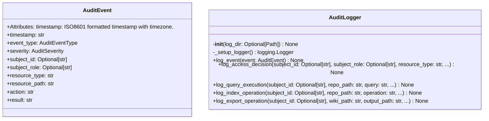

# File Overview

This file, `src/local_deepwiki/core/audit.py`, implements an audit logging system for the `local_deepwiki` application. It provides infrastructure for tracking security-relevant events, such as access control decisions, query executions, indexing operations, and export activities.

The module defines [event](../../../coverage_openai_embeddings/coverage_html_cb_dd2e7eb5.md) types, severity levels, and a structured `AuditEvent` data class. It also includes the `AuditLogger` class, which handles the actual logging to disk with rotation, and utility functions for accessing and resetting the global audit logger instance.

## Classes

### AuditEventType

An enumeration of audit [event](../../../coverage_openai_embeddings/coverage_html_cb_dd2e7eb5.md) types, categorized by operation type for easier filtering and analysis.

**Values**:
- `ACCESS_GRANTED` - Access control [event](../../../coverage_openai_embeddings/coverage_html_cb_dd2e7eb5.md)
- `ACCESS_DENIED` - Access control [event](../../../coverage_openai_embeddings/coverage_html_cb_dd2e7eb5.md)
- `INDEX_STARTED` - Repository indexing [event](../../../coverage_openai_embeddings/coverage_html_cb_dd2e7eb5.md)
- `INDEX_COMPLETED` - Repository indexing [event](../../../coverage_openai_embeddings/coverage_html_cb_dd2e7eb5.md)
- `INDEX_FAILED` - Repository indexing [event](../../../coverage_openai_embeddings/coverage_html_cb_dd2e7eb5.md)
- `QUERY_EXECUTED` - Query operation [event](../../../coverage_openai_embeddings/coverage_html_cb_dd2e7eb5.md)
- `QUERY_FAILED` - Query operation [event](../../../coverage_openai_embeddings/coverage_html_cb_dd2e7eb5.md)
- `EXPORT_STARTED` - Export operation [event](../../../coverage_openai_embeddings/coverage_html_cb_dd2e7eb5.md)
- `EXPORT_COMPLETED` - Export operation [event](../../../coverage_openai_embeddings/coverage_html_cb_dd2e7eb5.md)

### AuditSeverity

An enumeration of severity levels for audit events, used to categorize events for alerting and log rotation policies.

**Values**:
- `INFO` - Informational [event](../../../coverage_openai_embeddings/coverage_html_cb_dd2e7eb5.md)
- `WARNING` - Warning [event](../../../coverage_openai_embeddings/coverage_html_cb_dd2e7eb5.md)
- `CRITICAL` - Critical [event](../../../coverage_openai_embeddings/coverage_html_cb_dd2e7eb5.md)

### AuditEvent

Represents an audit [event](../../../coverage_openai_embeddings/coverage_html_cb_dd2e7eb5.md) for logging.

**Attributes**:
- `timestamp`: ISO8601 formatted timestamp with timezone.
- `event_type`: Type of audit [event](../../../coverage_openai_embeddings/coverage_html_cb_dd2e7eb5.md).
- `severity`: Severity level of the [event](../../../coverage_openai_embeddings/coverage_html_cb_dd2e7eb5.md).
- `subject_id`: Identifier of the user/service performing the action.
- `subject_role`: [Role](../security/access_control.md) of the subject (ADMIN, EDITOR, VIEWER, GUEST).
- `resource_type`: Type of resource being accessed (repository, config, query, etc.).
- `resource_path`: Path of the resource being accessed.
- `permission_requested`: [Permission](../security/access_control.md) being requested (e.g., read, write).
- `granted`: Boolean indicating if access was granted.
- `query`: Query string (for query events).
- `success`: Boolean indicating if the operation succeeded.
- `operation`: Operation type (e.g., index, export).
- `error_message`: Error message if the operation failed.
- `files_processed`: Number of files processed (for indexing).
- `chunks_created`: Number of chunks created (for indexing).
- `chunks_returned`: Number of chunks returned (for queries).
- `duration_ms`: Duration of the operation in milliseconds.
- `pages_exported`: Number of pages exported (for export operations).

### AuditLogger

Handles logging of audit events to a file with rotation.

**Methods**:
- `__init__(log_dir: Optional[Path] = None) -> None`  
  Initializes the audit logger with an optional log directory.
- `_setup_logger() -> logging.Logger`  
  Sets up the logger with a `TimedRotatingFileHandler` for daily rotation.
- `log_event(event: AuditEvent) -> None`  
  Logs an audit [event](../../../coverage_openai_embeddings/coverage_html_cb_dd2e7eb5.md) to the file and to the application logger if critical.
- `log_access_decision(subject_id: Optional[str], subject_role: Optional[str], resource_type: str, resource_path: str, permission_requested: str, granted: bool, reason: Optional[str] = None) -> None`  
  Logs an access control decision.
- `log_query_execution(subject_id: Optional[str], repo_path: str, query: str, success: bool, query_type: str = "search", error_message: Optional[str] = None, chunks_returned: Optional[int] = None, duration_ms: Optional[int] = None) -> None`  
  Logs a query execution.
- `log_index_operation(subject_id: Optional[str], repo_path: str, operation: str, success: bool, files_processed: Optional[int] = None, chunks_created: Optional[int] = None, duration_ms: Optional[int] = None, error_message: Optional[str] = None) -> None`  
  Logs an indexing operation.
- `log_export_operation(subject_id: Optional[str], wiki_path: str, output_path: str, export_type: str, operation: str, success: bool, pages_exported: Optional[int] = None, duration_ms: Optional[int] = None, error_message: Optional[str] = None) -> None`  
  Logs an export operation.

## Functions

### get_audit_logger

Returns the global `AuditLogger` instance (thread-safe).

**Returns**:
- The global `AuditLogger` instance.

### reset_audit_logger

Resets the global audit logger (for testing only). Clears the global instance, allowing a fresh logger to be created on the next call to `get_audit_logger()`.

**Returns**:
- None

## Integration

This file is part of the `local_deepwiki.core` module and is imported by:

- `src/local_deepwiki/core/__init__.py`
- `src/local_deepwiki/generators/source_refs.py`
- `src/local_deepwiki/logging.py`
- `src/local_deepwiki/plugins/base.py`

It is used by the test suite via `reset_audit_logger` function.

The `AuditLogger` class is designed to be used in a multi-threaded environment and integrates with the application's logging infrastructure via [`local_deepwiki.logging.get_logger`](../logging.md).

## Usage Examples

### Creating an AuditEvent

```python
from audit import AuditEvent, AuditEventType, AuditSeverity

event = AuditEvent(
    timestamp=datetime.now(timezone.utc),
    event_type=AuditEventType.ACCESS_GRANTED,
    severity=AuditSeverity.INFO,
    subject_id="user123",
    subject_role="ADMIN",
    resource_type="repository",
    resource_path="/path/to/repo",
    permission_requested="read",
    granted=True,
)
```

### Logging an Event

```python
from audit import get_audit_logger

logger = get_audit_logger()
logger.log_event(event)
```

### Logging an Access Decision

```python
logger.log_access_decision(
    subject_id="user123",
    subject_role="EDITOR",
    resource_type="file",
    resource_path="/path/to/file.txt",
    permission_requested="write",
    granted=False,
    reason="Insufficient privileges"
)
```

### Logging a Query Execution

```python
logger.log_query_execution(
    subject_id="user123",
    repo_path="/path/to/repo",
    query="find documents about AI",
    success=True,
    query_type="search",
    chunks_returned=5,
    duration_ms=1200
)
```

### Logging an Index Operation

```python
logger.log_index_operation(
    subject_id="system",
    repo_path="/path/to/repo",
    operation="index_started",
    success=True,
    files_processed=100,
    chunks_created=500,
    duration_ms=5000
)
```

### Logging an Export Operation

```python
logger.log_export_operation(
    subject_id="user123",
    wiki_path="/path/to/wiki",
    output_path="/path/to/export",
    export_type="markdown",
    operation="export_started",
    success=True,
    pages_exported=25,
    duration_ms=3000
)
```

## API Reference

### class `AuditEventType`

**Inherits from:** `str`, `Enum`

Types of audit events.  Categorized by operation type for easier filtering and analysis.


<details>
<summary>View Source (lines 29-60) | <a href="https://github.com/UrbanDiver/local-deepwiki-mcp/blob/[main](../export/pdf.md)/src/local_deepwiki/core/audit.py#L29-L60">GitHub</a></summary>

```python
class AuditEventType(str, Enum):
    """Types of audit events.

    Categorized by operation type for easier filtering and analysis.
    """

    # Access control events
    ACCESS_GRANTED = "access_granted"
    ACCESS_DENIED = "access_denied"

    # Repository indexing events
    INDEX_STARTED = "index_started"
    INDEX_COMPLETED = "index_completed"
    INDEX_FAILED = "index_failed"

    # Query operation events
    QUERY_EXECUTED = "query_executed"
    QUERY_FAILED = "query_failed"

    # Export operation events
    EXPORT_STARTED = "export_started"
    EXPORT_COMPLETED = "export_completed"

    # Configuration events
    CONFIG_READ = "config_read"
    CONFIG_MODIFIED = "config_modified"

    # Security events
    AUTHENTICATION_SUCCESS = "authentication_success"
    AUTHENTICATION_FAILED = "authentication_failed"
    AUTHORIZATION_FAILED = "authorization_failed"
    SENSITIVE_RESOURCE_ACCESSED = "sensitive_resource_accessed"
```

</details>

### class `AuditSeverity`

**Inherits from:** `str`, `Enum`

Severity levels for audit events.  Used to categorize events for alerting and log rotation policies.


<details>
<summary>View Source (lines 63-71) | <a href="https://github.com/UrbanDiver/local-deepwiki-mcp/blob/[main](../export/pdf.md)/src/local_deepwiki/core/audit.py#L63-L71">GitHub</a></summary>

```python
class AuditSeverity(str, Enum):
    """Severity levels for audit events.

    Used to categorize events for alerting and log rotation policies.
    """

    INFO = "info"
    WARNING = "warning"
    CRITICAL = "critical"
```

</details>

### class `AuditEvent`

Represents an audit [event](../../../coverage_openai_embeddings/coverage_html_cb_dd2e7eb5.md) for logging.  All fields are designed to support compliance reporting and security incident investigation.  Attributes: timestamp: ISO8601 formatted timestamp with timezone. event_type: Type of audit [event](../../../coverage_openai_embeddings/coverage_html_cb_dd2e7eb5.md). severity: Severity level of the [event](../../../coverage_openai_embeddings/coverage_html_cb_dd2e7eb5.md). subject_id: Identifier of the user/service performing the action. subject_role: [Role](../security/access_control.md) of the subject (ADMIN, EDITOR, VIEWER, GUEST). resource_type: Type of resource being accessed (repository, config, query, etc.). resource_path: Path or identifier of the specific resource. action: Description of the action being performed. result: Outcome of the action (success/failure). reason: Explanation for failures or denials. details: Additional context as key-value pairs.


<details>
<summary>View Source (lines 75-105) | <a href="https://github.com/UrbanDiver/local-deepwiki-mcp/blob/[main](../export/pdf.md)/src/local_deepwiki/core/audit.py#L75-L105">GitHub</a></summary>

```python
class AuditEvent:
    """Represents an audit event for logging.

    All fields are designed to support compliance reporting and
    security incident investigation.

    Attributes:
        timestamp: ISO8601 formatted timestamp with timezone.
        event_type: Type of audit event.
        severity: Severity level of the event.
        subject_id: Identifier of the user/service performing the action.
        subject_role: Role of the subject (ADMIN, EDITOR, VIEWER, GUEST).
        resource_type: Type of resource being accessed (repository, config, query, etc.).
        resource_path: Path or identifier of the specific resource.
        action: Description of the action being performed.
        result: Outcome of the action (success/failure).
        reason: Explanation for failures or denials.
        details: Additional context as key-value pairs.
    """

    timestamp: str
    event_type: AuditEventType
    severity: AuditSeverity
    subject_id: Optional[str]
    subject_role: Optional[str]
    resource_type: str
    resource_path: str
    action: str
    result: str
    reason: Optional[str] = None
    details: dict[str, Any] = field(default_factory=dict)
```

</details>

### class `AuditLogger`

Manages audit logging for security events.  Provides structured logging of security-relevant events to file, with automatic daily rotation and 30-day retention.  The audit logger uses a separate logging hierarchy from the application logger to ensure audit events are never accidentally filtered or lost.

**Methods:**


<details>
<summary>View Source (lines 108-417) | <a href="https://github.com/UrbanDiver/local-deepwiki-mcp/blob/[main](../export/pdf.md)/src/local_deepwiki/core/audit.py#L108-L417">GitHub</a></summary>

```python
class AuditLogger:
    # Methods: __init__, _setup_logger, log_event, log_access_decision, log_query_execution, log_index_operation, log_export_operation
```

</details>

#### `__init__`

```python
def __init__(log_dir: Optional[Path] = None) -> None
```

Initialize the audit logger.


| [Parameter](../generators/api_docs.md) | Type | Default | Description |
|-----------|------|---------|-------------|
| `log_dir` | `Optional[Path]` | `None` | Directory to store audit logs. Defaults to ~/.config/local-deepwiki/audit |


<details>
<summary>View Source (lines 118-127) | <a href="https://github.com/UrbanDiver/local-deepwiki-mcp/blob/[main](../export/pdf.md)/src/local_deepwiki/core/audit.py#L118-L127">GitHub</a></summary>

```python
def __init__(self, log_dir: Optional[Path] = None) -> None:
        """Initialize the audit logger.

        Args:
            log_dir: Directory to store audit logs. Defaults to
                     ~/.config/local-deepwiki/audit
        """
        self.log_dir = log_dir or Path.home() / ".config" / "local-deepwiki" / "audit"
        self.log_dir.mkdir(parents=True, exist_ok=True)
        self._logger = self._setup_logger()
```

</details>

#### `log_event`

```python
def log_event(event: AuditEvent) -> None
```

Log an audit [event](../../../coverage_openai_embeddings/coverage_html_cb_dd2e7eb5.md).  The [event](../../../coverage_openai_embeddings/coverage_html_cb_dd2e7eb5.md) is serialized to JSON and written to the audit log file. Critical events are also logged to the application logger for immediate visibility.


| [Parameter](../generators/api_docs.md) | Type | Default | Description |
|-----------|------|---------|-------------|
| [`event`](../../../coverage_openai_embeddings/coverage_html_cb_dd2e7eb5.md) | `AuditEvent` | - | The audit [event](../../../coverage_openai_embeddings/coverage_html_cb_dd2e7eb5.md) to log. |


<details>
<summary>View Source (lines 171-200) | <a href="https://github.com/UrbanDiver/local-deepwiki-mcp/blob/[main](../export/pdf.md)/src/local_deepwiki/core/audit.py#L171-L200">GitHub</a></summary>

```python
def log_event(self, event: AuditEvent) -> None:
        """Log an audit event.

        The event is serialized to JSON and written to the audit log file.
        Critical events are also logged to the application logger for
        immediate visibility.

        Args:
            event: The audit event to log.
        """
        # Convert event to dictionary
        event_dict = asdict(event)

        # Convert enum values to strings for JSON serialization
        event_dict["event_type"] = event.event_type.value
        event_dict["severity"] = event.severity.value

        # Use provided timestamp or generate current UTC time in ISO8601 format
        if not event_dict.get("timestamp"):
            event_dict["timestamp"] = datetime.now(timezone.utc).isoformat()

        # Log to audit file as JSON
        self._logger.info(json.dumps(event_dict, default=str))

        # Log critical events to application logger for visibility
        if event.severity == AuditSeverity.CRITICAL:
            logger.warning(
                f"AUDIT[CRITICAL]: {event.action} on {event.resource_type} "
                f"by {event.subject_id or 'anonymous'} - {event.result}"
            )
```

</details>

#### `log_access_decision`

```python
def log_access_decision(subject_id: Optional[str], subject_role: Optional[str], resource_type: str, resource_path: str, permission_requested: str, granted: bool, reason: Optional[str] = None) -> None
```

Log an access control decision.  Convenience method for logging permission checks from RBAC system.


| [Parameter](../generators/api_docs.md) | Type | Default | Description |
|-----------|------|---------|-------------|
| `subject_id` | `Optional[str]` | - | Identifier of the subject requesting access. |
| `subject_role` | `Optional[str]` | - | [Role](../security/access_control.md) of the subject. |
| `resource_type` | `str` | - | Type of resource (operation, file, etc.). |
| `resource_path` | `str` | - | Path or identifier of the resource. |
| `permission_requested` | `str` | - | The permission being requested. |
| `granted` | `bool` | - | Whether access was granted. |
| `reason` | `Optional[str]` | `None` | Explanation for the decision (especially for denials). |


<details>
<summary>View Source (lines 202-240) | <a href="https://github.com/UrbanDiver/local-deepwiki-mcp/blob/[main](../export/pdf.md)/src/local_deepwiki/core/audit.py#L202-L240">GitHub</a></summary>

```python
def log_access_decision(
        self,
        subject_id: Optional[str],
        subject_role: Optional[str],
        resource_type: str,
        resource_path: str,
        permission_requested: str,
        granted: bool,
        reason: Optional[str] = None,
    ) -> None:
        """Log an access control decision.

        Convenience method for logging permission checks from RBAC system.

        Args:
            subject_id: Identifier of the subject requesting access.
            subject_role: Role of the subject.
            resource_type: Type of resource (operation, file, etc.).
            resource_path: Path or identifier of the resource.
            permission_requested: The permission being requested.
            granted: Whether access was granted.
            reason: Explanation for the decision (especially for denials).
        """
        event = AuditEvent(
            timestamp=datetime.now(timezone.utc).isoformat(),
            event_type=AuditEventType.ACCESS_GRANTED if granted else AuditEventType.ACCESS_DENIED,
            severity=AuditSeverity.INFO if granted else AuditSeverity.WARNING,
            subject_id=subject_id,
            subject_role=subject_role,
            resource_type=resource_type,
            resource_path=resource_path,
            action=f"Request permission: {permission_requested}",
            result="granted" if granted else "denied",
            reason=reason,
            details={
                "permission": permission_requested,
            },
        )
        self.log_event(event)
```

</details>

#### `log_query_execution`

```python
def log_query_execution(subject_id: Optional[str], repo_path: str, query: str, success: bool, query_type: str = "search", error_message: Optional[str] = None, chunks_returned: Optional[int] = None, duration_ms: Optional[int] = None) -> None
```

Log a query execution.  Convenience method for logging query operations (search, deep research).


| [Parameter](../generators/api_docs.md) | Type | Default | Description |
|-----------|------|---------|-------------|
| `subject_id` | `Optional[str]` | - | Identifier of the subject executing the query. |
| `repo_path` | `str` | - | Path to the repository being queried. |
| `query` | `str` | - | The query string (truncated for privacy). |
| `success` | `bool` | - | Whether the query succeeded. |
| `query_type` | `str` | `"search"` | Type of query (search, deep_research). |
| `error_message` | `Optional[str]` | `None` | Error message if query failed. |
| `chunks_returned` | `Optional[int]` | `None` | Number of result chunks returned. |
| `duration_ms` | `Optional[int]` | `None` | Query duration in milliseconds. |


<details>
<summary>View Source (lines 242-294) | <a href="https://github.com/UrbanDiver/local-deepwiki-mcp/blob/[main](../export/pdf.md)/src/local_deepwiki/core/audit.py#L242-L294">GitHub</a></summary>

```python
def log_query_execution(
        self,
        subject_id: Optional[str],
        repo_path: str,
        query: str,
        success: bool,
        query_type: str = "search",
        error_message: Optional[str] = None,
        chunks_returned: Optional[int] = None,
        duration_ms: Optional[int] = None,
    ) -> None:
        """Log a query execution.

        Convenience method for logging query operations (search, deep research).

        Args:
            subject_id: Identifier of the subject executing the query.
            repo_path: Path to the repository being queried.
            query: The query string (truncated for privacy).
            success: Whether the query succeeded.
            query_type: Type of query (search, deep_research).
            error_message: Error message if query failed.
            chunks_returned: Number of result chunks returned.
            duration_ms: Query duration in milliseconds.
        """
        # Truncate query for logging (privacy)
        query_preview = query[:100] + "..." if len(query) > 100 else query

        details: dict[str, Any] = {
            "query_length": len(query),
            "query_type": query_type,
            "repo_path": repo_path,
        }

        if chunks_returned is not None:
            details["chunks_returned"] = chunks_returned
        if duration_ms is not None:
            details["duration_ms"] = duration_ms

        event = AuditEvent(
            timestamp=datetime.now(timezone.utc).isoformat(),
            event_type=AuditEventType.QUERY_EXECUTED if success else AuditEventType.QUERY_FAILED,
            severity=AuditSeverity.INFO if success else AuditSeverity.WARNING,
            subject_id=subject_id,
            subject_role=None,  # Populated from context if available
            resource_type="query",
            resource_path=repo_path,
            action=f"Execute {query_type}: {query_preview}",
            result="success" if success else "failure",
            reason=error_message,
            details=details,
        )
        self.log_event(event)
```

</details>

#### `log_index_operation`

```python
def log_index_operation(subject_id: Optional[str], repo_path: str, operation: str, success: bool, files_processed: Optional[int] = None, chunks_created: Optional[int] = None, duration_ms: Optional[int] = None, error_message: Optional[str] = None) -> None
```

Log an indexing operation.  Convenience method for logging repository indexing lifecycle events.


| [Parameter](../generators/api_docs.md) | Type | Default | Description |
|-----------|------|---------|-------------|
| `subject_id` | `Optional[str]` | - | Identifier of the subject performing the operation. |
| `repo_path` | `str` | - | Path to the repository being indexed. |
| `operation` | `str` | - | Operation type (started, completed, failed). |
| `success` | `bool` | - | Whether the operation succeeded (for completed/failed). |
| `files_processed` | `Optional[int]` | `None` | Number of files processed. |
| `chunks_created` | `Optional[int]` | `None` | Number of chunks created. |
| `duration_ms` | `Optional[int]` | `None` | Operation duration in milliseconds. |
| `error_message` | `Optional[str]` | `None` | Error message if operation failed. |


<details>
<summary>View Source (lines 296-360) | <a href="https://github.com/UrbanDiver/local-deepwiki-mcp/blob/[main](../export/pdf.md)/src/local_deepwiki/core/audit.py#L296-L360">GitHub</a></summary>

```python
def log_index_operation(
        self,
        subject_id: Optional[str],
        repo_path: str,
        operation: str,
        success: bool,
        files_processed: Optional[int] = None,
        chunks_created: Optional[int] = None,
        duration_ms: Optional[int] = None,
        error_message: Optional[str] = None,
    ) -> None:
        """Log an indexing operation.

        Convenience method for logging repository indexing lifecycle events.

        Args:
            subject_id: Identifier of the subject performing the operation.
            repo_path: Path to the repository being indexed.
            operation: Operation type (started, completed, failed).
            success: Whether the operation succeeded (for completed/failed).
            files_processed: Number of files processed.
            chunks_created: Number of chunks created.
            duration_ms: Operation duration in milliseconds.
            error_message: Error message if operation failed.
        """
        # Determine event type based on operation
        if operation == "started":
            event_type = AuditEventType.INDEX_STARTED
            severity = AuditSeverity.INFO
            result = "in_progress"
        elif operation == "completed" and success:
            event_type = AuditEventType.INDEX_COMPLETED
            severity = AuditSeverity.INFO
            result = "success"
        else:
            event_type = AuditEventType.INDEX_FAILED
            severity = AuditSeverity.WARNING
            result = "failure"

        details: dict[str, Any] = {
            "operation": operation,
            "repo_path": repo_path,
        }

        if files_processed is not None:
            details["files_processed"] = files_processed
        if chunks_created is not None:
            details["chunks_created"] = chunks_created
        if duration_ms is not None:
            details["duration_ms"] = duration_ms

        event = AuditEvent(
            timestamp=datetime.now(timezone.utc).isoformat(),
            event_type=event_type,
            severity=severity,
            subject_id=subject_id,
            subject_role=None,
            resource_type="repository",
            resource_path=repo_path,
            action=f"Index repository: {operation}",
            result=result,
            reason=error_message,
            details=details,
        )
        self.log_event(event)
```

</details>

#### `log_export_operation`

```python
def log_export_operation(subject_id: Optional[str], wiki_path: str, output_path: str, export_type: str, operation: str, success: bool, pages_exported: Optional[int] = None, duration_ms: Optional[int] = None, error_message: Optional[str] = None) -> None
```

Log an export operation.  Convenience method for logging wiki export lifecycle events.


| [Parameter](../generators/api_docs.md) | Type | Default | Description |
|-----------|------|---------|-------------|
| `subject_id` | `Optional[str]` | - | Identifier of the subject performing the export. |
| `wiki_path` | `str` | - | Path to the wiki being exported. |
| `output_path` | `str` | - | Destination path for the export. |
| `export_type` | `str` | - | Type of export (html, pdf). |
| `operation` | `str` | - | Operation type (started, completed). |
| `success` | `bool` | - | Whether the operation succeeded. |
| `pages_exported` | `Optional[int]` | `None` | Number of pages exported. |
| `duration_ms` | `Optional[int]` | `None` | Operation duration in milliseconds. |
| `error_message` | `Optional[str]` | `None` | Error message if operation failed. |


---


<details>
<summary>View Source (lines 362-417) | <a href="https://github.com/UrbanDiver/local-deepwiki-mcp/blob/[main](../export/pdf.md)/src/local_deepwiki/core/audit.py#L362-L417">GitHub</a></summary>

```python
def log_export_operation(
        self,
        subject_id: Optional[str],
        wiki_path: str,
        output_path: str,
        export_type: str,
        operation: str,
        success: bool,
        pages_exported: Optional[int] = None,
        duration_ms: Optional[int] = None,
        error_message: Optional[str] = None,
    ) -> None:
        """Log an export operation.

        Convenience method for logging wiki export lifecycle events.

        Args:
            subject_id: Identifier of the subject performing the export.
            wiki_path: Path to the wiki being exported.
            output_path: Destination path for the export.
            export_type: Type of export (html, pdf).
            operation: Operation type (started, completed).
            success: Whether the operation succeeded.
            pages_exported: Number of pages exported.
            duration_ms: Operation duration in milliseconds.
            error_message: Error message if operation failed.
        """
        event_type = AuditEventType.EXPORT_STARTED if operation == "started" else AuditEventType.EXPORT_COMPLETED
        severity = AuditSeverity.INFO if success else AuditSeverity.WARNING
        result = "in_progress" if operation == "started" else ("success" if success else "failure")

        details: dict[str, Any] = {
            "export_type": export_type,
            "wiki_path": wiki_path,
            "output_path": output_path,
        }

        if pages_exported is not None:
            details["pages_exported"] = pages_exported
        if duration_ms is not None:
            details["duration_ms"] = duration_ms

        event = AuditEvent(
            timestamp=datetime.now(timezone.utc).isoformat(),
            event_type=event_type,
            severity=severity,
            subject_id=subject_id,
            subject_role=None,
            resource_type="wiki_export",
            resource_path=wiki_path,
            action=f"Export wiki to {export_type}: {operation}",
            result=result,
            reason=error_message,
            details=details,
        )
        self.log_event(event)
```

</details>

### Functions

#### `get_audit_logger`

```python
def get_audit_logger() -> AuditLogger
```

Get the global audit logger instance (thread-safe).

**Returns:** `AuditLogger`


<details>
<summary>View Source (lines 425-437) | <a href="https://github.com/UrbanDiver/local-deepwiki-mcp/blob/[main](../export/pdf.md)/src/local_deepwiki/core/audit.py#L425-L437">GitHub</a></summary>

```python
def get_audit_logger() -> AuditLogger:
    """Get the global audit logger instance (thread-safe).

    Returns:
        The global AuditLogger instance.
    """
    global _audit_logger
    if _audit_logger is None:
        with _audit_logger_lock:
            # Double-check locking pattern
            if _audit_logger is None:
                _audit_logger = AuditLogger()
    return _audit_logger
```

</details>

#### `reset_audit_logger`

```python
def reset_audit_logger() -> None
```

Reset the global audit logger (for testing only).  This clears the global instance, allowing a fresh logger to be created on the next call to get_audit_logger().

**Returns:** `None`


<details>
<summary>View Source (lines 440-448) | <a href="https://github.com/UrbanDiver/local-deepwiki-mcp/blob/[main](../export/pdf.md)/src/local_deepwiki/core/audit.py#L440-L448">GitHub</a></summary>

```python
def reset_audit_logger() -> None:
    """Reset the global audit logger (for testing only).

    This clears the global instance, allowing a fresh logger
    to be created on the next call to get_audit_logger().
    """
    global _audit_logger
    with _audit_logger_lock:
        _audit_logger = None
```

</details>

## Class Diagram



## Call Graph

```mermaid
flowchart TD
    N0[AuditEvent]
    N1[AuditLogger]
    N2[AuditLogger.__init__]
    N3[AuditLogger._setup_logger]
    N4[AuditLogger.log_access_deci...]
    N5[AuditLogger.log_event]
    N6[AuditLogger.log_export_oper...]
    N7[AuditLogger.log_index_opera...]
    N8[AuditLogger.log_query_execu...]
    N9[Formatter]
    N10[TimedRotatingFileHandler]
    N11[_setup_logger]
    N12[addHandler]
    N13[asdict]
    N14[dumps]
    N15[getLogger]
    N16[get_audit_logger]
    N17[home]
    N18[isoformat]
    N19[log_event]
    N20[mkdir]
    N21[now]
    N22[setFormatter]
    N23[setLevel]
    N16 --> N1
    N2 --> N17
    N2 --> N20
    N2 --> N11
    N3 --> N15
    N3 --> N23
    N3 --> N10
    N3 --> N9
    N3 --> N22
    N3 --> N12
    N5 --> N13
    N5 --> N18
    N5 --> N21
    N5 --> N14
    N4 --> N0
    N4 --> N18
    N4 --> N21
    N4 --> N19
    N8 --> N0
    N8 --> N18
    N8 --> N21
    N8 --> N19
    N7 --> N0
    N7 --> N18
    N7 --> N21
    N7 --> N19
    N6 --> N0
    N6 --> N18
    N6 --> N21
    N6 --> N19
    classDef func fill:#e1f5fe
    class N0,N1,N9,N10,N11,N12,N13,N14,N15,N16,N17,N18,N19,N20,N21,N22,N23 func
    classDef method fill:#fff3e0
    class N2,N3,N4,N5,N6,N7,N8 method
```



## Used By

Functions and methods in this file and their callers:

- **`AuditEvent`**: called by `AuditLogger.log_access_decision`, `AuditLogger.log_export_operation`, `AuditLogger.log_index_operation`, `AuditLogger.log_query_execution`
- **`AuditLogger`**: called by `get_audit_logger`
- **`Formatter`**: called by `AuditLogger._setup_logger`
- **`TimedRotatingFileHandler`**: called by `AuditLogger._setup_logger`
- **`_setup_logger`**: called by `AuditLogger.__init__`
- **`addHandler`**: called by `AuditLogger._setup_logger`
- **`asdict`**: called by `AuditLogger.log_event`
- **`dumps`**: called by `AuditLogger.log_event`
- **`getLogger`**: called by `AuditLogger._setup_logger`
- **`home`**: called by `AuditLogger.__init__`
- **`isoformat`**: called by `AuditLogger.log_access_decision`, `AuditLogger.log_event`, `AuditLogger.log_export_operation`, `AuditLogger.log_index_operation`, `AuditLogger.log_query_execution`
- **`log_event`**: called by `AuditLogger.log_access_decision`, `AuditLogger.log_export_operation`, `AuditLogger.log_index_operation`, `AuditLogger.log_query_execution`
- **`mkdir`**: called by `AuditLogger.__init__`
- **`now`**: called by `AuditLogger.log_access_decision`, `AuditLogger.log_event`, `AuditLogger.log_export_operation`, `AuditLogger.log_index_operation`, `AuditLogger.log_query_execution`
- **`setFormatter`**: called by `AuditLogger._setup_logger`
- **`setLevel`**: called by `AuditLogger._setup_logger`

## Usage Examples

*Examples extracted from test files*

### Test ACCESS_GRANTED enum value exists

From `test_audit.py::TestAuditEventTypeEnum::test_access_granted_exists`:

```python
assert AuditEventType.ACCESS_GRANTED.value == "access_granted"
```

### Test ACCESS_GRANTED enum value exists

From `test_audit.py::TestAuditEventTypeEnum::test_access_granted_exists`:

```python
assert AuditEventType.ACCESS_GRANTED.value == "access_granted"
```

### Test ACCESS_DENIED enum value exists

From `test_audit.py::TestAuditEventTypeEnum::test_access_denied_exists`:

```python
assert AuditEventType.ACCESS_DENIED.value == "access_denied"
```

### Test ACCESS_DENIED enum value exists

From `test_audit.py::TestAuditEventTypeEnum::test_access_denied_exists`:

```python
assert AuditEventType.ACCESS_DENIED.value == "access_denied"
```

### Test INFO severity exists

From `test_audit.py::TestAuditSeverityEnum::test_info_exists`:

```python
assert AuditSeverity.INFO.value == "info"
```


## Last Modified

| Entity | Type | Author | Date | Commit |
|--------|------|--------|------|--------|
| `AuditEventType` | class | Brian Breidenbach | 1 week ago | `9844731` Phase 3: Implement input va... |
| `AuditSeverity` | class | Brian Breidenbach | 1 week ago | `9844731` Phase 3: Implement input va... |
| `AuditEvent` | class | Brian Breidenbach | 1 week ago | `9844731` Phase 3: Implement input va... |
| `AuditLogger` | class | Brian Breidenbach | 1 week ago | `9844731` Phase 3: Implement input va... |
| `__init__` | method | Brian Breidenbach | 1 week ago | `9844731` Phase 3: Implement input va... |
| `_setup_logger` | method | Brian Breidenbach | 1 week ago | `9844731` Phase 3: Implement input va... |
| `log_event` | method | Brian Breidenbach | 1 week ago | `9844731` Phase 3: Implement input va... |
| `log_access_decision` | method | Brian Breidenbach | 1 week ago | `9844731` Phase 3: Implement input va... |
| `log_query_execution` | method | Brian Breidenbach | 1 week ago | `9844731` Phase 3: Implement input va... |
| `log_index_operation` | method | Brian Breidenbach | 1 week ago | `9844731` Phase 3: Implement input va... |
| `log_export_operation` | method | Brian Breidenbach | 1 week ago | `9844731` Phase 3: Implement input va... |
| `get_audit_logger` | function | Brian Breidenbach | 1 week ago | `9844731` Phase 3: Implement input va... |
| `reset_audit_logger` | function | Brian Breidenbach | 1 week ago | `9844731` Phase 3: Implement input va... |

## Additional Source Code

Source code for functions and methods not listed in the API Reference above.

#### `_setup_logger`

<details>
<summary>View Source (lines 129-169) | <a href="https://github.com/UrbanDiver/local-deepwiki-mcp/blob/[main](../export/pdf.md)/src/local_deepwiki/core/audit.py#L129-L169">GitHub</a></summary>

```python
def _setup_logger(self) -> logging.Logger:
        """Set up the audit logger with file rotation.

        Creates a dedicated logger with:
        - TimedRotatingFileHandler for daily rotation
        - 30-day retention (backupCount=30)
        - JSON-compatible format for log analysis tools

        Returns:
            Configured logging.Logger instance.
        """
        # Use a unique logger name to avoid conflicts
        audit_logger = logging.getLogger("deepwiki.audit")

        # Prevent duplicate handlers if logger is reinitialized
        if audit_logger.handlers:
            return audit_logger

        audit_logger.setLevel(logging.DEBUG)

        # Prevent propagation to root logger to avoid duplicate messages
        audit_logger.propagate = False

        # File handler with daily rotation
        log_file = self.log_dir / "audit.log"
        handler = logging.handlers.TimedRotatingFileHandler(
            filename=str(log_file),
            when="midnight",
            interval=1,
            backupCount=30,  # Keep 30 days of logs
            encoding="utf-8",
        )
        handler.setLevel(logging.DEBUG)

        # Simple format - the message itself is JSON
        formatter = logging.Formatter("%(message)s")
        handler.setFormatter(formatter)

        audit_logger.addHandler(handler)

        return audit_logger
```

</details>

## Relevant Source Files

- `src/local_deepwiki/core/audit.py:29-60`
