# File: `src/local_deepwiki/core/chunk_builders.py`

## File Overview

This module provides functions for creating structured code chunks from source files, used primarily by the [`CodeChunker`](chunker.md) class for RAG (Retrieval-Augmented Generation) and indexing purposes. These functions extract and summarize file-level information such as imports, classes, functions, and docstrings, producing chunks that represent different aspects of a file's structure and content.

The design rationale is to separate chunk creation logic from the [`CodeChunker`](chunker.md) class to maintain a manageable class size and improve modularity. The functions are lightweight and focused, each responsible for generating a specific type of chunk (e.g., module overview, imports, file summary).

## Key Concepts

### Chunk Creation Abstractions

This file defines a set of functions that abstract away the process of parsing an AST and generating meaningful summaries of code structure. These abstractions are:

- **`generate_chunk_id`**: Ensures unique identifiers for chunks based on file path, name, and line number using SHA256 hashing.
- **`is_inside_class`**: Checks if a node is nested within a class definition by walking up the AST.
- **`create_file_summary`**: Builds a structured summary of a file's imports, classes, and functions.
- **`create_module_chunk`**: Generates a top-level module overview chunk.
- **`create_file_summary_chunk`**: Produces a comprehensive file summary chunk for retrieval.
- **`create_module_summary_chunk`**: Specifically handles `__init__.py` files to extract package information and re-exports.

These abstractions are chosen to allow [`CodeChunker`](chunker.md) to delegate specific chunk creation logic, keeping it focused on orchestration rather than parsing details.

### Language-Aware Parsing

The functions are designed to work with multiple languages, using language-specific node type sets (`CLASS_NODE_TYPES`, `FUNCTION_NODE_TYPES`, `IMPORT_NODE_TYPES`) from `chunk_extractors`. This supports multi-language codebase analysis and ensures correct AST traversal for each supported language.

### Chunk Metadata and Type

Each chunk is created with a specific [`ChunkType`](../models/foundation.md) (`MODULE`, `FILE_SUMMARY`, `MODULE_SUMMARY`, `IMPORT`) and metadata to aid in downstream processing and filtering. This design enables the system to understand the semantic content of each chunk.

## Integration

This module is imported and used by [`CodeChunker`](chunker.md) (not shown in this file) to generate various types of code chunks from parsed ASTs. It is also called by `is_inside_class`, which is used by `extractor`.

The functions in this file depend on:
- `chunk_extractors` for language-specific AST node types.
- `parser` for AST traversal utilities ([`find_nodes_by_type`](parser/ast_utils.md), [`get_node_name`](parser/ast_utils.md), [`get_node_text`](parser/ast_utils.md)).
- `models` for [`ChunkType`](../models/foundation.md), [`CodeChunk`](../models/chunks.md), and [`Language`](../models/foundation.md).

These dependencies are part of the core parsing and chunking pipeline, and this file is a critical part of the codebase's ability to generate structured summaries of source code for retrieval and indexing.

## Design Notes

### Chunk ID Generation

- Uses SHA256 with a truncated 16-character hash to ensure unique IDs across files and chunk types.
- The key includes `file_path`, `name`, and `line` to prevent collisions across different chunks in the same file.

### AST Traversal

- Uses `tree-sitter.Node` and [`find_nodes_by_type`](parser/ast_utils.md) to efficiently extract nodes of specific types.
- The `is_inside_class` function walks up the AST to determine nesting, which is crucial for correctly identifying top-level functions.

### Docstring Handling

- Python-specific docstring extraction is handled in `_extract_module_docstring` and `create_module_chunk`.
- For Python, docstrings are expected to be the first `expression_statement` containing a `string` node, and are stripped of triple quotes.

### Summary Limiting

- Import summaries are limited to the first 10 imports, with a note about additional imports.
- This prevents overly large summaries and keeps chunks manageable for retrieval systems.

### File Summary Construction

- `create_file_summary` and `create_file_summary_chunk` both build structured summaries, but differ in format:
  - `create_file_summary` is used for the `MODULE` chunk and produces a compact format.
  - `create_file_summary_chunk` is used for `FILE_SUMMARY` chunks and includes more structured metadata.

### Module Summary for `__init__.py`

- `create_module_summary_chunk` specifically handles Python package `__init__.py` files, extracting package name, docstring, and re-export lines.
- This is tailored for Python packaging, where `__init__.py` often re-exports symbols from submodules.

### Metadata and Chunk Types

- Each [`CodeChunk`](../models/chunks.md) includes metadata to distinguish its purpose (e.g., `is_overview`, `is_file_summary`, `is_module_summary`, `package_name`, `import_count`).
- This metadata supports downstream logic that filters or processes chunks based on their type or properties.

## API Reference

### Functions

#### `generate_chunk_id`

```python
def generate_chunk_id(file_path: str, name: str, line: int) -> str
```

Generate a unique chunk ID.


| Parameter | Type | Default | Description |
|-----------|------|---------|-------------|
| `file_path` | `str` | - | File path. |
| `name` | `str` | - | Chunk name. |
| `line` | `int` | - | Line number. |

**Returns:** `str`


<details>
<summary>View Source (lines 33-45) | <a href="https://github.com/UrbanDiver/local-deepwiki-mcp/blob/main/src/local_deepwiki/core/chunk_builders.py#L33-L45">GitHub</a></summary>

```python
def generate_chunk_id(file_path: str, name: str, line: int) -> str:
    """Generate a unique chunk ID.

    Args:
        file_path: File path.
        name: Chunk name.
        line: Line number.

    Returns:
        A unique ID string.
    """
    key = f"{file_path}:{name}:{line}"
    return hashlib.sha256(key.encode()).hexdigest()[:16]
```

</details>

#### `is_inside_class`

```python
def is_inside_class(node: Node, class_types: set[str]) -> bool
```

Check if a node is inside a class definition.


| Parameter | Type | Default | Description |
|-----------|------|---------|-------------|
| `node` | `Node` | - | The node to check. |
| `class_types` | `set[str]` | - | Set of class node type names. |

**Returns:** `bool`


<details>
<summary>View Source (lines 48-63) | <a href="https://github.com/UrbanDiver/local-deepwiki-mcp/blob/main/src/local_deepwiki/core/chunk_builders.py#L48-L63">GitHub</a></summary>

```python
def is_inside_class(node: Node, class_types: set[str]) -> bool:
    """Check if a node is inside a class definition.

    Args:
        node: The node to check.
        class_types: Set of class node type names.

    Returns:
        True if the node is inside a class.
    """
    parent = node.parent
    while parent:
        if parent.type in class_types:
            return True
        parent = parent.parent
    return False
```

</details>

#### `create_file_summary`

```python
def create_file_summary(root: Node, source: bytes, language: Language) -> str
```

Create a summary of file structure for the module chunk.


| Parameter | Type | Default | Description |
|-----------|------|---------|-------------|
| `root` | `Node` | - | AST root node. |
| `source` | `bytes` | - | Source bytes. |
| `language` | `Language` | - | Programming language. |

**Returns:** `str`


<details>
<summary>View Source (lines 161-205) | <a href="https://github.com/UrbanDiver/local-deepwiki-mcp/blob/main/src/local_deepwiki/core/chunk_builders.py#L161-L205">GitHub</a></summary>

```python
def create_file_summary(root: Node, source: bytes, language: Language) -> str:
    """Create a summary of file structure for the module chunk.

    Args:
        root: AST root node.
        source: Source bytes.
        language: Programming language.

    Returns:
        A summary string of file contents.
    """
    parts = []

    # List imports
    import_types = IMPORT_NODE_TYPES.get(language, set())
    imports = find_nodes_by_type(root, import_types)
    if imports:
        import_text = "\n".join(get_node_text(n, source) for n in imports[:10])
        if len(imports) > 10:
            import_text += f"\n# ... and {len(imports) - 10} more imports"
        parts.append(f"# Imports:\n{import_text}")

    # List classes
    class_types = CLASS_NODE_TYPES.get(language, set())
    classes = find_nodes_by_type(root, class_types)
    if classes:
        class_names = [
            get_node_name(c, source, language) or "anonymous" for c in classes
        ]
        parts.append(f"# Classes: {', '.join(class_names)}")

    # List functions
    function_types = FUNCTION_NODE_TYPES.get(language, set())
    functions = [
        f
        for f in find_nodes_by_type(root, function_types)
        if not is_inside_class(f, class_types)
    ]
    if functions:
        func_names = [
            get_node_name(f, source, language) or "anonymous" for f in functions
        ]
        parts.append(f"# Functions: {', '.join(func_names)}")

    return "\n\n".join(parts) if parts else "# Empty file"
```

</details>

#### `create_module_chunk`

```python
def create_module_chunk(root: Node, source: bytes, language: Language, file_path: str) -> CodeChunk
```

Create a chunk for the module/file overview.


| Parameter | Type | Default | Description |
|-----------|------|---------|-------------|
| `root` | `Node` | - | AST root node. |
| `source` | `bytes` | - | Source bytes. |
| `language` | `Language` | - | Programming language. |
| `file_path` | `str` | - | Relative file path. |

**Returns:** [`CodeChunk`](../models/chunks.md)


<details>
<summary>View Source (lines 208-251) | <a href="https://github.com/UrbanDiver/local-deepwiki-mcp/blob/main/src/local_deepwiki/core/chunk_builders.py#L208-L251">GitHub</a></summary>

```python
def create_module_chunk(
    root: Node,
    source: bytes,
    language: Language,
    file_path: str,
) -> CodeChunk:
    """Create a chunk for the module/file overview.

    Args:
        root: AST root node.
        source: Source bytes.
        language: Programming language.
        file_path: Relative file path.

    Returns:
        A CodeChunk for the module.
    """
    # Get module docstring if present
    docstring = None
    if language == Language.PYTHON:
        # Python module docstring is first expression
        if root.children and root.children[0].type == "expression_statement":
            expr = root.children[0]
            if expr.children and expr.children[0].type == "string":
                docstring = get_node_text(expr.children[0], source)
                if docstring.startswith('"""') or docstring.startswith("'''"):
                    docstring = docstring[3:-3].strip()

    # Create a summary of the file structure
    content = create_file_summary(root, source, language)

    chunk_id = generate_chunk_id(file_path, "module", 0)
    return CodeChunk(
        id=chunk_id,
        file_path=file_path,
        language=language,
        chunk_type=ChunkType.MODULE,
        name=Path(file_path).stem,
        content=content,
        start_line=1,
        end_line=source.count(b"\n") + 1,
        docstring=docstring,
        metadata={"is_overview": True},
    )
```

</details>

#### `create_imports_chunk`

```python
def create_imports_chunk(import_nodes: list[Node], source: bytes, language: Language, file_path: str) -> CodeChunk
```

Create a chunk for import statements.


| Parameter | Type | Default | Description |
|-----------|------|---------|-------------|
| `import_nodes` | `list[Node]` | - | List of import nodes. |
| `source` | `bytes` | - | Source bytes. |
| `language` | `Language` | - | Programming language. |
| `file_path` | `str` | - | Relative file path. |

**Returns:** [`CodeChunk`](../models/chunks.md)


<details>
<summary>View Source (lines 254-286) | <a href="https://github.com/UrbanDiver/local-deepwiki-mcp/blob/main/src/local_deepwiki/core/chunk_builders.py#L254-L286">GitHub</a></summary>

```python
def create_imports_chunk(
    import_nodes: list[Node],
    source: bytes,
    language: Language,
    file_path: str,
) -> CodeChunk:
    """Create a chunk for import statements.

    Args:
        import_nodes: List of import nodes.
        source: Source bytes.
        language: Programming language.
        file_path: Relative file path.

    Returns:
        A CodeChunk for imports.
    """
    content = "\n".join(get_node_text(n, source) for n in import_nodes)
    start_line = min(n.start_point[0] + 1 for n in import_nodes)
    end_line = max(n.end_point[0] + 1 for n in import_nodes)

    chunk_id = generate_chunk_id(file_path, "imports", start_line)
    return CodeChunk(
        id=chunk_id,
        file_path=file_path,
        language=language,
        chunk_type=ChunkType.IMPORT,
        name="imports",
        content=content,
        start_line=start_line,
        end_line=end_line,
        metadata={"import_count": len(import_nodes)},
    )
```

</details>

#### `create_file_summary_chunk`

```python
def create_file_summary_chunk(root: Node, source: bytes, language: Language, file_path: str) -> CodeChunk
```

Create a FILE_SUMMARY chunk for document-level RAG retrieval.  Builds a structured summary containing the file path, module docstring, imports (first 10), all classes, and all top-level functions.


| Parameter | Type | Default | Description |
|-----------|------|---------|-------------|
| `root` | `Node` | - | AST root node. |
| `source` | `bytes` | - | Source bytes. |
| `language` | `Language` | - | Programming language. |
| `file_path` | `str` | - | Relative file path. |

**Returns:** [`CodeChunk`](../models/chunks.md)


<details>
<summary>View Source (lines 289-335) | <a href="https://github.com/UrbanDiver/local-deepwiki-mcp/blob/main/src/local_deepwiki/core/chunk_builders.py#L289-L335">GitHub</a></summary>

```python
def create_file_summary_chunk(
    root: Node,
    source: bytes,
    language: Language,
    file_path: str,
) -> CodeChunk:
    """Create a FILE_SUMMARY chunk for document-level RAG retrieval.

    Builds a structured summary containing the file path, module docstring,
    imports (first 10), all classes, and all top-level functions.

    Args:
        root: AST root node.
        source: Source bytes.
        language: Programming language.
        file_path: Relative file path.

    Returns:
        A CodeChunk with chunk_type FILE_SUMMARY.
    """
    parts: list[str] = [f"File: {file_path}"]

    docstring = _extract_module_docstring(root, source, language)
    if docstring:
        parts.append(f"Description: {docstring}")

    for section in (
        _build_import_summary(root, source, language),
        _build_class_summary(root, source, language),
        _build_function_summary(root, source, language),
    ):
        if section:
            parts.append(section)

    content = "\n".join(parts)
    chunk_id = generate_chunk_id(file_path, "file_summary", 0)
    return CodeChunk(
        id=chunk_id,
        file_path=file_path,
        language=language,
        chunk_type=ChunkType.FILE_SUMMARY,
        name=Path(file_path).stem,
        content=content,
        start_line=1,
        end_line=source.count(b"\n") + 1,
        metadata={"is_file_summary": True},
    )
```

</details>

#### `create_module_summary_chunk`

```python
def create_module_summary_chunk(root: Node, source: bytes, language: Language, file_path: str, abs_path: Path) -> CodeChunk
```

Create a MODULE_SUMMARY chunk for ``__init__.py`` package files.  Content includes the package name, docstring, and re-export lines.


| Parameter | Type | Default | Description |
|-----------|------|---------|-------------|
| `root` | `Node` | - | AST root node. |
| `source` | `bytes` | - | Source bytes. |
| `language` | `Language` | - | Programming language. |
| `file_path` | `str` | - | Relative file path. |
| `abs_path` | `Path` | - | Absolute path to the file. |

**Returns:** [`CodeChunk`](../models/chunks.md)


<details>
<summary>View Source (lines 338-395) | <a href="https://github.com/UrbanDiver/local-deepwiki-mcp/blob/main/src/local_deepwiki/core/chunk_builders.py#L338-L395">GitHub</a></summary>

```python
def create_module_summary_chunk(
    root: Node,
    source: bytes,
    language: Language,
    file_path: str,
    abs_path: Path,
) -> CodeChunk:
    """Create a MODULE_SUMMARY chunk for ``__init__.py`` package files.

    Content includes the package name, docstring, and re-export lines.

    Args:
        root: AST root node.
        source: Source bytes.
        language: Programming language.
        file_path: Relative file path.
        abs_path: Absolute path to the file.

    Returns:
        A CodeChunk with chunk_type MODULE_SUMMARY.
    """
    package_name = abs_path.parent.name
    parts: list[str] = [f"Package: {package_name}"]

    # Extract package docstring (Python only)
    if language == Language.PYTHON:
        if root.children and root.children[0].type == "expression_statement":
            expr = root.children[0]
            if expr.children and expr.children[0].type == "string":
                docstring = get_node_text(expr.children[0], source)
                if docstring.startswith('"""') or docstring.startswith("'''"):
                    docstring = docstring[3:-3].strip()
                parts.append(f"Description: {docstring}")

    # Collect re-export lines (from .X import Y)
    import_types = IMPORT_NODE_TYPES.get(language, set())
    imports = find_nodes_by_type(root, import_types)
    if imports:
        re_exports: list[str] = []
        for node in imports:
            text = get_node_text(node, source)
            re_exports.append(text)
        if re_exports:
            parts.append(f"Re-exports: {', '.join(re_exports)}")

    content = "\n".join(parts)
    chunk_id = generate_chunk_id(file_path, "module_summary", 0)
    return CodeChunk(
        id=chunk_id,
        file_path=file_path,
        language=language,
        chunk_type=ChunkType.MODULE_SUMMARY,
        name=package_name,
        content=content,
        start_line=1,
        end_line=source.count(b"\n") + 1,
        metadata={"is_module_summary": True, "package_name": package_name},
    )
```

</details>

## Call Graph

```mermaid
flowchart TD
    N0[CodeChunk]
    N1[Path]
    N2[_build_class_summary]
    N3[_build_function_summary]
    N4[_build_import_summary]
    N5[_extract_module_docstring]
    N6[create_file_summary]
    N7[create_file_summary_chunk]
    N8[create_imports_chunk]
    N9[create_module_chunk]
    N10[create_module_summary_chunk]
    N11[encode]
    N12[find_nodes_by_type]
    N13[generate_chunk_id]
    N14[get_node_name]
    N15[get_node_text]
    N16[hexdigest]
    N17[is_inside_class]
    N18[sha256]
    N13 --> N16
    N13 --> N18
    N13 --> N11
    N5 --> N15
    N4 --> N12
    N4 --> N15
    N2 --> N12
    N2 --> N14
    N3 --> N12
    N3 --> N17
    N3 --> N14
    N6 --> N12
    N6 --> N15
    N6 --> N14
    N6 --> N17
    N9 --> N15
    N9 --> N6
    N9 --> N13
    N9 --> N0
    N9 --> N1
    N8 --> N15
    N8 --> N13
    N8 --> N0
    N7 --> N5
    N7 --> N4
    N7 --> N2
    N7 --> N3
    N7 --> N13
    N7 --> N0
    N7 --> N1
    N10 --> N15
    N10 --> N12
    N10 --> N13
    N10 --> N0
    classDef func fill:#e1f5fe
    class N0,N1,N2,N3,N4,N5,N6,N7,N8,N9,N10,N11,N12,N13,N14,N15,N16,N17,N18 func
```



## Used By

Functions and methods in this file and their callers:

- **[`CodeChunk`](../models/chunks.md)**: called by `create_file_summary_chunk`, `create_imports_chunk`, `create_module_chunk`, `create_module_summary_chunk`
- **`Path`**: called by `create_file_summary_chunk`, `create_module_chunk`
- **`_build_class_summary`**: called by `create_file_summary_chunk`
- **`_build_function_summary`**: called by `create_file_summary_chunk`
- **`_build_import_summary`**: called by `create_file_summary_chunk`
- **`_extract_module_docstring`**: called by `create_file_summary_chunk`
- **`create_file_summary`**: called by `create_module_chunk`
- **`encode`**: called by `generate_chunk_id`
- **[`find_nodes_by_type`](parser/ast_utils.md)**: called by `_build_class_summary`, `_build_function_summary`, `_build_import_summary`, `create_file_summary`, `create_module_summary_chunk`
- **`generate_chunk_id`**: called by `create_file_summary_chunk`, `create_imports_chunk`, `create_module_chunk`, `create_module_summary_chunk`
- **[`get_node_name`](parser/ast_utils.md)**: called by `_build_class_summary`, `_build_function_summary`, `create_file_summary`
- **[`get_node_text`](parser/ast_utils.md)**: called by `_build_import_summary`, `_extract_module_docstring`, `create_file_summary`, `create_imports_chunk`, `create_module_chunk`, `create_module_summary_chunk`
- **`hexdigest`**: called by `generate_chunk_id`
- **`is_inside_class`**: called by `_build_function_summary`, `create_file_summary`
- **`sha256`**: called by `generate_chunk_id`

## Last Modified

| Entity | Type | Author | Date | Commit |
|--------|------|--------|------|--------|
| `generate_chunk_id` | function | Brian Breidenbach | yesterday | `1eef062` refactor: complete Grade A ... |
| `is_inside_class` | function | Brian Breidenbach | yesterday | `1eef062` refactor: complete Grade A ... |
| `_extract_module_docstring` | function | Brian Breidenbach | yesterday | `1eef062` refactor: complete Grade A ... |
| `_build_import_summary` | function | Brian Breidenbach | yesterday | `1eef062` refactor: complete Grade A ... |
| `_build_class_summary` | function | Brian Breidenbach | yesterday | `1eef062` refactor: complete Grade A ... |
| `_build_function_summary` | function | Brian Breidenbach | yesterday | `1eef062` refactor: complete Grade A ... |
| `create_file_summary` | function | Brian Breidenbach | yesterday | `1eef062` refactor: complete Grade A ... |
| `create_module_chunk` | function | Brian Breidenbach | yesterday | `1eef062` refactor: complete Grade A ... |
| `create_imports_chunk` | function | Brian Breidenbach | yesterday | `1eef062` refactor: complete Grade A ... |
| `create_file_summary_chunk` | function | Brian Breidenbach | yesterday | `1eef062` refactor: complete Grade A ... |
| `create_module_summary_chunk` | function | Brian Breidenbach | yesterday | `1eef062` refactor: complete Grade A ... |

## Additional Source Code

Source code for functions and methods not listed in the API Reference above.

#### `_extract_module_docstring`

<details>
<summary>View Source (lines 71-91) | <a href="https://github.com/UrbanDiver/local-deepwiki-mcp/blob/main/src/local_deepwiki/core/chunk_builders.py#L71-L91">GitHub</a></summary>

```python
def _extract_module_docstring(
    root: Node,
    source: bytes,
    language: Language,
) -> str | None:
    """Extract the module-level docstring from a Python AST root.

    Returns:
        The stripped docstring text, or None if not present or not Python.
    """
    if language != Language.PYTHON:
        return None
    if not root.children or root.children[0].type != "expression_statement":
        return None
    expr = root.children[0]
    if not expr.children or expr.children[0].type != "string":
        return None
    docstring = get_node_text(expr.children[0], source)
    if docstring.startswith('"""') or docstring.startswith("'''"):
        return docstring[3:-3].strip()
    return docstring
```

</details>


#### `_build_import_summary`

<details>
<summary>View Source (lines 94-112) | <a href="https://github.com/UrbanDiver/local-deepwiki-mcp/blob/main/src/local_deepwiki/core/chunk_builders.py#L94-L112">GitHub</a></summary>

```python
def _build_import_summary(
    root: Node,
    source: bytes,
    language: Language,
) -> str | None:
    """Build a compact import summary string (at most 10 shown).

    Returns:
        An "Imports: ..." string, or None if no imports found.
    """
    import_types = IMPORT_NODE_TYPES.get(language, set())
    imports = find_nodes_by_type(root, import_types)
    if not imports:
        return None
    import_lines = [get_node_text(n, source) for n in imports[:10]]
    import_text = ", ".join(import_lines)
    if len(imports) > 10:
        import_text += f" ... and {len(imports) - 10} more imports"
    return f"Imports: {import_text}"
```

</details>


#### `_build_class_summary`

<details>
<summary>View Source (lines 115-130) | <a href="https://github.com/UrbanDiver/local-deepwiki-mcp/blob/main/src/local_deepwiki/core/chunk_builders.py#L115-L130">GitHub</a></summary>

```python
def _build_class_summary(
    root: Node,
    source: bytes,
    language: Language,
) -> str | None:
    """Build a comma-separated list of class names defined in the file.

    Returns:
        A "Classes: ..." string, or None if no classes found.
    """
    class_types = CLASS_NODE_TYPES.get(language, set())
    classes = find_nodes_by_type(root, class_types)
    if not classes:
        return None
    class_names = [get_node_name(c, source, language) or "anonymous" for c in classes]
    return f"Classes: {', '.join(class_names)}"
```

</details>


#### `_build_function_summary`

<details>
<summary>View Source (lines 133-153) | <a href="https://github.com/UrbanDiver/local-deepwiki-mcp/blob/main/src/local_deepwiki/core/chunk_builders.py#L133-L153">GitHub</a></summary>

```python
def _build_function_summary(
    root: Node,
    source: bytes,
    language: Language,
) -> str | None:
    """Build a comma-separated list of top-level function names.

    Returns:
        A "Functions: ..." string, or None if no top-level functions found.
    """
    class_types = CLASS_NODE_TYPES.get(language, set())
    function_types = FUNCTION_NODE_TYPES.get(language, set())
    functions = [
        f
        for f in find_nodes_by_type(root, function_types)
        if not is_inside_class(f, class_types)
    ]
    if not functions:
        return None
    func_names = [get_node_name(f, source, language) or "anonymous" for f in functions]
    return f"Functions: {', '.join(func_names)}"
```

</details>

## Relevant Source Files

- `src/local_deepwiki/core/chunk_builders.py:33-45`
