# File: `src/local_deepwiki/core/chunk_extractors.py`

## File Overview

This module provides utilities for extracting semantic and structural information from AST nodes in various programming languages. It is designed to support code chunking and documentation generation by parsing function signatures, class hierarchies, decorators, type annotations, and exception handling.

The module is part of the `local_deepwiki` codebase, which processes source code to extract meaningful chunks for further analysis or documentation generation. It leverages the Tree-sitter AST parser to navigate and extract information from code structures, with language-specific logic to support multiple programming languages.

## Key Concepts

### Language-Agnostic AST Navigation
The module uses Tree-sitter's `Node` objects to navigate ASTs and extract relevant information. It defines helper functions that abstract away language-specific AST structures, such as how class inheritance is represented in Python vs. Java.

### Type Annotation Extraction
It supports extracting parameter types, return types, and default values from Python functions. This is critical for understanding function interfaces and is used by downstream tools for documentation and type inference.

### Decorator and Exception Handling
Functions can be decorated or raise exceptions, both of which are important metadata for understanding behavior. The module extracts decorators and tracks raised exceptions to enrich function metadata.

### Splat Parameter Handling
Support for `*args` and `**kwargs` (splat parameters) is implemented to correctly parse function parameters and their types, even when they are not explicitly typed.

### Metadata Aggregation
The `extract_function_type_metadata` function aggregates all the extracted information into a structured dictionary, making it easy for consumers to access type annotations, decorators, and other metadata in a uniform way.

## Integration

This module is imported and used by several other components in the `local_deepwiki` codebase:

- **Parser utilities**: It relies on [`find_nodes_by_type`](parser/ast_utils.md) and [`get_node_text`](parser/ast_utils.md) from `local_deepwiki.core.parser`, indicating that it is part of a larger AST processing pipeline.
- **Test modules**: Functions like `extract_python_parameter_types` and `extract_python_decorators` are used by `test_chunker`, `test_type_annotations`, and `test_api_docs`, suggesting that this module is central to testing code analysis capabilities.
- **API documentation generation**: The `extract_python_decorators` function is used by `api_docs`, showing that this module contributes to code documentation generation.
- **Configuration and CLI**: While not directly imported, it is part of the core logic that underpins tools like `src/local_deepwiki/cli/main.py` and `src/local_deepwiki/cli/config_validator.py` that process source code.

The [`Language`](../models/foundation.md) enum from `local_deepwiki.models` is used to route logic to language-specific extractors, allowing this module to be extensible for new languages.

## Design Notes

### Extensibility for Languages
The module is structured to support multiple languages by using a `match` statement in `get_parent_classes` and dedicated functions for each language (e.g., `_get_python_parents`, `_get_java_parents`). This design choice allows for easy addition of new language support without modifying core logic.

### Handling of Special Parameters
The code carefully handles special parameters like `self` and `cls` in Python functions to avoid including them in type or default value metadata, which is a common pattern in Python class methods.

### Splat Parameters
The module handles `*args` and `**kwargs` correctly by identifying `list_splat_pattern` and `dictionary_splat_pattern` nodes and prepending the appropriate `*` or `**` to the parameter name. This ensures that splat parameters are correctly represented in metadata.

### Exception Handling
The `_find_raises_in_block` function recursively explores blocks to find `raise` statements, skipping nested function definitions to avoid confusion. This ensures that only the exceptions raised within the current function are collected.

### Metadata Aggregation
`extract_function_type_metadata` is designed to be a central point for gathering all type-related information for a function. It avoids including empty metadata (e.g., empty lists or dictionaries) to keep the output clean and focused. This approach makes the data suitable for downstream processing without additional filtering.

### Performance Considerations
The module avoids unnecessary operations like repeated AST traversal or redundant text extraction. For example, it uses `child_by_field_name` for efficient node access rather than generic traversal. This is important for performance in large codebases.

## API Reference

### Functions

#### `get_parent_classes`

```python
def get_parent_classes(class_node: Node, source: bytes, language: Language) -> list[str]
```

Extract parent class names from a class definition.


| Parameter | Type | Default | Description |
|-----------|------|---------|-------------|
| `class_node` | `Node` | - | The class AST node. |
| `source` | `bytes` | - | Source bytes. |
| `language` | `Language` | - | Programming language. |

**Returns:** `list[str]`


<details>
<summary>View Source (lines 231-263) | <a href="https://github.com/UrbanDiver/local-deepwiki-mcp/blob/main/src/local_deepwiki/core/chunk_extractors.py#L231-L263">GitHub</a></summary>

```python
def get_parent_classes(
    class_node: Node, source: bytes, language: Language
) -> list[str]:
    """Extract parent class names from a class definition.

    Args:
        class_node: The class AST node.
        source: Source bytes.
        language: Programming language.

    Returns:
        List of parent class names.
    """
    match language:
        case Language.PYTHON:
            return _get_python_parents(class_node, source)
        case Language.TYPESCRIPT | Language.JAVASCRIPT:
            return _get_ts_js_parents(class_node, source)
        case Language.JAVA:
            return _get_java_parents(class_node, source)
        case Language.SWIFT:
            return _get_swift_parents(class_node, source)
        case Language.CPP:
            return _get_cpp_parents(class_node, source)
        case Language.RUBY:
            return _get_ruby_parents(class_node, source)
        case Language.PHP:
            return _get_php_parents(class_node, source)
        case Language.KOTLIN:
            return _get_kotlin_parents(class_node, source)
        case Language.CSHARP:
            return _get_csharp_parents(class_node, source)
    return []
```

</details>

#### `extract_python_parameter_types`

```python
def extract_python_parameter_types(func_node: Node, source: bytes) -> dict[str, str | None]
```

Extract parameter types from a Python function.


| Parameter | Type | Default | Description |
|-----------|------|---------|-------------|
| `func_node` | `Node` | - | The function_definition AST node. |
| `source` | `bytes` | - | Source code bytes. |

**Returns:** `dict[str, str | None]`


<details>
<summary>View Source (lines 369-406) | <a href="https://github.com/UrbanDiver/local-deepwiki-mcp/blob/main/src/local_deepwiki/core/chunk_extractors.py#L369-L406">GitHub</a></summary>

```python
def extract_python_parameter_types(
    func_node: Node, source: bytes
) -> dict[str, str | None]:
    """Extract parameter types from a Python function.

    Args:
        func_node: The function_definition AST node.
        source: Source code bytes.

    Returns:
        Dictionary mapping parameter names to their type hints.
    """
    param_types: dict[str, str | None] = {}
    params_node = func_node.child_by_field_name("parameters")
    if not params_node:
        return param_types

    for child in params_node.children:
        if child.type == "identifier":
            _handle_identifier_param(child, source, param_types)

        elif child.type == "typed_parameter":
            result = _extract_typed_parameter(child, source)
            if result is not None:
                param_types[result[0]] = result[1]

        elif child.type == "default_parameter":
            _handle_default_param(child, source, param_types)

        elif child.type == "typed_default_parameter":
            _handle_typed_default_param(child, source, param_types)

        elif child.type in ("list_splat_pattern", "dictionary_splat_pattern"):
            result = _extract_splat_parameter(child, source)
            if result is not None:
                param_types[result[0]] = result[1]

    return param_types
```

</details>

#### `extract_python_parameter_defaults`

```python
def extract_python_parameter_defaults(func_node: Node, source: bytes) -> dict[str, str]
```

Extract parameter default values from a Python function.


| Parameter | Type | Default | Description |
|-----------|------|---------|-------------|
| `func_node` | `Node` | - | The function_definition AST node. |
| `source` | `bytes` | - | Source code bytes. |

**Returns:** `dict[str, str]`


<details>
<summary>View Source (lines 409-441) | <a href="https://github.com/UrbanDiver/local-deepwiki-mcp/blob/main/src/local_deepwiki/core/chunk_extractors.py#L409-L441">GitHub</a></summary>

```python
def extract_python_parameter_defaults(func_node: Node, source: bytes) -> dict[str, str]:
    """Extract parameter default values from a Python function.

    Args:
        func_node: The function_definition AST node.
        source: Source code bytes.

    Returns:
        Dictionary mapping parameter names to their default values.
    """
    defaults: dict[str, str] = {}
    params_node = func_node.child_by_field_name("parameters")
    if not params_node:
        return defaults

    for child in params_node.children:
        if child.type == "default_parameter":
            name_node = child.child_by_field_name("name")
            value_node = child.child_by_field_name("value")
            if name_node and value_node:
                name = get_node_text(name_node, source)
                if name not in ("self", "cls"):
                    defaults[name] = get_node_text(value_node, source)

        elif child.type == "typed_default_parameter":
            name_node = child.child_by_field_name("name")
            value_node = child.child_by_field_name("value")
            if name_node and value_node:
                name = get_node_text(name_node, source)
                if name not in ("self", "cls"):
                    defaults[name] = get_node_text(value_node, source)

    return defaults
```

</details>

#### `extract_python_return_type`

```python
def extract_python_return_type(func_node: Node, source: bytes) -> str | None
```

Extract return type annotation from a Python function.


| Parameter | Type | Default | Description |
|-----------|------|---------|-------------|
| `func_node` | `Node` | - | The function_definition AST node. |
| `source` | `bytes` | - | Source code bytes. |

**Returns:** `str | None`


<details>
<summary>View Source (lines 444-457) | <a href="https://github.com/UrbanDiver/local-deepwiki-mcp/blob/main/src/local_deepwiki/core/chunk_extractors.py#L444-L457">GitHub</a></summary>

```python
def extract_python_return_type(func_node: Node, source: bytes) -> str | None:
    """Extract return type annotation from a Python function.

    Args:
        func_node: The function_definition AST node.
        source: Source code bytes.

    Returns:
        Return type string or None.
    """
    return_type_node = func_node.child_by_field_name("return_type")
    if return_type_node:
        return get_node_text(return_type_node, source)
    return None
```

</details>

#### `extract_python_decorators`

```python
def extract_python_decorators(func_node: Node, source: bytes) -> list[str]
```

Extract decorators from a Python function.


| Parameter | Type | Default | Description |
|-----------|------|---------|-------------|
| `func_node` | `Node` | - | The function_definition AST node. |
| `source` | `bytes` | - | Source code bytes. |

**Returns:** `list[str]`


<details>
<summary>View Source (lines 460-480) | <a href="https://github.com/UrbanDiver/local-deepwiki-mcp/blob/main/src/local_deepwiki/core/chunk_extractors.py#L460-L480">GitHub</a></summary>

```python
def extract_python_decorators(func_node: Node, source: bytes) -> list[str]:
    """Extract decorators from a Python function.

    Args:
        func_node: The function_definition AST node.
        source: Source code bytes.

    Returns:
        List of decorator strings.
    """
    decorators: list[str] = []
    if func_node.parent:
        prev_sibling = func_node.prev_sibling
        while prev_sibling:
            if prev_sibling.type == "decorator":
                dec_text = get_node_text(prev_sibling, source)
                decorators.insert(0, dec_text)
            elif prev_sibling.type not in ("comment", "decorator"):
                break
            prev_sibling = prev_sibling.prev_sibling
    return decorators
```

</details>

#### `is_async_function`

```python
def is_async_function(func_node: Node) -> bool
```

Check if a function is async.


| Parameter | Type | Default | Description |
|-----------|------|---------|-------------|
| `func_node` | `Node` | - | The function AST node. |

**Returns:** `bool`


<details>
<summary>View Source (lines 483-494) | <a href="https://github.com/UrbanDiver/local-deepwiki-mcp/blob/main/src/local_deepwiki/core/chunk_extractors.py#L483-L494">GitHub</a></summary>

```python
def is_async_function(func_node: Node) -> bool:
    """Check if a function is async.

    Args:
        func_node: The function AST node.

    Returns:
        True if the function is async.
    """
    return func_node.type == "async_function_definition" or any(
        c.type == "async" for c in func_node.children
    )
```

</details>

#### `extract_python_raised_exceptions`

```python
def extract_python_raised_exceptions(func_node: Node, source: bytes) -> list[str]
```

Extract exception types raised by a Python function.  Finds all `raise` statements within the function and extracts the exception type being raised.


| Parameter | Type | Default | Description |
|-----------|------|---------|-------------|
| `func_node` | `Node` | - | The function_definition AST node. |
| `source` | `bytes` | - | Source code bytes. |

**Returns:** `list[str]`


<details>
<summary>View Source (lines 535-552) | <a href="https://github.com/UrbanDiver/local-deepwiki-mcp/blob/main/src/local_deepwiki/core/chunk_extractors.py#L535-L552">GitHub</a></summary>

```python
def extract_python_raised_exceptions(func_node: Node, source: bytes) -> list[str]:
    """Extract exception types raised by a Python function.

    Finds all `raise` statements within the function and extracts the exception
    type being raised.

    Args:
        func_node: The function_definition AST node.
        source: Source code bytes.

    Returns:
        List of unique exception type names raised by the function.
    """
    exceptions: set[str] = set()
    for child in func_node.children:
        if child.type == "block":
            _find_raises_in_block(child, source, exceptions)
    return sorted(exceptions)
```

</details>

#### `extract_function_type_metadata`

```python
def extract_function_type_metadata(func_node: Node, source: bytes, language: Language) -> dict[str, Any]
```

Extract type annotation metadata from a function node.


| Parameter | Type | Default | Description |
|-----------|------|---------|-------------|
| `func_node` | `Node` | - | The function AST node. |
| `source` | `bytes` | - | Source code bytes. |
| `language` | `Language` | - | Programming language. |

**Returns:** `dict[str, Any]`


<details>
<summary>View Source (lines 555-602) | <a href="https://github.com/UrbanDiver/local-deepwiki-mcp/blob/main/src/local_deepwiki/core/chunk_extractors.py#L555-L602">GitHub</a></summary>

```python
def extract_function_type_metadata(
    func_node: Node, source: bytes, language: Language
) -> dict[str, Any]:
    """Extract type annotation metadata from a function node.

    Args:
        func_node: The function AST node.
        source: Source code bytes.
        language: Programming language.

    Returns:
        Metadata dictionary with type information.
    """
    metadata: dict[str, Any] = {}

    if language == Language.PYTHON:
        # Extract parameter types
        param_types = extract_python_parameter_types(func_node, source)
        # Only include parameters that have type hints
        typed_params = {k: v for k, v in param_types.items() if v is not None}
        if typed_params:
            metadata["parameter_types"] = typed_params

        # Extract parameter defaults
        param_defaults = extract_python_parameter_defaults(func_node, source)
        if param_defaults:
            metadata["parameter_defaults"] = param_defaults

        # Extract return type
        return_type = extract_python_return_type(func_node, source)
        if return_type:
            metadata["return_type"] = return_type

        # Extract decorators
        decorators = extract_python_decorators(func_node, source)
        if decorators:
            metadata["decorators"] = decorators

        # Check if async
        if is_async_function(func_node):
            metadata["is_async"] = True

        # Extract raised exceptions
        raised_exceptions = extract_python_raised_exceptions(func_node, source)
        if raised_exceptions:
            metadata["raises"] = raised_exceptions

    return metadata
```

</details>

## Call Graph

```mermaid
flowchart TD
    N0[_collect_parent_identifiers]
    N1[_extract_raise_target]
    N2[_extract_splat_parameter]
    N3[_extract_typed_parameter]
    N4[_find_raises_in_block]
    N5[_get_cpp_parents]
    N6[_get_csharp_parents]
    N7[_get_java_parents]
    N8[_get_kotlin_parents]
    N9[_get_php_parents]
    N10[_get_python_parents]
    N11[_get_ruby_parents]
    N12[_get_splat_prefix]
    N13[_get_swift_parents]
    N14[_get_ts_js_parents]
    N15[_handle_default_param]
    N16[_handle_identifier_param]
    N17[_handle_typed_default_param]
    N18[add]
    N19[child_by_field_name]
    N20[extract_function_type_metadata]
    N21[extract_python_decorators]
    N22[extract_python_parameter_de...]
    N23[extract_python_parameter_types]
    N24[extract_python_raised_excep...]
    N25[extract_python_return_type]
    N26[find_nodes_by_type]
    N27[get_node_text]
    N28[get_parent_classes]
    N29[is_async_function]
    N10 --> N27
    N0 --> N27
    N14 --> N0
    N7 --> N27
    N7 --> N26
    N13 --> N27
    N5 --> N26
    N5 --> N27
    N11 --> N27
    N9 --> N26
    N9 --> N27
    N8 --> N26
    N8 --> N27
    N6 --> N26
    N6 --> N27
    N28 --> N10
    N28 --> N14
    N28 --> N7
    N28 --> N13
    N28 --> N5
    N28 --> N11
    N28 --> N9
    N28 --> N8
    N28 --> N6
    N3 --> N27
    N3 --> N12
    N2 --> N12
    N2 --> N27
    N16 --> N27
    N15 --> N19
    N15 --> N27
    N17 --> N19
    N17 --> N27
    N23 --> N19
    N23 --> N16
    N23 --> N3
    N23 --> N15
    N23 --> N17
    N23 --> N2
    N22 --> N19
    N22 --> N27
    N25 --> N19
    N25 --> N27
    N21 --> N27
    N1 --> N27
    N4 --> N1
    N4 --> N18
    N4 --> N4
    N24 --> N4
    N20 --> N23
    N20 --> N22
    N20 --> N25
    N20 --> N21
    N20 --> N29
    N20 --> N24
    classDef func fill:#e1f5fe
    class N0,N1,N2,N3,N4,N5,N6,N7,N8,N9,N10,N11,N12,N13,N14,N15,N16,N17,N18,N19,N20,N21,N22,N23,N24,N25,N26,N27,N28,N29 func
```



## Used By

Functions and methods in this file and their callers:

- **`_collect_parent_identifiers`**: called by `_get_ts_js_parents`
- **`_extract_raise_target`**: called by `_find_raises_in_block`
- **`_extract_splat_parameter`**: called by `extract_python_parameter_types`
- **`_extract_typed_parameter`**: called by `extract_python_parameter_types`
- **`_find_raises_in_block`**: called by `_find_raises_in_block`, `extract_python_raised_exceptions`
- **`_get_cpp_parents`**: called by `get_parent_classes`
- **`_get_csharp_parents`**: called by `get_parent_classes`
- **`_get_java_parents`**: called by `get_parent_classes`
- **`_get_kotlin_parents`**: called by `get_parent_classes`
- **`_get_php_parents`**: called by `get_parent_classes`
- **`_get_python_parents`**: called by `get_parent_classes`
- **`_get_ruby_parents`**: called by `get_parent_classes`
- **`_get_splat_prefix`**: called by `_extract_splat_parameter`, `_extract_typed_parameter`
- **`_get_swift_parents`**: called by `get_parent_classes`
- **`_get_ts_js_parents`**: called by `get_parent_classes`
- **`_handle_default_param`**: called by `extract_python_parameter_types`
- **`_handle_identifier_param`**: called by `extract_python_parameter_types`
- **`_handle_typed_default_param`**: called by `extract_python_parameter_types`
- **`add`**: called by `_find_raises_in_block`
- **`child_by_field_name`**: called by `_handle_default_param`, `_handle_typed_default_param`, `extract_python_parameter_defaults`, `extract_python_parameter_types`, `extract_python_return_type`
- **`extract_python_decorators`**: called by `extract_function_type_metadata`
- **`extract_python_parameter_defaults`**: called by `extract_function_type_metadata`
- **`extract_python_parameter_types`**: called by `extract_function_type_metadata`
- **`extract_python_raised_exceptions`**: called by `extract_function_type_metadata`
- **`extract_python_return_type`**: called by `extract_function_type_metadata`
- **[`find_nodes_by_type`](parser/ast_utils.md)**: called by `_get_cpp_parents`, `_get_csharp_parents`, `_get_java_parents`, `_get_kotlin_parents`, `_get_php_parents`
- **[`get_node_text`](parser/ast_utils.md)**: called by `_collect_parent_identifiers`, `_extract_raise_target`, `_extract_splat_parameter`, `_extract_typed_parameter`, `_get_cpp_parents`, `_get_csharp_parents`, `_get_java_parents`, `_get_kotlin_parents`, `_get_php_parents`, `_get_python_parents`, `_get_ruby_parents`, `_get_swift_parents`, `_handle_default_param`, `_handle_identifier_param`, `_handle_typed_default_param`, `extract_python_decorators`, `extract_python_parameter_defaults`, `extract_python_return_type`
- **`is_async_function`**: called by `extract_function_type_metadata`

## Last Modified

| Entity | Type | Author | Date | Commit |
|--------|------|--------|------|--------|
| `_collect_parent_identifiers` | function | Brian Breidenbach | yesterday | `ca3ccca` refactor: flatten deep nest... |
| `_get_ts_js_parents` | function | Brian Breidenbach | yesterday | `ca3ccca` refactor: flatten deep nest... |
| `_get_kotlin_parents` | function | Brian Breidenbach | yesterday | `ca3ccca` refactor: flatten deep nest... |
| `_handle_identifier_param` | function | Brian Breidenbach | 2 days ago | `3e353f8` refactor: decompose CC > 15... |
| `_handle_default_param` | function | Brian Breidenbach | 2 days ago | `3e353f8` refactor: decompose CC > 15... |
| `_handle_typed_default_param` | function | Brian Breidenbach | 2 days ago | `3e353f8` refactor: decompose CC > 15... |
| `extract_python_parameter_types` | function | Brian Breidenbach | 2 days ago | `3e353f8` refactor: decompose CC > 15... |
| `_get_python_parents` | function | Brian Breidenbach | 1 week ago | `af244a5` refactor: split core hotspo... |
| `_get_java_parents` | function | Brian Breidenbach | 1 week ago | `af244a5` refactor: split core hotspo... |
| `_get_swift_parents` | function | Brian Breidenbach | 1 week ago | `af244a5` refactor: split core hotspo... |
| `_get_cpp_parents` | function | Brian Breidenbach | 1 week ago | `af244a5` refactor: split core hotspo... |
| `_get_ruby_parents` | function | Brian Breidenbach | 1 week ago | `af244a5` refactor: split core hotspo... |
| `_get_php_parents` | function | Brian Breidenbach | 1 week ago | `af244a5` refactor: split core hotspo... |
| `_get_csharp_parents` | function | Brian Breidenbach | 1 week ago | `af244a5` refactor: split core hotspo... |
| `get_parent_classes` | function | Brian Breidenbach | 1 week ago | `af244a5` refactor: split core hotspo... |
| `_get_splat_prefix` | function | Brian Breidenbach | 1 week ago | `af244a5` refactor: split core hotspo... |
| `_extract_typed_parameter` | function | Brian Breidenbach | 1 week ago | `af244a5` refactor: split core hotspo... |
| `_extract_splat_parameter` | function | Brian Breidenbach | 1 week ago | `af244a5` refactor: split core hotspo... |
| `_extract_raise_target` | function | Brian Breidenbach | 1 week ago | `af244a5` refactor: split core hotspo... |
| `_find_raises_in_block` | function | Brian Breidenbach | 1 week ago | `af244a5` refactor: split core hotspo... |
| `extract_python_raised_exceptions` | function | Brian Breidenbach | 1 week ago | `af244a5` refactor: split core hotspo... |
| `extract_python_parameter_defaults` | function | Brian Breidenbach | Feb 21, 2026 | `aad50cb` refactor: split 9 files (80... |
| `extract_python_return_type` | function | Brian Breidenbach | Feb 21, 2026 | `aad50cb` refactor: split 9 files (80... |
| `extract_python_decorators` | function | Brian Breidenbach | Feb 21, 2026 | `aad50cb` refactor: split 9 files (80... |
| `is_async_function` | function | Brian Breidenbach | Feb 21, 2026 | `aad50cb` refactor: split 9 files (80... |
| `extract_function_type_metadata` | function | Brian Breidenbach | Feb 21, 2026 | `aad50cb` refactor: split 9 files (80... |

## Additional Source Code

Source code for functions and methods not listed in the API Reference above.

#### `_get_python_parents`

<details>
<summary>View Source (lines 93-101) | <a href="https://github.com/UrbanDiver/local-deepwiki-mcp/blob/main/src/local_deepwiki/core/chunk_extractors.py#L93-L101">GitHub</a></summary>

```python
def _get_python_parents(class_node: Node, source: bytes) -> list[str]:
    """Extract parent class names from a Python class definition."""
    parents = []
    for child in class_node.children:
        if child.type == "argument_list":
            for arg in child.children:
                if arg.type == "identifier":
                    parents.append(get_node_text(arg, source))
    return parents
```

</details>


#### `_collect_parent_identifiers`

<details>
<summary>View Source (lines 104-122) | <a href="https://github.com/UrbanDiver/local-deepwiki-mcp/blob/main/src/local_deepwiki/core/chunk_extractors.py#L104-L122">GitHub</a></summary>

```python
def _collect_parent_identifiers(
    heritage_node: Node,
    clause_types: set[str],
    id_types: set[str],
    source: bytes,
) -> list[str]:
    """Collect parent identifiers from a heritage/delegation AST node.

    Walks clause children of *heritage_node*, collecting text of nodes whose
    type is in *id_types* from clauses whose type is in *clause_types*.
    """
    parents: list[str] = []
    for clause in heritage_node.children:
        if clause.type not in clause_types:
            continue
        for item in clause.children:
            if item.type in id_types:
                parents.append(get_node_text(item, source))
    return parents
```

</details>


#### `_get_ts_js_parents`

<details>
<summary>View Source (lines 125-139) | <a href="https://github.com/UrbanDiver/local-deepwiki-mcp/blob/main/src/local_deepwiki/core/chunk_extractors.py#L125-L139">GitHub</a></summary>

```python
def _get_ts_js_parents(class_node: Node, source: bytes) -> list[str]:
    """Extract parent class names from a TypeScript/JavaScript class definition."""
    parents: list[str] = []
    for child in class_node.children:
        if child.type != "class_heritage":
            continue
        parents.extend(
            _collect_parent_identifiers(
                child,
                {"extends_clause", "implements_clause"},
                {"identifier", "type_identifier"},
                source,
            )
        )
    return parents
```

</details>


#### `_get_java_parents`

<details>
<summary>View Source (lines 142-153) | <a href="https://github.com/UrbanDiver/local-deepwiki-mcp/blob/main/src/local_deepwiki/core/chunk_extractors.py#L142-L153">GitHub</a></summary>

```python
def _get_java_parents(class_node: Node, source: bytes) -> list[str]:
    """Extract parent class names from a Java class definition."""
    parents = []
    for child in class_node.children:
        if child.type == "superclass":
            for item in child.children:
                if item.type == "type_identifier":
                    parents.append(get_node_text(item, source))
        elif child.type == "super_interfaces":
            for item in find_nodes_by_type(child, {"type_identifier"}):
                parents.append(get_node_text(item, source))
    return parents
```

</details>


#### `_get_swift_parents`

<details>
<summary>View Source (lines 156-166) | <a href="https://github.com/UrbanDiver/local-deepwiki-mcp/blob/main/src/local_deepwiki/core/chunk_extractors.py#L156-L166">GitHub</a></summary>

```python
def _get_swift_parents(class_node: Node, source: bytes) -> list[str]:
    """Extract parent class names from a Swift class definition."""
    parents = []
    for child in class_node.children:
        if child.type == "type_inheritance_clause":
            for item in child.children:
                if item.type in ("user_type", "type_identifier"):
                    text = get_node_text(item, source)
                    if text and text not in (":", ","):
                        parents.append(text)
    return parents
```

</details>


#### `_get_cpp_parents`

<details>
<summary>View Source (lines 169-176) | <a href="https://github.com/UrbanDiver/local-deepwiki-mcp/blob/main/src/local_deepwiki/core/chunk_extractors.py#L169-L176">GitHub</a></summary>

```python
def _get_cpp_parents(class_node: Node, source: bytes) -> list[str]:
    """Extract parent class names from a C++ class definition."""
    parents = []
    for child in class_node.children:
        if child.type == "base_class_clause":
            for item in find_nodes_by_type(child, {"type_identifier"}):
                parents.append(get_node_text(item, source))
    return parents
```

</details>


#### `_get_ruby_parents`

<details>
<summary>View Source (lines 179-187) | <a href="https://github.com/UrbanDiver/local-deepwiki-mcp/blob/main/src/local_deepwiki/core/chunk_extractors.py#L179-L187">GitHub</a></summary>

```python
def _get_ruby_parents(class_node: Node, source: bytes) -> list[str]:
    """Extract parent class names from a Ruby class definition."""
    parents = []
    for child in class_node.children:
        if child.type == "superclass":
            for sc in child.children:
                if sc.type in ("constant", "scope_resolution"):
                    parents.append(get_node_text(sc, source))
    return parents
```

</details>


#### `_get_php_parents`

<details>
<summary>View Source (lines 190-197) | <a href="https://github.com/UrbanDiver/local-deepwiki-mcp/blob/main/src/local_deepwiki/core/chunk_extractors.py#L190-L197">GitHub</a></summary>

```python
def _get_php_parents(class_node: Node, source: bytes) -> list[str]:
    """Extract parent class names from a PHP class definition."""
    parents = []
    for child in class_node.children:
        if child.type in ("base_clause", "class_interface_clause"):
            for item in find_nodes_by_type(child, {"name", "qualified_name"}):
                parents.append(get_node_text(item, source))
    return parents
```

</details>


#### `_get_kotlin_parents`

<details>
<summary>View Source (lines 200-214) | <a href="https://github.com/UrbanDiver/local-deepwiki-mcp/blob/main/src/local_deepwiki/core/chunk_extractors.py#L200-L214">GitHub</a></summary>

```python
def _get_kotlin_parents(class_node: Node, source: bytes) -> list[str]:
    """Extract parent class names from a Kotlin class definition."""
    parents: list[str] = []
    for child in class_node.children:
        if child.type != "delegation_specifiers":
            continue
        for spec in child.children:
            if spec.type != "delegation_specifier":
                continue
            for item in find_nodes_by_type(spec, {"user_type", "simple_identifier"}):
                text = get_node_text(item, source)
                if text and text not in (":", ","):
                    parents.append(text)
                    break
    return parents
```

</details>


#### `_get_csharp_parents`

<details>
<summary>View Source (lines 217-228) | <a href="https://github.com/UrbanDiver/local-deepwiki-mcp/blob/main/src/local_deepwiki/core/chunk_extractors.py#L217-L228">GitHub</a></summary>

```python
def _get_csharp_parents(class_node: Node, source: bytes) -> list[str]:
    """Extract parent class names from a C# class definition."""
    parents = []
    for child in class_node.children:
        if child.type == "base_list":
            for item in find_nodes_by_type(
                child, {"identifier", "generic_name", "qualified_name"}
            ):
                text = get_node_text(item, source)
                if text:
                    parents.append(text)
    return parents
```

</details>


#### `_get_splat_prefix`

<details>
<summary>View Source (lines 266-268) | <a href="https://github.com/UrbanDiver/local-deepwiki-mcp/blob/main/src/local_deepwiki/core/chunk_extractors.py#L266-L268">GitHub</a></summary>

```python
def _get_splat_prefix(node_type: str) -> str:
    """Return the prefix string for a splat parameter node type."""
    return "*" if node_type == "list_splat_pattern" else "**"
```

</details>


#### `_extract_typed_parameter`

<details>
<summary>View Source (lines 271-303) | <a href="https://github.com/UrbanDiver/local-deepwiki-mcp/blob/main/src/local_deepwiki/core/chunk_extractors.py#L271-L303">GitHub</a></summary>

```python
def _extract_typed_parameter(
    child: Node, source: bytes
) -> tuple[str, str | None] | None:
    """Extract name and type hint from a typed_parameter node.

    Returns:
        A (name, type_hint) tuple, or None if the parameter should be skipped.
    """
    name_node = None
    type_node = None
    splat_pattern = None

    for c in child.children:
        if c.type == "identifier":
            name_node = c
        elif c.type == "type":
            type_node = c
        elif c.type in ("list_splat_pattern", "dictionary_splat_pattern"):
            splat_pattern = c
            for sc in c.children:
                if sc.type == "identifier":
                    name_node = sc
                    break

    if not name_node:
        return None
    name = get_node_text(name_node, source)
    if name in ("self", "cls"):
        return None
    type_hint = get_node_text(type_node, source) if type_node else None
    if splat_pattern:
        name = f"{_get_splat_prefix(splat_pattern.type)}{name}"
    return name, type_hint
```

</details>


#### `_extract_splat_parameter`

<details>
<summary>View Source (lines 306-331) | <a href="https://github.com/UrbanDiver/local-deepwiki-mcp/blob/main/src/local_deepwiki/core/chunk_extractors.py#L306-L331">GitHub</a></summary>

```python
def _extract_splat_parameter(
    child: Node, source: bytes
) -> tuple[str, str | None] | None:
    """Extract name and type hint from a list_splat_pattern or dictionary_splat_pattern node.

    Returns:
        A (name, type_hint) tuple, or None if nothing could be extracted.
    """
    prefix = _get_splat_prefix(child.type)
    for c in child.children:
        if c.type == "identifier":
            return f"{prefix}{get_node_text(c, source)}", None
        if c.type == "typed_parameter":
            inner_name = None
            inner_type = None
            for tc in c.children:
                if tc.type == "identifier":
                    inner_name = tc
                elif tc.type == "type":
                    inner_type = tc
            if inner_name:
                name = get_node_text(inner_name, source)
                type_hint = get_node_text(inner_type, source) if inner_type else None
                return f"{prefix}{name}", type_hint
            break
    return None
```

</details>


#### `_handle_identifier_param`

<details>
<summary>View Source (lines 337-343) | <a href="https://github.com/UrbanDiver/local-deepwiki-mcp/blob/main/src/local_deepwiki/core/chunk_extractors.py#L337-L343">GitHub</a></summary>

```python
def _handle_identifier_param(
    child: Node, source: bytes, param_types: dict[str, str | None]
) -> None:
    """Process a bare identifier parameter node."""
    name = get_node_text(child, source)
    if name not in _SELF_CLS:
        param_types[name] = None
```

</details>


#### `_handle_default_param`

<details>
<summary>View Source (lines 346-354) | <a href="https://github.com/UrbanDiver/local-deepwiki-mcp/blob/main/src/local_deepwiki/core/chunk_extractors.py#L346-L354">GitHub</a></summary>

```python
def _handle_default_param(
    child: Node, source: bytes, param_types: dict[str, str | None]
) -> None:
    """Process a default_parameter node (no type annotation)."""
    name_node = child.child_by_field_name("name")
    if name_node:
        name = get_node_text(name_node, source)
        if name not in _SELF_CLS:
            param_types[name] = None
```

</details>


#### `_handle_typed_default_param`

<details>
<summary>View Source (lines 357-366) | <a href="https://github.com/UrbanDiver/local-deepwiki-mcp/blob/main/src/local_deepwiki/core/chunk_extractors.py#L357-L366">GitHub</a></summary>

```python
def _handle_typed_default_param(
    child: Node, source: bytes, param_types: dict[str, str | None]
) -> None:
    """Process a typed_default_parameter node."""
    name_node = child.child_by_field_name("name")
    type_node = child.child_by_field_name("type")
    if name_node:
        name = get_node_text(name_node, source)
        if name not in _SELF_CLS:
            param_types[name] = get_node_text(type_node, source) if type_node else None
```

</details>


#### `_extract_raise_target`

<details>
<summary>View Source (lines 497-521) | <a href="https://github.com/UrbanDiver/local-deepwiki-mcp/blob/main/src/local_deepwiki/core/chunk_extractors.py#L497-L521">GitHub</a></summary>

```python
def _extract_raise_target(raise_node: Node, source: bytes) -> str | None:
    """Extract the exception name from a raise_statement node.

    Handles both direct raises (``raise ValueError``) and call raises
    (``raise ValueError("msg")``), as well as attribute forms
    (``raise errors.CustomError``).

    Args:
        raise_node: A raise_statement AST node.
        source: Source code bytes.

    Returns:
        Exception name string, or None if it could not be extracted.
    """
    for child in raise_node.children:
        if child.type == "identifier":
            exc_name = get_node_text(child, source)
            return exc_name if exc_name and exc_name != "raise" else None
        if child.type == "call":
            for call_child in child.children:
                if call_child.type in ("identifier", "attribute"):
                    exc_name = get_node_text(call_child, source)
                    return exc_name if exc_name else None
            break
    return None
```

</details>


#### `_find_raises_in_block`

<details>
<summary>View Source (lines 524-532) | <a href="https://github.com/UrbanDiver/local-deepwiki-mcp/blob/main/src/local_deepwiki/core/chunk_extractors.py#L524-L532">GitHub</a></summary>

```python
def _find_raises_in_block(node: Node, source: bytes, exceptions: set[str]) -> None:
    """Recursively collect raised exception names, skipping nested function defs."""
    if node.type == "raise_statement":
        name = _extract_raise_target(node, source)
        if name:
            exceptions.add(name)
    for child in node.children:
        if child.type not in ("function_definition", "async_function_definition"):
            _find_raises_in_block(child, source, exceptions)
```

</details>

## Relevant Source Files

- `src/local_deepwiki/core/chunk_extractors.py:93-101`
