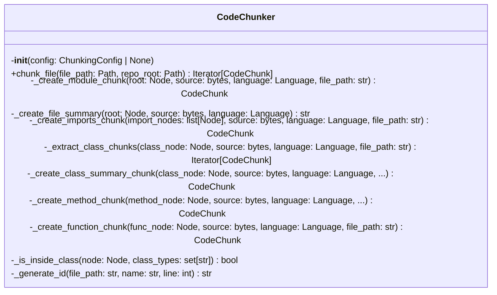

# Chunker Module

## File Overview

The `chunker.py` module provides code chunking functionality for the local_deepwiki system. It contains the CodeChunker class that breaks down source code files into logical chunks for processing and analysis. The module works with tree-sitter parsed code to identify and extract meaningful code segments.

## Classes

### CodeChunker

The CodeChunker class is responsible for parsing source code files and breaking them down into logical chunks such as functions, classes, and other code constructs.

**Key Dependencies:**
- Uses [CodeParser](parser.md) for parsing source code
- Integrates with [ChunkingConfig](../config.md) for configuration settings
- Produces [CodeChunk](../models.md) objects as output

## Functions

### get_parent_classes

A utility function that appears to be related to identifying parent class relationships in the code structure.

## Usage Examples

Based on the imports and class structure, the typical usage pattern would involve:

```python
from local_deepwiki.core.chunker import CodeChunker

# Initialize chunker with a language
chunker = CodeChunker(language)

# Process a code file to generate chunks
chunks = chunker.chunk_file(file_path)
```

## Related Components

This module integrates with several other components in the local_deepwiki system:

- **[CodeParser](parser.md)**: Used for parsing source code with tree-sitter
- **[ChunkingConfig](../config.md)**: Provides configuration settings for chunking behavior
- **[CodeChunk](../models.md)**: The output model representing individual code chunks
- **[ChunkType](../models.md)**: Enumeration defining different types of code chunks
- **[Language](../models.md)**: Enumeration for supported programming languages

The module also uses utility functions from the parser module:
- [`find_nodes_by_type`](parser.md): For locating specific node types in the syntax tree
- [`get_docstring`](parser.md): For extracting documentation strings
- [`get_node_name`](parser.md): For retrieving node names
- [`get_node_text`](parser.md): For extracting text content from nodes

## Technical Details

The module uses tree-sitter for syntax analysis and includes hash-based functionality (via hashlib) likely for chunk identification or deduplication purposes. It follows a structured approach to code analysis by leveraging the abstract syntax tree representation of source code files.

## API Reference

### class `CodeChunker`

Extract semantic code chunks from source files using AST analysis.

**Methods:**


<details>
<summary>View Source (lines 200-600) | <a href="https://github.com/UrbanDiver/local-deepwiki-mcp/blob/feature/wiki-enhancements-round2/src/local_deepwiki/core/chunker.py#L200-L600">GitHub</a></summary>

```python
class CodeChunker:
    # Methods: __init__, chunk_file, _create_module_chunk, _create_file_summary, _create_imports_chunk, _extract_class_chunks, _create_class_summary_chunk, _create_method_chunk, _create_function_chunk, _is_inside_class, _generate_id
```

</details>

#### `__init__`

```python
def __init__(config: ChunkingConfig | None = None)
```

Initialize the chunker.


| [Parameter](../generators/api_docs.md) | Type | Default | Description |
|-----------|------|---------|-------------|
| `config` | `ChunkingConfig | None` | `None` | Optional chunking configuration. |


<details>
<summary>View Source (lines 203-210) | <a href="https://github.com/UrbanDiver/local-deepwiki-mcp/blob/feature/wiki-enhancements-round2/src/local_deepwiki/core/chunker.py#L203-L210">GitHub</a></summary>

```python
def __init__(self, config: ChunkingConfig | None = None):
        """Initialize the chunker.

        Args:
            config: Optional chunking configuration.
        """
        self.config = config or get_config().chunking
        self.parser = CodeParser()
```

</details>

#### `chunk_file`

```python
def chunk_file(file_path: Path, repo_root: Path) -> Iterator[CodeChunk]
```

Extract code chunks from a source file.


| [Parameter](../generators/api_docs.md) | Type | Default | Description |
|-----------|------|---------|-------------|
| `file_path` | `Path` | - | Path to the source file. |
| `repo_root` | `Path` | - | Root directory of the repository. |


---


<details>
<summary>View Source (lines 212-250) | <a href="https://github.com/UrbanDiver/local-deepwiki-mcp/blob/feature/wiki-enhancements-round2/src/local_deepwiki/core/chunker.py#L212-L250">GitHub</a></summary>

```python
def chunk_file(self, file_path: Path, repo_root: Path) -> Iterator[CodeChunk]:
        """Extract code chunks from a source file.

        Args:
            file_path: Path to the source file.
            repo_root: Root directory of the repository.

        Yields:
            CodeChunk objects for each semantic unit found.
        """
        result = self.parser.parse_file(file_path)
        if result is None:
            logger.debug(f"Skipping unsupported file: {file_path}")
            return

        root, language, source = result
        rel_path = str(file_path.relative_to(repo_root))
        logger.debug(f"Chunking {rel_path} ({language.value})")

        # Extract module-level chunk (file overview)
        yield self._create_module_chunk(root, source, language, rel_path)

        # Extract imports
        import_types = IMPORT_NODE_TYPES.get(language, set())
        import_nodes = find_nodes_by_type(root, import_types)
        if import_nodes:
            yield self._create_imports_chunk(import_nodes, source, language, rel_path)

        # Extract classes and their methods
        class_types = CLASS_NODE_TYPES.get(language, set())
        for class_node in find_nodes_by_type(root, class_types):
            yield from self._extract_class_chunks(class_node, source, language, rel_path)

        # Extract top-level functions (not inside classes)
        function_types = FUNCTION_NODE_TYPES.get(language, set())
        for func_node in find_nodes_by_type(root, function_types):
            # Skip if inside a class (already processed)
            if not self._is_inside_class(func_node, class_types):
                yield self._create_function_chunk(func_node, source, language, rel_path)
```

</details>

### Functions

#### `get_parent_classes`

```python
def get_parent_classes(class_node: Node, source: bytes, language: Language) -> list[str]
```

Extract parent class names from a class definition.


| [Parameter](../generators/api_docs.md) | Type | Default | Description |
|-----------|------|---------|-------------|
| `class_node` | `Node` | - | The class AST node. |
| `source` | `bytes` | - | Source bytes. |
| `language` | [`Language`](../models.md) | - | Programming language. |

**Returns:** `list[str]`


<details>
<summary>View Source (lines 94-197) | <a href="https://github.com/UrbanDiver/local-deepwiki-mcp/blob/feature/wiki-enhancements-round2/src/local_deepwiki/core/chunker.py#L94-L197">GitHub</a></summary>

```python
def get_parent_classes(class_node: Node, source: bytes, language: Language) -> list[str]:
    """Extract parent class names from a class definition.

    Args:
        class_node: The class AST node.
        source: Source bytes.
        language: Programming language.

    Returns:
        List of parent class names.
    """
    parents = []

    if language == Language.PYTHON:
        # Python: class Child(Parent, Mixin): → argument_list > identifier
        for child in class_node.children:
            if child.type == "argument_list":
                for arg in child.children:
                    if arg.type == "identifier":
                        parents.append(get_node_text(arg, source))

    elif language in (Language.TYPESCRIPT, Language.JAVASCRIPT):
        # TS/JS: class Child extends Parent implements Interface
        for child in class_node.children:
            if child.type == "class_heritage":
                for clause in child.children:
                    if clause.type in ("extends_clause", "implements_clause"):
                        for item in clause.children:
                            if item.type in ("identifier", "type_identifier"):
                                parents.append(get_node_text(item, source))

    elif language == Language.JAVA:
        # Java: class Child extends Parent implements Interface
        for child in class_node.children:
            if child.type == "superclass":
                for item in child.children:
                    if item.type == "type_identifier":
                        parents.append(get_node_text(item, source))
            elif child.type == "super_interfaces":
                for item in find_nodes_by_type(child, {"type_identifier"}):
                    parents.append(get_node_text(item, source))

    elif language == Language.SWIFT:
        # Swift: class Child: Parent, Protocol
        for child in class_node.children:
            if child.type == "type_inheritance_clause":
                for item in child.children:
                    if item.type in ("user_type", "type_identifier"):
                        # Get the identifier from user_type
                        text = get_node_text(item, source)
                        if text and text not in (":", ","):
                            parents.append(text)

    elif language == Language.CPP:
        # C++: class Child : public Parent
        for child in class_node.children:
            if child.type == "base_class_clause":
                for item in find_nodes_by_type(child, {"type_identifier"}):
                    parents.append(get_node_text(item, source))

    elif language == Language.RUBY:
        # Ruby: class Child < Parent
        for child in class_node.children:
            if child.type == "superclass":
                for sc in child.children:
                    if sc.type == "constant" or sc.type == "scope_resolution":
                        parents.append(get_node_text(sc, source))

    elif language == Language.PHP:
        # PHP: class Child extends Parent implements Interface1, Interface2
        for child in class_node.children:
            if child.type == "base_clause":
                # extends clause
                for item in find_nodes_by_type(child, {"name", "qualified_name"}):
                    parents.append(get_node_text(item, source))
            elif child.type == "class_interface_clause":
                # implements clause
                for item in find_nodes_by_type(child, {"name", "qualified_name"}):
                    parents.append(get_node_text(item, source))

    elif language == Language.KOTLIN:
        # Kotlin: class Child : Parent(), Interface1, Interface2
        for child in class_node.children:
            if child.type == "delegation_specifiers":
                for spec in child.children:
                    if spec.type == "delegation_specifier":
                        for item in find_nodes_by_type(spec, {"user_type", "simple_identifier"}):
                            text = get_node_text(item, source)
                            if text and text not in (":", ","):
                                parents.append(text)
                                break  # Only get the type name, not nested parts

    elif language == Language.CSHARP:
        # C#: class Child : Parent, IInterface1, IInterface2
        for child in class_node.children:
            if child.type == "base_list":
                for item in find_nodes_by_type(
                    child, {"identifier", "generic_name", "qualified_name"}
                ):
                    text = get_node_text(item, source)
                    if text:
                        parents.append(text)

    return parents
```

</details>

## Class Diagram



## Call Graph

```mermaid
flowchart TD
    N0[CodeChunk]
    N1[CodeChunker.__init__]
    N2[CodeChunker._create_class_s...]
    N3[CodeChunker._create_file_su...]
    N4[CodeChunker._create_functio...]
    N5[CodeChunker._create_imports...]
    N6[CodeChunker._create_method_...]
    N7[CodeChunker._create_module_...]
    N8[CodeChunker._extract_class_...]
    N9[CodeChunker._generate_id]
    N10[CodeChunker.chunk_file]
    N11[CodeParser]
    N12[Path]
    N13[_create_class_summary_chunk]
    N14[_create_file_summary]
    N15[_create_function_chunk]
    N16[_create_imports_chunk]
    N17[_create_method_chunk]
    N18[_create_module_chunk]
    N19[_extract_class_chunks]
    N20[_generate_id]
    N21[_is_inside_class]
    N22[find_nodes_by_type]
    N23[get_config]
    N24[get_docstring]
    N25[get_node_name]
    N26[get_node_text]
    N27[get_parent_classes]
    N28[parse_file]
    N29[relative_to]
    N27 --> N26
    N27 --> N22
    N1 --> N23
    N1 --> N11
    N10 --> N28
    N10 --> N29
    N10 --> N18
    N10 --> N22
    N10 --> N16
    N10 --> N19
    N10 --> N21
    N10 --> N15
    N7 --> N26
    N7 --> N14
    N7 --> N20
    N7 --> N0
    N7 --> N12
    N3 --> N22
    N3 --> N26
    N3 --> N25
    N3 --> N21
    N5 --> N26
    N5 --> N20
    N5 --> N0
    N8 --> N25
    N8 --> N24
    N8 --> N26
    N8 --> N27
    N8 --> N13
    N8 --> N22
    N8 --> N17
    N8 --> N20
    N8 --> N0
    N2 --> N22
    N2 --> N25
    N2 --> N20
    N2 --> N0
    N6 --> N25
    N6 --> N26
    N6 --> N24
    N6 --> N20
    N6 --> N0
    N4 --> N25
    N4 --> N26
    N4 --> N24
    N4 --> N20
    N4 --> N0
    classDef func fill:#e1f5fe
    class N0,N11,N12,N13,N14,N15,N16,N17,N18,N19,N20,N21,N22,N23,N24,N25,N26,N27,N28,N29 func
    classDef method fill:#fff3e0
    class N1,N2,N3,N4,N5,N6,N7,N8,N9,N10 method
```



## Used By

Functions and methods in this file and their callers:

- **[`CodeChunk`](../models.md)**: called by `CodeChunker._create_class_summary_chunk`, `CodeChunker._create_function_chunk`, `CodeChunker._create_imports_chunk`, `CodeChunker._create_method_chunk`, `CodeChunker._create_module_chunk`, `CodeChunker._extract_class_chunks`
- **[`CodeParser`](parser.md)**: called by `CodeChunker.__init__`
- **`Path`**: called by `CodeChunker._create_module_chunk`
- **`_create_class_summary_chunk`**: called by `CodeChunker._extract_class_chunks`
- **`_create_file_summary`**: called by `CodeChunker._create_module_chunk`
- **`_create_function_chunk`**: called by `CodeChunker.chunk_file`
- **`_create_imports_chunk`**: called by `CodeChunker.chunk_file`
- **`_create_method_chunk`**: called by `CodeChunker._extract_class_chunks`
- **`_create_module_chunk`**: called by `CodeChunker.chunk_file`
- **`_extract_class_chunks`**: called by `CodeChunker.chunk_file`
- **`_generate_id`**: called by `CodeChunker._create_class_summary_chunk`, `CodeChunker._create_function_chunk`, `CodeChunker._create_imports_chunk`, `CodeChunker._create_method_chunk`, `CodeChunker._create_module_chunk`, `CodeChunker._extract_class_chunks`
- **`_is_inside_class`**: called by `CodeChunker._create_file_summary`, `CodeChunker.chunk_file`
- **`decode`**: called by `CodeChunker._create_class_summary_chunk`
- **`encode`**: called by `CodeChunker._generate_id`
- **[`find_nodes_by_type`](parser.md)**: called by `CodeChunker._create_class_summary_chunk`, `CodeChunker._create_file_summary`, `CodeChunker._extract_class_chunks`, `CodeChunker.chunk_file`, `get_parent_classes`
- **[`get_config`](../config.md)**: called by `CodeChunker.__init__`
- **[`get_docstring`](parser.md)**: called by `CodeChunker._create_function_chunk`, `CodeChunker._create_method_chunk`, `CodeChunker._extract_class_chunks`
- **[`get_node_name`](parser.md)**: called by `CodeChunker._create_class_summary_chunk`, `CodeChunker._create_file_summary`, `CodeChunker._create_function_chunk`, `CodeChunker._create_method_chunk`, `CodeChunker._extract_class_chunks`
- **[`get_node_text`](parser.md)**: called by `CodeChunker._create_file_summary`, `CodeChunker._create_function_chunk`, `CodeChunker._create_imports_chunk`, `CodeChunker._create_method_chunk`, `CodeChunker._create_module_chunk`, `CodeChunker._extract_class_chunks`, `get_parent_classes`
- **`get_parent_classes`**: called by `CodeChunker._extract_class_chunks`
- **`hexdigest`**: called by `CodeChunker._generate_id`
- **`parse_file`**: called by `CodeChunker.chunk_file`
- **`relative_to`**: called by `CodeChunker.chunk_file`
- **`sha256`**: called by `CodeChunker._generate_id`

## Usage Examples

*Examples extracted from test files*

### Test chunking a Python file

From `test_chunker.py::test_chunk_python_file`:

```python
chunks = list(self.chunker.chunk_file(test_file, tmp_path))

# Should have: module, imports, function, class
assert len(chunks) >= 3
```

### Test chunking a Python file

From `test_chunker.py::test_chunk_python_file`:

```python
# Should have: module, imports, function, class
assert len(chunks) >= 3
```

### Test chunking a Python file

From `test_chunker.py::test_chunk_python_file`:

```python
def __init__(self, prefix: str = "Hello"):
        self.prefix = prefix

    def greet(self, name: str) -> str:
        """Greet someone."""
        return f"{self.prefix}, {name}!"
'''
        test_file = tmp_path / "test.py"
        test_file.write_text(code)

        chunks = list(self.chunker.chunk_file(test_file, tmp_path))

        # Should have: module, imports, function, class
        assert len(chunks) >= 3
```

### Test chunking a Python file

From `test_chunker.py::test_chunk_python_file`:

```python
chunks = list(self.chunker.chunk_file(test_file, tmp_path))

# Should have: module, imports, function, class
assert len(chunks) >= 3
```

### Test that function names are extracted

From `test_chunker.py::test_chunk_extracts_function_names`:

```python
chunks = list(self.chunker.chunk_file(test_file, tmp_path))
function_chunks = [c for c in chunks if c.chunk_type == ChunkType.FUNCTION]

function_names = {c.name for c in function_chunks}
assert "process_data" in function_names
```


## Additional Source Code

Source code for functions and methods not listed in the API Reference above.

#### `_create_module_chunk`

<details>
<summary>View Source (lines 252-296) | <a href="https://github.com/UrbanDiver/local-deepwiki-mcp/blob/feature/wiki-enhancements-round2/src/local_deepwiki/core/chunker.py#L252-L296">GitHub</a></summary>

```python
def _create_module_chunk(
        self,
        root: Node,
        source: bytes,
        language: Language,
        file_path: str,
    ) -> CodeChunk:
        """Create a chunk for the module/file overview.

        Args:
            root: AST root node.
            source: Source bytes.
            language: Programming language.
            file_path: Relative file path.

        Returns:
            A CodeChunk for the module.
        """
        # Get module docstring if present
        docstring = None
        if language == Language.PYTHON:
            # Python module docstring is first expression
            if root.children and root.children[0].type == "expression_statement":
                expr = root.children[0]
                if expr.children and expr.children[0].type == "string":
                    docstring = get_node_text(expr.children[0], source)
                    if docstring.startswith('"""') or docstring.startswith("'''"):
                        docstring = docstring[3:-3].strip()

        # Create a summary of the file structure
        content = self._create_file_summary(root, source, language)

        chunk_id = self._generate_id(file_path, "module", 0)
        return CodeChunk(
            id=chunk_id,
            file_path=file_path,
            language=language,
            chunk_type=ChunkType.MODULE,
            name=Path(file_path).stem,
            content=content,
            start_line=1,
            end_line=source.count(b"\n") + 1,
            docstring=docstring,
            metadata={"is_overview": True},
        )
```

</details>


#### `_create_file_summary`

<details>
<summary>View Source (lines 298-338) | <a href="https://github.com/UrbanDiver/local-deepwiki-mcp/blob/feature/wiki-enhancements-round2/src/local_deepwiki/core/chunker.py#L298-L338">GitHub</a></summary>

```python
def _create_file_summary(self, root: Node, source: bytes, language: Language) -> str:
        """Create a summary of file structure for the module chunk.

        Args:
            root: AST root node.
            source: Source bytes.
            language: Programming language.

        Returns:
            A summary string of file contents.
        """
        parts = []

        # List imports
        import_types = IMPORT_NODE_TYPES.get(language, set())
        imports = find_nodes_by_type(root, import_types)
        if imports:
            import_text = "\n".join(get_node_text(n, source) for n in imports[:10])
            if len(imports) > 10:
                import_text += f"\n# ... and {len(imports) - 10} more imports"
            parts.append(f"# Imports:\n{import_text}")

        # List classes
        class_types = CLASS_NODE_TYPES.get(language, set())
        classes = find_nodes_by_type(root, class_types)
        if classes:
            class_names = [get_node_name(c, source, language) or "anonymous" for c in classes]
            parts.append(f"# Classes: {', '.join(class_names)}")

        # List functions
        function_types = FUNCTION_NODE_TYPES.get(language, set())
        functions = [
            f
            for f in find_nodes_by_type(root, function_types)
            if not self._is_inside_class(f, class_types)
        ]
        if functions:
            func_names = [get_node_name(f, source, language) or "anonymous" for f in functions]
            parts.append(f"# Functions: {', '.join(func_names)}")

        return "\n\n".join(parts) if parts else "# Empty file"
```

</details>


#### `_create_imports_chunk`

<details>
<summary>View Source (lines 340-373) | <a href="https://github.com/UrbanDiver/local-deepwiki-mcp/blob/feature/wiki-enhancements-round2/src/local_deepwiki/core/chunker.py#L340-L373">GitHub</a></summary>

```python
def _create_imports_chunk(
        self,
        import_nodes: list[Node],
        source: bytes,
        language: Language,
        file_path: str,
    ) -> CodeChunk:
        """Create a chunk for import statements.

        Args:
            import_nodes: List of import nodes.
            source: Source bytes.
            language: Programming language.
            file_path: Relative file path.

        Returns:
            A CodeChunk for imports.
        """
        content = "\n".join(get_node_text(n, source) for n in import_nodes)
        start_line = min(n.start_point[0] + 1 for n in import_nodes)
        end_line = max(n.end_point[0] + 1 for n in import_nodes)

        chunk_id = self._generate_id(file_path, "imports", start_line)
        return CodeChunk(
            id=chunk_id,
            file_path=file_path,
            language=language,
            chunk_type=ChunkType.IMPORT,
            name="imports",
            content=content,
            start_line=start_line,
            end_line=end_line,
            metadata={"import_count": len(import_nodes)},
        )
```

</details>


#### `_extract_class_chunks`

<details>
<summary>View Source (lines 375-433) | <a href="https://github.com/UrbanDiver/local-deepwiki-mcp/blob/feature/wiki-enhancements-round2/src/local_deepwiki/core/chunker.py#L375-L433">GitHub</a></summary>

```python
def _extract_class_chunks(
        self,
        class_node: Node,
        source: bytes,
        language: Language,
        file_path: str,
    ) -> Iterator[CodeChunk]:
        """Extract chunks from a class definition.

        Args:
            class_node: The class AST node.
            source: Source bytes.
            language: Programming language.
            file_path: Relative file path.

        Yields:
            CodeChunks for the class and its methods.
        """
        class_name = get_node_name(class_node, source, language) or "anonymous"
        docstring = get_docstring(class_node, source, language)
        content = get_node_text(class_node, source)

        # Extract parent classes for inheritance
        parent_classes = get_parent_classes(class_node, source, language)

        # Check if class is too large and needs to be split
        lines = content.count("\n") + 1
        if lines > self.config.class_split_threshold:
            # For large classes, create a summary chunk and method chunks
            yield self._create_class_summary_chunk(
                class_node, source, language, file_path, class_name, docstring, parent_classes
            )

            # Extract methods separately
            function_types = FUNCTION_NODE_TYPES.get(language, set())
            for method_node in find_nodes_by_type(class_node, function_types):
                yield self._create_method_chunk(
                    method_node, source, language, file_path, class_name
                )
        else:
            # Small class - include everything in one chunk
            chunk_id = self._generate_id(
                file_path, f"class_{class_name}", class_node.start_point[0]
            )
            metadata: dict[str, int | list[str]] = {"line_count": lines}
            if parent_classes:
                metadata["parent_classes"] = parent_classes
            yield CodeChunk(
                id=chunk_id,
                file_path=file_path,
                language=language,
                chunk_type=ChunkType.CLASS,
                name=class_name,
                content=content,
                start_line=class_node.start_point[0] + 1,
                end_line=class_node.end_point[0] + 1,
                docstring=docstring,
                metadata=metadata,
            )
```

</details>


#### `_create_class_summary_chunk`

<details>
<summary>View Source (lines 435-494) | <a href="https://github.com/UrbanDiver/local-deepwiki-mcp/blob/feature/wiki-enhancements-round2/src/local_deepwiki/core/chunker.py#L435-L494">GitHub</a></summary>

```python
def _create_class_summary_chunk(
        self,
        class_node: Node,
        source: bytes,
        language: Language,
        file_path: str,
        class_name: str,
        docstring: str | None,
        parent_classes: list[str] | None = None,
    ) -> CodeChunk:
        """Create a summary chunk for a large class.

        Args:
            class_node: The class AST node.
            source: Source bytes.
            language: Programming language.
            file_path: Relative file path.
            class_name: Name of the class.
            docstring: Class docstring if any.
            parent_classes: List of parent class names.

        Returns:
            A summary CodeChunk for the class.
        """
        # Get class signature and method list
        function_types = FUNCTION_NODE_TYPES.get(language, set())
        methods = find_nodes_by_type(class_node, function_types)
        method_names = [get_node_name(m, source, language) or "anonymous" for m in methods]

        # Build summary content
        signature_end = class_node.start_byte
        for child in class_node.children:
            if child.type in ("block", "class_body", "declaration_list"):
                signature_end = child.start_byte
                break

        signature = (
            source[class_node.start_byte : signature_end].decode("utf-8", errors="replace").strip()
        )
        content = f"{signature}\n    # Methods: {', '.join(method_names)}"

        chunk_id = self._generate_id(file_path, f"class_{class_name}", class_node.start_point[0])
        metadata: dict[str, bool | int | list[str]] = {
            "is_summary": True,
            "method_count": len(methods),
        }
        if parent_classes:
            metadata["parent_classes"] = parent_classes
        return CodeChunk(
            id=chunk_id,
            file_path=file_path,
            language=language,
            chunk_type=ChunkType.CLASS,
            name=class_name,
            content=content,
            start_line=class_node.start_point[0] + 1,
            end_line=class_node.end_point[0] + 1,
            docstring=docstring,
            metadata=metadata,
        )
```

</details>


#### `_create_method_chunk`

<details>
<summary>View Source (lines 496-534) | <a href="https://github.com/UrbanDiver/local-deepwiki-mcp/blob/feature/wiki-enhancements-round2/src/local_deepwiki/core/chunker.py#L496-L534">GitHub</a></summary>

```python
def _create_method_chunk(
        self,
        method_node: Node,
        source: bytes,
        language: Language,
        file_path: str,
        class_name: str,
    ) -> CodeChunk:
        """Create a chunk for a class method.

        Args:
            method_node: The method AST node.
            source: Source bytes.
            language: Programming language.
            file_path: Relative file path.
            class_name: Name of the parent class.

        Returns:
            A CodeChunk for the method.
        """
        method_name = get_node_name(method_node, source, language) or "anonymous"
        content = get_node_text(method_node, source)
        docstring = get_docstring(method_node, source, language)

        chunk_id = self._generate_id(
            file_path, f"{class_name}.{method_name}", method_node.start_point[0]
        )
        return CodeChunk(
            id=chunk_id,
            file_path=file_path,
            language=language,
            chunk_type=ChunkType.METHOD,
            name=method_name,
            content=content,
            start_line=method_node.start_point[0] + 1,
            end_line=method_node.end_point[0] + 1,
            docstring=docstring,
            parent_name=class_name,
        )
```

</details>


#### `_create_function_chunk`

<details>
<summary>View Source (lines 536-569) | <a href="https://github.com/UrbanDiver/local-deepwiki-mcp/blob/feature/wiki-enhancements-round2/src/local_deepwiki/core/chunker.py#L536-L569">GitHub</a></summary>

```python
def _create_function_chunk(
        self,
        func_node: Node,
        source: bytes,
        language: Language,
        file_path: str,
    ) -> CodeChunk:
        """Create a chunk for a top-level function.

        Args:
            func_node: The function AST node.
            source: Source bytes.
            language: Programming language.
            file_path: Relative file path.

        Returns:
            A CodeChunk for the function.
        """
        func_name = get_node_name(func_node, source, language) or "anonymous"
        content = get_node_text(func_node, source)
        docstring = get_docstring(func_node, source, language)

        chunk_id = self._generate_id(file_path, f"func_{func_name}", func_node.start_point[0])
        return CodeChunk(
            id=chunk_id,
            file_path=file_path,
            language=language,
            chunk_type=ChunkType.FUNCTION,
            name=func_name,
            content=content,
            start_line=func_node.start_point[0] + 1,
            end_line=func_node.end_point[0] + 1,
            docstring=docstring,
        )
```

</details>


#### `_is_inside_class`

<details>
<summary>View Source (lines 571-586) | <a href="https://github.com/UrbanDiver/local-deepwiki-mcp/blob/feature/wiki-enhancements-round2/src/local_deepwiki/core/chunker.py#L571-L586">GitHub</a></summary>

```python
def _is_inside_class(self, node: Node, class_types: set[str]) -> bool:
        """Check if a node is inside a class definition.

        Args:
            node: The node to check.
            class_types: Set of class node type names.

        Returns:
            True if the node is inside a class.
        """
        parent = node.parent
        while parent:
            if parent.type in class_types:
                return True
            parent = parent.parent
        return False
```

</details>


#### `_generate_id`

<details>
<summary>View Source (lines 588-600) | <a href="https://github.com/UrbanDiver/local-deepwiki-mcp/blob/feature/wiki-enhancements-round2/src/local_deepwiki/core/chunker.py#L588-L600">GitHub</a></summary>

```python
def _generate_id(self, file_path: str, name: str, line: int) -> str:
        """Generate a unique chunk ID.

        Args:
            file_path: File path.
            name: Chunk name.
            line: Line number.

        Returns:
            A unique ID string.
        """
        key = f"{file_path}:{name}:{line}"
        return hashlib.sha256(key.encode()).hexdigest()[:16]
```

</details>

## Relevant Source Files

- `src/local_deepwiki/core/chunker.py:200-600`

## See Also

- [callgraph](../generators/callgraph.md) - uses this
- [api_docs](../generators/api_docs.md) - uses this
- [logging](../logging.md) - dependency
- [models](../models.md) - dependency
- [test_examples](../generators/test_examples.md) - shares 5 dependencies
