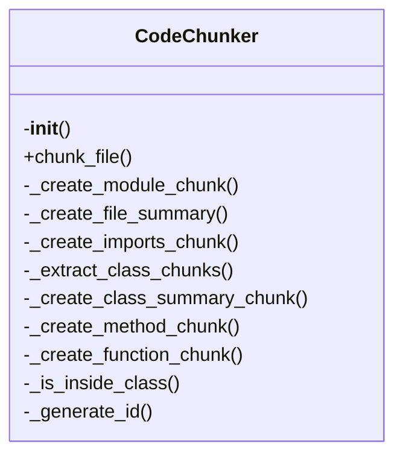

# Code Chunker Documentation

## File Overview

This file implements the core chunking functionality for code files. It provides the CodeChunker class responsible for breaking down code files into meaningful semantic chunks based on the programming language structure. The chunker works with tree-sitter parsers to analyze code syntax and extract relevant code elements such as functions, classes, methods, and their associated documentation.

The chunker integrates with the configuration system to determine chunking strategies and works closely with the parser module to extract node information. It produces [CodeChunk](../models.md) objects that can be used for indexing, retrieval, or other downstream processing tasks.

## Classes

### CodeChunker

The CodeChunker class is responsible for analyzing code files and splitting them into semantic chunks based on language-specific structures. It uses tree-sitter parsing to identify code elements and applies configured chunking strategies to create meaningful portions of code for indexing and retrieval.

Key methods:
- `chunk_file`: Processes a code file and yields [CodeChunk](../models.md) objects
- `chunk_node`: Recursively chunks a tree-sitter node and its children
- `get_chunk_type`: Determines the appropriate chunk type for a given node

**Relationships**: This class works with [CodeParser](parser.md) to analyze code structure, uses [ChunkingConfig](../config.md) for configuration settings, and produces [CodeChunk](../models.md) objects for storage and retrieval systems.

## Functions

### get_parent_classes

```python
def get_parent_classes(node: Node, parser: CodeParser) -> list[str]:
```

Retrieves the names of parent classes for a given node in the tree-sitter AST. This function is used to understand inheritance relationships when chunking class definitions.

**Parameters:**
- `node`: The tree-sitter Node representing a class definition
- `parser`: The [CodeParser](parser.md) instance used to analyze the node

**Returns:**
- A list of strings representing parent class names

## Usage Examples

### Basic Usage

```python
from local_deepwiki.core.chunker import CodeChunker
from local_deepwiki.config import get_config

# Initialize chunker with default configuration
chunker = CodeChunker()

# Process a Python file
file_path = Path("example.py")
chunks = list(chunker.chunk_file(file_path, Language.PYTHON))

for chunk in chunks:
    print(f"Chunk type: {chunk.chunk_type}")
    print(f"Content: {chunk.content[:100]}...")
```

### Using Custom Configuration

```python
from local_deepwiki.core.chunker import CodeChunker
from local_deepwiki.config import ChunkingConfig, get_config

# Create custom chunking configuration
config = ChunkingConfig(
    max_chunk_size=1000,
    min_chunk_size=100,
    include_docstrings=True
)

# Initialize chunker with custom config
chunker = CodeChunker(config)

# Process a file with custom settings
file_path = Path("example.py")
chunks = list(chunker.chunk_file(file_path, Language.PYTHON))
```

## Related Components

This class works with [CodeParser](parser.md) to analyze code structure and extract node information. It integrates with [ChunkingConfig](../config.md) to determine chunking behavior and produces [CodeChunk](../models.md) objects that can be consumed by storage systems like [VectorStore](vectorstore.md) for embedding and retrieval. The chunker also relies on [get_config](../config.md) for accessing global configuration settings and uses [get_node_text](parser.md), [get_node_name](parser.md), and [get_docstring](parser.md) functions from the parser module for extracting specific node information.

## API Reference

### class `CodeChunker`

Extract semantic code chunks from source files using AST analysis.

**Methods:**

#### `__init__`

```python
def __init__(config: ChunkingConfig | None = None)
```

Initialize the chunker.


| [Parameter](../generators/api_docs.md) | Type | Default | Description |
|-----------|------|---------|-------------|
| `config` | `ChunkingConfig | None` | `None` | Optional chunking configuration. |

#### `chunk_file`

```python
def chunk_file(file_path: Path, repo_root: Path) -> Iterator[CodeChunk]
```

Extract code chunks from a source file.


| [Parameter](../generators/api_docs.md) | Type | Default | Description |
|-----------|------|---------|-------------|
| `file_path` | `Path` | - | Path to the source file. |
| `repo_root` | `Path` | - | Root directory of the repository. |


---

### Functions

#### `get_parent_classes`

```python
def get_parent_classes(class_node: Node, source: bytes, language: Language) -> list[str]
```

Extract parent class names from a class definition.


| [Parameter](../generators/api_docs.md) | Type | Default | Description |
|-----------|------|---------|-------------|
| `class_node` | `Node` | - | The class AST node. |
| `source` | `bytes` | - | Source bytes. |
| `language` | [`Language`](../models.md) | - | Programming language. |

**Returns:** `list[str]`


## Class Diagram



## Call Graph

```mermaid
flowchart TD
    N0[CodeChunk]
    N1[CodeChunker.__init__]
    N2[CodeChunker._create_class_s...]
    N3[CodeChunker._create_file_su...]
    N4[CodeChunker._create_functio...]
    N5[CodeChunker._create_imports...]
    N6[CodeChunker._create_method_...]
    N7[CodeChunker._create_module_...]
    N8[CodeChunker._extract_class_...]
    N9[CodeChunker._generate_id]
    N10[CodeChunker.chunk_file]
    N11[CodeParser]
    N12[Path]
    N13[_create_class_summary_chunk]
    N14[_create_file_summary]
    N15[_create_function_chunk]
    N16[_create_imports_chunk]
    N17[_create_method_chunk]
    N18[_create_module_chunk]
    N19[_extract_class_chunks]
    N20[_generate_id]
    N21[_is_inside_class]
    N22[find_nodes_by_type]
    N23[get_config]
    N24[get_docstring]
    N25[get_node_name]
    N26[get_node_text]
    N27[get_parent_classes]
    N28[parse_file]
    N29[relative_to]
    N27 --> N26
    N27 --> N22
    N1 --> N23
    N1 --> N11
    N10 --> N28
    N10 --> N29
    N10 --> N18
    N10 --> N22
    N10 --> N16
    N10 --> N19
    N10 --> N21
    N10 --> N15
    N7 --> N26
    N7 --> N14
    N7 --> N20
    N7 --> N0
    N7 --> N12
    N3 --> N22
    N3 --> N26
    N3 --> N25
    N3 --> N21
    N5 --> N26
    N5 --> N20
    N5 --> N0
    N8 --> N25
    N8 --> N24
    N8 --> N26
    N8 --> N27
    N8 --> N13
    N8 --> N22
    N8 --> N17
    N8 --> N20
    N8 --> N0
    N2 --> N22
    N2 --> N25
    N2 --> N20
    N2 --> N0
    N6 --> N25
    N6 --> N26
    N6 --> N24
    N6 --> N20
    N6 --> N0
    N4 --> N25
    N4 --> N26
    N4 --> N24
    N4 --> N20
    N4 --> N0
    classDef func fill:#e1f5fe
    class N0,N11,N12,N13,N14,N15,N16,N17,N18,N19,N20,N21,N22,N23,N24,N25,N26,N27,N28,N29 func
    classDef method fill:#fff3e0
    class N1,N2,N3,N4,N5,N6,N7,N8,N9,N10 method
```



## See Also

- [api_docs](../generators/api_docs.md) - uses this
- [test_chunker](../../../tests/test_chunker.md) - uses this
- [models](../models.md) - dependency
- [parser](parser.md) - dependency
- [config](../config.md) - dependency
