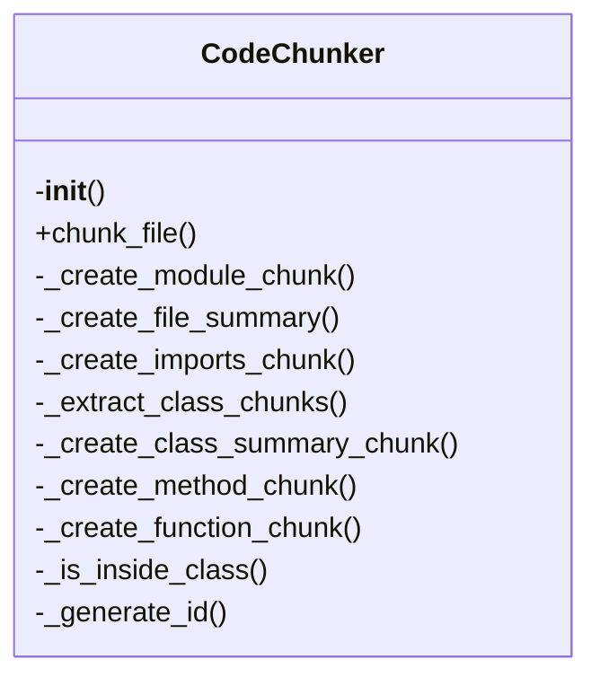

# File Overview

This file defines the core chunking functionality for processing code files. It provides the `CodeChunker` class responsible for breaking down code files into logical chunks based on various code elements like functions, classes, and methods. The chunker uses the Tree-sitter parser to analyze code structure and extract meaningful segments.

# Classes

## CodeChunker

The CodeChunker class is responsible for analyzing code files and splitting them into logical chunks based on code structure.

### Key Methods

- `chunk_file(self, file_path: Path) -> Iterator[CodeChunk]`: 
  Takes a file path and yields CodeChunk objects representing different parts of the code file.
  
- `chunk_node(self, node: Node, file_path: Path, language: Language) -> Iterator[CodeChunk]`:
  Processes a tree-sitter Node and yields CodeChunk objects for that node and its children.

### Usage Example

```python
chunker = CodeChunker()
for chunk in chunker.chunk_file(Path("example.py")):
    print(chunk.content)
```

# Functions

## get_parent_classes

```python
def get_parent_classes(node: Node) -> list[str]
```

Extracts the names of parent classes from a class definition node.

### Parameters
- `node`: A tree-sitter Node representing a class definition

### Returns
- A list of parent class names as strings

# Related Components

This file works with the following components:

- **[CodeParser](parser.md)**: Used for parsing code files and creating tree-sitter nodes
- **[ChunkingConfig](../config.md)**: Configuration settings for chunking behavior
- **CodeChunk**: Model representing a code chunk with content, type, and metadata
- **Language**: Enum defining supported programming languages
- **[get_config](../config.md)**: Function to retrieve configuration settings
- **[get_node_text](parser.md), [get_node_name](parser.md), [get_docstring](parser.md)**: Helper functions for extracting information from tree-sitter nodes
- **[find_nodes_by_type](parser.md)**: Function for finding nodes of specific types in the parse tree

The chunker integrates with the Tree-sitter parsing library to understand code structure and the local_deepwiki configuration system to control chunking behavior.

## API Reference

### class `CodeChunker`

Extract semantic code chunks from source files using AST analysis.

**Methods:**

#### `__init__`

```python
def __init__(config: ChunkingConfig | None = None)
```

Initialize the chunker.


| [Parameter](../generators/api_docs.md) | Type | Default | Description |
|-----------|------|---------|-------------|
| `config` | `ChunkingConfig | None` | `None` | Optional chunking configuration. |

#### `chunk_file`

```python
def chunk_file(file_path: Path, repo_root: Path) -> Iterator[CodeChunk]
```

Extract code chunks from a source file.


| [Parameter](../generators/api_docs.md) | Type | Default | Description |
|-----------|------|---------|-------------|
| `file_path` | `Path` | - | Path to the source file. |
| `repo_root` | `Path` | - | Root directory of the repository. |


---

### Functions

#### `get_parent_classes`

```python
def get_parent_classes(class_node: Node, source: bytes, language: Language) -> list[str]
```

Extract parent class names from a class definition.


| [Parameter](../generators/api_docs.md) | Type | Default | Description |
|-----------|------|---------|-------------|
| `class_node` | `Node` | - | The class AST node. |
| `source` | `bytes` | - | Source bytes. |
| `language` | `Language` | - | Programming language. |

**Returns:** `list[str]`


## Class Diagram



## Call Graph

```mermaid
flowchart TD
    N0[CodeChunk]
    N1[CodeChunker.__init__]
    N2[CodeChunker._create_class_s...]
    N3[CodeChunker._create_file_su...]
    N4[CodeChunker._create_functio...]
    N5[CodeChunker._create_imports...]
    N6[CodeChunker._create_method_...]
    N7[CodeChunker._create_module_...]
    N8[CodeChunker._extract_class_...]
    N9[CodeChunker._generate_id]
    N10[CodeChunker.chunk_file]
    N11[CodeParser]
    N12[Path]
    N13[_create_class_summary_chunk]
    N14[_create_file_summary]
    N15[_create_function_chunk]
    N16[_create_imports_chunk]
    N17[_create_method_chunk]
    N18[_create_module_chunk]
    N19[_extract_class_chunks]
    N20[_generate_id]
    N21[_is_inside_class]
    N22[find_nodes_by_type]
    N23[get_config]
    N24[get_docstring]
    N25[get_node_name]
    N26[get_node_text]
    N27[get_parent_classes]
    N28[parse_file]
    N29[relative_to]
    N27 --> N26
    N27 --> N22
    N1 --> N23
    N1 --> N11
    N10 --> N28
    N10 --> N29
    N10 --> N18
    N10 --> N22
    N10 --> N16
    N10 --> N19
    N10 --> N21
    N10 --> N15
    N7 --> N26
    N7 --> N14
    N7 --> N20
    N7 --> N0
    N7 --> N12
    N3 --> N22
    N3 --> N26
    N3 --> N25
    N3 --> N21
    N5 --> N26
    N5 --> N20
    N5 --> N0
    N8 --> N25
    N8 --> N24
    N8 --> N26
    N8 --> N27
    N8 --> N13
    N8 --> N22
    N8 --> N17
    N8 --> N20
    N8 --> N0
    N2 --> N22
    N2 --> N25
    N2 --> N20
    N2 --> N0
    N6 --> N25
    N6 --> N26
    N6 --> N24
    N6 --> N20
    N6 --> N0
    N4 --> N25
    N4 --> N26
    N4 --> N24
    N4 --> N20
    N4 --> N0
    classDef func fill:#e1f5fe
    class N0,N11,N12,N13,N14,N15,N16,N17,N18,N19,N20,N21,N22,N23,N24,N25,N26,N27,N28,N29 func
    classDef method fill:#fff3e0
    class N1,N2,N3,N4,N5,N6,N7,N8,N9,N10 method
```



## Relevant Source Files

- `src/local_deepwiki/core/chunker.py:162-550`

## See Also

- [api_docs](../generators/api_docs.md) - uses this
- [config](../config.md) - dependency
- [parser](parser.md) - dependency
- [wiki](../generators/wiki.md) - shares 5 dependencies
