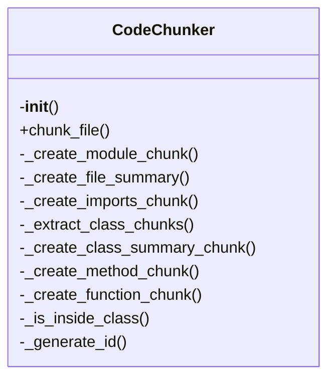

# `src/local_deepwiki/core/chunker.py`

## File Overview

This file implements the `CodeChunker` class responsible for splitting source code files into logical chunks based on AST (Abstract Syntax Tree) structure. It supports multiple programming languages and provides functionality to extract module-level information, function definitions, class definitions, and other code elements into structured `CodeChunk` objects.

## Classes

### `CodeChunker`

The `CodeChunker` class is the main component for splitting source code into logical chunks.

#### Purpose

- Parses source code using `CodeParser`
- Splits code into chunks based on AST node types
- Supports different programming languages
- Generates `CodeChunk` objects with metadata like type, name, content, and location

#### Key Methods

- `__init__(self, config: ChunkingConfig | None = None)`: Initializes the chunker with optional configuration.
- `_create_module_chunk(...)`: Creates a chunk representing the entire module/file.
- `chunk_file(...)`: Main method to process a file and generate chunks.
- `chunk_code(...)`: Processes source code string and generates chunks.
- `_chunk_function(...)`: Creates a chunk for a function definition.
- `_chunk_class(...)`: Creates a chunk for a class definition.
- `_chunk_method(...)`: Creates a chunk for a method definition.
- `_chunk_imports(...)`: Creates a chunk for import statements.
- `_chunk_constants(...)`: Creates a chunk for constants.

#### Usage Example

```python
from local_deepwiki.core.chunker import CodeChunker

chunker = CodeChunker()
source_code = "def hello():\n    print('Hello')\n"
chunks = list(chunker.chunk_code(source_code, "python", "example.py"))
for chunk in chunks:
    print(f"Chunk: {chunk.name} ({chunk.type})")
```

## Functions

### `get_parent_classes(node: Node, language: Language) -> list[str]`

#### Purpose

Retrieves the parent class names from a class definition node.

#### Parameters

- `node`: A `Node` from the AST representing a class definition.
- `language`: The programming language (used for language-specific parsing).

#### Return Value

A list of strings representing the names of parent classes.

#### Example

```python
# Assuming node represents a Python class definition
parent_classes = get_parent_classes(node, Language.PYTHON)
print(parent_classes)  # e.g., ['BaseClass', 'Mixin']
```

## Usage Examples

### Basic Usage

```python
from local_deepwiki.core.chunker import CodeChunker

chunker = CodeChunker()
code = """
def my_function():
    '''This is a docstring'''
    return True

class MyClass:
    def method(self):
        pass
"""

chunks = list(chunker.chunk_code(code, "python", "test.py"))
for chunk in chunks:
    print(f"Type: {chunk.type}, Name: {chunk.name}")
```

### With Custom Configuration

```python
from local_deepwiki.config import ChunkingConfig
from local_deepwiki.core.chunker import CodeChunker

config = ChunkingConfig(
    max_chunk_size=1000,
    include_docstrings=True,
    chunk_types=["function", "class"]
)
chunker = CodeChunker(config)
```

## Dependencies

This file imports the following components:

- `hashlib`: For generating unique identifiers
- `pathlib.Path`: For handling file paths
- `typing.Iterator`: For type hints of iterators
- `tree_sitter.Node`: For AST node handling
- `local_deepwiki.config`: Configuration handling
  - `ChunkingConfig`: Configuration schema
  - `get_config`: Function to retrieve global config
- `local_deepwiki.core.parser`: AST parsing utilities
  - `CodeParser`: Parser for source code
  - `get_node_text`: Extract text from AST node
  - `get_node_name`: Extract name from AST node
  - `get_docstring`: Extract docstring from AST node
  - `find_nodes_by_type`: Find nodes of specific type
- `local_deepwiki.models`: Data models
  - `CodeChunk`: Model for code chunks
  - `ChunkType`: Enum for chunk types
  - `Language`: Enum for supported languages

## Class Diagram



## See Also

- [test_chunker](../../../tests/test_chunker.md) - uses this
- [indexer](indexer.md) - uses this
- [models](../models.md) - dependency
- [config](../config.md) - dependency
- [parser](parser.md) - dependency
